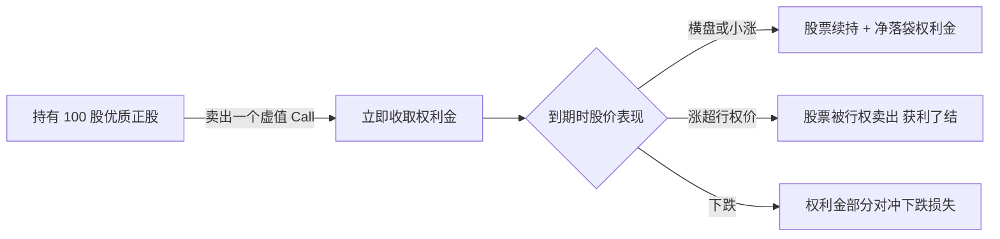
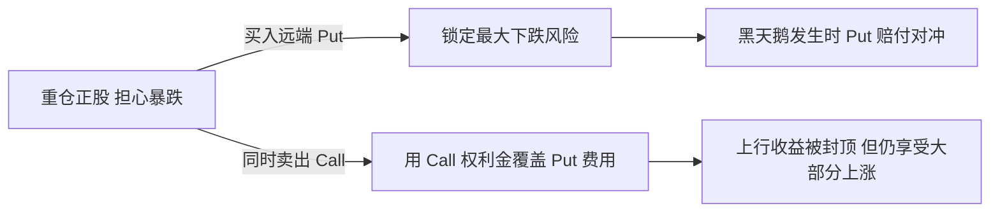

在期权市场里观察一段时间，你会发现一个反复出现的现象：绝大部分散户期权交易最终都以亏损收场。这不是耸人听闻，而是全球主要期权交易所和学术界长期观察的结论。问题出在哪？不是期权策略本身有问题，而是大多数人从一开始就用错了期权。

在这篇文章里，我从一个期权从业者的角度，把期权最核心的功能讲清楚，然后告诉你：只有这 4 种场景，才真正强烈推荐你动用期权。其他时候，请放下期权，老老实实持有正股或者持有现金。

<!--more-->

## 期权的本质是风险转移，不是预测方向

很多人把期权当成「放大杠杆赌方向」的工具，这是对期权最大的误解。期权在设计上的核心功能是两条。

第一，风险转移。期权把一部分市场风险从一方转移到另一方。买方把「我不想承担的极端下跌」风险转移给卖方，换取一段时间的保护；卖方拿到权利金，承担这份风险。

第二，时间维度的收益再分配。期权让你能在不持有正股的情况下，对一个特定价格区间表达看法，并且这种看法自带时间限制——你赌的是「在这个时间内会发生这件事」。

理解了这两点，你就会明白：期权从来不是为了「判断方向」，而是为了「管理风险」和「优化持仓结构」。

在正式讲 4 个推荐场景之前，先简单过一下期权定价的三个核心变量，否则后面你会看不懂策略之间的差异。

Delta 是期权价格对正股价格的敏感度。简单说就是股价涨 1 块，期权大概涨几毛钱。Theta 是时间衰减。期权是消耗品，每天都在贬值，越临近到期贬值得越快。隐含波动率 IV 是市场对未来波动的预期。IV 越高期权越贵，IV 越低期权越便宜。

这三个变量，决定了你在什么场景下应该选择什么策略。

## 场景一：长期持有正股时，用 Covered Call 增强收益

这是期权策略里风险最低、最适合长期投资者入门的一个。

适用前提是你手里已经持有了某只优质公司 100 股或其整数倍的正股，你打算长期持有，但短期 30 到 60 天内你判断这只股票大概率横盘或者只是温和上涨，不会出现暴涨行情。

策略结构上，你在这个持仓基础上，向上方卖出一个虚值的 Call 期权，行权价选在你愿意以这个价格卖出股票的位置。

比如你持有 100 股苹果 @ \$180，你觉得短期不太可能涨到 \$200 以上，那你就可以卖出 1 张苹果 \$200 Call，收取一笔权利金。

数学示例：假设你持有 100 股苹果 @ \$180，卖出 1 张 \$200 的 30 天 Call，收取 \$150 权利金。到期时三种结果。

第一种，股价 \$185 横盘。你净赚 \$150，股票续持，相当于每月在持仓上领取一笔现金。第二种，股价 \$210 涨超行权价。股票被以 \$200 行权卖出，扣除之前 \$180 的成本，每股赚 \$20，加上 \$150 权利金，总收益 \$2150。第三种，股价 \$160 下跌。你每股亏 \$20，权利金 \$150 部分对冲，实际每股亏损约 \$18.50。

为什么强烈推荐这个策略？因为它是期权策略里唯一可以让你无论股价怎么动都有好处的策略——涨了你赚股票收益加权利金，跌了你拿权利金对冲，横盘你白拿权利金。最大风险只是股价大涨时你少赚了，而那个价格本来就是你愿意卖出的价格。

## 场景二：准备抄底建仓时，用 Cash-Secured Put 折扣买入

这个策略的逻辑反直觉，但它非常优雅，是价值投资者最喜欢的期权策略之一。

适用前提是你看好某只股票，当前价 \$100，你认为 \$90 是非常理想的建仓价。同时你的账户里已经备好了 \$9000 现金，也就是按 \$90 买入 100 股所需要的钱，并且即使股票没跌到 \$90，你也可以接受这笔钱短期闲置。

策略结构上，你直接卖出一个 \$90 的 Put 期权，行权日选在 30 到 60 天后。

数学示例：假设苹果现价 \$180，你认为 \$170 是好建仓价，账户备好 \$17000 现金。你卖出 1 张 \$170 的 30 天 Put，收取 \$200 权利金。

到期时两种结果。第一种，股价跌到 \$165。Put 被行权，你以 \$170 买入 100 股，加上收取的 \$200 权利金，你的实际建仓成本是 \$168 每股，比 \$170 还低。第二种，股价涨到 \$190。Put 到期作废，你没买到股票，但净赚了 \$200 权利金，相当于 30 天在 \$17000 上拿到了 1.18% 的回报。

学术界对 Cash-Secured Put 的长期表现有过专门研究。比如 Springer 2023 年发表的 PUTW 策略论文就指出，长期坚持现金担保看跌策略的回报，在风险调整后甚至略优于直接持有正股。原因很简单：你收的是时间价值和波动率溢价，而这两个价值长期看都是正期望的。

为什么强烈推荐这个策略？因为它把你的「建仓意愿」变成了一笔「如果股价到目标价我就买入，并先收一笔定金」的承诺。它解决了你抄底时最大的两个心理问题：第一怕抄在半山腰，第二怕等不到目标价。

## 场景三：重仓正股时，用 Married Put 或 Collar 对冲黑天鹅

当你持仓很重，又不想卖掉，但又怕财报夜或某个宏观事件引发暴跌——这是期权最该出场的时候。

适用前提是你重仓了某只股票，比如集中持仓超过 30%，即将面临重大不确定性事件，比如财报、FDA 决议、宏观数据发布、政治事件等，你希望无论发生什么都能睡个好觉。

策略结构上有两种选择。Married Put 是指在持有正股的同时，买入一个远端的虚值 Put 期权，通常选 10% 到 20% 虚值，到期日选在事件之后。Collar 领口策略是在 Married Put 的基础上，再卖出一个远端的虚值 Call 期权，用收到的权利金去覆盖 Put 的成本。代价是你把上行收益封顶在 Call 的行权价。结构上 Collar 等于 Long Stock 加 Long Put 加 Short Call 三腿组合。

数学示例：假设你持有 1000 股某科技股 @ \$300，市值 \$30 万，即将发布财报，你担心财报夜可能暴跌 20%。

如果用 Married Put，买入 10 张 \$240 的 Put，行权日选在财报后，花费 \$5000 权利金。如果财报夜股价跌到 \$200，你的 Put 赔付 \$40000，正股亏损 \$100000，净亏 \$60000，再加权利金成本 \$65000。如果没有 Put，净亏 \$100000。

如果用 Collar，买入 10 张 \$240 Put，成本 \$5000，同时卖出 10 张 \$380 Call，收入 \$3000。净成本仅 \$2000，但上行收益被封顶在 \$380——如果财报暴涨 30%，你也只能在 \$380 卖出。

为什么强烈推荐这个策略？因为用确定的小额权利金成本（Married Put）甚至接近零成本（Collar），把正股的最大下跌风险锁定在一个已知范围。这是保险，不是赌博。黑天鹅来临时你不会被甩下车，不来时你损失的只是那笔权利金。

## 场景四：低 IV 时期，用 Debit Spread 低买高卖博突破

最后这个场景是真正「低买高卖」的机会，但需要耐心等待一个特定的市场状态。

适用前提是你观察的某只标的已经在某个区间内窄幅震荡了好几周甚至几个月，技术形态收敛。更重要的是，隐含波动率 IV Percentile 已经跌破 20%，意味着期权价格处于历史低位。这个状态下市场在装睡，随时可能因为一个消息或催化而剧烈突破。

策略结构上，买一个方向性价差。如果看涨突破就用 Bull Call Spread，也就是买入较低行权价 Call 同时卖出较高行权价 Call。如果看跌突破就用 Bear Put Spread，也就是买入较高行权价 Put 同时卖出较低行权价 Put。

数学示例：假设某股票现价 \$100，IV Percentile 等于 15%，一个月内可能向上突破。你买入 1 张 \$100 Call，花费 \$300，同时卖出 1 张 \$110 Call，收入 \$150。净成本 \$150，最大收益等于 \$110 减 \$100 减 \$150，等于 \$850，相当于 5.67 倍赔率。

到期时两种结果。第一种，股价一个月内没突破 \$100，你最多亏 \$150。第二种，股价涨到 \$115，你的价差价值最大化，净赚 \$850，相当于本金翻 5.67 倍。

为什么强烈推荐这个策略？因为低 IV 是期权最便宜的时候。用 1% 到 2% 的账户资金去博一个高赔率的突破，输了只损失固定金额，赢了有数倍回报。这才是期权最像工具而不是赌博的用法。

但这个场景有三个铁律必须遵守。第一，必须等 IV Percentile 跌破 20% 才进场，IV 高的时候期权太贵，价差策略毫无优势。第二，价差两边选相同的到期日，建议 30 到 60 天，给足时间让突破发生。第三，距离到期 14 到 21 天股价还没启动，主动平仓回收残值，不要硬扛到期归零。

## 为什么期权对散户极不友好

讲完 4 个推荐场景，必须补一段冷静的风险视角：期权被设计出来，本质上是给机构做对冲和风险管理的工具，不是散户的财富翻倍器。

印度证券交易委员会 SEBI 在强制风险披露中明确写道：在股票期货和期权板块的个人交易者中，每 10 人里有 9 人净亏损，平均每位亏损者的净交易亏损约 ₹50000（约 600 美元）。这是 SEBI 要求每个券商在开户时必须向客户披露的官方警示。美股市场的多项学术研究也得出了类似结论：个人期权买方的持仓，绝大多数最终以无价值归零收场；而个人期权卖方虽然日常胜率看起来很高，但一次黑天鹅暴跌就足以抹平过去几个月的全部盈利。

期权对散户有四个结构性劣势。第一，期权本身不创造价值。股票是「正和博弈」，随着企业盈利增长，投资者可以分享经济发展的蛋糕。期权是衍生品，只是资金在参与者之间的重新分配（零和），叠加买卖价差、手续费等摩擦成本，对散户整体就是一个持续被侵蚀的「负和游戏」。第二，散户的对手方是机构和做市商。在期权链上你的对手方绝大多数是专业机构做市商和高频量化交易，它们拥有微秒级的定价模型、希腊字母自动对冲算法和极低的资金成本，散户靠 K 线、感觉和社交媒体决策，本质上是拿着弓箭去挑战重装坦克。第三，策略的两头陷阱。做买方（Long），Theta 时间衰减是慢性毒药，股价横盘或慢涨慢跌时期权价值每天都在融化。做卖方（Short），平时胜率可能高达 80% 以上，但尾部风险是毁灭性的——一次黑天鹅暴跌就能抹掉过去几个月的全部盈利，俗称「捡钢镚遇到压路机」。第四，摩擦成本极高。很多非热门期权合约的买卖价差可达 5% 到 10%，刚建仓就已经先亏了一笔，高频开仓平仓展期会以极快的速度侵蚀账户本金。

这意味着即便你严格按上面 4 个场景操作，也必须把期权定位为辅助工具。建议将 80% 以上的资产放在正股或现金上，期权只用来增强收益或对冲风险，不要把它当成主战场。

## 总结

如果你想把期权从亏损黑洞变成持仓工具，核心只有一句话：不要把期权当成判断方向的杠杆，而要把它当成管理持仓的工具。

在绝大多数时间里，正股是你的主力持仓，期权只是用来增强收益（Covered Call）、折扣建仓（Cash-Secured Put）、锁定风险（Married Put 或 Collar）、低买高卖（Debit Spread）的辅助手段。下次你想动用期权之前，先问自己一个问题：如果我不买期权，我愿意直接买这只股票，或者拿着这笔现金等待吗。如果答案是肯定的，再根据你当前的持仓状态，从上面 4 个场景里选一个匹配的策略。如果答案是否定的，那你不是在用期权，而是在用期权赌博，这正是大部分人亏钱的根源。

## 免责声明

本文不构成任何投资建议。期权交易涉及复杂的风险，包括但不限于本金全部损失。所有策略示例均为数学说明，不保证未来收益。投资者应根据自身风险承受能力独立判断或咨询专业持牌投资顾问。