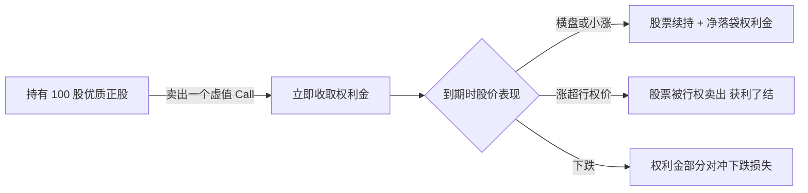
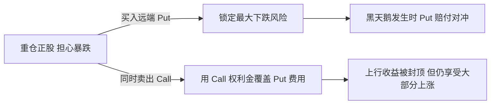

在期权市场里观察一段时间，你会发现一个反复出现的现象：绝大部分散户期权交易最终都以亏损收场，这不是耸人听闻，而是全球主要期权交易所和学术界长期观察的结论。问题出在哪？不是期权策略本身有问题，而是大多数人从一开始就用错了期权。

在这篇文章里，我从一个期权从业者的角度告诉你：只有这 4 种场景，才真正强烈推荐你动用期权。其他时候，请放下期权，老老实实持有正股或者持有现金。

<!--more-->

## 期权的本质是风险转移，不是预测方向

很多人把期权当成「放大杠杆赌方向」的工具，这是对期权最大的误解。期权在设计上的核心功能只有两条：**风险转移**——买方把不想承担的极端下跌风险转移给卖方，换取一段时间的保护；卖方收取权利金，承担这份风险。**时间维度的收益再分配**——让你能在不持有正股的情况下，对一个特定价格区间表达看法，并且这种看法自带时间限制。

理解了这两点，你就明白：期权从来不是为了「判断方向」，而是为了「管理风险」和「优化持仓结构」。

在讲 4 个场景之前，先快速过一下期权定价的三个核心变量。**Delta**：期权对正股价格的敏感度，股价涨 1 块期权大概涨几毛。**Theta**：时间衰减，期权是消耗品，越临近到期贬值得越快。**隐含波动率 IV**：市场对未来波动的预期，IV 越高期权越贵，IV 越低期权越便宜。这三个变量，决定了你在什么场景下应该选择什么策略。

## 场景一：长期持有正股时，用 Covered Call 增强收益

**适用前提**：你已持有某只优质公司 100 股或其整数倍的正股，打算长期持有，但短期 30 到 60 天内判断股价大概率横盘或温和上涨。

**策略结构**：在持仓基础上卖出一个虚值 Call，行权价选在你愿意卖出股票的位置。

**数学示例**：持有 100 股苹果 @ \$180，卖出 1 张 \$200 的 30 天 Call，收取 \$150 权利金。股价 \$185 横盘净赚 \$150；股价 \$210 涨超行权价，股票被以 \$200 行权，扣除成本每股赚 \$20，加权利金总收益 \$2150；股价 \$160 下跌，每股亏 \$20，权利金部分对冲，实际每股亏约 \$18.50。

**为什么推荐**：这是期权策略里唯一可以让你无论股价怎么动都有好处的策略——涨赚股票收益加权利金，跌拿权利金对冲，横盘白拿权利金。最大风险只是股价大涨时少赚，而那个价格本来就是你愿意卖出的位置。

## 场景二：准备抄底建仓时，用 Cash-Secured Put 折扣买入

**适用前提**：你看好某只股票（如现价 \$100），认为 \$90 是理想建仓价。同时账户已备好 \$9000 现金，且能接受这笔钱短期闲置。

**策略结构**：直接卖出一个 \$90 的 Put，行权日选在 30 到 60 天后。

**数学示例**：苹果现价 \$180，你认为 \$170 是好建仓价，账户备好 \$17000。卖出 1 张 \$170 的 30 天 Put，收取 \$200 权利金。股价跌到 \$165 时，Put 被行权，以 \$170 买入 100 股，加上权利金实际成本 \$168 每股；股价涨到 \$190，Put 作废，净赚 \$200，相当于 30 天在 \$17000 上拿到 1.18% 回报。

**为什么推荐**：把你的「建仓意愿」变成一笔「如果股价到目标价我就买入，并先收一笔定金」的承诺。它解决了你抄底时最大的两个心理问题：怕抄在半山腰，怕等不到目标价。学术界研究（如 Springer 2023 年发表的 PUTW 策略论文）也表明，长期坚持现金担保看跌策略在风险调整后回报略优于直接持有正股——你收的是时间价值和波动率溢价，而这两个价值长期看都是正期望的。

## 场景三：重仓正股时，用 Married Put 或 Collar 对冲黑天鹅

**适用前提**：你重仓了某只股票（如集中持仓超过 30%），即将面临重大不确定性事件（财报、FDA 决议、宏观数据发布等），希望无论发生什么都能睡个好觉。

**策略结构**有两种选择。**Married Put**：在持有正股的同时买入一个远端的虚值 Put（10% 到 20% 虚值），到期日选在事件之后。**Collar**：在 Married Put 基础上再卖出一个远端的虚值 Call，用 Call 权利金覆盖 Put 成本，代价是把上行收益封顶在 Call 行权价。结构上 Collar 等于 Long Stock + Long Put + Short Call 三腿组合。

**数学示例**：持有 1000 股某科技股 @ \$300，市值 \$30 万，担心财报夜暴跌 20%。用 Collar：买入 10 张 \$240 Put 花费 \$5000，卖出 10 张 \$380 Call 收入 \$3000，净成本仅 \$2000，但上行收益封顶在 \$380。财报夜股价跌到 \$200，Put 赔付 \$40000，正股亏损 \$100000，净亏 \$60000；没有 Collar 则净亏 \$100000。

**为什么推荐**：用确定的小额权利金成本（Married Put）甚至接近零成本（Collar），把正股的最大下跌风险锁定在一个已知范围。这是保险，不是赌博。黑天鹅来临时你不会被甩下车，不来时你损失的只是那笔权利金。

## 场景四：低 IV 时期，用 Debit Spread 低买高卖博突破

**适用前提**：你观察的某只标的已经在某个区间内窄幅震荡了好几周甚至几个月，技术形态收敛。更重要的是，**隐含波动率 IV Percentile 已经跌破 20%**，意味着期权价格处于历史低位——市场在装睡，随时可能因消息或催化而剧烈突破。

**策略结构**：买一个方向性价差。看涨突破用 Bull Call Spread（买低行权价 Call + 卖高行权价 Call），看跌突破用 Bear Put Spread（买高行权价 Put + 卖低行权价 Put）。

**数学示例**：某股票现价 \$100，IV Percentile 等于 15%，可能向上突破。买入 1 张 \$100 Call 花费 \$300，卖出 1 张 \$110 Call 收入 \$150，净成本 \$150，最大收益 \$850，赔率 5.67 倍。一个月内股价涨到 \$115，净赚 \$850；没突破 \$100，最多亏 \$150。

**为什么推荐**：低 IV 是期权最便宜的时候。用 1% 到 2% 的账户资金博一个高赔率的突破，输了只损失固定金额，赢了有数倍回报。这才是期权最像工具而不是赌博的用法。

但这个场景有三个铁律必须遵守。第一，必须等 IV Percentile 跌破 20% 才进场，IV 高时期权太贵，价差策略毫无优势。第二，价差两边选相同的到期日，建议 30 到 60 天，给足时间让突破发生。第三，距离到期 14 到 21 天股价还没启动，主动平仓回收残值，不要硬扛到期归零。

## 为什么期权对散户极不友好

期权被设计出来，本质上是给机构做对冲和风险管理的工具，不是散户的财富翻倍器。

印度证券交易委员会 SEBI 在强制风险披露中明确写道：在股票期货和期权板块的个人交易者中，每 10 人里有 9 人净亏损，平均每位亏损者的净交易亏损约 ₹50000（约 600 美元）。美股市场的多项学术研究也得出了类似结论：个人期权买方持仓绝大多数最终以无价值归零收场；个人期权卖方虽然日常胜率很高，但一次黑天鹅暴跌就足以抹平过去几个月的全部盈利。

散户面对四个结构性劣势。**第一**，期权本身不创造价值——股票是「正和博弈」，期权是衍生品，资金在参与者之间重新分配（零和），叠加买卖价差和手续费，对散户整体是持续被侵蚀的「负和游戏」。**第二**，对手方是机构和做市商——它们拥有微秒级定价模型、希腊字母自动对冲算法和极低的资金成本，散户靠 K 线和感觉决策本质上是拿着弓箭去挑战重装坦克。**第三**，策略的两头陷阱——做买方，Theta 时间衰减是慢性毒药；做卖方，平时胜率可能 80% 以上，但一次黑天鹅暴跌就能抹掉过去几个月的全部盈利，俗称「捡钢镚遇到压路机」。**第四**，摩擦成本极高——很多非热门期权合约的买卖价差可达 5% 到 10%，刚建仓就先亏一笔。

即便你严格按上面 4 个场景操作，也必须把期权定位为辅助工具。建议 80% 以上的资产放在正股或现金上，期权只用来增强收益或对冲风险，不要把它当成主战场。

## 总结

如果你想把期权从亏损黑洞变成持仓工具，核心只有一句话：不要把期权当成判断方向的杠杆，而要把它当成管理持仓的工具。

在绝大多数时间里，正股是你的主力持仓，期权只是用来增强收益（Covered Call）、折扣建仓（Cash-Secured Put）、锁定风险（Married Put 或 Collar）、低买高卖（Debit Spread）的辅助手段。下次你想动用期权之前，先问自己一个问题：如果我不买期权，我愿意直接买这只股票，或者拿着这笔现金等待吗？如果答案是肯定的，再根据你当前的持仓状态，从上面 4 个场景里选一个匹配的策略。如果答案是否定的，那你不是在用期权，而是在用期权赌博，这正是大部分人亏钱的根源。
