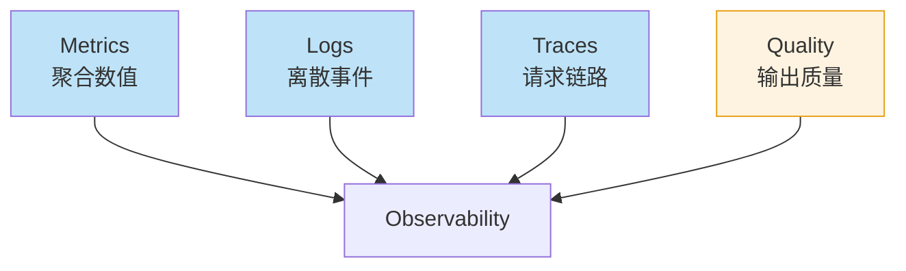
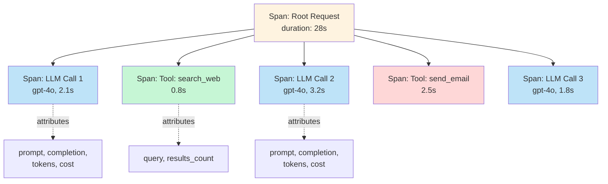

> LLM Agent 在生产环境出问题时的第一反应是什么？看 log？不够。看 metrics？不够。看 prompt？没用。你需要的是**完整的 trace 重放**——从用户输入到最终输出，每一步 LLM 调用、每个工具调用、每个决策点的中间结果。

传统微服务的 observability（metrics / logs / traces）已经成熟。但 LLM Agent 的可观测性是另一回事：

- **同样的输入可能产生不同输出**——随机性是基本属性
- **每一步都是 LLM 调用**——成本不只是延迟
- **失败原因多样**——模型幻觉、工具报错、context 超限、用户指令歧义
- **难以重现**——不同时间的模型版本可能给出不同结果

这篇文章讲怎么搭一套**真正能 debug LLM Agent**的可观测性体系。

<!--more-->

## 一、为什么传统 observability 不够用

传统 APM（Application Performance Monitoring）擅长跟踪**结构化请求**——HTTP 调用、数据库查询、缓存命中率。但 LLM Agent 的特征是：

| 特征 | 传统 APM | LLM Agent 需要 |
|------|---------|--------------|
| 输出 | 确定性结构 | 自由文本 + 结构化混合 |
| 失败 | 5xx、超时 | 输出正确但内容错（语义错误） |
| 性能 | 延迟、QPS | 延迟 + token 成本 + 准确率 |
| 重现 | 同样请求同结果 | 同样请求可能不同结果 |

直接套用传统监控会出现"一切正常但用户抱怨"的局面——**metric 看起来 OK，业务已经崩了**。

## 二、三支柱 + 第四根支柱

传统 observability 三大支柱：



LLM Agent 必须加**第四支柱：Quality（输出质量）**。

### 2.1 Metrics：聚合一目了然

```python
# 关键 metrics
agent_metrics = {
    # 流量
    "agent_request_total": "总请求数（按用户/类型分维度）",
    "agent_active_sessions": "活跃会话数",
    
    # 延迟
    "agent_latency_p50": "中位延迟",
    "agent_latency_p95": "P95 延迟",
    "agent_latency_p99": "P99 延迟",
    "agent_ttft": "首 token 时间",
    
    # 成本
    "agent_token_input_total": "输入 token 总量",
    "agent_token_output_total": "输出 token 总量",
    "agent_cost_usd_total": "总成本",
    "agent_cost_per_request": "单请求成本",
    
    # 异常
    "agent_error_total": "错误数（分类型）",
    "agent_retry_total": "重试次数",
    "agent_timeout_total": "超时次数",
}
```

### 2.2 Logs：离散事件流

```python
import structlog

logger = structlog.get_logger()

# 关键日志点
def log_agent_event(event_type, **kwargs):
    logger.info(
        event_type,
        timestamp=datetime.utcnow().isoformat(),
        request_id=kwargs.get("request_id"),
        user_id=kwargs.get("user_id"),
        session_id=kwargs.get("session_id"),
        agent_name=kwargs.get("agent_name"),
        step=kwargs.get("step"),
        **kwargs
    )

# 使用
log_agent_event("llm_call", request_id=rq.id, agent="researcher", 
                model="gpt-4o", prompt_tokens=1500, completion_tokens=300, cost=0.012)
log_agent_event("tool_call", request_id=rq.id, tool="search_web", args={"q": "..."}, duration_ms=850)
log_agent_event("agent_decision", request_id=rq.id, decision="call_writer", reasoning="...")
log_agent_event("user_feedback", request_id=rq.id, rating=4, comment="...")
```

### 2.3 Traces：完整链路

这是 LLM observability 的**核心**。每次请求的完整调用树：



每个 span 带**语义化属性**，便于查询和聚合。

### 2.4 Quality：输出质量（第四支柱）

LLM 独有的维度——输出看起来"成功"但其实答非所问。

```python
quality_metrics = {
    # 自动评估
    "llm_judge_score_avg": "LLM-as-Judge 平均分",
    "faithfulness_avg": "事实一致性",
    "answer_relevancy_avg": "回答相关性",
    
    # 用户反馈
    "thumbs_up_rate": "用户点赞率",
    "user_correction_rate": "用户纠正率",
    "task_completion_rate": "任务完成率",
    
    # 业务信号
    "followup_question_rate": "追问率（高 = 没答清楚）",
    "regeneration_rate": "用户点重新生成率",
    "abandonment_rate": "会话中途放弃率"
}
```

## 三、OpenTelemetry：标准化的 tracing 协议

2025 年的事实标准——所有主流 LLM observability 平台都基于 **OpenTelemetry** 协议，可以用同一份 trace 进 Langfuse / Phoenix / Datadog / Honeycomb。

### 3.1 OpenLLMetry 自动埋点

[OpenLLMetry](https://github.com/traceloop/openllmetry) 是 Traceloop 维护的自动埋点库，**零代码改动**给 OpenAI / Anthropic / Bedrock 调用加 trace：

```python
from traceloop.sdk import Traceloop

Traceloop.init(app_name="my-agent", api_key="...")

# 现有代码不变
response = openai.ChatCompletion.create(
    model="gpt-4o",
    messages=[...]
)
# ↑ 自动产生 trace span，包含：
#   - model name
#   - prompt + completion
#   - token counts
#   - cost
#   - latency
```

### 3.2 OTel 语义约定（Semantic Conventions）

OpenTelemetry 在 2024-2025 年推出了 **LLM 语义约定**，使用 `gen_ai.*` 命名空间：

```python
from opentelemetry import trace
from opentelemetry.semconv.ai import SpanAttributes

tracer = trace.get_tracer("agent")

with tracer.start_as_current_span("llm_call") as span:
    span.set_attribute(SpanAttributes.LLM_SYSTEM, "openai")
    span.set_attribute(SpanAttributes.LLM_REQUEST_MODEL, "gpt-4o")
    span.set_attribute(SpanAttributes.LLM_REQUEST_TOKENS, 1500)
    span.set_attribute(SpanAttributes.LLM_RESPONSE_TOKENS, 300)
    span.set_attribute(SpanAttributes.LLM_REQUEST_COST, 0.012)
    
    response = openai.ChatCompletion.create(...)
```

主要属性：

| 属性 | 含义 |
|------|------|
| `gen_ai.system` | 提供商 (openai, anthropic) |
| `gen_ai.request.model` | 模型名 |
| `gen_ai.request.tokens` | 输入 tokens |
| `gen_ai.response.tokens` | 输出 tokens |
| `gen_ai.request.cost` | 调用成本 |
| `gen_ai.response.finish_reason` | 结束原因 |

### 3.3 多 Agent 系统的 trace 树

```python
from opentelemetry import trace

tracer = trace.get_tracer("agent-system")

def run_supervisor(user_input):
    with tracer.start_as_current_span("supervisor.run") as span:
        span.set_attribute("user_input", user_input)
        
        # 决策
        decision = llm_call("决定调用哪个 agent")
        
        # 委托给 worker
        if decision == "researcher":
            with tracer.start_as_current_span("worker.researcher") as sub:
                result = run_researcher(user_input)
                sub.set_attribute("result_size", len(result))
                return result

def run_researcher(query):
    with tracer.start_as_current_span("llm_call") as span:
        span.set_attribute("gen_ai.system", "anthropic")
        span.set_attribute("gen_ai.request.model", "claude-sonnet-4-5")
        return claude.messages.create(...)
```

trace 输出长这样：

```
Root: agent.request (duration: 15.2s)
├── supervisor.run (12.1s)
│   ├── llm_call (decide) (1.8s)
│   │   ├── tokens: 200/15
│   │   └── cost: $0.0008
│   └── worker.researcher (10.0s)
│       ├── llm_call (plan) (2.1s)
│       ├── tool: search_web (3.5s)
│       ├── llm_call (synthesize) (2.3s)
│       └── llm_call (verify) (1.8s)
└── post_process (3.1s)
```

## 四、关键 trace 数据：上下文压缩的代价

LLM 调用成本的核心是 **prompt tokens**。每次 LLM 调用时记录完整的 prompt 是天价——一个 multi-turn Agent 可能有 50+ 次 LLM 调用，每次完整记录就是 50x token 消耗。

### 4.1 分级记录策略

```python
class TraceSampler:
    def __init__(self):
        self.full_sample_rate = 0.05  # 5% 完整记录
        self.summary_sample_rate = 0.50  # 50% 摘要记录
    
    def should_record_full(self, request_id):
        return random.random() < self.full_sample_rate
    
    def should_record_summary(self, request_id):
        return random.random() < self.summary_sample_rate

# 完整记录：所有 prompt + completion
# 摘要记录：长度、关键 token、首尾片段
# 都不记录：聚合 metric

trace_strategy = {
    "full": {
        "rate": 0.05,
        "what": "完整 prompt + completion + tool args + tool result",
        "cost": "高（5% 流量）"
    },
    "summary": {
        "rate": 0.50,
        "what": "token 数 + cost + 工具名 + 首尾 100 char",
        "cost": "低"
    },
    "metric_only": {
        "rate": 1.00,
        "what": "counter / histogram",
        "cost": "极低"
    }
}
```

### 4.2 智能采样

故障排查时**最需要完整数据的就是异常请求**：

```python
def should_record_full(request):
    # 异常请求一定完整记录
    if request.error:
        return True
    if request.latency > p99_threshold:
        return True
    if request.user_thumbs_down:
        return True
    if request.cost > cost_threshold:
        return True
    
    # 正常请求按概率采样
    return random.random() < 0.05
```

## 五、Replay 调试：让事故可重现

LLM 输出的**非确定性**是调试的最大障碍。同一 prompt 在不同时间可能产生不同结果。

### 5.1 Replay 的实现

把 trace 完整保存后，可以**重新跑**整个调用链：

```python
class AgentReplayer:
    def __init__(self, trace_storage):
        self.storage = trace_storage
    
    def replay(self, request_id: str, mode: str = "actual"):
        """
        mode: 
          - "actual": 重放时使用记录的 LLM 响应（确定性重放）
          - "live": 重放时重新调用 LLM（验证修复）
          - "step": 单步调试
        """
        trace = self.storage.get_trace(request_id)
        
        if mode == "actual":
            # 用 trace 中记录的 LLM 响应，不重新调用
            return self._replay_with_recorded(trace)
        elif mode == "live":
            # 重新调用 LLM，验证修复是否有效
            return self._replay_live(trace)
    
    def _replay_with_recorded(self, trace):
        """模拟每一步，用记录的响应而不是真实调用"""
        for span in trace.spans:
            if span.kind == "llm_call":
                # 直接返回记录的 completion
                span.output = span.recorded_completion
            elif span.kind == "tool_call":
                span.output = span.recorded_tool_result
        return trace.reconstruct_final_output()
```

### 5.2 Langfuse 的 replay 功能

Langfuse 在 2025 年原生支持 trace replay：

```python
from langfuse import Langfuse

# 生产环境自动收集 trace
langfuse = Langfuse()

@langfuse.observe()
def run_agent(user_input):
    response = llm.complete(user_input)
    return response

# 出问题时，从 Langfuse UI 找到对应的 trace
# 点击 "Replay" → 用记录的 LLM 响应完整重放
# 或选择 "Live" → 重新调用 LLM 验证修复
```

## 六、生产事故排查 workflow

真实案例：客服 Agent 在某天突然出现**退款申请成功率下降 30%**。

```mermaid
sequenceDiagram
    participant PM as 工程师
    participant Mon as 监控
    participant Trace as Trace UI
    participant LLM as LLM 调试

    PM->>Mon: 看到 refund_success_rate 跌 30%
    Mon->>PM: 告警：refund_success_rate < 70%
    PM->>Trace: 拉 100 个失败请求的 trace
    Trace->>PM: 发现：tool_call 错误率激增
    
    PM->>Trace: 查看具体失败的 tool_call
    Trace->>PM: 工具返回: {"error": "rate_limit_exceeded"}
    PM->>LLM: LLM 没有重试就告知用户失败
    
    PM->>Trace: 对比 3 天前的成功 trace
    Trace->>PM: 之前 LLM 收到 rate_limit 错误会重试
    PM->>LLM: 检查 prompt 改动历史
    
    LLM->>PM: 发现 2 天前 prompt 加了一句
    "不要重复调用同一个工具"
    PM->>PM: 修复 prompt，回滚
    
    PM->>Trace: 用同一请求 replay 验证修复
    Trace->>PM: 修复后 refund_success_rate 恢复到 92%
```

**关键工具**：

| 阶段 | 工具 |
|------|------|
| 发现 | Datadog / Prometheus（metric 告警） |
| 定位 | Langfuse / Phoenix（按 trace 搜索失败请求） |
| 复现 | Replay 功能（用记录的 LLM 响应） |
| 验证 | 修复后 replay 对比 |

## 七、成本监控的实操

LLM 成本失控是常见的"温水煮青蛙"问题。

### 7.1 关键成本指标

```python
# 每个 span 都打上成本
span.set_attribute("gen_ai.request.cost_usd", cost)
span.set_attribute("gen_ai.request.tokens_input", input_tokens)
span.set_attribute("gen_ai.request.tokens_output", output_tokens)

# 在监控里聚合
cost_metrics = {
    "total_cost_usd_per_minute": "每分钟总成本",
    "cost_p50_per_request": "单请求 P50 成本",
    "cost_p99_per_request": "单请求 P99 成本",
    "cost_per_user_today": "单用户日成本",
    "cost_by_agent": "按 agent 拆解",
    "cost_by_model": "按模型拆解"
}
```

### 7.2 异常检测

```python
# 监控异常飙升
def detect_cost_anomaly(current_cost_per_minute):
    baseline = get_baseline_cost_per_minute(window="7d")
    
    if current_cost_per_minute > baseline * 2:
        alert(f"💰 成本异常: {current_cost_per_minute} > baseline*2 ({baseline*2})")
    
    # 单用户成本
    user_costs = get_top_users_by_cost(limit=10)
    for user_id, cost in user_costs:
        if cost > baseline_per_user * 5:
            alert(f"⚠️ 用户 {user_id} 成本异常: ${cost}")
```

典型异常原因：某用户触发循环（一个 bug 让 Agent 死循环）、某 prompt 改动导致 token 暴涨、某模型 API 涨价。

## 八、可观测性平台选型

| 平台 | 类型 | 优势 | 适用场景 |
|------|------|------|---------|
| **Langfuse** | 开源 + SaaS | 提示管理、trace、成本 | LangChain 生态 |
| **Arize Phoenix** | 开源 | OpenTelemetry、evaluation | 自托管、灵活 |
| **OpenLLMetry** | 库 | 自动埋点 OTel 标准 | 已有 OTel 栈 |
| **Datadog LLM Observability** | SaaS | APM 集成 | 大企业已有 Datadog |
| **Helicone** | SaaS | 轻量、成本追踪 | 早期项目快速接入 |
| **Braintrust** | SaaS | Eval + 实验追踪 | 重评估 |

**起步建议**：
1. 先用 **OpenLLMetry** 自动埋点
2. Trace 数据存到 **Langfuse**（开源、可自托管）
3. Metric 接 **Prometheus + Grafana**
4. 大了再考虑 Datadog / Honeycomb

## 九、上线 checklist

把 observability 落到代码里：

- [ ] **OpenLLMetry 自动埋点**——零代码接入
- [ ] **每 LLM 调用记录** model / tokens / cost / latency
- [ ] **每工具调用记录** name / args / result / duration
- [ ] **每 Agent 决策记录** decision + reasoning
- [ ] **关键决策点**记录 trace_id 到 response header
- [ ] **5% 完整 trace + 50% 摘要 + 100% metric**
- [ ] **异常请求 100% 完整 trace**
- [ ] **成本监控**单请求上限 + 用户日上限 + 全局告警
- [ ] **Repl ay**功能用于事故复盘
- [ ] **Quality 监控** 采样评估 + 用户反馈闭环
- [ ] **OTel 导出**到统一 backend（Grafana Tempo / Honeycomb）

## 十、一点反思

LLM Agent 的可观测性是**生产化的最后一道门槛**。

我见过这样的案例：

- 团队 A：模型版本升级后质量下降，**3 周后**才从用户投诉发现
- 团队 B：某个 prompt 改动导致 token 翻倍，**2 周后**账单告警才发现
- 团队 C：Agent 在某类问题上持续失败，**从未发现**，因为 metric 看着正常

没有完整 trace 和 replay 能力，这些问题都只能"靠用户反馈"——等到发现时已经损失了大量业务。

2025 年的 LLM observability 工具已经成熟——**OpenTelemetry + Langfuse + OpenLLMetry** 这一套几乎免费就能搭起来。**没有理由再裸奔生产了**。

---

**参考资料：**
- [OpenTelemetry: Semantic Conventions for GenAI](https://opentelemetry.io/docs/specs/semconv/gen-ai/)
- [Langfuse Documentation](https://langfuse.com/docs)
- [Arize Phoenix](https://phoenix.arize.com/)
- [OpenLLMetry (Traceloop)](https://github.com/traceloop/openllmetry)
- [Datadog LLM Observability](https://www.datadoghq.com/product/llm-observability/)
- [Helicone: LLM Observability](https://www.helicone.ai/)
- [Portkey LLM Observability](https://portkey.ai/docs)
- [CNCF TAG App-Delivery: Observability for AI Workloads (2025)](https://tag-app-delivery.cncf.io/)