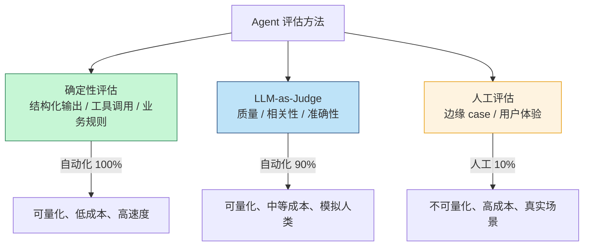
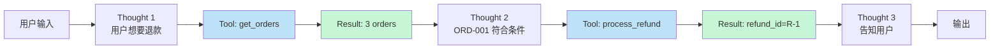

> 上线一个 AI Agent 不写评估，就像把 SQL 代码 push 上生产但从不跑测试。LLM 的输出有随机性，prompt 微调一句可能让质量断崖式下跌——没有自动化的回归测试，**你永远不知道哪次 commit 把产品搞砸了**。

这篇文章不讲"为什么要做评估"（这个地球人都知道），讲**怎么搭一套真正能用的 Agent 评估体系**：

- 三种评估方法（确定性 / LLM-as-Judge / 人工）的取舍
- Golden Dataset 怎么造、造多少、怎么维护
- 评估指标设计：从 RAG 召回到 Agent 工具调用
- CI/CD 集成：每次改 prompt 自动跑
- 实战代码：基于 DeepEval 的回归 pipeline

<!--more-->

## 一、AI Agent 评估的三种方法

LLM 输出是非确定性的，传统软件测试的"assert expected == actual"在这里失效。必须分层评估：



### 1.1 确定性评估：可量化的硬指标

凡是能"用代码判断"的，就别用 LLM 来判——便宜、快、可重复。

```python
def deterministic_checks(agent_output, expected):
    results = []
    
    # 1. Schema 校验（如果有结构化输出）
    if expected.get("required_schema"):
        try:
            validate(agent_output, expected["required_schema"])
            results.append({"check": "schema_valid", "pass": True})
        except ValidationError as e:
            results.append({"check": "schema_valid", "pass": False, "error": str(e)})
    
    # 2. 工具调用检查
    if expected.get("required_tools"):
        called_tools = {call.name for call in agent_output.tool_calls}
        missing = set(expected["required_tools"]) - called_tools
        results.append({
            "check": "required_tools_called",
            "pass": len(missing) == 0,
            "missing": list(missing)
        })
    
    # 3. 业务规则
    if expected.get("business_rules"):
        for rule in expected["business_rules"]:
            passed = eval(rule, {"output": agent_output})
            results.append({"check": rule, "pass": passed})
    
    # 4. PII / 安全检查
    if contains_pii(agent_output.text):
        results.append({"check": "no_pii", "pass": False})
    
    return results
```

**适用场景**：结构化输出（JSON）、必须调用的工具、明确的业务规则（"不能返回邮箱"）、安全边界（"不能含 PII"）。

### 1.2 LLM-as-Judge：用模型评模型

对"质量"、"相关性"、"流畅度"这种主观维度，让另一个 LLM 来打分。

```python
JUDGE_PROMPT = """你是一个严格的评估员。请根据以下标准评估 AI Agent 的输出。

[用户问题]
{question}

[Agent 输出]
{output}

[参考答案（如有）]
{reference}

评估标准（每个 0-10 分）：
1. **准确性**：事实是否正确？是否有幻觉？
2. **相关性**：是否切题？是否解决了用户问题？
3. **完整性**：是否遗漏关键信息？
4. **清晰度**：表达是否流畅、结构化？

请按 JSON 格式输出：
{{"accuracy": 8, "relevance": 9, "completeness": 7, "clarity": 8, "reasoning": "..."}}
"""

def llm_judge(question, output, reference=None) -> dict:
    response = openai.ChatCompletion.create(
        model="gpt-4o",  # 用强模型做 judge
        messages=[{
            "role": "user",
            "content": JUDGE_PROMPT.format(
                question=question,
                output=output,
                reference=reference or "（无）"
            )
        }],
        response_format={"type": "json_object"}
    )
    return json.loads(response.choices[0].message.content)
```

**关键原则**：

- **Judge 模型要比被评估模型更强**（用 GPT-4o / Claude Opus 4 评估 GPT-4o-mini）
- **结构化输出**（JSON），便于计算
- **给 reasoning**，便于调试低分原因

**已知偏差**：
- **Position bias**：倾向于给第一个或最后一个选项高分
- **Verbosity bias**：倾向给长回答高分
- **Self-enhancement bias**：GPT-4 评估 GPT-4 输出偏宽松

缓解方法：换用不同家族的 judge 模型（GPT-4 judge Claude 的输出，反之亦然）。

### 1.3 人工评估：最后一道关

**再好的自动化也替代不了人**。但人贵、慢、不可重复，只能用于：

- **Golden dataset 校准**——确认自动评估和人类判断的相关性
- **新 prompt 模板上线前**——A/B 测试对比人类偏好
- **生产事故复盘**——搞清楚模型到底哪里错了

```python
class HumanEval:
    def __init__(self):
        self.queue = []  # 待评估样本
    
    def submit(self, question, agent_output_a, agent_output_b):
        """A/B 测试：让人类选哪个更好"""
        self.queue.append({
            "id": uuid4(),
            "question": question,
            "output_a": agent_output_a,
            "output_b": agent_output_b,
            "status": "pending"
        })
    
    def get_sample(self, n=10):
        """抽样返回待评估项"""
        return random.sample([q for q in self.queue if q["status"] == "pending"], n)
    
    def record_result(self, eval_id, preferred: str, reason: str):
        for q in self.queue:
            if q["id"] == eval_id:
                q["status"] = "completed"
                q["preferred"] = preferred
                q["reason"] = reason
                break
```

**比例建议**：100 个请求里，5-10 个进人工评估池；其他走自动评估。

## 二、Golden Dataset：从 50 条开始

评估体系的核心是**Golden Dataset（黄金数据集）**——一组带标准答案的测试用例。

### 2.1 数据集大小

| 系统阶段 | 推荐大小 | 说明 |
|---------|---------|------|
| **MVP** | 20-50 条 | 覆盖核心路径即可 |
| **生产早期** | 100-200 条 | 覆盖正常 case + 常见 edge case |
| **成熟生产** | 500-1000+ 条 | 覆盖长尾、定期扩充 |

**质量 > 数量**：50 条精心构造的样本，比 500 条随机抓的真实请求更有评估价值。

### 2.2 数据集结构

每条样本至少包含：

```python
golden_dataset_entry = {
    # 基本标识
    "id": "test-001",
    "category": "refund_request",  # 分类标签
    "difficulty": "easy",  # easy / medium / hard
    "tags": ["customer_service", "edge_case"],
    
    # 输入
    "input": {
        "user_message": "我要退款",
        "context": {  # 当时的 context（订单信息等）
            "user_id": "u-123",
            "recent_orders": ["ORD-001", "ORD-002"]
        }
    },
    
    # 期望输出（多维度）
    "expected": {
        # 确定性检查用
        "required_tools": ["get_orders", "process_refund"],
        "must_not_include": ["邮箱地址", "内部订单链接"],
        "required_fields": ["refund_id", "amount"],
        
        # LLM-as-Judge 用
        "golden_answer": "应该在 24 小时内退款到原支付渠道...",
        "key_points": [
            "确认订单属于本人",
            "解释退款流程",
            "给出明确时间预期"
        ],
        
        # 参考答案（可选）
        "reference_solution": "完整理想回答示例..."
    },
    
    # 元信息
    "created_at": "2025-06-01",
    "created_by": "human-review-1",
    "last_updated": "2025-06-10",
    "notes": "边界 case：用户没说具体订单，需要先询问"
}
```

### 2.3 数据集维护

数据集不是一次造好就完事。**它是活的**。

```python
# 1. 从生产事故扩充
incident_samples = extract_incidents(incident_logs, n=10)
golden_dataset.extend(incident_samples)

# 2. 从用户反馈扩充
negative_feedback = fetch_feedback(thumbs_down=True)
golden_dataset.extend(negative_feedback[:5])

# 3. 定期 review
def review_dataset():
    for entry in golden_dataset:
        # 标记过时：业务规则变了、标准答案过期了
        if entry.last_updated < six_months_ago:
            entry.needs_review = True
```

**关键经验**：每年至少 review 一次完整数据集，删除过时样本，补充新 edge case。

## 三、评估指标：从 RAG 到 Agent

不同类型的 Agent 需要不同的评估指标。

### 3.1 RAG 系统

```python
rag_metrics = {
    # 检索阶段
    "context_precision": "检索的 context 中相关片段占比",
    "context_recall": "所有相关片段被检索到的比例",
    
    # 生成阶段
    "faithfulness": "回答内容是否忠于 context（无幻觉）",
    "answer_relevancy": "回答是否切题",
    
    # 鲁棒性
    "noise_sensitivity": "context 含干扰信息时是否还能正确回答",
    "context_relevance": "context 中的噪声是否影响最终回答质量"
}
```

**RAGAS** 是这个领域的事实标准：

```python
from ragas import evaluate
from ragas.metrics import (
    context_precision, context_recall,
    faithfulness, answer_relevancy
)

result = evaluate(
    dataset,
    metrics=[context_precision, context_recall, faithfulness, answer_relevancy]
)
print(result)
# {'context_precision': 0.85, 'context_recall': 0.78, ...}
```

### 3.2 Tool-Use Agent

比 RAG 更复杂——除了回答质量，还要评估**工具使用是否合理**：

```python
agent_metrics = {
    # 工具选择
    "tool_selection_accuracy": "在每个决策点选对了工具",
    "tool_call_efficiency": "用最少的工具调用完成任务",
    
    # 参数生成
    "argument_correctness": "工具参数符合 schema + 业务正确",
    
    # 路径效率
    "steps_to_completion": "完成任务用了多少步",
    "redundant_calls": "重复调用同一工具的次数",
    
    # 鲁棒性
    "error_recovery_rate": "工具报错后能否恢复",
    "loop_detection": "是否陷入死循环"
}
```

**DeepEval** 提供完整的 Agent 评估：

```python
from deepeval import evaluate
from deepeval.metrics import (
    ToolCorrectnessMetric,
    TaskCompletionMetric,
    PlanQualityMetric
)
from deepeval.test_case import LLMTestCase, ToolCall

test_case = LLMTestCase(
    input="查询订单 ORD-001 的状态",
    actual_output="订单已发货",
    tools_called=[
        ToolCall(name="get_order", arguments={"order_id": "ORD-001"})
    ],
    expected_tools=[
        ToolCall(name="get_order", arguments={"order_id": "ORD-001"})
    ]
)

# ToolCorrectnessMetric 检查工具调用是否正确
metric = ToolCorrectnessMetric(threshold=0.7)
metric.measure(test_case)
print(f"Score: {metric.score}, Reason: {metric.reason}")
```

### 3.3 Multi-Turn 对话 Agent

客服、助手类 Agent 是多轮对话，要额外评估：

```python
conversation_metrics = {
    # 角色一致性
    "role_adherence": "整个对话保持角色设定",
    
    # 知识保留
    "knowledge_retention": "记得之前的对话信息",
    "context_consistency": "前后回答不矛盾",
    
    # 用户体验
    "conversational_coherence": "对话自然流畅",
    "user_satisfaction_signal": "用户是否最终得到解决"
}
```

## 四、CI/CD 集成：每次 commit 自动评估

评估不能停在"开发机跑一下"。**必须接 CI**，每次 prompt 或 model 变更都自动跑。

### 4.1 GitHub Actions 示例

```yaml
# .github/workflows/agent-eval.yml
name: Agent Evaluation

on:
  pull_request:
    paths:
      - 'prompts/**'
      - 'agents/**'
      - 'tools/**'

jobs:
  eval:
    runs-on: ubuntu-latest
    steps:
      - uses: actions/checkout@v4
      
      - name: Setup Python
        uses: actions/setup-python@v5
        with:
          python-version: '3.11'
      
      - name: Install dependencies
        run: pip install -r requirements.txt
      
      - name: Run agent evaluation
        env:
          OPENAI_API_KEY: ${{ secrets.OPENAI_API_KEY }}
        run: |
          python -m pytest tests/eval/ -v --tb=short
      
      - name: Check quality gates
        run: |
          python scripts/check_eval_gates.py \
            --min-faithfulness 0.8 \
            --min-answer-relevancy 0.85 \
            --max-regression 0.05
```

### 4.2 质量门槛（Quality Gates）

CI 必须有硬性门槛，否则评估沦为"摆设"。

```python
QUALITY_GATES = {
    # 单条样本最低分
    "min_faithfulness_score": 0.80,
    "min_answer_relevancy": 0.85,
    "min_tool_accuracy": 0.90,
    
    # 整体回归控制
    "max_score_regression": 0.05,  # 比 main 分低 5% 就失败
    "min_pass_rate": 0.90,  # 至少 90% 样本通过
}

def check_gates(current_results, baseline_results):
    failures = []
    
    for metric, threshold in QUALITY_GATES.items():
        if "regression" in metric:
            regression = baseline_results[metric] - current_results[metric]
            if regression > QUALITY_GATES[metric]:
                failures.append(f"{metric}: regression {regression:.2%}")
        else:
            if current_results[metric] < threshold:
                failures.append(f"{metric}: {current_results[metric]:.2%} < {threshold:.2%}")
    
    if failures:
        raise QualityGateFailed(failures)
```

**任何 prompt 改动都得通过这关**，否则不能 merge。

## 五、统计显著性：A/B 结果真的可信吗？

"模型 A 比模型 B 好 2%"——这个差距是真实的，还是随机波动？

**做 A/B 测试必须有统计检验**。

```python
from scipy import stats

def is_significant(a_scores, b_scores, alpha=0.05):
    """配对 t 检验：每个样本跑 A 和 B，对比分数差"""
    
    # 数据对齐
    if len(a_scores) != len(b_scores):
        raise ValueError("需要配对数据")
    
    # t 检验
    t_stat, p_value = stats.ttest_rel(a_scores, b_scores)
    
    return {
        "mean_a": np.mean(a_scores),
        "mean_b": np.mean(b_scores),
        "diff": np.mean(b_scores) - np.mean(a_scores),
        "p_value": p_value,
        "significant": p_value < alpha,
        "winner": "B" if np.mean(b_scores) > np.mean(a_scores) else "A"
    }

# 示例：50 个样本上 A 模型平均 0.78，B 模型 0.82
result = is_significant(a_scores, b_scores)
print(f"P-value: {result['p_value']:.4f}, Significant: {result['significant']}")
# P-value: 0.034, Significant: True
```

**最小样本量**：要检测 5% 的差异，至少需要 **100+ 样本**才有 80% 统计功效。少于 30 个样本的"对比"几乎都是噪音。

## 六、Tracing：从输入到输出的完整可观测

评估看到的是**结果**，但定位问题需要**过程**。



**Arize Phoenix / Langfuse** 这类工具专门做这个：

```python
from phoenix.trace import trace

@trace
def run_agent(user_input):
    thought_1 = llm.complete(f"分析用户意图：{user_input}")
    # ...
    # 每个 step 自动被追踪
```

trace 数据进入评估 pipeline，可以做：
- **失败案例 replay**：重放当时的 trace，看哪里出错了
- **tool call 频率分析**：哪些工具被过度使用
- **step 耗时分析**：哪个 step 是延迟瓶颈

## 七、生产环境持续评估

CI 评估是静态的——只能验证**已知的**失败。生产环境必须**持续监控**新出现的失败模式。

```python
class ProductionMonitor:
    def __init__(self):
        self.eval_sample_rate = 0.05  # 5% 流量进评估
        self.daily_budget = 1000  # 每天最多评估 1000 条
    
    async def on_request_complete(self, request, response):
        # 1. 抽样
        if random.random() > self.eval_sample_rate:
            return
        
        # 2. 评估
        score = await llm_judge(request.input, response.output)
        
        # 3. 异常信号
        if score["accuracy"] < 0.5:
            alert_low_quality(request, response, score)
        
        if response.tool_calls and any(call.error for call in response.tool_calls):
            alert_tool_error(request, response)
        
        # 4. 入库分析
        store_eval_result(request, response, score)
```

**每周 review 一次生产评估结果**，找出 top 失败模式，扩充到 Golden Dataset。

## 八、上线 checklist

把评估体系落到代码里：

- [ ] **三层评估结合**：确定性 + LLM-as-Judge + 人工
- [ ] **Golden Dataset** 至少 50 条，覆盖核心路径和 edge case
- [ ] **CI 自动跑**：每次 prompt 改动都触发
- [ ] **质量门槛硬卡**：min 分数 + max 回归幅度
- [ ] **多维度指标**：不光看"答得好不好"，还要看"工具调对没"
- [ ] **统计检验**：A/B 对比必须有 p-value
- [ ] **Tracing 完整**：从输入到输出的每一步都有日志
- [ ] **生产监控**：5% 流量持续评估，异常告警
- [ ] **数据集定期 review**：每季度一次，扩充新 edge case

## 九、一点反思

AI Agent 评估是 2025 年最被低估的话题。**模型再强，prompt 没测过就上线 = 给自己埋雷**。

一个真实案例：某团队的客服 Agent 修改了一句 prompt（"请更友好一点"），看似无害，结果**触发率飙升 30%**——因为"友好"被模型理解为"啰嗦"，每条回答都重复 3 遍同样的信息。没有自动化评估，这种问题一周后才能从用户反馈里发现。

评估不是事后补救，是**生产前的最后一道关**。把它当作 CI 里跑不通的单元测试——少了它，所有 prompt 改动都是盲改。

---

**参考资料：**
- [DeepEval: The LLM Evaluation Framework](https://deepeval.com/)
- [RAGAS: RAG Evaluation Framework](https://docs.ragas.io/)
- [Maxim: Top Agent Evaluation Tools in 2025](https://getmaxim.ai/articles/top-agent-evaluation-platforms-in-2025-the-definitive-enterprise-guide/)
- [Confident AI: DeepEval Documentation](https://docs.confident-ai.com/)
- [StickyMinds: A Proactive Framework for Testing AI Agent Quality](https://www.stickyminds.com/article/proactive-framework-testing-ai-agent-and-application-quality)
- [Fast.io: Best Tools for AI Agent Evaluation](https://fast.io/resources/best-tools-ai-agent-evaluation/)
- [Let's Data Science: LLM Evaluation with RAGAS and LLM-as-Judge](https://letsdatascience.com/blog/llm-evaluation-ragas-llm-as-judge-and-production-evals)
- [Arize Phoenix: Open-source LLM Tracing](https://phoenix.arize.com/)
- [Langfuse: Self-hosted LLM Observability](https://langfuse.com/)