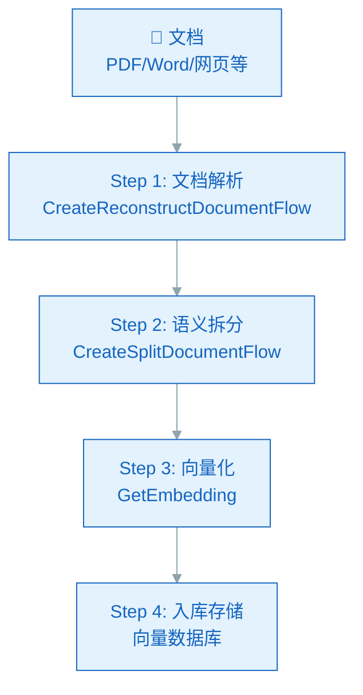
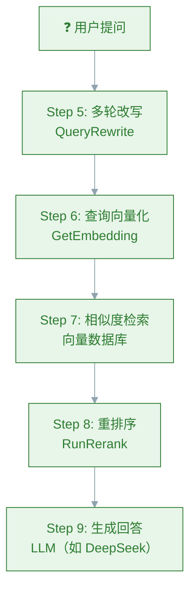
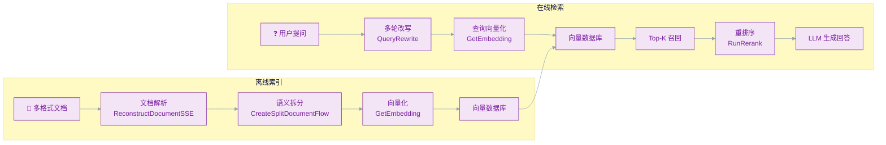

在构建企业级 AI 应用时，RAG（检索增强生成）是目前最成熟、最稳妥的技术路线。而 RAG 链路中真正拉开差距的，不是最后一步大模型生成，而是前面的**文档解析质量**、**语义切分方式**和**检索排序策略**。

腾讯云知识引擎原子能力（LLM Knowledge Engine Basic API）正是针对这三个环节，提供了一套完整的解耦原子能力组件。开发者可以按需组装，灵活搭建属于自己的 RAG 链路。

<!--more-->

## 一、什么是知识引擎原子能力

知识引擎原子能力是腾讯云基于**腾讯云智能体开发平台**研发的知识问答全链路能力，面向企业和开发者提供灵活组建及开发模型应用的能力。它不是一个大包大揽的黑盒产品，而是把 RAG 链路中的每个环节都暴露为独立的 API，开发者可以按需调用。

核心原子能力覆盖 RAG 全流程：

| 能力 | 说明 | API |
|------|------|-----|
| 文档解析（同步） | 多格式文件转 Markdown，含表格、公式、图片 | `ReconstructDocumentSSE` |
| 文档解析（异步） | 同上，适合大文件，无耗时限制 | `CreateReconstructDocumentFlow` |
| 文档语义拆分 | 多级语义切分，比传统正则切分回答完整性提升 20% | `CreateSplitDocumentFlow` |
| 文本向量化 | 文本转向量，用于语义检索 | `GetEmbedding` |
| 多轮改写 | 对话中的指代消解和省略补全 | `QueryRewrite` |
| 重排序 | 对多路召回结果按相关性重新排序 | `RunRerank` |

接口请求域名统一为 `lkeap.tencentcloudapi.com`，默认频率限制 **20 次/秒**（按 API + 地域 + 子账号维度）。

## 二、核心能力详解

### 2.1 文档解析：业内领先的多模态解析

文档解析是 RAG 的第一步，也是决定上限的一步——解析质量差，后续检索再好也是徒劳。

腾讯云的文档解析能力基于**腾讯优图实验室自研的多模态文档解析大模型**，识别准确率比传统方案提升 30%，核心优势包括：

- **独创多模态解析**：通过粗粒度生成元素位置和顺序，辅以内容生成的语义感知，解决复杂排版问题，在图文表混排场景下优势明显
- **智能版面分析**：支持多栏、内容混排文档（论文、报告、书籍等），精准提取标题、段落、图片、表格、公式、页眉、页脚等元素，按阅读顺序输出
- **表格结构识别**：支持常规、有线、无线、少线、多表格、跨页表格等复杂场景，做结构化复原
- **高精度 OCR**：准确识别中英文、繁体字、生僻字，即使是图片或扫描 PDF 也能高精度识别
- **Markdown 输出**：输出 Markdown 格式，适合大模型训练和文档电子化

**支持文件格式**：PDF、DOC、DOCX、PPT、PPTX、WPS、XLS、XLSX、MD、TXT、CSV、PNG、JPG、JPEG、BMP、GIF、WEBP 等。

**文件大小限制**：
- PDF/DOC/DOCX/PPT/PPTX/WPS：最大 100M
- MD/TXT/XLS/XLSX/CSV：最大 10M
- 图片格式：最大 20M

**两个解析接口如何选**：

- `ReconstructDocumentSSE`（同步/实时）：使用 HTTP SSE 协议，适合对耗时要求较高的实时文档问答场景，文件较小
- `CreateReconstructDocumentFlow`（异步）：适合知识库构建等对耗时没有严格要求的大文件解析

### 2.2 语义拆分：业界首创基于 LLM 的多级切分

传统 RAG 用正则或固定长度切分文档，容易把语义连贯的段落拦腰截断，导致检索召回的片段不完整。

腾讯云的方案是**业界首创的基于 LLM 的多级语义切分模型**，通过语义理解对文档进行切分，保障每个切分片段的语义完整性。

核心特点：
- **多级切分方式**：将文档切分成适合检索和大模型问答的多个层级片段
- **语义完整性**：端到端检索准确度大幅提升，官方数据显示相比传统正则切分方式**回答完整性提升 20%**
- **通用性强**：不受文档类型限制，不截断语义

切分后的片段可直接用于向量检索，配合 `GetEmbedding` 接口完成向量化入库。

### 2.3 Embedding：基于 LLM 的文本向量化

`GetEmbedding` 接口调用文本表示模型，将文本转化为数值向量，可用于文本检索、信息推荐、知识挖掘等场景。

腾讯云 Embedding 模型的一个差异化特点是**通过不同的 Instruction 区分 Embedding 和生成任务**，让 LLM 能同时在这两种任务上训练，得到一个同时具备文本表征和文本生成能力的模型。多文档信息召回率从 85% 提升到 92%。

### 2.4 多轮改写：让检索理解对话上下文

多轮对话中，用户的问题往往包含指代（"上次说的那个方案"）或省略（"继续"），直接拿这样的模糊查询去检索，效果会很差。

`QueryRewrite` 接口专门解决这一问题，在多轮对话中进行**指代消解**和**省略补全**，将不完整的查询改写为完整的、可以直接检索的明确问题。

应用场景：
- 智能客服的多轮问答
- 企业知识库的上下文对话
- 任何需要多轮交互的 RAG 应用

### 2.5 重排序：让检索结果更精准

向量检索返回的结果是按相似度排序的，但相似度高的片段未必是回答问题最相关的内容。`RunRerank` 接口提供基于腾讯云精调模型的 Rerank 能力，对多路召回结果进行重排，根据 Query 与切片内容的相关性按分数由高到低排序，输出最相关的片段给大模型。

## 三、RAG 全流程详解

一个完整的 RAG 流程分为两个阶段：**离线索引**（构建知识库）和**在线检索**（回答问题）。

### 阶段一：离线索引（构建知识库）



1. **文档解析**：`CreateReconstructDocumentFlow` 将 PDF/Word/PPT 等文件转为结构化的 Markdown
2. **语义拆分**：`CreateSplitDocumentFlow` 对 Markdown 进行多级语义切分，输出语义完整的片段
3. **向量化**：`GetEmbedding` 将每个片段转为向量
4. **入库存储**：向量存入向量数据库（如腾讯云 Elasticsearch），原始文本关联存储

### 阶段二：在线检索（回答问题）



1. **多轮改写**：`QueryRewrite` 处理指代消解和省略补全，输出明确的检索查询
2. **查询向量化**：`GetEmbedding` 将改写后的查询转为向量
3. **相似度检索**：在向量数据库中做 Top-K 召回
4. **重排序**：`RunRerank` 对召回结果做精排，输出最相关的片段
5. **生成回答**：将精排后的片段作为上下文，调用 LLM 生成最终回答

## 四、典型应用场景

### 4.1 智能客服

知识引擎原子能力能够快速准确地检索相关信息，结合生成模型的自然语言处理能力，为客户提供及时、准确且友好的咨询服务。

适用行业：电商、金融、政务、在线教育等需要大量标准化问答的场景。

### 4.2 企业内部知识库问答

针对企业内部的各类文档资料（产品手册、技术文档、HR 政策、财务制度），原子能力能够迅速找到相关答案，为员工提供高效、便捷的文档查询体验。

相比传统关键词搜索，语义检索能理解问题的真实意图，即使是同义词表述也能准确召回。

### 4.3 员工服务与工作效率提升

通过构建 RAG 框架，企业可以为员工提供个性化的信息服务，解答工作相关问题，从而提高工作效率和员工满意度。

典型场景：新员工入职指引、IT 问题自助排查、项目管理流程查询等。

### 4.4 文档智能分析

对大量 PDF、论文、报告等文档进行解析和结构化，提取关键信息，生成摘要或回答关于文档内容的问题。

适用场景：法务文档审查、研报分析、合同比对等。

### 4.5 车载助手

结合车载系统的特点，为驾驶员提供实时响应的知识问答服务，覆盖导航、娱乐、安全等方面的信息查询需求。

### 4.6 专业领域查询助手

可应用于搜索引擎优化、专业领域知识检索等场景，为用户提供更精准、更全面的查询结果。

典型场景：法律条文检索、医学文献查询、行业标准规范查询等。

## 五、快速接入指南

### 5.1 开通服务

1. 进入[腾讯云知识引擎原子能力控制台](https://console.cloud.tencent.com/lkeap)，单击开通智能体开发平台
2. 页面提示开通成功后，进入控制台
3. 免费额度用尽后，可购买预付费资源包或在**后付费设置**开启按量计费

### 5.2 获取 API Key

在控制台 API Key 管理页面创建 API Key，后续调用接口时需要传入。

### 5.3 调用示例

**Python 调用 DeepSeek 对话接口（兼容 OpenAI SDK）：**

```python
from openai import OpenAI

client = OpenAI(
    api_key="sk-xxxxxxxxxxx",  # 知识引擎原子能力 APIKey
    base_url="https://api.lkeap.cloud.tencent.com/v1",
)

response = client.chat.completions.create(
    model="deepseek-r1",
    messages=[{"role": "user", "content": "你是谁"}],
    stream=False
)
print(response.choices[0].message.content)
```

**调用文档解析接口（Python SDK）：**

```python
from tencentcloud.common import credential
from tencentcloud.lkeap.v20241122 import lkeap_client, models

cred = credential.Credential("secret_id", "secret_key")
client = lkeap_client.LkeapClient(cred, "ap-guangzhou")

req = models.CreateReconstructDocumentFlowRequest()
req.FileType = "pdf"
req.FileUrl = "https://example.com/document.pdf"

resp = client.CreateReconstructDocumentFlow(req)
print(resp.TaskId)  # 用于后续查询解析结果
```

**调用 Embedding 向量化接口：**

```python
req = models.GetEmbeddingRequest()
req.Text = "如何配置数据库连接池"

resp = client.GetEmbedding(req)
print(resp.Embedding)  # 返回向量数组
```

### 5.4 通过 API Explorer 在线调试

腾讯云提供了 [API Explorer](https://console.cloud.tencent.com/api/explorer) 工具，可在线调用接口、查看请求/响应示例、生成 SDK 代码。无需写代码即可快速验证接口是否满足需求。

### 5.5 计费方式

知识引擎原子能力按接口调用量计费，支持**预付费资源包**和**后付费**两种模式：

- **预付费**：购买资源包，有效期内抵扣用量，适合用量稳定的场景
- **后付费**：按实际调用量日结，适合用量波动大或初期测试

开通腾讯云智能体开发平台后即可获得一定量的**免费额度**。

> 注意：DeepSeek API 接口（`ChatCompletions`）仅有后付费模式，请到控制台开启。

各能力计费项详情参考[官方计费概述](https://cloud.tencent.com/document/product/1772/111126)。

## 六、产品优势总结

| 优势 | 说明 |
|------|------|
| **文档解析质量高** | 多模态解析大模型，识别准确率提升 30%，支持图文表混排、复杂版面 |
| **语义切分创新** | 业界首创基于 LLM 的多级语义切分，回答完整性提升 20% |
| **混合检索能力** | 支持向量检索 + 全文检索多种策略，可按场景灵活配置 |
| **基于 LLM 的 Embedding** | 同时具备文本表征和文本生成能力，召回率从 85% 提升到 92% |
| **内置重排序** | 不需要自建 Reranker，直接调 API 即可做精排 |
| **多轮改写** | 处理指代消解和省略补全，无需额外写 Prompt |
| **灵活组装** | 每个环节独立 API，可以只用需要的部分，按需集成 |
| **支持 DeepSeek 全系列** | 内置 DeepSeek-V3、DeepSeek-V3-0324、DeepSeek-R1 等模型调用 |

## 七、整体架构一览



**离线索引**负责将文档解析→拆分→向量化→入库；**在线检索**负责改写→向量化→召回→重排→生成，两者共用原子能力 API，形成完整的 RAG 闭环。

## 总结

腾讯云知识引擎原子能力是企业级 RAG 建设的一个务实选择：

- **全链路覆盖**：从文档解析到语义切分、从向量检索到重排序，每个环节都有独立的成熟 API
- **质量有保障**：多模态解析大模型、LLM 语义切分、基于 LLM 的 Embedding，都是经过实际业务验证的技术
- **接入门槛低**：兼容 OpenAI SDK，API Explorer 在线调试，预付费/后付费按需选择
- **灵活组合**：可以只用部分能力（ например 只需要文档解析），不必全盘引入

对于已有大模型应用、需要将私有知识接入 RAG 的企业和开发者，这套原子能力是目前国内云厂商中能力最完整、接入最灵活的企业级 RAG 方案之一。

*参考资料：*
- [腾讯云知识引擎原子能力 - 产品概述](https://cloud.tencent.com/document/product/1772/111122)
- [腾讯云知识引擎原子能力 - 产品优势](https://cloud.tencent.com/document/product/1772/111123)
- [腾讯云知识引擎原子能力 - 应用场景](https://cloud.tencent.com/document/product/1772/111124)
- [腾讯云知识引擎原子能力 - 计费概述](https://cloud.tencent.com/document/buy-guide/1772/111126)
- [腾讯云知识引擎原子能力 - API 概览](https://cloud.tencent.com/document/product/1772/115374)
- [腾讯云知识引擎原子能力 - RAG 操作指南](https://cloud.tencent.com/document/product/1772/111236)
