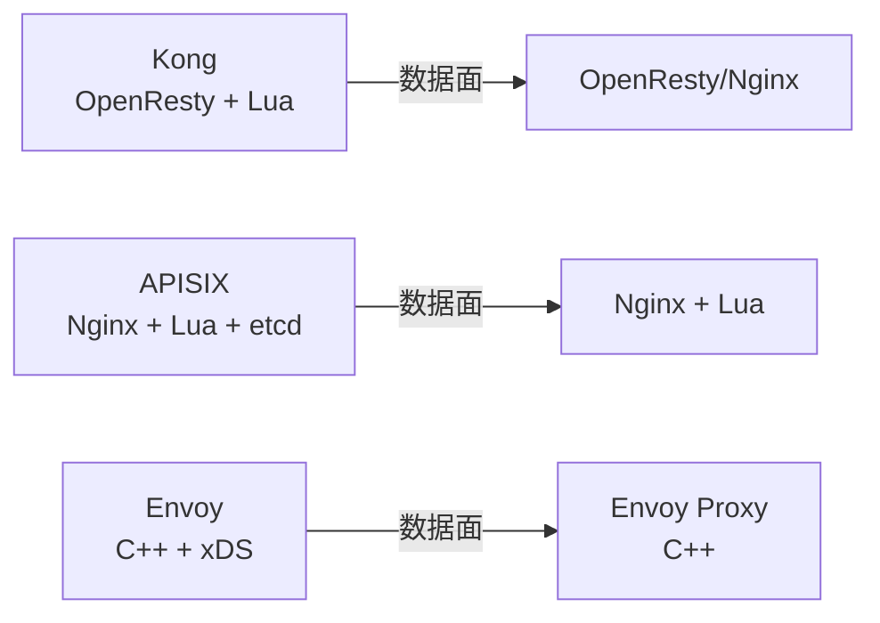
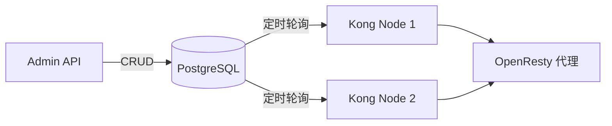
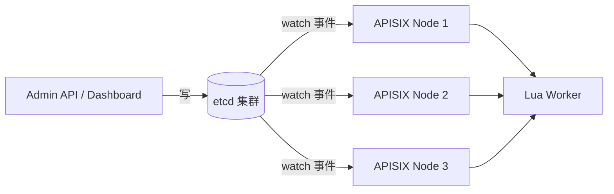
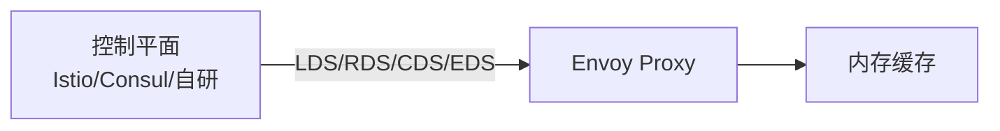
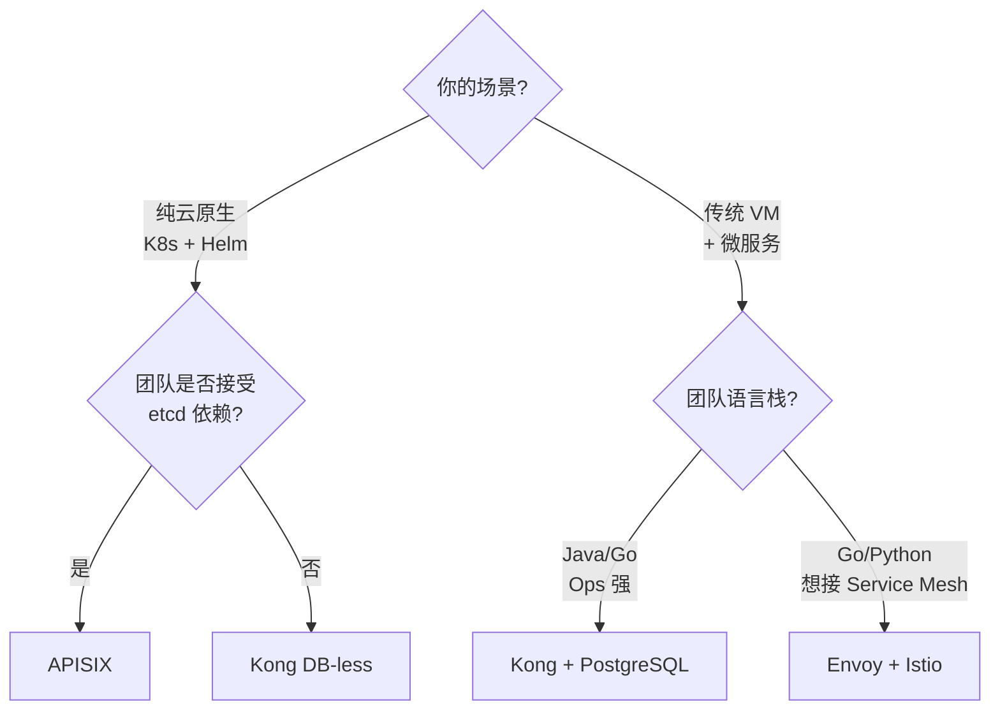

2021 年我们要把内部十几个微服务统一接入网关，候选有 Kong、APISIX、Envoy（自建控制平面）。三方各有支持者：Java 团队倾向 Kong（成熟稳定）；基础设施组偏好 APISIX（etcd + 热更新）；架构师则强调 Envoy 是"未来标准"。最终我们选了 APISIX，但过程远没有"选个流行开源"那么简单。

API 网关不只是"反向代理 + 限流"。它要承载路由、TLS 终结、鉴权、限流、可观测、协议转换 —— 每一项都有工程取舍。本文从数据平面、控制平面、插件体系、运维复杂度四个维度，对比 Kong、APISIX、Envoy 三条技术路线。

<!--more-->

## 一、三条不同的技术路线

三者表面都是"网关"，但底层哲学完全不同：



- **Kong**：基于 OpenResty（Nginx + Lua）的网关产品，自带控制平面、Admin API、数据库（PostgreSQL）
- **APISIX**：基于 Nginx + Lua 的网关产品，控制平面交给 etcd，专注动态配置
- **Envoy**：纯粹的 L7 反向代理（数据平面），不自带网关语义；需要 Istio、Consul 或自研控制平面把它"包装"成网关

最后一个区别最重要：**Envoy 自己不做网关**，它是个高性能代理原语。所以"Envoy 网关"通常指 Envoy Gateway（EG，2021 年末才正式立项）或基于 Envoy 的产品（Emissary-Ingress、Gloo Edge）。

## 二、控制平面：数据库之争

网关的所有路由、插件配置都存在控制平面。三家选型直接决定了"配置变更能不能秒级生效"。

### Kong：PostgreSQL（或 DB-less 模式）

Kong 默认把配置存在 PostgreSQL，多节点共享同一份数据。



Kong 通过 `nginx.conf` 的定时器轮询 DB（默认 5 秒），把配置加载到 worker 内存。变更生效有延迟（最多 5 秒），且多节点配置不一致窗口期较长。

Kong 2.3+ 也支持 **DB-less 模式**：用 YAML/JSON 声明式配置，Kong 启动时加载到内存。这种模式下：

- 优点：配置即版本，CI/CD 友好；无外部依赖
- 缺点：任何变更都要重启 Kong 节点（不能用 Admin API 改），HA 切换期间会出现秒级 502

### APISIX：etcd + Watch 机制

APISIX 把所有配置存在 **etcd**，节点通过 watch 实时接收变更：



关键机制是 `apisix/core/config_etcd.lua` 里的 `_automatic_fetch` 定时器 + `lua-resty-etcd` 的 `watchdir()`，每 worker 进程独立监听 11 类配置（routes、upstream、plugins、ssl、plugin_configs 等）。变更落 etcd 到 worker 内存更新 **毫秒级**，且不需要 reload Nginx。

这也是 APISIX 2.x 最大的卖点："无 reload、毫秒生效、配置变更无感"。

### Envoy：xDS + 自建控制平面

Envoy 自身不存储配置，靠 **xDS 协议**（gRPC）从控制平面拉取：



xDS 包含 5 类 API：

- **LDS**（Listener Discovery Service）：监听器发现
- **RDS**（Route Discovery Service）：路由发现
- **CDS**（Cluster Discovery Service）：上游集群发现
- **EDS**（Endpoint Discovery Service）：集群 endpoint 发现
- **SDS**（Secret Discovery Service）：证书/TLS 密钥发现

Envoy 通过长连接 + 增量更新（delta xDS）拿到变更。配置生效延迟取决于控制平面实现（Istio 是秒级，自研可做到毫秒）。

## 三、插件体系：扩展能力对比

网关能做的事受限于"插件能做什么"。

| 维度 | Kong | APISIX | Envoy |
|------|------|--------|-------|
| 插件语言 | Lua（主），JS/Go（Plugin Server） | Lua（主），Go（Plugin Server） | C++（主），Wasm（1.11 起 alpha） |
| 官方插件数 | ~80+ | ~70+ | ~50+ 原生 filter |
| 热加载插件 | Admin API 启用/禁用 | Admin API 启用/禁用 | Wasm 插件 1.11 起 alpha |
| 自定义插件 | Lua + PDK（`kong.request`、`kong.response` 等命名空间） | Lua + APISIX 私有 API | C++ filter（重）或 Wasm（轻） |
| 学习曲线 | Lua + OpenResty 哲学 | Lua + APISIX 私有 API + Nginx | C++ Envoy ABI 或 Wasm 工具链 |

**Kong 2.4 LTS**（2021/04 发布）新增了 **JavaScript PDK**（beta）和 Go Plugin Server，插件不再局限于 Lua。OpenResty 1.19.3.1 是 Kong 2.4 的硬依赖。

**APISIX 2.10 LTS**（2021/09 发布）是 APISIX 第一个 LTS 版本，社区 200+ 贡献者。插件可以走 Go Plugin Server（独立进程 + RPC），适合 CPU 密集型场景（加解密、复杂校验）。

**Envoy** 的 Wasm 插件（`WasmPlugin` API）在 1.11 进入 alpha，1.12 GA。可以热加载 Rust/Go/AssemblyScript 编写的 Wasm 模块，但官方明确说明："非必要不用 WasmFilter，性能开销 10-30%"。生产环境更多是直接编译 C++ filter。

## 四、性能对比

数据来自 Apache APISIX 官方 2021 年基准测试（[APISIX vs Kong vs Envoy](https://apisix.apache.org/blog/2021/11/26/Apache-APISIX-vs-Kong-vs-Envoy-Proxy/)，硬件 32 核 64GB）：

| 场景 | Kong 2.4 | APISIX 2.10 | Envoy 1.18 |
|------|---------|-------------|------------|
| 单 worker QPS（无插件） | ~30k | ~50k | ~80k |
| P99 延迟（无插件） | ~5 ms | ~3 ms | ~1 ms |
| 启用 2-3 个常用插件后 QPS 下降 | 30-40% | 15-25% | 10-20%（启用 filter） |
| 内存占用（单节点） | ~400 MB | ~300 MB | ~150 MB |

**关键结论**：

- **Envoy 性能最强**：C++ 实现，延迟最低、QPS 最高
- **APISIX 性能接近 Envoy**：因为大部分热路径在 Nginx C 模块，Lua 只做必要拦截
- **Kong 略慢**：每个请求的 Lua 上下文开销比 APISIX 多（PDK 抽象层）

但要注意：**启用插件后，差距缩小**。因为大多数插件都在 Lua/C++ 业务逻辑层而非网络层。

## 五、运维复杂度

这一项最难量化，但决定项目能否跑得动。

### Kong 运维

- 控制平面必须部署 PostgreSQL（DB-less 除外）
- 多节点配置同步依赖 DB 轮询（延迟窗口）
- 升级需要严格按版本迁移（schema migration）
- 监控：自带 Prometheus exporter，指标丰富
- HA：Kong 节点无状态，前面挂 LB 即可；但 PostgreSQL 是单点（生产用主从）

### APISIX 运维

- 强依赖 etcd 集群（3 节点起步），但 etcd 本身是成熟组件
- 无 reload 设计，运维极简（变更走 etcd）
- 升级需要先确认插件兼容性（Lua 插件不向后兼容的偶有发生）
- 监控：自带 Prometheus exporter
- HA：APISIX 节点无状态 + etcd HA 已经覆盖

### Envoy 运维

- "网关"语义不在 Envoy 自身，必须配控制平面（Istio/Consul/Gloo/Envoy Gateway）
- 如果用 Istio，运维成本 = Istio 运维（已经很难）
- 如果用自研控制平面（基于 Go/Control Plane），要自己实现 xDS 服务端
- 监控：自带 statsd/Prometheus，但指标格式与 Kong/APISIX 不同
- HA：Envoy 节点无状态，控制平面需要自己做 HA

**我们的结论**：单纯论"网关本身的运维"，APISIX 最简单（无 reload + etcd 兜底）；Kong 中等（DB 维护 + 升级窗口）；Envoy 最难（要绑控制平面）。

## 六、选型决策树



简化版：

- **K8s 原生团队、追求配置实时生效、接受 etcd** → APISIX（首选）
- **企业级、需要企业版功能（OIDC、SAML、Vault）、团队 Ops 强** → Kong（贵但稳）
- **已经在用 Istio、或自研能力强、未来想统一 Service Mesh** → Envoy

## 七、实战建议

### 1. APISIX 启用 etcd 鉴权

etcd 是 APISIX 的"配置中枢"，生产环境必须开鉴权：

```bash
# etcd 启动参数
etcd --auth-enable=true
```

```yaml
# APISIX config.yaml
deployment:
  admin:
    admin_key:
      - name: admin
        key: "your-strong-key"
        role: admin
etcd:
  host:
    - "https://etcd-1:2379"
    - "https://etcd-2:2379"
    - "https://etcd-3:2379"
  tls:
    cert: "/etc/apisix/certs/etcd.crt"
    key: "/etc/apisix/certs/etcd.key"
```

### 2. Kong 启用 RBAC + 限流

```bash
# 启用 RBAC（Kong EE）
curl -X POST http://kong:8001/rbac/roles \
  -d "name=service-team"

# 配置 rate limiting
curl -X POST http://kong:8001/services/{service}/plugins \
  -d "name=rate-limiting" \
  -d "config.minute=100" \
  -d "config.policy=local"
```

### 3. Envoy 配置增量 xDS

Istio 默认走增量 xDS（delta_xds），配置更新走"差异推送"而不是"全量推送"。对大规模集群（>1000 服务）能显著降低控制平面带宽压力：

```yaml
# istiod 启动参数
PILOT_ENABLE_DELTA_XDS=true
```

## 八、小结

Kong、APISIX、Envoy 不是"三选一"，是三种不同的工程范式：

- **Kong**：网关产品，控制平面自带，PostgreSQL 中心，适合企业级长期演进
- **APISIX**：网关产品，控制平面交给 etcd，无 reload 设计，K8s 原生体验最佳
- **Envoy**：代理原语，需要绑控制平面，是 Service Mesh 与 API 网关统一的事实标准

我们的 2021 年选型最终落在 **APISIX**：团队是云原生栈、追求配置实时生效、能接受 etcd 运维。如果当年我们的服务有 30% 在传统 VM 上、或者已经买了 Kong 企业版，结论会完全不同。

参考：

- [Apache APISIX vs Kong vs Envoy Proxy（2021/11）](https://apisix.apache.org/blog/2021/11/26/Apache-APISIX-vs-Kong-vs-Envoy-Proxy/)
- [APISIX: Dynamic Management for NGINX Clusters（2021/08）](https://apisix.apache.org/blog/2021/08/10/apisix-nginx)
- [Kong 2.4 LTS 升级指南](https://docs.konghq.com/2.4.x/upgrading/)
- [Envoy xDS 协议文档](https://www.envoyproxy.io/docs/envoy/latest/intro/arch_overview/dynamic-configuration/dynamic-configuration)