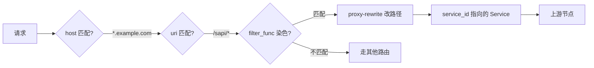
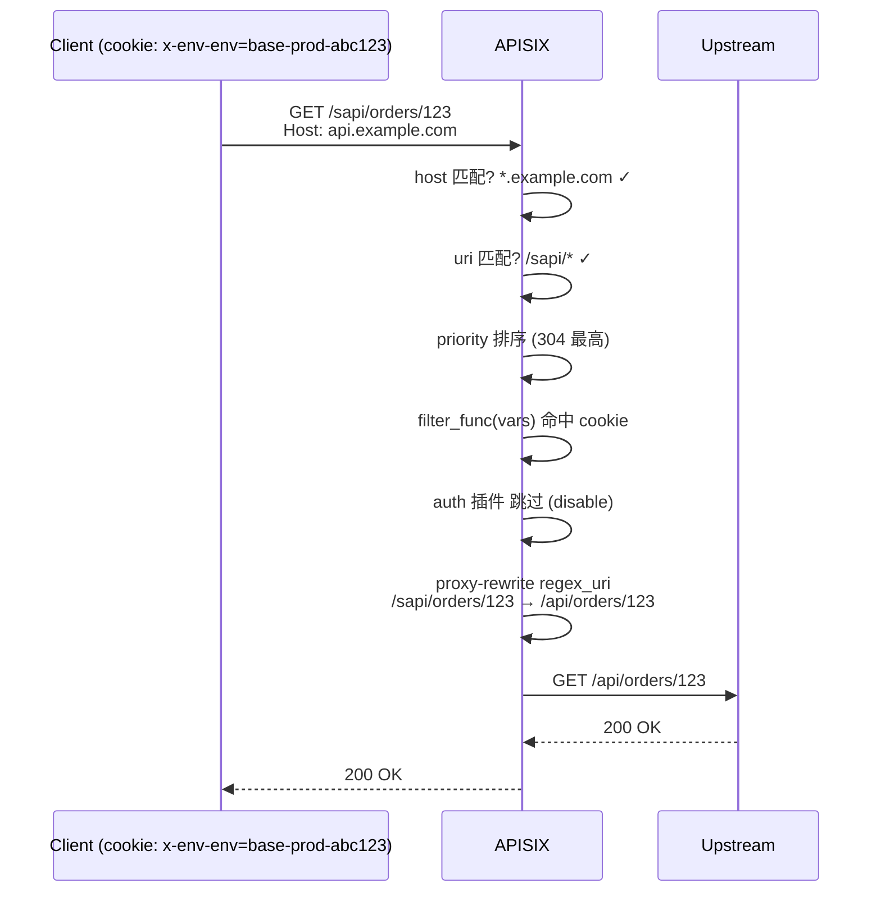

最近团队内部一次跨环境联调，因为有人忘了切流量染色 cookie，把预发请求打到了生产 —— 事故不大，但引发了一波复盘。这篇文章想把那段承担了"染色分发"职责的 APISIX 路由配置从结构上拆清楚。



<!--more-->

## 一、原始配置（脱敏后）

```json
{
  "uris": ["/sapi/*"],
  "name": "demo-gateway-site-open-release",
  "priority": 304,
  "methods": ["GET", "HEAD", "POST", "PUT", "DELETE", "OPTIONS", "PATCH"],
  "hosts": ["*.example.com"],
  "filter_func": "function(vars) return vars[\"cookie_x-env-base\"] == \"release\" or vars[\"http_x_env_env\"] == \"release\" or vars[\"http_x_env_env\"] == \"base-prod-abc123\" or vars[\"cookie_x-env-env\"] == \"base-prod-abc123\" end",
  "plugins": {
    "auth": { "disable": true },
    "proxy-rewrite": {
      "regex_uri": ["^/sapi/(.*)", "/api/$1"]
    }
  },
  "service_id": "demo-gateway-site-open-release",
  "status": 1
}
```

这段配置的任务很明确：把符合"环境染色标记"的请求，从对外暴露的 `/sapi/*` 路径重写为内部的 `/api/*`，转发到对应 Service 的上游节点。逐项拆解。

## 二、基础匹配三件套：`uris` / `hosts` / `methods`

```json
"uris":   ["/sapi/*"],
"hosts":  ["*.example.com"],
"methods":["GET", "HEAD", "POST", "PUT", "DELETE", "OPTIONS", "PATCH"]
```

三个字段全是**数组**，目的是"或"语义——任意一项命中就算匹配。三件套之间也是"或"的并列关系，但 `methods` 是必传时缺省 7 个常见方法。

两个常被忽略的细节：

- **`hosts` 不写则不限制域名**，但 `*` 不会通配——必须用 `*.example.com`，nginx 那种主机名通配语义
- `uris` 里的 `/sapi/*` 是 **radix tree 的前缀匹配**，不是 nginx location 的正则。`*` 表示"任意非空后续"，空路径不会匹配

## 三、`filter_func`：在标准匹配之外的"染色判定"

`filter_func` 是一段**字符串形式的 Lua 函数体**。APISIX 内部用 `loadstring` 编译它，传入的 `vars` 是一个表，键是 nginx 变量名，值是变量值。

把上面那段函数展开：

```lua
function(vars)
    return
        vars["cookie_x-env-base"]    == "release"        -- Cookie 路径
     or vars["http_x_env_env"]      == "release"        -- 头: X-Env-Env
     or vars["http_x_env_env"]      == "base-prod-abc123" -- 头: 染色串
     or vars["cookie_x-env-env"]    == "base-prod-abc123" -- Cookie: 染色串
end
```

四个条件任一满足就放行——`or` 串联。第一、第二个是"显式"放行（标记为 release），第三、第四个是"环境标识"放行（标记命中这个具体环境）。两者关系是：**标记 = release 永远放行，其他环境标识按需放行**。

### `cookie_` 与 `http_` 的命名差异是个常踩的坑

nginx 的两组变量转换规则不同：

- **`$http_<name>`**：HTTP 头转成 nginx 变量时，**全部小写 + 连字符变下划线**。所以请求头 `X-Env-Env` 对应的是 `$http_x_env_env`
- **`$cookie_<name>`**：cookie 名**保留原样**（连字符、大小写），但匹配是大小写不敏感的。所以 `X-Env-Env` 这个 cookie 既是 `$cookie_x-env-env` 也能用 `$cookie_x_env_env` 访问

这条规则在原生 nginx 里如此，在 APISIX 的 `filter_func` 和 `vars` 表达式里也完全一样。

### `filter_func` vs `vars` 表达式

APISIX 有两套自定义匹配机制，长期并存：

| | `vars` | `filter_func` |
|---|---|---|
| 形式 | 声明式 `[[var, op, val], ...]` | Lua 函数体字符串 |
| 操作符 | `==`、`~=`、`>`、`<`、`~~`(regex) | 任意 Lua 逻辑 |
| 适用 | 简单多条件 | `or` 混 cookie/header/param、跨变量组合 |

能写 `vars` 就写 `vars`（声明式更易审计），写不出来再上 `filter_func`。我们这里四个条件里有 cookie 和 header 混排，用 `filter_func` 比 `vars` 直观得多。

## 四、`priority`：当多条路由都可能命中

```json
"priority": 304
```

`priority` 是个**数字字段，越大越先匹配**。当多个路由的匹配条件互有重叠（比如都挂在 `/sapi/*` 下），`priority` 决定先评估谁。

这个路由为什么需要显式排优先级？因为它和同前缀下的"非 release 路由"是互补的——A 路由 priority=304 只接 release 标记，B 路由 priority=300 接其他标记。如果不设优先级，APISIX 行为是不确定的（按 radix tree 节点插入顺序回退，不一定符合业务意图）。

实际生产中一个常见模式是：**显式放行的高优，兜底放行的低优，剩下都返回 404**。priority 数字本身没有约定，但同一个 host+uri 域里建议用 100 起步、按 10 的倍数递增，方便后续插入新规则。

## 五、plugin 的两块：`auth.disable` 和 `proxy-rewrite.regex_uri`

```json
"plugins": {
  "auth": { "disable": true },
  "proxy-rewrite": { "regex_uri": ["^/sapi/(.*)", "/api/$1"] }
}
```

### `auth.disable: true` 的真实含义

插件配置里的 `disable: true` 不是"这个路由关闭认证"，而是"**关闭从 Service 继承的 auth 插件**"。Service 上挂的 auth 插件默认会作用到所有挂载它的路由；要让某条路由不走认证，**不要**直接在 route 上覆盖 auth 配置（那只会变成"在 route 级别重新配 auth"，仍然生效），而是用 `disable: true` 显式断开继承。

这是 APISIX 插件优先级里容易搞错的一条：route 配 disable 才会跳过 service 继承。

### `proxy-rewrite.regex_uri` 做路径翻译

```json
"regex_uri": ["^/sapi/(.*)", "/api/$1"]
```

- 第一个元素：nginx 正则（要匹配的部分）
- 第二个元素：替换串，`$1` 反向引用捕获组

请求 `/sapi/orders/123` 转发给上游时变成 `/api/orders/123`。这是为了**对外路径稳定**（前后端契约已经按 `/sapi/*` 发文档/接 SDK）而**对内路径简洁**（上游只认 `/api/*`）。

`regex_uri` 跟 `proxy-rewrite.uri` 是互斥的：数组形式带正则，字符串形式是固定前缀替换。混用会在 schema 校验阶段被拒。

## 六、`service_id` 与 `status`

```json
"service_id": "demo-gateway-site-open-release",
"status": 1
```

`service_id` 把上游和插件的公共配置抽出来复用——上游节点、健康检查、限流参数都挂在 Service 对象上，route 只承担"匹配+改写+染色"的职责。一个 Service 配多个 route 是 APISIX 里非常常见的"骨架与外皮分离"模式。

`status: 1` 是 route 自己的开关字段。`1` 启用、`0` 停用。这是 2.2 引入的字段——之前的版本只能删/重建 route，要"临时停掉某条路由"很麻烦，现在改个字段就行。灰度回滚、紧急止血都靠它。

## 七、整条链路走一遍



## 八、这套配置反推出的设计选择

回过头看，这段配置其实是几个工程权衡的具象化：

1. **路径用对外 `/sapi`、对内 `/api`**：契约层与实现层解耦，开放平台常见模式
2. **染色标记用 cookie 和 header 双通道**：浏览器场景走 cookie（跨页面保持），server-to-server 走 header（不让无关 cookie 干扰）；双通道是冗余而不是必须
3. **filter_func 把多种放行条件聚在一处**：避免拆成多条路由（每条 priority 不同、维护复杂），代价是这段 Lua 函数是事实上的"准入规则"——变更要走 code review
4. **路由骨架与 Service 复用**：上游节点、限流、监控都集中在 Service 上，route 只描述"谁匹配 + 怎么改写"

## 九、生产里两个值得提醒的坑

**坑 1：filter_func 的字符串一旦写错就是语法错误，不是业务错误。** APISIX 不会在 admin API 调用时做 Lua 编译，错误只会在请求到来时报 500。所以改 filter_func 之后，第一件事是用低优先级的同结构路由灰度，而不是直接 push 到高优路由。

**坑 2：plugin 的 `disable: true` 只对从 Service 继承来的插件有效。** 如果你在 route 上**新挂**了一个插件但写 `disable: true`，行为是"该插件未启用"而不是"继承的同名插件被关掉"——命名上看似乎一样，但实际语义分得很清。

---

最后，回到开头那个事故：某同事从生产环境直接复制了 release 染色的 cookie 带到预发去用，预发的非 release 路由没匹配上、走到了默认兜底返回 404，看起来像系统坏了。解法不是更严格的 cookie 校验，而是**环境隔离**和**显式染色**——这套配置里的 `vars["http_x_env_env"] == "base-prod-abc123"` 就是后者的一次实现。下一篇想写一下同主题下"染色 + 灰度"的组合用法。
