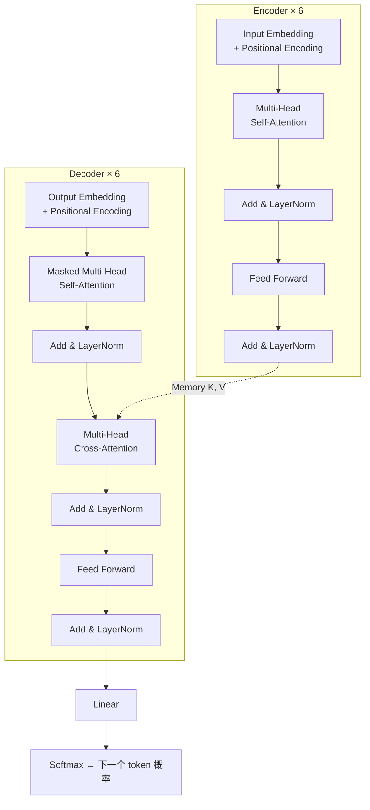

2017 年 6 月，谷歌的 8 位研究者提交了一篇只有 8 页正文的论文。它没有提出新的训练技巧，没有刷爆某个榜单的绝对数值，甚至标题看起来像一句玩笑。

但今天你用的每一个大模型——GPT、Claude、Gemini、DeepSeek、Qwen——血管里流的都是这篇论文写下的那行公式：

```
Attention(Q, K, V) = softmax(QKᵀ / √d_k) V
```

这篇文章做两件事：**第一部分**是论文正文的完整中英对照翻译；**第二部分**是我用今天的视角写的解读——那些论文里一笔带过、但后来被证明至关重要的细节。

> 翻译体例：每个段落先列英文原文（引用块），紧接中文译文。公式与表格为便于阅读做了重排，专业术语保留英文并附中文。

<!--more-->

## 论文信息

| 项目 | 内容 |
|------|------|
| 标题 | Attention Is All You Need |
| 作者 | Ashish Vaswani, Noam Shazeer, Niki Parmar, Jakob Uszkoreit, Llion Jones, Aidan N. Gomez, Łukasz Kaiser, Illia Polosukhin（8 人并列贡献，署名随机排序） |
| 机构 | Google Brain / Google Research / University of Toronto |
| 发表 | NeurIPS 2017（arXiv 提交于 2017-06-12） |
| 编号 | arXiv:1706.03762 |
| 代码 | github.com/tensorflow/tensor2tensor |
| 字数 | 正文约 8 页，参考文献 40 条 |

一个有意思的细节：论文脚注里明确记录了分工——**Jakob 提出用自注意力替换 RNN**，**Noam 提出了缩放点积注意力、多头注意力和无参数位置表示**。今天大模型里最常用的三块积木，是两个人分别提出的。

---

## 第一部分 · 全文翻译（中英对照）

### Abstract · 摘要

> The dominant sequence transduction models are based on complex recurrent or convolutional neural networks that include an encoder and a decoder. The best performing models also connect the encoder and decoder through an attention mechanism. We propose a new simple network architecture, the Transformer, based solely on attention mechanisms, dispensing with recurrence and convolutions entirely.

主流的序列转换（sequence transduction）模型都基于复杂的循环或卷积神经网络，结构上包含一个编码器和一个解码器。表现最好的模型还会通过注意力机制把编码器和解码器连接起来。我们提出一种新的、简单的网络架构——**Transformer**，它完全基于注意力机制，**彻底抛弃了循环和卷积**。

> Experiments on two machine translation tasks show these models to be superior in quality while being more parallelizable and requiring significantly less time to train. Our model achieves 28.4 BLEU on the WMT 2014 English-to-German translation task, improving over the existing best results, including ensembles, by over 2 BLEU.

在两个机器翻译任务上的实验表明，这些模型在质量上更优，同时**可并行化程度更高、训练所需时间显著更少**。我们的模型在 WMT 2014 英德翻译任务上取得 28.4 BLEU，比此前最好的结果（包括集成模型）**高出 2 BLEU 以上**。

> On the WMT 2014 English-to-French translation task, our model establishes a new single-model state-of-the-art BLEU score of 41.8 after training for 3.5 days on eight GPUs, a small fraction of the training costs of the best models from the literature.

在 WMT 2014 英法翻译任务上，我们的模型在 8 块 GPU 上训练 3.5 天后，创造了 **41.8 BLEU** 的单模型新纪录，训练成本仅为文献中最佳模型的**很小一部分**。

> We show that the Transformer generalizes well to other tasks by applying it successfully to English constituency parsing both with large and limited training data.

我们还把 Transformer 成功应用于英语成分句法分析（constituency parsing），无论训练数据充足还是有限，都表现良好，证明它能很好地泛化到其他任务。

### 1 Introduction · 引言

> Recurrent neural networks, long short-term memory [13] and gated recurrent [7] neural networks in particular, have been firmly established as state of the art approaches in sequence modeling and transduction problems such as language modeling and machine translation [35, 2, 5]. Numerous efforts have since continued to push the boundaries of recurrent language models and encoder-decoder architectures [38, 24, 15].

循环神经网络（RNN），尤其是长短期记忆网络（LSTM）[13] 和门控循环网络（GRU）[7]，已经在序列建模与转换问题（如语言建模和机器翻译）中牢牢确立了主流地位 [35, 2, 5]。此后大量工作持续推进循环语言模型和编码器-解码器架构的边界 [38, 24, 15]。

> Recurrent models typically factor computation along the symbol positions of the input and output sequences. Aligning the positions to steps in computation time, they generate a sequence of hidden states h_t, as a function of the previous hidden state h_{t-1} and the input for position t. This inherently sequential nature precludes parallelization within training examples, which becomes critical at longer sequence lengths, as memory constraints limit batching across examples.

循环模型通常沿着输入和输出序列的符号位置来分解计算。它们把位置对齐到计算时间步，生成隐状态序列 h_t，其中 h_t 是前一隐状态 h_{t-1} 和位置 t 处输入的函数。这种**固有的顺序性**使得**单个训练样本内部无法并行化**；当序列变长时这一点变得尤为致命，因为显存限制又制约了跨样本的批处理。

> Recent work has achieved significant improvements in computational efficiency through factorization tricks [21] and conditional computation [32], while also improving model performance in case of the latter. The fundamental constraint of sequential computation, however, remains.

近期工作通过分解技巧 [21] 和条件计算 [32] 在计算效率上取得了显著改进（后者同时还提升了模型表现）。然而，**顺序计算这一根本约束依然存在**。

> Attention mechanisms have become an integral part of compelling sequence modeling and transduction models in various tasks, allowing modeling of dependencies without regard to their distance in the input or output sequences [2, 19]. In all but a few cases [27], however, such attention mechanisms are used in conjunction with a recurrent network.

注意力机制已经成为各类任务中序列建模和转换模型不可或缺的组成部分，它允许**建模依赖关系时不必考虑它们在输入或输出序列中的距离** [2, 19]。然而除了极少数情况 [27]，这类注意力机制都是**与循环网络配合使用**的。

> In this work we propose the Transformer, a model architecture eschewing recurrence and instead relying entirely on an attention mechanism to draw global dependencies between input and output. The Transformer allows for significantly more parallelization and can reach a new state of the art in translation quality after being trained for as little as twelve hours on eight P100 GPUs.

在这项工作中，我们提出 **Transformer**——一种避开循环结构、完全依赖注意力机制来刻画输入与输出之间全局依赖的模型架构。Transformer 允许**高得多的并行度**，并且**在 8 块 P100 GPU 上仅训练 12 小时**就能达到翻译质量的新纪录。

### 2 Background · 背景

> The goal of reducing sequential computation also forms the foundation of Extended Neural GPU [16], ByteNet [18] and ConvS2S [9], all of which use convolutional neural networks as basic building block, computing hidden representations in parallel for all input and output positions.

减少顺序计算这一目标同样是 Extended Neural GPU [16]、ByteNet [18] 和 ConvS2S [9] 的基础，它们都用卷积神经网络作为基本构件，对**所有输入和输出位置并行**地计算隐表示。

> In these models, the number of operations required to relate signals from two arbitrary input or output positions grows in the distance between positions, linearly for ConvS2S and logarithmically for ByteNet. This makes it more difficult to learn dependencies between distant positions [12]. In the Transformer this is reduced to a constant number of operations, albeit at the cost of reduced effective resolution due to averaging attention-weighted positions, an effect we counteract with Multi-Head Attention as described in section 3.2.

在这些模型中，关联两个任意输入或输出位置所需的**操作数量随位置间距离增长**：ConvS2S 是线性增长，ByteNet 是对数增长。这使得学习远距离位置之间的依赖变得更困难 [12]。而在 Transformer 中，这一数量被**降为常数级**——代价是由于对注意力加权位置做平均而导致**有效分辨率下降**；我们通过 3.2 节所述的**多头注意力**来抵消这一影响。

> Self-attention, sometimes called intra-attention is an attention mechanism relating different positions of a single sequence in order to compute a representation of the sequence. Self-attention has been used successfully in a variety of tasks including reading comprehension, abstractive summarization, textual entailment and learning task-independent sentence representations [4, 27, 28, 22].

**自注意力**（有时也称内部注意力，intra-attention）是一种把单个序列的不同位置关联起来、从而计算该序列表示的注意力机制。自注意力已在多种任务中成功应用，包括阅读理解、抽象式摘要、文本蕴含以及学习与任务无关的句子表示 [4, 27, 28, 22]。

> End-to-end memory networks are based on a recurrent attention mechanism instead of sequence-aligned recurrence and have been shown to perform well on simple-language question answering and language modeling tasks [34].

端到端记忆网络 [34] 基于一种**循环注意力机制**而非与序列对齐的循环结构，并在简单语言问答和语言建模任务上表现良好。

> To the best of our knowledge, however, the Transformer is the first transduction model relying entirely on self-attention to compute representations of its input and output without using sequence-aligned RNNs or convolution.

然而据我们所知，**Transformer 是第一个完全依赖自注意力来计算输入和输出表示、且不使用与序列对齐的 RNN 或卷积的转换模型**。

### 3 Model Architecture · 模型结构

> Most competitive neural sequence transduction models have an encoder-decoder structure [5, 2, 35]. Here, the encoder maps an input sequence of symbol representations (x_1, ..., x_n) to a sequence of continuous representations z = (z_1, ..., z_n). Given z, the decoder then generates an output sequence (y_1, ..., y_m) of symbols one element at a time. At each step the model is auto-regressive [10], consuming the previously generated symbols as additional input when generating the next.

大多数有竞争力的神经序列转换模型都具有**编码器-解码器结构** [5, 2, 35]。编码器把输入的符号表示序列 (x_1, ..., x_n) 映射为连续表示序列 z = (z_1, ..., z_n)。给定 z，解码器再**逐个元素**地生成输出符号序列 (y_1, ..., y_m)。每一步模型都是**自回归**的 [10]：生成下一个符号时，会把之前已生成的符号作为额外输入。

> The Transformer follows this overall architecture using stacked self-attention and point-wise, fully connected layers for both the encoder and decoder, shown in the left and right halves of Figure 1, respectively.

Transformer 沿用这一总体架构，编码器和解码器都使用**堆叠的自注意力层**和**逐位置的全连接层**（分别见图 1 的左半和右半）。



#### 3.1 Encoder and Decoder Stacks · 编码器栈与解码器栈

> **Encoder:** The encoder is composed of a stack of N = 6 identical layers. Each layer has two sub-layers. The first is a multi-head self-attention mechanism, and the second is a simple, position-wise fully connected feed-forward network. We employ a residual connection [11] around each of the two sub-layers, followed by layer normalization [1]. That is, the output of each sub-layer is LayerNorm(x + Sublayer(x)), where Sublayer(x) is the function implemented by the sub-layer itself. To facilitate these residual connections, all sub-layers in the model, as well as the embedding layers, produce outputs of dimension d_model = 512.

**编码器**：由 N = 6 个相同的层堆叠而成。每层有两个子层：第一个是**多头自注意力机制**，第二个是简单的**逐位置全连接前馈网络**。我们在两个子层外围都使用了**残差连接** [11]，之后接**层归一化** [1]。即每个子层的输出是 LayerNorm(x + Sublayer(x))。为了方便残差相加，模型中所有子层以及嵌入层的输出维度都统一为 d_model = 512。

> **Decoder:** The decoder is also composed of a stack of N = 6 identical layers. In addition to the two sub-layers in each encoder layer, the decoder inserts a third sub-layer, which performs multi-head attention over the output of the encoder stack. Similar to the encoder, we employ residual connections around each of the sub-layers, followed by layer normalization. We also modify the self-attention sub-layer in the decoder stack to prevent positions from attending to subsequent positions. This masking, combined with fact that the output embeddings are offset by one position, ensures that the predictions for position i can depend only on the known outputs at positions less than i.

**解码器**：同样由 N = 6 个相同的层堆叠而成。除了编码器层中的两个子层外，解码器**插入了第三个子层**，对编码器栈的输出做多头注意力。与编码器类似，每个子层外都使用残差连接 + 层归一化。我们还**修改了解码器中的自注意力子层，防止位置关注后续位置**。这种掩码，再加上输出嵌入右移一个位置，确保了位置 i 的预测**只能依赖于位置 i 之前的已知输出**。

#### 3.2 Attention · 注意力

> An attention function can be described as mapping a query and a set of key-value pairs to an output, where the query, keys, values, and output are all vectors. The output is computed as a weighted sum of the values, where the weight assigned to each value is computed by a compatibility function of the query with the corresponding key.

注意力函数可以描述为：把一个**查询**（query）和一组**键-值对**（key-value pairs）映射为一个输出，其中 query、keys、values 和输出都是向量。输出是**值的加权和**，而每个值被赋予的权重，由 query 与对应 key 的**兼容性函数**计算得到。

##### 3.2.1 Scaled Dot-Product Attention · 缩放点积注意力

> We call our particular attention "Scaled Dot-Product Attention" (Figure 2). The input consists of queries and keys of dimension d_k, and values of dimension d_v. We compute the dot products of the query with all keys, divide each by √d_k, and apply a softmax function to obtain the weights on the values.

我们把这种注意力称为"**缩放点积注意力**"（图 2）。输入包括维度为 d_k 的 query 和 key，以及维度为 d_v 的 value。我们计算 query 与所有 key 的点积，**每个点积除以 √d_k**，然后施加 softmax 得到作用在 value 上的权重。

> In practice, we compute the attention function on a set of queries simultaneously, packed together into a matrix Q. The keys and values are also packed together into matrices K and V. We compute the matrix of outputs as:

实践中，我们把一组 query 打包成矩阵 Q 同时计算注意力。key 和 value 也分别打包成矩阵 K 和 V。输出矩阵计算如下：

```
Attention(Q, K, V) = softmax( Q Kᵀ / √d_k ) V          …… (1)
```

> The two most commonly used attention functions are additive attention [2], and dot-product (multiplicative) attention. Dot-product attention is identical to our algorithm, except for the scaling factor of 1/√d_k. Additive attention computes the compatibility function using a feed-forward network with a single hidden layer. While the two are similar in theoretical complexity, dot-product attention is much faster and more space-efficient in practice, since it can be implemented using highly optimized matrix multiplication code.

最常用的两种注意力函数是**加性注意力** [2] 和**点积（乘性）注意力**。点积注意力与我们的算法完全一致，只差 1/√d_k 这个缩放因子。加性注意力用一个单隐层的前馈网络来计算兼容性函数。两者理论复杂度相近，但**点积注意力在实践中快得多、也更省显存**，因为它可用高度优化的矩阵乘法代码实现。

> While for small values of d_k the two mechanisms perform similarly, additive attention outperforms dot product attention without scaling for larger values of d_k [3]. We suspect that for large values of d_k, the dot products grow large in magnitude, pushing the softmax function into regions where it has extremely small gradients. To illustrate why the dot products get large, assume that the components of q and k are independent random variables with mean 0 and variance 1. Then their dot product q · k = Σ q_i k_i has mean 0 and variance d_k. To counteract this effect, we scale the dot products by 1/√d_k.

当 d_k 较小时两者表现相近，但**当 d_k 较大时，未缩放的点积注意力会输给加性注意力** [3]。我们猜测：当 d_k 很大时，点积的**数值量级会变大**，把 softmax 推入**梯度极小的区域**。为什么点积会变大？假设 q 和 k 的各个分量是均值 0、方差 1 的独立随机变量，那么它们的点积 q · k = Σ q_i k_i 的**均值为 0，方差为 d_k**。为了抵消这一效应，我们把点积除以 √d_k。

##### 3.2.2 Multi-Head Attention · 多头注意力

> Instead of performing a single attention function with d_model-dimensional keys, values and queries, we found it beneficial to linearly project the queries, keys and values h times with different, learned linear projections to d_k, d_k and d_v dimensions, respectively. On each of these projected versions of queries, keys and values we then perform the attention function in parallel, yielding d_v-dimensional output values. These are concatenated and once again projected, resulting in the final values, as depicted in Figure 2.

我们发现，与其用 d_model 维的 key、value、query 做**一次**注意力，不如用 h 组不同的、可学习的线性投影，把 query、key、value 分别投影到 d_k、d_k、d_v 维。然后在这 h 组投影结果上**并行地**执行注意力函数，得到 h 个 d_v 维输出。它们被**拼接**后再做一次投影，得到最终输出（见图 2）。

```
MultiHead(Q, K, V) = Concat(head_1, ..., head_h) W^O
       where head_i = Attention(Q W_i^Q, K W_i^K, V W_i^V)

投影参数矩阵：
  W_i^Q ∈ R^(d_model × d_k)   W_i^K ∈ R^(d_model × d_k)
  W_i^V ∈ R^(d_model × d_v)   W^O   ∈ R^(h·d_v × d_model)
```

> Multi-head attention allows the model to jointly attend to information from different representation subspaces at different positions. With a single attention head, averaging inhibits this.

多头注意力让模型能够**同时关注来自不同表示子空间、不同位置**的信息。而**只用单个注意力头时，平均操作会抑制这一点**。

> In this work we employ h = 8 parallel attention layers, or heads. For each of these we use d_k = d_v = d_model / h = 64. Due to the reduced dimension of each head, the total computational cost is similar to that of single-head attention with full dimensionality.

本工作中我们使用 **h = 8** 个并行的注意力层（头），每个头的 d_k = d_v = d_model / h = 64。由于**每个头的维度被压缩了**，总计算成本与全维度的单头注意力**相当**。

##### 3.2.3 Applications of Attention in our Model · 注意力在本模型中的三处应用

> The Transformer uses multi-head attention in three different ways:

Transformer 以三种不同方式使用多头注意力：

> **1.** In "encoder-decoder attention" layers, the queries come from the previous decoder layer, and the memory keys and values come from the output of the encoder. This allows every position in the decoder to attend over all positions in the input sequence. This mimics the typical encoder-decoder attention mechanisms in sequence-to-sequence models.

**1. 编码器-解码器注意力**（交叉注意力）层：query 来自解码器的前一层，而**记忆的 key 和 value 来自编码器的输出**。这让解码器中的每个位置都能关注输入序列的所有位置。这与序列到序列模型中典型的编解码注意力机制一致。

> **2.** The encoder contains self-attention layers. In a self-attention layer all of the keys, values and queries come from the same place, in this case, the output of the previous layer in the encoder. Each position in the encoder can attend to all positions in the previous layer of the encoder.

**2. 编码器自注意力层**：在自注意力层中，key、value、query **同源**——都来自编码器前一层的输出。编码器中的每个位置都可以关注前一层的所有位置。

> **3.** Similarly, self-attention layers in the decoder allow each position in the decoder to attend to all positions in the decoder up to and including that position. We need to prevent leftward information flow in the decoder to preserve the auto-regressive property. We implement this inside of scaled dot-product attention by masking out (setting to −∞) all values in the input of the softmax which correspond to illegal connections.

**3. 解码器带掩码的自注意力层**：解码器中的每个位置可以关注**它自身及之前**的所有位置。为了保持自回归性质，我们必须阻止**信息向左流动**。实现方式是在缩放点积注意力内部，把 softmax 输入中对应非法连接的位置**掩蔽为 −∞**。

#### 3.3 Position-wise Feed-Forward Networks · 逐位置前馈网络

> In addition to attention sub-layers, each of the layers in our encoder and decoder contains a fully connected feed-forward network, which is applied to each position separately and identically. This consists of two linear transformations with a ReLU activation in between.

除了注意力子层，编码器和解码器的每一层还包含一个全连接前馈网络，它**对每个位置分别且相同地**作用。它由两个线性变换和中间的 ReLU 激活组成：

```
FFN(x) = max(0, x W_1 + b_1) W_2 + b_2                  …… (2)
```

> While the linear transformations are the same across different positions, they use different parameters from layer to layer. Another way of describing this is as two convolutions with kernel size 1. The dimensionality of input and output is d_model = 512, and the inner-layer has dimensionality d_ff = 2048.

虽然线性变换在不同位置之间是共享的，但**层与层之间使用不同的参数**。另一种描述方式是：这是两个**卷积核大小为 1** 的卷积。输入和输出的维度是 d_model = 512，中间层维度是 d_ff = 2048。

#### 3.4 Embeddings and Softmax · 嵌入与 Softmax

> Similarly to other sequence transduction models, we use learned embeddings to convert the input tokens and output tokens to vectors of dimension d_model. We also use the usual learned linear transformation and softmax function to convert the decoder output to predicted next-token probabilities. In our model, we share the same weight matrix between the two embedding layers and the pre-softmax linear transformation, similar to [30]. In the embedding layers, we multiply those weights by √d_model.

与其他序列转换模型类似，我们使用**可学习的嵌入**把输入和输出 token 转换为 d_model 维向量，也用常规的可学习线性变换 + softmax 把解码器输出转换为**下一个 token 的预测概率**。在我们的模型中，**两个嵌入层和 softmax 前的线性变换共享同一个权重矩阵** [30]。在嵌入层中，我们把这些权重**乘以 √d_model**。

#### 3.5 Positional Encoding · 位置编码

> Since our model contains no recurrence and no convolution, in order for the model to make use of the order of the sequence, we must inject some information about the relative or absolute position of the tokens in the sequence. To this end, we add "positional encodings" to the input embeddings at the bottoms of the encoder and decoder stacks. The positional encodings have the same dimension d_model as the embeddings, so that the two can be summed.

由于我们的模型**不含循环也不含卷积**，为了让模型利用序列的顺序，我们必须**注入一些关于 token 在序列中相对或绝对位置的信息**。为此，我们在编码器和解码器栈的底部，把"**位置编码**"加到输入嵌入上。位置编码与嵌入具有相同的维度 d_model，因此二者可以相加。

> In this work, we use sine and cosine functions of different frequencies:

本工作中我们使用不同频率的正弦和余弦函数：

```
PE(pos, 2i)   = sin( pos / 10000^(2i/d_model) )
PE(pos, 2i+1) = cos( pos / 10000^(2i/d_model) )
```

> where pos is the position and i is the dimension. That is, each dimension of the positional encoding corresponds to a sinusoid. The wavelengths form a geometric progression from 2π to 10000 · 2π. We chose this function because we hypothesized it would allow the model to easily learn to attend by relative positions, since for any fixed offset k, PE_{pos+k} can be represented as a linear function of PE_{pos}.

其中 pos 是位置，i 是维度。也就是说，位置编码的**每一维对应一条正弦曲线**，波长构成从 2π 到 10000·2π 的**几何级数**。我们选择这个函数，是因为我们**假设它能让模型更容易学会按相对位置来关注**——因为对任意固定偏移 k，PE_{pos+k} 都可以表示为 PE_{pos} 的**线性函数**。

> We also experimented with using learned positional embeddings [9] instead, and found that the two versions produced nearly identical results (see Table 3 row (E)). We chose the sinusoidal version because it may allow the model to extrapolate to sequence lengths longer than the ones encountered during training.

我们也尝试了改用**可学习的位置嵌入** [9]，发现两者结果**几乎完全一致**（见表 3 的 (E) 行）。我们选择正弦版本，是因为它**可能让模型外推到比训练时更长的序列长度**。

### 4 Why Self-Attention · 为什么选择自注意力

> In this section we compare various aspects of self-attention layers to the recurrent and convolutional layers commonly used for mapping one variable-length sequence of symbol representations (x_1, ..., x_n) to another sequence of equal length (z_1, ..., z_n), with x_i, z_i ∈ R^d. Motivating our use of self-attention we consider three desiderata.

本节我们把自注意力层与常用的循环层、卷积层在多个方面做比较，场景是把一个变长符号表示序列 (x_1, ..., x_n) 映射为另一个等长序列 (z_1, ..., z_n)。我们考虑三个考量因素：

> One is the total computational complexity per layer. Another is the amount of computation that can be parallelized, as measured by the minimum number of sequential operations required. The third is the path length between long-range dependencies in the network.

**一是每层的总计算复杂度**；**二是可并行化的计算量**，用所需的最少顺序操作数衡量；**三是网络中长距离依赖之间的路径长度**。

> Learning long-range dependencies is a key challenge in many sequence transduction tasks. One key factor affecting the ability to learn such dependencies is the length of the paths forward and backward signals have to traverse in the network. The shorter these paths between any combination of positions in the input and output sequences, the easier it is to learn long-range dependencies [12].

学习长距离依赖是许多序列转换任务中的关键挑战。影响这种能力的一个关键因素是：**前向和反向信号在网络中必须穿过的路径长度**。输入与输出序列中任意两个位置之间的路径越短，学习长距离依赖就越容易 [12]。

**表 1：不同层类型的最大路径长度、每层复杂度与最少顺序操作数**（n 为序列长度，d 为表示维度，k 为卷积核大小，r 为受限自注意力的邻域大小）

| 层类型 | 每层复杂度 | 顺序操作数 | 最大路径长度 |
|--------|-----------|-----------|-------------|
| Self-Attention | O(n² · d) | O(1) | O(1) |
| Recurrent | O(n · d²) | O(n) | O(n) |
| Convolutional | O(k · n · d²) | O(1) | O(log_k n) |
| Self-Attention（受限） | O(r · n · d) | O(1) | O(n/r) |

> As noted in Table 1, a self-attention layer connects all positions with a constant number of sequentially executed operations, whereas a recurrent layer requires O(n) sequential operations. In terms of computational complexity, self-attention layers are faster than recurrent layers when the sequence length n is smaller than the representation dimensionality d, which is most often the case with sentence representations used by state-of-the-art models in machine translations, such as word-piece [38] and byte-pair [31] representations.

如表 1 所示，自注意力层**用常数次顺序执行的操作**就能连接所有位置，而循环层需要 O(n) 次。就计算复杂度而言，**当序列长度 n 小于表示维度 d 时，自注意力层比循环层更快**；而机器翻译中当前最佳模型使用的句子表示（如 word-piece [38] 和 byte-pair [31]）通常正是这种情况。

> To improve computational performance for tasks involving very long sequences, self-attention could be restricted to considering only a neighborhood of size r in the input sequence centered around the respective output position. This would increase the maximum path length to O(n/r). We plan to investigate this approach further in future work.

为了在超长序列任务上提升计算性能，可以把自注意力**限制为只考虑以输出位置为中心、大小为 r 的邻域**。这会把最大路径长度增加到 O(n/r)。我们计划在未来工作中进一步研究这一思路。

> A single convolutional layer with kernel width k < n does not connect all pairs of input and output positions. Doing so requires a stack of O(n/k) convolutional layers in the case of contiguous kernels, or O(log_k n) in the case of dilated convolutions [18]. Convolutional layers are generally more expensive than recurrent layers, by a factor of k. Separable convolutions [6], however, decrease the complexity considerably, to O(k · n · d + n · d²). Even with k = n, however, the complexity of a separable convolution is equal to the combination of a self-attention layer and a point-wise feed-forward layer, the approach we take in our model.

卷积核宽度 k < n 的单个卷积层**不能连接所有输入-输出位置对**。要做到这一点，使用连续卷积核需要堆叠 O(n/k) 层，使用空洞卷积 [18] 则需要 O(log_k n) 层。卷积层通常比循环层**贵 k 倍**。然而可分离卷积 [6] 能把复杂度显著降低到 O(k · n · d + n · d²)。但即使取 k = n，可分离卷积的复杂度也**只等于"自注意力层 + 逐位置前馈层"的组合**，而后者正是我们模型所采用的做法。

> As side benefit, self-attention could yield more interpretable models. We inspect attention distributions from our models and present and discuss examples in the appendix. Not only do individual attention heads clearly learn to perform different tasks, many appear to exhibit behavior related to the syntactic and semantic structure of the sentences.

一个额外的好处是：**自注意力可能带来更可解释的模型**。我们检查了模型中的注意力分布，并在附录中展示和讨论了若干例子。不但各个注意力头**清晰地学会了执行不同的任务**，许多头还表现出了与句子的**句法和语义结构**相关的行为。

### 5 Training · 训练

#### 5.1 Training Data and Batching · 训练数据与批处理

> We trained on the standard WMT 2014 English-German dataset consisting of about 4.5 million sentence pairs. Sentences were encoded using byte-pair encoding, which has a shared source-target vocabulary of about 37000 tokens. For English-French, we used the significantly larger WMT 2014 English-French dataset consisting of 36M sentences and split tokens into a 32000 word-piece vocabulary. Sentence pairs were batched together by approximate sequence length. Each training batch contained a set of sentence pairs containing approximately 25000 source tokens and 25000 target tokens.

我们在标准的 WMT 2014 英德数据集上训练，包含约 **450 万**句对。句子使用 **BPE（字节对编码）**编码，源语言和目标语言**共享约 37000 个 token 的词表**。英法任务使用了更大的 WMT 2014 英法数据集（**3600 万**句），切分为 **32000 个 word-piece** 的词表。句对按**近似序列长度**组批，每个训练批包含约 **25000 个源 token 和 25000 个目标 token**。

#### 5.2 Hardware and Schedule · 硬件与训练安排

> We trained our models on one machine with 8 NVIDIA P100 GPUs. For our base models using the hyperparameters described throughout the paper, each training step took about 0.4 seconds. We trained the base models for a total of 100,000 steps or 12 hours. For our big models (described on the bottom line of table 3), step time was 1.0 seconds. The big models were trained for 300,000 steps (3.5 days).

我们在**一台配备 8 块 NVIDIA P100 GPU 的机器**上训练。base 模型每步约 **0.4 秒**，共训练 **100,000 步 / 12 小时**。big 模型每步 1.0 秒，训练 **300,000 步 / 3.5 天**。

#### 5.3 Optimizer · 优化器

> We used the Adam optimizer [20] with β_1 = 0.9, β_2 = 0.98 and ε = 10^-9. We varied the learning rate over the course of training, according to the formula:

我们使用 **Adam 优化器** [20]，β_1 = 0.9，β_2 = 0.98，ε = 10^-9。学习率按下式在训练过程中变化：

```
lrate = d_model^(-0.5) · min( step_num^(-0.5), step_num · warmup_steps^(-1.5) )   …… (3)
```

> This corresponds to increasing the learning rate linearly for the first warmup_steps training steps, and decreasing it thereafter proportionally to the inverse square root of the step number. We used warmup_steps = 4000.

这对应于：在前 **warmup_steps** 步**线性升高**学习率，此后按步数的**平方根倒数**衰减。我们取 **warmup_steps = 4000**。

#### 5.4 Regularization · 正则化

> **Residual Dropout** We apply dropout [33] to the output of each sub-layer, before it is added to the sub-layer input and normalized. In addition, we apply dropout to the sums of the embeddings and the positional encodings in both the encoder and decoder stacks. For the base model, we use a rate of P_drop = 0.1.

**残差 Dropout**：我们对每个子层的输出施加 dropout [33]，然后才与子层输入相加并做归一化。此外，在编码器和解码器栈中，对**嵌入与位置编码之和**也施加 dropout。base 模型使用 **P_drop = 0.1**。

> **Label Smoothing** During training, we employed label smoothing of value ε_ls = 0.1 [36]. This hurts perplexity, as the model learns to be more unsure, but improves accuracy and BLEU score.

**标签平滑**：训练时我们使用 ε_ls = 0.1 的标签平滑 [36]。这会**损害困惑度（perplexity）**，因为模型学会了"更不确定"；但它**提升了准确率和 BLEU 分数**。

### 6 Results · 实验结果

#### 6.1 Machine Translation · 机器翻译

**表 2：Transformer 在 newstest2014 上以极低的训练成本超过了此前的最佳模型**

| 模型 | EN-DE BLEU | EN-FR BLEU | 训练成本 EN-DE (FLOPs) | 训练成本 EN-FR (FLOPs) |
|------|-----------|-----------|----------------------|----------------------|
| ByteNet [18] | 23.75 | — | — | — |
| Deep-Att + PosUnk [39] | — | 39.2 | — | 1.0 × 10²⁰ |
| GNMT + RL [38] | 24.6 | 39.92 | 2.3 × 10¹⁹ | 1.4 × 10²⁰ |
| ConvS2S [9] | 25.16 | 40.46 | 9.6 × 10¹⁸ | 1.5 × 10²⁰ |
| MoE [32] | 26.03 | 40.56 | 2.0 × 10¹⁹ | 1.2 × 10²⁰ |
| Deep-Att + PosUnk Ensemble [39] | — | 40.4 | — | 8.0 × 10²⁰ |
| GNMT + RL Ensemble [38] | 26.30 | 41.16 | 1.8 × 10²⁰ | 1.1 × 10²¹ |
| ConvS2S Ensemble [9] | 26.36 | 41.29 | 7.7 × 10¹⁹ | 1.2 × 10²¹ |
| **Transformer (base)** | **27.3** | 38.1 | 3.3 × 10¹⁸ ※ | — |
| **Transformer (big)** | **28.4** | **41.8** | 2.3 × 10¹⁹ ※ | — |

※ 原文中 Transformer 两行的训练成本是**跨 EN-DE / EN-FR 两列的单一值**。另外注意：摘要与表 2 给出的英法 BLEU 是 **41.8**，而 6.1 节正文写的是 **41.0**——这是原文一处著名的笔误。

> On the WMT 2014 English-to-German translation task, the big transformer model outperforms the best previously reported models (including ensembles) by more than 2.0 BLEU, establishing a new state-of-the-art BLEU score of 28.4. Training took 3.5 days on 8 P100 GPUs. Even our base model surpasses all previously published models and ensembles, at a fraction of the training cost of any of the competitive models.

在 WMT 2014 英德翻译任务上，big 模型比此前最好的结果（**包括集成模型**）高出 **2.0 BLEU 以上**，创造了 **28.4** 的新纪录，训练仅用 8 块 P100 跑 **3.5 天**。即使是我们的 base 模型，也以**远低于**任何竞争模型的训练成本，超过了此前所有已发表的单个模型和集成模型。

> On the WMT 2014 English-to-French translation task, our big model achieves a BLEU score of 41.0, outperforming all of the previously published single models, at less than 1/4 the training cost of the previous state-of-the-art model.

在 WMT 2014 英法翻译任务上，我们的 big 模型取得 **41.0** BLEU，超过了此前所有已发表的单模型，且训练成本不到此前最佳模型的 **1/4**。

> For the base models, we used a single model obtained by averaging the last 5 checkpoints, which were written at 10-minute intervals. For the big models, we averaged the last 20 checkpoints. We used beam search with a beam size of 4 and length penalty α = 0.6. We set the maximum output length during inference to input length + 50, but terminate early when possible.

对 base 模型，我们取**最后 5 个检查点的平均**（每 10 分钟存一次）；对 big 模型，取**最后 20 个检查点**的平均。推理使用**束搜索**，束宽 4，长度惩罚 α = 0.6。推理时最大输出长度设为**输入长度 + 50**，但会尽可能提前终止。

> We estimate the number of floating point operations used to train a model by multiplying the training time, the number of GPUs used, and an estimate of the sustained single-precision floating-point capacity of each GPU. (We used values of 2.8, 3.7, 6.0 and 9.5 TFLOPS for K80, K40, M40 and P100, respectively.)

我们估算训练一个模型所用浮点运算数的方法是：训练时间 × GPU 数量 × 每块 GPU 持续单精度浮点能力的估计值。（K80、K40、M40、P100 分别取 2.8、3.7、6.0、9.5 TFLOPS。）

#### 6.2 Model Variations · 模型变体

**表 3（节选）：Transformer 架构的变体实验**（均在英德开发集 newstest2013 上评测）

| 变体 | N | d_model | d_ff | h | d_k | P_drop | ε_ls | PPL (dev) | BLEU (dev) | 参数量 (M) |
|------|---|---------|------|---|-----|--------|------|-----------|------------|-----------|
| base | 6 | 512 | 2048 | 8 | 64 | 0.1 | 0.1 | 4.92 | 25.8 | 65 |
| (A) h=1 | 6 | 512 | 2048 | 1 | 512 | 0.1 | 0.1 | 5.29 | 24.9 | — |
| (A) h=4 | 6 | 512 | 2048 | 4 | 128 | 0.1 | 0.1 | 5.00 | 25.5 | — |
| (A) h=16 | 6 | 512 | 2048 | 16 | 32 | 0.1 | 0.1 | 4.91 | 25.8 | — |
| (A) h=32 | 6 | 512 | 2048 | 32 | 16 | 0.1 | 0.1 | 5.01 | 25.4 | — |
| (B) d_k=16 | 6 | 512 | 2048 | 8 | 16 | 0.1 | 0.1 | 5.16 | 25.1 | 58 |
| (C) N=2 | 2 | 512 | 2048 | 8 | 64 | 0.1 | 0.1 | 6.11 | 23.7 | 36 |
| (C) N=8 | 8 | 512 | 2048 | 8 | 64 | 0.1 | 0.1 | 4.88 | 25.5 | 80 |
| (C) d_model=1024 | 6 | 1024 | 2048 | 8 | 128 | 0.1 | 0.1 | 4.66 | 26.0 | 168 |
| (D) P_drop=0.0 | 6 | 512 | 2048 | 8 | 64 | 0.0 | 0.1 | 5.77 | 24.6 | — |
| (D) ε_ls=0.0 | 6 | 512 | 2048 | 8 | 64 | 0.1 | 0.0 | 4.67 | 25.3 | — |
| (E) 可学习位置嵌入 | 6 | 512 | 2048 | 8 | 64 | 0.1 | 0.1 | 4.92 | 25.7 | — |
| big | 6 | 1024 | 4096 | 16 | 64 | 0.3 | 0.1 | 4.33 | 26.4 | 213 |

> In Table 3 rows (A), we vary the number of attention heads and the attention key and value dimensions, keeping the amount of computation constant. While single-head attention is 0.9 BLEU worse than the best setting, quality also drops off with too many heads.

在 (A) 行中，我们在**保持计算量不变**的前提下改变注意力头数以及 key/value 维度。**单头注意力比最佳设置差 0.9 BLEU**，但**头数过多时质量同样会下降**。

> In Table 3 rows (B), we observe that reducing the attention key size hurts model quality. This suggests that determining compatibility is not easy and that a more sophisticated compatibility function than dot product may be beneficial. We further observe in rows (C) and (D) that, as expected, bigger models are better, and dropout is very helpful in avoiding over-fitting. In row (E) we replace our sinusoidal positional encoding with learned positional embeddings, and observe nearly identical results to the base model.

在 (B) 行中，我们观察到**减小 key 的维度会损害模型质量**。这说明**判定兼容性并不容易**，也许需要比点积更复杂的兼容性函数。在 (C) 和 (D) 行中如预期所见：**模型越大越好**，且 dropout 对避免过拟合非常有帮助。在 (E) 行中，我们用可学习位置嵌入替换正弦位置编码，结果与 base 模型**几乎相同**。

#### 6.3 English Constituency Parsing · 英语成分句法分析

> To evaluate if the Transformer can generalize to other tasks we performed experiments on English constituency parsing. This task presents specific challenges: the output is subject to strong structural constraints and is significantly longer than the input. Furthermore, RNN sequence-to-sequence models have not been able to attain state-of-the-art results in small-data regimes [37].

为了评估 Transformer 能否泛化到其他任务，我们在**英语成分句法分析**上做了实验。这个任务有特殊挑战：输出受到**强结构约束**，且**明显长于输入**；此外，RNN 序列到序列模型在**小数据**场景下一直无法取得最佳结果 [37]。

> We trained a 4-layer transformer with d_model = 1024 on the Wall Street Journal (WSJ) portion of the Penn Treebank, about 40K training sentences. We also trained it in a semi-supervised setting, using the larger high-confidence and BerkeleyParser corpora with approximately 17M sentences.

我们在 Penn Treebank 的 WSJ 部分（约 **40K** 训练句）上训练了一个 d_model = 1024 的 **4 层** Transformer；也在**半监督**设置下训练，使用约 **1700 万**句的高置信度语料和 BerkeleyParser 语料。

**表 4：Transformer 在英语成分句法分析上的表现（WSJ 第 23 节 F1）**

| Parser | 训练方式 | WSJ 23 F1 |
|--------|---------|-----------|
| Vinyals & Kaiser et al. (2014) [37] | 仅 WSJ，判别式 | 88.3 |
| Petrov et al. (2006) [29] | 仅 WSJ，判别式 | 90.4 |
| Zhu et al. (2013) [40] | 仅 WSJ，判别式 | 90.4 |
| Dyer et al. (2016) [8] | 仅 WSJ，判别式 | 91.7 |
| **Transformer (4 层)** | 仅 WSJ，判别式 | **91.3** |
| McClosky et al. (2006) [26] | 半监督 | 92.1 |
| Vinyals & Kaiser et al. (2014) [37] | 半监督 | 92.1 |
| **Transformer (4 层)** | 半监督 | **92.7** |
| Luong et al. (2015) [23] | 多任务 | 93.0 |
| Dyer et al. (2016) [8] | 生成式 | 93.3 |

> Our results in Table 4 show that despite the lack of task-specific tuning our model performs surprisingly well, yielding better results than all previously reported models with the exception of the Recurrent Neural Network Grammar [8]. In contrast to RNN sequence-to-sequence models [37], the Transformer outperforms the BerkeleyParser [29] even when training only on the WSJ training set of 40K sentences.

表 4 的结果显示，尽管**几乎没有针对该任务做调参**，我们的模型表现得**出奇地好**，除 RNN Grammar [8] 外超过了此前所有已报告的模型。与 RNN 序列到序列模型 [37] 不同，Transformer **即使只用 40K 句的 WSJ 训练集**，也超过了 BerkeleyParser [29]。

### 7 Conclusion · 结论

> In this work, we presented the Transformer, the first sequence transduction model based entirely on attention, replacing the recurrent layers most commonly used in encoder-decoder architectures with multi-headed self-attention.

在这项工作中，我们提出了 **Transformer**——**第一个完全基于注意力的序列转换模型**，用多头自注意力取代了编码器-解码器架构中最常用的循环层。

> For translation tasks, the Transformer can be trained significantly faster than architectures based on recurrent or convolutional layers. On both WMT 2014 English-to-German and WMT 2014 English-to-French translation tasks, we achieve a new state of the art. In the former task our best model outperforms even all previously reported ensembles.

对翻译任务而言，Transformer 的训练速度**显著快于**基于循环或卷积层的架构。在 WMT 2014 英德和英法两个任务上，我们都创造了新纪录；在英德任务上，我们的最佳模型**甚至超过了此前所有已报告的集成模型**。

> We are excited about the future of attention-based models and plan to apply them to other tasks. We plan to extend the Transformer to problems involving input and output modalities other than text and to investigate local, restricted attention mechanisms to efficiently handle large inputs and outputs such as images, audio and video. Making generation less sequential is another research goals of ours.

我们对基于注意力的模型的未来感到兴奋，并计划把它们应用到其他任务上。我们计划把 Transformer 扩展到**文本之外的输入输出模态**，并研究**局部的、受限的注意力机制**，以高效处理图像、音频和视频等大型输入输出。**降低生成过程的顺序性**是我们的另一个研究目标。

---

## 第二部分 · 解读

### 一、这篇论文到底解决了什么问题

在 2017 年之前，做序列建模基本只有一条路：RNN/LSTM 沿着时间步一步步走。它有两个要命的地方：

1. **不能并行**：算第 t 步必须先算完第 t-1 步。一个 50 个词的句子，就是 50 次串行依赖，GPU 再强也只能干等。
2. **长距离遗忘**：信息要穿过 50 次状态传递才能从第 1 个词传到第 50 个词，梯度早就衰减得差不多了。LSTM 用门控缓解了，但没有根治。

注意力机制当时已经存在（Bahdanau 2014），但它的角色是"**挂在 RNN 上的外挂**"——帮解码器找到该看哪个源语词。

这篇论文的赌注是：**干脆把 RNN 全扔了，只用注意力**。

这个决定的本质是：把"**顺序依赖**"从模型结构里拿掉，只保留"**相关性依赖**"。词与词之间的关系不再由"谁挨着谁"决定，而是由"谁和谁相关"决定——后者是一堆矩阵乘法，天然可以并行。

一句话总结这个设计哲学：

> 顺序是数据的属性，不该是计算图的结构约束。

### 二、注意力到底在算什么：一次软性查表

公式本身很简单：

```
Attention(Q, K, V) = softmax(QKᵀ / √d_k) V
```

拆成三步看：

| 步骤 | 计算 | 直觉 |
|------|------|------|
| 1. 打分 | QKᵀ | 每个 query 和所有 key 做点积，得到"相关性分数" |
| 2. 归一 | softmax(· / √d_k) | 把分数变成一组和为 1 的权重 |
| 3. 取值 | × V | 按权重把所有 value 加权求和 |

最贴切的类比是**可微的字典查表**：

- 普通字典：给出 key，返回唯一的 value（硬查表）
- 注意力：给出 query，和所有 key 比一比，**按相似度把所有的 value 混一点**（软查表）

关键在于它**可微**。硬查表（argmax）不可导，没法放进神经网络里训练；softmax 给了它一个平滑的、有梯度的版本。这就是为什么"注意力"能被训练出来。

在自注意力里，Q、K、V 都来自同一个序列——序列自己在跟自己比对，每个词都在决定"我现在该看谁"。

### 三、那个 √d_k 到底为什么要除

这是论文里最容易被跳过、也最值得细看的一个细节。原文只用了一个脚注解释，但它决定了 Transformer 能不能训起来。

推导很简单。设 q 和 k 的各分量独立、均值 0、方差 1，那么：

```
q · k = Σ(i=1..d_k) q_i k_i
E[q·k] = 0
Var[q·k] = d_k        （方差可加，d_k 个方差为 1 的项相加）
```

也就是说，点积的**标准差是 √d_k**。d_k = 64 时标准差是 8，d_k = 512 时是 22.6。

这不缩放会怎样？softmax 是：

```
softmax(z_i) = exp(z_i) / Σ exp(z_j)
```

当 z 的量级变大，softmax 的输出会**迅速饱和成 one-hot**：最大的那个接近 1，其余接近 0。数学上，softmax 的雅可比是 diag(p) - p pᵀ，当 p 接近 one-hot 时，**几乎所有梯度都趋近 0**。

后果就是：**注意力分布变得很硬，但梯度传不回去**，模型学不动。

除以 √d_k 之后，点积的方差被拉回 1，softmax 的输入回到"温和"的区间，梯度健康。

一个更实用的理解方式：**softmax 对输入的尺度极度敏感，而点积的尺度会随维度增长。缩放是为了把 softmax 的工作区间固定住。**

这也是为什么今天所有注意力实现（包括 FlashAttention）里这一步都不能省——它不是工程技巧，是数学必需。

### 四、多头注意力：不是"多个注意力"这么简单

论文给的理由是"让模型同时关注不同表示子空间的信息"，还说了一句很关键的话：

> With a single attention head, averaging inhibits this.
> （只有单个注意力头时，平均操作会抑制这一点。）

这句话值得展开。单头注意力输出的是**所有 value 的一个加权平均**。如果一个词同时需要承担两种关系——比如既是动词的主语、又和某个代词指代同一实体——那么单头只能输出一个"折中"的向量，两种信息互相稀释。

多头就是给模型开 **h 个独立的"注意力通道"**：

```
d_model = 512,  h = 8  →  d_k = d_v = 64

每个头在 64 维子空间里各算各的注意力
8 个 64 维输出拼接回 512 维，再过一次线性投影 W^O
```

**成本为什么不变**：单头是 O(n² · 512)，8 个头是 8 × O(n² · 64) = O(n² · 512)。完全一样。这几乎是免费的午餐。

后来大量可视化研究印证了论文的观察：不同的头确实学会了不同的模式——有的专注下一个词（positional head），有的专注句法依存，有的专注指代消解，有的干脆是"谁都不看"的注意力汇聚点（attention sink）。

**头数不是越多越好**：表 3 的 (A) 行显示，h=1 时 BLEU 24.9（比最佳的 25.8 差 0.9），而 h=32 时降到 25.4。每个头分到的维度太小（16 维），表达能力反而不够。今天 LLaMA 这类模型常用 32～64 个头，但配更大的 d_model，每个头仍有 128 维左右。

### 五、位置编码：给"无序"的模型注入顺序

自注意力是一个**集合（set）操作**——把输入当成一袋子向量，谁先谁后它根本不知道。打乱词序，输出只是顺序被打乱，内容不变。这对语言是致命的。

论文的解法很朴素：**加进去**。

```
PE(pos, 2i)   = sin(pos / 10000^(2i/d_model))
PE(pos, 2i+1) = cos(pos / 10000^(2i/d_model))

final_input = token_embedding + PE
```

三个设计点值得注意：

**1. 多频率**：每一维对应一条不同波长的正弦波，波长从 2π 到 10000·2π 呈几何级数。这本质上是一个**二进制编码的连续版本**——低频维捕捉粗粒度位置，高频维捕捉细粒度位置。

**2. 相对位置可线性表达**：论文说"对任意固定偏移 k，PE_{pos+k} 都可以表示为 PE_{pos} 的线性函数"。这是真的，因为正弦的平移是旋转：

```
[sin(ω(pos+k))]   [cos(ωk)  sin(ωk)] [sin(ω·pos)]
[cos(ω(pos+k))] = [-sin(ωk) cos(ωk)] [cos(ω·pos)]
```

旋转矩阵与 pos 无关，只与 k 有关。这意味着模型可以用线性变换"读出"相对距离。

**3. 加而不是拼**：位置编码和 token 嵌入**相加**而非拼接。这在高维空间里是合理的——两者占据近似正交的子空间，相加的信息损失很小，且不增加维度。

**后来的演进**：论文选正弦编码而非可学习编码，理由是"可能外推到更长序列"。但后来的实践证明，正弦编码的外推能力并不理想。今天主流是 **RoPE（旋转位置编码）**——它不再"加"位置信息，而是**直接对 Q、K 做旋转**，让点积天然只依赖相对位置。LLaMA、Qwen、DeepSeek 用的都是它。另一条路线是 **ALiBi**，直接在注意力分数上减一个与距离成正比的惩罚项。

### 六、复杂度表：O(n²) 是福也是祸

表 1 是整篇论文信息密度最高的地方，值得再读一遍：

| 层类型 | 每层复杂度 | 并行度（顺序操作数） | 最大路径长度 |
|--------|-----------|-----------|-------------|
| Self-Attention | O(n² · d) | **O(1)** | **O(1)** |
| Recurrent | O(n · d²) | O(n) | O(n) |
| Convolutional | O(k · n · d²) | O(1) | O(log_k n) |

三个结论：

1. **并行度**：自注意力 O(1)，意味着整个序列可以一次算完。这是训练速度碾压 RNN 的根本原因。
2. **路径长度**：任意两个位置之间都是 O(1)——**一步直达**。RNN 需要 O(n) 步，长距离依赖的信息在传递中必然损耗。这是自注意力建模长距离依赖更强的根本原因。
3. **代价**：复杂度是 O(n² · d)，**随序列长度平方增长**。

当年 n（句子长度，几十）远小于 d（512），所以自注意力反而比 RNN 便宜。但今天上下文从 512 涨到 128K、1M，n² 就成了主要瓶颈——**这是一场论文当年就预见到的战争**（论文明确写了要研究"受限注意力"，也就是今天的稀疏/滑动窗口注意力）。

整条长上下文技术线的演进，本质上就是在跟这个 n² 做斗争：

- **FlashAttention**：不改数学，改 IO——用分块计算把显存访问从 O(n²) 降到 O(n)，算出精确结果
- **稀疏 / 滑动窗口注意力**：只算局部 + 少量全局 token
- **线性注意力 / Mamba 类**：把 softmax 拆成核函数形式，把复杂度降到 O(n)
- **GQA / MQA**：多头 KV 共享，压缩的是推理时的 KV Cache 显存

### 七、训练细节里藏着的经验

论文第 5 节只有半页，但每一个选择今天都还在被沿用或讨论：

**Warmup 学习率（4000 步）**

```
lrate = d_model^(-0.5) · min( step^(-0.5), step · warmup_steps^(-1.5) )
```

为什么要 warmup？训练初期模型参数是随机的，梯度方向噪声极大。如果一上来就用大学习率，Adam 的二阶动量估计还没稳定，很容易一步走偏。先小步慢走 4000 步"热身"，再进入衰减期。今天几乎所有大模型预训练都用 warmup + cosine decay，只是把 warmup 换成了步数比例。

**Label Smoothing 0.1**

论文那句观察非常精辟，也经常被引用：

> This hurts perplexity, as the model learns to be more unsure, but improves accuracy and BLEU score.

标签平滑让模型"不敢把话说满"——它不再追求 100% 确信某个词，困惑度因此变差，但**准确率提升了**。这个现象在今天有个更贴切的名字：**模型校准（calibration）**。一个过度自信的模型，在生成任务上往往更容易一条路走到黑；留一点不确定性，beam search 反而能找到更好的解。

这也解释了为什么 RLHF / DPO 之后模型的"熵"下降、输出更确定，有时会带来多样性损失——那是同一枚硬币的另一面。

**Post-LN 还是 Pre-LN**

论文用的是 `LayerNorm(x + Sublayer(x))`，即 **Post-LN**。后来大家发现 Post-LN 在深层模型上训练不稳，对 warmup 强依赖；改成 `x + Sublayer(LayerNorm(x))`（**Pre-LN**）后训练平滑得多。今天主流大模型（LLaMA、GPT 系列）几乎都用 Pre-LN，并配合 RMSNorm 做简化。**这是论文里少数被后续实践推翻的设计之一。**

**嵌入 × √d_model**

因为要和位置编码相加，而位置编码的值域固定在 [-1, 1]，如果嵌入的量级太小就会被淹没。乘 √512 ≈ 22.6 让两者量级匹配。

### 八、论文没写、但后来被证明最重要的三件事

**1. 它其实是个"翻译模型"，但真正引爆世界的是"只留一半"的版本**

论文里的 Transformer 是完整的 Encoder-Decoder，为翻译设计。但后来的历史是：

- **BERT**（2018）：只留 **Encoder**，双向注意力 + 掩码语言建模 → 统治了理解类任务两三年
- **GPT**（2018）：只留 **Decoder**，带因果掩码 + 自回归 → 最终通向今天的大语言模型

Decoder-only 赢下的原因不是翻译更好，而是**自回归这个形式天然统一了"预训练"和"生成"**——同一个"预测下一个 token"的目标，既能无监督地吃下整个互联网的文本，又能直接用于对话。

**2. 论文没有 Scaling Law，但它提供了 Scaling 的前提**

论文里最大的模型只有 2.13 亿参数、训练 3.5 天。它不可能预见到 2020 年 Kaplan 等人的缩放定律。但**正因为自注意力的并行度和 O(1) 路径长度，把模型和数据同时放大 1000 倍才在工程上变得可行**。用 RNN 堆到千亿参数是不可想象的。

可以说：Transformer 不是大模型出现的充分条件，但是必要条件。

**3. "注意力 = 可解释性"这个期待基本落空了**

论文说自注意力"可能带来更可解释的模型"，附录里也展示了漂亮的可视化。但后来的研究表明，**注意力权重并不等价于模型决策的依据**——注意力可以被随意扰动而输出不变，真正的因果路径藏在 FFN 和残差流里。

今天更靠谱的方向是 **mechanistic interpretability**（电路分析、稀疏自编码器 SAE），而不是盯着注意力热图看。**这是论文里另一个被修正的乐观预期。**

### 九、常见误区速答

**Q：Transformer 是"更好地理解语义"吗？**

不是。它做的是**更好的信息路由**。语义理解是规模、数据和训练目标共同作用的结果，架构负责的是"让信息流动得更高效、更可并行"。

**Q：自注意力是不是在计算"相似度"？**

严格说，是**可学习的**相似度。Q、K 各自过了不同的线性投影，模型自己决定"什么算相似"。不是余弦相似度，也不是固定的任何度量。

**Q：为什么推理时还是串行的？**

训练时整个目标序列已知（teacher forcing），可以一次算完；推理时下一个 token 依赖上一个 token 的输出，必须逐个生成。所以自注意力的并行优势主要体现在**训练**上，推理加速靠的是 **KV Cache**（把已算过的 K、V 缓存起来，每步只算新 token 的 Q）。

**Q：Encoder 和 Decoder 的注意力有什么区别？**

三处（见 3.2.3）：Encoder 自注意力（无掩码，双向可见）、Decoder 掩码自注意力（只能看左边）、Encoder-Decoder 交叉注意力（Q 来自 Decoder，K/V 来自 Encoder）。

**Q：现在还用正弦位置编码吗？**

基本不用了。主流是 RoPE（LLaMA / Qwen / DeepSeek）和 ALiBi 一类相对位置方案。正弦编码更多是作为"位置信息必须显式注入"这一思想的起点被记住。

### 十、一个最小实现

把论文的所有要素写下来，核心不到 30 行：

```python
import torch, math
import torch.nn.functional as F

def scaled_dot_product_attention(Q, K, V, mask=None):
    d_k = Q.size(-1)
    scores = Q @ K.transpose(-2, -1) / math.sqrt(d_k)   # (1) 打分 + 缩放
    if mask is not None:
        scores = scores.masked_fill(mask == 0, float("-inf"))  # 解码器掩码
    return F.softmax(scores, dim=-1) @ V                # (2)(3) 归一 + 加权求和

class MultiHeadAttention(torch.nn.Module):
    def __init__(self, d_model=512, h=8):
        super().__init__()
        self.h, self.d_k = h, d_model // h
        self.W_q = torch.nn.Linear(d_model, d_model)
        self.W_k = torch.nn.Linear(d_model, d_model)
        self.W_v = torch.nn.Linear(d_model, d_model)
        self.W_o = torch.nn.Linear(d_model, d_model)

    def forward(self, Q, K, V, mask=None):
        B, T, _ = Q.shape
        # 投影 → 切成 h 个头 → 并行算注意力 → 拼回来 → 输出投影
        split = lambda x, w: w(x).view(B, -1, self.h, self.d_k).transpose(1, 2)
        q, k, v = split(Q, self.W_q), split(K, self.W_k), split(V, self.W_v)
        out = scaled_dot_product_attention(q, k, v, mask)
        out = out.transpose(1, 2).contiguous().view(B, T, -1)
        return self.W_o(out)

class FFN(torch.nn.Module):                              # 公式 (2)
    def __init__(self, d_model=512, d_ff=2048):
        super().__init__()
        self.net = torch.nn.Sequential(
            torch.nn.Linear(d_model, d_ff),
            torch.nn.ReLU(),
            torch.nn.Linear(d_ff, d_model),
        )
    def forward(self, x):
        return self.net(x)
```

剩下的就是把它俩加上残差 + LayerNorm，堆 6 层，再补上位置编码。**论文的全部核心就在这里。**

### 十一、一句话总结

2017 年这篇论文做的最重要的一件事，不是发明了一个新模块，而是证明了：**序列建模不需要"顺序"这个结构先验，只要有足够强的并行相关性计算，模型自己能学会顺序。**

这个结论在当年是激进的，在今天看来是常识——而常识化，正是一篇论文能给出的最高评价。

> 顺带一提：这篇论文的 8 位作者后来全部离开了谷歌，各自创办或加入了今天 AI 领域的重要公司。一篇论文改变一个行业，也改变了写下它的那些人。
