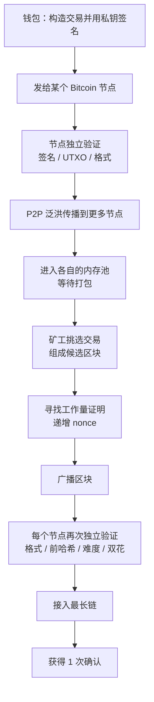

这是另一份学习对话的整理稿，主题是中本聪 2008 年那份 9 页的白皮书。

问题按原来的追问顺序保留，措辞做了改写；回答重写过，删掉了重复的类比，并把结论对回论文原文。

<!--more-->

## 一、双花：整篇论文真正要解决的问题

> **问：** 这份白皮书从哪里读最容易进去？

从它要解决的那个问题开始，而不是从"什么是区块链"开始。现实中一张纸币是实物：小明把它给小红之后，自己手上就没有了。数字文件不一样——小明可以把同一份数据复制一份给小红，自己还留着原件。

于是出现双重支付（double-spending）：小明同时告诉小红和小刚"这 1 BTC 是你的"。数字签名只能证明"这笔转账确实是小明签的"，也就是**谁有权花这笔钱**；它不能证明**这 1 BTC 之前有没有被花掉**。

论文摘要的第一句就是目标：让电子现金可以在双方之间直接转移，而不经过金融机构。整篇论文的其余部分，都是在这一句之下做推导。

## 二、传统解法，以及为什么不采用它

> **问：** 那让一个中心服务器记余额不就行了？

能解决，而且这正是现实里的做法。论文第 2 节把这种角色叫**铸币厂（mint）**：每笔交易都交给它检查有没有双花，交易之后硬币必须交回铸币厂换一枚新币，只有铸币厂直接发行的硬币才被信任为没有重复花费。

问题在于：整个货币体系的命运取决于运营铸币厂的那家公司，而且每笔交易都要经过它——和银行一样。中本聪要的不是"更可靠的裁判"，而是**把裁判拿掉**。

## 三、中本聪的推导链

> **问：** 那他到底发明了什么？

不是"发明了区块链"。他的问题是"在没有中心裁判的前提下解决数字现金的双花问题"，然后一步一步往下拆：

```
数字现金
  ↓  数字签名可以证明谁有权花
但会双花
  ↓  需要知道交易的先后顺序
需要一个公开的时间顺序
  ↓  Timestamp Server
但不能有中心服务器
  ↓  分布式 Timestamp Server
大家怎么决定谁说的是真的？
  ↓  Proof of Work
  ↓
区块链（解决过程中出现的数据结构）
```

从章节安排也能看出它是围着一套**电子现金系统**写的，而不是一种数据库技术：Transactions、Timestamp Server、Proof-of-Work、Network、Incentive、Reclaiming Disk Space、Simplified Payment Verification、Combining and Splitting Value、Privacy、Calculations。区块链是结果，不是出发点。

## 四、第一块积木：数字签名

> **问：** 论文里"电子硬币"到底是什么？

论文的定义是：**一枚电子硬币就是一串数字签名**。每位持有者把硬币转给下一位时，对"上一笔交易的哈希"加上"下一位持有者的公钥"做签名，并把签名附加到硬币末尾。收款人验证这些签名，就等于验证了整条所有权链。

BTC 不是存在某处的文件，而是一串可以被密码学证明的所有权转移记录。这解决了"谁有权花"，但留下一个问题：**这位持有者之前有没有签过别的交易？**

## 五、第二块积木：时间戳与哈希链

> **问：** 那就把所有交易公开，让大家自己看？

公开账本能让大家发现 Alice 把同一笔钱花了两次，但立刻引出一个新问题：**哪一笔在前？** 论文需要的不是"一个账本"，而是一个所有人都能相信的时间顺序。

论文第 3 节的答案是**时间戳服务器**：取一批待打时间戳项目的哈希，把这个哈希广泛发布出去（原文举的例子是报纸或 Usenet 帖子）。数据要能进入这个哈希，就必然在当时已经存在。关键在于每个时间戳都**把前一个时间戳的哈希包含进来**，形成一条链，每新增一个时间戳都在加固它之前的所有记录。

但哈希链本身还不够：攻击者完全可以把某个区块改掉，再把后面所有区块重新哈希一遍，只要重算得够快就能追上。

## 六、第三块积木：工作量证明

> **问：** 那就让重新计算变得不可能？

让它变得**昂贵**。论文第 4 节的做法是：不断递增区块里的 nonce，直到整个区块的哈希满足"以若干个零比特开头"。"所需的平均工作量随所需零比特数呈指数级增长，而验证只需要执行一次哈希"——这是论文原话。

```
寻找答案：需要一个一个试 nonce，可能算几万亿次
验证答案：拿到 nonce 自己算一次哈希，检查是否满足条件
```

真实网络要求的不是"以 0000 开头"，而是区块哈希小于当前网络规定的目标值（target）。难度会动态调整：论文写的是"由一个移动平均值决定，目标是让每小时产生的区块数维持在一个平均水准"；具体实现是每 2016 个区块调整一次，目标平均 10 分钟一个区块。

> **问：** 这个东西凭什么能当投票？

这是论文最精妙的一步。没有中心服务器时，如果采用"一人一票"，互联网上一个人可以创建一百万个账号，这就叫 **Sybil 攻击**。所以论文用的是**一台 CPU 一票**：工作量证明决定了多数决中谁有代表权。

"多数决由最长链代表——因为投入其中的工作量证明最多。"这也就是今天说的最长链规则。注意它衡量的是**累计工作量**，不是区块数量。

## 七、分叉与双花的最终解决

> **问：** 如果两个矿工同时挖出区块，谁先验证就以谁为准吗？

不是。论文第 5 节写得很清楚：节点总是认为最长链是正确的。如果两个节点同时广播了下一个区块的不同版本，节点先在自己先收到的那个上工作，但会保存另一条分支；当下一个工作量证明被找到、某个分支变长时，平局被打破，原本在另一分支的节点切换过去。

所以**先出现只意味着暂时领先**，最终规则是谁处于累计工作量最大的有效链上。这里有个容易混淆的点：**交易本身没有算力**，算力属于矿工。更准确的说法是"支持那笔交易所在链的矿工拥有更强的算力"。

> **问：** 那先发出的那笔双花，也可能输给后发出的那笔？

完全可能。矿工先把②放进区块，节点就会发现 Alice 那 1 BTC 在区块 100 里已经花掉了，于是①无效。双花要分两个层次看：

**第一层，两笔冲突交易刚刚出现。** 谁赢取决于哪条链最终累计了更多工作量，先广播的那笔不保证有效。

**第二层，一笔交易已经被很多区块埋住。** 想用另一笔冲掉它，就变成了链重组问题——攻击者要重做那个位置之后的所有工作量证明，还要追上正在前进的诚实链。这就是 51% 攻击的语境：论文的前提假设是诚实节点掌握的 CPU 算力多于任何合谋的攻击者群体。

论文第 11 节还提示了一个常被忽略的边界：**即使攻击者真的追上了，他能做的也只是修改自己的一笔交易，把自己刚花出去的钱拿回来。** 他不能凭空创造价值，也不能拿走从来不属于他的钱——节点不会接受无效交易作为支付。

## 八、一笔交易怎么进入网络

> **问：** 区块链是分布式系统，一笔交易从钱包到上链要经过哪些步骤？

1. **钱包构造并签名。** 交易包含输入（这笔钱来自哪里）、输出（给谁多少）和签名，用私钥对交易内容签名。
2. **发给某个节点。** BTC 没有总服务器，钱包通常连到网络中的某一个节点。
3. **节点独立验证。** 检查签名是否正确、引用的 UTXO 是否存在且未被花费、金额和脚本是否符合规则。验证通过只说明"这是一笔有效交易"，**不等于已经进入区块链**。
4. **P2P 泛洪传播。** 节点验证之后告诉它连接的其他节点，像水波一样扩散。交易不必到达所有节点，到达足够多的节点就能进入区块。
5. **进入内存池。** 此时交易处于等待打包状态。要注意**每个节点都有自己的 mempool，不是全网共享一个**，不同节点看到的交易集合可能略有不同。
6. **矿工挑选交易组成候选区块。** 区块头包含前一个区块哈希、nonce、时间戳、难度和默克尔根。
7. **挖矿。** 矿工不断修改 nonce 寻找满足难度的工作量证明。
8. **广播区块。** 找到之后立刻广播出去。
9. **每个节点再次独立验证。** 检查区块格式、前一个哈希是否正确、工作量证明是否满足难度、每笔交易是否有效、有没有双花。节点不会因为矿工说"我挖到了"就相信它。



整个网络里的角色可以分成三层：**用户**提出交易；**普通节点**判断什么符合规则；**矿工**竞争把交易写进新的区块。矿工负责"提出"，节点负责"验证"——没有任何一个中央服务器说"这笔交易是真的"。

## 九、确认数：6 次确认是从哪来的

> **问：** 常听人说等 6 个确认，这 6 次到底是什么？

先区分"交易"和"确认"。交易被放进一个区块、该区块接入主链，就是 **1 次确认**。所谓 6 次确认，指的是**它所在的区块后面又连续接上了 5 个区块**，不是这笔交易被执行了 6 次。

```
      #99
       ↓
      #100   ← 你的交易在这里          1 次确认
       ↓
      #101                            2 次确认
       ↓
      #102                            3 次确认
       ↓
      #103                            4 次确认
       ↓
      #104                            5 次确认
       ↓
      #105                            6 次确认
```

每多一个区块，想要推翻这笔交易的攻击者就要多追一个区块的工作量。"6 次确认"并不是协议规定的等待时间，而是一个安全经验值：平均 10 分钟一个区块，6 次大约是一小时。**安全性是随确认数连续上升的**，不存在"第 5 次不安全、第 6 次突然安全"这种跳变。

那为什么偏偏是 6？论文第 11 节给了一张表，它算的是"攻击者从落后 z 个区块处追上的概率 P 小于 0.1%"需要多少 z：

| 攻击者算力占比 q | 需要的确认数 z |
|---:|---:|
| 0.10 | 5 |
| 0.15 | 8 |
| 0.20 | 11 |
| 0.25 | 15 |
| 0.30 | 24 |
| 0.35 | 41 |
| 0.40 | 89 |
| 0.45 | 340 |

也就是说，**需要几个确认，取决于你假设攻击者掌握多少算力**。6 次确认对应的是"攻击者算力在 10% 出头"这个假设——比 5 次稍保守一点。交易所要等十几个确认，是因为它假设的对手比这个强得多。

## 十、买一杯咖啡要等多久

> **问：** 那拿 BTC 买杯咖啡，要等多久才算支付成功？

BTC 主链上**不存在一个固定的"支付成功时间"**，因为它取决于商家打算承担多少风险。关键节点是"什么时候被矿工放进区块"：

| 商家的策略 | 你实际等待的时间 | 风险 |
|---|---|---|
| 接受 0 确认，看到广播的有效交易就给咖啡 | 几秒 | 双花还没被排除 |
| 等 1 个确认 | 平均约 10 分钟 | 大幅下降 |
| 等 6 个确认 | 平均约 60 分钟 | 很高价值交易的常见做法 |

小额场景通常接受 0 确认：商家已经确认签名正确、UTXO 未被花费、网络已经看到这笔交易，就直接给你咖啡。攻击者理论上可以同时广播一笔给自己的冲突交易，但为了一杯咖啡去做这件事并不划算。

> **问：** 既然一个区块平均要 10 分钟，为什么不能像刷卡一样 1 秒完成？

因为两者换的东西不一样。银行卡走的是中心化、高性能的支付网络，授权是秒级的；BTC 主链用**全球节点共识 + 工作量证明**换取不依赖单一中心机构，代价就是速度。想兼顾小额支付的体验，现在的主流思路是**闪电网络（Lightning Network）**：先在主链上开一条支付通道，之后的大量小额交易在链下完成，接近即时确认，最后再把结果结算回主链。

> **问：** 那交易所账户里的 BTC，能直接拿去链上付款吗？

要区分"链上支付"和"托管账户内部的转账"。你把 BTC 放在交易所，私钥不在你手上，账户里的余额本质上是交易所对你的负债；你在交易所内部转账，通常只是它自己的数据库记账，**这笔操作不会出现在 Bitcoin 主链上**，也就不会走"广播 → 内存池 → 矿工 → PoW → 确认"这一整套流程——这也是它能做到即时到账的原因。

只有当交易所提币到你自己控制的钱包、再由这个钱包付给商家，才真正进入主链流程，等待时间的规律才适用。

## 十一、丢失私钥、UTXO 与流通量

> **问：** 如果私钥丢了，那些 BTC 永远不能流通，流通的 BTC 越来越少，这是问题吗？

它是现实问题，但不是协议层面的致命问题。关键要区分"总量减少"和"最小单位减少"。BTC 可以细分到 **1 BTC = 100,000,000 satoshi（聪）**，所以不存在"币不够用"的问题——剩下的币可以切得更小来交易。

丢私钥的性质是**永久性的供给损失**。严格说丢的不是"账户密码"，而是控制那些 BTC 所需的私钥：币仍然记录在链上，但没有人能产生有效签名，于是从经济意义上退出了流通，并不会回到系统里。

> **问：** 那"流通的 BTC 越来越少"这个说法本身准确吗？

不太准确。BTC **没有"账户余额"这个东西**，只有一串历史交易。你所谓的账户，本质上是**对某些 UTXO（未花费交易输出）的私钥控制权**——一笔交易的输出被下一笔交易引用为输入，引用过的就不再可用。

另外，"流通中的 BTC 数量"也不等于"交易活动的多少"。同一枚币可以不断转手：Alice → Bob → Charlie → David，链上发生了很多笔交易，流通量却一直是那 1 BTC。理论上只有 1 BTC 也能支撑无限次交易。

顺带说一句，比特币的总量上限 2100 万这个数字**并没有写在白皮书里**。论文第 6 节只说"一旦预先确定数量的硬币进入流通，激励可以完全转为交易手续费，并且完全不产生通货膨胀"——真正决定这个上限的是发行规则在代码里的实现。

## 十二、这篇论文真正做了什么

论文标题是 **Bitcoin: A Peer-to-Peer Electronic Cash System**，不是 Blockchain: A New Distributed Database。这个差别值得留意：中本聪要解决的是电子现金，区块链只是解决过程中出现的核心数据结构。

理解整篇白皮书，最值得抓住的是一次转换——**从"相信某个中心机构"，变成"验证密码学证据"**。他并没有做到让人完全不需要信任任何东西，而是把"必须相信人"的地方，尽量替换成可以验证的规则。

| 问题 | 比特币的答案 |
|---|---|
| 谁可以花钱？ | 数字签名 |
| 钱有没有被花过？ | 公开的交易历史 |
| 谁先花？ | 时间戳与区块顺序 |
| 谁来记录？ | P2P 网络中的节点与矿工 |
| 大家意见不一致怎么办？ | 以累计工作量最大的链为准 |
| 为什么历史改不动？ | 哈希链 + 工作量证明 |
| 为什么有人愿意维护网络？ | 区块奖励与交易手续费 |

最后补一句论文里最容易被误读的地方：比特币并不是"数据不能修改"，而是**修改已确认的历史需要重做从那个位置开始的全部工作量证明，并且还要追上正在前进的诚实网络**。安全性不是绝对的，是一个概率——而这个概率随确认数增加而指数下降，这正是论文第 11 节那几页公式在算的东西。
