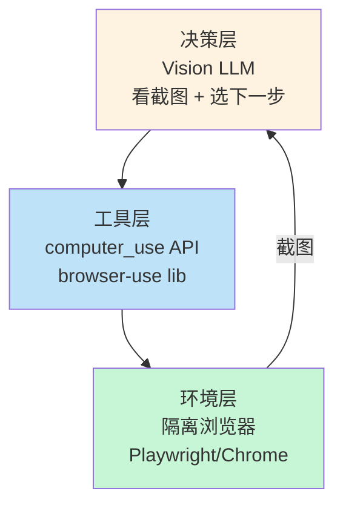

> Browser Agent 是 2026 年最热也是最难落地的 Agent 类型——让 AI 像人一样"看屏幕、点鼠标"。Claude Computer Use / OpenAI Operator / 开源 browser-use 三足鼎立，但**生产环境最大的失败模式不是模型不够强，是 prompt 注入和基础设施不完善**。

Browser Agent 解决了 AI 一个根本性问题：**任何有 UI 的服务都可以被 AI 操作**。没有 API？没关系，让 AI 操作浏览器界面。

但这条路布满暗礁：

- 截图分辨率、加载延迟、动态渲染
- bot 检测、验证码、登录态保持
- **prompt 注入**——每一个网页都是潜在的恶意输入
- 长任务可靠性、多 tab 协同

这篇文章讲清楚：当前三大方案对比、生产级架构、以及最容易踩的坑。

<!--more-->

## 一、三大方案对比

| 方案 | 提供商 | 模式 | 优势 | 劣势 |
|------|--------|------|------|------|
| **Claude Computer Use** | Anthropic | 视觉驱动（截图） | 准确率最高、能处理任意 UI | 成本高（多模态 token）、延迟大 |
| **OpenAI Operator** | OpenAI | 视觉 + GUI 自动化 | 用户体验好、自带浏览器 | 黑盒、定制能力弱 |
| **browser-use** | 开源 | DOM + 视觉混合 | 成本低、可控、可定制 | 自己搭基础设施 |

**选择指南**：
- **PoC / 一次性任务** → OpenAI Operator
- **生产 ToB 应用** → Claude Computer Use 或自建 browser-use
- **成本敏感** → 自建 browser-use（每任务 $0.02-0.05）
- **复杂企业场景** → 垂直定制（LoRA 微调 + 领域知识）

## 二、三层架构：决策 / 工具 / 环境



### 2.1 决策层：看懂屏幕的 LLM

不是所有模型都能做 computer use——需要**视觉能力 + 空间推理能力**。

```python
# Anthropic Claude 4.x 系列
import anthropic

client = anthropic.Anthropic()

response = client.messages.create(
    model="claude-sonnet-4-5",
    tools=[
        {
            "type": "computer_20251124",  # 最新 computer use 工具
            "name": "computer",
            "display_width_px": 1280,
            "display_height_px": 720,
        }
    ],
    messages=[{
        "role": "user",
        "content": [
            {"type": "image", "source": {"type": "base64", "data": screenshot_b64}},
            {"type": "text", "text": "在搜索框输入 'iPhone 15' 然后点击搜索按钮"}
        ]
    }]
)

# 模型返回 action
action = response.content[0].input
# {"action": "left_click", "coordinate": [423, 156]}
```

### 2.2 工具层：模型输出 → 浏览器操作

```python
# browser-use 是开源的 browser agent 框架
from browser_use import Agent

agent = Agent(
    task="在 GitHub 上给 tanteng/blog 仓库点 star",
    llm=ChatOpenAI(model="gpt-4o"),
    browser=Browser(
        viewport={"width": 1280, "height": 720},
        # 关键：用独立 profile 隔离
        user_data_dir="/tmp/agent-profile-001",
    ),
)

result = await agent.run()
# Agent 自动：打开 GitHub → 登录 → 搜索 → 点 star
```

### 2.3 环境层：隔离浏览器

```python
# 用 Playwright 启动隔离浏览器
from playwright.async_api import async_playwright

async def get_isolated_browser(task_id: str):
    playwright = await async_playwright().start()
    
    # 每个任务独立 user data dir
    context = await playwright.chromium.launch_persistent_context(
        user_data_dir=f"/tmp/agent-profile-{task_id}",
        headless=False,  # 有些场景需要 headless=False
        viewport={"width": 1280, "height": 720},
        # 关键：禁用 web security，避开 CORS
        args=["--disable-web-security"],
    )
    
    return context
```

## 三、生产级基础设施

**模型不够强是次要原因，基础设施不行是主要失败原因**。

### 3.1 必须用托管 CDP

自托管 Chrome 容器有无穷无尽的麻烦：版本漂移、僵尸进程、内存泄漏、bot 检测失败。

```python
# ✅ 用 Browserless 等托管服务
browser = await playwright.chromium.connect(
    "wss://production.browserless.io?token=YOUR_API_KEY"
)

# 关键配置
browser_args = {
    " stealth: True,  # 绕过 bot 检测
    "proxy": {
        "server": "residential-proxy.example.com:8000",
        "username": "...",
        "password": "..."
    },
    "region": "us-east"  # 离 agent 服务近
}
```

### 3.2 视口大小：1280×720 最佳

```python
# 训练数据集中在 1024-1440 宽度
# 1280×720 是黄金选择
VIEWPORT = {"width": 1280, "height": 720}

# 模型训练时见过的尺寸占比 ~80%
# 太宽（如 1920×1080）会让按钮太小
# 太窄（如 800×600）会让模型没见过
```

### 3.3 会话保持：跨任务复用登录态

```python
# Browserless Session API
session = await browserless.create_session({
    "session_id": "user-12345",  # 复用之前的登录态
    "cookies": user_cookies,  # 注入登录 cookie
})

# 同一用户的多次任务共享登录态
# 不需要每次重新登录
```

### 3.4 代理和地理位置

```python
# 住宅代理（residential proxy）才能绕过 bot 检测
proxy_config = {
    "type": "residential",
    "country": "US",  # 按目标站点选择
    "rotate": "per_request"  # 每次请求换 IP
}
```

## 四、安全：把 Browser Agent 关进笼子里

**Prompt 注入是 Browser Agent 的头号威胁**。每个网页都是不可信输入——OpenAI 公开承认"这个问题可能永远不会被完全解决"。**现实目标是 containment（隔离），不是 filtering（过滤）**。

### 4.1 纵深防御清单

```python
SECURITY_CHECKS = [
    # 1. 最小权限：每个任务独立 profile
    "separate_browser_profile_per_task",
    
    # 2. 域白名单：只允许访问可信站点
    "domain_allowlist",
    
    # 3. 人在回路：不可逆操作必须确认
    "human_in_the_loop_for_irreversible_actions",
    
    # 4. 沙箱环境：Docker + 虚拟显示
    "docker_sandbox_with_virtual_display",
    
    # 5. 短期凭证：避免 admin 权限
    "short_lived_scoped_tokens",
    
    # 6. 计划后执行：先展示动作再执行
    "plan_then_execute",
    
    # 7. 可中止：用户随时能停
    "user_can_abort_anytime",
    
    # 8. 完整审计：所有截图和动作
    "audit_log_all_screenshots_and_actions",
]
```

### 4.2 实现：域白名单 + 不可逆操作拦截

```python
class SafeBrowserAgent:
    ALLOWED_DOMAINS = {"github.com", "stackoverflow.com", "docs.example.com"}
    
    IRREVERSIBLE_ACTIONS = {
        "submit_form_payment",
        "delete_account",
        "send_email_to_external",
        "submit_github_issue",
        "merge_pull_request"
    }
    
    async def execute_action(self, action: dict):
        # 1. 域白名单检查
        current_url = self.page.url
        domain = urlparse(current_url).netloc
        
        if not any(allowed in domain for allowed in self.ALLOWED_DOMAINS):
            raise SecurityError(f"Domain {domain} not in allowlist")
        
        # 2. 不可逆操作拦截
        if action.get("type") in self.IRREVERSIBLE_ACTIONS:
            await self.request_human_approval(action)
        
        # 3. 执行
        await self.page.dispatch_action(action)
    
    async def request_human_approval(self, action):
        # 推到审批队列，等人类确认
        approval_id = await self.approval_queue.enqueue(action)
        print(f"⚠️ 等待人工审批: {approval_id}")
        # ...
```

### 4.3 计划后执行模式

```python
# 先让 agent 输出计划，人类批准后再执行
async def plan_then_execute(task: str):
    # Step 1: 让 agent 列出计划（不实际操作）
    plan = await agent.plan(task)
    
    print("计划：")
    for i, step in enumerate(plan.steps):
        print(f"{i+1}. {step.description}")
    
    # Step 2: 人类审批
    if not await get_user_approval(plan):
        return
    
    # Step 3: 执行
    result = await agent.execute(plan)
    return result
```

## 五、模型选择与配置

### 5.1 决策树

| 场景 | 推荐模型 |
|------|---------|
| **复杂 UI（动态内容、密集布局）** | Claude Opus 4.7 |
| **平衡**（大多数场景） | Claude Sonnet 4.5 / 4.6 |
| **延迟敏感** | Haiku 4.5 |
| **大量小任务** | GPT-4o-mini |

### 5.2 关键参数

```python
# 启用 zoom 模式（Claude 4.6+）
computer_tool = {
    "type": "computer_20251124",
    "display_width_px": 1280,
    "display_height_px": 720,
    "enable_zoom": True,        # 关键
    "adaptive_thinking": True,  # 让模型自纠
}

# 提示小目标用键盘而非鼠标
# 模型默认会用 pixel click，但对小元素（系统托盘、小勾选框）容易失败
# 显式提示：能 tab + enter 解决的用键盘
```

### 5.3 提高准确率的 prompt 技巧

```python
SYSTEM_PROMPT = """你是一个浏览器操作助手。

## 工作流程
1. 先看截图，描述你看到了什么
2. 决定下一步动作
3. 执行

## 注意事项
- 小目标优先用键盘（Tab + Enter）而不是鼠标点击
- 表单提交前再次确认所有字段
- 遇到验证码立即停止并报告
- 不要主动访问登录后才能看到的页面（除非已登录）

## 错误恢复
- 点击没反应 → 等待 1 秒再点
- 页面未加载 → 截图确认后等 2 秒
- 操作失败 → 撤销前一步
"""
```

## 六、已知的失败模式（所有厂商都中招）

| 失败 | 概率 | 应对 |
|------|------|------|
| **CAPTCHA** | 90%+ | 立即停 + 转人工 |
| **OAuth 跨域跳转** | 50% | 预登录拿 cookie |
| **多 tab 协同（≥3）** | 70% 失败 | 单 tab 设计 |
| **懒加载 SPA** | 30% | 等待 + 滚轮触发 |
| **长任务（>25 步）** | 40% | 拆分任务 + 状态保存 |

**关键洞察**：对 mission-critical 路径，**优先用 API 而非 UI**。Browser Agent 是最后手段。

## 七、validation harness：自动化断言

每个 Browser Agent 上线前必须有自动化测试：

```python
VALIDATION_ASSERTIONS = {
    # 每个网络请求必须命中允许的 origin
    "every_request_to_allowed_origin",
    
    # 运行在 N 步 / N 秒内终止
    "terminates_within_steps_and_time",
    
    # 单次 token 消耗 < B
    "tokens_per_run_below_budget",
    
    # 每个不可逆操作有确认 hook
    "every_irreversible_action_has_approval_hook",
    
    # Action log 重放产出相同状态
    "action_log_replay_produces_identical_state",
    
    # 单任务成本上限
    "cost_ceiling_enforced_per_task"
}

async def validate_agent(agent_task):
    results = []
    
    # 1. 域白名单
    requests = await agent_task.get_all_requests()
    for req in requests:
        if not is_allowed_domain(req.url):
            results.append({"assertion": "allowed_origin", "pass": False, "url": req.url})
    
    # 2. 步骤限制
    if agent_task.steps > MAX_STEPS:
        results.append({"assertion": "step_limit", "pass": False})
    
    # 3. 成本限制
    if agent_task.cost > MAX_COST:
        results.append({"assertion": "cost_limit", "pass": False})
    
    # 4. 不可逆操作必须有 approval
    for action in agent_task.actions:
        if action.type in IRREVERSIBLE_ACTIONS:
            if not action.had_approval:
                results.append({"assertion": "approval_required", "pass": False})
    
    return all(r["pass"] for r in results)
```

## 八、生产路径选择

| 投资 | 何时用 |
|------|-------|
| **API-only**（Computer Use / Operator 直接调用） | 内部工具、一次性任务、PoC（每任务 $0.5-5） |
| **混合 agent**（browser-use + Playwright + LangGraph） | ToB SaaS、企业内自动化（3-6 人月） |
| **垂直定制**（LoRA + 领域知识 + OAuth/SSO） | 行业 SaaS（电商运营、CRM 自动化、SOC，6-18 人月） |

**起步建议**：先用 Claude Computer Use / OpenAI Operator API 做 PoC，验证场景有效，再决定是否自建。

## 九、上线 checklist

把 Browser Agent 落到代码里：

- [ ] **每个任务独立 browser profile**——状态隔离
- [ ] **域白名单**——只允许可信 origin
- [ ] **不可逆操作 HITL**——所有发送 / 删除 / 支付都要确认
- [ ] **Plan-then-execute**——执行前展示计划
- [ ] **1280×720 视口**——匹配训练数据
- [ ] **托管 CDP**——不自己搭 Chrome 容器
- [ ] **Residential proxy**——绕过 bot 检测
- [ ] **Audit log**——所有截图和动作记录
- [ ] **Cost ceiling**——单任务成本上限
- [ ] **Step limit**——避免无限循环
- [ ] **User abort**——随时可停
- [ ] **Validation harness**——CI 自动跑

## 十、一点反思

Browser Agent 是 2026 年最被高估又最被低估的技术。

**高估之处**：很多人以为"AI 自动操作浏览器 = 万能胶水"。事实是——CAPTCHA 一卡就废，长任务就掉链子，多 tab 就混乱。

**低估之处**：当 API 不存在时，这是**唯一能自动化 GUI 任务的方案**。一个能稳定操作 GitHub PR 的 agent，价值可能是每月节省的工程时间 100 小时。

正确的态度：**能用 API 绝不用 UI**。Browser Agent 应该是最后手段，不是首选。

如果一定要做——**安全 > 能力**。把 agent 关进 sandbox 比让它更聪明重要 100 倍。一个能操作浏览器但 prompt 注入失控的 agent，比没有 agent 还危险。

---

**参考资料：**
- [Anthropic Computer Use Documentation](https://docs.claude.com/en/docs/agents-and-tools/tool-use/computer-use-tool)
- [OpenAI Operator](https://operator.chatgpt.com/)
- [browser-use 开源框架](https://github.com/browser-use/browser-use)
- [Browserless: Computer Use Infrastructure](https://www.browserless.io/blog/browser-infrastructure-for-computer-use-agents)
- [Steel.dev: Eight Ways to Build a Browser Agent](https://steel.dev/blog/eight-ways-to-build-a-browser-agent)
- [BestAIWeb: Three-layer Browser Agent Architecture](https://www.bestaiweb.ai/how-to-build-a-browser-agent-with-anthropic-computer-use-openai-operator-and-browser-use-in-2026)
- [Web3AI Blog: Browser Agents Battle 2026](https://www.web3aiblog.com/blog/browser-agents-battle-operator-vs-claude-computer-use-vs-browser-use-may-2026)
- [Fast.io: Browser Automation AI Agents That Actually Work](https://fast.io/resources/browser-automation-ai-agents)
- [OpenAI: Computer Use Safety Guidance](https://openai.com/index/operator-system-card/)