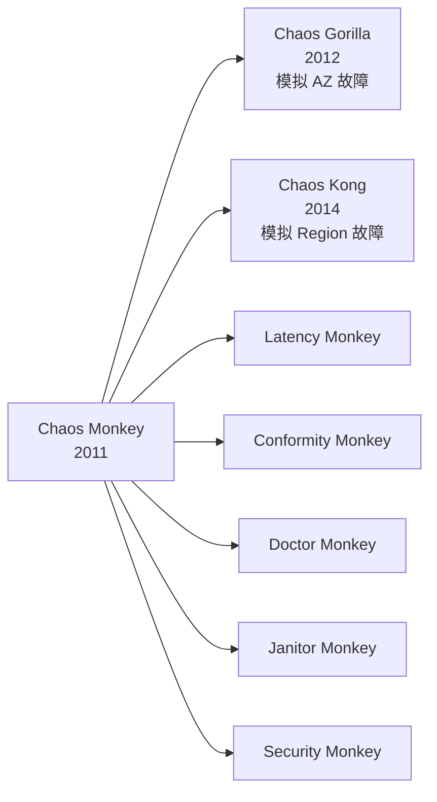
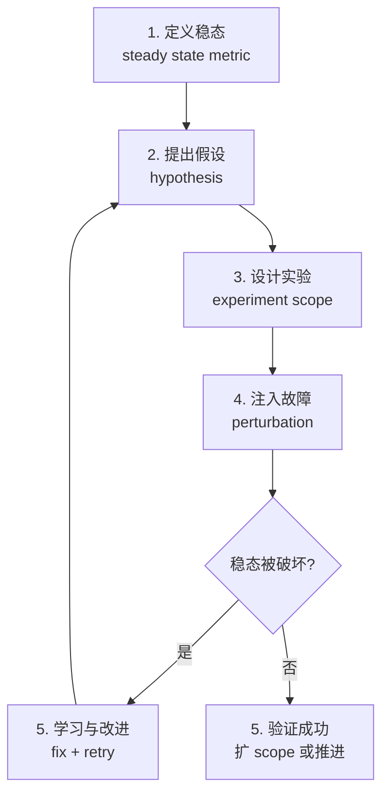
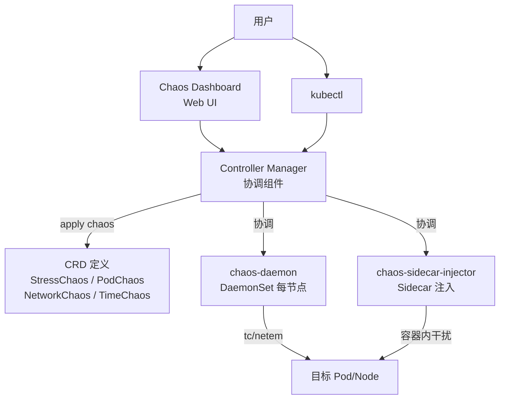
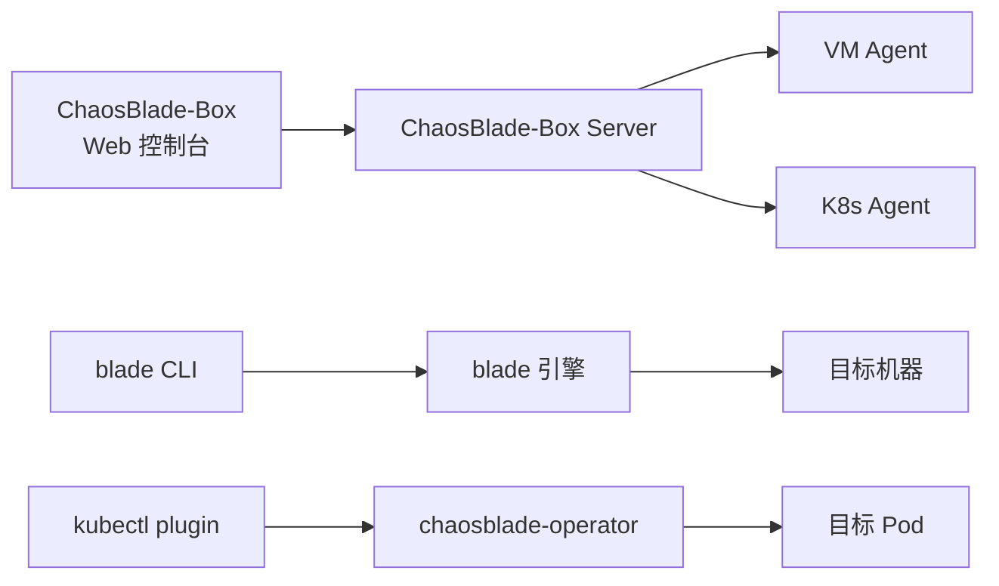
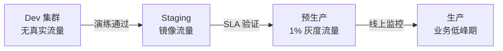

2021 年双十一凌晨 1 点，我们一个核心订单服务因为 Redis 抖动雪崩了 17 分钟。事后复盘：监控告警是有的，但"Redis 主从切换 + 客户端超时 + 下游线程池打满"这条故障链，从没在生产演练过。次年我们启动了混沌工程专项 —— 不是为了"搞破坏"，而是为了让"故障响应"变成肌肉记忆。

混沌工程不是故障注入工具的堆砌。它是一套围绕"假设 → 实验 → 学习 → 改进"的工程方法论，过去十年从 Netflix 的"野蛮猴子"演化为云原生的精细化平台。本文梳理这条演进线，并给出 K8s 时代落地 Chaos Mesh 的实战经验。

<!--more-->

## 一、混沌工程的起源：Netflix 的猴子军团

2008 年 8 月，Netflix 的 DVD 租赁数据库崩溃，三天无法发货。这次事故促使 Netflix 全面迁移 AWS，但也暴露了新问题：云上实例随时可能挂掉，系统理论上的弹性 ≠ 生产中的弹性。

2011 年，Netflix 工程团队上线了 **Chaos Monkey**：在工作时间随机终止生产 EC2 实例。它背后的哲学是 "The best way to avoid failure is to fail constantly" —— 让故障变成日常。



Chaos Monkey 是"破坏者"，但整个 Simian Army 实际上是一组"守护者"：强制服务满足合规、健康、安全、弹性等约束。2015 年美东 DynamoDB 故障时，Netflix 因 Chaos Kong 演练过跨 Region failover，受影响最小。

**Chaos Monkey 的局限**：

- 只针对 EC2 实例（VM 级别），不支持应用层、网络层
- 调度器简陋，没有"稳态假设 → 实验 → 验证"闭环
- 强依赖 Netflix 内部平台，公有云用户用不上

## 二、原则化：Principles of Chaos（2015）

Netflix 与哥伦比亚大学 Casey Rosenthal 等人 2015 年发布 **Principles of Chaos**（principlesofchaos.org），把混沌工程从"工具集合"上升为"工程方法论"，定义了四个步骤：



关键概念是 **"稳态"（steady state）**：不是"服务在线率 99.99%"，而是业务层指标（如"每秒订单创建数稳定在 X ± 5%"）。只有用业务指标衡量，才能区分"系统活着但业务已死"。

## 三、平台爆发期（2016-2020）

原则化之后，混沌工程工具爆发：

| 工具 | 出品方 | 时间 | 定位 |
|------|--------|------|------|
| **Gremlin** | Gremlin Inc | 2016 | SaaS 故障注入平台（商用） |
| **Chaos Monkey.NET/Go** | Netflix + 社区 | 2016+ | 各语言重写版 |
| **LitmusChaos** | MayaData | 2017+ | K8s 混沌工程（CRD） |
| **ChaosBlade** | Alibaba | 2019 | 多语言 + K8s 实验平台 |
| **Chaos Mesh** | PingCAP | 2019 开源 | K8s 优先（CRD） |
| **AWS FIS** | AWS | 2020 | AWS 原生故障注入 |
| **Azure Chaos Studio** | Microsoft | 2021 | Azure 原生故障注入 |

云厂商下场（AWS FIS、Azure Chaos Studio）让混沌工程进入"原生云服务"时代。但开源生态里真正在生产规模跑起来的，是 Chaos Mesh 和 ChaosBlade。

## 四、Chaos Mesh：K8s 时代的旗舰

Chaos Mesh 由 PingCAP 在 2019 年开源（最初用于 TiDB 测试），2020 年 9 月发布 1.0 GA，2021 年 7 月发布 2.0 GA，2022 年 2 月进入 CNCF Incubator。

### 架构



核心组件：

- **chaos-controller-manager**：CRD 控制器，监听 `StressChaos`、`PodChaos`、`NetworkChaos`、`TimeChaos`、`IOChaos` 等 CRD
- **chaos-daemon**：DaemonSet 形式运行在每个 K8s 节点，用 `tc/netem` 注入网络故障、`stress-ng` 注入 CPU/内存压力
- **chaos-sidecar-injector**：可选 Sidecar 注入到目标 Pod，做容器内故障（如 JVM 故障注入）

### 主要故障类型（Chaos Mesh 2.x）

| CRD 类型 | 故障场景 | 典型实验 |
|---------|---------|---------|
| **PodChaos** | Pod 级别故障 | kill、pause、重启 |
| **NetworkChaos** | 网络故障 | 延迟、丢包、断开、分区、带宽限制 |
| **StressChaos** | 资源压力 | CPU、内存、IO |
| **TimeChaos** | 时间偏移 | 模拟时钟跳变 |
| **IOChaos** | 文件 IO 故障 | 读写延迟、写入失败 |
| **DNSChaos** | DNS 故障 | 随机域名解析异常 |
| **KernelChaos** | 内核故障 | 注入异常系统调用 |
| **JVMChaos** | JVM 应用故障 | 抛异常、GC、线程池满 |

### 实验编排

Chaos Mesh 通过 YAML 声明式编排实验，支持 **顺序、并行、稳态校验**：

```yaml
apiVersion: chaos-mesh.org/v1alpha1
kind: Schedule
metadata:
  name: weekly-redis-failover
spec:
  schedule: "0 2 * * 1"  # 每周一凌晨 2 点
  type: ScheduleType
  historyLimit: 3
  concurrencyPolicy: Forbid
  workflow:
    - name: redis-primary-kill
      template: |
        apiVersion: chaos-mesh.org/v1alpha1
        kind: PodChaos
        metadata:
          name: redis-primary-kill
        spec:
          action: pod-kill
          mode: one
          selector:
            namespaces:
              - redis
            labelSelectors:
              role: primary
          duration: "30s"
    - name: verify-write-success
      template: |
        apiVersion: chaos-mesh.org/v1alpha1
        kind: WorkflowNode
        metadata:
          name: verify
        spec:
          templateType: Type
          deadline: "60s"
```

我们用上面的 `Schedule` 在 2022 年每周一凌晨演练 Redis 主从切换 —— 直到 SLA 验证 100% 通过才停止。

## 五、ChaosBlade：多语言 + 多场景

ChaosBlade 由阿里 2019 年开源，2021 年进入 CNCF Sandbox。它的特点是 **覆盖面广**：不仅支持 K8s，还支持物理机、VM；不仅支持基础设施层，还支持 Java/C++/NodeJS/Go 应用层故障注入。



ChaosBlade 的实验维度约 200+ 种、参数 3000+。典型场景：

- 基础资源：CPU 满载、内存耗尽、磁盘 IO 打满
- 网络：丢包、延迟、域名劫持、端口占用
- 应用层：Java 抛指定异常、Go Goroutine 池满、C++ 段错误模拟
- K8s：Pod 删除、Node 不可调度

我们用 ChaosBlade 测过 Java 应用的 FullGC 场景 —— `blade create jvm OutOfMemoryError --area HEAP --wildcard com.example.OrderService` 能在不重启服务的情况下抛 OOM。

## 六、选型：Chaos Mesh vs ChaosBlade vs LitmusChaos

| 维度 | Chaos Mesh | ChaosBlade | LitmusChaos |
|------|------------|------------|-------------|
| K8s 支持 | ★★★★★ 原生设计 | ★★★ 有 Operator | ★★★★★ 原生设计 |
| 多语言应用层故障 | ★★ 弱（仅 JVM） | ★★★★★ Java/C++/Node/Go | ★★ 弱 |
| 实验编排 | ★★★★★ Workflow/Schedule | ★★★ Box 工作流 | ★★★ 实验模板 |
| Dashboard | ★★★★★ Chaos Dashboard | ★★★★ Box UI | ★★★ Litmus UI |
| CNCF 状态 | Incubating（2022） | Sandbox（2021） | Incubating（2022） |
| 学习曲线 | 中（CRD + YAML） | 中（CLI + YAML） | 中（CRD + 实验模板） |
| 社区活跃度 | 高（PingCAP 主推） | 高（阿里 + 40+ 企业） | 高（MayaData 主导） |

**我们的选型**：

- **纯 K8s 集群、基础设施层故障演练为主** → **Chaos Mesh**（CRD 设计最优雅、Workflow 编排最强）
- **多语言应用层故障、混合 VM + K8s** → **ChaosBlade**（覆盖面最广）
- **希望快速复用社区实验模板** → **LitmusChaos**（模板市场最丰富）

## 七、混沌工程落地五步法

工具只是手段，落地要按方法论。我们 2022 年的实施步骤：

### 1. 选定稳态指标（2 周）

不能用 CPU/内存/在线率这种"系统指标"当稳态。要用业务指标：

| 服务 | 稳态指标 |
|------|---------|
| 订单服务 | 每分钟创建订单数 ± 10% |
| 支付服务 | 支付成功率 ≥ 99.5% |
| 推荐服务 | 推荐 CTR（点击率）波动 ± 5% |

### 2. 建立"假设-实验"清单（1 周）

针对每个服务列出 5-10 个最危险的故障假设，例如：

- Redis 主节点宕机 → 订单服务能否自动 failover？（假设：能，30 秒内 RTO）
- 下游支付服务延迟 500ms → 本地线程池会否打满？（假设：会，需限流）
- K8s 节点 OOM → 同节点其他 Pod 是否被驱逐？（假设：会被，需 PDB）

### 3. 从 staging 开始，逐步到预生产，再到生产



**重要原则**：永远不要在生产高峰期做首次故障注入。我们的所有首演都安排在凌晨 2-4 点，OnCall 团队全员 standby。

### 4. 自动化 + 定期演练（持续）

把通过验证的实验写成 `Schedule`（Chaos Mesh）或 `blade` 脚本（ChaosBlade），纳入 CI/CD：

```bash
# 每周一凌晨自动演练 Redis 主从切换
kubectl apply -f experiments/redis-failover-schedule.yaml
```

### 5. 复盘与改进（每次实验后）

每次演练都要产出"实验报告"，包括：

- 稳态指标实际波动（与假设是否一致）
- 故障检测时间（MTTD）
- 故障恢复时间（MTTR）
- 暴露的薄弱点（监控盲区、限流失效、配置缺失）
- 改进项 + Owner + Deadline

## 八、常见坑

### 1. 没有"停止按钮"

Chaos Mesh 的实验有 `duration` 字段，必须设：

```yaml
spec:
  duration: "60s"  # 60 秒后自动停止
```

否则一次配置错误可能导致整个 namespace 的 Pod 全部 kill。

### 2. 范围（scope）失控

`selector` 一定要精确到 label：

```yaml
selector:
  namespaces: ["order-service"]
  labelSelectors:
    chaos-target: "true"  # 只有带这个 label 的 Pod 才注入
```

千万不要 `namespaces: ["default"]` + 空 selector，否则整个 namespace 遭殃。

### 3. 监控盲区比故障更可怕

混沌工程最有价值的产出不是"系统没崩"，而是"暴露出监控没覆盖到的地方"。我们的 2022 年演练暴露出：

- Redis 主从切换时，旧主恢复后未自动下线，导致脑裂 30 秒
- 节点 OOM 时 cAdvisor 指标被一起 kill，Prometheus 抓不到数据
- DNS 故障时 CoreDNS 没有 fallback，业务 Pod 全部 DNS 解析失败

这些都是"假设"里没覆盖到的真实风险。

## 九、小结

混沌工程从 Netflix 2011 年的 Chaos Monkey 到 K8s 时代的 Chaos Mesh / ChaosBlade，核心演进是三个方向：

1. **从 VM 到容器**：故障注入粒度从 EC2 到 Pod、容器内、Sidecar
2. **从基础设施层到应用层**：从 CPU/内存/网络到 JVM FullGC、Goroutine 池满、HTTP 异常
3. **从一次性演练到持续验证**：从"季度演练"到"周度 Schedule"，从手工到 CI/CD

我们 2022 年的实践覆盖了核心 12 个服务、每月 30+ 次演练，最大的收获不是"系统更稳"，而是"对系统更了解"。很多故障链只在演练时才暴露 —— 而代价是一次可预测、可控的实验，不是凌晨的生产事故。

参考：

- [Principles of Chaos](https://principlesofchaos.org/)
- [Netflix Tech Blog: The Netflix Simian Army（2011）](https://netflixtechblog.com/the-netflix-simian-army-7e88d2302f75)
- [Chaos Mesh 2.0: To a Chaos Engineering Ecology](https://chaos-mesh.org/blog/chaos-mesh-2.0-to-a-chaos-engineering-ecology)
- [ChaosBlade 整体介绍](https://chaosblade.io/docs)