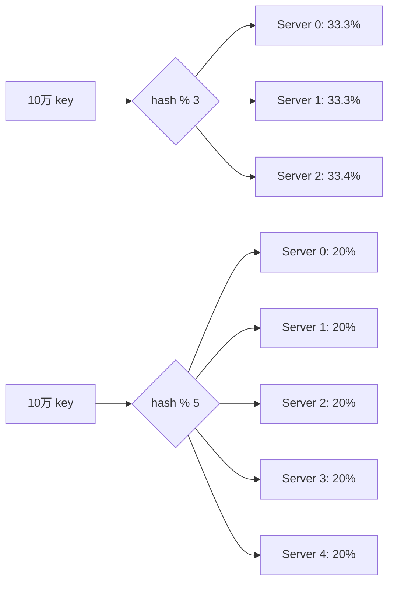
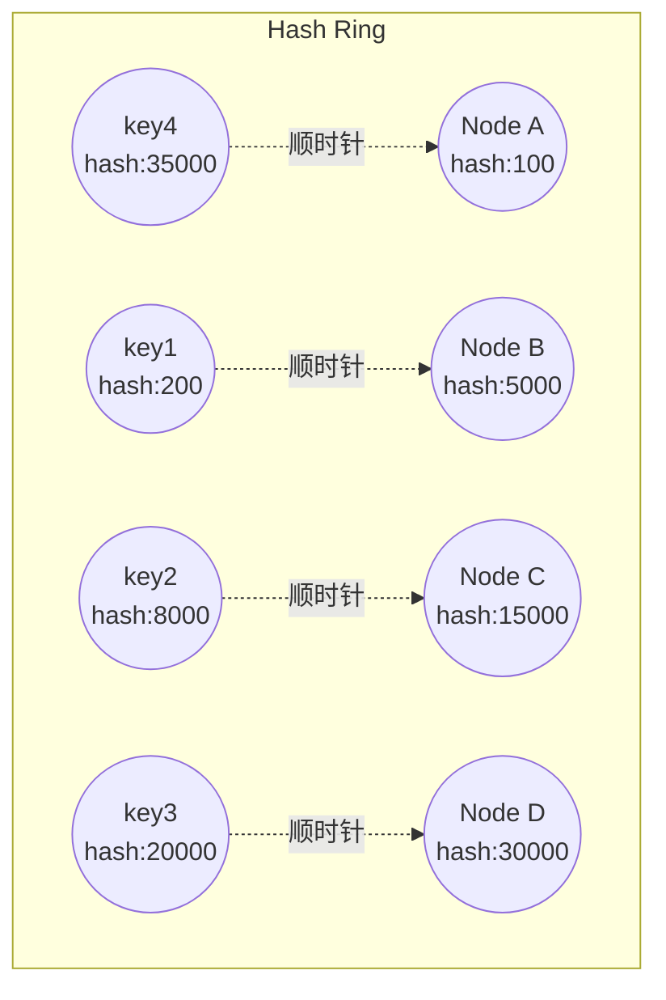
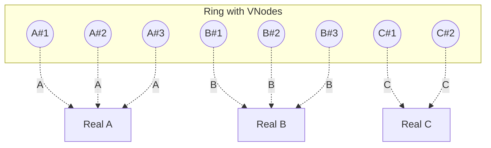
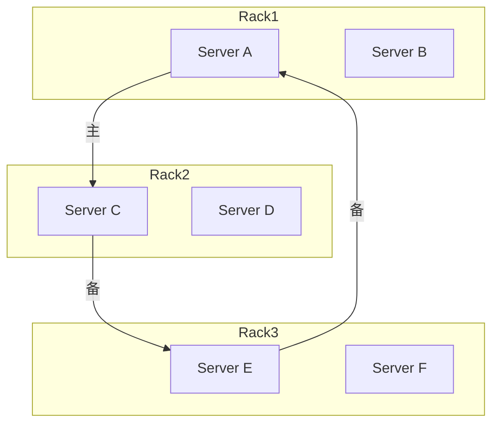
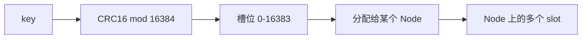

2018 年初写过一篇一致性哈希的简短介绍（`consistent-hashing-analysis.md`），但实际工程里仅靠"环 + 顺时针找节点"是远远不够的——会遇到数据倾斜、扩容迁移量、节点权重、热点等真实问题。本文深入剖析一致性哈希在工程落地中的取舍。

想象一个简单的场景：你的缓存集群有 3 台 Redis，10 万个商品 key 均匀分布。突然业务高峰来了，扩到 5 台——**几乎所有 key 都需要重新映射**，缓存命中率瞬间掉到零，DB 直接被打挂。

这就是一致性哈希要解决的问题。

<!--more-->

## 一、传统哈希为什么扛不住扩容？

### 1.1 取模分布

最简单的分布方式：

```
serverIndex = hash(key) % N
```

N 是服务器数量。看起来很完美——计算简单，分布均匀。

### 1.2 扩容雪崩

当 N 从 3 变成 5 时，所有 key 的位置都会变：



**数学上能证明：扩容时至少 (N-1)/N 的 key 会重新映射。** 当 N=3 时，至少 2/3 的 key 失效；N=10 时，至少 90% 失效。

在缓存场景下，这意味着：

- 缓存命中率瞬间归零
- 大量请求穿透到后端 DB
- DB 被打挂，引发连锁故障

这就是经典的**缓存雪崩**。

## 二、一致性哈希的核心思想

### 2.1 哈希环

把哈希空间想象成一个环，范围是 `[0, 2^32)`（32 位无符号整数空间）。

- 服务器 IP 通过哈希映射到环上某点
- 数据 key 也通过同样的哈希函数映射到环上某点
- 数据归属规则：从 key 在环上的位置**顺时针**走，遇到的第一个服务器就是它归属的节点



### 2.2 扩容时只影响局部

当新增 Node D：

- Node D 把自己"挤进"环上的位置
- 原来归属到 Node C 的部分 key，现在改归 Node D
- 其他 key 完全不受影响

**影响范围 = (新增节点到下一个节点的距离) / 环长**

数学上：扩容时受影响 key 的比例约等于 1/N。N 越大，影响越小。

### 2.3 节点宕机时也只影响局部

Node B 宕机后，原本归 B 的 key 顺时针走到 Node C，其他节点不受影响。

## 三、数据倾斜问题

### 3.1 节点少时的尴尬

设想只有 2 个节点 A、B，分别在环的 0 和 2^31 处：

- A 负责 `[0, 2^31)` 这半环
- B 负责 `[2^31, 2^32)` 那半环

节点数量少时，每个节点负责的环区间大小相差很大，导致**数据严重倾斜**——某些节点数据量是其他节点的几倍。

### 3.2 虚拟节点：把"粒度做细"

解决思路：**每个真实节点对应多个虚拟节点（VNode）**。



虚拟节点的命名约定：`replica#index`，比如 `192.168.1.1#1`、`192.168.1.1#2`、`192.168.1.1#3`。

常用配置：

- 物理节点 8 个，每个 256 个 VNode → 环上共 2048 个点
- 物理节点 100 个，每个 32 个 VNode → 环上共 3200 个点

VNode 数量越多，分布越均匀，但内存开销也越大。

### 3.3 倾斜度的量化分析

假设 N 个物理节点，每个 V 个虚拟节点，共 N*V 个虚拟点。某物理节点分到的 key 数量服从**超几何分布**（近似二项分布）。

实际方差 = `N * V * p * (1-p)`，其中 p = 1/N。
相对标准差 = `sqrt((1-p) / (N*V*p))`，代入 p = 1/N 可化简为 `sqrt((N-1) / (N*V))`。
当 N 较大时进一步近似为 `≈ 1/sqrt(V)`——也就是说，倾斜度主要取决于**每个物理节点的 VNode 数量**，与节点总数关系不大。

| N (物理节点) | V (每节点 VNode) | 相对标准差 |
|---|---|---|
| 3 | 32 | ~14.4% |
| 10 | 32 | ~16.8% |
| 10 | 256 | ~5.9% |
| 100 | 32 | ~17.6% |
| 100 | 64 | ~12.4% |
| 100 | 256 | ~6.2% |

这就是为什么生产环境推荐每节点 VNode ≥ 100。

## 四、工程实现：Go 代码示例

下面是一份简洁的 Go 实现，展示了核心数据结构：

```go
package consistenthash

import (
    "hash/crc32"
    "sort"
    "strconv"
)

type HashRing struct {
    replicas int                // 每节点虚拟节点数
    keys     []int              // 排序后的哈希环
    hashMap  map[int]string     // 虚拟节点哈希值 -> 真实节点
}

func New(replicas int) *HashRing {
    return &HashRing{
        replicas: replicas,
        hashMap:  make(map[int]string),
    }
}

func (r *HashRing) Add(nodes ...string) {
    for _, node := range nodes {
        for i := 0; i < r.replicas; i++ {
            // 拼接虚拟节点名：node#i
            key := []byte(node + "#" + strconv.Itoa(i))
            hash := int(crc32.ChecksumIEEE(key))
            r.keys = append(r.keys, hash)
            r.hashMap[hash] = node
        }
    }
    sort.Ints(r.keys)
}

// Get 查找 key 归属的节点
func (r *HashRing) Get(key string) string {
    if len(r.keys) == 0 {
        return ""
    }
    hash := int(crc32.ChecksumIEEE([]byte(key)))
    // 二分查找第一个 >= hash 的虚拟节点
    idx := sort.Search(len(r.keys), func(i int) bool {
        return r.keys[i] >= hash
    })
    // 环回处理：超过最大值的回到最小值
    if idx == len(r.keys) {
        idx = 0
    }
    return r.hashMap[r.keys[idx]]
}
```

**核心技巧：**

1. 用 CRC32 作为哈希函数，速度快、分布均匀
2. `keys` 数组排序后用二分查找（O(log N)）定位归属节点
3. 环回处理：超过最大哈希值时回到环的起点

## 五、选主：分布式场景的关键问题

在分布式存储中，同一份数据通常要存多副本（备份）。环上的**顺时针后继节点**就是天然的副本节点。

但这就引出一个问题：如果按环的物理顺序选副本，三个副本可能在同一机房、同一机架、单台交换机下，一旦故障就是全部丢失。

### 5.1 拓扑感知的副本放置

工程上的做法：



- **Cassandra** 用数据中心 + 机架感知，按机房轮询选副本
- **DynamoDB** 用 preference list，按"拓扑距离"递增顺序选后继

### 5.2 副本不一致时的读修复

多副本可能不一致。常见解决：

- **Quorum 读 / 写**：读 R 个副本，写 W 个副本，要求 W + R > N
- **版本号（Vector Clock）**：每个值带版本向量，读时合并冲突
- **Last-Write-Wins（LWW）**：用时间戳选最新（简单但有数据丢失风险）

## 六、生产环境的经典实现

### 6.1 Redis Cluster：16384 槽位

Redis Cluster 没有用纯环模型，而是用**固定 16384 个哈希槽**：



**优势：**

- 配置简单：节点只需要知道自己负责哪些槽位
- 迁移粒度细：以槽位为单位迁移，最小化数据迁移
- 客户端只需缓存槽位映射表，不必感知物理节点数量

### 6.2 Memcached：Ketama 算法

Memcached 的客户端（libmemcached、spymemcached）用 Ketama 算法实现一致性哈希：

- 哈希函数：MD5（空间大、分布好）
- 每节点 40-200 个 VNode（按机器性能加权）
- 客户端把哈希环缓存在本地，避免每次请求查询

### 6.3 DynamoDB：带权重的环

Amazon Dynamo 在环上为不同机器分配不同数量的 VNode——**性能强的机器分更多 VNode**，承担更多请求。

## 七、性能与一致性权衡

### 7.1 扩容迁移的实际开销

虽然一致性哈希理论上只迁移 K/N 的数据，但实际工程中：

- 节点间是异构的（CPU、磁盘、带宽不同）
- 热点 key 可能集中在一个节点
- 业务请求存在时间局部性

**实战建议：**

1. **不要在高峰期扩容**：哪怕只迁移 10%，也可能在几分钟内耗尽网络带宽
2. **批量迁移**：一次迁移一批槽位，监控迁移速度（通常 10-50MB/s）
3. **流量预热**：迁移后让目标节点预热，避免冷启动

### 7.2 数据倾斜与热点

环算法解决"分布均匀"问题，但解决不了**业务热点**——明星商品、热点新闻等 key 会集中到某个节点。

**典型解法：**

- **热点 key 复制**：在客户端把热点 key 复制到多个 VNode，读取时合并
- **本地缓存**：在客户端内存中缓存热点 key，绕过一致性哈希
- **独立热点集群**：识别热点 key 后路由到独立 Redis 集群

## 八、面试题与思考

下面几个问题值得在面试中思考：

**Q1：为什么 Redis Cluster 不用纯环模型而用 16384 槽位？**

A：纯环模型下客户端要知道"每个物理节点负责哪些哈希范围"，新增节点时这个映射会变。固定槽位方案下，槽位映射表是稳定的，新增节点只是把部分槽位移交给它，客户端只要更新少量槽位归属即可。

**Q2：一致性哈希能保证均匀分布吗？**

A：不能保证绝对均匀，只能保证**大概率均匀**。通过增加 VNode 数量可以降低方差，但不能消除。

**Q3：如果某个节点机器性能是其他机器的 2 倍，怎么利用一致性哈希让它的负载也接近 2 倍？**

A：给这台机器分配 2 倍的 VNode（带权重的哈希环）。

## 九、总结

一致性哈希的本质是**用"位置"代替"数量"**：把节点在哈希空间的"位置"作为分配依据，而不是节点总数。这样扩容/缩容只影响局部数据，是分布式系统扩展性的关键基础设施。

但它不是银弹：

- 解决不了**业务热点**问题
- 解决不了**节点性能异构**问题（需要权重扩展）
- 解决不了**数据倾斜**问题（需要 VNode 调优）

工程落地时，建议结合具体场景（Redis Cluster / Memcached / Dynamo）参考成熟实现，不要从零造轮子。

## 参考资料

- [Consistent Hashing: Algorithmic Tradeoffs - High Scalability](https://highscalability.com/consistent-hashing-algorithmic-tradeoffs/)
- [Dynamo: Amazon's Highly Available Key-value Store (SOSP 2007)](https://www.allthingsdistributed.com/files/amazon-dynamo-sosp2007.pdf)
- [Redis Cluster Specification](https://redis.io/docs/reference/cluster-spec/)
- [Cassandra Architecture: Consistent Hashing](https://docs.datastax.com/en/cassandra-oss/3.0/cassandra/architecture/archDataDistributeHashing.html)

## 更新记录

- **2017 年**：本文首次发表，主要讨论带 VNode 的环模型
- **2018 年**：一致性哈希在 Redis Cluster（16384 槽位）、DynamoDB 等生产系统中广泛应用
- **2020 年**：Google 提出 Jump Consistent Hash，在大集群场景比环模型更快
- **2021 年**：Bounded Load Consistent Hash 进一步控制最大负载偏差
