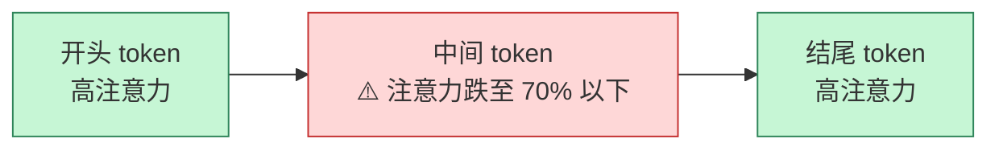
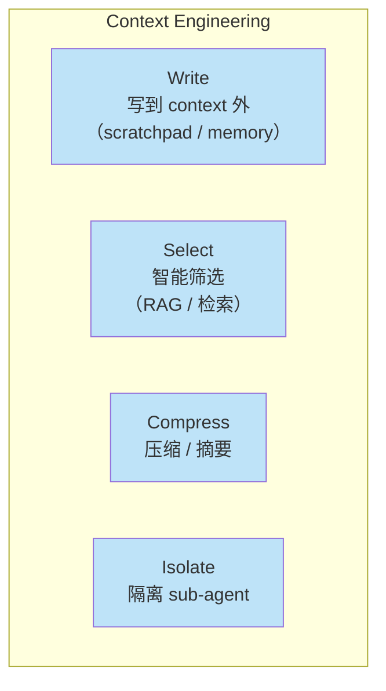
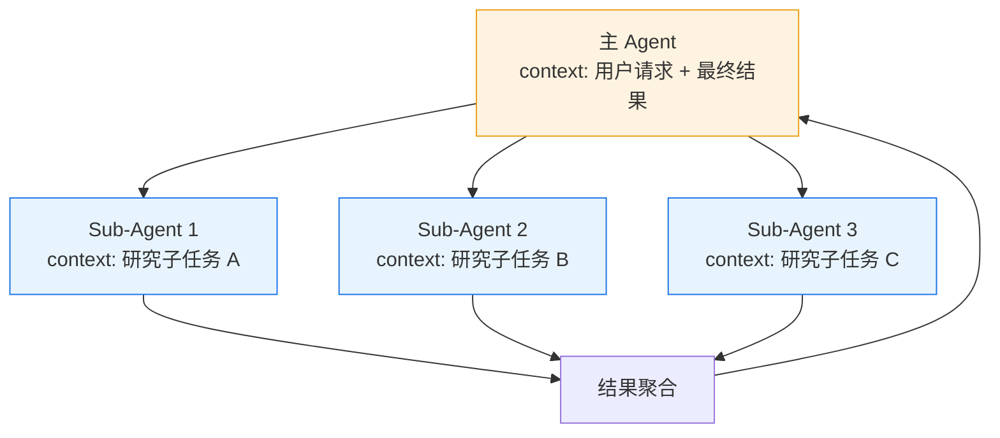
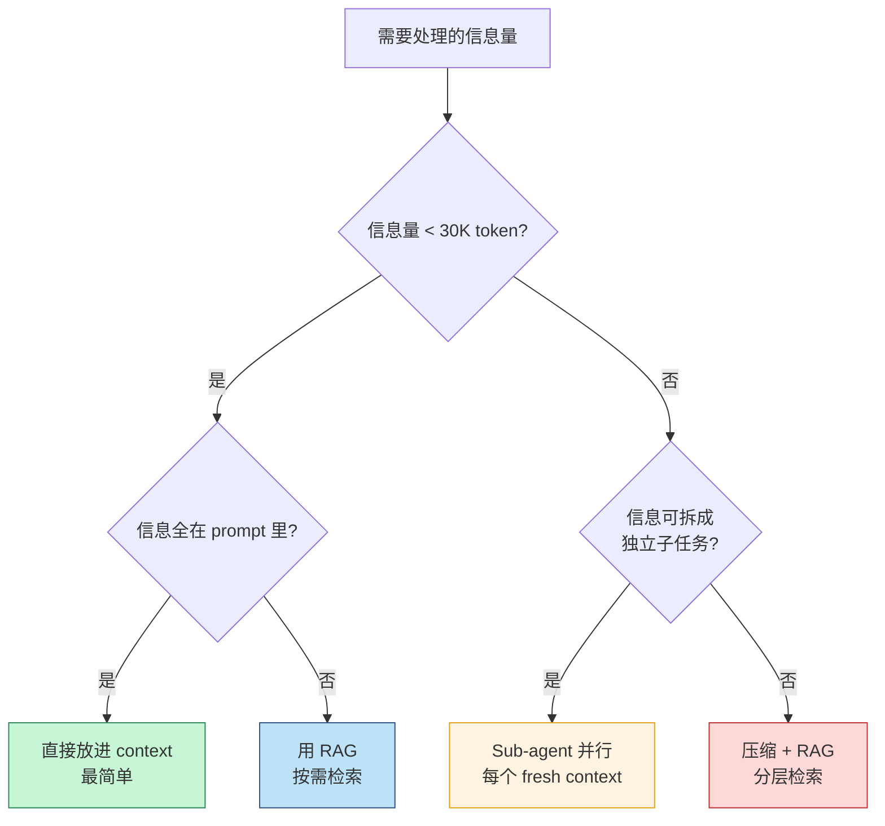
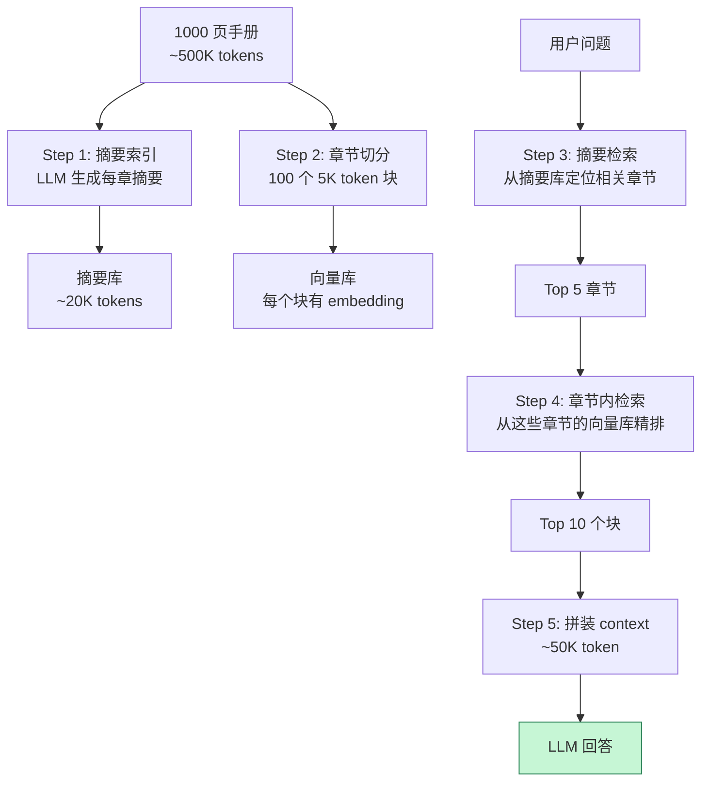

> 1M token 的 context window 听起来很美，但 Chroma 2025 年 7 月的研究告诉我们：18 个前沿 LLM **没有任何一个能在填满窗口前保持性能**——GPT-4o 从 99.3% 掉到 69.7%，只用了 32K token。号称"百万上下文"是**容量数字，不是能力数字**。

过去两年 LLM 厂商在 context window 上的军备竞赛：4K → 32K → 128K → 200K → 1M。Gemini 1.5 Pro、Llama 4 Scout 喊出 10M。但 2025 年的研究彻底揭穿了这种营销幻觉：**有效工作上下文往往比广告数字小 10-100 倍**。

这篇文章围绕"context engineering"展开——它不是 prompt engineering 的升级版，而是一整套**管理 LLM 上下文的工程方法论**。从底层机制到实战技巧，让你搞清楚：

- 为什么模型 context 越大，反而越笨
- "Lost in the Middle" 是什么，为什么致命
- 四种 context 操作策略（Write / Select / Compress / Isolate）
- 何时用 RAG、何时用长 context、何时用 sub-agent

<!--more-->

## 一、Context Engineering 不等于 Prompt Engineering

先区分两个常被混用的概念：

| | Prompt Engineering | Context Engineering |
|---|---|---|
| **关注点** | 单条指令的措辞技巧 | 模型运行时能"看到"的所有信息 |
| **范围** | 一段文本（system prompt） | 系统指令 + 工具定义 + 历史 + 外部数据 + 工具结果 |
| **目标** | 让模型理解任务 | 让模型在正确的时间看到正确的信息 |
| **变化频率** | 改一次稳一周 | 每次调用都可能不同 |

Context engineering 是 Anthropic 在 2025 年系统化的概念，核心论点是：**模型质量 ≈ 你喂给它的 context 质量**。一个好的 prompt 救不了一个糟糕的 context。

## 二、Context Rot：百万 token 里的真相

Chroma Research 在 2025 年 7 月发布的研究 [Context Rot: How Increasing Input Tokens Impacts LLM Performance](https://www.trychroma.com/research/context-rot) 是这个领域必读的 paper。他们用 18 个前沿模型做了 **194,480 次 API 调用**，核心结论：

> **没有任何模型能在填满 advertised window 之前保持性能。性能衰退在窗口远未填满时就开始了。**

### 2.1 衰退的四个驱动因素

Chroma 把性能衰退归因到四个机制：

1. **输入长度本身**——token 数量增加，每个 token 分到的注意力变少
2. **干扰项（distractors）**——语义相似但无关的内容（比如一段垃圾邮件塞进邮件总结任务）
3. **低 needle-question 语义相似度**——要找的信息和问题的语义关联弱
4. **上下文结构**——**连贯的 haystack 反而比打乱的伤害更大**（因为模型被"看似相关"的内容分散注意力）

### 2.2 NoLiMa benchmark：128K 窗口的尴尬

Adobe 在 ICML 2025 发布的 [NoLiMa](https://arxiv.org/abs/2502.05167) 测试 12 个 128K+ 模型的真实检索能力：

| 模型 | < 1K token | 32K token |
|------|-----------|-----------|
| **GPT-4o** | 99.3% | **69.7%** |
| 其他 10 个模型 | 接近 100% | **< 50%** |

**32K token 时，10 个模型跌到 baseline 50% 以下**——号称 128K+ 的窗口，在 32K 就已经"半盲"。

### 2.3 Lost in the Middle：U 形注意力分布

Stanford 2023 年的经典研究 [Lost in the Middle](https://arxiv.org/abs/2307.03172) 发现：模型对 context 的注意力呈 **U 形分布**——开头和结尾的内容记得清楚，**中间的内容丢失率超过 30%**。



把关键信息放在 context 的**开头或结尾**，不要埋在中间——这是工程实践中最高 ROI 的一条经验。

### 2.4 ~30% 规则

基于这些研究，工程界总结的经验法则：**不要让 prompt 超过 advertised window 的 30%**。

| 模型 | 广告窗口 | 推荐工作上限 |
|------|---------|------------|
| GPT-4o | 128K | ~40K |
| Claude Sonnet 4.5 | 200K | ~60K |
| Gemini 2.5 Pro | 1M | ~300K |
| Llama 4 Scout | 10M | ~3M（但实测有效窗口仅 ~1K on semantic tasks） |

Llama 4 Scout 这个例子极端但真实：号称 10M token，实际在语义任务上的有效窗口**只有 ~1K**——是广告数字的 **0.01%**。

## 三、Context Engineering 的四个操作

既然 context 这么难伺候，那该怎么管理它？Anthropic 在 [Building Effective Agents](https://www.anthropic.com/research/building-effective-agents) 里总结了四种基本操作。



### 3.1 Write：把信息写到 context 之外

模型的 context 是**最稀缺的资源**。任何"以后还要用"的信息，都应该写到外部存储：

- **Scratchpad / 工作笔记**：Agent 执行过程中的中间结果、计划、待办
- **长期记忆**：跨会话保留的用户偏好、知识
- **结构化数据库**：搜索结果、计算中间值、临时变量

```python
# 典型实现：Agent scratchpad
class AgentScratchpad:
    def __init__(self):
        self.notes = []  # 临时笔记
    
    def think(self, thought: str):
        """把思考过程写到 scratchpad，不进 context"""
        self.notes.append({"type": "thought", "content": thought})
    
    def get_relevant_notes(self, query: str, k: int = 5):
        """只在需要时把相关 notes 拉进 context"""
        return retrieve_relevant(self.notes, query, k=k)

# context 里只有最近 5 条 notes，不是全部
recent_notes = scratchpad.get_relevant_notes(current_task)
```

**OpenClaw 的 MEMORY.md** 就是这个模式的实现：核心记忆写到磁盘文件，每次启动只读小片段，需要时再用 `memory_search` 检索扩展。

### 3.2 Select：智能筛选

不是所有相关数据都要进 context——**只进最相关的**。

这就是 RAG 干的事，但选什么、怎么选、选多少，是个独立的工程问题。

```python
# 经典 RAG 流程
def build_context(query: str, k: int = 5) -> str:
    # 1. 召回（粗筛）
    candidates = retriever.search(query, top_k=50)
    
    # 2. Rerank（精排）
    ranked = reranker.rerank(query, candidates, top_k=10)
    
    # 3. 选最相关的 k 条
    top_k = ranked[:k]
    
    # 4. 拼装 context
    context = "\n\n".join([doc.content for doc in top_k])
    return context
```

经验数据：
- k = 5~10 是大多数场景的甜点
- k > 20 几乎一定引入噪音，模型开始"分心"
- Rerank 比增加 k 更有效——精排后的 5 条比粗排的 20 条好

### 3.3 Compress：压缩 / 摘要

有些信息必须进 context 但又太长，就压缩：

```python
# 三种压缩策略对比
compress_methods = {
    "extractive": {
        "原理": "抽取关键句子/段落，保留原文",
        "压缩比": "≤ 10x",
        "质量": "接近原文",
        "风险": "受限于段落长度"
    },
    "abstractive": {
        "原理": "LLM 生成摘要",
        "压缩比": "更高",
        "质量": "长任务上 -10%",
        "风险": "可能丢失关键细节或扭曲含义"
    },
    "token_pruning": {
        "原理": "按 attention 权重删 token",
        "压缩比": "可变",
        "质量": "改善有限",
        "风险": "破坏依赖关系，不稳定"
    }
}
```

**实战建议**：
- **优先抽取式**（extractive）——可解释、可控
- 摘要式（abstractive）用于结构化内容（对话历史、事件流）
- **慎用 token pruning**——在长链推理任务中容易破坏模型已经建立的注意力模式

2025 年 7 月 Guo 等人提出的 **ACC-RAG**（Adaptive Context Compression for RAG）做了一个改进：动态调整压缩率。简单查询少压缩，复杂查询多压缩。论文报告 **4x 加速 + 保持准确率**。

### 3.4 Isolate：用 sub-agent 隔离上下文

一个让 context 保持干净的根本方法：**不要让一个 Agent 扛所有 context**。



每个 sub-agent 有**自己的干净 context**，只关注一个子任务。完成后只把**结论**返回给主 Agent。

这是 Anthropic 在 [Multi-Agent Research System](https://www.anthropic.com/engineering/built-multi-agent-research-system) 里采用的架构——主 Agent 调度 3-5 个 sub-agent，每个 sub-agent 用独立的 200K context 窗口，最终**比单 Agent 大 context 的方案 token 消耗减少 90%+**。

## 四、何时用 RAG，何时用长 context，何时用 sub-agent

三个模式不是互相替代，是**互补**。决策树：



### 4.1 直接进 context

适合：
- 单文档分析（一篇论文、一个小代码库）
- 短对话任务
- 需要精确引用原文的场景

### 4.2 RAG

适合：
- 大型知识库问答（公司文档、产品手册）
- 需要精确召回且不容许幻觉的场景
- 信息按相关性而非时间排序

### 4.3 Sub-agent

适合：
- 复杂研究任务（"调研 X 公司最近 5 年的财报"）
- 多步骤并行任务（"对比 3 个产品的技术架构"）
- 信息量大且互不依赖的场景

### 4.4 压缩 + 分层 RAG

适合：
- 超大文档（书籍、整个代码仓库）
- 信息密度低但全量需要保留
- 召回精度要求中等

## 五、长文档处理的实战架构

看一个真实场景：**给一个 1000 页的产品手册做问答**。

1000 页 = ~500K token，直接进 context 必崩。怎么办？



这就是 [TreeRAG / PageIndex](https://github.com/PageIndex/PageIndex) 的核心思路：

1. **搜索阶段用小粒度**——摘要、目录，快速定位相关章节
2. **检索阶段用大粒度**——把整个章节或多个章节的内容拼起来
3. **不混用**——避免"小 chunk 召回 + 大 chunk 回答"的语义断裂

## 六、对话历史管理：另一个隐形 context 黑洞

很多人忽视对话历史对 context 的侵蚀。一个 50 轮的客服对话，原始 messages 可能占 30K+ token。

实战策略：

```python
def manage_conversation_history(messages: list, max_tokens: int = 4000):
    """分层管理对话历史"""
    
    # 1. 最近 3 轮：完整保留
    recent = messages[-3:]
    
    # 2. 中间历史：摘要压缩
    middle = messages[:-3]
    if middle:
        middle_summary = llm.summarize(
            f"请用 200 字内总结以下对话的关键信息：\n{messages_to_text(middle)}",
            max_tokens=500
        )
    else:
        middle_summary = ""
    
    # 3. 最早历史：完全丢掉
    # （如果重要应该写到 memory，而不是 history）
    
    return recent, middle_summary
```

关键洞察：**对话历史不应该无限增长**。重要的"用户偏好"、"长期事实"应该写到 scratchpad 或 memory 系统，**而不是堆在 messages 数组里**。

OpenClaw 的做法值得参考：
- `MEMORY.md`：长期事实，每次启动读
- `memory/*.md`：详细笔记，需要时检索
- **历史 messages**：只保留最近 N 轮，更早的进入压缩或归档

## 七、Context 调试：看见问题

Context 是黑盒，问题往往看不见。可观测性必须做。

### 7.1 关键指标

```python
context_health_metrics = {
    "context_size_tokens": 0,           # 当前 context 大小
    "context_fill_ratio": 0.0,          # 占 advertised window 比例
    "needle_recall_accuracy": 0.0,      # 关键信息召回测试
    "context_utilization": 0.0,         # context 实际被引用的比例
    "tool_result_avg_size": 0,          # 工具结果平均大小
}
```

### 7.2 Needle-in-Context 测试

定期注入一个"已知答案"的信息到 context，看模型能否准确引用：

```python
def needle_test():
    """每 1000 次请求跑一次"""
    
    # 1. 在 context 中间插入一段"水印"信息
    watermark = f"今天日期是 2025-02-15，水果密码是 BANANA-7"
    context.insert_at_random_position(watermark)
    
    # 2. 问模型
    response = llm.complete("今天的水果密码是什么？")
    
    # 3. 验证是否提到 BANANA-7
    assert "BANANA-7" in response, "Lost in the middle!"
```

如果这个测试失败，说明 context 太长或太杂——该压缩或用 sub-agent 了。

## 八、上线 checklist

把 context engineering 落到代码里：

- [ ] **prompt 不超过 advertised window 的 30%**
- [ ] **关键信息放 context 开头或结尾**，不放中间
- [ ] **大工具结果**进 context 前先截断或摘要
- [ ] **历史对话**有摘要机制，超过阈值压缩
- [ ] **长期记忆**写外部存储，不进 messages 数组
- [ ] **RAG 召回 k ≤ 10**，多于 10 用 rerank 而不是增加 k
- [ ] **复杂任务用 sub-agent 隔离**，主 Agent 只看结论
- [ ] **定期跑 needle-in-context 测试**，监控 attention 衰减
- [ ] **工具 schema 总数 < 20**，超过用 tool search

## 九、一点反思

Context engineering 是 2025 年 AI 工程化最被低估的话题之一。大家都盯着模型本身的能力（"GPT-5 出了吗"、"Claude 又升级了"），但**决定你 Agent 上线后表现的不是模型多强，是你喂给它的 context 多干净**。

一个 32K context 的 GPT-4o，比 200K context 但堆满噪音的 GPT-4o 表现更好。这是 2025 年每个 AI 工程师都要刻在脑子里的事实。

下一步该读：

- [Anthropic: Building Effective Agents](https://www.anthropic.com/research/building-effective-agents)
- [Chroma: Context Rot Research](https://www.trychroma.com/research/context-rot)
- [Mem0: Context Engineering in 2025 Guide](https://mem0.ai/blog/context-engineering-ai-agents-guide)
- [NoLiMa Benchmark (Adobe, ICML 2025)](https://arxiv.org/abs/2502.05167)

---

**参考资料：**
- [Chroma Research: Context Rot](https://www.trychroma.com/research/context-rot)
- [Stanford: Lost in the Middle (2023)](https://arxiv.org/abs/2307.03172)
- [Anthropic: Building Effective Agents](https://www.anthropic.com/research/building-effective-agents)
- [Anthropic: Built Multi-Agent Research System](https://www.anthropic.com/engineering/built-multi-agent-research-system)
- [Mem0: Context Engineering in 2025 - The Complete Guide](https://mem0.ai/blog/context-engineering-ai-agents-guide)
- [ACC-RAG: Adaptive Context Compression (Guo et al., July 2025)](https://arxiv.org/html/2507.22931v1)
- [Alibaba Cloud: The Moat of AI Agents Context Engineering](https://www.alibabacloud.com/blog/602376)
- [InfoQ: 从 RAG 到 Context：2025 年 RAG 技术年终总结](https://www.infoq.cn/article/L452I9YAB4gaKJMmiY0T)