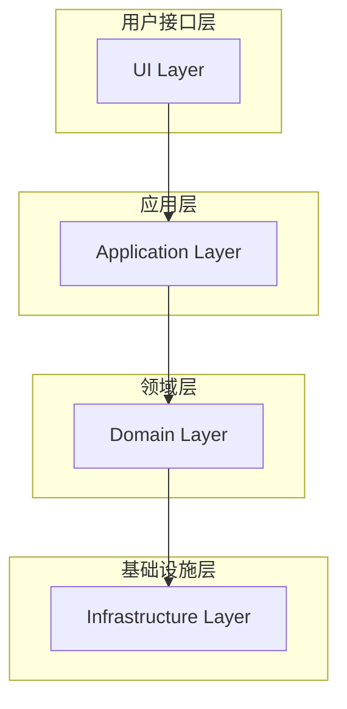
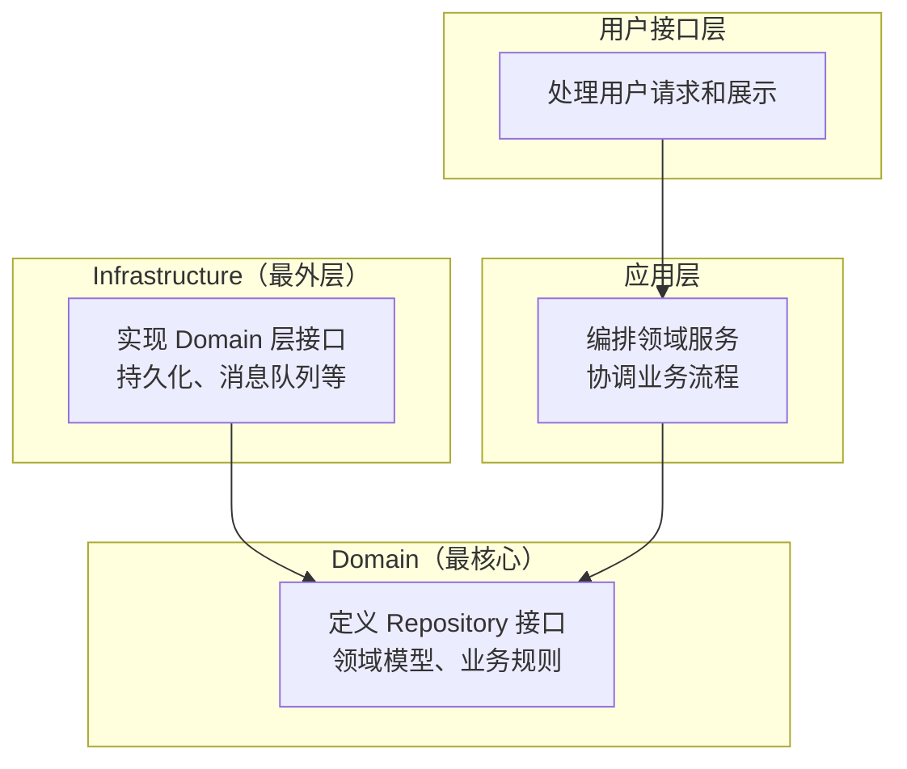
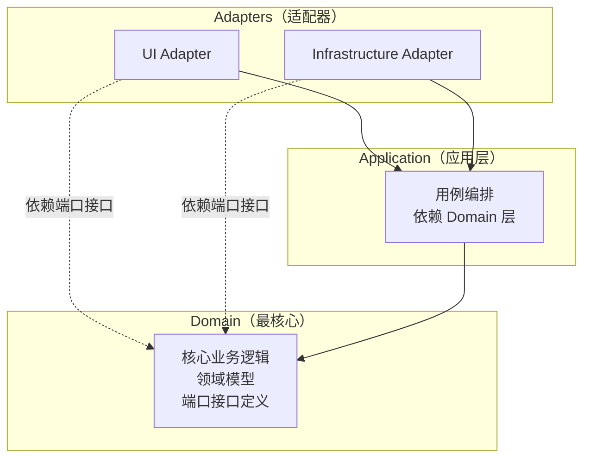

DDD（领域驱动设计）架构中，Infrastructure 层可以依赖 Domain 层吗？

答案是：**可以，而且在现代 DDD 架构实践中，Infrastructure 依赖 Domain 是推荐的做法。**

但这需要区分两种不同的分层架构模型来理解。

<!--more-->

## 一、传统四层架构

在 Eric Evans 2003 年《领域驱动设计》一书中提出的传统四层架构，依赖关系是这样的：



基础设施层位于最底层，领域层依赖基础设施层，基础设施层不依赖其他层。

在这种传统架构下，存在明显的缺陷：

- **领域层作为业务核心，却依赖了技术实现细节**，违背了"业务核心应独立于技术实现"的原则
- **Repository 接口定义在 Domain 层**，但其实现需要数据库持久化能力，如果放在 Infrastructure 层，就会出现 Infrastructure 向上引用 Domain 的情况，违反分层原则
- **难以编写单元测试**——Domain 层依赖了具体的技术实现，无法轻松 Mock

## 二、改良版四层架构（依赖倒置）

《实现领域驱动设计》（Vaughn Vernon）中提出了基于**依赖倒置原则（DIP）**的改良架构：



核心思想：**Infrastructure 依赖 Domain，而不是反过来。**

具体做法：

| 层 | 职责 | 依赖关系 |
|---|---|---|
| **Domain（领域层）** | 定义 Repository 接口、领域模型、领域服务、业务规则 | 不依赖任何其他层 |
| **Infrastructure（基础设施层）** | 实现 Domain 层定义的 Repository 接口，提供持久化、消息队列等技术能力 | 依赖 Domain 层 |
| **Application（应用层）** | 编排领域服务，协调业务流程 | 依赖 Domain 层 |
| **User Interface（用户接口层）** | 处理用户请求和展示 | 依赖 Application 层 |

代码示例：

**Domain 层：**

```java
// 定义 Repository 接口（抽象）
public interface OrderRepository {
    Order findById(Long id);
    void save(Order order);
}

// 领域实体
public class Order {
    private Long id;
    private String status;

    public void cancel() {
        // 核心业务逻辑
        if ("PAID".equals(this.status)) {
            throw new IllegalStateException("已支付的订单不能取消");
        }
        this.status = "CANCELLED";
    }
}
```

**Infrastructure 层：**

```java
// 实现 Domain 层的 Repository 接口（依赖 Domain）
public class OrderRepositoryImpl implements OrderRepository {

    @Override
    public Order findById(Long id) {
        // 具体的数据库查询实现
        return jdbcTemplate.queryForObject(
            "SELECT * FROM orders WHERE id = ?", id
        );
    }

    @Override
    public void save(Order order) {
        // 具体的持久化实现
        jdbcTemplate.update(
            "INSERT INTO orders (id, status) VALUES (?, ?)",
            order.getId(), order.getStatus()
        );
    }
}
```

## 三、六边形架构（端口与适配器）

六边形架构（也称端口与适配器架构）与改良版四层架构的思想一脉相承，进一步强化了这种依赖关系：



在六边形架构中：
- **Domain 层位于最核心**，完全不依赖任何外层
- **Application 层** 定义用例，依赖 Domain 层
- **Adapters（适配器）** 包括用户接口（UI）和基础设施（Infrastructure），都依赖 Application 层或 Domain 层定义的端口接口

## 四、为什么 Infrastructure 应该依赖 Domain？

### 1. 领域层保持纯净

Domain 层只包含业务逻辑，不关心技术实现细节（用什么数据库、什么消息队列），确保业务核心的稳定性。业务规则不会因为更换数据库而改变。

### 2. 依赖倒置原则（DIP）

> 高层模块不应该依赖低层模块，两者都应该依赖抽象。

Domain 定义抽象接口（Repository 等），Infrastructure 实现这些接口，通过 IoC/DI 容器在运行时注入具体实现。

### 3. 可测试性

Domain 层不依赖具体技术实现，可以轻松使用 Mock 对象进行单元测试。不需要连接真实数据库就能测试核心业务逻辑。

### 4. 可替换性

如果要更换持久化方案（比如从 MySQL 换到 MongoDB），只需要修改 Infrastructure 层的实现，Domain 层完全不受影响。

## 五、总结

| 架构模式 | Infrastructure 是否依赖 Domain | 是否推荐 |
|---|---|---|
| 传统四层架构 | ❌ 不依赖（Domain 依赖 Infrastructure） | ⚠️ 存在缺陷 |
| 改良版四层架构（依赖倒置） | ✅ 依赖 Domain | ✅ 推荐 |
| 六边形架构 / 整洁架构 | ✅ 依赖 Domain | ✅ 推荐 |

在现代 DDD 实践中，**Infrastructure 层依赖 Domain 层是标准做法**。Domain 层定义抽象接口（如 Repository 接口），Infrastructure 层引用 Domain 层并实现这些接口，通过 IoC/DI 容器在运行时注入具体实现。这种方式确保了领域模型作为系统核心的独立性和稳定性。

核心原则只有一条：**让业务核心站在架构的中心，技术细节服务于业务，而不是绑架业务。**
