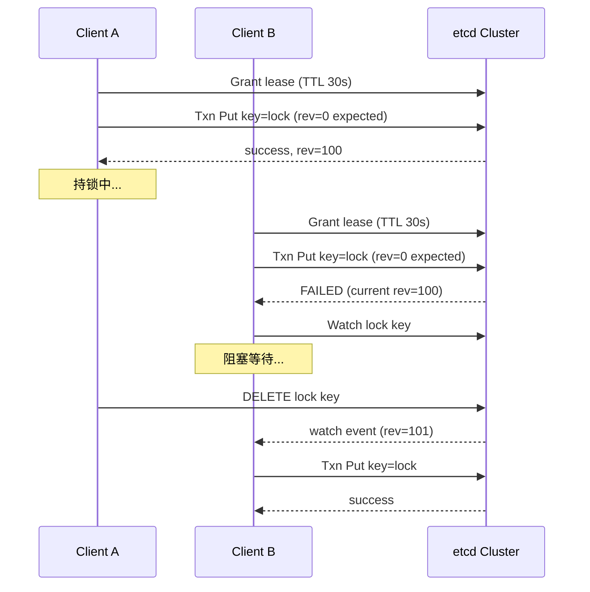
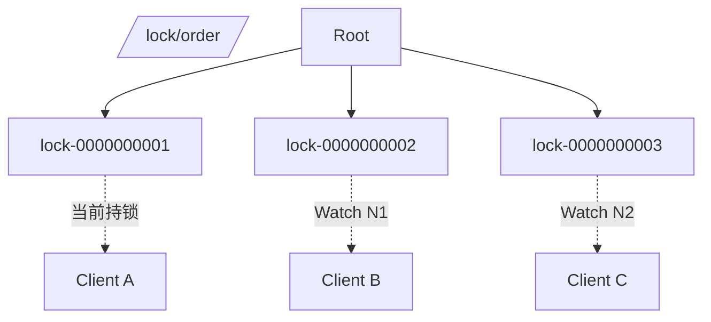
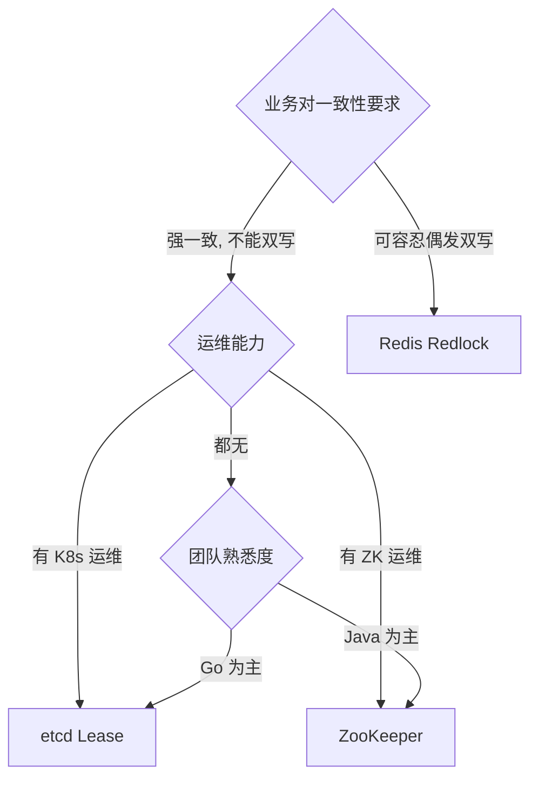

2014 年 antirez（Salvatore Sanfilippo）发表《Distributed locks with Redis》，提出 Redlock 算法；2016 年 Martin Kleppmann 在《How to do distributed locking》中公开反驳其正确性。这场持续多年的争论至今没有终结，但留下了分布式锁设计最重要的两条经验：**正确性不能依赖单一组件**，**性能与安全往往对立**。

理解分布式锁，必须先承认一个残酷事实——**没有完美的分布式锁**。每种实现都有其适用边界与失效场景，工程师的任务是选择"代价可接受"的方案，而非寻找"绝对正确"的方案。

<!--more-->

## 一、为什么需要分布式锁

单机场景下，`synchronized` 或 `Mutex` 即可解决并发竞争。一旦业务进入分布式环境，多个进程/多台机器同时操作同一份资源（如库存扣减、订单状态变更、任务调度），本地锁失效，必须借助外部共享存储实现跨进程的互斥。

分布式锁至少要满足：

- **互斥**：同一时刻只有一个持有者
- **死锁避免**：持有者崩溃后锁能释放
- **容错**：少数节点故障时锁仍可用

但工业界对分布式锁的正确性有更细的分层：

| 维度 | 含义 |
|------|------|
| **Safety（安全）** | 互斥性，永远不会两个客户端同时持锁 |
| **Liveness A（活性）** | 锁最终会被释放（不死锁） |
| **Liveness B（活性）** | 客户端请求最终能拿到锁（不饿死） |
| **Fault Tolerance（容错）** | 部分节点故障不影响锁服务 |

这三个活性维度同时满足极难——大多数实现都会做权衡。

## 二、Redis 分布式锁

### 2.1 基础：SETNX + 过期时间

最朴素的实现：

```bash
SET lock:order:47291 <uuid> NX EX 30
```

- `NX`：仅在 key 不存在时设置（互斥）
- `EX 30`：30 秒过期（避免进程崩溃后死锁）
- `<uuid>`：随机值，释放时验证（避免误删别人的锁）

释放必须用 Lua 脚本保证原子性：

```lua
-- KEYS[1] = lock key, ARGV[1] = uuid
if redis.call("GET", KEYS[1]) == ARGV[1] then
    return redis.call("DEL", KEYS[1])
else
    return 0
end
```

如果不校验直接 DEL，可能释放了别人的锁——这是最常见的生产事故。

### 2.2 Redlock 算法

单实例 Redis 做锁存在一个致命问题：**主从切换时锁丢失**。流程：

1. Client A 在 Master 获取锁 `lock:1`
2. Master 还没把这个 key 同步到 Slave 就宕机
3. Slave 提升为新 Master，`lock:1` 丢失
4. Client B 在新 Master 获取到 `lock:1`，与 A 同时持锁

Redlock 算法假设有 N 个完全独立的 Redis 实例（antirez 建议 N=5），依次向多数派获取锁：


Redlock 关键参数：

- **多数派成功**（N/2 + 1）
- **总耗时 < TTL 的一半**（否则 TTL 可能在流程结束前就过期）
- **时钟漂移**：依赖本地时钟，时钟回拨可能导致锁提前失效

### 2.3 Kleppmann 的反驳

Kleppmann 2016 年发表博客明确指出 Redlock 的安全缺陷：

1. **GC 暂停**：客户端进入 GC stop-the-world，锁 TTL 过期后被另一个客户端获取，等 GC 恢复后两个客户端同时持锁
2. **时钟跳跃**：NTP 调整可能让 TTL 提前过期
3. **网络分区**：客户端与 Redis 失联，但无法区分"锁被别人拿了"与"自己网络断了"

Kleppmann 的核心论点是：**任何依赖时钟的算法都不能保证 Safety，只能保证 Liveness**。如果业务需要 Safety，应使用 fencing token（每次取锁带单调递增编号，写资源时验证）。

antirez 2016 年回应称 GC 问题可以缓解（fencing token 或乐观锁），但承认 Redlock 不适合所有场景。

### 2.4 适用场景

- 高性能、低安全要求
- 业务有兜底机制（如库存预扣 + 实际扣减二次校验）
- 不依赖 Redis 集群作为唯一协调源

## 三、etcd 分布式锁

### 3.1 Lease 机制

etcd 的锁实现核心是 **Lease（租约）**——一种带 TTL 的"心跳契约"。客户端创建一个 Lease，只要持续发送 `keepalive`，Lease 就不过期。一旦客户端崩溃，心跳停止，TTL 到期 Lease 自动失效。

```go
import (
    "context"
    "go.etcd.io/etcd/client/v3"
)

func acquireLock(cli *clientv3.Client, key, value string) error {
    // 1. 创建 lease（TTL 30s）
    lease, err := cli.Grant(context.Background(), 30)
    if err != nil {
        return err
    }

    // 2. 启动 keepalive 协程
    keepAliveCh, err := cli.KeepAlive(context.Background(), lease.ID)
    go func() {
        for range keepAliveCh {
            // 持续消费 keepalive 响应
        }
    }()

    // 3. 抢锁（基于 revision 号，全局有序）
    txn := cli.Txn(context.Background()).
        If(clientv3.Compare(clientv3.ModRevision(key), "=", 0)).
        Then(clientv3.OpPut(key, value, clientv3.WithLease(lease.ID))).
        Else(clientv3.OpGet(key))

    resp, err := txn.Commit()
    if err != nil {
        return err
    }

    if !resp.Succeeded {
        // 抢锁失败
        return errors.New("lock held by others")
    }

    return nil
}
```

### 3.2 正确性保证

etcd v3 协议基于 Raft，所有写操作都经过 Leader，且每个 key 都有**全局单调递增的 Revision 号**。这意味着：

- **互斥性**：Revision 号最小的写入者获胜，后续者必须排队
- **死锁避免**：Lease TTL 保证崩溃者最终被释放
- **Watch 机制**：客户端可 Watch key 变化，无需轮询



### 3.3 适用场景

- **K8s 生态首选**（etcd 是 K8s 的核心存储）
- 中等并发、强一致需求
- 需要 Watch 机制做公平队列

## 四、ZooKeeper 分布式锁

### 4.1 Ephemeral Node + Session

ZooKeeper 的锁实现依赖两类核心机制：

- **临时节点（Ephemeral Node）**：客户端 Session 断开时节点自动删除
- **临时顺序节点（Ephemeral Sequential Node）**：在指定路径下创建带序号的临时节点

经典算法：



算法步骤：

1. 所有客户端在 `/lock/order/` 下创建临时顺序节点
2. 序号最小的客户端持锁
3. 其余客户端 Watch 前一个节点
4. 前一个节点消失，本节点晋升为持锁者

### 4.2 Session 与心跳

ZooKeeper 的 Session 通过心跳维持。客户端必须周期性发送 ping（默认每 1/3 sessionTimeout），否则 Server 判定 Session 失效，删除所有临时节点。

```python
from kazoo.client import KazooClient

zk = KazooClient(hosts='zkservers')
zk.start()

lock = zk.Lock("/lock/order", "client-uuid")
lock.acquire()  # 创建临时顺序节点 + 自动 Watch
try:
    # 临界区
    process_order()
finally:
    lock.release()  # 删除节点
```

### 4.3 正确性边界

ZooKeeper 锁的正确性建立在三个保证上：

- **顺序一致性**：所有写操作都有全局递增的 zxid
- **原子广播**：写操作经 Zab 协议同步到多数派
- **临时节点**：Session 失效自动删除

但有一个工程陷阱：**羊群效应（Herd Effect）**。所有等待者都 Watch 前一个节点，前一个节点删除时所有 Watcher 同时唤醒并抢锁。生产中常用 `getChildren` + 排序后 Watch 来缓解。

### 4.4 适用场景

- 强一致性、严格顺序需求（如配置中心、命名服务）
- 团队对 ZooKeeper 有运维经验
- Java 生态（Curator 客户端成熟）

## 五、三种方案对比

| 维度 | Redis Redlock | etcd Lease | ZooKeeper |
|------|---------------|------------|-----------|
| **协议** | 多数派写入（无强一致） | Raft | Zab |
| **正确性保证** | 弱（时钟依赖） | 强（Raft） | 强（Zab） |
| **性能** | 极高（10w+ QPS） | 中等（1w+ QPS） | 中等（1w+ QPS） |
| **公平性** | 无序 | 严格 FIFO | 严格 FIFO |
| **Watch 支持** | Keyspace Notification（弱） | 原生 Watch | 原生 Watch |
| **运维复杂度** | 低（Redis 普及） | 中（K8s 生态） | 高（Java 运维） |
| **GC/网络分区影响** | 可能双持锁 | 安全（Lease TTL） | 安全（Session 失效） |
| **典型场景** | 库存秒杀、缓存重建 | K8s 协调、配置中心 | 命名服务、Leader 选举 |

## 六、生产级陷阱

**陷阱 1：Redis 锁无 fencing token**

Kleppmann 反复强调：**任何不带 fencing token 的锁都不绝对安全**。如果业务对一致性敏感（如金融），必须配合递增版本号校验：

```python
# 取锁时记录 fencing_token
lock_token, fencing_token = redis_lock.acquire()

# 写资源时携带 fencing_token
db.execute(
    "UPDATE orders SET status='paid' WHERE id=? AND fencing_token < ?",
    order_id, fencing_token
)
```

**陷阱 2：etcd Lease TTL 设太短**

Lease TTL 短 + keepalive 网络抖动 → 锁意外释放。建议 TTL ≥ 业务最长执行时间的 2 倍。

**陷阱 3：ZooKeeper Session 过期误判**

GC pause 或长网络分区导致 Session 过期，但客户端不知道，仍以为持锁。Curator 的 `ConnectionStateListener` 可以监听 Session 重建并主动放弃锁。

**陷阱 4：锁粒度过粗**

"锁住整个库存表"会严重降低并发。正确做法是**按业务维度分片锁**（如按商品 ID），让竞争分散。

**陷阱 5：锁内执行长任务**

锁内业务不应超过秒级。长任务要么拆细，要么用乐观锁替代。

## 七、选型决策树



## 八、小结

分布式锁的本质是"在不可靠的分布式系统中模拟单机互斥"。三种主流方案没有绝对优劣，只有适用场景：

- **Redis Redlock**：快、普及，但依赖时钟，安全性弱
- **etcd Lease**：强一致、Go 生态友好、K8s 标配
- **ZooKeeper Ephemeral**：强一致、严格 FIFO、Java 生态成熟

工业界共识：**能不用锁就不用锁**。能用乐观锁、CAS、版本号解决的并发问题，不要引入分布式锁。一旦必须用，选择与业务一致性需求匹配的方案，并设计**锁外的二次校验**作为兜底。

## 更新记录

- **2014**：antirez 发表 Redlock 原始设计
- **2016**：Martin Kleppmann 发表《How to do distributed locking》反驳，引入 fencing token 概念
- **2017+**：etcd 3.x 稳定，K8s 推动 etcd 成为云原生时代事实标准
- **2020+**：Redisson、Curator 等高级客户端封装普及，降低分布式锁的使用门槛
- **2021+**：Redlock 在云厂商环境中的可靠性进一步受到质疑，部分团队迁移到 etcd
- **2023+**：LockService、pg_advisory_lock 等数据库层方案在某些场景成为分布式锁的替代选择
