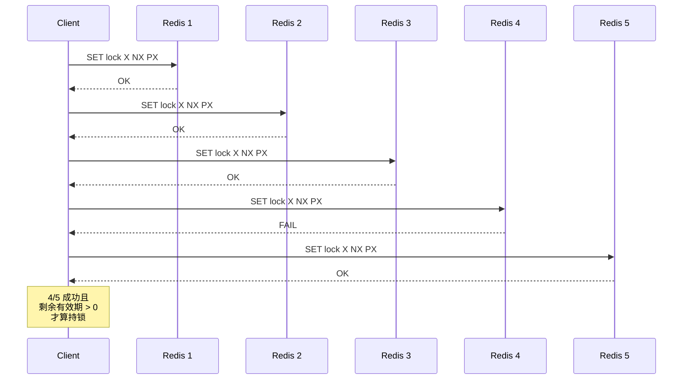
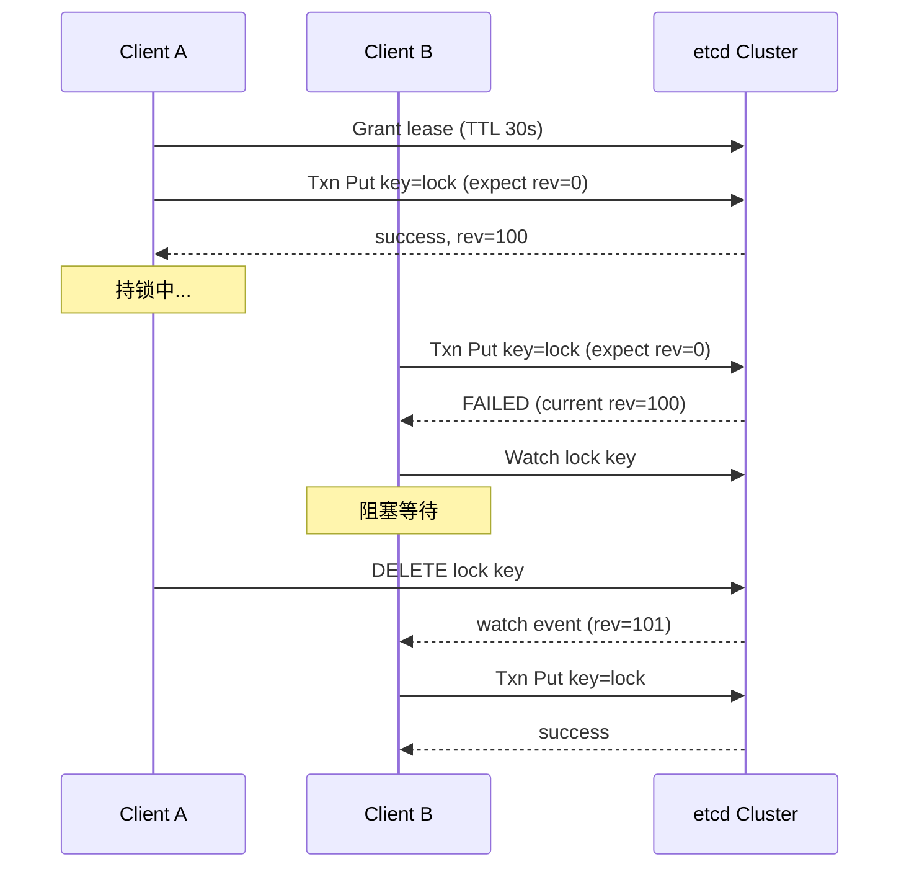
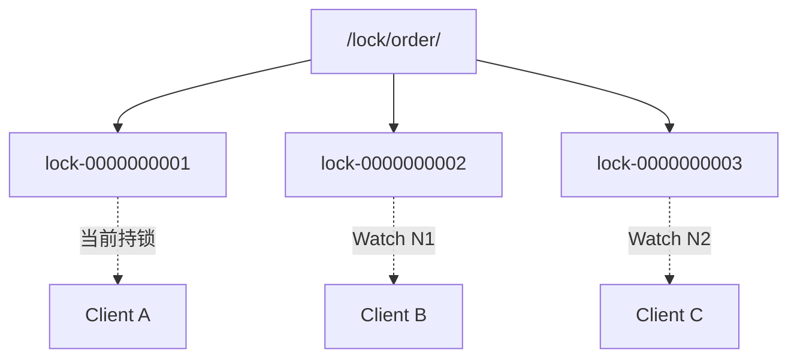
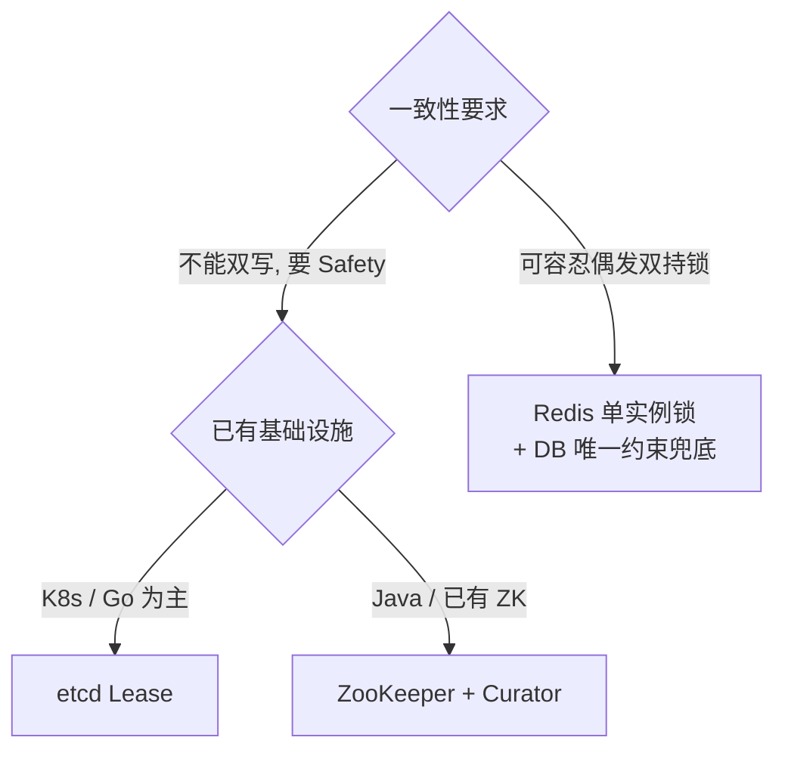

2014 年 antirez 发表《Distributed locks with Redis》提出 Redlock；2016 年 Martin Kleppmann 在《How to do distributed locking》中公开反驳其正确性。这场争论留下的最重要结论是：**分布式锁的正确性不能只靠锁本身**。

理解分布式锁要先承认一个事实——**没有完美的分布式锁**。每种实现都有失效场景，工程师的任务是选一个"代价可接受"的方案，而不是找一个"绝对正确"的方案。

<!--more-->

## 一、锁要满足什么

单机用 `synchronized` 或 `Mutex` 就够了。进入分布式环境后多个进程同时操作同一份资源，本地锁失效，必须借助外部共享存储。

分布式锁至少要三条：**互斥**（同一时刻只有一个持有者）、**不死锁**（持有者崩溃后锁能释放）、**容错**（少数节点故障时仍可用）。

但这三条里，第一条是 Safety，后两条是 Liveness，二者常常对立——为了不死锁引入 TTL，TTL 就成了破坏互斥的入口。后面所有争论都围绕这个矛盾展开。

## 二、Redis 分布式锁

### 2.1 单实例：SET NX + Lua 释放

最朴素也是生产中用得最多的实现：

```bash
SET lock:order:47291 <uuid> NX EX 30
```

- `NX`：仅在 key 不存在时设置（互斥）
- `EX 30`：过期时间（避免进程崩溃后死锁）
- `<uuid>`：唯一 token，释放时校验，避免误删别人的锁

释放必须用 Lua 保证原子性：

```lua
-- KEYS[1] = lock key, ARGV[1] = uuid
if redis.call("GET", KEYS[1]) == ARGV[1] then
    return redis.call("DEL", KEYS[1])
else
    return 0
end
```

三个点都不能省。不校验 token 直接 `DEL` 是最常见的生产事故：你的业务超时了，锁被下一个人拿走，你处理完一个 `DEL` 把他的锁删了。而 `GET` 和 `DEL` 分成两条命令发，中间那个窗口就是同一个 bug。

### 2.2 Redlock：为什么不能靠主从

单实例做锁有个绕不过去的问题——**Redis 主从复制是异步的**：

1. Client A 在 Master 拿到锁 `lock:1`
2. Master 还没把这个 key 同步到 Slave 就宕机
3. Slave 提升为新 Master，`lock:1` 不存在了
4. Client B 在新 Master 拿到同一把锁，两个客户端同时持锁

antirez 在规范里明确否掉了「加个从库」这条路：`This is unfortunately not viable... because Redis replication is asynchronous.` Redlock 的做法是换个维度——用 **N 个完全独立的 master**（建议 N=5），**这些实例之间不做任何复制**，靠多数派而非复制来容错。



三个关键约束：

- **多数派成功**（N/2+1，5 节点即 3 个），因此容忍 2 个节点故障
- **剩余有效期 = TTL − 获取耗时 − 时钟漂移，必须大于 0**，否则视为失败（常被误传成"耗时须小于 TTL 一半"，规范里并没有这条）
- **失败时要向全部 5 个实例发解锁**，包括你以为没锁上的——网络超时可能让「其实锁上了但你没收到回复」，漏发就留下幽灵锁

崩溃重启也是个坑：节点重启后忘了锁，多数派就可能被重复凑出来。规范给的解法不是复制，而是**延迟重启**——崩溃节点要等一个长于最大 TTL 的时间再回到集群，让它失忆期间的锁全部自然过期。这条要求跟 K8s、systemd 的自动拉起策略直接冲突，是 Redlock 生产落地难的原因之一。

### 2.3 Kleppmann 的反驳

Kleppmann 指出的核心缺陷不是节点数不够，而是**任何依赖时钟的算法都只能保证 Liveness，不能保证 Safety**：

- **进程暂停**：客户端进入 GC stop-the-world 或 VM 被挂起，TTL 期间锁被别人拿走，等它恢复时自己并不知道锁已失效，照样往下写
- **时钟跳跃**：Redis 的 TTL 不走单调时钟，官方文档自己承认 `a wall-clock shift may result in a lock being acquired by more than one process`
- 而"延迟重启"这个救命手段本身也依赖时钟准确，时钟跳变时它跟着一起失效

他的结论一句话：*if you need locks for correctness, please don't use Redlock*，要 Safety 就得上 **fencing token**（取锁带单调递增编号，写资源时校验）。

所以生产上的实际共识是：Redis 锁当**性能优化**用，不当正确性保证用。它的价值是把 99.9% 的并发挡在外面，正确性兜底放在资源本身（唯一索引、`UPDATE ... WHERE num >= 1`）。也正因为如此，多数团队宁愿用单实例 + Redisson，而不去搭 5 台独立 master。

## 三、etcd 分布式锁

etcd 锁的核心是 **Lease（租约）**——带 TTL 的心跳契约。客户端持续 `keepalive` 则 Lease 不过期，进程崩溃后心跳停止，TTL 到期 Lease 自动失效，绑在它上面的 key 一起消失。

```go
// 1. 创建 lease（TTL 30s）并启动自动续期
lease, _ := cli.Grant(ctx, 30)
ch, _ := cli.KeepAlive(ctx, lease.ID)
go func() { for range ch {} }()

// 2. 用事务抢锁：仅当 key 不存在（ModRevision=0）时写入
txn := cli.Txn(ctx).
    If(clientv3.Compare(clientv3.ModRevision(key), "=", 0)).
    Then(clientv3.OpPut(key, value, clientv3.WithLease(lease.ID)))
resp, _ := txn.Commit()
if !resp.Succeeded {
    return errors.New("lock held by others")
}
```

etcd v3 基于 Raft，所有写经 Leader，每个 key 带**全局单调递增的 Revision**。这个 Revision 就是天然的 fencing token，也是它比 Redis 强在正确性上的根本原因。配合 Watch，等待者不必轮询：



适用场景：K8s 生态（etcd 本身就是 K8s 的存储）、中等并发的强一致需求、需要公平队列。

## 四、ZooKeeper 分布式锁

ZooKeeper 靠**临时顺序节点**（Ephemeral Sequential Node）：所有客户端在同一路径下创建带序号的临时节点，序号最小者持锁，其余各自 Watch 前一个节点，前节点消失即晋升。



"只 Watch 前一个"这个细节很关键——如果所有等待者都 Watch 父节点，锁释放时会把全部客户端同时唤醒去抢，这就是**羊群效应（Herd Effect）**。链式 Watch 把唤醒范围收敛到一个。

正确性建立在三条上：写操作有全局递增的 zxid（顺序一致性）、经 Zab 同步到多数派（原子广播）、Session 失效自动删节点（不死锁）。Java 生态里通常直接用 Curator 的 `InterProcessMutex`，它把顺序节点、Watch、可重入都封好了。

适用场景：强一致 + 严格 FIFO 的需求、Leader 选举与命名服务、团队已有 ZK 运维经验。

## 五、三种方案对比

| 维度 | Redis Redlock | etcd Lease | ZooKeeper |
|------|---------------|------------|-----------|
| **协议** | 多数派写入（无强一致） | Raft | Zab |
| **正确性保证** | 弱（依赖时钟） | 强 | 强 |
| **fencing token** | 无（需业务自建） | 有（Revision） | 有（zxid / 节点序号） |
| **性能** | 极高（10w+ QPS） | 中等（1w+ QPS） | 中等（1w+ QPS） |
| **公平性** | 无序 | 严格 FIFO | 严格 FIFO |
| **等待机制** | Keyspace Notification（弱） | 原生 Watch | 原生 Watch |
| **运维复杂度** | 低（但正确的 Redlock 要 5 台独立机器） | 中 | 高 |
| **进程暂停 / 分区** | 可能双持锁 | 安全 | 安全 |
| **典型场景** | 秒杀、缓存重建 | K8s 协调、配置中心 | 命名服务、Leader 选举 |

## 六、三个真正会踩的坑

**锁内执行长任务。** 锁的持有时间应该在秒级以内。任务越长，TTL 就要设得越大，而 TTL 越大，异常时的不可用窗口越长。长任务要么拆细，要么改用乐观锁。

**锁粒度过粗。** `lock:order` 这种 key 会把不相关的订单全串行化，应该是 `lock:order:{orderId}`，让竞争分散到业务维度。

**续期机制的误用。** 这是 Redisson 上最高频的问题：watchdog 自动续期**只在不传 leaseTime 时生效**，写成 `lock(10, TimeUnit.SECONDS)` 就是固定 10 秒租期、不会续期，业务超过 10 秒锁就没了。etcd 侧对应的坑是 Lease TTL 设太短，网络一抖 keepalive 没跟上，锁提前释放。

## 七、选型



分布式锁的本质是"在不可靠的分布式系统里模拟单机互斥"，而这件事没法做到完美：

- **Redis**：快、普及，但依赖时钟且无 fencing token，是性能方案不是正确性方案
- **etcd**：强一致、Revision 天然可做 fencing token、云原生标配
- **ZooKeeper**：强一致、严格 FIFO、Java 生态成熟

最后一条比选型更重要：**能不用锁就不用锁**。能用唯一索引、CAS、版本号解决的并发问题不要引入分布式锁；一旦必须用，也要在锁之外的资源层留一道二次校验。
