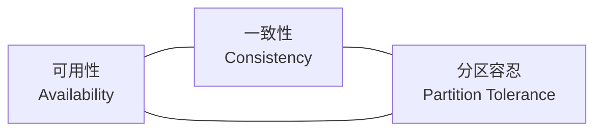
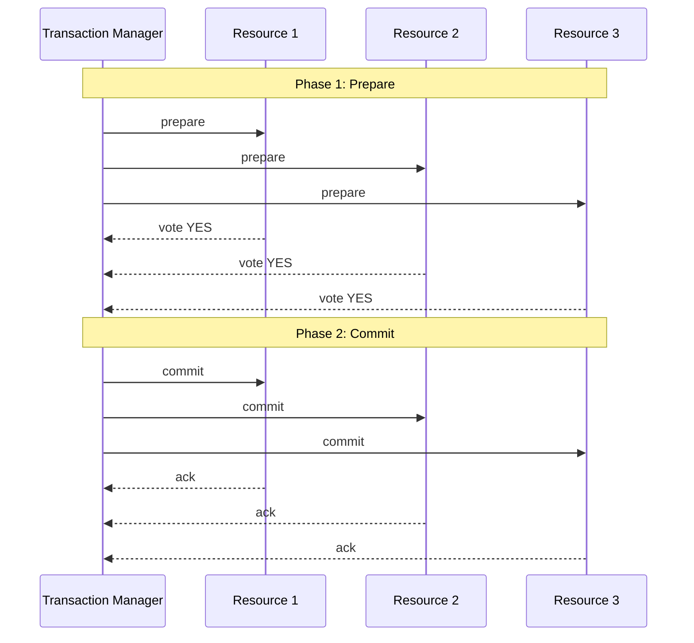
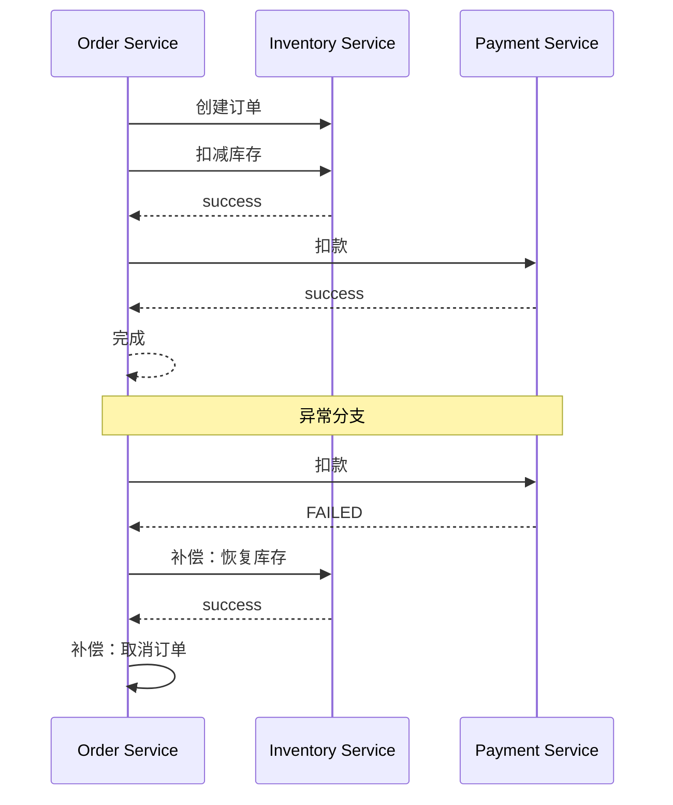
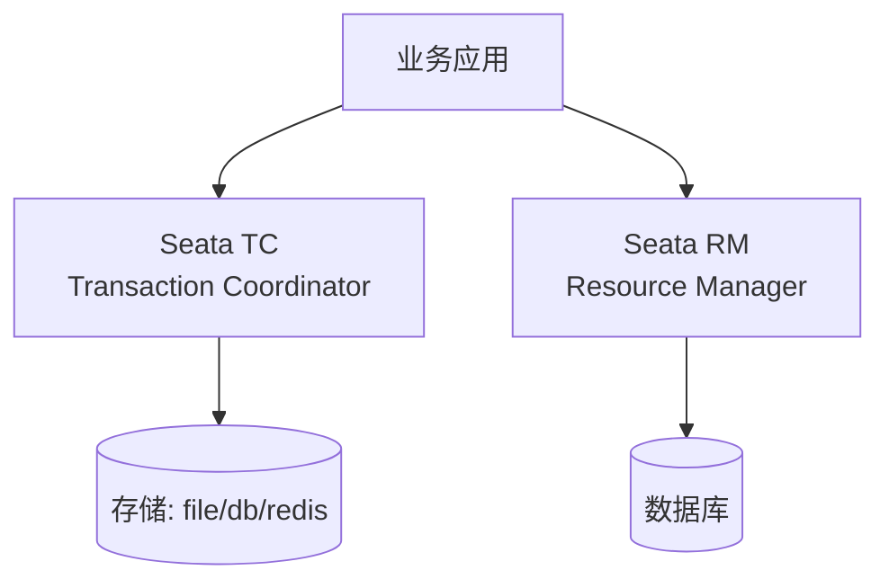
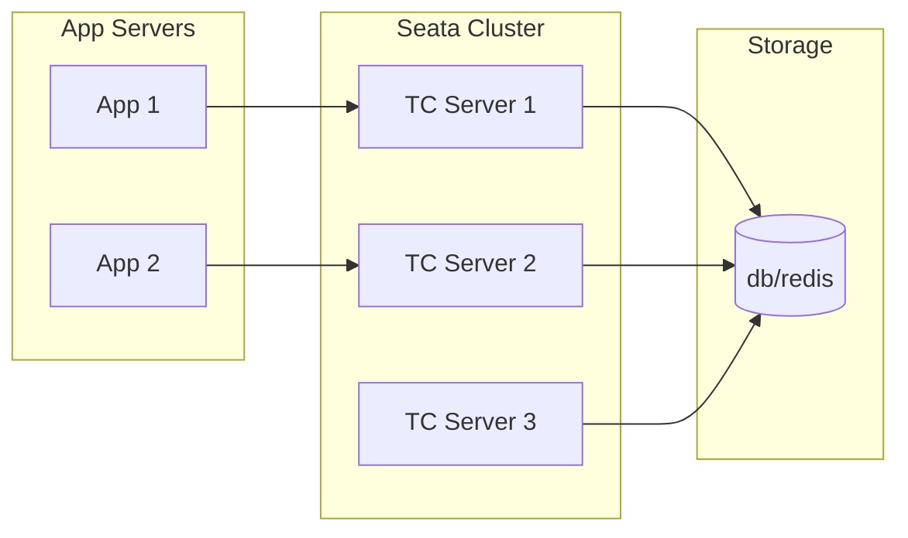
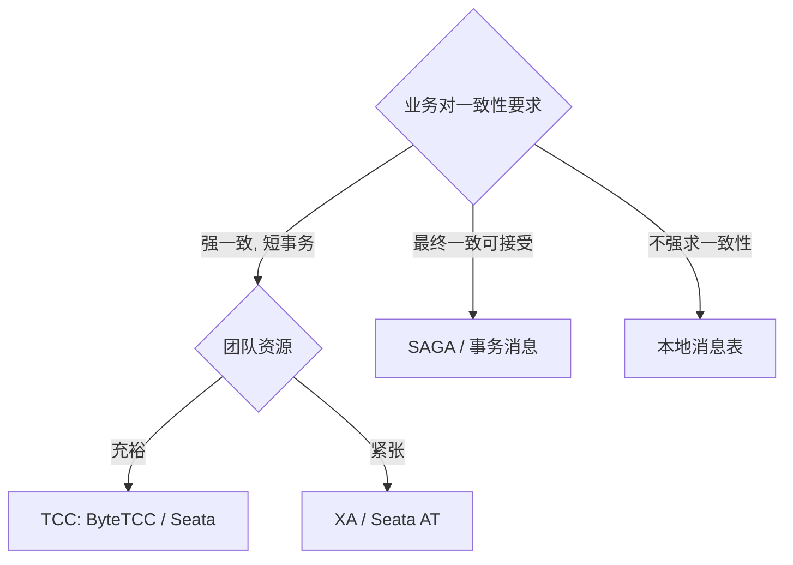

1987 年 Héctor García-Molina 与 Kenneth Salem 在 ACM SIGMOD Record 发表《Sagas》论文，提出将长事务拆分为多个子事务并通过补偿机制回滚的概念。这篇论文在 30 多年后成为微服务架构下分布式事务的核心方案之一。

但 Saga 不是银弹。在 Saga 之前，计算机科学界已经研究过 2PC（两阶段提交）几十年；在 Saga 之后，2007 年 Pat Helland 在《Life beyond Distributed Transactions: an Apostate's Opinion》中明确宣告**跨域分布式事务不可能存在**。正是在这种矛盾中，国内电商场景孕育出了 TCC（Try-Confirm-Cancel）模式，并由阿里 DTP、ByteTCC、Seata 等开源框架落地。

<!--more-->

## 一、分布式事务的难点

本地事务的四大 ACID 特性，在分布式环境下几乎全部失效：

- **A（Atomicity）**：跨服务调用无法用单一数据库的 `commit` 保证原子性
- **C（Consistency）**：多副本之间的最终一致需要额外协议（如 Raft、Paxos）
- **I（Isolation）**：不同服务使用不同数据库，隔离级别无法统一
- **D（Durability）**：单库持久化可保证，但跨库需要协调

工业界因此演化出一系列"妥协方案"——用 CAP 定理的话说，就是**放弃强一致，换取可用性与性能**。

### CAP 三角



分布式系统必须选 P（网络分区不可避免），剩下就是在 C 与 A 之间权衡。**分布式事务的所有方案都是 CP 或 AP 的某种具体化**。

## 二、2PC（两阶段提交）

### 2.1 协议流程



两阶段：

1. **Prepare**：协调者询问所有参与者是否可以提交，每个参与者写入 redo/undo 日志并加锁
2. **Commit/Rollback**：若全部同意则提交，否则全部回滚

### 2.2 致命缺陷

2PC 的核心问题是**同步阻塞 + 协调者单点**：

- **同步阻塞**：Prepare 阶段所有参与者持有锁直至协调者决策，高并发下数据库连接池迅速耗尽
- **协调者单点**：协调者宕机后，所有参与者陷入"既不能提交也不能回滚"的悬挂状态
- **脑裂风险**：网络分区导致部分参与者收到 Commit，部分没收到，数据不一致

为缓解这些问题，业界提出 **3PC**（三阶段提交），引入 `CanCommit` 预询和超时机制，但实际工程中仍存在脑裂窗口，**生产环境很少直接使用裸 2PC**。

### 2.3 XA 协议

2PC 的工业标准是 **XA 协议**（由 X/Open 组织定义），被 MySQL、PostgreSQL、Oracle 等主流数据库原生支持。Java 的 `javax.transaction.xa` 包提供完整 API：

```java
// 伪代码：XA 全局事务
XAConnection xaConn1 = dataSource1.getXAConnection();
XAConnection xaConn2 = dataSource2.getXAConnection();

XAResource xaRes1 = xaConn1.getXAResource();
XAResource xaRes2 = xaConn2.getXAResource();

Xid xid = new XidImpl(); // 全局事务 ID

xaRes1.start(xid, XAResource.TMNOFLAGS);
xaRes2.start(xid, XAResource.TMNOFLAGS);

// 执行业务 SQL
stmt1.executeUpdate("UPDATE account SET balance = balance - 100 WHERE id = 1");
stmt2.executeUpdate("UPDATE account SET balance = balance + 100 WHERE id = 2");

xaRes1.end(xid, XAResource.TMSUCCESS);
xaRes2.end(xid, XAResource.TMSUCCESS);

// Phase 1: prepare
int prep1 = xaRes1.prepare(xid);
int prep2 = xaRes2.prepare(xid);

// Phase 2: commit
if (prep1 == XAResource.XA_OK && prep2 == XAResource.XA_OK) {
    xaRes1.commit(xid, false);
    xaRes2.commit(xid, false);
}
```

### 2.4 适用场景

- 单库多库都在同一数据库厂商（如都是 MySQL）
- 业务对一致性要求极高（如金融核心）
- 并发量不大（XA 锁开销高）

## 三、SAGA 模式

### 3.1 基本原理

SAGA 把一个长事务拆分为 N 个本地子事务，每个子事务都有对应的**补偿操作**。任一子事务失败，按相反顺序执行补偿：



子事务 T1, T2, ..., Tn，对应补偿 C1, C2, ..., Cn：

- **正向路径**：T1 → T2 → ... → Tn → 完成
- **回滚路径**：T1 → T2 → ... → Tk（失败）→ Ck → ... → C2 → C1

### 3.2 两种协调方式

**Orchestration（编排式）**：

中央协调器（Orchestrator）负责调度所有子事务。常见实现是状态机或事件流。

```python
# 伪代码：编排式 SAGA
class OrderSaga:
    def execute(self, order):
        try:
            self.inventory_service.reserve(order)
            self.payment_service.charge(order)
            self.shipping_service.schedule(order)
        except Exception as e:
            self.compensate(order, e)

    def compensate(self, order, error):
        # 逆序补偿
        if self.shipping_service.is_reserved(order):
            self.shipping_service.cancel(order)
        if self.payment_service.is_charged(order):
            self.payment_service.refund(order)
        if self.inventory_service.is_reserved(order):
            self.inventory_service.release(order)
```

**Choreography（协同式）**：

无中心协调器，每个服务发布事件，其他服务订阅事件并执行本地事务。事件链自然形成 SAGA。

### 3.3 一致性边界

SAGA 的最大问题是**不保证 Isolation**——子事务提交后外部已可见，但若后续失败，补偿操作是"反向"操作而非"撤销"，中间状态对外暴露。

例如：

1. 用户下单，库存扣减
2. 支付失败
3. 库存补偿（恢复）
4. 用户看到"订单已取消"

但**库存可能已被其他用户看到扣减**——隔离级别低于 2PC。SAGA 适用"业务可以接受短暂不一致"的场景。

### 3.4 适用场景

- 跨多个微服务的长事务
- 子事务都有明确的补偿操作
- 业务可以容忍中间态可见（如订单已创建但支付失败）

## 四、TCC 模式

### 4.1 三阶段

TCC（Try-Confirm-Cancel）由国内电商场景催生，由阿里**程立（Lie Cheng）2008 年在 eBay 项目中提出**并落地实现，每个业务操作都要实现三个方法：

- **Try**：预留资源（不真正扣减，但冻结可用量）
- **Confirm**：真正执行业务（使用 Try 阶段冻结的资源）
- **Cancel**：释放 Try 阶段冻结的资源

```java
public interface TccAction {
    boolean tryAction(BusinessContext ctx);  // 冻结
    boolean confirmAction(BusinessContext ctx);  // 真正执行
    boolean cancelAction(BusinessContext ctx);  // 解冻
}

public class InventoryTcc implements TccAction {
    public boolean tryAction(BusinessContext ctx) {
        // 冻结库存：balance_available 不变，balance_frozen += N
        return inventoryDao.freeze(ctx.productId, ctx.quantity);
    }

    public boolean confirmAction(BusinessContext ctx) {
        // 真正扣减：balance_frozen -= N, balance_sold += N
        return inventoryDao.confirmDeduct(ctx.productId, ctx.quantity);
    }

    public boolean cancelAction(BusinessContext ctx) {
        // 解冻：balance_frozen -= N
        return inventoryDao.unfreeze(ctx.productId, ctx.quantity);
    }
}
```

### 4.2 与 SAGA 的区别

| 维度 | SAGA | TCC |
|------|------|-----|
| 资源可见性 | 子事务立即可见 | Try 后冻结，业务不可见 |
| 隔离级别 | 弱 | 接近强一致 |
| 实现复杂度 | 低（只要补偿） | 高（三个方法都要实现） |
| 性能开销 | 中 | 较高（两次数据库更新） |
| 适用场景 | 长事务、跨服务多 | 短事务、强一致 |

### 4.3 国内典型实现

- **阿里 DTP**：阿里内部的分布式事务平台，Dubbo 生态
- **ByteTCC**：字节跳动开源，基于 TCC
- **Seata**：阿里 2019-01 开源（前身 Fescar），2019-12 GA 1.0 的开源方案，整合 AT/TCC/SAGA/XA 四种模式，是当前国内事实标准

## 五、Seata 实战

Seata（Simple Extensible Autonomous Transaction Architecture）是 2019 年由阿里开源的分布式事务框架，2019-12 发布 1.0 GA，**Seata 1.5.0** 于 2022-05-17 GA。它整合了四种模式：



四种模式特点：

| 模式 | 原理 | 入侵度 | 性能 |
|------|------|--------|------|
| **AT** | 自动生成反向 SQL | 零入侵 | 高 |
| **TCC** | 三阶段手动实现 | 高 | 高 |
| **SAGA** | 编排+补偿 | 中 | 中 |
| **XA** | 数据库原生 XA | 低 | 低 |

### 5.1 AT 模式示例（最常用）

```java
@GlobalTransactional  // 开启全局事务
public void placeOrder(OrderDTO order) {
    // 1. 扣库存（自动生成 undo_log）
    inventoryService.deduct(order.getProductId(), order.getQuantity());

    // 2. 创建订单
    orderService.create(order);

    // 3. 扣账户余额
    accountService.debit(order.getUserId(), order.getAmount());
}
```

AT 模式基于**拦截 SQL + 生成反向 SQL**实现，业务代码零改动。Seata RM 拦截 `UPDATE` 语句，记录前后镜像到 `undo_log` 表，提交阶段删除 `undo_log`，回滚阶段用反向 SQL 还原。

### 5.2 Seata 部署拓扑



Seata TC 需要集群部署（推荐 3 节点），全局事务状态持久化到 MySQL/Redis/文件。

## 六、事务消息与本地消息表

除了 2PC/SAGA/TCC，工业界还有两类"另辟蹊径"的方案。

### 6.1 事务消息（RocketMQ）

RocketMQ 提供事务消息特性：

```java
TransactionSendResult result = rocketMQTemplate.sendMessageInTransaction(
    "ORDER_TOPIC",
    MessageBuilder.withPayload(order).build(),
    order
);
```

流程：

1. 发送 Half Message（对消费者不可见）
2. 执行本地事务
3. 根据本地事务结果，Commit 或 Rollback Half Message

适合"本地事务 + 异步通知"的场景，如下单成功后异步通知库存系统。

### 6.2 本地消息表

经典模式：

1. 业务事务与消息写入同一本地事务（同库）
2. 后台轮询消息表，投递到 MQ
3. 消费端处理后回写消息状态

```sql
-- 本地事务中同时写业务表和消息表
BEGIN;
INSERT INTO orders(...) VALUES(...);
INSERT INTO message_outbox(type, payload) VALUES('INVENTORY_DEDUCT', '{...}');
COMMIT;

-- 后台 worker 轮询
SELECT * FROM message_outbox WHERE status = 'PENDING' LIMIT 100;
-- 投递到 MQ，成功后 UPDATE status = 'SENT'
```

实现简单、依赖少（只要本地事务），是中小团队的常见选择。

## 七、三种方案对比

| 维度 | 2PC / XA | SAGA | TCC |
|------|----------|------|-----|
| **一致性** | 强一致 | 最终一致 | 接近强一致 |
| **隔离级别** | 高 | 低 | 中高 |
| **性能** | 低 | 高 | 中 |
| **实现复杂度** | 低（数据库支持） | 中 | 高 |
| **业务入侵** | 低 | 中 | 高 |
| **回滚机制** | 数据库原生回滚 | 补偿操作 | Cancel 操作 |
| **适用场景** | 同库事务 | 跨服务长事务 | 短事务强一致 |
| **代表实现** | MySQL XA、Atomikos | Seata SAGA、Eventuate | Seata TCC、ByteTCC |

## 八、生产陷阱

**陷阱 1：盲目追求强一致**

很多团队上来就用 TCC，付出巨大开发代价，结果发现业务其实可以接受最终一致。先问"业务真的需要强一致吗"——90% 的答案是"不需要"。

**陷阱 2：SAGA 补偿不可逆**

有些业务操作没有等价的"反向操作"（如第三方支付退款有时间窗口）。这种场景下 SAGA 必须设计**幂等+重试+人工兜底**机制。

**陷阱 3：TCC 幂等性**

TCC 的 Confirm/Cancel 必须**幂等**——网络抖动导致重试时不能出错。每个步骤都要带 `transaction_id` 做去重。

**陷阱 4：事务范围过大**

一个分布式事务跨越 8 个服务，每个服务又有多个数据库操作——性能灾难。原则：**事务范围越小越好**，能用本地事务就用本地事务。

**陷阱 5：忽略幂等与防悬挂**

TCC 的 Try 阶段可能因网络延迟与 Cancel 阶段冲突（Try 在 Cancel 之后到达）——**悬挂问题**。必须设计状态机避免。

## 九、选型决策树



## 十、小结

分布式事务不存在"银弹"。三种方案的本质差异来自**一致性、性能、复杂度**三角的权衡：

- **2PC/XA**：数据库层面的一致性，笨重但可靠
- **SAGA**：业务层面的最终一致，灵活但有中间态
- **TCC**：业务层面的强一致，性能好但实现复杂

工业界共识：

1. **能不用就不用**——能拆成本地事务就别用分布式事务
2. **优先最终一致**——大多数业务不需要强一致
3. **小事务优于大事务**——事务跨度越短越好
4. **幂等 + 补偿是基础**——任何方案都要兜底

真正的高一致分布式系统，往往不是靠某种事务协议保证，而是靠**业务设计 + 兜底机制 + 人工运营**的组合。

## 更新记录

- **1987**：García-Molina & Salem 发表 Saga 论文
- **2007**：Pat Helland《Life beyond Distributed Transactions》宣告分布式事务不可行
- **2014+**：阿里 GTS/DTP 在双十一场景落地 TCC
- **2019-12**：Seata 1.0 GA（2019-12-21），整合 AT/TCC/SAGA/XA 四种模式
- **2020-10**：Seata 1.4.0 GA（2020-10-30），支持控制台与多语言
- **2022-06**：阿里开源《Seata 详解》，社区生态走向成熟
- **2023+**：Temporal、Apache ServiceComb Saga 等云原生事务编排平台兴起；eBPF + Service Mesh 提供网络层事务可观测性
