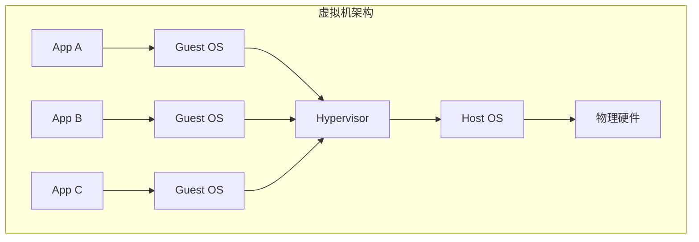
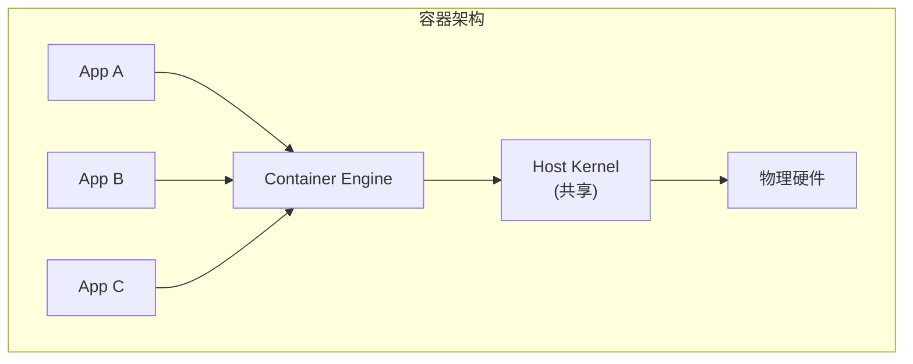
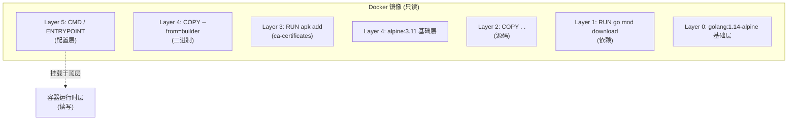
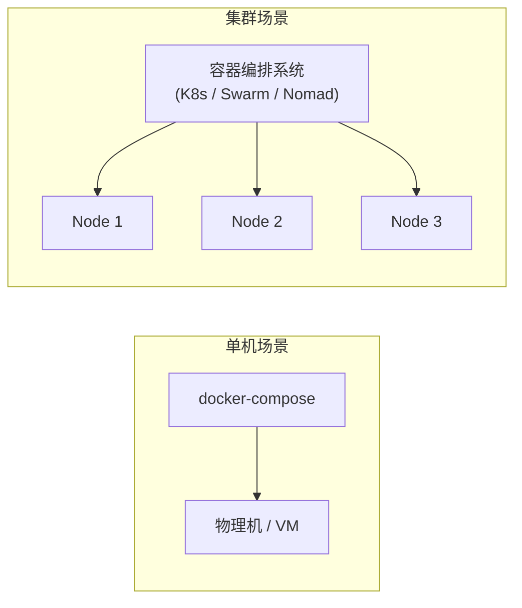
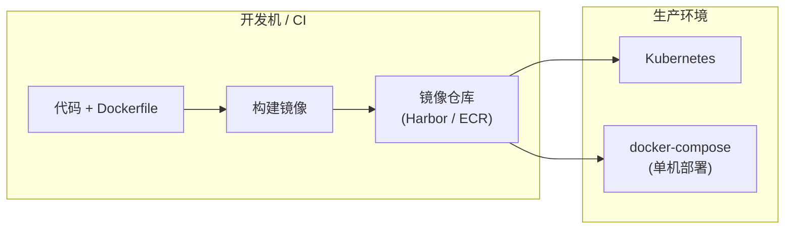

2013 年 Solomon Hykes 在 PyCon 做了一个 5 分钟的闪电演讲，把 dotCloud 内部用的容器工具开源出来，命名为 Docker。七年过去，Docker 已经从"开发玩具"变成"生产标配"，但很多工程师对它的理解仍停留在"换个命令行打包"的层面。

容器化的真正价值不是"省资源"，而是**可移植性**：开发机写的代码、CI 构建的产物、生产环境运行的服务，三者使用完全一致的运行时。把"在我电脑上能跑"这句话彻底从团队里抹掉。

但 Docker 的水面之下有大量概念需要搞明白：镜像分层、UnionFS、网络命名空间、卷管理、安全加固……这篇文章把 2020 年 Docker 最实用的知识点串起来。

<!--more-->

## 一、容器到底是什么：与虚拟机的本质区别

理解 Docker 的第一道坎，是分清**容器不是轻量级虚拟机**。





**核心差异**：

| 维度 | 虚拟机 | 容器 |
|------|--------|------|
| 虚拟化层次 | 硬件级 | 操作系统级 |
| 启动时间 | 30-60 秒 | 50-500 毫秒 |
| 镜像大小 | 几 GB（包含完整 OS） | 几十到几百 MB |
| 性能损耗 | 5-15% | < 2% |
| 隔离强度 | 强（独立内核） | 较弱（共享内核） |
| 适用场景 | 多 OS 混合、遗留系统 | 微服务、云原生 |

容器本质上是**一个进程 + 一组 Linux 命名空间**。它没有自己的内核，只是被隔离起来运行在宿主机内核上的普通进程。这决定了：

- **容器里看到的 PID 1，就是宿主机上的一个普通进程**（可以用 `docker top` 验证）
- **容器不能跑 Windows 容器在 Linux 宿主机上**（内核 ABI 不同），反之亦然
- **容器逃逸是真实存在的安全风险**（Namespace/Cgroup 配置错误时）

## 二、镜像分层：UnionFS 与写时复制

Docker 镜像的存储机制是它的第二个核心概念。先看一个典型的 Dockerfile：

```dockerfile
# 多阶段构建示例
FROM golang:1.14-alpine AS builder
WORKDIR /app
COPY go.mod go.sum ./
RUN go mod download
COPY . .
RUN CGO_ENABLED=0 go build -o /order-service ./cmd/order

# 运行时镜像（极小）
FROM alpine:3.11
RUN apk add --no-cache ca-certificates tzdata
COPY --from=builder /order-service /usr/local/bin/order-service
EXPOSE 8080
ENTRYPOINT ["/usr/local/bin/order-service"]
```

每一行指令对应镜像里的**一层（Layer）**。这些层通过 **UnionFS** 叠加成最终的只读文件系统：



**关键机制**：

- **写时复制（Copy-on-Write）**：多个容器共享同一个镜像时，下层文件是只读的；只有当容器尝试修改文件时，才把该文件复制到顶层的读写层
- **层缓存**：Docker 构建时会逐层检查哈希。如果某层没变（依赖没更新），直接复用缓存，跳过对应指令的执行
- **多阶段构建**：用一个临时镜像编译产物，最终只把二进制扔进精简运行时镜像，避免把 Go SDK 打包到生产镜像里（golang:1.14-alpine 是 300MB+，alpine:3.11 只有 5MB）

## 三、容器进程模型：前台进程与僵尸

Docker 容器的生命周期由 **PID 1 进程**决定。这是新手最容易踩的坑。

**核心规则**：

- 容器启动时执行的命令成为 PID 1
- PID 1 退出，容器立即停止（所有子进程被 SIGKILL）
- PID 1 必须是**前台进程**，不能是后台守护进程

```dockerfile
# 错误：nohup + 后台 &
CMD nohup java -jar app.jar &

# 正确：直接前台运行
CMD ["java", "-jar", "app.jar"]
```

如果必须用 shell 启动（比如要 `source` 环境变量），用 exec 形式让进程替换 shell：

```dockerfile
CMD ["/bin/sh", "-c", "source /etc/profile && exec java -jar app.jar"]
```

进程信号处理也很重要。Docker 停止容器时默认发 `SIGTERM`，**给应用 10 秒优雅退出时间**。如果应用不处理 `SIGTERM`，会被强制 kill。Go 应用要在 `main` 函数里监听 `signal.Notify`：

```go
// main.go 中处理优雅退出
sigCh := make(chan os.Signal, 1)
signal.Notify(sigCh, syscall.SIGINT, syscall.SIGTERM)

go func() {
    <-sigCh
    log.Println("收到终止信号，开始优雅退出...")
    server.Shutdown(context.Background())
}()
```

## 四、网络驱动：bridge / host / overlay

Docker 容器网络有四种驱动，生产环境最常用的是 bridge 和 host：

| 驱动 | 隔离方式 | 性能 | 典型场景 |
|------|---------|------|---------|
| bridge | 虚拟网桥（NAT） | 较好 | 单机多容器 |
| host | 共享宿主机网络 | 最优 | 高性能要求、监控 agent |
| none | 无网络 | - | 批处理任务 |
| overlay | 跨主机 VXLAN | 中等 | Docker Swarm 集群 |

**默认 bridge 网络的坑**：Docker 安装时会创建一个 `docker0` 网桥，容器接入后通过 NAT 与外界通信。这意味着：

- 容器内 `localhost` 不等于宿主机 `localhost`
- 容器之间默认可以通过 IP 互通，但**容器名不解析**（除非用 `--link`，也不推荐）

**推荐做法：用自定义 bridge 网络**

```bash
docker network create --driver bridge app-net
docker run -d --name order --network app-net order-service:latest
docker run -d --name pay   --network app-net pay-service:latest
```

自定义网络会自动启动 DNS 解析，容器之间可以用服务名互通：

```go
// pay 容器里连接 order 容器
conn, err := grpc.Dial("order:8080", grpc.WithInsecure())
```

**host 模式下的注意事项**：容器直接共享宿主机网络栈，**没有端口隔离**。两个容器不能同时监听宿主机 8080 端口。一般用在 sidecar（如日志采集器）、网络监控等需要极致性能的场景。

## 五、存储卷：数据持久化

容器默认的文件系统是临时的——容器删除，数据就没了。**所有生产数据都必须用 volume 持久化**。

三种挂载方式：

| 类型 | 语法 | 用途 |
|------|------|------|
| volume | `-v mydata:/data` | 命名卷，Docker 管理，最常用 |
| bind mount | `-v /host/path:/data` | 直接挂载宿主机目录 |
| tmpfs | `--tmpfs /data` | 内存文件系统，仅 Linux |

```bash
# 创建命名卷
docker volume create mysql-data

# 启动 MySQL，挂载卷
docker run -d --name mysql \
    -v mysql-data:/var/lib/mysql \
    -e MYSQL_ROOT_PASSWORD=secret \
    mysql:8.0

# 查看卷
docker volume ls
docker volume inspect mysql-data
```

**典型陷阱**：

- **不要把容器内的高频写入路径放在 bind mount 上**（如 `/tmp`、`/var/log`）——bind mount 会绕过 UnionFS 的 CoW 机制，性能损失很大
- **跨容器共享数据用命名卷**，不要用 bind mount（路径依赖宿主机文件系统）
- **备份卷时停掉容器**（或者用 `mysqldump` 之类的工具导出），不要直接 `cp` 文件——可能损坏正在写入的数据

## 六、Dockerfile 最佳实践

2020 年社区已经沉淀出几条硬性规范：

### 1. 选择精简基础镜像

| 镜像 | 大小 | 适用场景 |
|------|------|---------|
| alpine | 5MB | 多数 Go/Rust/Node 应用 |
| debian-slim | 25MB | 需要 glibc 的应用 |
| distroless | 10-20MB | 生产环境，Google 维护 |

```dockerfile
# 不要用
FROM ubuntu:latest

# 用
FROM gcr.io/distroless/static:nonroot
```

### 2. 一个容器一个进程

容器是"应用进程"而不是"虚拟机"。多进程容器（systemd + sshd + app）会让生命周期管理、信号处理、日志收集全部变复杂。

需要 sidecar 时用 docker-compose 编排多个容器，而不是把所有东西塞进一个镜像。

### 3. 用 `.dockerignore`

```text
.git
node_modules
*.log
.DS_Store
```

避免无关文件污染构建上下文，让构建更快、镜像更干净。

### 4. 固定镜像版本

```dockerfile
# 错误：latest 不可复现
FROM node:latest

# 正确
FROM node:14.17.0-alpine
```

`latest` 是流动的，今天能构建，明天可能就因为上游升级而失败。生产环境必须钉死版本。

### 5. 非 root 用户运行

```dockerfile
FROM alpine:3.11
RUN addgroup -S app && adduser -S app -G app
USER app
```

容器逃逸后，如果进程以 root 运行，攻击者立刻获得宿主机的 root 权限。**永远用非 root 用户跑应用进程**。

## 七、docker-compose：多容器编排

单机场景下，docker-compose 是比 Kubernetes 简单得多的编排方案。典型 Web 应用栈：

```yaml
# docker-compose.yml
version: "3.7"

services:
  web:
    build: ./web
    ports:
      - "8080:8080"
    environment:
      - DATABASE_URL=postgres://app:secret@db:5432/app
      - REDIS_URL=redis://cache:6379
    depends_on:
      - db
      - cache
    restart: unless-stopped

  worker:
    build: ./worker
    environment:
      - DATABASE_URL=postgres://app:secret@db:5432/app
      - REDIS_URL=redis://cache:6379
    depends_on:
      - db
      - cache
    restart: unless-stopped

  db:
    image: postgres:13-alpine
    volumes:
      - pgdata:/var/lib/postgresql/data
    environment:
      - POSTGRES_PASSWORD=secret
      - POSTGRES_USER=app
      - POSTGRES_DB=app

  cache:
    image: redis:6-alpine
    volumes:
      - redisdata:/data

volumes:
  pgdata:
  redisdata:
```

启动整个栈：

```bash
docker-compose up -d          # 后台启动
docker-compose ps             # 查看状态
docker-compose logs -f web    # 查看日志
docker-compose down           # 停止并清理容器
```

docker-compose 把**开发环境**这件事变成了可版本控制、可一键复制的工程产物。团队新人 clone 仓库后 `docker-compose up`，十分钟内就能跑起来——这是单体应用永远做不到的事。

## 八、安全加固清单

容器安全的核心是**纵深防御**。下面是 2020 年的最低要求：

| 项目 | 配置 |
|------|------|
| 镜像来源 | 只用官方镜像或私有仓库自建镜像，禁用 `--insecure-registries` |
| 镜像扫描 | 集成 Trivy / Clair 扫描 CVE |
| rootless | Docker 19.03+ 支持 Rootless 模式，避免容器逃逸影响宿主 |
| 资源限制 | `--memory=512m --cpus=1.0` 防止单个容器耗尽资源 |
| 只读文件系统 | `--read-only` 配合 tmpfs 写入 `/tmp` |
| 能力裁剪 | `--cap-drop=ALL --cap-add=NET_BIND_SERVICE` 最小权限 |
| 日志收集 | 标准输出走 stdout，宿主机用 Fluentd/Filebeat 聚合 |

## 九、容器编排：Docker 的边界

docker-compose 适合单机，但生产环境很少只有一台机器。当业务要部署到 5 台、50 台、500 台机器时，必须引入**容器编排系统**：



2020 年的三个主流编排方案：

| 系统 | 出品方 | 适用规模 | 核心特性 |
|------|--------|---------|---------|
| Kubernetes (K8s) | Google/CNCF | 大集群 (50+ 节点) | 功能最全，生态最丰富 |
| Docker Swarm | Docker 官方 | 中小集群 (5-50 节点) | 学习曲线低，与 Docker 深度集成 |
| Apache Mesos | Apache | 超大规模 | 双层调度（Marathon + Mesos），适合混合工作负载 |
| HashiCorp Nomad | HashiCorp | 通用调度 | 二进制单文件，调度 container/binary/VM/JVM |

**Swarm 在 2020 年仍然是活跃选项**。很多中小企业用 Swarm 而不是 K8s，原因很简单：

- 学习曲线低（yml 文件、CLI 命令几乎和 docker-compose 一致）
- 内置 overlay 网络，开箱即用
- 单二进制部署，没有 etcd 这种外部依赖

但 Swarm 的功能上限也明显：缺乏丰富的 Operator 生态、Service Mesh 集成、CRD 扩展机制。所以**对未来的扩展性有要求的话，直接上 K8s**。

Docker 本身不强制绑定某个编排器——它只负责"运行容器"。编排系统的选择是独立的工程决策。

## 十、Docker 在生产环境的角色

2020 年的典型架构：



- **Kubernetes 集群**：生产环境主力，每个 Pod 内部运行容器
- **docker-compose**：单机部署、轻量级服务、内部工具
- **镜像仓库**：CI 构建产物统一入口，所有环境从同一仓库拉取

Docker 本身只是容器运行时，**真正的生产部署能力来自 Kubernetes**。但没有 Docker 提供的镜像标准、容器模型、构建工具链，Kubernetes 也不可能流行起来。

## 十一、小结

Docker 不是万能的，但在云原生时代是绕不开的基础设施。掌握它的关键不是背命令，而是理解**容器只是进程 + 命名空间**这个本质：

- 镜像分层决定构建速度，UnionFS 决定空间效率
- PID 1 决定容器生命周期，信号处理决定优雅退出
- 自定义网络让服务发现回归简单，volume 让数据持久化有规可循
- Dockerfile 写不好，安全加固无从谈起

记住一句话：**容器化是手段，可移植性才是目的。**