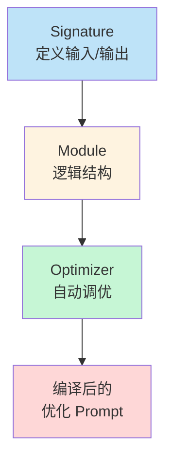
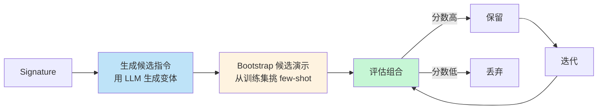
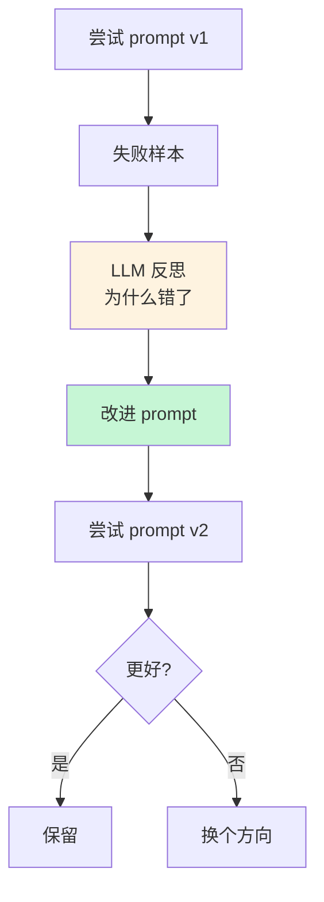

> 写 prompt 调到怀疑人生？改一个词要测 100 条 case？2025 年开始，**别再手调 prompt 了**——用 DSPy 这种"prompt 编译器"，让优化器自动搜索最优指令。

手调 prompt 是 AI 工程里**最反智**的工作之一：

- 改一个词就要重跑全部测试
- 一个 prompt 调到 90 分，再也调不上去
- 模型升级后又要从头调
- 不同任务需要不同 prompt，无法复用经验

Stanford NLP 提出的 **DSPy** 把 prompt 变成"**可编译的代码**"——你定义"想要什么"（signature），DSPy 编译器自动生成最优 prompt。这篇文章讲清楚它的原理、用法、和 2025 年最新的优化器（MIPROv2 / GEPA）。

<!--more-->

## 一、手调 prompt 的反智之处

先看一个真实场景：你要让 LLM 从一段文本中提取结构化字段。

**手调过程**（典型持续 2 周）：

```python
# 第 1 版
prompt_v1 = "从以下文本中提取人名：{text}"
# 准确率 60%

# 第 2 版
prompt_v2 = """你是一个专业的文本分析助手。
请仔细阅读以下文本，识别其中提到的人名。
人名通常以大写字母开头。
文本：{text}
请输出人名列表："""
# 准确率 65%

# 第 3 版
prompt_v3 = """从文本中提取所有人名。要求：
1. 输出为 JSON 数组
2. 忽略职位（Dr., Mr.）
3. 包含中英文名
文本：{text}"""
# 准确率 72%

# 第 4 版...
# ...永远调不到 100%
```

**问题**：
- 每次调都要跑测试
- 找不到"为什么这个 prompt 比那个好"
- 模型一升级（GPT-4o → GPT-5），又要从头调
- 不同任务都要从头调，没有累积

## 二、DSPy 的核心思想

DSPy 把 prompt 编程抽象成三层：



### 2.1 Signature：定义"想要什么"

```python
import dspy

# 定义一个 signature
class ExtractNames(dspy.Signature):
    """从文本中提取所有人名。"""
    
    text = dspy.InputField(desc="包含人名的原始文本")
    names = dspy.OutputField(desc="提取的人名列表，JSON 数组格式")
```

**关键**：你只描述"我要什么输入输出"，**不写 prompt 本身**。

### 2.2 Module：定义"怎么算"

```python
class NameExtractor(dspy.Module):
    def __init__(self):
        super().__init__()
        self.extract = dspy.ChainOfThought(ExtractNames)
    
    def forward(self, text):
        return self.extract(text=text)
```

`ChainOfThought` 是 DSPy 内置的推理模块——自动让模型"step by step"思考。

### 2.3 Optimizer：自动调优

```python
from dspy.teleprompt import MIPROv2

# 准备训练数据
trainset = [
    dspy.Example(
        text="Steve Jobs 和 Bill Gates 创立了科技公司。",
        names=["Steve Jobs", "Bill Gates"]
    ).with_inputs("text"),
    # ... 50-200 条
]

# 配置优化器
optimizer = MIPROv2(
    metric=lambda ex, pred: 1.0 if set(ex.names) == set(pred.names) else 0.0,
    num_candidates=10,
    init_temperature=1.0
)

# 编译
optimized = optimizer.compile(
    NameExtractor(),
    trainset=trainset,
    num_trials=50  # 试 50 种 prompt 组合
)
```

**这就是"prompt 编译器"**——你给数据和评估指标，它自动找最优 prompt。

## 三、MIPROv2：自动搜索最优指令

2025 年 DSPy 的旗舰优化器是 **MIPROv2**（Multi-prompt Instruction Proposal Optimizer v2）。



### 3.1 MIPROv2 的三阶段

**阶段 1：生成候选指令**
- 让 LLM 自己针对你的 signature 生成多种指令变体
- 比如："简洁版"、"详细版"、"步骤化版"、"角色扮演版"

**阶段 2：Bootstrap 候选演示**
- 从训练集挑出代表性的输入输出对作为 few-shot example
- 自动挑"最有信息量"的样本（多样性 + 难度）

**阶段 3：组合评估**
- 把指令 + few-shot 组合成候选 prompt
- 在训练集上评估，挑最好的

### 3.2 实际效果

```python
# 配置
optimizer = MIPROv2(
    metric=accuracy_metric,
    num_candidates=10,        # 10 个候选指令
    num_bootstrap=4,          # 4 个 few-shot 候选
    num_trials=30,            # 总共试 30 种组合
    max_bootstrapped_demos=2,
    max_labeled_demos=2,
)

# 编译结果
optimized_program = optimizer.compile(
    program,
    trainset=trainset,
)

# 看看编译器找到了什么
for predictor in optimized_program.predictors():
    print(f"Signature: {predictor.signature}")
    print(f"Instructions: {predictor.extended_signature.instructions}")
    print(f"Demos: {len(predictor.demos)}")
```

**典型结果**（DSPy 论文与社区报告）：
- 比手调 prompt 提升 **10-30%** 准确率
- 调到 90+ 分的天花板常常被打破
- 模型升级后**重新编译**就行，不用手改

## 四、GEPA：反思式优化（2025 新）

2025 年 9 月推出的 **GEPA**（Genetic-Pareto Prompt Optimizer）是 DSPy 的新一代优化器，用**反思**而非纯搜索。

```python
from dspy.teleprompt import GEPA

optimizer = GEPA(
    metric=accuracy_metric,
    reflection_model=dspy.LM("gpt-4o"),  # 用 LLM 反思
    num_generations=10,
    population_size=20,
)

optimized = optimizer.compile(
    program,
    trainset=trainset,
)
```

**GEPA 的核心**：用 LLM 分析失败样本，**自然语言反思**哪里错了，然后改进 prompt。



**vs MIPROv2**：
- MIPROv2：纯贝叶斯搜索，更稳定但慢
- GEPA：LLM 反思 + Pareto 进化，更快找到"反直觉"的改进

## 五、实战：构建一个 RAG 系统

用 DSPy 完整搭一个 RAG pipeline：

```python
import dspy

# 1. 配置 LM
lm = dspy.LM("openai/gpt-4o-mini")
dspy.configure(lm=lm)

# 2. 自定义 retriever（用你自己的向量库）
def search_wikipedia(question: str, k: int = 3) -> list[str]:
    results = chroma_db.search(question, n_results=k)
    return [r["content"] for r in results]

# 3. 定义 Signature
class GenerateAnswer(dspy.Signature):
    """用给定的上下文回答用户问题。"""
    context = dspy.InputField(desc="检索到的相关文档")
    question = dspy.InputField()
    answer = dspy.OutputField(desc="2-3 句话的精炼答案")

# 4. 定义 RAG Module
class RAG(dspy.Module):
    def __init__(self, num_passages=3):
        super().__init__()
        self.num_passages = num_passages
        self.generate_answer = dspy.ChainOfThought(GenerateAnswer)
    
    def forward(self, question):
        context = search_wikipedia(question, k=self.num_passages)
        prediction = self.generate_answer(context=context, question=question)
        return prediction

# 5. 准备训练集
trainset = [
    dspy.Example(
        question="苹果公司的创始人是谁？",
        context="苹果公司由 Steve Jobs、Steve Wozniak 和 Ronald Wayne 于 1976 年创立。",
        answer="苹果公司由 Steve Jobs、Steve Wozniak 和 Ronald Wayne 于 1976 年创立。"
    ).with_inputs("question"),
    # ... 100 条
]

# 6. 编译
from dspy.teleprompt import MIPROv2

optimizer = MIPROv2(metric=answer_accuracy, num_trials=20)
compiled_rag = optimizer.compile(RAG(), trainset=trainset)

# 7. 部署
compiled_rag.save("./compiled_rag.json")

# 加载
loaded = RAG()
loaded.load("./compiled_rag.json")
```

## 六、Signature vs Pydantic

DSPy 的 Signature 和 Pydantic 看起来像，定位完全不同：

| 工具 | 作用 |
|------|------|
| **Pydantic** | 数据校验：保证输入输出结构合法 |
| **DSPy Signature** | 优化目标：告诉优化器"我要什么" |

可以**结合用**：

```python
from pydantic import BaseModel
import dspy

# Pydantic 保证结构
class PersonOutput(BaseModel):
    name: str
    age: int
    role: str

# DSPy Signature 用于优化
class ExtractPerson(dspy.Signature):
    """从文本中提取人物信息。"""
    text = dspy.InputField()
    person_json = dspy.OutputField(desc="JSON 格式，符合 PersonOutput schema")

class PersonExtractor(dspy.Module):
    def __init__(self):
        super().__init__()
        self.extract = dspy.ChainOfThought(ExtractPerson)
    
    def forward(self, text):
        result = self.extract(text=text)
        # Pydantic 二次校验
        person = PersonOutput.model_validate_json(result.person_json)
        return person
```

## 七、和传统 prompt 工具的对比

| 工具 | 范式 | 优势 | 不足 |
|------|------|------|------|
| **手调 Prompt** | 文本 | 灵活 | 不可复用、难优化 |
| **Promptfoo** | YAML + 测试 | 适合 A/B 测试 | 仍是手调 |
| **LangSmith** | Trace + 测试 | 可观测性好 | 不优化 prompt |
| **DSPy** | 编译式 | 自动优化 | 学习曲线 |

DSPy 的定位不是替代这些工具，而是**在它们之上做自动化**——你可以用 LangSmith 跑 trace，用 DSPy 优化 prompt，再把优化的结果部署到 LangChain 应用里。

## 八、生产部署

DSPy 编译后产物是一个 JSON 文件：

```python
# 编译产物
compiled_rag.save("./rag_v1.json")

# 产物内容（简化）
{
    "generate_answer.predict.instructions": "用以下上下文回答问题。如果上下文没有相关信息，明确说'我不知道'...",
    "generate_answer.predict.demos": [
        {
            "context": "苹果公司由 Steve Jobs...",
            "question": "苹果创始人？",
            "answer": "Steve Jobs, Wozniak, Wayne"
        },
        # ...
    ]
}
```

**部署方式**：

```python
# 方式 1：直接加载 JSON
loaded_rag = RAG()
loaded_rag.load("./rag_v1.json")

# 方式 2：导出 prompt 到 LangChain
from dspy.utils import export_prompt

prompt_text = export_prompt(loaded_rag.predictors()[0])
# 把 prompt_text 写到 LangChain 的 PromptTemplate
```

## 九、DSPy 适合谁？

| 适合 | 不太适合 |
|------|---------|
| **复杂任务 + 大训练集** | 简单 1-shot 任务 |
| **需要反复迭代 prompt** | 一次性 prompt |
| **多任务 / 多团队协作** | 单人单任务 |
| **追求上限质量** | 时间紧迫 |
| **模型升级频繁** | 模型固定 |

**最大的价值**：把 prompt 优化从"艺术"变成"工程"。

## 十、上线 checklist

把 DSPy 落到代码里：

- [ ] **复杂任务用 DSPy**——简单任务不必
- [ ] **Signature 描述清晰**——这是优化的目标
- [ ] **训练集 ≥ 50 条**——太少优化效果差
- [ ] **Metric 设计合理**——这是优化的方向
- [ ] **先用 MIPROv2**——稳定可靠
- [ ] **GEPA 试一下**——可能更快找到反直觉改进
- [ ] **编译后导出 prompt**——方便部署
- [ ] **模型升级重新编译**——别忘

## 十一、一点反思

手调 prompt 之所以**普遍存在**，是因为它**有即时的满足感**——改一个词，马上看输出。

但这种"**手感**"是错觉：

- 你看不到 prompt 的真实失败模式
- 你不知道为什么 A 比 B 好
- 模型一升级一切归零
- 调到一个"局部最优"就以为到顶了

DSPy 把 prompt 优化变成**有目标、有数据、有方法**的工程问题——这是 LLM 应用进入"工业化生产"的标志。

2025 年的趋势已经很清楚：**手调 prompt 会越来越少，自动优化会成为主流**。早点上车。

---

**参考资料：**
- [DSPy 官方文档](https://dspy.ai/)
- [DSPy GitHub Repository](https://github.com/stanfordnlp/dspy)
- [Khattab et al.: DSPy Paper (2024)](https://arxiv.org/abs/2310.03714)
- [MIPROv2 Documentation](https://dspy.ai/tutorials/program_of_thought/)
- [GEPA Optimizer Tutorial](https://www.mihaileric.com/posts/dspy-mipro-optimizer/)
- [Kaggle: DSPy Guide](https://www.kaggle.com/code/iqraali/stanford-nlp-s-dspy-a-guide-to-programmatic-prompt-optimization)
- [Mihail Eric: Compile and Optimize AI Agent Workflows](https://www.mihaileric.com/posts/dspy-compile-optimize-ai-agent-workflows/)
- [MLQ.ai: DSPy Prompt Optimization](https://mlq.ai/dspy-prompt-optimization/)
- [MLQ.ai: DSPy vs Manual Prompt Engineering 2025](https://mlq.ai/dspy-vs-manual-prompt-engineering/)