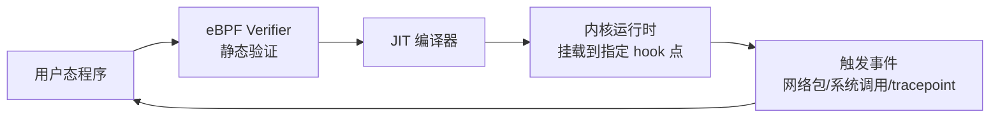
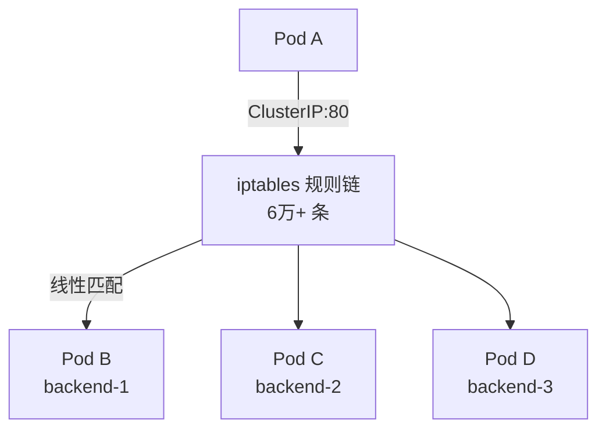
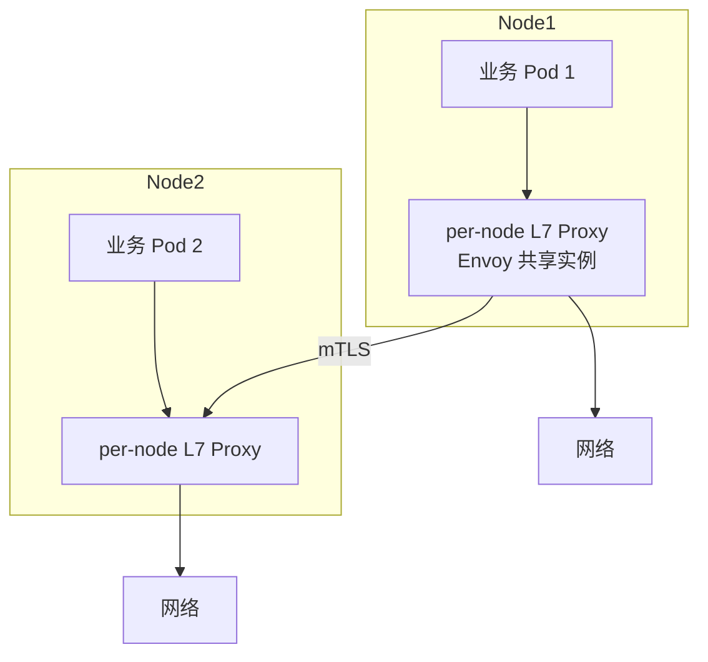
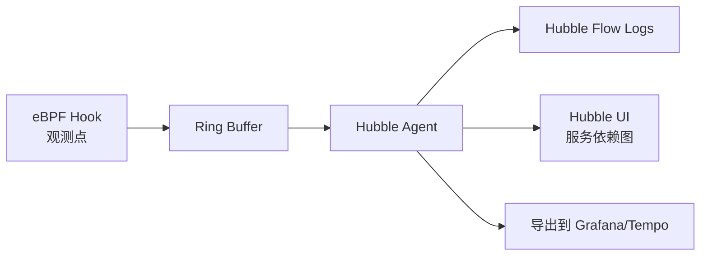

2023 年我们给一个 800 节点金融 K8s 集群做网络改造，运维老哥拍桌子："kube-proxy iptables 规则超过 6 万条，iptables-restore 一次 11 秒，集群滚动升级一次 Service 要等 47 秒。" 我们抱着试试看的心态上了 Cilium，结果同样的集群，Service 切换延迟降到 0.3 秒以内，节点内存还省了 8 GB。

这不是 Cilium 的魔法，是 **eBPF** 这场"内核网络可编程化"革命的胜利。从 2014 年 Alexei Starovoitov 在 Facebook 改写 eBPF 开始，这项技术让 Linux 内核第一次拥有了"安全运行用户自定义程序"的能力 —— 网络、安全、可观测性领域被彻底重塑。

<!--more-->

## 一、eBPF 是什么：内核里的"JavaScript"

### 1.1 从 BPF 到 eBPF

**BPF（Berkeley Packet Filter）** 1992 年诞生，最初是 tcpdump 用的"包过滤虚拟机"。2013-2014 年，Alexei Starovoitov 在 Facebook 主导扩展 BPF 指令集并加入 LLVM 后端，演变成 **eBPF（extended BPF）**。如果说传统 BPF 是"包过滤的正则表达式"，eBPF 就是"能在内核里跑的图灵完备程序"。

传统内核扩展要写内核模块（重编内核、风险大、不能热加载、容易把内核 panic），eBPF 提供了一个"安全沙箱"：



**eBPF 程序的生命周期**：

1. 用户写 C / Rust 代码 → LLVM 编译成 eBPF 字节码
2. 内核 **Verifier** 静态检查：无循环、指令数 ≤ 100 万（早期）/百万级（5.x 后）、内存访问越界检查
3. **JIT 编译**为原生机器码，注入内核
4. 挂载到指定 hook 点（XDP、tc、kprobe、tracepoint 等）
5. 事件触发时执行，通过 **ring buffer / perf event** 回传数据

**安全保证与卸载机制**：Verifier 在加载阶段完成路径可达性、栈深度（≤512 字节）、map 访问越界、循环边界等检查 —— 不通过则直接拒绝加载（"fail closed"）。运行时通过 **BPF_PROG_ATTACH / DETACH** 显式控制挂载与卸载，旧程序引用计数归零后才真正释放；Map 由内核 **pin** 到 `/sys/fs/bpf/` 持久化，进程退出后仍可被其他程序复用。Tail call、kfunc、ring buffer 等新能力（5.x 后）受 **CAP_BPF / CAP_SYS_ADMIN** 细粒度权限控制，非 root 用户也能加载只读观测型程序。这些机制共同保证：eBPF 程序既能热加载，又能保证内核稳定不 panic。

### 1.2 关键 hook 点

| Hook 点 | 触发时机 | 典型用途 |
|---------|---------|---------|
| **XDP**（eXpress Data Path） | NIC 驱动收包最早点 | 负载均衡、DDoS 防御（早于协议栈） |
| **TC**（Traffic Control） | ingress/egress 包处理 | Cilium 主用、流量整形 |
| **Socket** | socket 层 | Cilium socket LB、连接级加速 |
| **kprobe / tracepoint** | 内核函数调用 | 可观测性、性能分析 |
| **LSM** | 安全模块 | 运行时安全策略 |

XDP 是 eBPF 最具革命性的能力 —— 在驱动收包的瞬间执行用户程序，可以"早退"（XDP_TX / XDP_DROP）跳过后续协议栈。Cloudflare 用 XDP 做 DDoS 防御，单机处理百万 PPS。这相当于把"用户态的 L4 处理"下沉到驱动层，性能数量级提升。

### 1.3 为什么 2023 年才爆发

eBPF 1992 就有了雏形，2014 就有扩展，但 2017-2023 才真正"工业可用"，原因是：

- **Linux 内核 4.19+**（2018-11）才完整支持 verifier 性能优化
- **Linux 5.x**（5.4/5.10/5.15）逐步完善 cilium 高级特性（host routing、socket LB、BBR）
- **BCC / bpftrace / libbpf** 工具链成熟（2019+）
- **Cilium**（2017 创立，2021 CNCF 毕业）证明"K8s + eBPF"在生产可用

## 二、Cilium：K8s 网络的 eBPF 重写

Cilium 由 Isovalent（2023 年被 Cisco 收购）创立，是 eBPF 在 K8s 网络领域最成功的落地。它做了一件简单粗暴的事：**用 eBPF 程序完全替代 kube-proxy 的 iptables / IPVS**。这不是渐进式优化，是把"iptables 规则匹配"这个 K8s 网络的"老瓶颈"从根本机制上换掉。

### 2.1 kube-proxy 的痛点



**问题**：
- iptables 规则"线性匹配"，6 万条规则最坏匹配 6 万次；这是算法本身的 O(n) 复杂度，无法绕过
- 全量 iptables-restore 重载：800 节点 11 秒（每节点都重写整个规则链）
- Service 变更（添加/删除 backend）触发增量重算，大集群几十秒，期间流量会短暂"卡顿"
- 只能 L4 负载均衡（L7 要靠 Ingress，而 Ingress 又要靠 NGINX 反代）

### 2.2 Cilium 的替代方案

```mermaid
graph TB
    Client[Pod A] -->|ClusterIP:80| BPF[eBPF Map<br/>O(1) 哈希查找]
    BPF --> Backend1[Pod B]
    BPF --> Backend2[Pod C]
    BPF --> Backend3[Pod D]
```

Cilium 用两张 eBPF Map 做"服务-后端"映射：

- **cilium_lb4_secrets_v2 / cilium_lb4_services_v2**：Service 标识（IP+Port+协议）→ backend 列表
- **cilium_lb4_backends_v3**：backend ID → 真实 endpoint（IP + 元数据）

数据面转发用 **eBPF 程序**（`bpf_overlay` / `bpf_host` / `bpf_lxc`）挂在 TC hook，**O(1) 哈希查表**直接转发。

### 2.3 关键特性演进

| 版本 | 关键里程碑 |
|------|-----------|
| 1.10 (2022) | kube-proxy 替换 beta |
| **1.13 (2023-02-15)** | **kube-proxy 替换 GA**；socket-level LB 仍 beta |
| **1.14 (2023-07-25)** | **socket-level 加速 GA**；Socket LB 绕过 host stack，性能再提升 10-30% |
| 1.15 (2024-03) | 网络可观测性增强；egress gateway 改进 |
| 1.16 (2024-08) | Egress Gateway GA；Cilium Service Mesh 成熟 |

**Socket-level 加速** 是个关键设计：传统 eBPF 在 TC hook 处理包，但 socket 层建立的连接（`connect()` 之后）要重新做 conntrack + NAT 匹配。Socket LB 直接在 socket 层把"ClusterIP"改成"真实 Pod IP"，绕过整个 conntrack 路径。

### 2.4 内核版本要求

Cilium 对内核版本挑剔，因为不同特性依赖不同内核子集：

| 特性 | 最低内核 | 推荐内核 |
|------|---------|---------|
| 基础网络 + 可观测性 | 4.19 | 5.4+ |
| kube-proxy 替换 | 5.4 | 5.10+ / 5.15+ |
| BPF host routing | 5.10 | 5.15+ |
| WireGuard 加密 | 5.6 | 5.15+ |
| XDP 加速（NodePort/LB） | 4.19.57+ / 5.1.16+ / 5.2+ | 5.10+ |
| BBR for Pods | 5.18+ | 6.1+ |

云厂商默认内核（2024）：GKE COS ≥ 5.15、EKS AL2023 ≥ 6.1、AKS Ubuntu 22.04 ≥ 5.15。**生产 Cilium 推荐 5.10+**。

**自建机房迁移成本评估**：内核升级是 Cilium 落地的"最大拦路虎"。很多企业内网还在跑 CentOS 7（默认 3.10 内核）、RHEL 8.4（4.18 内核），Cilium 1.16 根本起不来。常见做法有三条：1) 升级到 Ubuntu 22.04 / RHEL 9 / Rocky Linux 9（5.14+ 内核）；2) 用 Cilium 1.13 LTS 分支（兼容 4.19 内核但功能受限）；3) 用 Cilium 1.10 + 传统 kube-proxy 模式（放弃 kube-proxy 替换收益）。建议先评估内核升级可行性，再决定 Cilium 目标版本。

## 三、Cilium Service Mesh：Sidecar 终结者

Cilium 1.14+ 引入了"无 Sidecar 的 Service Mesh" —— 不用 Envoy sidecar，直接在节点级的 eBPF + 轻量代理上做 L7 处理。

### 3.1 传统 Sidecar 架构


问题：500 Pod 集群 = 500 个 Envoy，几十 GB 内存，~3-8x 的 CPU 开销（参考我们之前 Istio/Linkerd 对比文章）。

### 3.2 Cilium Service Mesh 架构



**核心思路**：
- **L4 策略 + 加密**：eBPF 在内核态做（零拷贝、零应用感知）
- **L7 策略**（HTTP 重写、header 路由）：节点级共享 Envoy 实例（不是每 Pod 一个）
- **mTLS**：节点级共享 Cilium Agent 做证书签发 + 密钥管理

**对比**：

| 维度 | Istio Sidecar | Linkerd Sidecar | Cilium Service Mesh |
|------|--------------|-----------------|---------------------|
| 数据面 | 每 Pod Envoy | 每 Pod linkerd2-proxy | 节点级 Envoy（共享） |
| L4 处理 | iptables + Envoy | iptables + Rust 代理 | 内核 eBPF |
| L7 处理 | Envoy sidecar | linkerd2-proxy | 节点级 Envoy |
| mTLS | sidecar 终止 | sidecar 终止 | 节点级终止 |
| 资源占用 | Istio：~154 MB/Pod | Linkerd：~17-26 MB/Pod | ~50-100 MB/节点（共享） |
| 启动延迟 | +1-2s | +0.5-1s | +0ms（已运行） |
| 协议支持 | 全 | 仅 HTTP/gRPC | HTTP/gRPC + 内核层 L4 |

500 Pod 集群换 Cilium Service Mesh 典型能省 **30-50 GB 内存**。

## 四、Hubble：eBPF 原生的可观测性

传统 K8s 可观测性三大件（Metrics + Logs + Traces）通常靠应用侧插桩（Prometheus client、OpenTelemetry SDK）。但网络层的"东西向流量"很难在应用侧打点 —— 你不知道一个 HTTP 请求经过了哪些 Service、Pod、Node。

Cilium 自带 Hubble 做可观测性 —— 同样基于 eBPF，不在应用侧插桩：



**Hubble 能看到的东西**：
- 服务依赖关系（自动生成，无须手动标注）
- L3/L4 流：源 IP、目标 IP、端口、协议、字节数
- L7 详情（开启 L7 visibility 后）：HTTP method、URL、status code、gRPC method
- 策略决策（drop / allow）审计
- DNS 解析追踪

**典型排障命令**：

```bash
# 实时看 service 流量
hubble observe --namespace prod --follow

# 过滤 5xx 错误
hubble observe --namespace prod --http-status 500

# 查所有被 drop 的包
hubble observe --verdict DROPPED

# 服务依赖图（Hubble UI）
hubble ui
```

## 五、实战部署

### 5.1 升级前检查

升级 Cilium 前必须检查 4 件事：

1. **内核版本**：`uname -r`，对照上文版本表；Cilium 1.16 至少 5.10
2. **现有 iptables 规则**：先备份 kube-proxy configmap，避免清理不彻底
3. **NetworkPolicy 翻译**：kubectl get networkpolicy 列出所有策略，确认都能在 CiliumNetworkPolicy 中等价表达（绝大部分是 L3/L4 直译，但有少量 k8s NetworkPolicy 高级特性 Cilium 0.x 还不支持）
4. **集群节点数 vs Cilium agent 资源**：1000 节点集群 Cilium agent 默认 1Gi 内存不够，要调到 4Gi+

### 5.2 Helm 安装

```bash
helm repo add cilium https://helm.cilium.io
helm install cilium cilium/cilium --version 1.16.1 \
  --namespace kube-system \
  --set kubeProxyReplacement=true \
  --set k8sServiceHost=<API_SERVER_IP> \
  --set k8sServicePort=6443 \
  --set bpf.hostRouting=true \
  --set bpf.masquerade=true \
  --set ipam.mode=kubernetes
```

**关键开关**：
- `kubeProxyReplacement=true`：用 eBPF 替 iptables
- `bpf.hostRouting=true`：节点间路由走 eBPF（需内核 5.10+）
- `bpf.masquerade=true`：SNAT 走 eBPF
- `hubble.enabled=true` + `hubble.relay.enabled=true`：开启可观测性

### 5.3 替代 kube-proxy

```bash
# 1. 备份 kube-proxy 配置
kubectl -n kube-system get configmap kube-proxy -o yaml > kube-proxy-backup.yaml

# 2. 删除 kube-proxy
kubectl -n kube-system delete daemonset kube-proxy

# 3. 清理 iptables 规则（可选）
kubectl -n kube-system exec -it <kube-proxy-pod> -- iptables-save | \
  grep -v KUBE | iptables-restore

# 4. 装 Cilium
helm install cilium cilium/cilium ... --set kubeProxyReplacement=true
```

### 5.4 L7 策略示例

```yaml
apiVersion: cilium.io/v2
kind: CiliumNetworkPolicy
metadata:
  name: l7-http-policy
  namespace: production
spec:
  endpointSelector:
    matchLabels:
      app: order-service
  ingress:
    - fromEndpoints:
        - matchLabels:
            app: frontend
      toPorts:
        - ports:
            - port: "8080"
              protocol: TCP
          rules:
            http:
              - method: "GET"
                path: "/api/v1/orders.*"
              - method: "POST"
                path: "/api/v1/orders"
```

## 六、常见坑

1. **内核版本不够**：Cilium 1.16 要求 5.10+，但很多私有云还在用 4.19/5.4；升级内核或降级 Cilium 版本
2. **`bpf.hostRouting` 配错**：开启后需要检查 CNI chaining 冲突；Calico + Cilium 同时跑会乱；eBPF 与 iptables 双路径会让 conntrack 表变 2 倍
3. **Hubble UI 内存爆**：开启 L7 visibility 后 Hubble agent 内存涨 2-3 倍；高流量命名空间建议采样或只开 5xx/error 过滤
4. **Cilium 升级 break 集群**：1.13 → 1.14 数据格式不兼容，需要重启所有 Pod；建议滚动升级每 5 分钟一节点，监控 cilium-agent 重启时间
5. **NetworkPolicy 顺序**：Cilium 不支持 deny-all 默认策略，要显式写 `CiliumNetworkPolicy` 或开 cluster-wide policy
6. **`kubeProxyReplacement=strict` 翻车**：要求内核必须有 BPF host routing，5.4 以下内核直接起不来
7. **Cilium 节点重启后服务短暂中断**：节点上 eBPF map 重建需要 1-3s，期间 ClusterIP 转发可能失败；通过 `PodDisruptionBudget` + `rollingUpdate` 缓解
8. **多网络接口场景**：节点有多个 NIC（公有云多网卡、bonding）时，bpf.hostRouting 模式要正确识别主接口，否则 Pod 出网走错路径

## 七、小结

eBPF 不是"新技术"（1992 起源，2014 现代化），它是 Linux 内核"用户可编程"的范式转移。Cilium 是这场革命在 K8s 网络领域最成功的工业落地：

- **eBPF 让内核可编程**：Verifier 保证安全、JIT 编译保证性能、hook 点丰富（XDP/TC/Socket/kprobe/LSM）
- **Cilium 1.13+ 真正替代 kube-proxy**：O(1) 哈希 vs iptables 线性匹配，Service 切换从 47s 降到 0.3s
- **Cilium Service Mesh 终结 Sidecar**：节点级 Envoy 共享，500 Pod 集群省 30-50 GB 内存
- **Hubble 提供 eBPF 级可观测性**：不插桩、自动服务依赖、L7 透明追踪，定位问题从"抓包 + grep iptables"变成"hubble observe --http-status 500"

我们 800 节点的金融集群换 Cilium 后，节点内存平均省 8 GB，Service 切换稳定 0.3s 以内，L4 网络策略审计从"grep iptables"变成"kubectl get ciliumnetworkpolicy"。代价是内核版本必须 5.10+，运维同学要学 eBPF 基础概念（hook 点、map、verifier 限制）。但对 K8s 集群规模过 500 节点的团队来说，**Cilium + eBPF 是 2024 年最值得投入的网络改造**，收益远大于学习成本。

参考：

- [Cilium 1.13 Release Blog](https://isovalent.com/blog/post/cilium-release-113/)
- [Cilium 1.14 Release Blog](https://isovalent.com/blog/post/cilium-release-114/)
- [Cilium System Requirements](https://github.com/cilium/cilium/blob/main/Documentation/operations/system_requirements.rst)
- [Cilium 官方文档 - Architecture](https://docs.cilium.io/en/stable/overview/intro/)
- [eBPF 官方站点](https://ebpf.io/)
