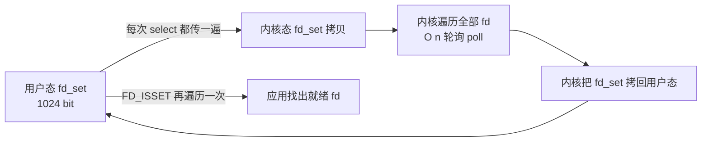
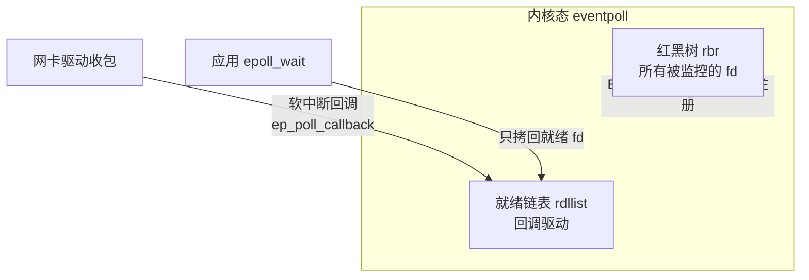
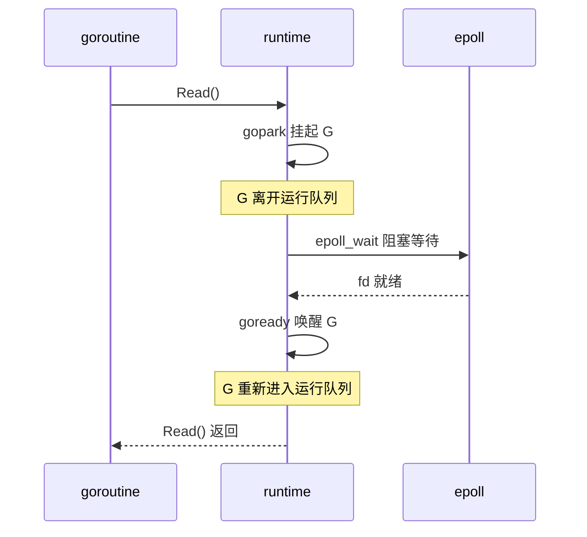

2019 年的高并发服务端（Redis、Nginx、Node.js、envoy）几乎都用 epoll 作为底层 I/O 多路复用机制。但多数文章只讲 `epoll_create / epoll_ctl / epoll_wait` 三个 API 长什么样，没人讲清楚它到底解决了上一代的什么瓶颈。这篇文章想从一连接一线程这个最朴素的模型讲起，沿四代 I/O 模型看 epoll 解决了哪些具体的工程问题，再落到 Redis 和 Go 这两种截然不同的上层用法。

<!--more-->

## 一、起点：一连接一线程

最直观的网络服务模型是「一个连接一个线程」：

```c
while (1) {
    int cfd = accept(listen_fd, ...);
    pthread_create(..., handle_client, cfd);
}
```

```c
void *handle_client(void *arg) {
    int fd = (int)(intptr_t)arg;
    char buf[4096];
    while (1) {
        int n = read(fd, buf, sizeof(buf));  // 阻塞
        if (n <= 0) break;
        write(fd, buf, n);
    }
    close(fd);
    return NULL;
}
```

2000 年前后 Dan Kegel 提出 C10K 问题：在 1GHz CPU、2GB 内存的机器上，怎么同时处理 1 万个并发连接？一连接一线程的模型撑不住，三个层面的成本：

1. **线程栈**：默认 8MB，1 万连接 = 80GB 物理内存，光栈就吃光机器
2. **上下文切换**：1 万个线程即便大多在等 I/O，内核调度器每秒也要切换成千上万次，cache miss 居高不下
3. **调度器压力**：线程数超过 CPU 核数后，调度开销呈指数上升，吞吐反而下降

所以问题不是「怎么让一个连接处理得更快」，而是「怎么用很少的线程盯住大量连接」。这就是 I/O 多路复用（I/O Multiplexing）要做的事：让一个或几个线程同时监听成百上千个 socket。

## 二、先把四个词定义清楚

在讨论 epoll 之前，必须先把容易混淆的四个词固定下来。POSIX 的定义基于一个 `read` 系统调用可以拆成两个阶段：

- **阶段 1：等待数据就绪**（wait for data）—— 数据从网卡到达内核缓冲区
- **阶段 2：从内核拷贝到用户空间**（copy data from kernel to user）—— 把数据搬到调用 `read()` 的进程里

| 组合 | 阶段 1 | 阶段 2 | 例子 |
|------|--------|--------|------|
| 同步阻塞 | 阻塞 | 阻塞 | 传统 `read()` |
| 同步非阻塞 | 轮询 / 等待就绪 | 阻塞 | `read()` + `O_NONBLOCK`，select/poll/epoll 都属于这一类 |
| 异步阻塞 | 阻塞（少见） | 阻塞 | 很少用，无意义 |
| 异步非阻塞 | 非阻塞 | 非阻塞 | Linux AIO、Windows IOCP、2019 年 5 月刚并入 5.1 的 io_uring |

注意 **epoll 不是异步 I/O**——它只是「同步非阻塞 + 多路复用」。`epoll_wait` 返回就绪 fd 后，应用还是要自己调 `read()` 完成阶段 2，这是同步的根。真正的异步 I/O 在 Linux 上是 `io_submit` / `io_getevents`，只是这个 API 历史包袱太重（仅支持 O_DIRECT、不支持 socket），直到 2019 年 5 月 io_uring 才给出一个像样的替代品。

把这个区分记牢了，后面的 select/poll/epoll 都属于「同步非阻塞多路复用」这一类，只是工程上做了不同取舍。

## 三、select：第一个能用的多路复用

1990 年代初，4.2 BSD 引入 `select`。用法很直接：传三个 fd_set（readfds/writefds/exceptfds）进去，内核告诉你哪些 fd 就绪。

```c
fd_set rfds;
FD_ZERO(&rfds);
FD_SET(fd1, &rfds);
FD_SET(fd2, &rfds);
FD_SET(fd3, &rfds);

struct timeval tv = {1, 0};
int n = select(max_fd + 1, &rfds, NULL, NULL, &tv);
if (n > 0) {
    if (FD_ISSET(fd1, &rfds)) read(fd1, ...);
    if (FD_ISSET(fd2, &rfds)) read(fd2, ...);
    if (FD_ISSET(fd3, &rfds)) read(fd3, ...);
}
```

select 解决了「一个线程盯多个 fd」的问题，但有三个具体瓶颈：

**瓶颈 1：每次调用都要把整个 fd_set 从用户态拷贝到内核态。** fd_set 是 1024 位的位图（`FD_SETSIZE` 宏），每次 `select` 调用都得把这 1024 bit（128 字节）拷进内核，调用结束再拷回来。1 万个连接时这个开销还能忍，但拷贝本身是无意义的——你只关心其中几个 fd 就绪，却把整个位图都搬了一遍。

**瓶颈 2：内核要遍历全部 fd。** 内核拿到 fd_set 后，必须轮询检查每个 fd 是否就绪，复杂度 O(n)。1 万个 fd 就是 1 万次 poll 调用。

**瓶颈 3：返回后用户态还要再遍历一次找就绪的。** `select` 只返回「有几个 fd 就绪」，但不告诉你是哪几个。所以应用拿到结果后还得用 `FD_ISSET` 遍历整个 fd_set 把就绪的挑出来——又一次 O(n)。

外加一条硬伤：**1024 上限**。`FD_SETSIZE` 是宏定义，编译期固定。想突破得重新编译 libc，几乎没人这么做。



## 四、poll：链表版 select，但 O(n) 没变

1997 年左右，AT&T 的 SVR4 引入 `poll(2)`，用 `pollfd` 数组替代位图：

```c
struct pollfd fds[10000];
fds[0].fd = fd1; fds[0].events = POLLIN;
fds[1].fd = fd2; fds[1].events = POLLIN;
// ...

int n = poll(fds, 10000, 1000);  // 1 秒超时
for (int i = 0; i < 10000; i++) {
    if (fds[i].revents & POLLIN) {
        read(fds[i].fd, ...);
    }
}
```

`pollfd` 用链表结构解决了 1024 上限：fd 数量只受系统 `fd` 表大小限制（默认上限几十万）。

**但 O(n) 没变**。`poll` 还是每次调用把整个数组传进内核，内核遍历一遍，应用再遍历一遍。本质上就是 select 的链表版。

## 五、epoll：三个具体的设计决定

2002 年，Linux 2.5.44 引入 `epoll`。它针对 select/poll 的三个瓶颈，做了三个具体的设计决定：

### 5.1 内核里持久化的 eventpoll 实例

`epoll_create` 返回一个 fd，背后是内核里的一个 `struct eventpoll`：

```c
// 简化版内核结构（Linux 4.x）
struct eventpoll {
    struct rb_root rbr;          // 红黑树：管理所有被监控的 fd
    struct list_head rdllist;    // 就绪链表：数据到达的 fd
    struct epitem *ovflist;      // 一时溢出时的临时挂载点
    wait_queue_head_t wq;        // epoll_wait 的等待队列
};
```

调用 `epoll_ctl(epfd, EPOLL_CTL_ADD, fd, &event)` 时，把这个 fd 插进红黑树。**关键：内核持久保存这份注册信息，下次 `epoll_wait` 不需要重新传入**。

对比一下 select/poll：每次调用都得把整个集合传一遍，等于「每次都重新注册」。epoll 把「注册」和「等待」两步彻底分开，注册一次管终生。

### 5.2 就绪队列：回调驱动

设备驱动收到数据包、通过软中断把数据放入 socket 接收缓冲区时，会调用一个回调函数 `ep_poll_callback`，把对应的 `epitem` 挂到 `rdllist` 上。

这就是 epoll 真正的「魔法」：**就绪通知不是靠内核轮询，而是靠事件回调**。网卡驱动一收到数据，相应的 epitem 已经在就绪链表里了，根本不需要再去翻整个红黑树。

### 5.3 epoll_wait 只返回就绪的

`epoll_wait` 调用时，内核只需要：

1. 把当前 `rdllist` 上的所有 epitem 拷贝到用户空间（事件数组）
2. 清空 `rdllist`，准备下一轮回调
3. 如果链表为空就阻塞等待（用 wait queue）

**复杂度从 O(n) 降到 O(就绪数)**。1 万个连接里只有 100 个就绪？epoll_wait 只返回这 100 个。这就是「C10K」问题的工程答案。



### 关于 mmap 的常见误传

很多文章说「epoll 用 mmap 让内核和用户共享内存，所以比 select 快」。**这个说法经不起源码对照**。Linux 4.x 的 `eventpoll` 确实可以通过 `mmap` 把 `eventpoll` 文件的某些页映射到用户空间，但**rdllist 的拷贝仍然走 `epoll_wait` 的标准 `copy_to_user` 路径**，不是靠 mmap 共享内存。

epoll 真正的性能来源是「红黑树 + 回调 + 只回拷就绪 fd」三件套，mmap 最多算个锦上添花。把这个误传澄清后，面试时被追问才不会露怯。

### 5.4 一个完整的 epoll echo 服务器

把上面的三个 API 串起来就是典型的 Linux 网络服务端骨架：

```c
// 简化版 echo server
#include <sys/epoll.h>
#include <fcntl.h>

#define MAX_EVENTS 64
#define BUFSIZE    4096

int main() {
    int listen_fd = socket(AF_INET, SOCK_STREAM, 0);
    // bind + listen 省略

    int epfd = epoll_create1(0);
    struct epoll_event ev, events[MAX_EVENTS];

    // 把 listen_fd 加入红黑树
    ev.events = EPOLLIN;
    ev.data.fd = listen_fd;
    epoll_ctl(epfd, EPOLL_CTL_ADD, listen_fd, &ev);

    while (1) {
        int n = epoll_wait(epfd, events, MAX_EVENTS, -1);
        for (int i = 0; i < n; i++) {
            int fd = events[i].data.fd;
            if (fd == listen_fd) {
                // 新连接
                int cfd = accept(listen_fd, NULL, NULL);
                set_nonblock(cfd);
                ev.events = EPOLLIN | EPOLLET;  // 配 ET
                ev.data.fd = cfd;
                epoll_ctl(epfd, EPOLL_CTL_ADD, cfd, &ev);
            } else if (events[i].events & EPOLLIN) {
                // ET 模式必须循环 read
                char buf[BUFSIZE];
                ssize_t len;
                while ((len = read(fd, buf, BUFSIZE)) > 0) {
                    write(fd, buf, len);
                }
                if (len == 0 || (len == -1 && errno != EAGAIN)) {
                    close(fd);
                    epoll_ctl(epfd, EPOLL_CTL_DEL, fd, NULL);
                }
            }
        }
    }
}
```

三个关键点：fd 设非阻塞、listen_fd 用 LT（必须 LT，否则新连接可能漏 accept）、业务 fd 用 ET + 循环 read 到 EAGAIN。

## 六、LT 与 ET：两种语义

epoll 提供两种事件触发模式，定义在 `epoll_event.events` 里：

- **LT（Level Triggered，水平触发，默认）**：fd 只要还处于就绪状态，每次 `epoll_wait` 都会通知
- **ET（Edge Triggered，边沿触发）**：fd 从未就绪 → 就绪的那一刻才通知一次，之后不再通知

ET 看似更高效（少了很多冗余唤醒），但配套要求更严：**必须循环 `read` 到返回 `EAGAIN`**，否则会丢事件。

```c
// ET 模式 + 非阻塞 fd 的正确写法
int len;
while ((len = read(fd, buf, sizeof(buf))) > 0) {
    handle(buf, len);
}
if (len == -1 && errno == EAGAIN) {
    // 本轮数据读完，下次 epoll_wait 再来
    break;
}
```

如果 fd 是阻塞的，循环 `read` 会卡死在最后一次（数据读完后再 `read` 就阻塞了，永远不会返回 `EAGAIN`）。所以 **ET 必须配非阻塞 fd**——这是面试常考点，也是生产事故的常见来源。

对比 LT 写法，可以省掉循环：

```c
// LT 模式可以更简单
int n = read(fd, buf, sizeof(buf));
if (n > 0) handle(buf, n);
// 下次 epoll_wait 还会再提醒 fd 就绪，不会丢
```

Nginx 默认用 LT，Redis 的 `ae` 模块默认也用 LT。Java NIO 的 `Selector` 在 Linux 上也是 epoll，OpenJDK 早期版本（Java 8 之前）的 Selector 用 LT，Java 11 之后部分实现改用 ET，但跨平台兼容性让它没有强制要求循环 read。

## 七、两种上层用法

epoll 是内核能力，但「怎么用它」完全是上层应用的决策。2019 年的两个典型代表：Redis 单线程事件循环、Go runtime 的 netpoller。

### 7.1 Redis：单线程事件循环

Redis 5.0（2018 年 10 月发布）的网络层走 `ae` 抽象 + epoll 实现（Linux 平台）：

```c
// aeMain 伪代码
void aeMain(aeEventLoop *eventLoop) {
    while (1) {
        aeProcessEvents(eventLoop, AE_ALL_EVENTS|
                        AE_CALL_BEFORE_SLEEP|
                        AE_CALL_AFTER_SLEEP);
    }
}
```

```c
int aeProcessEvents(aeEventLoop *eventLoop, int flags) {
    // 1. 调 epoll_wait 拿就绪 fd
    int numevents = aeApiPoll(eventLoop, tvp);
    // 2. 调用所有就绪 fd 的读/写回调
    for (int j = 0; j < numevents; j++) {
        fe = &eventLoop->events[eventLoop->fired[j].fd];
        if (eventLoop->fired[j].mask & AE_READABLE)
            fe->rfileProc(eventLoop, fd, fe->clientData, AE_READABLE);
        if (eventLoop->fired[j].mask & AE_WRITABLE)
            fe->wfileProc(eventLoop, fd, fe->clientData, AE_WRITABLE);
    }
}
```

为什么 Redis 单线程能扛 10 万+ QPS？因为 Redis 的瓶颈根本不在 CPU 上：

- 内存操作（GET/SET/HASH）只走 RAM，纳秒级
- 协议简单（RESP），解析开销极低
- 网络瓶颈（千兆网卡约 8 万 RTT）远早于 CPU 瓶颈

所以「单线程事件循环」是一个完全够用的架构：epoll_wait 拿就绪 fd → 一个个顺序处理（无锁、无上下文切换），吞吐量反而比「一连接一线程」高一个数量级。

但 Redis 也有软肋：**单个慢命令会阻塞所有客户端**。比如 `KEYS *` 在千万级 key 上扫一遍要几秒，这几秒里整个 Redis 实例对其他客户端不可用。生产环境强制禁止 KEYS，改用 `SCAN` 迭代，就是这个原因。Redis 6.0 引入多线程 I/O 也只是把网络读写（解析请求、序列化响应）扔给额外线程，命令执行仍然是单线程。

### 7.2 Go netpoller：同步写法拿到异步性能

Go 的 `net.Conn.Read` 写起来像同步阻塞，但底层走的是 epoll。秘密在 runtime 的 netpoller：把 goroutine 挂在 fd 上，等 fd 就绪后再唤醒 goroutine。

```go
// 用户写的代码：和同步阻塞一模一样
conn, _ := net.Dial("tcp", "example.com:80")
buf := make([]byte, 1024)
n, err := conn.Read(buf)  // 看起来会卡在这里
log.Println(n, err)
```

底层发生了什么？Go runtime 把这个 goroutine 通过 `gopark` 挂起，等 epoll 回调触发后用 `goready` 唤醒。伪代码：

```go
// runtime/netpoll.go 简化版
func netpoll(block bool) *g {
    // 调 epoll_wait
    n := epoll_wait(epfd, events, 128, -1)
    for i := 0; i < n; i++ {
        // 拿到就绪 fd 对应的 goroutine
        g := netpollReady(events[i])
        // 唤醒它，放回运行队列
        ready(g)
    }
    return gp
}
```



这就是 Go 的「杀手锏」：**同步写法 + 异步性能**。业务代码完全不知道非阻塞 I/O 的存在，不用回调、不用 `async`/`await`、没有状态机，但底层确实只用了几个线程就跑起了成千上万的 goroutine。

代价是：**goroutine 内部不是真线程**——Go runtime 用 GMP 模型（G = goroutine, M = 机器线程, P = 逻辑处理器），M 数量受 `GOMAXPROCS` 限制。Go 1.5 之后默认 `GOMAXPROCS = NumCPU`，所以 CPU 密集型任务不会因为 goroutine 多就变快。但 I/O 密集型任务（网络服务）几乎不受这个限制，因为 goroutine 大多在等 epoll，不占 M。

## 八、几个常见工程问题

### 8.1 惊群

`accept(2)` 在多进程/多线程监听同一个 listen_fd 时，所有等待方会被内核同时唤醒，但只有一个能成功 accept，其他全部白醒一次——这就是「惊群」（thundering herd）。Nginx worker、Apache prefork 都踩过这个坑。

Linux 2.6 之后的内核在 `accept` 上做了「排他唤醒」修复（只有等待队列中的一个会被唤醒）。但如果同一 fd 在多个 epoll 实例上 `EPOLL_CTL_ADD`，惊群仍可能在 `epoll_wait` 上出现——这个 bug 直到 Linux 4.5 才彻底修好。所以 **跨多个 epoll 实例共享同一个 fd 仍然不推荐**。

### 8.2 SO_REUSEPORT：把连接分给多个进程

Linux 3.9 引入 `SO_REUSEPORT`（注意不是 `SO_REUSEADDR`），允许多个进程/线程绑定同一个端口，内核用一致性哈希把进来的连接分给其中一个：

```c
// Nginx worker 启动时
int fd = socket(AF_INET, SOCK_STREAM, 0);
int on = 1;
setsockopt(fd, SOL_SOCKET, SO_REUSEPORT, &on, sizeof(on));
bind(fd, (struct sockaddr*)&addr, sizeof(addr));
listen(fd, 128);
```

每个 worker 各自 `accept`，内核保证同一个客户端的连接始终分到同一个 worker，**避免惊群 + 减少锁竞争**。Nginx 1.9.1 之后开始默认开启，是 2014-2016 年 Nginx 性能大幅提升的关键之一。

### 8.3 epoll 不适用的场景

**磁盘文件 I/O 不能用 epoll**。为什么？epoll 的就绪通知依赖设备驱动的回调——网卡、管道、终端等「事件驱动」的 fd 都有回调机制。但磁盘文件 `read()` 在数据未到达 page cache 时，要么立刻返回数据（命中 page cache），要么阻塞在磁盘 I/O（缺页）——没有「就绪事件」可回调。所以 epoll 只对**网络 fd、管道、终端**这类真有事件通知的 fd 有效。

这就是为什么 Node.js 的 libuv 在 Windows 上用 IOCP（真异步 I/O）、在 Linux 上用 epoll，但**磁盘文件 I/O 仍然走线程池**——epoll 帮不了它。

### 8.4 边缘触发 + 多线程

ET 模式下，如果多个线程/进程同时 `read` 同一个 fd，仍然可能丢。这是 ET 的设计取舍：假设只有一个 reader。所以 ET 通常配合 `SO_REUSEPORT` + 每进程一个 epoll 实例使用。

## 九、四代 I/O 模型对比

| 维度 | 阻塞 I/O（线程） | select | poll | epoll |
|------|------------------|--------|------|-------|
| 内核复杂度 | O(1) | O(n) 遍历 | O(n) 遍历 | O(就绪数) 回调 |
| 每次调用是否要重传 fd 集合 | 否 | 是（位图） | 是（数组） | 否（注册一次） |
| 用户态遍历 | 否 | 是 | 是 | 否（直接拿到就绪 fd） |
| fd 数量上限 | 受线程数限制 | 1024（FD_SETSIZE） | 链表，无硬限 | 红黑树，无硬限 |
| 数据拷贝 | 每个 fd 一个线程栈 | 每次 select 拷 128 字节 | 每次 poll 拷数组 | 仅拷贝就绪 fd |
| 适用场景 | 连接数极少 | 已过时 | 已过时 | C10K / C100K 标配 |
| 触发模式 | 阻塞 | LT | LT | LT / ET 可选 |

epoll 不是「更快」，而是**复杂度从 O(n) 降到 O(就绪数)**——在 1 万连接里只有少量活跃时，这个差异是数量级的。

## 十、小结

epoll 不是一个神秘的 Linux 黑魔法，而是针对 select/poll 的三个具体瓶颈（重复拷贝、O(n) 轮询、O(n) 用户态遍历）做出的工程优化：内核持久化注册、回调驱动就绪链表、只返回就绪 fd。把这一层讲透，再去看 Redis 的 `ae` 事件循环、Go runtime 的 netpoller、Nginx 的 `epoll + SO_REUSEPORT` worker 模型，都是同一套思路在不同语言、不同取舍下的实现。

2019 年的服务端 I/O 仍然以 epoll 为底座，但 5.1 内核刚刚合并的 io_uring 给出了真正异步的 I/O 接口（共享环形缓冲、零系统调用），未来可能逐步替代 epoll 在高吞吐网络应用里的位置。不过 epoll 仍然是 2019 年写高并发服务端必须吃透的核心——理解了它，整个事件驱动架构的底层逻辑就清晰了。