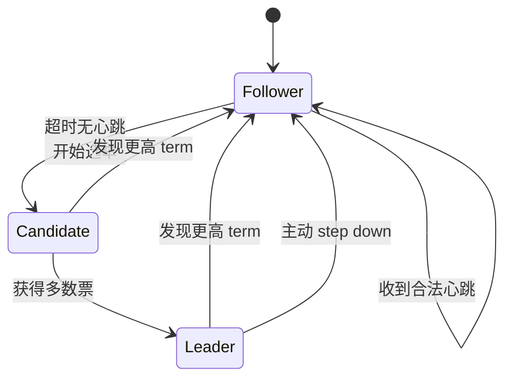
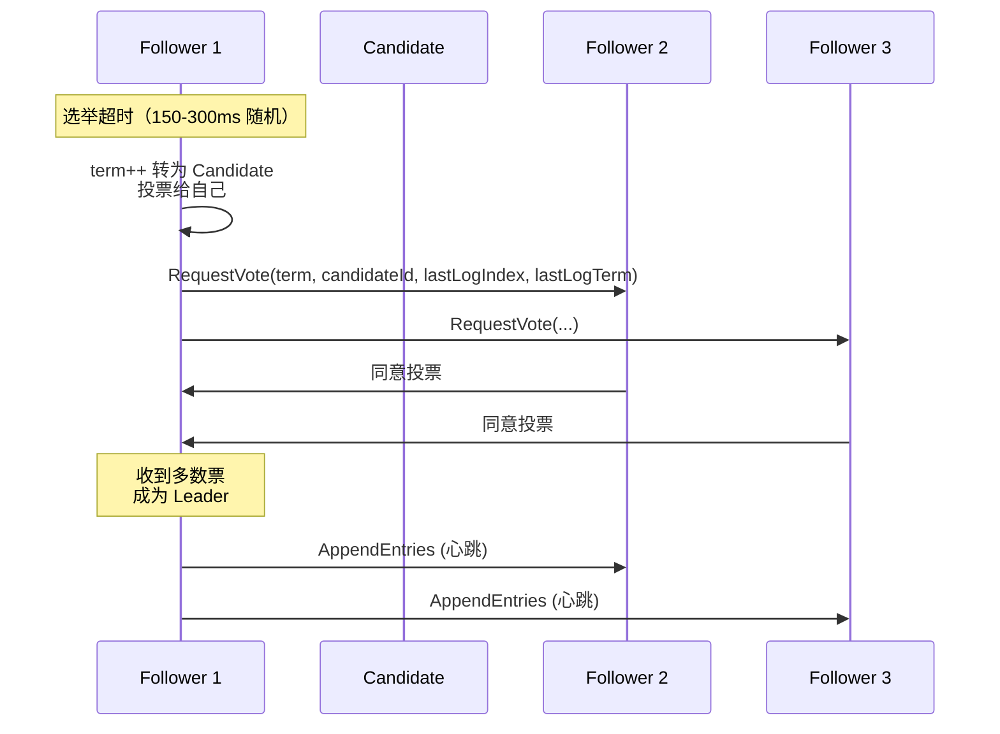
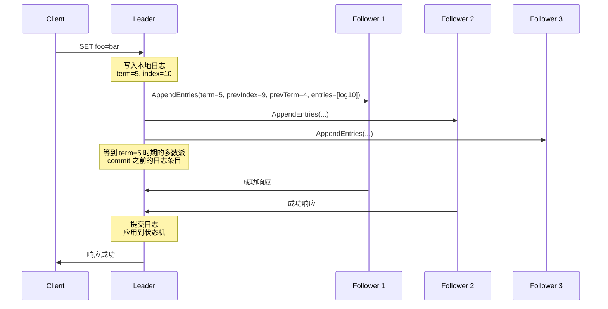
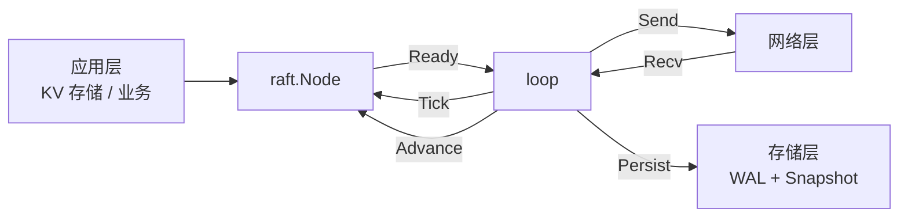
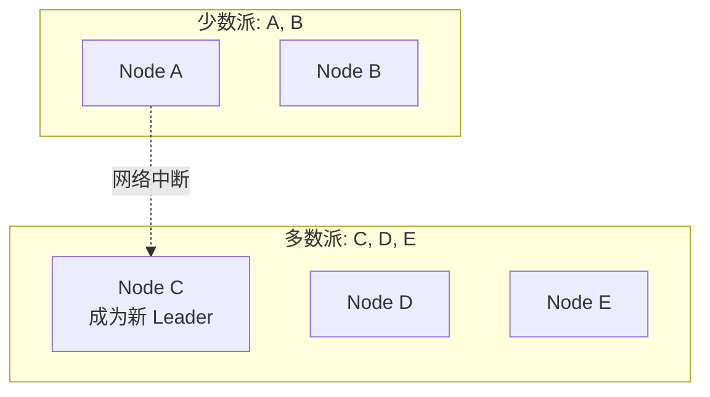
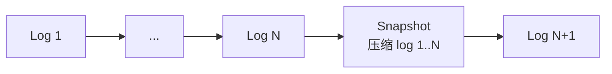
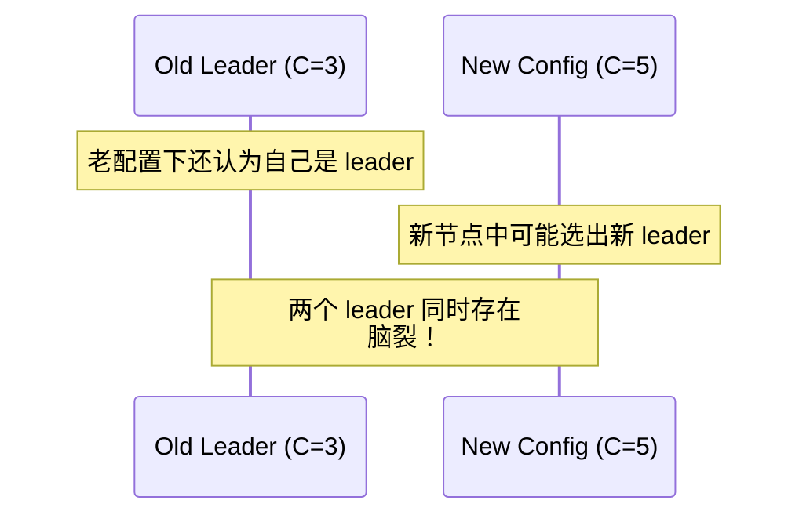
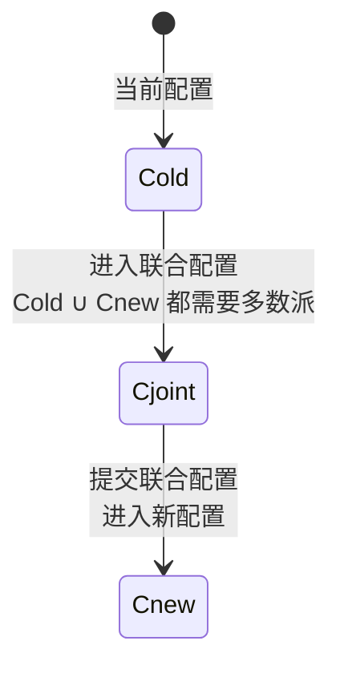
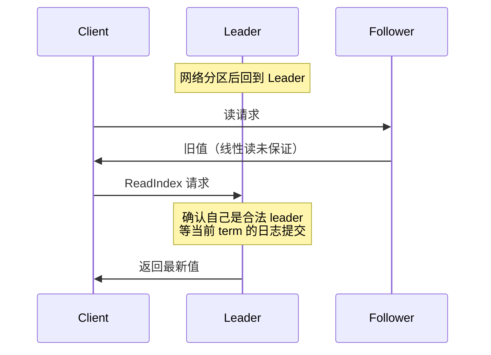

在分布式系统中，让多个节点对一组操作达成一致（Consensus）是难题。Diego Ongaro 在 2014 年的博士论文《Consensus: Bridging Theory and Practice》中提出 **Raft 算法**，专门为了可理解性而设计。相比 Paxos 的晦涩，Raft 用工程化的方式描述了 leader 选举、日志复制等机制。本文从原理到 etcd 的实现，逐步拆解 Raft。

## 为什么需要一致性协议

分布式 KV 存储（如 etcd、Consul）需要在多副本之间复制写操作：

- **单 leader 强一致性**：写必须等大多数副本确认，延迟高但强一致
- **多 leader 最终一致性**：写入本地即返回，后台异步复制，吞吐高但不保证顺序
- **无 leader**：Dynamo 风格 quorum 读写

Raft 是**单 leader 强一致性**算法的代表，目标是让 3/5 个副本的集群能容忍 1/2 个节点故障。

## Raft 三种角色



每个节点在任意时刻处于三种状态之一
- **Follower**：被动接收 leader 心跳和日志
- **Candidate**：选举中，向其他节点拉票
- **Leader**：处理所有写请求，复制日志到 follower

## Term（任期）

Raft 用 **Term（任期）** 作为逻辑时钟：


- Term 是单调递增的整数
- 每个 Term 开始时可能有一次选举
- 节点收到更高 Term 的消息会更新自己的 Term 并转为 Follower
- Term 是 Raft 安全性的关键——同一 Term 内最多一个 leader

## 选举流程



关键规则：

1. **每 Term 最多一票**：节点收到 RequestVote 后，如果 term 更新且候选者的日志至少和自己一样新，就投赞成票（同一 Term 内不重复投票）
2. **选举超时随机化**：150-300ms 随机，避免 split vote
3. **多数派 quorum**：获得 N/2+1 票即可成为 leader（5 节点需要 3 票）

## 日志复制

Leader 接收写请求后，把日志条目复制到大多数 follower：



每个日志条目包含：
- **term**：创建时的任期
- **index**：日志中的位置（全局单调递增）
- **command**：客户端请求

Leader 维护 `nextIndex[]` 和 `matchIndex[]`：
- `matchIndex[i]`：节点 i 已经复制的最大日志 index
- `nextIndex[i] = matchIndex[i] + 1`：下次发给节点 i 的起始 index

## 安全性

Raft 通过以下约束保证 **State Machine Safety**（不会有两个节点在相同的 index 应用不同的命令）：

### Election Safety

**选举约束（§5.4.1）**：投票时，候选者必须满足：
1. 候选者的最后日志 term 大于本节点的
2. 或者 term 相同但 index 不小于本节点的

这保证了当选的 leader 一定拥有所有已提交日志。

### Log Matching Property

- **同 index + 同 term 的条目相同**
- **同 index + 同 term 的两个条目 prevLogTerm 和 prevLogIndex 也相同**

由 leader 单调创建 + 一致性检查保证。

### Leader Completeness

**任期内的 leader 一定包含之前所有已提交日志**。结合选举约束可以证明：已提交日志必然存在于之后任期的所有 leader。

### State Machine Safety

**同一 index 不会有两个节点应用不同命令**。这是 election safety + log matching 的推论。

## etcd/raft 工程实现

etcd 项目开源的 [raft 库](https://github.com/etcd-io/raft) 是生产级 Raft 实现：



核心抽象是 `raft.Node`：
- `Tick()`：推进逻辑时钟
- `Step()`：接收消息（MsgApp、MsgVote 等）
- `Ready()`：返回当前需要处理的事情（持久化、发送、应用）
- `Advance()`：通知 raft 已经处理完 Ready

应用层处理循环：

```go
for {
    select {
    case <-ticker.C:
        node.Tick()  // 推进时间

    case rd := <-node.Ready():
        // 1. 持久化日志和硬状态
        storage.Save(rd.Entries, rd.HardState)
        // 2. 发送消息
        transport.Send(rd.Messages)
        // 3. 应用已提交的日志
        if len(rd.CommittedEntries) > 0 {
            kvStorage.Apply(rd.CommittedEntries)
        }
        // 4. 通知处理完成
        node.Advance()
    }
}
```

## 网络分区与脑裂



- **旧 leader 仍在少数派**：它继续尝试发送心跳，但收不到多数派确认，无法提交新日志
- **新 leader 在多数派**：能接收客户端请求、提交日志
- **恢复后**：旧 leader 收到更高 term，转为 Follower，回滚未提交的日志

Raft 通过多数派机制天然防止脑裂——同一 Term 不可能有两个 leader。

## 快照与日志压缩

日志不能无限增长，否则占用空间且回放慢。Raft 用 **Snapshot（快照）** 压缩：



- 快照捕获**当前状态机的完整状态**
- 快照之后新建的日志继续追加
- 新节点加入或日志被截断后可以接收快照快速同步

etcd 的快照默认 100,000 条日志触发一次（可配置）。

## 成员变更

Raft 集群成员变化是难题——直接重启所有节点会导致**双 leader**：



etcd raft 使用 **Joint Consensus**（联合共识）：



两阶段切换：
1. 提交 `Cold ∪ Cnew` 的 joint configuration
2. 提交 `Cnew` 单独的配置

每一步都要求 **Cold 和 Cnew 都分别满足多数派**——任何时候都不会出现双 leader。

## Linearizable Read

Raft 默认只保证**已提交日志**的写入，但读可能读到陈旧数据：



etcd 的解决方案：

1. **ReadIndex**：leader 确认自己仍是合法 leader（通过一次心跳），等待当前 term 的日志提交后返回
2. **Lease Read**：leader 维护一个租约（比选举超时短），租约内默认仍是 leader

## 实战建议

1. **奇数节点**：3/5/7 节点是常见选择，更多节点写入性能下降
2. **网络分区容忍**：至少能容忍 `(N-1)/2` 个节点故障
3. **快照机制**：定期触发防止日志无限增长
4. **监控关键指标**：Raft Term、commitIndex、applyIndex、leader 切换次数
5. **客户端重试**：分区恢复后客户端可能需要重新提交请求

## 参考资料

- Diego Ongaro《Consensus: Bridging Theory and Practice》[PhD Thesis, Stanford 2014]
- 论文：[In Search of an Understandable Consensus Algorithm](https://raft.github.io/raft.pdf)
- etcd-io/raft 源码：`raft.go`、`log.go`、`storage.go`
- etcd 官方文档：[etcd raft library documentation](https://pkg.go.dev/go.etcd.io/raft)
- 一致性算法可视化：[The Secret Lives of Data](http://thesecretlivesofdata.com/raft/)