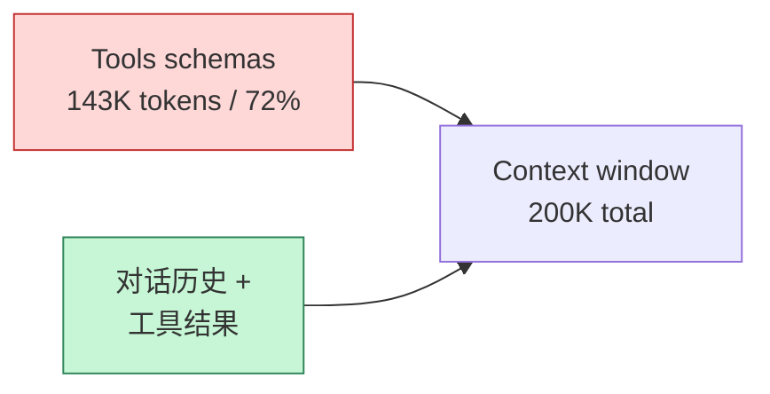

> Function calling 是 LLM 接进真实业务的关键能力。2024 年 OpenAI 推出 **Structured Outputs** 后，工具调用从"靠模型自觉"升级到"100% schema 约束"。但很多团队的接入代码还在用 2022 年的"function_call 字段"——不只是过时，还会引入隐性 bug。

把 LLM 接进生产环境的工程师，几乎都会踩过这几个坑：

- 模型返回的 JSON 缺字段，前端拿到 `undefined.xxx` 直接崩
- 工具描述写得太抽象，模型总是选错工具
- 一个长链路任务串行调用5个工具，用户等了 30 秒
- 工具调用 5% 概率因为网络抖动失败，整个请求雪崩

这篇文章不讲什么是 function calling（这个网上太多了），直接讲**实战中怎么写才稳**——从 2024-2025 年最新的 Structured Outputs 标准，到并行调用、错误处理、Schema 设计。

<!--more-->

## 一、先对齐概念：tool use、function calling、Structured Outputs

业内三家主要厂商的命名不一样：

| 厂商 | 术语 | API 入口 |
|------|------|---------|
| OpenAI | Function Calling / Tools | `tools` 参数 |
| Anthropic | Tool Use | `tools` 参数 |
| Google | Function Calling | `tools` 参数 |

底层逻辑一致：**给模型一个 JSON Schema，模型决定是否调用、按 Schema 生成参数**。但**保证 Schema 严格遵守**这件事，2024 年才真正做好。

### 1.1 OpenAI 的演进：JSON Mode → Structured Outputs

OpenAI 在 2023 年推出过 **JSON mode**（`response_format={"type": "json_object"}`），但这只是保证模型输出合法 JSON，**不保证结构**。模型可以返回 `{"namee": "alice"}`（字段名拼错），你还得自己解析校验。

2024 年 8 月，OpenAI 推出 **Structured Outputs**，分两种：

```python
from pydantic import BaseModel
from openai import OpenAI

class CalendarEvent(BaseModel):
    name: str
    date: str
    participants: list[str]

# 严格模式：100% schema 符合
response = client.responses.parse(
    model="gpt-4o-2024-08-06",
    input="Alice 和 Bob 周五要去科技展。",
    text_format=CalendarEvent,
)
event = response.output_parsed  # 一定是 CalendarEvent 类型
```

**Strict mode 的核心是 constrained decoding**：模型在生成每个 token 时，解码器只允许选择**符合 Schema 的 token**。从根上保证 100% schema 符合——不是"大部分时候符合"，是**每一个字段、每一层嵌套都符合**。

### 1.2 严格模式的限制

不是所有字段都支持：

| 支持 | 不支持 |
|------|--------|
| string、number、boolean | 字符串长度 `minLength`/`maxLength` |
| object、array | 数值范围 `minimum`/`maximum` |
| enum、anyOf、$ref、null | 正则表达式 `pattern` |
| `additionalProperties: false`（自动开启） | 自定义 `format`（如 email、uuid） |

需要字段长度限制时，要么在应用层校验，要么改用非严格模式。

## 二、JSON Schema 设计的 5 条铁律

Schema 写得烂，模型调工具就跟着烂。这 5 条是从生产事故里总结的。

### 2.1 每个字段必须有 description

模型看不到变量名，只能看到 description 里你写的字。

```json
// ❌ 烂：模型瞎猜
{
  "name": "search_orders",
  "parameters": {
    "properties": {
      "q": {"type": "string"}
    }
  }
}

// ✅ 好：description 明确
{
  "name": "search_orders",
  "description": "搜索订单。支持按订单号、客户姓名、下单时间筛选。返回最近的 20 条。",
  "parameters": {
    "properties": {
      "q": {
        "type": "string",
        "description": "搜索关键词，可以是订单号（ORD-XXXX 格式）、客户姓名或手机号后四位"
      },
      "status": {
        "type": "string",
        "enum": ["pending", "paid", "shipped", "completed"],
        "description": "订单状态过滤。'pending'=待付款, 'paid'=已付款, 'shipped'=已发货, 'completed'=已完成"
      }
    },
    "required": ["q"]
  }
}
```

**实战数据**：description 写得清晰，工具选择准确率能提升 20-30%。我见过一个客服 AI，工具描述只写"查询订单"四个字，模型在 40% 的情况下会选错工具（"查询订单" vs "查询客户" vs "查询商品"）。

### 2.2 enum 比 string 更安全

凡是取值集合确定的字段，**一定用 enum 而不是 string**：

```json
// ❌ string：模型可能返回 "Pending" / "PENDING" / "pending" / "待付款"
"status": {"type": "string"}

// ✅ enum：模型只能从给定值里选
"status": {"type": "string", "enum": ["pending", "paid", "shipped", "completed"]}
```

enum 让模型无法"创造"取值，你的下游代码不用做字符串归一化。

### 2.3 严格模式下 optional 字段也要 required + nullable

OpenAI strict mode 不允许字段缺失。如果字段是可选的，**必须出现在 `required` 里，但 type 加上 `null`**：

```json
{
  "properties": {
    "phone": {
      "type": ["string", "null"],
      "description": "客户手机号，没有就传 null"
    }
  },
  "required": ["phone"]
}
```

不是：

```json
{
  "properties": {
    "phone": {"type": "string", "description": "可选"}
  },
  // 严格模式下漏掉 required 会报错
}
```

### 2.4 嵌套对象不要超过 3 层

Schema 嵌套越深，模型生成的准确率越低。3 层以上建议拍平：

```json
// ❌ 4 层嵌套：模型经常填错
{
  "user": {
    "profile": {
      "address": {
        "city": {"type": "string"}
      }
    }
  }
}

// ✅ 拍平
{
  "user_name": {"type": "string"},
  "user_city": {"type": "string"},
  "user_country": {"type": "string"}
}
```

### 2.5 工具数量控制在 20 以内

OpenAI 官方建议每个请求的工具数 **< 20**。但更现实的瓶颈是 **context 占用**：每个工具的 JSON Schema 都会占用 token。

实测数据：3 个 MCP 服务（每个 5-10 个工具）总共 143K tokens，**占满 200K context window 的 72%**——留给对话和工具结果的只剩 57K。



超过 20 个工具怎么办？用 **Anthropic 提出的 tool search** 模式（2025 年）——**不要把所有工具塞进 prompt，让模型按需检索**：

```python
# Anthropic tool search tool (2025)
tools = [
    {
        "name": "search_tools",
        "description": "当你不确定该用哪个工具时，先调用这个搜索工具"
    },
    {
        "name": "tool_search_result_2025",
        # 模型调用 search_tools 后返回的工具描述
    }
]
```

在 Opus 4 上的实测：**49% → 74% 的工具选择准确率提升**，同时大幅减少 context 占用。

## 三、并行调用：60-80% 的延迟收益

很多团队的 AI Agent 工具调用是串行的：

```
用户问"对比 A 和 B 两个产品"
  → 调 get_product(A)        [800ms]
  → 调 get_product(B)        [800ms]
  → 调 compare(A, B)         [500ms]
总耗时 2.1 秒
```

但 `get_product(A)` 和 `get_product(B)` **没有任何依赖**，完全可以并行：

```
用户问"对比 A 和 B"
  → 并行调 get_product(A) + get_product(B)  [800ms]
  → 调 compare(A, B)                          [500ms]
总耗时 1.3 秒（节省 38%）
```

OpenAI、Anthropic、Gemini 在 2024-2025 年都原生支持**单次响应里返回多个 tool_use 块**：

```python
# OpenAI
response = client.chat.completions.create(
    model="gpt-4o",
    messages=[...],
    tools=[get_product_tool, compare_tool]
)

# response.choices[0].message.tool_calls 可能是多个
for tool_call in response.choices[0].message.tool_calls:
    if tool_call.function.name == "get_product":
        product_id = json.loads(tool_call.function.arguments)["product_id"]
        # 并行执行
        ...
```

### 3.1 并行调用的两个关键约束

**约束 1：所有 tool_result 必须放在同一条 user 消息里**

```python
# ✅ 正确：一次返回所有结果
messages.append({
    "role": "user",
    "content": [
        {"type": "tool_result", "tool_use_id": "id_1", "content": json.dumps(result_A)},
        {"type": "tool_result", "tool_use_id": "id_2", "content": json.dumps(result_B)},
    ]
})

# ❌ 错误：分开发两次，模型会学成串行调用
messages.append({"role": "user", "content": [{"type": "tool_result", "tool_use_id": "id_1", ...}]})
# 再发一次
messages.append({"role": "user", "content": [{"type": "tool_result", "tool_use_id": "id_2", ...}]})
```

**约束 2：所有 tool_result 必须排在文本之前**

```python
# ✅ tool_result 在前，文本在后
content = [
    {"type": "tool_result", "tool_use_id": "id_1", "content": "..."},
    {"type": "tool_result", "tool_use_id": "id_2", "content": "..."},
    {"type": "text", "text": "结果如上"}
]
```

### 3.2 LLMCompiler：把并行推到极致

ICML 2024 提出的 **LLMCompiler** 把工具调用建模成 **DAG（Directed Acyclic Graph）**，独立节点并行执行，依赖节点串行。论文报告的数据：

| 指标 | 串行调用 | LLMCompiler DAG |
|------|---------|-----------------|
| 延迟 | 31.3 分钟 | 22.8 分钟（-37%） |
| 成本 | 1.0x | 0.15x（-85%） |
| 准确率 | baseline | +9% |

现在 LangGraph、CrewAI、AutoGen 都把这个模式作为一等公民支持。如果你的 Agent 任务有复杂依赖关系（"先查天气，再查航班，再查酒店"），直接用 LLMCompiler 模式。

## 四、Anthropic 的 Programmatic Tool Calling（PTC）

2025 年 Anthropic 推出的实验性功能：**让模型生成 Python 代码，在沙箱里编排工具调用**。

```python
# 模型生成的"程序"
result = []
for product_id in ["A", "B", "C"]:
    data = get_product(product_id=product_id)  # 沙箱内工具调用
    if data["price"] > 100:
        result.append(data)
return summarize(result)
```

收益：
- 模型可以在循环里反复调用工具（普通 tool_use 一次响应只能调一次）
- 减少 tool_result 在 context 里的累积次数
- Anthropic 报告：**复杂研究任务上节省 37% token**

PTC 的局限：
- 必须有沙箱执行环境
- 增加了"代码安全"的攻击面（代码注入）
- 调试更复杂

适合"对延迟和成本敏感的工具编排"场景，比如批量数据分析、多步骤研究任务。

## 五、错误处理：两类错误，两套策略

实战中最容易出错的设计，是把所有错误用同一种方式处理。**网络抖动**和**参数错误**是两类完全不同的问题。

### 5.1 网络/基础设施错误：指数退避 + 抖动

API 超时、429 限流、5xx 服务器错误——这些是**基础设施问题**，重试大概率能成功。

```python
import random
import time

def call_with_retry(fn, max_retries=5):
    for attempt in range(max_retries):
        try:
            return fn()
        except (RateLimitError, APITimeoutError, APIConnectionError) as e:
            if attempt == max_retries - 1:
                raise
            
            # 指数退避 + 抖动
            base_delay = min(2 ** attempt, 32)  # 1, 2, 4, 8, 16, 32...
            jitter = random.uniform(0, base_delay * 0.5)
            delay = base_delay + jitter
            
            print(f"Attempt {attempt+1} failed: {e}. Retry in {delay:.2f}s")
            time.sleep(delay)
```

几个关键点：

- **基础延迟 1-2 秒**，最多 5-7 次重试
- **抖动**避免雪崩（所有客户端同时重试）
- **OpenAI / Anthropic 的 SDK 已经内置了这个逻辑**，不用自己写，但要知道怎么调

```python
# OpenAI SDK 内置重试
from openai import OpenAI
client = OpenAI(
    max_retries=5,           # 最多重试 5 次
    timeout=30.0,            # 单次超时 30 秒
)
```

### 5.2 工具参数错误：返回错误让 LLM 自纠

模型填错参数（"查询不存在的订单 ID"）、工具业务逻辑报错（"余额不足"）——这些是**逻辑问题**，重试不会变好。

正确做法：**把错误返回给模型，让它自己决定怎么办**。

```python
def execute_with_error_feedback(tool_call):
    try:
        result = execute_tool(tool_call)
        return {"tool_call_id": tool_call.id, "content": json.dumps(result)}
    except ValidationError as e:
        # Schema 校验失败：告诉模型具体错在哪
        return {
            "tool_call_id": tool_call.id,
            "content": json.dumps({
                "error": "validation_failed",
                "message": str(e),
                "fix_suggestion": "请检查参数类型，必填字段是否齐全"
            }),
            "is_error": True  # Anthropic 用这个标记
        }
    except BusinessError as e:
        # 业务错误：让模型决定怎么应对
        return {
            "tool_call_id": tool_call.id,
            "content": json.dumps({
                "error": "business_rule_violation",
                "message": str(e)
            }),
            "is_error": True
        }
```

模型收到这种错误信息后，会自己判断：
- 参数填错了 → 重新生成参数再调一次
- 业务规则不允许 → 告诉用户"这个操作无法完成"
- 需要更多信息 → 反问用户

**但不要无限重试**：最多允许 3 次自动重参数，否则会陷入死循环。

### 5.3 熔断器：避免雪崩

如果某个下游服务持续报错（比如数据库挂掉），每次调用都会触发 3 次重试 + 模型自纠——这是**雪崩**。

加一层**熔断器（circuit breaker）**：

```python
class CircuitBreaker:
    def __init__(self, failure_threshold=0.5, min_calls=10, reset_timeout=60):
        self.failure_rate = 0.0
        self.call_count = 0
        self.failure_count = 0
        self.state = "closed"  # closed / open / half-open
        self.opened_at = None
        self.failure_threshold = failure_threshold
        self.min_calls = min_calls
        self.reset_timeout = reset_timeout
    
    def call(self, fn, *args):
        # 熔断状态：直接拒绝
        if self.state == "open":
            if time.time() - self.opened_at > self.reset_timeout:
                self.state = "half-open"
            else:
                raise CircuitOpenError("Circuit breaker is open")
        
        try:
            result = fn(*args)
            self.on_success()
            return result
        except Exception as e:
            self.on_failure()
            raise
    
    def on_success(self):
        self.call_count += 1
        if self.state == "half-open":
            self.state = "closed"
            self.failure_count = 0
            self.call_count = 0
    
    def on_failure(self):
        self.failure_count += 1
        self.call_count += 1
        
        if self.call_count >= self.min_calls:
            rate = self.failure_count / self.call_count
            if rate > self.failure_threshold:
                self.state = "open"
                self.opened_at = time.time()
                print(f"⚠️ Circuit breaker opened. Failure rate: {rate:.1%}")
```

典型配置：
- **最少 10-20 次调用**才评估熔断（避免冷启动误判）
- **失败率 > 50%** 触发熔断
- **60 秒后**进入半开状态试探

## 六、工具设计：让模型愿意用、选得对

工具本身的 API 设计，决定了模型的"调用体验"。

### 6.1 粒度：粗 vs 细

```python
# ❌ 粗：一个超级工具
def manage_order(action, order_id, **kwargs):
    if action == "create":
        ...
    elif action == "update":
        ...
    elif action == "cancel":
        ...

# ✅ 细：拆成三个工具
def create_order(customer_id, items, ...): ...
def update_order(order_id, changes, ...): ...
def cancel_order(order_id, reason, ...): ...
```

粗工具让模型面对多分支 `action` 字段，schema 复杂、易错；细工具每个目标明确，模型选择准确率高。

### 6.2 返回值：返回结构化数据，不要返回字符串

```python
# ❌ 返回自然语言描述
def get_order(order_id):
    return f"订单 ORD-123 状态为已发货，预计 3 天后送达"

# ✅ 返回结构化 JSON，让模型自己组织语言
def get_order(order_id):
    return {
        "order_id": "ORD-123",
        "status": "shipped",
        "estimated_arrival": "2024-12-04",
        "carrier": "顺丰"
    }
```

这样模型既能"读"也能"算"——比如用户问"今天有几个未发货订单"，可以直接 JSON 聚合而不是依赖字符串解析。

### 6.3 大结果：截断 + 摘要

工具返回的结果如果太大（比如搜索返回 100 条），直接塞进 context 会撑爆。

```python
def search_articles(query, limit=10):
    results = db.search(query, limit=limit)
    
    # 截断每个结果
    truncated = [
        {**r, "content": r["content"][:500] + "..." if len(r["content"]) > 500 else r["content"]}
        for r in results
    ]
    
    return {
        "count": len(results),
        "results": truncated,
        "next_page_token": "..." if len(results) == limit else None
    }
```

或者用 LLM 先做一轮摘要，模型只看到摘要和"如需详情请调用 get_article(id)"。

## 七、调试与监控：让问题可见

Function calling 链路长（用户输入 → 工具选择 → 参数生成 → 工具执行 → 结果处理），任何一环出错都难定位。必须打点。

### 7.1 关键日志

```python
import structlog

logger = structlog.get_logger()

def log_tool_call(tool_name, args, result, duration_ms, error=None):
    logger.info(
        "tool_call",
        tool=tool_name,
        args_preview=str(args)[:200],
        result_size=len(str(result)),
        duration_ms=duration_ms,
        error=str(error) if error else None,
        timestamp=datetime.utcnow().isoformat()
    )
```

每条日志至少包含：
- 工具名、参数预览（避免日志爆掉）
- 执行耗时
- 错误信息（如果有）
- 用户/会话 ID（关联回溯）

### 7.2 关键指标

```python
metrics = {
    "tool_call_count": 0,            # 总调用次数
    "tool_call_errors": 0,           # 失败次数（分网络 vs 参数错误）
    "tool_retry_count": 0,           # 模型自纠重试次数
    "tool_choice_distribution": {},  # 工具选择分布（看有没有冷门工具）
    "avg_tool_duration_ms": 0,       # 平均耗时
}
```

**异常信号**：
- 工具选择分布变化（比如 `search_orders` 调用量突然飙升）→ 模型可能在循环里
- 自纠重试次数 > 3 → schema 写错了
- 工具耗时 p99 飙升 → 下游服务问题

## 八、上线 checklist

最后给一份上线前的 checklist：

- [ ] **Schema 用 Pydantic / Zod 定义**，自动生成 description，避免手写出错
- [ ] **所有 string 字段凡有枚举值都改 enum**
- [ ] **严格模式下所有字段都 required**，可选用 `nullable`
- [ ] **工具数 < 20**，超过用 tool search
- [ ] **独立工具调用无依赖时用并行**，DAG 复杂依赖用 LLMCompiler
- [ ] **网络错误指数退避 + 抖动**，最多 5-7 次
- [ ] **参数错误返回给模型自纠**，最多 3 次
- [ ] **下游持续故障有熔断器**
- [ ] **每个工具有结构化返回值**，而不是字符串
- [ ] **大结果截断或摘要**，避免撑爆 context
- [ ] **所有工具调用有日志和指标**
- [ ] **红队测试**：构造 50+ 边界用例（参数错位、超长字符串、特殊字符）

## 九、一点体会

Function calling 看着是"调 API"，实际是**设计一个 LLM 与外部世界的协议**。Schema 是这个协议的接口定义——写得不好，所有上层应用都要跟着擦屁股。

2024 年之前大家还在靠模型自觉 + 正则兜底；2024 年 OpenAI Structured Outputs + Anthropic Programmatic Tool Calling 出来后，**约束解码**和**代码编排**成了新工具——但工具不会自动用对地方，工程师的设计能力才是瓶颈。

把 Schema 当作代码 review 一样严肃对待，是 2025 年 AI 工程化的分水岭。

---

**参考资料：**
- [OpenAI Structured Outputs 文档](https://platform.openai.com/docs/guides/structured-outputs)
- [OpenAI Cookbook - Structured Outputs](https://cookbook.openai.com/examples/structured_outputs_intro)
- [Anthropic Tool Use Overview](https://docs.claude.com/en/docs/agents-and-tools/tool-use/overview.md)
- [Anthropic: Programmatic Tool Calling](https://docs.claude.com/en/docs/agents-and-tools/tool-use/overview.md)
- [TianPan.co: Tool Use in Production - Function Calling Patterns That Actually Work](https://tianpan.co/blog/2025-10-12-tool-use-function-calling-patterns)
- [Zylos: Parallel Tool Calling Optimization Survey](https://zylos.ai/research/2026-04-23-parallel-tool-calling-optimization-ai-agents)
- [Together AI: Function Calling Patterns](https://docs.together.ai/docs/function-calling)
- [Composio: Mastering Claude Tool Use](https://composio.dev/blog/mastering-claude-tool-use-best-practices-and-common-pitfalls)
- [Zep: Implementing Effective Error Handling and Retries in AI Tool Calls](https://www.getzep.com/blog/implementing-effective-error-handling-and-retries-in-ai-tool-calls)
- [LLMCompiler (ICML 2024)](https://thread-transfer.com/blog/2025-07-08-tool-use-best-practices/)