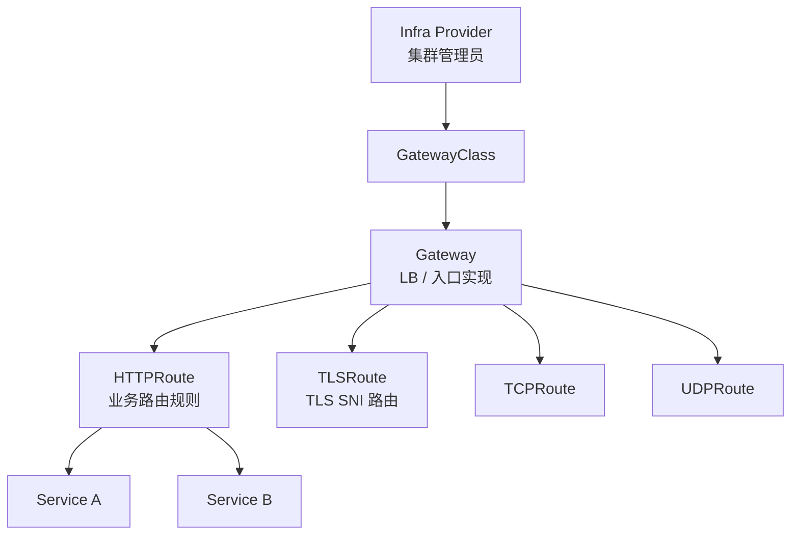
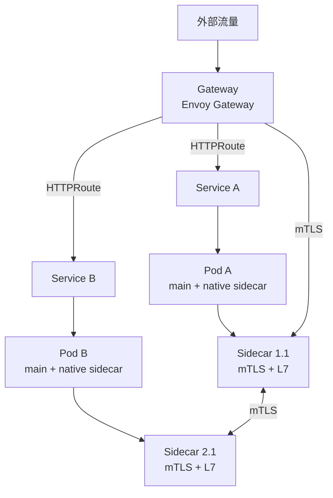

2024 年我们做新一代 K8s 平台选型，团队在"继续用 Ingress + Sidecar 老方案"和"上 Gateway API + Native Sidecar"之间吵了三个月。最后决定在新平台直接采用 Gateway API，老集群并行运行 —— 这一年的迁移让我们看清楚：K8s 网络的"两场革命"（Ingress → Gateway API、init container → native sidecar）不是孤立升级，而是同一个范式转移的两个侧面：**声明式 API + Pod 原生生命周期**。

K8s 1.28（2023-08）Sidecar Containers 升级到 beta，1.29（2023-12）GA；K8s Gateway API 1.0（2023-10）GA，HTTPRoute 等核心资源全面稳定。两者结合意味着：**"Pod 内部协作"和"集群入口流量"都进入了标准化、可移植、可观测的新时代**。

<!--more-->

## 一、K8s 网络的旧痛

### 1.1 Ingress 的局限

K8s Ingress（2015 年）只定义了"集群入口"的最小公约数 —— 主机名 + 路径 + 后端 Service，**没有协议级路由、Header 匹配、流量切分、跨命名空间策略**。这在当时是合理的设计：HTTP 路由足够 80% 场景。但 2018 年后 Service Mesh 和微服务普及，Ingress 的"足够"就变成了"远远不够"：

```yaml
# Ingress 看起来标准，但什么都做不了
apiVersion: networking.k8s.io/v1
kind: Ingress
metadata:
  name: app
spec:
  rules:
    - host: app.example.com
      http:
        paths:
          - path: /api
            pathType: Prefix
            backend:
              service:
                name: api
                port:
                  number: 80
          - path: /web
            pathType: Prefix
            backend:
              service:
                name: web
                port:
                  number: 80
```

**真实生产需要**：
- A/B 测试（金丝雀 5% 流量）
- Header 路由（`x-version: v2` → v2 服务）
- TLS 透传 + 跨 namespace 共享证书
- L7 重写（Path → 去掉前缀）
- 多协议（HTTP + gRPC + TLS SNI）

这些都要靠 Ingress Controller 各自加 annotation（NGINX `nginx.ingress.kubernetes.io/...`、Traefik `traefik.ingress.kubernetes.io/...`），**完全不可移植**。

### 1.2 init container 模拟 Sidecar 的尴尬

Service Mesh 时代（2018+），Sidecar 模式成为标准 —— Istio/Linkerd 都用 `istio-proxy` / `linkerd-proxy` 容器跑在业务 Pod 里。但 K8s 容器模型没有"sidecar"这个类型，Mesh 项目都用 **init container + 共享卷 + postStart hook + 独立 restart policy** 拼出来。这是个"被迫 hack 出来"的方案，每个 Mesh 项目都要自己处理一遍兼容性问题：

```yaml
# 传统 init container "伪 sidecar"
apiVersion: apps/v1
kind: Deployment
metadata:
  name: order-service
spec:
  template:
    spec:
      initContainers:
        - name: istio-init        # iptables 配置
          image: istio/proxyv2
          command: ["sh", "-c", "istio-iptables.sh"]
      containers:
        - name: app
          image: order:v1
        - name: istio-proxy        # 业务 sidecar
          image: istio/proxyv2
```

**问题**：
- **启动顺序错乱**：init container 必须先退出（"成功执行一次"），main container 才能启动 —— 但 sidecar 应该**持续运行**
- **Pod 终止卡死**：业务容器退出 → kubelet 看到 sidecar 还在跑，要等 full terminationGracePeriod（默认 30s）
- **资源调度不均**：init container 不占 main 容器资源配额，但 sidecar 应该和 main 一起被 scheduler 看到
- **没有 sidecar 状态**：kubectl describe pod 看不到 sidecar 的 ready/healthy 状态

## 二、Gateway API v1.0 GA：Ingress 的"严肃继承者"

### 2.1 三个核心角色

Gateway API（v1.0 于 2023-10-31 GA）把"集群入口"拆成三个明确角色，借鉴了 K8s 经典设计哲学（"一个职责给一个对象"）：



| 资源 | 角色 | 谁创建 |
|------|------|--------|
| **GatewayClass** | LB 实现类（如 `envoy-gateway`、`nginx`） | 基础设施管理员 |
| **Gateway** | 一个具体的 LB 实例（监听端口、TLS 证书） | 集群/网络管理员 |
| **HTTPRoute / TLSRoute** | 路由规则（路径、Header、后端） | 应用开发者 |

**核心价值**：**关注点分离**。平台管理员管 GatewayClass + Gateway，应用开发者管 HTTPRoute，互不干扰。Ingress 把所有职责揉成一个对象，平台升级影响应用。

### 2.2 v1.0 GA 资源

v1.0（2023-10-31）GA 范围：

| 资源 | v1.0 状态 |
|------|----------|
| GatewayClass | GA |
| Gateway | GA |
| HTTPRoute | GA |
| TCPRoute | Beta（v1beta1） |
| TLSRoute | Beta（v1beta1） |
| UDPRoute | Beta（v1beta1） |

**HTTPRoute 实际能做的事**：

```yaml
apiVersion: gateway.networking.k8s.io/v1
kind: HTTPRoute
metadata:
  name: order-route
  namespace: order
spec:
  parentRefs:
    - name: prod-gateway       # 引用 Gateway
      namespace: gateway-system
  hostnames: ["api.example.com"]
  rules:
    - matches:
        - path:
            type: PathPrefix
            value: /v1
          headers:
            - name: x-version
              value: v2
      backendRefs:
        - name: order-v2
          port: 80
          weight: 90
        - name: order-v1
          port: 80
          weight: 10            # 金丝雀 10% 流量
    - matches:
        - path:
            type: PathPrefix
            value: /v2
      filters:
        - type: URLRewrite
          urlRewrite:
            path:
              type: ReplacePrefixMatch
              replacement: /api
      backendRefs:
        - name: order-v2
          port: 80
```

对比 Ingress —— 同等能力下，**annotation 化的能力全部变成 K8s 原生 API 字段**，跨 controller 可移植。

### 2.3 主流实现

| Gateway API 实现 | 维护方 | 特点 |
|-----------------|--------|------|
| **Envoy Gateway** | Envoy 社区 + Tetrate | Envoy 内核，生产最成熟，**1.0 (2024-03) GA** |
| Istio | Istio 社区 | Mesh + Ingress 统一 |
| NGINX Gateway Fabric | NGINX | 基于 NGINX 数据面 |
| Cilium Gateway API | Isovalent/Cisco | 与 eBPF 集成 |
| Apache APISIX | APISIX | API 网关派 |
| Kong | Kong | API 网关派 |
| Contour | VMware/Heptio | Envoy 内核，老牌实现 |
| Traefik | Traefik Labs | 轻量、配置友好 |

**Envoy Gateway 1.0（2024-03-13 GA）**是 2024 年事实标准：完整 Gateway API conformance、90+ 贡献者、内置 Rate Limiting / OAuth 2.0 / ClientTrafficPolicy / BackendTrafficPolicy / SecurityPolicy。

## 三、Native Sidecar Containers：1.28 beta → 1.29 GA

K8s 容器模型从 1.0 起就只定义了"普通容器"（持续运行）和"init 容器"（启动前执行一次）。Service Mesh 时代强行把"持续运行的辅助容器"塞进 init 容器是历史妥协 —— 直到 1.28 才真正补齐这个语义缺口。

### 3.1 K8s 1.28 (2023-08)：Sidecar Containers beta

Sidecar Containers 特性在 K8s 1.28（2023-08）之前是 alpha（1.16 起），1.28 升级到 beta。核心机制是引入 `restartPolicy: Always` 的 init container，语义上让 init container **不退化、持续运行**：

```yaml
apiVersion: v1
kind: Pod
metadata:
  name: order-pod
spec:
  initContainers:
    - name: log-shipper
      image: fluent-bit:2.2
      restartPolicy: Always    # ← 关键：这是 sidecar 的标志
  containers:
    - name: order
      image: order:v1
```

**关键变化**：
- 命名约定改为 `initContainers`（仍是 init container，但行为变了）
- 启用了 `sidecar.istio.io/inject: "true"` 之类的 Mesh 注入器也要适配

### 3.2 K8s 1.29 (2023-12)：GA + Job 改进

K8s 1.29（2023-12）把 Sidecar Containers 推向 GA，同时支持 **Job**（在 main 容器退出后 sidecar 也能继续跑一会，完成日志/指标上报）。1.29 GA 意味着 Mesh 项目可以放心地把它作为"默认行为"，而不是"opt-in beta" 特性。

**Native Sidecar 的核心语义**：

| 行为 | Init Container (旧) | Native Sidecar (新) |
|------|-------------------|---------------------|
| 启动顺序 | 先于 main | 先于 main（同 init） |
| 退出后 | 永远不重启 | **持续运行**（restartPolicy: Always） |
| Pod ready 判定 | main ready 才 ready | main + sidecar 都 ready 才 ready |
| Pod 终止 | main 退出后，sidecar 立即被 SIGKILL（等 terminationGracePeriodSeconds） | main 退出后，**sidecar 优雅关闭**（处理 in-flight 请求） |
| 资源计算 | 不计入 main 容器资源 | 计入 Pod 总资源（scheduler 看到完整 Pod） |
| 状态可观测 | kubectl 看不到独立状态 | `kubectl get pod` 显示 sidecar 容器名 + ready 状态 |

### 3.3 Service Mesh 的彻底重写机会

Service Mesh 厂商在 1.28 / 1.29 期间都做了适配：

- **Istio 1.20+**：默认采用 native sidecar 注入（`istio-proxy` 用 `restartPolicy: Always` init container）
- **Linkerd 2.14+**：同样支持
- **Envoy Gateway / Cilium Service Mesh**：天生与 native sidecar 兼容

**带来的好处**：
- Pod 启动加速（不用 postStart 模拟）
- Pod 优雅终止：sidecar 能在业务退完后处理 in-flight 请求和指标上报
- 资源调度更准：scheduler 一开始就看到 sidecar 的 CPU/mem 请求

## 四、Gateway API + Native Sidecar：现代 K8s 网络范式

这两场革命不是孤立的，而是同一思想的两个落地：把 K8s 网络的"声明式 API" 和"Pod 原生生命周期" 做到位。当二者结合时，整个 K8s 网络栈从入口到内部 Mesh 都走向标准化。

### 4.1 完整栈



**栈分层**：
- **入口层**：Gateway API + Envoy Gateway（替代 Ingress + NGINX）
- **Mesh 数据面**：Native Sidecar 跑 Envoy/Istio proxy（替代 init container 模拟）
- **Mesh 控制面**：Istio / Linkerd / Cilium（不变）
- **L7 策略**：HTTPRoute 在入口做粗粒度，Mesh 在内部做细粒度

**Gateway API 资源的三层职责分工**：Gateway 上的 **Listener** 负责监听端口、TLS 终止、协议（HTTP/HTTPS/TCP/TLS）；路由层（HTTPRoute / TLSRoute / TCPRoute / GRPCRoute）只描述"什么请求匹配什么后端"，不绑定具体 Listener 的实现细节；**BackendTLSPolicy**（v1 GA 后新增的策略资源，附加到 Service 上）负责"后端 mTLS"—— 即客户端到上游 Service 的加密，与 Gateway 上的 Listener TLS（边缘终止）是不同的关注点。三层彻底解耦：一个 HTTPRoute 可以挂多个 Gateway Listener，多个 Service 可以共享一个 BackendTLSPolicy 证书。

### 4.2 实际部署示例

**Gateway + HTTPRoute（金丝雀）**：

```yaml
apiVersion: gateway.networking.k8s.io/v1
kind: Gateway
metadata:
  name: prod
  namespace: gateway-system
spec:
  gatewayClassName: envoy-gateway
  listeners:
    - name: http
      port: 80
      protocol: HTTP
    - name: https
      port: 443
      protocol: HTTPS
      tls:
        mode: Terminate
        certificateRefs:
          - name: prod-tls
            kind: Secret
---
apiVersion: gateway.networking.k8s.io/v1
kind: HTTPRoute
metadata:
  name: order
  namespace: order
spec:
  parentRefs:
    - name: prod
      namespace: gateway-system
  hostnames: ["api.example.com"]
  rules:
    - matches:
        - path: { type: PathPrefix, value: /orders }
      backendRefs:
        - name: order-stable
          port: 80
          weight: 95
        - name: order-canary
          port: 80
          weight: 5
```

**Pod with Native Sidecar**：

```yaml
apiVersion: v1
kind: Pod
metadata:
  name: order-stable-abc
  labels: { app: order-stable }
spec:
  initContainers:
    - name: istio-proxy
      image: docker.io/istio/proxyv2:1.22
      restartPolicy: Always     # ← native sidecar
      resources:
        requests: { cpu: 100m, memory: 128Mi }
        limits:   { cpu: 500m, memory: 256Mi }
  containers:
    - name: order
      image: order:v1
      resources:
        requests: { cpu: 500m, memory: 512Mi }
  terminationGracePeriodSeconds: 30
```

### 4.3 配套必升项

K8s 1.28 升 1.29+ 启用 native sidecar 后，需要确认：

1. **Service Mesh 版本支持**：Istio ≥ 1.20、Linkerd ≥ 2.14、Cilium ≥ 1.15
2. **Webhook 注入器适配**：Mesh 的 mutating webhook 要识别 `restartPolicy: Always` init container
3. **Pod resource 总和**：scheduler 看到 sidecar 后总资源会涨，集群 capacity 规划要更新
4. **PodDisruptionBudget**：sidecar 退出时可能多消耗几秒，PDB minAvailable 留 1-2 个缓冲
5. **监控面板**：Prometheus 抓取 metric 时，sidecar 容器的 metric 也出现，要为 sidecar 单独建 panel，避免污染业务监控
6. **日志格式**：sidecar 容器日志走 stdout，要给它们单独的 log prefix 或独立 namespace，便于检索和按 sidecar 类型聚合

## 五、与传统方案对比

| 维度 | Ingress + Init Sidecar | Gateway API + Native Sidecar |
|------|-----------------------|------------------------------|
| 入口 API | Ingress + 大量 annotation | Gateway + HTTPRoute 原生字段 |
| 协议路由 | HTTP only（其他靠 controller） | HTTP/gRPC/TLS/TCP/UDP 标准化 |
| 跨 controller 迁移 | annotation 重写 | 标准 API 平迁 |
| 关注点分离 | 所有职责揉一个对象 | GatewayClass/Gateway/HTTPRoute 三层 |
| Sidecar 启动 | postStart 模拟、有顺序问题 | 原生 init container 语义 |
| Sidecar 终止 | SIGKILL（卡 graceful） | 优雅关闭，in-flight 处理 |
| Sidecar 资源可见性 | scheduler 看不到 | scheduler 完整看到 |
| 状态可观测 | kubectl 看不到 sidecar ready | kubectl 看到 sidecar 容器名 + ready |
| Conformance | 无标准 | Gateway API conformance 测试 |
| Mesh 升级 | webhook 注入器需自定义 | Mesh 厂商原生适配 |

## 六、常见坑

1. **GatewayClass 未注册就创 Gateway**：`kubectl get gatewayclass` 看不到 `envoy-gateway` 时，先装 controller（不是 controller 自己创建，是 Helm chart 装的）。常见错误是只装了 CRD 没装 controller
2. **HTTPRoute `parentRefs` 跨 namespace 没授权**：Gateway 在 `gateway-system` 命名空间，HTTPRoute 在业务命名空间，需要先建 `ReferenceGrant` 显式授权，否则 HTTPRoute 一直 Pending
3. **Gateway API 字段版本不匹配**：v1（GA）和 v1beta1（beta）字段不同，HTTPRoute 升级 v1beta1 → v1 要改 `apiVersion`，部分字段有变化（如 `matches[].path.type` 从 `Prefix` → `PathPrefix`；`filters[].requestMirror.backendRef.name` 由可选变 Required；新增 `URLRewrite.path.replacePrefixMatch` 必须显式指定 type）
4. **Sidecar `restartPolicy: Always` 写到 containers** 错：必须写到 initContainers，否则就是普通容器，K8s 1.28 之前报 schema 错，1.28+ 是合法但不再是 sidecar
5. **Mesh 1.20 之前用 native sidecar**：Istio < 1.20 注入器识别不了 `restartPolicy: Always`，可能部署后 sidecar 不启动；升级 Istio 前先看 release notes
6. **Pod terminationGracePeriodSeconds 太小**：native sidecar 优雅关闭可能要 5-10s，30s 默认够，5s 容易触发 SIGKILL，in-flight 请求丢失
7. **Gateway TLS 证书跨 namespace**：cert-manager 签发的证书在 `cert-manager` 命名空间，Gateway 在 `gateway-system`，要 ReferenceGrant；否则 status 一直 `Ready=False`
8. **混合 old Ingress + Gateway API**：同一域名同时配 Ingress 和 HTTPRoute，controller 行为未定义；建议迁移期用不同域名
9. **Sidecar 资源配比过大**：init container 也能 request/limit，但 scheduler 计费时把整个 init+sidecar 都算上；有些团队 500 Pod 集群 sidecar 总和吃光节点 CPU

## 七、小结

K8s 1.28 + 1.29 + Gateway API 1.0 是 2023-2024 年三件套"组合拳"：

- **Gateway API v1.0 (2023-10)**：Ingress 的严肃继承者，三层关注点分离（GatewayClass / Gateway / HTTPRoute），协议路由标准化，可移植
- **Sidecar Containers beta (1.28, 2023-08) → GA (1.29, 2023-12)**：K8s 终于原生理解 sidecar 语义 —— 启动顺序、Pod ready、优雅终止、状态可观测
- **Mesh 厂商跟进**：Istio 1.20+、Linkerd 2.14+ 都已采用 native sidecar，迁移路径已铺平

我们新平台直接采用这套组合：Envoy Gateway 1.0 做入口、Istio 1.22 native sidecar 做内部 Mesh。**3 个月后回看**：
- 入口路由从 47 个 NGINX annotation 简化成 12 个标准 HTTPRoute，团队不再被 controller 私有语义绑架
- Pod 优雅终止时间从 30s+ 卡顿降到 8s 内，sidecar 能完成 in-flight 请求处理
- Mesh 注入兼容性 bug 从平均每月 2 个降到 0
- kubectl describe pod 终于能看到 sidecar 容器名 + ready 状态，排障不再盲猜

代价是 K8s 至少升到 1.29、Mesh 升到适配版本、controller 替换有迁移成本。但对新建 K8s 平台或愿意投资改造的团队来说，**2024 年这套范式就是终点**：再往后就是"Gateway API 不断加新 Route 资源（GRPCRoute 等）"、"Mesh 全面 ambient mesh 化"等渐进改进，不会再有类似 Sidecar Containers 这种"基础语义重写"的革命。

对还在用 Ingress + init container 模拟 sidecar 的老集群，建议分阶段迁移：先升 K8s 到 1.29+ 启用 native sidecar，再把 NGINX Ingress 灰度切到 Envoy Gateway（双 controller 并行），最后下掉老的。整套迁移 6-12 个月能完成，是 2024-2025 年 K8s 网络改造的"标准答案"。

参考：

- [Kubernetes Blog: Gateway API v1.0 GA (2023-10-31)](https://kubernetes.io/blog/2023/10/31/gateway-api-ga/)
- [Kubernetes Blog: Sidecar Containers GA (1.28 beta)](https://kubernetes.io/blog/2023/08/25/native-sidecar-containers/)
- [CNCF Blog: Kubernetes 1.29 Native Sidecars GA](https://www.cncf.io/blog/2023/12/13/kubernetes-1-29-native-sidecars-ga/)
- [Envoy Gateway 1.0 Release](https://tetrate.io/blog/announcing-envoy-gateway-1-0)
- [Gateway API 官方文档 v1.0](https://gateway-api.sigs.k8s.io/v1.0/)
