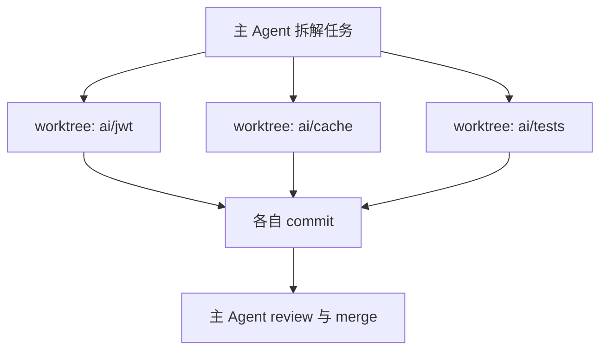

git worktree 在 2015 年随 Git 2.5 进入主线，此后十年一直是「知道的人不多、日常用的人更少」的一个 Git 功能。2025 年 10 月 Cursor 2.0 用它把 8 个 agent 隔开，2026 年 2 月 Claude Code 把它做成启动参数，才从冷门技巧变成 AI 编程的默认底座。

它能支撑多大的并行度、又会在哪一层失效，完全由「分离了什么、共享了什么」决定。

<!--more-->

## 一个仓库，多份工作区

传统做法里一个仓库只有一个工作目录。想在 feature 分支改到一半时去 main 上修个线上 bug，只能 stash → checkout → 修完 → checkout 回来 → stash pop；或者再 clone 一份，然后承担两份对象库和两份同步成本。

`git worktree add` 走的是第三条路：<strong>增加工作区，不增加仓库</strong>。

```text
~/code/acme/                    ← 主工作区（main）
├── .git/                       ← 仓库数据只在这里
│   ├── objects/                ← 所有工作区共享
│   ├── refs/                   ← 所有工作区共享
│   └── worktrees/
│       └── acme-hotfix/        ← 只属于这一个工作区
│           ├── gitdir          ← 指回 ~/code/acme-hotfix
│           ├── HEAD
│           ├── index
│           └── commondir       ← 指回 ~/code/acme/.git
└── src/

~/code/acme-hotfix/             ← 链接工作区（hotfix）
├── .git                        ← 是文件，不是目录
└── src/
```

链接工作区里的 `.git` 只有一行文本，内容是 `gitdir: /Users/you/code/acme/.git/worktrees/acme-hotfix`。子模块用的是同一套机制。运行时 `$GIT_DIR` 指向那个私有目录，`$GIT_COMMON_DIR` 指回主仓库的 `.git`；想知道某个路径归谁管，用 `git rev-parse --git-path` 查，Git 自己会决定走哪一个。

分离与共享的边界很清楚：

| 归属 | 内容 |
| --- | --- |
| 每个工作区私有 | 工作区文件、`HEAD`、`index`（暂存区）、`refs/bisect`、`refs/worktree`、该工作区的 reflog |
| 全仓库共享 | `objects/`、`refs/heads/`、`refs/tags/`、`hooks/`、`config` |

因为对象库共享，`git worktree add` 在大型 monorepo 上也是秒级完成，磁盘增量大致等于「被跟踪文件的大小 + 这个工作区自己生成的构建产物」。

代价也在同一处：它是全新的检出，而且<strong>只检出被跟踪的文件</strong>。`node_modules`、`.venv`、`.env`、本地证书都不在里面，每个工作区都要重装一遍、重放一遍本地配置。

## 一条分支只能对应一个工作区

`refs/heads/` 是共享的，一个分支名在整个仓库里只对应一个 ref 文件；而 `HEAD` 和 `index` 是每个工作区私有的。如果两个工作区同时检出 `feature/x`，两边的暂存区会各自攒出一份提交，再依次写进同一个 ref —— 后写的一方会静默丢掉前一方的工作。

Git 干脆禁止这件事：

```bash
$ git worktree add ../second-wt feature/x
fatal: 'feature/x' is already checked out at '/home/user/first-wt'
```

`git worktree list --porcelain`（Git 2.7 起提供，格式跨版本稳定）把路径、HEAD 提交、分支名按行输出，这正是各种编排工具盘点工作区时用的接口。

这条约束恰好就是 Agent 需要的东西：一个任务对应一个分支，一个分支对应一个工作区。任务边界、提交边界、diff 边界、回滚边界于是全部对齐 —— 丢掉一个任务，成本只是删掉一个目录。

## Agent 为什么会用上它

AI Coding Agent 的工作方式不是「生成一段代码」，而是读文件 → 改 → 跑测试 → 读报错 → 再改 → `git diff` → 提交，反复循环。这条闭环需要一个真实、可写、可执行的工作目录，还需要它足够干净，能让「这次测试通过」这句话可信。

多个 agent 挤在同一个目录里，会坏掉三件事：

- 变更归属丢失。`git status` 里混着几方的修改，agent 分不清哪些是自己做的，也给不出干净的 diff。
- 行为互相污染。一方跑 `gofmt`、改 `package.json`、切分支，会当场改变另一方的编译与测试结果。
- 测试结果不可信。构建产物和缓存写在同一个目录里，「通过」可能测的是别人改到一半的代码。

worktree 把这三件事一次解决，而且隔离发生在 Git 层面，不依赖工具的自律。于是 2025 到 2026 年这一批工具全部收敛到同一个形态：

- **Cursor 2.0**（2025-10-29）的多智能体界面，单个提示最多并行 8 个 agent，官方说法是 `powered by git worktrees or remote machines`。
- **Claude Code 2.1.49**（2026-02-19）加入 `--worktree` / `-w`：`claude --worktree feature-auth` 会在 `.claude/worktrees/feature-auth/` 下建工作区并新建 `worktree-feature-auth` 分支，默认从仓库的默认分支切出，而不是从你当前 HEAD。同一版本给自定义 subagent 加了 `isolation: "worktree"`，让子 agent 在临时工作区里跑，无改动时自动清理。
- 第三方编排器是同一套做法：Conductor（Melty Labs，2025 年 7 月首个版本）每个 workspace 一个 worktree，用城市名当 workspace 名；Claude Squad、Crystal、Vibe Kanban 等也都是 worktree 加分支的组合。



主 agent 只做拆解、派发和收口，子 agent 各自在自己的工作区里改代码、跑测试、提交。工作区之间唯一的交汇点是合并那一刻。

## 隔离的边界在哪

worktree 隔离的是工作区文件、`index`、`HEAD` 和分支状态。它不隔离进程、端口、包管理器的全局缓存、本机数据库和机器资源 —— 这些仍然共用同一台机器、同一套环境。

两个 agent 各自跑 `npm test`，会抢同一个 3000 端口；各自跑数据库迁移，会打到同一个本地 Postgres；一次失控的 `npm install` 会污染共享的 store。这跟 Docker 的分工刚好可以对照：<strong>worktree 隔离代码工作区，容器隔离运行环境</strong>，两者是叠加关系，不是替代关系。

| 方案 | 隔离粒度 | 代表 | 代价 |
| --- | --- | --- | --- |
| git worktree | 工作区与分支 | Claude Code、Cursor 的本地 agent、Conductor | 便宜，秒级创建；端口与环境仍共享 |
| 沙箱与容器 | 加上进程与文件系统 | Cursor 的 macOS 沙箱终端、Codex 的 sandbox | 配置更重，误操作关在盒子里 |
| 云端 VM | 整台机器 | Cursor 云端 agent、Devin、Jules | 不占本机资源，但要等远端、要付费 |

选工具之前先定隔离粒度，它决定了后面所有事。

## 落地时的摩擦点

- **空仓库建不出来。** `git worktree add` 需要解析 HEAD，仓库里一个提交都没有会直接失败。Claude Code 在这种情况下报的是 `Failed to resolve base branch "HEAD"`。
- **gitignored 文件不跟随。** `.env`、证书、本地配置都不会进新工作区，最常见的症状是「新工作区构建不起来」。各工具的应对方式相同：列一份清单文件（如 `.worktreeinclude`）在创建时复制，或者挂一个创建钩子跑 setup 脚本。Conductor 的实测反馈里，这是新 workspace 失败的第一原因。
- **依赖目录不共享。** 每个 worktree 都要装一次 `node_modules`。pnpm 的内容寻址存储能把物理占用压下来，安装耗时压不下去。所以 worktree 的收益和任务时长正相关 —— 十几分钟的小改动，环境初始化就吃掉了收益。
- **别用 `rm -rf` 删工作区。** 文件删了，`.git/worktrees/<name>/` 里的元数据还在，`git worktree list` 会把它标成 `prunable`，被它占住的分支在别处检不出来。用 `git worktree remove`；已经误删就 `git worktree prune`；手动搬动过目录，用 `git worktree repair` 重建双向指针。
- **子模块支持不完整。** Git 2.5 的发布说明就写明不建议在有子模块的仓库里使用它，到今天 worktree 中的子模块仍需手动初始化。工具侧会把它当成风险点：删除工作区前先检查子模块里有没有未提交的改动。

## 适用边界

判断标准只有一条：<strong>任务之间是否共享契约</strong>。

共享接口、共享 schema、动同一个核心文件的改动，用 worktree 并行只是把成本从「改」挪到「合」。真正划算的是那些切片独立的活：给不同模块补测试、各自独立的模块重构、同一个问题的多方案对比。最后一种尤其干净 —— 留下最好的那个，其余的成本只是几个待删的目录。

worktree 之所以在这批工具里胜出，不是因为它功能强，而是因为仓库的对象库、refs 和分支模型早就摆在那里 —— 给每个任务一个分支和一个目录，恰好就是 agent 需要的全部隔离。
