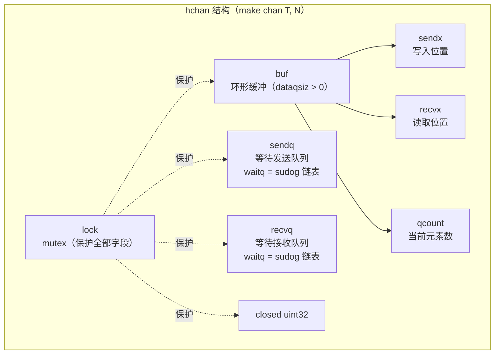
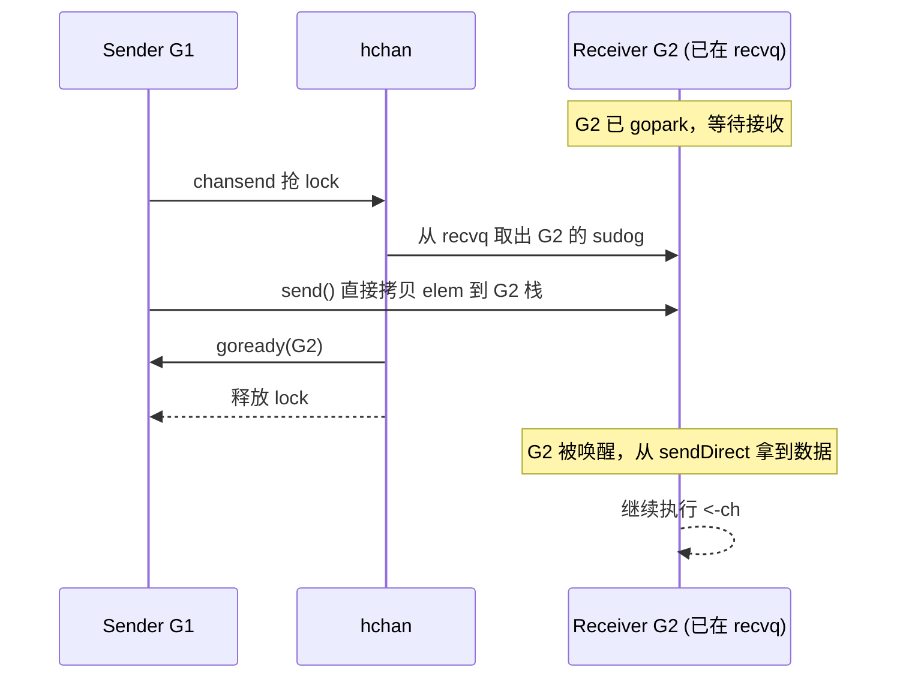
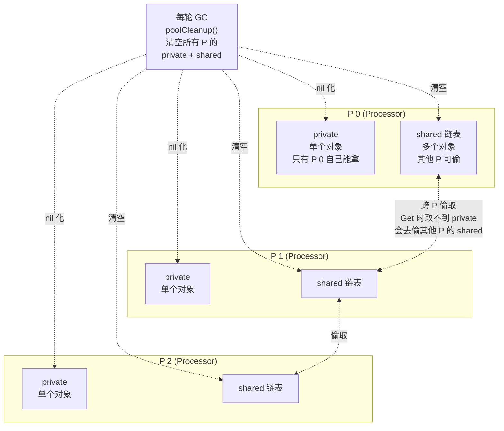

刚学 Go 的人最容易有的两个错觉：一是把 `channel` 当成"无锁的协程队列"；二是把 `sync.Mutex` 当成"channel 慢就用 mutex 替换"的银弹。两者都不对。

`channel` 内部有一把 `mutex`，它能做到"快"完全靠编译器把 `<-`/`->` 翻译成**直接内存拷贝到对方 goroutine 栈帧**——离开调度器配合，这个优化就废了。`sync.Pool` 在 Go 1.12 的实现里，**每次 GC 都会清空全部缓存对象**，这意味着它根本不能拿来当连接池。

这篇文章按 Go 1.12 源码把 `channel` 和 `sync.*` 主要原语的实现拆开讲：hchan 结构、三种收发路径、关闭语义、`select` 调度、`Mutex` 两种模式、`WaitGroup`/`Once` 的位操作、`Pool` 的两级结构与 GC 行为。读完你应该能在心里画出每条路径的关键路径成本，并在"用 channel 还是 mutex"之间做出有理由的选择。

<!--more-->

## 一、hchan：一个带锁的环形队列

`make(chan T, N)` 在 runtime 里分配一个 `hchan` 结构，核心字段（基于 `runtime/chan.go` 1.12 版本简化）：

```go
type hchan struct {
    qcount   uint           // 当前缓冲中的元素数
    dataqsiz uint           // 缓冲容量（make 时指定）
    buf      unsafe.Pointer // 环形缓冲指针（dataqsiz > 0 时才有）
    elemsize uint16         // 元素大小
    closed   uint32         // 是否已关闭
    elemtype *_ptr // 元素类型
    sendx    uint            // 发送索引
    recvx    uint            // 接收索引
    recvq    waitq          // 等待接收的 goroutine 队列
    sendq    waitq          // 等待发送的 goroutine 队列
    lock     mutex           // 保护 hchan 全部字段
}
```

每个 channel 都有一把 `lock`。这意味着所有 `ch <- x` 和 `<- ch` 在临界区内执行——所谓"channel 是无锁的"是错的，只是它的临界区比想象中短得多（很多路径只是指针交换，根本不进临界区）。



注意 `recvq` 和 `sendq` 是双向链表（`waitq` 由 `sudog` 组成）。当 channel 满 / 空时，对方 goroutine 不会自旋，而是把自己的 `sudog` 挂进对应队列，然后调用 `gopark` 让出 P。

## 二、三种收发路径：代价天差地别

`runtime/chan.go` 里 `chansend` 和 `chanrecv` 各有三条主路径，性能差距按数量级算：

**路径 1：直接从等待方手里交接（最快）**

接收方已经在 `recvq` 等待，发送方进入临界区后**直接把元素拷贝到接收方 goroutine 的栈帧**，然后 `goready` 唤醒对方。整个过程不进 `buf`，不做内存分配。



这条路径是无缓冲 channel 的"典型情况"：接收方先到，挂起；发送方到，直接交接。**不分配缓冲、不复制到 buf**——这就是为什么无缓冲 channel 比 mutex+slice 更受推崇。

**路径 2：走缓冲（中速）**

`buf` 未满 / 未空时，直接写入 / 读取环形缓冲，`sendx` / `recvx` 前进，零 goroutine 切换。

**路径 3：入队挂起（最慢）**

`buf` 满 / 空且对方队列没人，调用 `gopark` 把当前 goroutine 挂进 `sendq` / `recvq`，释放 P。这一路会涉及调度器协作，至少一次 goroutine 切换。

无缓冲 channel (`make(chan T)`) 必然是路径 1 或路径 3——因为 `dataqsiz == 0`、`buf == nil`。这是无缓冲 channel "必然同步交接"的根本原因：它根本没有缓冲让你"先把数据放进去等对方来取"。

```go
// 路径 1 的最快场景：两个 goroutine 通过无缓冲 channel 同步交接一个值
package main

import (
    "fmt"
    "time"
)

func main() {
    ch := make(chan int) // 无缓冲：必然路径 1 或 路径 3

    go func() {
        time.Sleep(10 * time.Millisecond) // 接收方先就绪
        v := <-ch                         // 挂起到 recvq
        fmt.Println("recv:", v)
    }()

    // 发送方到：从 recvq 直接交接，不走 buf
    ch <- 42
}
```

## 三、关闭语义：从可恢复性角度理解不对称

`close(ch)` 后：

- **向已关闭 channel 发送**：`panic: send on closed channel`
- **从已关闭 channel 接收**：返回零值 + `ok == false`，不 panic

为什么不对称？因为发送是"主动行为"，发送者必须知道对方是否还活着（panic 让 bug 立刻暴露）；而接收方通常在循环里 `for v := range ch`，需要一种"安全退出"的机制——返回零值就够用。

```go
// 正确的关闭模式：发送方关闭，接收方 range 退出
package main

import "fmt"

func main() {
    ch := make(chan int, 3)
    ch <- 1
    ch <- 2
    close(ch) // 必须由发送方关闭

    for v := range ch { // 接收方检测到关闭自动退出
        fmt.Println(v)
    }

    // 关闭后再读：不会 panic，返回零值
    v, ok := <-ch
    fmt.Println(v, ok) // 0 false
}
```

**`nil channel` 永久阻塞**——这看似是 bug，实际上是 `select` 里的"动态摘除分支"惯用法：

```go
// 动态启用/禁用 select 分支
package main

import (
    "fmt"
    "time"
)

func main() {
    var ch chan int // nil：读写都永久阻塞
    // ch = make(chan int) // 取消注释即可"接通"这一路

    select {
    case v := <-ch:
        fmt.Println("got:", v) // 永远走不到
    case <-time.After(100 * time.Millisecond):
        fmt.Println("timeout") // 走这里
    }
}
```

把 `ch` 置为 `nil` 后，`<-ch` 永远阻塞，select 等于"摘除"了这一路——比写一堆 if-else 维护 flag 干净得多。

## 四、`select`：随机轮盘 + 锁排序

`select` 不是简单的"按 case 顺序尝试"。runtime 的 `select.go` 实现两个关键策略：

**1. 随机化 poll order 避免饥饿**

`selectnbsend` / `selectnbrecv` 对所有 case 做一轮"无锁尝试"（try send/try recv），如果都不就绪，就把 goroutine 一次性挂到所有 case 的等待队列上。**当多个 case 同时就绪时，runtime 用 `fastrandn` 随机选一个**——这就是为什么"select 不会偏向先写的 case"。

如果按顺序 poll，先写的 case 会一直赢，后写的 case 永远饥饿。Go 用随机化保证公平。

**2. 按 channel 地址排序 lock order 避免死锁**

当 `select` 一次性把当前 goroutine 挂到多个 channel 的等待队列时，**必须按 channel 地址递增的顺序加锁**，否则两个 select 同时跑、互相等待对方先入队时，会形成经典的 AB-BA 死锁。

```go
// 经典死锁场景（伪代码）：两个 goroutine 各自 select 两个 channel
// 如果不按地址排序锁，两个 select 会互相等对方入队
//
// go A: select { case ch1 <- x: ; case <-ch2: }
// go B: select { case ch2 <- y: ; case <-ch1: }
//
// runtime 通过按地址排序 lock，全部一次 lock 后再 park 来打破环
```

**`default` 与全阻塞的两条路**

```go
select {
case v := <-ch1:    // 非 default：全阻塞路径
    handle(v)
case ch2 <- x:      // 必须所有 case 都阻塞才会 park
default:            // 任一 case 就绪就立刻执行
    fallback()
}
```

带 `default` 的 select 永远不会 park，是非阻塞 IO 多路复用的基础。

## 五、`sync.Mutex`：正常模式 vs 饥饿模式

`Mutex` 在 1.12 的实现里维护一个状态字段 `state`，高 3 位分别表示 `locked` / `woken` / `starving`，低 29 位是等待队列长度。

**正常模式（默认）**

新来的 goroutine 通过 `CAS` 抢占锁，**比已经在等待队列里的 goroutine 有优势**。理由是：新 goroutine 还在 CPU 上跑、缓存热；队列里的 goroutine 已经阻塞、上下文切换有代价。允许"插队"能提升吞吐，但会让队尾的 goroutine 等很久。

**饥饿模式（兜底）**

如果一个 goroutine 等超过 **1ms** 还拿不到锁，就标记进入饥饿模式。饥饿模式下：

- 锁的所有权直接从队首 goroutine 传递给下一个等待者
- 新来的 goroutine **不能插队**，直接进队尾
- 当队首 goroutine 拿到锁、等待队列为空、或者它不再等待超过 1ms 时，退出饥饿模式回到正常模式

这是 **"公平性 vs 吞吐"** 的经典取舍：正常模式追求吞吐，饥饿模式兜底尾延迟。

| 维度 | 正常模式 | 饥饿模式 |
|------|---------|---------|
| 抢占策略 | 新 goroutine 可 CAS 插队 | 严格 FIFO，队首直接交接 |
| 吞吐 | 高（避免唤醒已有等待者的代价） | 较低（每次交接都切换 goroutine） |
| 尾延迟 | 可能很差（尾部队员饥饿） | 受控（最长 1ms 切换触发） |
| 触发条件 | 默认 | 等待超过 1ms |
| 退出条件 | 始终 | 等待队列空 或 队首不再等待 > 1ms |

实际使用里几乎不需要手动干预这个状态机——设计者已经把它做成了自适应。但知道这个机制有助于理解为什么"高争用下 mutex 性能塌方"。

## 六、`sync.WaitGroup` 与 `sync.Once` 的位操作

`WaitGroup.state` 是单个 `uint64`，高 32 位是计数器 `counter`，低 32 位是等待者数量 `waiter`。`Add` / `Done` / `Wait` 全部走 `atomic.AddUint64`：

```go
// 典型用法
package main

import (
    "fmt"
    "sync"
)

func main() {
    var wg sync.WaitGroup

    for i := 0; i < 3; i++ {
        wg.Add(1) // 必须在外层调用，不能在 goroutine 里
        go func(id int) {
            defer wg.Done()
            fmt.Println("worker", id)
        }(i)
    }

    wg.Wait()
    fmt.Println("all done")
}
```

**常见误用**：`Add` 在新 goroutine 启动前调用。如果 `Add` 在 goroutine 里调用，而 `wg.Wait()` 已经在另一个 goroutine 跑，可能出现 `counter` 已经归零、`Wait` 立刻返回、但 `Add` 还在执行的竞态——Go 会直接 panic。

**`sync.Once` 的双检查为什么需要 atomic + mutex**

```go
// 简化版 sync.Once 核心逻辑
type Once struct {
    done uint32    // 必须 atomic：其他 P 上的 goroutine 要看到 done==1
    m    sync.Mutex
}

func (o *Once) Do(f func()) {
    if atomic.LoadUint32(&o.done) == 0 { // 第一道检查：无锁快路径
        o.m.Lock()                       // 抢锁
        defer o.m.Unlock()
        if o.done == 0 {                 // 第二道检查：抢到锁再确认
            defer atomic.StoreUint32(&o.done, 1)
            f()
        }
    }
}
```

外层 `atomic.Load` 是**快路径**：绝大多数 `Do` 调用看到 `done == 1` 直接返回，不抢锁、不进临界区。但赋值给 `done` 必须用 atomic，因为其他 P 上的 goroutine 通过 `Load` 看到这个标志——只用 mutex 保护不够（mutex 是 P 本地视角）。

## 七、`sync.Pool`：为什么"不可靠"

这是本文的重点之一。**Go 1.12 的 `sync.Pool` 在每次 GC 时会清空全部缓存对象**——不是"可能清空"，是**必然清空**。任何想拿它当"对象池"的用法都是错的。

**结构：P 本地私有 + 共享队列两级**



`Get` 路径：

1. 优先取当前 P 的 `private`，单 goroutine 独占，零争用
2. 私有为空，从当前 P 的 `shared` 链表 `popHead`
3. 当前 P 的 `shared` 也空，**跨 P 偷取**——按 P 编号遍历，从其他 P 的 `shared` 链表偷一批
4. 全部偷空，返回 nil

`Put` 路径：

1. 优先放进当前 P 的 `private`（如果空的）
2. 否则追加到当前 P 的 `shared` 链表尾

**GC 行为（Go 1.12）**

`poolCleanup` 是 runtime 在 `init` 时注册的 GC 回调，每次 STW 阶段被调用：

```go
// 简化：Go 1.12 的 poolCleanup
func poolCleanup() {
    for _, p := range allPools {
        // 把 local pool 全部清空
        p.private = nil
        p.shared = head(empty)
        // ... 清空 shared 链表所有元素
    }
}
```

也就是说：**一轮 GC 之后，`Pool` 里所有的对象都不可访问**。这不是"理论可能"，是必然行为——所以 `Pool` 只能装"可重建的临时对象"，绝不能当连接池、句柄池这种长生命周期资源的缓存。

> 注：Go 1.13 之后引入了 victim cache 机制，pooled 对象可以存活一轮 GC。但本文按 1.12 的行为描述。

**正确用法：复用可重建的临时对象**

```go
// 标准库 fmt 包的做法：复用 []byte 缓冲
package main

import (
    "bytes"
    "fmt"
    "sync"
)

var bufPool = sync.Pool{
    New: func() interface{} {
        return new(bytes.Buffer)
    },
}

func writeText(s string) string {
    buf := bufPool.Get().(*bytes.Buffer)
    buf.Reset() // 关键：清空旧内容
    buf.WriteString(s)
    result := buf.String()
    bufPool.Put(buf) // 放回池，下次可能被另一段代码拿到
    return result
}

func main() {
    fmt.Println(writeText("world"))
}
```

`bytes.Buffer.Reset()` 是关键——不清空就把脏数据扔回池，下个用户读到的是上次的内容。

**错误用法：把数据库连接放进去**

```go
// 反面教材：绝对不要这样写
var connPool = sync.Pool{
    New: func() interface{} {
        conn, err := sql.Open("postgres", "...")
        if err != nil {
            panic(err)
        }
        return conn
    },
}

func query(sql string) {
    conn := connPool.Get().(*sql.DB)
    defer connPool.Put(conn) // 错误！GC 后 conn 可能被回收

    rows, _ := conn.Query(sql)
    // ...
}
```

GC 一来连接就被清掉，下次 `Get` 拿到的是 `New` 创建的新连接或者 nil——不仅没起到复用作用，还可能因为 `defer Put` 时连接已关闭而 panic。要做连接池，用 `database/sql` 自带的连接管理，或者用 `github.com/golang/sync/errgroup` 之外的成熟方案。

## 八、channel vs mutex：选型标准

Go 的官方说法是："Don't communicate by sharing memory; share memory by communicating." 但这不是教条——实际工程里 mutex 仍然是主力。判断标准很直接：

| 场景 | 优先选择 | 理由 |
|------|---------|------|
| goroutine 间传递数据所有权 | channel | channel 本身就是"交接"，天然避免共享 |
| 多个 goroutine 读 / 写同一份状态 | mutex | 用 channel 模拟需要额外的状态机，反而更绕 |
| 事件流、订阅、扇出 | channel | range + select 是天然的事件循环 |
| 简单计数器 / flag | atomic | 单个变量原子操作就够了，不要锁 |
| 复杂状态机（如账户余额） | mutex | 读-改-写必须原子，channel 反而难写对 |
| 取消 / 超时信号 | channel + context | channel 的一次性信号语义最贴合 |

一个判断口诀：**传递数据用 channel，保护状态用 mutex**。如果你发现自己在用 channel 模拟一个共享变量的锁（频繁地 + 写 chan、读 chan），大概率应该直接用 mutex。

## 九、`-race` 检测器：上线前必跑

Go 内置的 data race 检测器是工程标配。它在编译期插入监控代码（基于 ThreadSanitizer），运行时记录所有内存访问的"happens-before"关系，发现竞态就 panic 报告。代价是**内存增加 5-10x、运行速度降低 2-20x**，所以生产不开，但 CI 必须开：

```bash
# 单元测试和 race 检测一起跑
go test -race ./...

# 跑主程序并启用 race 检测
go run -race main.go

# 构建带 race 检测的二进制（性能损耗大，仅用于排查）
go build -race -o app-race
```

测试代码里凡涉及并发，一定要带 `-race` 跑一遍。看不到 panic 报告不代表没有 race——`-race` 没开 = 完全没用。

常见 race 场景：

```go
// 1. map 并发读写（即使有锁，race detector 也能抓到未保护的访问）
var m map[int]int
go func() { m[1] = 1 }()  // 写
go func() { _ = m[1] }()  // 读
// -race 必报

// 2. slice 追加未保护
var s []int
go func() { s = append(s, 1) }()  // 写
go func() { _ = s[0] }()          // 读

// 3. 错误地"乐观读"
var counter int
go func() { counter++ }()         // 写
if counter > 0 {
    go func() { _ = counter }()  // 读
}
```

## 十、小结：一张清单

写并发代码前的自检清单：

- **channel**：`make` 时给不给缓冲？无缓冲必然是路径 1 或路径 3；关闭由发送方负责；`nil channel` 可用来在 select 里动态摘除分支
- **select**：依赖 runtime 的随机化和锁排序，不要假定 case 顺序；带 `default` 才不阻塞
- **Mutex**：正常模式插队、饥饿模式兜底尾延迟；不要手动实现"公平锁"
- **WaitGroup**：`Add` 必须发生在启动 goroutine 之前
- **Once**：双检查 + atomic + mutex 是标配
- **Pool**：Go 1.12 每轮 GC 清空全部对象，**只能装可重建的临时对象**，记得 `Reset()`
- **选型**：传递数据用 channel，保护状态用 mutex
- **检测**：CI 必须 `go test -race`，主程序出问题 `go run -race` 复现

记住一句话：**channel 不是魔法，它是带锁的环形队列 + 调度器配合；sync.Pool 不是缓存，它是可被 GC 随时清空的暂存区。** 工具的边界决定它的用途，超出边界硬用，再漂亮的 API 也救不了你。