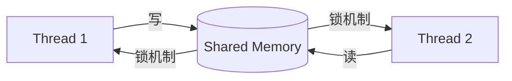
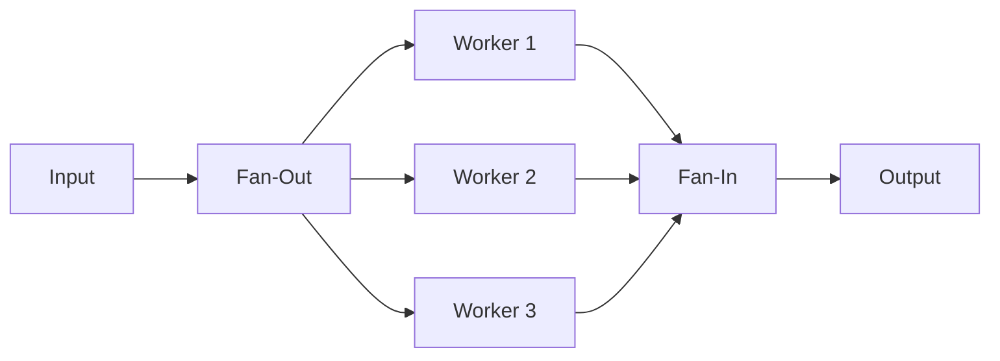
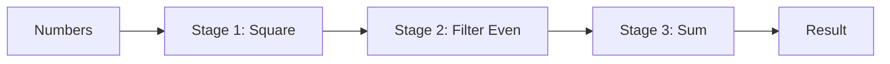

Go 的并发不是"额外特性"，而是**语言核心**。从 CSP（Communicating Sequential Processes）模型出发，Go 把并发做成第一公民——`go` 关键字、`channel` 类型、`select` 语句都是语法级支持，不像其他语言要靠线程库。

但"易用"不意味着"易对"。goroutine 泄露、channel 死锁、竞态条件（race condition）这些坑，写 Go 三年依然会遇到。本文总结工程中的并发模式与避坑要点。

<!--more-->

## 一、CSP 模型：理解 Go 并发的根基

### 1.1 传统共享内存模型



线程通过共享内存通信，需要**互斥锁、条件变量、信号量**等同步原语。问题：

- 锁粒度难以把握
- 死锁、活锁难以排查
- 状态分散，难以推理

### 1.2 CSP：通过通信共享内存

Go 走的是另一条路——**通过 channel 通信，不要通过共享内存通信**。


Go 有一句名言：

> Don't communicate by sharing memory; share memory by communicating.

channel 是 goroutine 之间的连接，发送和接收天然同步，避免了显式加锁。

### 1.3 goroutine：廉价的并发

```go
package main

import (
    "fmt"
    "time"
)

func say(s string) {
    for i := 0; i < 3; i++ {
        time.Sleep(100 * time.Millisecond)
        fmt.Println(s)
    }
}

func main() {
    go say("world")  // 启动 goroutine
    say("hello")     // 主 goroutine
}
```

goroutine 的关键特性：

- **栈初始仅 2KB**，可按需扩容到 GB 级
- 由 Go runtime **M:N 调度**（M 个 goroutine 跑在 N 个 OS 线程上）
- 启动 10 万个 goroutine，内存占用 1-2GB 完全可控
- 切换是**用户态**的，没有系统调用开销

## 二、Channel：goroutine 之间的管道

### 2.1 基本类型

```go
ch := make(chan int)       // 无缓冲 channel
ch := make(chan int, 10)   // 缓冲容量 10
```

| 类型 | 行为 |
|------|------|
| **无缓冲 channel** | 发送和接收必须**同时就绪**，否则阻塞 |
| **有缓冲 channel** | 缓冲区未满时可发送，未空时可接收 |
| **只发送** `chan<- int` | 只能 send |
| **只接收** `<-chan int` | 只能 receive |

```go
func sender(out chan<- int) {
    out <- 42  // 发送
}

func receiver(in <-chan int) {
    val := <-in  // 接收
    fmt.Println(val)
}
```

只读/只写 channel 是接口设计技巧，防止误用。

### 2.2 关闭 channel

```go
ch := make(chan int)
close(ch)  // 关闭 channel

// 关闭后行为：
// - 接收仍然能拿到已缓冲的值
// - 接收完毕后返回零值，ok = false
// - 发送会 panic：send on closed channel
// - 重复 close 会 panic：close of closed channel
```

**谁创建，谁关闭**——channel 的关闭责任要明确，否则容易 panic。

### 2.3 for range 接收

```go
ch := make(chan int, 5)
go func() {
    ch <- 1
    ch <- 2
    close(ch)  // 关闭后 range 才能退出
}()

for v := range ch {  // 自动遍历到 channel 关闭
    fmt.Println(v)
}
```

`for range` 会一直等到 channel 关闭，是接收多值的标准模式。

### 2.4 select：多路复用

```go
package main

import (
    "fmt"
    "time"
)

func main() {
    ch1 := make(chan string)
    ch2 := make(chan string)

    go func() {
        time.Sleep(1 * time.Second)
        ch1 <- "one"
    }()
    go func() {
        time.Sleep(2 * time.Second)
        ch2 <- "two"
    }()

    for i := 0; i < 2; i++ {
        select {
        case msg := <-ch1:
            fmt.Println("received", msg)
        case msg := <-ch2:
            fmt.Println("received", msg)
        }
    }
}
```

`select` 等待多个 channel 中的一个可操作，**随机**选择就绪的分支，避免饥饿。

## 三、并发模式

### 3.1 模式一：Worker Pool

限制并发数，避免无限创建 goroutine 压垮下游服务。

```go
package main

import (
    "fmt"
    "sync"
    "time"
)

type Job struct {
    ID int
}

func worker(id int, jobs <-chan Job, results chan<- int, wg *sync.WaitGroup) {
    defer wg.Done()
    for job := range jobs {
        // 模拟耗时任务
        time.Sleep(100 * time.Millisecond)
        results <- job.ID * 2
        fmt.Printf("Worker %d processed job %d\n", id, job.ID)
    }
}

func main() {
    jobs := make(chan Job, 10)
    results := make(chan int, 10)
    var wg sync.WaitGroup

    // 启动 3 个 worker
    for w := 1; w <= 3; w++ {
        wg.Add(1)
        go worker(w, jobs, results, &wg)
    }

    // 投递 9 个任务
    for j := 1; j <= 9; j++ {
        jobs <- Job{ID: j}
    }
    close(jobs)  // 关闭后 worker range 会退出

    // 等待所有 worker 完成
    go func() {
        wg.Wait()
        close(results)
    }()

    // 收集结果
    for r := range results {
        fmt.Println("Result:", r)
    }
}
```

**关键设计：**

- `close(jobs)` 通知 worker 任务派发完毕
- `wg.Wait()` 等所有 worker 完成后再 `close(results)`
- 避免在主 goroutine 内 close（可能 panic：send on closed channel）

### 3.2 模式二：Fan-Out / Fan-In

把工作分散到多个 goroutine，结果汇总回一个 channel。



```go
package main

import (
    "fmt"
    "sync"
)

// Fan-In：合并多个 channel 到一个
func merge(chans ...<-chan int) <-chan int {
    out := make(chan int)
    var wg sync.WaitGroup
    for _, ch := range chans {
        wg.Add(1)
        go func(c <-chan int) {
            defer wg.Done()
            for v := range c {
                out <- v
            }
        }(ch)
    }
    go func() {
        wg.Wait()
        close(out)
    }()
    return out
}

func main() {
    ch1 := make(chan int)
    ch2 := make(chan int)

    go func() {
        for i := 0; i < 5; i++ {
            ch1 <- i
        }
        close(ch1)
    }()
    go func() {
        for i := 10; i < 15; i++ {
            ch2 <- i
        }
        close(ch2)
    }()

    for v := range merge(ch1, ch2) {
        fmt.Println(v)
    }
}
```

### 3.3 模式三：Pipeline

数据流经过多阶段处理，每阶段用 channel 连接。



```go
package main

import "fmt"

// 阶段 1：生成数字
func generate(nums ...int) <-chan int {
    out := make(chan int)
    go func() {
        for _, n := range nums {
            out <- n
        }
        close(out)
    }()
    return out
}

// 阶段 2：平方
func square(in <-chan int) <-chan int {
    out := make(chan int)
    go func() {
        for n := range in {
            out <- n * n
        }
        close(out)
    }()
    return out
}

// 阶段 3：过滤偶数
func filterEven(in <-chan int) <-chan int {
    out := make(chan int)
    go func() {
        for n := range in {
            if n%2 == 0 {
                out <- n
            }
        }
        close(out)
    }()
    return out
}

func main() {
    // 串联成 pipeline
    nums := generate(1, 2, 3, 4, 5, 6, 7, 8)
    squared := square(nums)
    evens := filterEven(squared)

    for v := range evens {
        fmt.Println(v)  // 4, 16, 36, 64
    }
}
```

Pipeline 的优雅之处在于**每个阶段都是独立 goroutine**，可以并行处理（数据已经在管道里流动）。

### 3.4 模式四：Context 取消

`context` 包是 Go 1.7 引入的取消信号传递机制。

```go
package main

import (
    "context"
    "fmt"
    "time"
)

func longRunning(ctx context.Context) error {
    // 模拟分阶段任务
    for i := 1; i <= 5; i++ {
        select {
        case <-time.After(500 * time.Millisecond):
            fmt.Printf("Step %d completed\n", i)
        case <-ctx.Done():
            // 收到取消信号，立即返回
            return ctx.Err()
        }
    }
    return nil
}

func main() {
    ctx, cancel := context.WithTimeout(context.Background(), 1500*time.Millisecond)
    defer cancel()

    err := longRunning(ctx)
    fmt.Println("Result:", err)
    // 1500ms 后 ctx 触发超时，longRunning 在第 3 步退出
    // 输出：Result: context deadline exceeded
}
```

**Context 的核心用法：**

- `context.Background()`：根 context
- `context.WithCancel()`：手动取消
- `context.WithTimeout()`：超时取消
- `context.WithDeadline()`：截止时间取消
- `context.WithValue()`：传值（仅用于请求级元数据，不要滥用）

Context 应该作为**第一个参数**传递给所有可能阻塞或耗时的函数。

## 四、Sync 包：底层并发原语

有时候 channel 不是最优解，`sync` 包提供了更底层的同步原语。

### 4.1 sync.Mutex：互斥锁

```go
type Counter struct {
    mu    sync.Mutex
    count int
}

func (c *Counter) Inc() {
    c.mu.Lock()
    defer c.mu.Unlock()
    c.count++
}
```

**原则：**

- 锁的粒度尽量小
- 必须 `defer Unlock()`，避免 panic 导致死锁
- 多个 mutex 时注意**加锁顺序**，避免死锁

### 4.2 sync.RWMutex：读写锁

读多写少场景用 RWMutex 提升并发：

```go
type Cache struct {
    mu   sync.RWMutex
    data map[string]int
}

func (c *Cache) Get(key string) int {
    c.mu.RLock()         // 读锁
    defer c.mu.RUnlock()
    return c.data[key]
}

func (c *Cache) Set(key string, val int) {
    c.mu.Lock()          // 写锁
    defer c.mu.Unlock()
    c.data[key] = val
}
```

读锁之间不互斥，但读锁和写锁互斥。

### 4.3 sync.WaitGroup：等待组

```go
var wg sync.WaitGroup

for i := 0; i < 3; i++ {
    wg.Add(1)
    go func(i int) {
        defer wg.Done()
        fmt.Println(i)
    }(i)
}

wg.Wait()  // 阻塞直到所有 Done()
```

**注意：**

- `Add` 必须在 `go` 启动前调用
- `Wait` 必须 `Add` 之后调用
- 不要在不知道 Add 数的情况下复用 WaitGroup

### 4.4 sync.Once：单次执行

```go
var (
    instance *Singleton
    once     sync.Once
)

func GetInstance() *Singleton {
    once.Do(func() {
        instance = &Singleton{}
    })
    return instance
}
```

保证函数**只执行一次**，用于单例模式、配置加载等。

### 4.5 atomic 包：无锁原子操作

```go
var counter int64

// 原子加 1
atomic.AddInt64(&counter, 1)

// 原子读取
value := atomic.LoadInt64(&counter)
```

`atomic` 比 mutex 快（无锁），但只适合简单的整数、指针操作。

## 五、避坑指南

### 5.1 goroutine 泄露

最常见的坑——启动了 goroutine，但永远没人通知它退出。

**案例：channel 阻塞**

```go
func leak() {
    ch := make(chan int)  // 无缓冲

    go func() {
        val := doSomething()
        ch <- val  // 永远阻塞：没人接收
    }()

    // 忘记接收 ch
}
```

**解决：用 select 配合 ctx**

```go
func noLeak(ctx context.Context) {
    ch := make(chan int)

    go func() {
        select {
        case ch <- doSomething():
        case <-ctx.Done():
            return  // 收到取消信号退出
        }
    }()

    select {
    case val := <-ch:
        fmt.Println(val)
    case <-ctx.Done():
        return
    }
}
```

### 5.2 死锁：循环等待

```go
func deadlock() {
    ch1 := make(chan int)
    ch2 := make(chan int)

    go func() {
        v := <-ch1
        ch2 <- v  // 等待 ch2 接收
    }()

    v := <-ch2      // 等待 ch2 发送
    ch1 <- v        // 等待 ch1 接收
    // 死锁！
}
```

**检测方法：**

```bash
go run -race main.go
```

race detector 能识别大部分并发问题。

### 5.3 Race Condition：竞态条件

```go
var counter int

func race() {
    for i := 0; i < 1000; i++ {
        go func() {
            counter++  // 读-改-写，非原子操作
        }()
    }
}

// counter 远小于 1000
```

**修复：用 mutex 或 atomic**

```go
var counter int64

func fixed() {
    for i := 0; i < 1000; i++ {
        go func() {
            atomic.AddInt64(&counter, 1)
        }()
    }
}
```

### 5.4 不要在锁内做 IO 操作

```go
// 错误：锁内做网络请求
func bad(id int) {
    mu.Lock()
    defer mu.Unlock()
    resp, _ := http.Get(api)  // 锁内 IO，其他 goroutine 全部等待
}

// 正确：先获取数据，再加锁
func good(id int) {
    resp, _ := http.Get(api)  // IO 在锁外
    mu.Lock()
    defer mu.Unlock()
    data[id] = resp
}
```

## 六、性能调优

### 6.1 GOMAXPROCS

```bash
# 设置并行度（默认是 CPU 核数）
GOMAXPROCS=8 ./myapp
```

```go
import "runtime"
runtime.GOMAXPROCS(8)  // 限制使用 8 个 CPU
```

### 6.2 sync.Pool：对象复用

```go
var bufPool = sync.Pool{
    New: func() interface{} {
        return new(bytes.Buffer)
    },
}

func process(data []byte) {
    buf := bufPool.Get().(*bytes.Buffer)
    defer bufPool.Put(buf)
    buf.Reset()
    buf.Write(data)
    // ...
}
```

`sync.Pool` 用于减少 GC 压力，比如 buffer、临时对象。

### 6.3 pprof 性能分析

```go
import _ "net/http/pprof"

// 启动一个 HTTP 服务用于 pprof
go func() {
    http.ListenAndServe(":6060", nil)
}()
```

```bash
# CPU profile
go tool pprof http://localhost:6060/debug/pprof/profile

# 内存 profile
go tool pprof http://localhost:6060/debug/pprof/heap

# goroutine 数量
go tool pprof http://localhost:6060/debug/pprof/goroutine
```

## 七、并发代码 review 清单

每次写并发代码，自查：

- [ ] 启动的 goroutine **有明确的退出机制**吗？
- [ ] channel 的**关闭责任**明确吗？
- [ ] 共享变量**有同步保护**吗（mutex/atomic/channel）？
- [ ] 锁内**没有做 IO 或阻塞操作**吗？
- [ ] `defer unlock`**在最前面**调用了吗？
- [ ] 用 `context` 传递**超时和取消信号**了吗？
- [ ] 跑过 `go test -race` 吗？

## 八、总结

Go 并发编程的核心要点：

| 原语 | 适用场景 |
|------|---------|
| **goroutine** | 任何需要并发的场景（轻量级） |
| **channel** | goroutine 间通信、传递所有权 |
| **sync.Mutex** | 保护共享状态（简单场景） |
| **sync.WaitGroup** | 等待一组 goroutine 完成 |
| **context** | 传递取消信号、超时、元数据 |
| **atomic** | 简单的计数器、标志位 |

**核心原则：**

1. **优先用 channel**，遇到瓶颈再考虑 sync.Mutex
2. **不要通过共享内存通信，通过通信共享内存**
3. **谁创建，谁负责关闭**（channel、context）
4. **警惕 goroutine 泄露**，确保每个 goroutine 都有退出路径
5. **开启 race detector**（`go test -race`）做日常检测

Go 的并发模型简洁而强大，但要真正驾驭，需要在工程中反复练习和踩坑。

## 参考资料

- [The Go Blog: Concurrency is not Parallelism](https://go.dev/blog/waza-talk)
- [Effective Go: Concurrency](https://go.dev/doc/effective_go#concurrency)
- [Go Concurrency Patterns (Rob Pike, 2012)](https://go.dev/talks/2012/concurrency.slide)
- [Pipelines and Cancellation](https://go.dev/blog/pipelines)
- [Go by Example: Goroutines](https://gobyexample.com/goroutines)

## 更新记录

- **2018 年**：本文首次发表，Go 1.10 时代
- **2019 年**：Go 1.13 完善 `errors.Is/As` 错误链判断（sync 包性能主要在后续版本改进）
- **2020 年**：Go 1.14 大幅优化调度器，goroutine 切换开销显著降低
- **2021 年**：Go 1.17 优化函数调用栈，降低开销
- **2022 年**：Go 1.18+ 泛型落地，部分并发工具（`errgroup`）开始支持泛型
