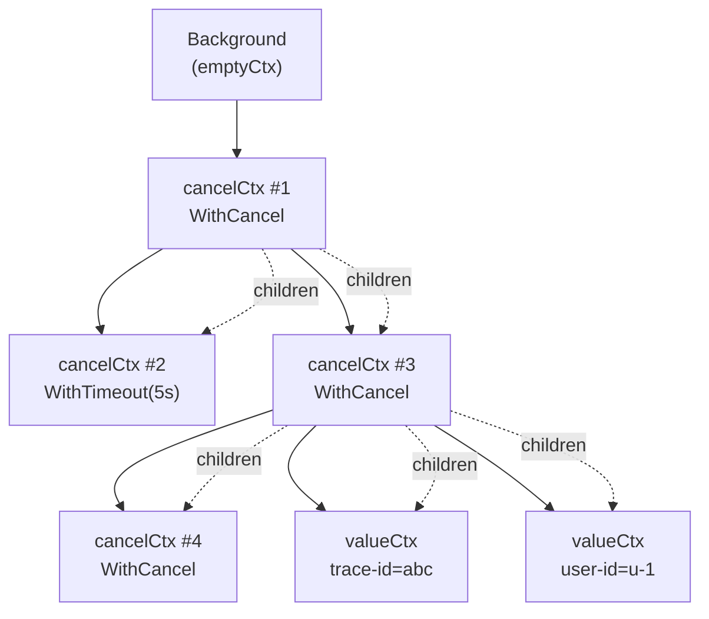
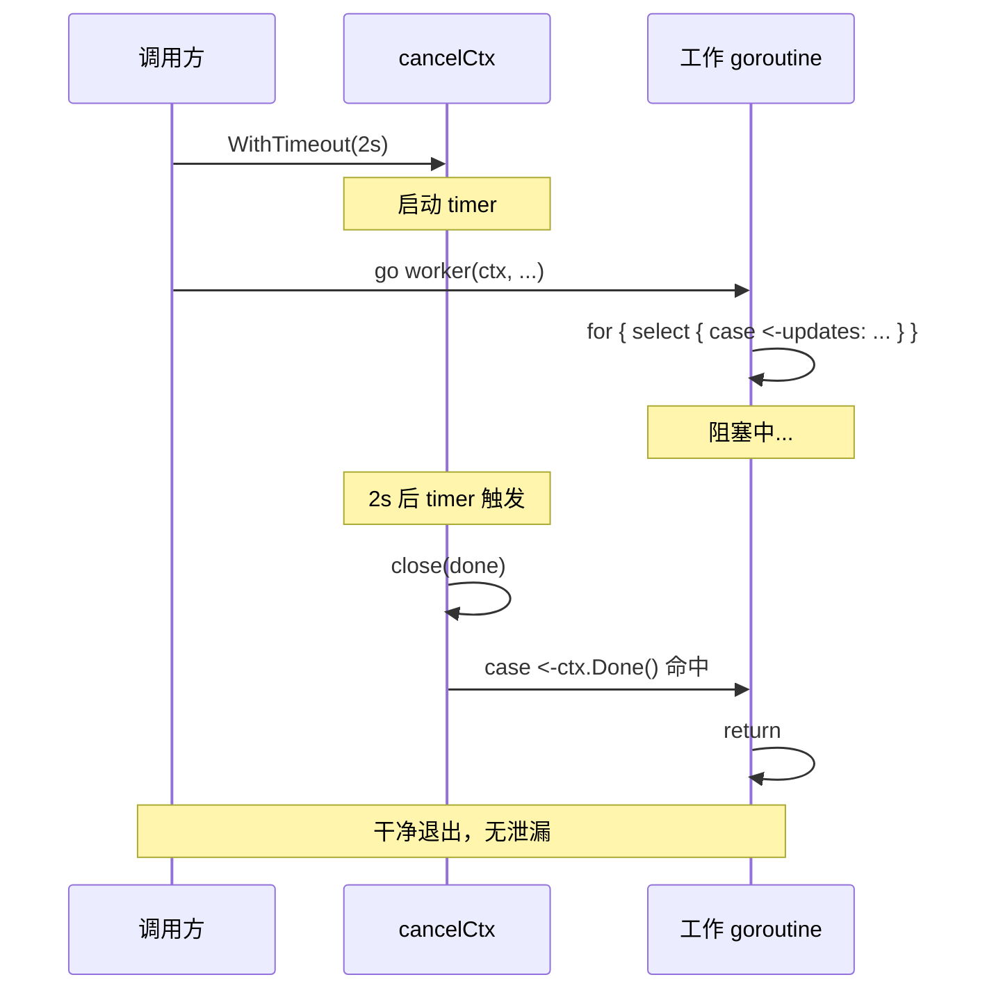
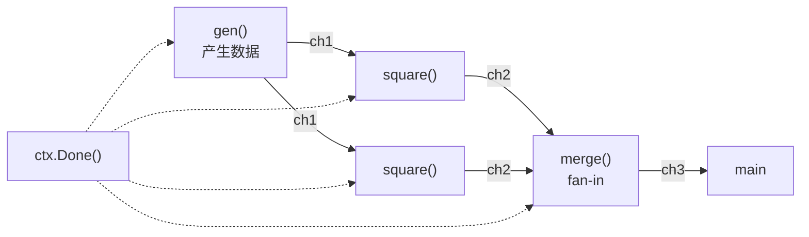

2018 年我们在线上遇到过一次奇怪的故障：服务平稳运行六小时后，HTTP 接口开始出现零星超时；八小时后超时雪崩，pprof 显示 goroutine 数从启动时的 80 涨到 47 万。内存没爆，CPU 没满，唯一异常是 goroutine 数量。重启后一切恢复，但同样的故事第二天又演了一遍。

最终定位是一个 HTTP handler 里启动了后台 goroutine，handler 提前超时返回后，这些 goroutine 没人通知它们退出，全部卡在 `ch <- result` 的发送上。每个超时请求泄漏一个 goroutine，撑爆了运行时调度。

goroutine 泄漏和内存泄漏不一样。**它不会立刻爆掉，而是悄悄吃掉内存、句柄、连接，最终在高峰期把系统打穿**。这篇文章想讲清楚：泄漏的常见形态、为什么 `context` 是它的标准解药、context 内部怎么把取消信号自上而下广播，以及怎么定位一个已经泄漏的现场。

<!--more-->

## 一、为什么 goroutine 泄漏比内存泄漏更隐蔽

Go 的运行时把 goroutine 当作廉价资源，初始栈 2KB，开 10 万个也只是几 GB 内存的事。这让新人产生一个错觉：goroutine 随便开，反正便宜。

但便宜不等于无代价。一个泄漏的 goroutine 至少有三层副作用：

- **运行时调度开销**：G 数量超过 GOMAXPROCS 几倍后，调度器会反复在 runqueue 上抢占，goroutine 切换的间接成本（cache miss、栈拷贝）开始显现
- **持有对象无法回收**：goroutine 栈上的指针、它引用的 channel、传进来的 `*http.Request`、打开的 `*os.File`、数据库连接，全部跟着它一起活
- **资源耗尽型故障**：最致命的一类。文件描述符、TCP 连接、数据库连接池都有上限，泄漏到上限后整个进程拒绝服务

它为什么隐蔽？因为 Go 没有"goroutine 退出"的强制约束。C++ 的 `std::thread` 析构时会 `std::terminate`，Java 的 `ExecutorService` 关闭时会强制回收；Go 的 goroutine 是 fire-and-forget——主函数返回后所有 goroutine 跟着终结，但**运行期间没有任何机制能强制让一个 goroutine 退出**。

`runtime.NumGoroutine()` 是最直接的体检指标。但要解释一个进程为什么有 5 万个 goroutine，你需要 `net/http/pprof` 的 `goroutine?debug=2` 全栈快照——它会打印每个 goroutine 当前停在源码的哪一行。一堆 goroutine 卡在同一行，就是泄漏现场。

## 二、三种典型泄漏现场

以下三个例子都可以独立复现，建议亲手跑一下。

### 现场一：向无人接收的 channel 发送

```go
// leak-send/main.go
package main

import (
    "fmt"
    "runtime"
    "time"
)

func main() {
    for i := 0; i < 1000; i++ {
        ch := make(chan int)
        go func() {
            // 模拟慢查询，3 秒后才有结果
            time.Sleep(3 * time.Second)
            ch <- 42 // 关键：调用方早已超时返回，没人接收
        }()
        // 假装请求超时，立即离开作用域
        _ = ch
    }
    time.Sleep(5 * time.Second)
    fmt.Printf("goroutines: %d\n", runtime.NumGoroutine())
}
```

跑完会看到 `goroutines: 1001`——1000 个工作 goroutine 卡在 `ch <- 42` 永远退不出。

**修法**：要么接收方确保一定有人接（`buffered channel` + 超时兜底），要么用 `context` 把取消信号传进去：

```go
func query(ctx context.Context) (int, error) {
    ch := make(chan int, 1) // buffered，避免发送方阻塞
    go func() {
        time.Sleep(3 * time.Second)
        ch <- 42
    }()
    select {
    case v := <-ch:
        return v, nil
    case <-ctx.Done():
        return 0, ctx.Err() // context 取消后，工作 goroutine 的 send 也会因 receiver 提前 return 而解锁
    }
}
```

**核心是让发送方知道"对面不要了"**。buffered channel + select 是 Go 里的标准模式。

### 现场二：从永不关闭的 channel 接收

```go
// leak-receive/main.go
package main

import (
    "fmt"
    "runtime"
)

func main() {
    ch := make(chan int)
    go func() {
        ch <- 1
        // 生产者提前 return，忘了 close(ch)
    }()
    // 消费者永远等下去
    v := <-ch
    fmt.Println(v)
    time.Sleep(2 * time.Second)
    fmt.Printf("goroutines: %d\n", runtime.NumGoroutine())
}
```

这里的 bug 更微妙：消费者其实正常退出了（拿到 1 之后 `fmt.Println` 然后 return），goroutine 数最终会回到 1。但**只要消费者换成 `for v := range ch`，泄漏就立刻发生**——range 会一直等到 channel 被关闭。

**修法**：Go 的硬约定：**发送方负责关闭 channel**，且只能关闭一次。消费者用 `for range` 即可。

```go
func producer(out chan<- int) {
    defer close(out) // 谁发谁关
    out <- 1
    out <- 2
}

func consumer(in <-chan int) {
    for v := range in { // 自动感知关闭
        fmt.Println(v)
    }
}
```

### 现场三：没有退出条件的 for-select

最常见的一类，也是现场一那种 bug 的根源写法：

```go
func watch(ctx context.Context, updates <-chan Event) {
    for {
        select {
        case e := <-updates:
            handle(e)
        // 缺一个 case <-ctx.Done(): return
        }
    }
}
```

没有 `<-ctx.Done()` 分支时，调用方取消 ctx 后，select 会永远阻塞在 `<-updates` 上。把它补上：

```go
func watch(ctx context.Context, updates <-chan Event) {
    for {
        select {
        case e := <-updates:
            handle(e)
        case <-ctx.Done():
            return // 收到取消信号，干净退出
        }
    }
}
```

**这也是所有 Go 并发代码最该背下来的一条原则**：任何 `for { select }` 循环都必须有退出分支。

### 三种现场对比

| 现场 | 触发条件 | 直接症状 | 标准修法 |
|------|---------|---------|---------|
| 发送阻塞 | 接收方提前离开 | goroutine 卡在 `ch <- v` | buffered channel + `select` + `ctx.Done()` |
| 接收阻塞 | 生产者忘 `close` | `range` 永不退出 | 发送方 `defer close(out)`；消费者用 `for range` |
| for-select 无退出 | 缺 `case <-ctx.Done()` | select 永远阻塞 | 补上 ctx 分支；ctx 由调用方控制生命周期 |

## 三、Context 接口与四种实现

`context.Context` 是 Go 1.7 引入的接口，只有四个方法：

```go
type Context interface {
    Deadline() (deadline time.Time, ok bool)
    Done() <-chan struct{}
    Err() error
    Value(key interface{}) interface{}
}
```

`Done()` 返回的 channel 被关闭时，意味着"该退出了"；`Err()` 解释为什么——是 `Canceled`（主动取消）还是 `DeadlineExceeded`（超时）。

围绕这个接口，标准库有四种实现：

| 实现 | 用途 | 关键字段 | 创建函数 |
|------|------|---------|---------|
| `emptyCtx` | 根节点，永不取消 | 无 | `Background()` / `TODO()` |
| `cancelCtx` | 可取消的节点 | `done chan struct{}` + `children map` + `err error` | `WithCancel` |
| `timerCtx` | 带 deadline 的节点 | 嵌入 `cancelCtx` + `deadline time.Time` + `*time.Timer` | `WithDeadline` / `WithTimeout` |
| `valueCtx` | 携带请求域数据 | `key, val interface{}` + 嵌入 parent | `WithValue` |

四个方法 + 四种实现，组成了 Go 并发的取消基础设施。

`WithCancel` 返回的不是 `cancelCtx` 直接暴露的指针，而是 `Context` 接口 + 一个 `cancel func()`。这种"只给消费者只读视图，把可写能力收回 cancel 函数"的设计，是 context 模式的核心防御机制——调用方拿到 ctx 后没法主动关闭它，只能等 cancel 被调用。

## 四、cancel 如何自上而下广播

`cancelCtx` 内部的关键结构：

```go
type cancelCtx struct {
    Context                       // 父 context
    mu       sync.Mutex
    done     chan struct{}        // 关闭即广播
    children map[canceler]struct{} // 子节点集合
    err      error                // 取消原因
}
```

`WithCancel(parent)` 创建子节点时，会调用 `propagateCancel(parent, child)` 把子挂到父的 `children` map 上：



`propagateCancel` 处理四种情况：

1. **父节点的 `Done()` 是 nil**：父永不取消，直接返回
2. **父已经被取消**：子立即被取消（`child.cancel(false, p.err)`）
3. **父是 `*cancelCtx` 或 `*timerCtx`**：把子挂到 `parent.children` 里，return
4. **父是自定义 `Context`**：起一个 watcher goroutine 监听 `parent.Done()`，触发时调用 `child.cancel`

第四种情况解释了"为什么自定义 Context 也能正确传播"——标准库没法假定 parent 一定是它自家的类型，只能起 goroutine 兜底。

当任何节点调用 `cancel()` 时：

```go
func (c *cancelCtx) cancel(removeFromParent bool, err error) {
    c.mu.Lock()
    defer c.mu.Unlock()
    if c.err != nil {
        return // 已经取消过，幂等
    }
    c.err = err
    close(c.done) // 关键：关闭 done channel
    for child := range c.children {
        child.cancel(false, err) // 递归取消所有子节点
    }
    c.children = nil
    if removeFromParent {
        removeChild(c.Context, c) // 从父的 children 摘掉
    }
}
```

**"关闭 done channel"是一次广播给 N 个等待者的最省事做法**。所有在 `<-ctx.Done()` 上阻塞的 goroutine 都会同时被唤醒，不需要管理订阅者列表。

下面这张时序图展示一次典型泄漏的取消流程：



对照第一段里的"现场三"——少了 `case <-ctx.Done()` 分支，worker 就会跳过这一步，永远阻塞在 `<-updates` 上。

## 五、deadline 只会收紧不会放宽

`timerCtx` 嵌入了 `cancelCtx` 并增加一个 `*time.Timer`。`WithTimeout` 等价于 `WithDeadline(parent, time.Now().Add(d))`。

一个反直觉的规则：**子 context 的 deadline 必须早于或等于父的 deadline，否则自动调整为父的 deadline**。

```go
parent, _ := context.WithTimeout(context.Background(), 5*time.Second)
child, _ := context.WithTimeout(parent, 10*time.Second) // 想放更宽？没门

fmt.Println(parent.Deadline()) // 5s
fmt.Println(child.Deadline())  // 5s，被父收紧
```

这个限制是分布式系统里"局部不能让全局变慢"的直接体现。父节点（HTTP 请求）承诺 5 秒内给客户端答案；中间某层（数据库查询）不能说"我想给自己 10 秒"，那会拖死整条链。Go 团队把这个约束写进了 `WithDeadline` 的实现里，不依赖开发者自觉。

### 必须 `defer cancel()`

`WithTimeout` 返回两个值：ctx 和 cancel 函数。**cancel 不调用，timer 就一直在跑**：

```go
ctx, cancel := context.WithTimeout(parent, 5*time.Second)
go doWork(ctx)
// 忘了 defer cancel() 或没把 cancel 传出去
```

- timer 会在 5 秒后触发 cancel（这个动作还是会做）
- 但 cancel 函数本身的"提前停止 timer + 立刻释放资源"的能力没被触发
- 父节点上的 children map 一直挂着这个子节点（直到父被取消）

这就是**一种隐式泄漏**：timer 触发的那个 goroutine 会从 `c.done <-` 上醒来，但如果你已经把 cancel 当垃圾丢掉了，timerCtx 内部的资源（timer、channel）就只能等父节点取消时被一起回收。

Go 1.10 引入的 `go vet` 静态检查 `lostcancel` 就是专门抓这个的：

```go
ctx, _ := context.WithTimeout(context.Background(), time.Second) // 警告：lostcancel
doSomething(ctx)
```

报警后 IDE 会画红线。修法永远是 `defer cancel()`，**没有例外**。

## 六、context.Value 的争议

`Value(key)` 让 context 像一个请求域的字典，可以塞 trace id、user id、认证 token 之类的元数据：

```go
ctx = context.WithValue(ctx, traceIDKey, "abc-123")
traceID, _ := ctx.Value(traceIDKey).(string)
```

但这个能力被滥用得很严重。社区共识（基本成了 Go 圈的事实标准）：

- **只放请求域元数据**（request-scoped data）：trace id、user id、locale、auth token
- **不要放可选参数**（optional parameters）：把 ctx 当成"传十个参数的快捷方式"
- **不要放业务数据**：比如"用户购物车"——它属于业务状态，应该走参数

理由是 ctx 的查找是 O(N) 链表遍历（valueCtx 嵌 parent，逐层 `Value(key)`），比函数参数贵得多；更糟的是，函数签名里看不到 ctx 拿了什么，重构时没人能知道破坏了什么。

### type-safe key 的写法

字符串作为 key 是反模式——所有包都可能用 `"user_id"` 撞车。Go 圈的做法是**自定义未导出类型作 key**：

```go
package trace

type traceIDKey struct{} // 未导出类型，包外无法构造

func WithTraceID(ctx context.Context, id string) context.Context {
    return context.WithValue(ctx, traceIDKey{}, id)
}

func TraceID(ctx context.Context) string {
    id, _ := ctx.Value(traceIDKey{}).(string)
    return id
}
```

外部包想拿 trace id？只能调 `trace.TraceID(ctx)`，没法直接 `ctx.Value("trace_id")` 撞别人。这样 key 空间就按包隔离了。

## 七、Pipeline 模式与 cancellation

Go 经典的并发模式是 pipeline：generator → 中间加工 → fan-in/fan-out。Rob Pike 在 2014 年的 "Concurrency is not Parallelism" 演讲里给过一套基础模板，原版用 `done` channel 传取消信号，Go 1.7 之后等价物是 `context.Context`。



完整实现（取消信号由 ctx 携带）：

```go
// pipeline/main.go
package main

import (
    "context"
    "fmt"
    "sync"
)

func gen(ctx context.Context, nums ...int) <-chan int {
    out := make(chan int)
    go func() {
        defer close(out)
        for _, n := range nums {
            select {
            case out <- n:
            case <-ctx.Done():
                return // 收到取消，立即退出
            }
        }
    }()
    return out
}

func square(ctx context.Context, in <-chan int) <-chan int {
    out := make(chan int)
    go func() {
        defer close(out)
        for n := range in {
            select {
            case out <- n * n:
            case <-ctx.Done():
                return
            }
        }
    }()
    return out
}

func merge(ctx context.Context, ins ...<-chan int) <-chan int {
    out := make(chan int)
    var wg sync.WaitGroup
    wg.Add(len(ins))
    for _, in := range ins {
        go func(in <-chan int) {
            defer wg.Done()
            for n := range in {
                select {
                case out <- n:
                case <-ctx.Done():
                    return
                }
            }
        }(in)
    }
    go func() {
        wg.Wait()
        close(out) // 发送方负责关闭
    }()
    return out
}

func main() {
    ctx, cancel := context.WithCancel(context.Background())
    defer cancel()

    in := gen(ctx, 2, 3, 4, 5)
    c1 := square(ctx, in)
    c2 := square(ctx, in)
    out := merge(ctx, c1, c2)

    // 拿到第一个结果就取消整条 pipeline
    fmt.Println(<-out) // 4
    cancel()

    // 短暂等待，让所有 goroutine 看到 ctx.Done()
    time.Sleep(100 * time.Millisecond)
    fmt.Println("done")
}
```

**关键约定**：

1. **每个 goroutine 的 `select` 必须有 `case <-ctx.Done(): return`**——漏一个就泄漏一个
2. **发送方负责 `defer close(out)`**——消费者用 `for range` 自动感知结束
3. **取消信号自动贯穿全链**——`main` 调 `cancel()` 后，所有阶段的 `<-ctx.Done()` 都会触发，整条 pipeline 干净退出

## 八、定位 goroutine 泄漏

定位分三步：先确认泄漏存在，再定位卡在哪一行，最后看代码逻辑。

### 第一步：打点确认

```go
var goroutineBaseline int

func init() {
    goroutineBaseline = runtime.NumGoroutine()
}

// 在监控里周期性上报
func report() {
    current := runtime.NumGoroutine()
    metrics.Gauge("goroutine_count", current)
    metrics.Gauge("goroutine_delta", current-goroutineBaseline)
}
```

如果 delta 在持续上涨（而不是稳定在某个值），说明有泄漏。

### 第二步：全栈快照定位

`net/http/pprof` 默认会注册 `/debug/pprof/goroutine`：

```bash
curl http://localhost:6060/debug/pprof/goroutine?debug=2 > goroutine.txt
```

`debug=2` 输出每个 goroutine 的完整栈。比如线上一次典型泄漏会看到：

```
1000 goroutines, all with stack:
main.query(0xc0001a4000)
  /app/leak.go:18 +0x4a
created by main.main
  /app/leak.go:12 +0x65
```

1000 个 goroutine 卡在第 18 行（`ch <- 42`），由第 12 行 `go func` 启动——泄漏现场一目了然。

### 第三步：压测前后对比

```go
func before() { log.Println(runtime.NumGoroutine()) } // 启动后基线
func after()  { log.Println(runtime.NumGoroutine()) } // 压测 1 万请求后

func TestNoLeak(t *testing.T) {
    before()
    for i := 0; i < 10000; i++ {
        doRequest()
    }
    runtime.GC()
    time.Sleep(time.Second) // 给泄漏的 goroutine 一点时间（如果有）
    after()
    // 断言 after 接近 before
}
```

这是 CI 里防止回归的标准做法。任何"上线后才发现泄漏"的事故，加这一个测试就能挡住。

## 九、每启动一个 goroutine 就要回答的三个问题

写完一个 `go func()`，在 PR 之前问自己三个问题：

1. **谁负责让它退出？**——是 ctx、由 channel 关闭触发、还是自然 return？没有任何退出机制就发出去的是定时炸弹
2. **退出信号从哪来？**——调用方的 cancel()、channel close、`time.After`、还是 parent ctx 的 deadline？信号源头必须写在代码里，让 reviewer 一眼看到
3. **退出前要释放什么？**——打开的文件、数据库连接、channel 缓冲区的 send、注册的回调。`defer close(ch)` + `defer cancel()` + `defer f.Close()` 是标配

回到开头那次线上事故：事后在每个 HTTP handler 加了 `defer cancel()`，给所有 `go func` 补了退出条件，再加一个 pprof goroutine 数告警，三管齐下后泄漏彻底消失。**goroutine 泄漏不是 Go 设计的缺陷，是 Go 给你的自由太多——`go` 关键字轻飘飘一个字，背后的责任全在写代码的人**。`context` 是把这种责任标准化、让 review 变得可校验的唯一工具。

参考资料：
- [Go 1.12 context package source](https://go.dev/pkg/context/?m=old)
- [Go under the hood: context](https://golang.design/under-the-hood/en/part3concurrency/ch11sync/context/)
- [Rob Pike - Concurrency is not Parallelism](https://talks.golang.org/2012/concurrency.slide)
- [Go 1.10 release notes: lostcancel analyzer](https://golang.org/doc/go1.10#vet)
