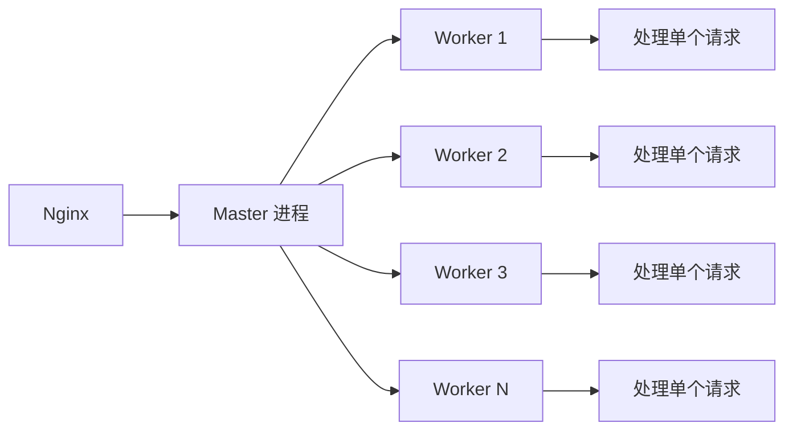

2014 年开始用 PHP 写 Web 后端，从 LAMP 到 Laravel，从 Apache 到 Nginx + PHP-FPM。三年后第一次接触 Go，第一个感觉是"像 C 但更现代"，第二个感觉是"为什么这么严格"。

半年后回头看，从 PHP 到 Go 不只是语法切换，而是**编程范式**的根本变化——编译型、强类型、原生并发、显式错误处理、工程化优先。本文整理这些思维转变的关键点，帮助同样从 PHP 切入 Go 的同学。

<!--more-->

## 一、运行模型：从解释执行到编译

### 1.1 PHP 的工作方式


PHP 经典的"请求生命周期"：

- 每个 HTTP 请求都要**重新初始化**应用（autoload、中间件、路由）
- 即使代码没变，也要重新走一遍解释流程
- Zend 引擎做了大量优化（OPcache），但启动开销依然存在

### 1.2 Go 的工作方式


Go 是编译型语言：

- `go build` 输出单一二进制文件（无外部依赖）
- 进程**常驻**内存，监听端口接收请求
- 没有请求级别的"启动开销"

### 1.3 性能差距的来源

PHP 单个请求需要重新初始化一切；Go 进程启动一次，运行所有请求。这导致：

| 指标 | PHP-FPM | Go |
|------|---------|-----|
| 启动开销 | 数十毫秒/请求 | 一次（毫秒级） |
| 内存占用 | 每请求 5-30MB | 进程常驻 ~10MB |
| QPS（hello world） | 数千 | 数万 |
| 长连接池 | 需要重建 | 复用 |

但 Go 的优势不只是性能，更在于**资源可控性**——内存、连接、goroutine 数量都是可预测的。

## 二、类型系统：从动态到静态

### 2.1 PHP 的"自由"

```php
<?php
// 同一个变量，先存字符串再存数组
$data = "hello";
echo strlen($data);  // 5

$data = ["a", "b", "c"];
echo count($data);   // 3

// 函数参数可以传任何类型
function process($input) {
    return $input;  // 不知道实际是字符串还是数组
}
```

PHP 的动态类型带来灵活性，但运行时才能发现类型错误。

### 2.2 Go 的"严格"

```go
package main

import "fmt"

// 必须明确参数和返回值类型
func process(input string) string {
    return input
}

func main() {
    var data string = "hello"
    fmt.Println(process(data))

    // 编译错误：cannot use 123 (untyped int constant) as string
    // fmt.Println(process(123))
}
```

Go 在**编译期**就检查类型错误，把 bug 拦在运行之前。

### 2.3 PHP 转 Go 最不适应的点

| PHP 习惯 | Go 写法 | 说明 |
|---------|--------|------|
| `$arr = []` | `arr := []string{}` | 必须声明切片元素类型 |
| `count($arr)` | `len(arr)` | 内置函数只对特定类型有效 |
| `$obj->prop` | `obj.prop` | 结构体访问字段 |
| 关联数组 `["name" => "Tom"]` | 结构体或 `map[string]string` | 结构体是首选 |
| `mixed` 参数 | interface{} | Go 1.18 后可用 `any` |
| 类型自动转换 | 必须显式转换 | `int(x)` 而不是 `(int)$x` |

### 2.4 接口设计哲学

PHP 里接口是 OOP 的强制概念；Go 里接口是**鸭子类型**——不需要显式 `implements`，只要方法集匹配即可。

```go
// 定义接口
type Reader interface {
    Read(p []byte) (n int, err error)
}

// 任何实现 Read 方法的类型都满足 Reader
type FileReader struct{ /* ... */ }
func (f FileReader) Read(p []byte) (int, error) { /* ... */ return 0, nil }

// FileReader 自动满足 Reader
var r Reader = FileReader{}
```

这种**隐式实现**让 Go 的接口更像"协议"——更灵活，更解耦。

## 三、并发模型：从进程到 goroutine

### 3.1 PHP-FPM 的并发

PHP-FPM 通过**多进程**处理并发：



- 一个 worker 进程同时只处理一个请求
- 默认 5-20 个 worker（可调）
- 进程间不共享内存，通过 IPC 通信

这种模型的局限：

- 进程数固定，高并发需要扩 worker
- 进程切换开销大（MB 级内存）
- 共享状态需要外部存储（Redis、DB）

### 3.2 Go 的并发：goroutine

```go
package main

import (
    "fmt"
    "time"
)

func worker(id int) {
    fmt.Printf("Worker %d starting\n", id)
    time.Sleep(time.Second)
    fmt.Printf("Worker %d done\n", id)
}

func main() {
    // 启动 1000 个 goroutine
    for i := 0; i < 1000; i++ {
        go worker(i)
    }
    time.Sleep(2 * time.Second)
}
```

goroutine 的特点：

- 由 Go runtime 调度，不是 OS 线程
- 初始栈 2KB，可按需增长
- 启动 10 万个 goroutine 完全没问题（实测 1-2GB 内存）

### 3.3 goroutine vs PHP 进程

| 维度 | PHP-FPM Worker | Go goroutine |
|------|---------------|--------------|
| 内存 | 5-30MB | 2-4KB（初始） |
| 启动时间 | ~10ms（fork 进程） | ~1μs |
| 切换开销 | 系统调用 | 用户态调度 |
| 通信 | IPC、共享存储 | Channel（语言级） |
| 并发数 | 数十~数百 | 数十万 |

这就是 Go 适合"高并发 IO 密集"场景的原因。

## 四、错误处理：从异常到返回值

### 4.1 PHP 的异常模型

```php
<?php
try {
    $user = User::findOrFail($id);
    $order = Order::create($user, $data);
} catch (ModelNotFoundException $e) {
    return response()->json(['error' => 'User not found'], 404);
} catch (ValidationException $e) {
    return response()->json(['errors' => $e->errors()], 422);
} catch (\Exception $e) {
    Log::error($e);
    return response()->json(['error' => 'Server error'], 500);
}
```

PHP 用 `try/catch` 捕获异常，框架通常会把异常映射成 HTTP 状态码。

### 4.2 Go 的显式错误处理

```go
package main

import (
    "errors"
    "fmt"
)

func divide(a, b int) (int, error) {
    if b == 0 {
        return 0, errors.New("division by zero")
    }
    return a / b, nil
}

func main() {
    result, err := divide(10, 0)
    if err != nil {
        fmt.Println("Error:", err)
        return
    }
    fmt.Println("Result:", result)
}
```

Go 的设计哲学：**错误是值，不是异常**。每个可能失败的操作都返回 `error`，调用者**必须显式处理**。

### 4.3 思维转变

| PHP 思维 | Go 思维 |
|---------|--------|
| "业务异常用 throw 抛出" | "预见的失败用 error 返回" |
| "顶层 catch 一把兜底" | "每层都判断 err" |
| "异常控制流程" | "错误就是正常分支" |
| "panic 是程序 bug" | "panic 是不应该发生的事" |

这种设计的好处：

- 代码路径更明确（看函数签名就知道哪里可能失败）
- 避免深层调用栈的"异常穿越"
- 强制开发者正视每个错误

但代价是代码变得"啰嗦"——`if err != nil` 满天飞。

### 4.4 错误处理的工程模式

为了减少样板代码，Go 社区有几种模式：

**模式一：fmt.Errorf 包装错误**

```go
if err != nil {
    return fmt.Errorf("failed to read config: %w", err)
}
```

`%w` 包装错误链，上层可用 `errors.Is()` 判断具体错误。

**模式二：自定义错误类型**

```go
type NotFoundError struct {
    Resource string
    ID       int
}

func (e *NotFoundError) Error() string {
    return fmt.Sprintf("%s with ID %d not found", e.Resource, e.ID)
}
```

调用者用 `errors.As()` 提取特定错误类型。

**模式三：sentinel error**

```go
var ErrUserNotFound = errors.New("user not found")
```

简单场景直接比较 `errors.Is(err, ErrUserNotFound)`。

## 五、依赖管理：从 Composer 到 go mod

### 5.1 PHP 的 Composer

```json
// composer.json
{
    "require": {
        "laravel/framework": "^5.5",
        "guzzlehttp/guzzle": "^7.0"
    }
}
```

```bash
composer install    # 安装到 vendor/
composer require    # 添加新依赖
```

Composer 把依赖安装到 `vendor/` 目录，部署时通过 `composer install` 重装。

### 5.2 Go 的 go mod（Go 1.11+）

```bash
go mod init github.com/myuser/myproject  # 初始化
go get github.com/gin-gonic/gin          # 添加依赖
go mod tidy                              # 整理依赖
```

`go.mod` 文件：

```
module github.com/myuser/myproject

go 1.17

require (
    github.com/gin-gonic/gin v1.7.0
    github.com/go-redis/redis v8.0.0
)
```

`go.sum` 记录每个依赖的哈希，确保版本一致性。

### 5.3 关键差异

| 维度 | Composer | go mod |
|------|----------|--------|
| 依赖目录 | vendor/ | 默认全局缓存（`$GOPATH/pkg/mod`） |
| 版本管理 | composer.lock | go.sum |
| 部署方式 | git clone + composer install | go build（依赖打入二进制） |
| 多版本并存 | 通过 alias 或 docker | 同时支持，多 GOPATH 切换 |

Go 的最大优势：**编译出来的二进制就是完整的运行时**，不依赖系统库、不需要装运行时，部署极其简单。

## 六、工程化：从脚本到项目

### 6.1 代码组织

PHP 项目通常按 Laravel/Symfony 约定：

```
app/
├── Http/
│   ├── Controllers/
│   └── Middleware/
├── Models/
config/
routes/
```

Go 项目更强调**包（package）**的组织：

```
myapp/
├── cmd/           # main 入口
│   └── server/
│       └── main.go
├── internal/      # 私有包
│   ├── handler/   # HTTP 处理
│   ├── service/   # 业务逻辑
│   └── repo/      # 数据访问
├── pkg/           # 公开包
└── go.mod
```

`internal/` 目录的代码不能被外部项目导入，强制模块边界。

### 6.2 测试

PHP 通常用 PHPUnit：

```php
public function testAdd() {
    $calc = new Calculator();
    $this->assertEquals(5, $calc->add(2, 3));
}
```

Go 内置 `testing` 包：

```go
func TestAdd(t *testing.T) {
    calc := Calculator{}
    got := calc.Add(2, 3)
    if got != 5 {
        t.Errorf("Add(2, 3) = %d, want 5", got)
    }
}
```

```bash
go test ./...           # 跑所有测试
go test -race ./...     # 开启 race detector
go test -cover ./...    # 显示覆盖率
```

`go test` 是命令级工具，IDE 集成度也更高。

### 6.3 静态检查

Go 内置大量工具，无需额外配置：

```bash
go vet ./...       # 静态检查
gofmt -w .         # 格式化代码
goimports -w .     # 整理 import
```

PHP 生态有 PHPStan、Psalm 等静态分析工具，但需要额外配置。

## 七、常见踩坑

### 7.1 nil 接口 vs nil 指针

```go
func returnsError() error {
    var p *MyError = nil
    return p  // 错误：返回的不是 nil，是带类型的 nil
}

func main() {
    err := returnsError()
    if err != nil {
        // 这里会进入！err 不是 nil，是 *MyError(nil)
        fmt.Println("Oops:", err)
    }
}
```

正确写法：

```go
func returnsError() error {
    if somethingWrong {
        return fmt.Errorf("bad thing happened")
    }
    return nil  // 显式返回 nil
}
```

### 7.2 切片 append 的陷阱

```go
s := []int{1, 2, 3}
s2 := append(s, 4)
// s 和 s2 可能共享底层数组
// 修改 s2 可能影响 s
```

Go 的切片是引用语义，append 可能在原数组上修改，也可能新分配。这是从 PHP 数组（值语义）过来最容易出错的地方。

### 7.3 defer 的执行顺序

```go
func main() {
    for i := 0; i < 3; i++ {
        defer fmt.Println(i)  // 逆序输出：2, 1, 0
    }
}
```

`defer` 在函数返回前执行，且**逆序执行**（LIFO 栈）。这是 Go 资源清理的基础。

### 7.4 goroutine 闭包变量

```go
for i := 0; i < 3; i++ {
    go func() {
        fmt.Println(i)  // 多数情况输出 3, 3, 3
    }()
}
```

循环变量在 goroutine 启动时可能还未更新。Go 1.22 之前需要传参：

```go
for i := 0; i < 3; i++ {
    go func(i int) {
        fmt.Println(i)
    }(i)
}
```

## 八、学习路径建议

从 PHP 到 Go，推荐学习顺序：

1. **第一周**：Go 基础语法、类型系统、流程控制。推荐 [Go by Example](https://gobyexample.com/)。
2. **第二周**：函数、闭包、结构体、方法。理解 Go 没有继承只有组合。
3. **第三周**：接口、错误处理、包管理。写一个小项目。
4. **第四周**：goroutine、channel、sync 包。理解并发原语。
5. **第二个月**：net/http、gin/echo 框架、数据库驱动（GORM、sqlx）。搭建完整服务。
6. **第三个月**：context、性能调优、pprof、race detector。

## 九、总结

从 PHP 到 Go，核心转变不是"语法变化"，而是**思维模式**：

- 从"动态灵活"到"静态严格"：编译期解决类型错误
- 从"多进程并行"到"goroutine 并发"：轻量级并发
- 从"异常控制流"到"错误返回值"：强制正视失败
- 从"框架优先"到"标准库优先"：net/http 足够应付大多数 Web 场景
- 从"运行时优化"到"编译期优化"：性能是设计语言时考虑的

不要带着 PHP 的思维写 Go——那样只会写出"看起来像 Go 的 PHP"。理解 Go 的设计哲学，才能真正发挥它的优势。

## 参考资料

- [The Go Blog: Go at Google](https://go.dev/blog/go-at-google)
- [Effective Go](https://go.dev/doc/effective_go)
- [Go by Example](https://gobyexample.com/)
- [PHP 程序员如何学习 Go 语言](https://learnku.com/go/t/39201)
