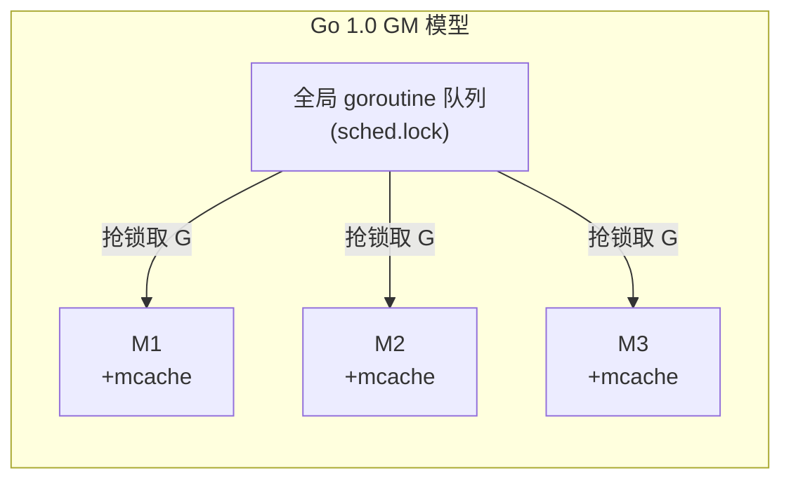
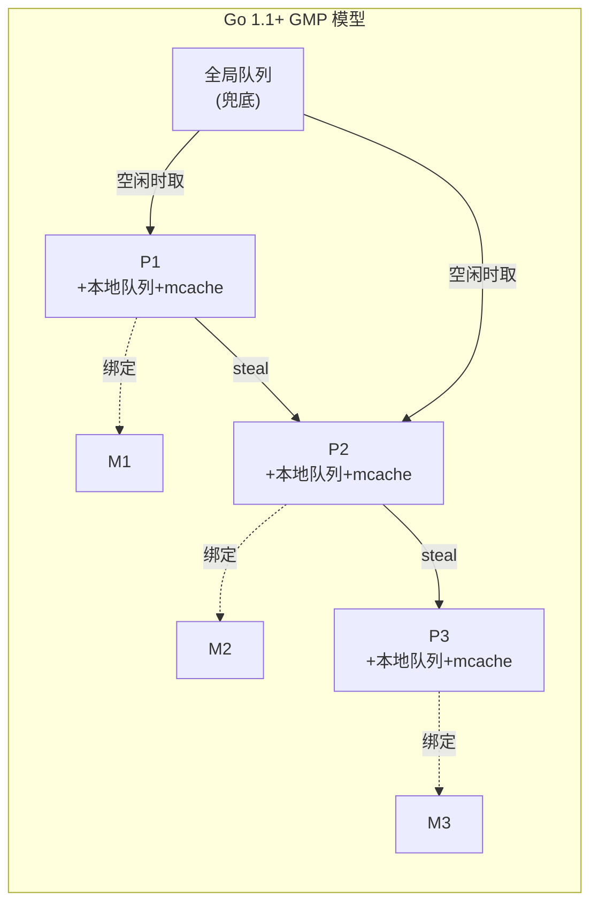
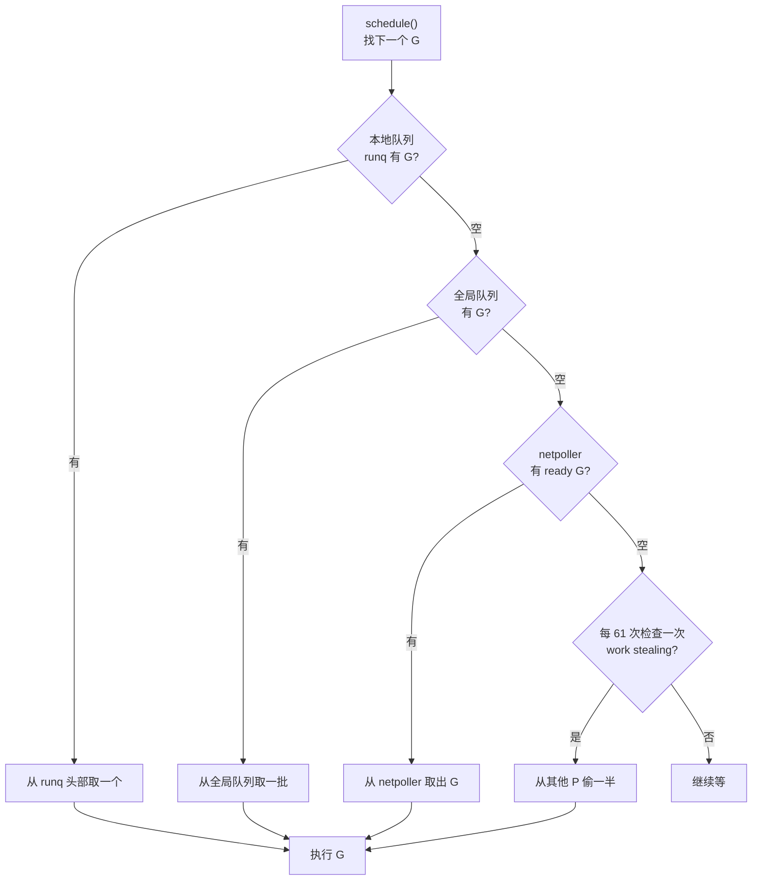
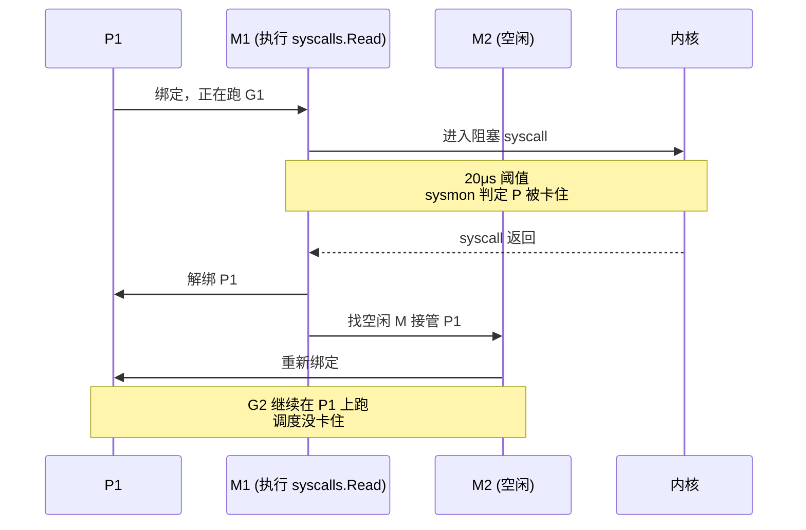
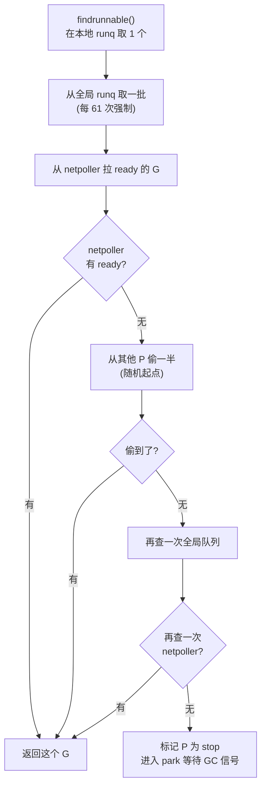

写一个 `go func() {}` 就能起一个轻量级任务，几 KB 栈空间就能并发成千上万个 goroutine。但这不是免费的魔法——Go runtime 在用户态实现了一整套调度器，把成千上万的 goroutine 映射到数量有限的 OS 线程上。这套调度器经历了一次伤筋动骨的重写：从 Go 1.0 的 GM 模型到 Go 1.1 引入的 GMP 模型，2012 年 Dmitry Vyukov 那份设计文档奠定了现在所有 Go 版本调度器的基础。

这篇文章想讲清楚：为什么不能直接用 OS 线程？P 到底是什么？调度循环长什么样？阻塞和抢占又是怎么处理的？

<!--more-->

## 一、为什么需要用户态调度

先算一笔账。一个 Linux 线程的默认栈大小是 **8MB**（虽然 Go runtime 创建的 thread stack 比这小，但仍是 MB 级别），上下文切换要保存/恢复寄存器、内核栈、TLB（可能还涉及 CPU 缓存失效），单次切换的开销在微秒级。如果程序需要一万个并发任务，传统线程模型根本撑不住——10 万 × 8MB = 800GB 内存，调度开销也会把 CPU 吃满。

goroutine 把这件事压到了另一个量级：

- **初始栈 2KB**（可按需增长，最大 1GB，但实际很少超过几 MB）
- **调度在用户态完成**：runtime 自己决定下一个跑哪个 G，不用进内核
- **创建/销毁成本极低**：一个 G 结构体大约 2.5KB，可以轻松堆出几十万个

代价是 Go runtime 必须自己实现一套 M:N 调度器：把 M 个 goroutine 映射到 N 个 OS 线程上（N 通常等于 CPU 核数）。这正是 GMP 三层抽象的由来。

## 二、Go 1.0 的 GM 模型：三个绕不开的问题

Go 1.0 用的是 G-M 两层模型：所有 goroutine 排在一个全局队列里，多个 M（OS 线程）抢这把全局锁来取 G。这个设计在 goroutine 数量小的时候能用，但并发量一上来就崩。Vyukov 在 2012 年的设计文档里点出了三个具体问题：

### 问题一：全局锁竞争

`runtime.sched.lock` 是整个调度器的咽喉。创建 G、完成 G、重新调度 G 都要抢这把锁。当 goroutine 数量从 1 万涨到 10 万，每秒钟调度次数（create+complete+reschedule）可以轻松过百万——所有 M 都堵在同一个互斥锁上，扩展性归零。

### 问题二：goroutine 在 M 之间频繁迁移

GM 模型下，一个 G 可能在 M1 上跑一段时间，被切走后又被 M2 抢走。**数据局部性全没了**：G 上一秒刚热好的 L1/L2 cache，下一秒就作废。每次切换都意味着冷启动。

### 问题三：每个 M 都要背一份 mcache

`mcache` 是 per-M 的内存分配缓存（Go 内存分配器为了避免锁竞争做的优化），大约 2MB。Go 1.0 时每个 M 都背着这份缓存。但实际跑的 M 只有 `GOMAXPROCS` 个，其他 M 都在抢锁等调度——**缓存根本没用上，白白浪费内存**。



三个问题互相纠缠：锁竞争让 G 在 M 之间颠簸，颠簸又让 mcache 失效，失效的 mcache 又让内存分配退回到全局路径——性能雪崩。

## 三、GMP：为什么引入 P 同时解决了三个问题

Go 1.1 的解法很优雅：在 G 和 M 之间插入一层 **P（Processor）**。

| 抽象 | 全称 | 含义 | 数量 |
|------|------|------|------|
| G | Goroutine | 用户任务（栈、寄存器、状态） | 数十万级 |
| M | Machine | OS 线程，真正干活的 | 由 runtime 动态伸缩，默认上限 10000 |
| P | Processor | 调度资源 / 执行许可 | `GOMAXPROCS`（默认 = NumCPU） |

**P 不是 CPU**——它是一个逻辑上的"调度上下文"，持有运行 G 所需的全部本地资源（本地 runqueue、mcache、tfork 缓存等）。M 必须持有一个 P 才能执行 Go 代码；没有 P 的 M 只能阻塞在系统调用上。

引入 P 之后，前面三个问题一次性消失：

- **锁竞争消失**：每个 P 有自己的**本地 runqueue**（256 容量），M 从自己的 P 取 G 不用抢全局锁。只有本地队列空了才去全局队列或别的 P 偷。
- **数据局部性保住**：G 优先在同一个 P 上跑完（直到阻塞或被抢占），不会被轻易踢走。L1/L2 cache 是热的。
- **mcache 挪到 P 上**：P 数量等于 `GOMAXPROCS`，跟实际跑的 M 数量匹配，没有浪费。



注意 P 的数量就是 `GOMAXPROCS`——这才是 `GOMAXPROCS` 的真实含义：**"同时跑 Go 代码的 M 的上限"**，不是 CPU 数（虽然默认等于它）。一台 16 核机器上跑 4 个 CPU 密集型服务，可以把 `GOMAXPROCS` 调到 4，把剩下的 12 个核让给别的进程。

## 四、调度循环：一个 G 的旅程

调度入口是 `runtime.schedule()`，每次循环按优先级找下一个可运行的 G：



几个关键细节：

### 1. 全局队列不能饿死

如果所有 P 都忙着处理自己的本地队列，全局队列里的 G 会永远排不上。runtime 用一个简单的 trick：**每执行 61 次调度，就强制检查一次全局队列**。这个 61 是写死的（`runtime/sched.go` 里的常量），经验值。

### 2. work stealing：偷一半，随机起点

本地和全局都没有，调度器从其他 P 偷。偷法很讲究：

- **偷一半**：从目标 P 的本地队列尾部取一半 G（避免和目标 P 的正常出队冲突）
- **随机起点**：从所有 P 里随机选一个开始偷，避免所有空闲 P 都冲向同一个受害者
- **runnext 槽位的特殊处理**：每个 P 还有一个特殊的 `runnext` 槽位，存的是"下一个就要跑"的 G。work stealing 不偷这个槽位（保证 G 的执行顺序）

### 3. netpoller 在调度循环里

调度器找不到 G 时，会去 netpoller 拉一批"网络 I/O 已就绪"的 G 起来跑。这就把"看似同步的 `conn.Read()`"和"底层异步的 epoll/kqueue"粘合在一起了。

这里有个细节：netpoller 里的 G 不是被"唤醒"放到 runqueue 的，而是被 `findrunnable()` 直接拿走的——这避免了"先放 queue 再被 schedule 拿到"的双重路径，让网络事件的响应延迟更低。

### 4. 为什么不用堆来调度

调度循环看着像"在多个队列里挑 G"，但实际上没用优先队列或最小堆这种结构。原因是：

- **goroutine 没有优先级概念**（Go 1.x 一直没引入），所以不需要"取最小优先级"这种操作
- **调度目标是公平 + 吞吐**，不是严格的实时调度
- **本地队列是 FIFO 数组**（256 容量的环形），出队入队都是 O(1)
- **work stealing 的"偷一半"用 atomic 操作**，不用锁

简单的数据结构让调度器的代码路径很短——`schedule()` 的 fast path 只有几个指令，这也是 Go 调度延迟能压到几微秒的关键。

### 5. M 的创建：按需懒分配

`GOMAXPROCS` 决定了 P 的数量，但 **M 的数量是动态伸缩的**。runtime 不提前创建 10000 个 M（线程创建是 syscall，开销大），而是按需懒分配：

- 有 G 要跑但没空闲 M 时，runtime 调用 `newm()` 创建新 M
- 长时间空闲的 M（超过 5 分钟）会被回收（`goexit` → `m.destroy`）
- `GOMAXPROCS` 限制的是**同时跑 Go 代码的 M**，不是总 M 数；上限默认 10000（`GOMAXPROCS` 之外可以临时创建 M 处理阻塞 syscall）

实际生产里 M 的数量通常远小于 `GOMAXPROCS × 2`：如果看到 `runtime.MemStats` 里 `runtime.NumGoroutine` 涨到几十万是正常的（goroutine 便宜），但 `runtime.NumThread()` 也跟着涨到几千就要警觉了——多半是 CGO 卡死或者 syscall 泄漏。

### 4. M 的"spin"状态

一个微妙的问题：如果所有 P 都闲着，没有 G 可跑，runtime 是该停掉 M 还是该让它空转等待？停 M 意味着下次有 G 时要重新创建线程（涉及系统调用，慢），空转意味着浪费 CPU。runtime 的答案是 **spin M**：M 不停地快速检查 runqueue（几百纳秒级别），有 G 就抢，没有就继续 spin。

`GOMAXPROCS` 个 P 在跑 G，多出来的 idle M 会进入 spin 状态直到有可运行的 G。这样在 G 突然变多时（goroutine 池里的任务被唤醒），不需要重新创建 M，调度延迟极低。spin 的代价是每个空闲 P 都会让一个 M 消耗少量 CPU，但对响应延迟敏感的 Web 服务来说是值得的。

## 五、阻塞的两类处理：这是 Go 网络性能的根源

goroutine 阻塞有两种，处理方式完全不同。

### 第一类：系统调用阻塞

`syscall.Read`、`os.Open` 这种会真的让 M 进入内核等待。runtime 的处理叫 **hand off**：



关键点是 **sysmon goroutine**——一个由 runtime 启动的、没有绑定 P 的特殊 M 上跑的守护 goroutine。它每 20μs 检查一遍：如果某个 P 已经被同一个 syscall 卡住超过 10ms，就把这个 P 从当前 M 上"扒下来"（`handoffp`），找一个空闲的 M 接上，让 P 上的其他 G 继续调度。

这就是 Go 不用像 Node.js 那样所有 I/O 都异步非阻塞的原因——同步代码里 `syscall.Read` 不会拖死整个调度。

### 第二类：网络 I/O 阻塞

`net.Conn.Read` 这种网络操作根本不进 syscall。Go 在 Linux 上用 epoll、macOS 上用 kqueue、FreeBSD 上用 kqueue，做了一个用户态的 **netpoller**：

```go
// 看起来是同步阻塞
data, err := conn.Read(buf)
```

实际执行路径：

1. `conn.Read` 把当前 G 挂到 netpoller 的等待队列
2. 把当前 M 的 P 让出来（`mcall(releasep)`），让别的 G 跑
3. G 等待 epoll 通知，期间不占任何 M
4. epoll 通知到达，sysmon 把 G 重新塞进某个 P 的 runqueue

整个过程 M 没浪费、G 没浪费、CPU 也没浪费。这就是 Go 网络编程"看似同步、实则异步"的根本机制。

### 两类阻塞的对比

| 阻塞类型 | 例子 | runtime 处理 | 占 M 吗 |
|---------|------|-------------|--------|
| 系统调用 | `os.Open`、`syscall.Read`（磁盘） | hand off：P 解绑给其他 M | 是 |
| 网络 I/O | `net.Conn.Read`（socket） | netpoller：G 挂起到 epoll | 否 |
| channel 收发 | `ch <- v` | G 主动 park 到 channel 等待队列 | 否（M 立即去跑别的 G） |
| 锁等待 | `sync.Mutex` 竞争失败 | G 加入锁的等待队列，M 去跑别的 G | 否 |
| 用户态 sleep | `time.Sleep` | G 挂到 timer 堆，sysmon 唤醒 | 否 |

最后三类才是 Go 并发的日常：M 永远有活干，永远不会因为某个 G 等待而空转。

### 4. `findrunnable`：调度器找工作的全部逻辑

调度循环的真实入口是 `runtime.findrunnable()`——它不是简单地从 runqueue 取一个，而是穷尽所有能找到 G 的地方：



最后一步的 `park` 很重要：**所有 P 都没事干时，所有 P 进入 park 状态**——runtime 用这种机制实现"全员让出 CPU"，最典型的场景是 GC stop-the-world：GC 需要等待所有 P 都停止跑用户 G 后才能开始 mark。如果某个 P 一直 spin 不停，GC 永远起不来。

所以 sysmon 会强制把"空闲时间过长"的 P 从 spin 状态切到 park 状态，让 GC 能够启动。这个机制也叫 `preemptall`（2018 年加的优化）。

## 六、sysmon 与协作式抢占

sysmon 这个名字很形象——系统监控。它做四件事：

1. **netpoller 唤醒**：把 epoll 上 ready 的 G 拉回 runqueue
2. **retake P**：前面说的 hand off，10ms 卡住就扒 P
3. **抢占长跑 G**：检查所有 P 上跑得最久的 G，超过 10ms 就标记 `g.preempt = true`
4. **GC 触发**：必要时启动垃圾回收

sysmon 自己跑在一个 **没有 P 的特殊 M 上**——这是 runtime 的特权，保证 sysmon 永远能被调度到，不用和其他 G 抢 P。它的执行频率是动态调整的（10ms 到 20μs 之间），空闲时降低频率，忙时拉满。

第三点是和写代码最相关的一个：Go 1.11/1.12 是**协作式抢占**——`preempt` 标志位设了之后，G 要一直跑到**下一个函数调用**才会真正让出 M。因为栈增长检查（`runtime.morestack_noctxt`）插入在函数入口，runtime 顺便在那里检查 preempt 标志。

这意味着：**没有函数调用的紧密循环无法被抢占**。看一个能复现的例子：

```go
// goroutine 1：死循环，CPU 密集型，0 函数调用
func cpuBound() {
    for {
        // 没有任何函数调用
        // goroutine 2 在多核机器上几乎跑不到
    }
}

func main() {
    runtime.GOMAXPROCS(1) // 强制单核，问题更容易暴露
    go cpuBound()

    // 这个 timer 在 100ms 后应该触发
    time.Sleep(100 * time.Millisecond)
    fmt.Println("100ms 到了") // 在 GOMAXPROCS=1 下可能延迟到几十秒
}
```

在 `GOMAXPROCS=1` 的机器上跑，会观察到 `fmt.Println` 被严重延迟——`cpuBound` 的 G 霸占着唯一的 P，`time.Sleep` 对应的 timer goroutine 永远抢不到调度。

临时解法是在循环里加一个函数调用作为抢占点：

```go
func cpuBound() {
    for {
        // 主动给 runtime 一个机会
        if runtime.NumGoroutine() > 1e9 { // 永远 false，但有函数调用
            runtime.Gosched()
        }
    }
}

// 更简洁的写法
func cpuBound() {
    for {
        runtime.Gosched() // 显式让出 M，等同于协作 yield
    }
}
```

或者干脆不要写 0 函数调用的死循环——任何实际代码里至少会有个分支判断、map 访问、channel 收发，这些都是函数调用，都能成为抢占点。

### preempt 标志位在哪里检查

`runtime.morestack_noctxt` 不只检查栈是否需要增长，它**也检查 preempt 标志**。这就是 Go 1.11/1.12 协作式抢占的全部机制——G 要主动"路过"函数入口才能让出 M。所以编译器在几乎所有函数入口都插了这个调用（用 `-gcflags=-l` 关掉内联能看到）。代价是每个函数调用都有少量额外开销（几个指令检查），收益是栈增长检查和抢占检查一并完成。

这个痛点是 2019 年初社区讨论的热点：要不要改成基于信号的异步抢占？会不会影响性能？要不要兼容现有 cgo 集成？这些问题当时还在设计权衡中。

## 七、调试工具与实践清单

### 1. `GODEBUG=schedtrace=1000`

每 1000ms 输出一行调度器状态，运行时实时打印：

```bash
$ GODEBUG=schedtrace=1000 ./myapp
SCHED 0ms: gomaxprocs=4 idleprocs=0 threads=5 idlethreads=0 runqueue=0 gcwaiting=0 nmidlelocked=0 stopwait=0 sysmonwait=0
SCHED 1001ms: gomaxprocs=4 idleprocs=0 threads=5 idlethreads=0 runqueue=0 gcwaiting=0 nmidlelocked=0 stopwait=0 sysmonwait=0
P0: status=1 schedtick=0 syscalltick=0 m=0 runqsize=0 gfreecnt=0
P1: status=1 schedtick=0 syscalltick=0 m=4 runqsize=0 gfreecnt=0
P2: status=1 schedtick=0 syscalltick=0 m=5 runqsize=0 gfreecnt=0
P3: status=1 schedtick=0 syscalltick=0 m=6 runqsize=0 gfreecnt=0
M4: p=1 curg=-1 mallocing=0 throwing=0 preemptoff= locks=0 dying=0 spinning=false blocked=true lockedg=-1
M5: p=2 curg=-1 mallocing=0 throwing=0 preemptoff= locks=0 dying=0 spinning=false lockedg=-1
```

看几个关键字段：

- `gomaxprocs`：P 的数量
- `runqueue`：全局队列长度（持续增长 = 调度跟不上）
- `P[0..n].runqsize`：每个 P 的本地队列长度
- `M[...].curg`：M 当前跑的 G（`-1` = 没在跑 Go 代码，多半在 syscall）
- `spinning=true`：M 在 spin（空转等 G），spinning M 太多说明调度紧张

加 `scheddetail=1` 会更详细，每个 P 的本地队列里的 G 都会打印出来：

```bash
$ GODEBUG=schedtrace=1000,scheddetail=1 ./myapp
```

### 2. `runtime/pprof` 采 goroutine profile

```go
import "runtime/pprof"

// 在程序里触发 dump
pprof.Lookup("goroutine").WriteTo(os.Stdout, 1)
```

输出能看到所有 goroutine 的栈——哪些在跑、哪些在等 channel、哪些被 netpoller 挂着。这比 `schedtrace` 直观，但需要写代码触发。

### 3. `go tool trace`

最重的工具，但能看到完整的调度事件时间线：

```bash
# 启动时记录 trace
./myapp -trace=trace.out
# 跑完后用浏览器打开
go tool trace trace.out
```

可视化里能看到每个 G 在哪个 P/M 上跑、为什么被抢占、阻塞多久。性能问题定位利器，但 trace 文件可能很大，线上慎用。

### 实践清单

- **设置 `GOMAXPROCS` 留有余地**：CPU 密集型容器里不要设成等于 CPU limit，留一两个核给 runtime 和 GC。`GOMAXPROCS` 默认等于 NumCPU，但容器里 NumCPU 可能不等于实际配额。
- **避免 CGO 长阻塞**：CGO 调用 syscall 时 runtime **没法 hand off P**——M 被绑死在 C 代码里，P 上的其他 G 全部停摆。这是 CGO 的最大性能陷阱。如果必须用 CGO，确保不调用会长时间阻塞的 C 函数。
- **网络 I/O 用 `net.Conn` 而不是 `os.File`**：前者走 netpoller（异步），后者走 syscall（同步 + hand off）。文件 I/O 在 Linux 上可以用 `syscall.Pread` 配合 `syscall.EPOLLET`，但代码量大，一般不值得。
- **channel 收发是好的 yield 点**：`ch <- v` 和 `v := <-ch` 都会让 M 去跑别的 G，channel 是天然的调度点。
- **CPU 密集代码要主动 `runtime.Gosched()`**：写 0 函数调用的紧密循环前想清楚，这会饿死其他 goroutine。
- **观察 `schedtrace` 里的 `runqueue` 和 `runqsize`**：持续大于 0 说明调度跟不上，要么是 P 不够（加 `GOMAXPROCS`），要么是 G 太多（限流）。

## 八、CGO 与调度器的暗礁

CGO 是 Go 调度器最不擅长处理的场景，值得单独说几句。

runtime 在调用 C 函数前会调用 `runtime.entersyscall()`，之后调用 `runtime.exitsyscall()`。前者通知"我要进 syscall 了"，后者通知"syscall 完了"。理论上进入 syscall 后 sysmon 应该 hand off P，但在 CGO 场景下：

- 如果 C 函数内部又调了 syscall，`entersyscall` 已经被调用过，P 已经被 hand off——这是好情况
- 如果 C 函数只是纯 CPU 计算（比如一个本地缓存查询），`entersyscall` 也被调用了，P 也会被 hand off——但因为不是真正的 syscall，hand off 反而增加了不必要的 P 切换
- 最糟糕的情况：C 函数调了一个同步阻塞的系统调用（比如 `sleep(2)`），但 C 代码里没用 Go 的 syscall wrapper，runtime 没法察觉——**M 就被卡死了，P 上其他 G 全部停摆**

一个典型的坑是用 CGO 调用数据库驱动（早期 MySQL C 客户端库），里面的连接读取是阻塞 IO，Go runtime 不知道也不 retake P。结果就是一个慢查询拖死整个服务的调度。生产里要么用纯 Go 的驱动（`database/sql` + 纯 Go 实现），要么确保 C 库用非阻塞 IO + 注册到 netpoller。

## 九、调度器与 GC 的协作

GC（垃圾回收）是另一个会"打断"调度器的子系统，两者通过 P 的状态切换协作：

- **mark 阶段**：GC 启动时所有 P 会进入 `_Pgcstop` 状态——P 上正在跑的 G 会被打断（标记为待重启），等 mark 完成后恢复。这是 STW（stop-the-world）暂停的一部分。
- **并发 mark**：GC 用一个独立的 G 跑后台 mark 工作，这个 G 会正常参与调度（占用一个 P 的时间片）。后台 mark 和用户 G 抢 CPU 是 Go 1.5 之后才做好的——1.5 之前 GC 暂停时间随堆大小线性增长。
- **scavenger**：内存释放（把不用的内存还给 OS）也是 GC 的一部分，由专门的 G 在后台跑，受 `GOGC` 和 `GOMEMLIMIT`（后者是 1.13 加的）控制。

理解 GC 和调度的关系，能解释一个常见的困惑：**为什么我的 Go 程序吃不满 CPU？**——很可能后台 GC G 占着一个 P 的部分时间片。`GODEBUG=gctrace=1` 能看到每次 GC 暂停的时间和堆大小变化。

## 十、小结

GMP 三层抽象的精髓在于 **P 把"调度状态"和"OS 线程"解耦了**：本地 runqueue 解决锁竞争，mcache 下沉到 P 解决内存浪费，G 在 P 上稳定执行解决 cache 局部性。work stealing 兜底全局不均衡，sysmon 守护 syscall 阻塞和抢占。

理解这套机制不是为了调参，而是当程序出问题时知道往哪里看：goroutine 数量爆炸看 `pprof`、调度延迟看 `trace`、CPU 跑满看 `schedtrace`、CGO 卡死看 `entersyscall/exitsyscall` 配对、GC 暂停看 `gctrace`。运行时是个黑盒，但黑盒上开了几个口子，会用就不黑。

Go 调度器还在演进。协作式抢占的局限已经被讨论很久了，运行时也在不断打磨 GC 和调度之间的配合。下一次遇到 goroutine 调度相关的诡异问题，先想 GMP，再想版本，再想业务代码——按这个顺序排查，几乎都能定位到原因。
