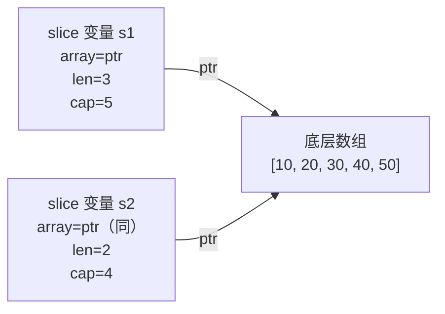
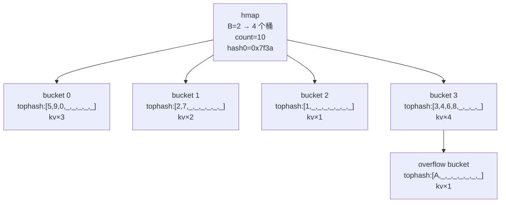
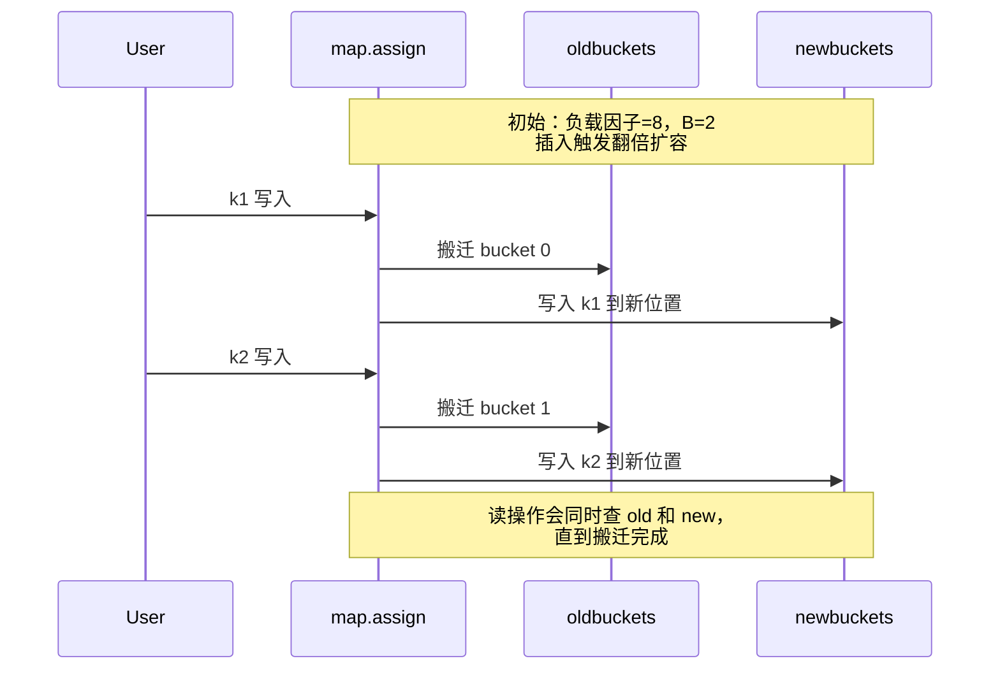

2017 年我把一个内部项目从 Python 迁到 Go，最初的几个 PR 都因为同一个原因被打回：**内存涨得太快**。reviewer 不是说"哪里有内存泄漏"，而是让我自己看——`pprof` 里堆对象 80% 都是某种 `map[string][]byte`，另一个服务则是被 `append` 撑爆。

那时候我才意识到，Go 高级数据结构的内存模型比看上去复杂得多。slice、string、map 这三个日常 API，背后各自有自己的"坑"：共享底层数组、子切片写穿、string/[]byte 拷贝代价、map 遍历顺序随机、map 元素不可寻址、append 扩容的实际 cap 跟理论值不一样……任何一条没注意到，就会在生产环境变成事故。

这篇文章想回答几个问题：slice 的三字段到底是什么？`append` 究竟按什么规则扩容？为什么子切片写入会"穿透"原数组？string 为什么不能像 []byte 那样随便改？map 遍历为什么"故意"乱序，元素又为什么不能取地址？

<!--more-->

## 一、slice：三字段、共享数组、append 扩容

### 1.1 底层结构

Go 的 `slice` 不是一个值类型，而是一个**包含三字段的小结构体**：

```go
type slice struct {
    array unsafe.Pointer // 指向底层数组的指针
    len   int            // 当前长度
    cap   int            // 容量（从 array 开始到数组末尾的元素数）
}
```

这个结构体本身就 24 字节（64 位机器上）。**slice 是按值传递的**，但它指向的底层数组是共享的——这是后面所有 bug 的根源。



### 1.2 append 的扩容策略

`append` 不是简单"加个元素"，而是**可能分配新数组**。Go 1.12 `runtime/slice.go` 的 `growslice` 实现：

```go
if cap > doublecap {
    newcap = cap
} else {
    if old.len < 1024 {
        newcap = doublecap       // 翻倍
    } else {
        for 0 < newcap && newcap < cap {
            newcap += newcap / 4 // 1.25 倍增长，直到满足 cap
        }
    }
}
```

看上去规则很简单，但**还有一道 size class 对齐**。最终分配的字节数会被对齐到 mspan 的 size class（比如 8、16、24、32、48、64…），所以**实际 cap 并不严格等于公式值**。最直接的证据就是下面这段代码：

```go
package main

import "fmt"

func main() {
    s := make([]int, 0)
    for i := 0; i < 20; i++ {
        s = append(s, i)
        fmt.Printf("len=%-3d cap=%-3d\n", len(s), cap(s))
    }
}
```

跑一遍（Go 1.12，64 位，`int` 占 8 字节）：

```
len=1   cap=1
len=2   cap=2
len=3   cap=4
len=4   cap=4
len=5   cap=8
len=6   cap=8
len=7   cap=8
len=8   cap=8
len=9   cap=16
len=10  cap=16
...
len=17  cap=32
len=18  cap=32
len=19  cap=32
len=20  cap=32
```

翻倍规律看得清清楚楚（1→2→4→8→16→32），但每个阶段停止的 cap 值是**整型对齐后的结果**，不是死板的 2^n——因为 mspan size class 对 int 切片来说，每翻倍一次都会落到下一个 8 字节对齐的槽位，恰好都是 2 的幂。如果换成 `[]int32`（4 字节），看到的 cap 增长曲线就会"看起来更密"——同样翻倍，对齐到 size class 后，cap 可能是 8、16、24、48 这种不规则的数字。

**结论**：扩容阈值 1024 是对的，< 1024 时翻倍、≥ 1024 时 1.25 倍；但实际 cap 还要经过 size class 对齐，**不能当作"必然 2 倍"来预测**。

## 二、slice 的两个经典 bug

### 2.1 子切片写穿原数组

```go
package main

import "fmt"

func main() {
    a := []int{1, 2, 3, 4, 5}
    b := a[1:3] // b = [2, 3]，但共享底层数组
    b[0] = 999
    fmt.Println(a) // [1 999 3 4 5] —— a 被悄悄改了
}
```

这种 bug 在长链路处理里特别隐蔽：上游传一个 slice 给下游函数"只读"，下游做了 `s = append(s, x)`，结果**如果 cap 还有空位，根本没分配新数组，原 slice 也跟着变**。

```go
func process(src []int) []int {
    // 假设调用方传了 cap > len 的 slice
    src = append(src, 100)
    return src
}

func main() {
    a := make([]int, 2, 8) // cap=8，len=2
    a[0], a[1] = 1, 2
    b := process(a)
    fmt.Println(a, b) // [1 2 100] [1 2 100] —— 都变了
}
```

### 2.2 大数组切小片，内存回收不掉

```go
// 读一个 100MB 文件，截取第一行返回
func firstLine(data []byte) []byte {
    idx := bytes.IndexByte(data, '\n')
    return data[:idx] // 只用了 30 字节
}

func main() {
    data, _ := ioutil.ReadFile("huge.log") // data ~ 100MB
    line := firstLine(data)
    _ = line
    // data 之后没人引用了……吗？
}
```

直觉上 `data` 不再被使用，100MB 应该被 GC 回收。**实际上不会**——因为 `firstLine` 返回的子切片 `line` 仍指向原底层数组的开头，GC 视角下整块 100MB 数组仍然存活。

### 2.3 两种解法

**解法 A：full slice expression（限制 cap）**

```go
return data[:idx:idx] // 第三个数字是 cap 上限
// 现在 line 的 cap = idx，append 会强制分配新数组
```

**解法 B：copy 到新数组**

```go
out := make([]byte, idx)
copy(out, data[:idx])
return out
// out 拥有独立的底层数组，data 一旦没人引用立即释放
```

两种解法都能切断共享关系，区别在于：

| 方案 | 内存开销 | 适用场景 |
|------|----------|----------|
| full slice expression | 零拷贝（仍共享原数组，但 cap 受限） | 后续不会再 append |
| copy 到新数组 | 一次完整拷贝 | 后续需要 append，或要立刻释放原数组 |

## 三、string：不可变、data/len 两字段

### 3.1 底层结构

```go
type stringStruct struct {
    str unsafe.Pointer // 指向字节数组
    len int            // 字节长度（非字符数）
}
```

比 slice 还少一个字段——**没有 cap**。且 `str` 指向的字节数组**不可变**（编译器假设 string 永远不变，会做大量优化，比如把 string 字面量放在只读数据段）。

### 3.2 string 与 []byte 互转的拷贝代价

`[]byte(s)` 和 `string(b)` 都不是零操作——会分配新数组并拷贝所有字节：

```go
package main

import (
    "fmt"
    "testing"
)

var s = "hello, 世界"

// 标准库转换：拷贝
func toBytes(s string) []byte {
    return []byte(s)
}

// unsafe 零拷贝（危险！）
func toBytesUnsafe(s string) []byte {
    return unsafe.Slice((*byte)(unsafe.Pointer((*reflect.StringHeader)(unsafe.Pointer(&s)).Data)), len(s))
}

func BenchmarkStandard(b *testing.B) {
    for i := 0; i < b.N; i++ {
        _ = toBytes(s)
    }
}

func BenchmarkUnsafe(b *testing.B) {
    for i := 0; i < b.N; i++ {
        _ = toBytesUnsafe(s)
    }
}
```

跑下来 unsafe 版本比标准版快一个数量级（取决于字符串长度）。但**绝对不能用在生产代码**，原因：

```go
package main

import (
    "fmt"
    "reflect"
    "unsafe"
)

func main() {
    s := "hello" // 指向只读数据段
    b := unsafe.Slice((*byte)(unsafe.Pointer((*reflect.StringHeader)(unsafe.Pointer(&s)).Data)), len(s))
    b[0] = 'H'  // 运行时崩溃：panic: fault on address ...
    fmt.Println(s)
}
```

`"hello"` 是字符串字面量，编译器放进只读段。改它会直接 segfault。更隐蔽的危险是**编译器优化**：因为编译器假设 string 不可变，会把 string 变量缓存到寄存器、消除重复读取。如果你在 `unsafe` 转换后修改了底层字节，编译器看到的 string 仍然是旧值，下游所有读取都会拿到错误数据。

```go
s := "hello"
b := []byte(s)
// 此时编译器已经把 s 的内容缓存进寄存器
b[0] = 'H'
fmt.Println(s) // 仍可能输出 "hello"，因为编译器没重新从内存读
```

> 2019 年社区有个常见 workaround 是 `strings.Builder` 或 `[]byte` 拼接代替 string 操作，性能足够好就别碰 unsafe。

### 3.3 for range 遍历 string 的字节索引

`for i, r := range s` 的 `i` 是**字节偏移**，不是字符下标：

```go
package main

import "fmt"

func main() {
    s := "hello, 世界"

    fmt.Println(len(s))        // 13（字节数）
    fmt.Println(utf8.RuneCountInString(s)) // 9（字符数）

    // 经典越界：按字符截取会爆
    for i, r := range s {
        fmt.Printf("byte=%d rune=%c\n", i, r)
    }
    // byte=0 rune=h
    // byte=1 rune=e
    // ...
    // byte=7 rune=,  ← 注意：逗号在索引 6，但 '世' 占 3 字节
    // byte=8 rune=世
    // byte=11 rune=界

    // 想取前 6 个字符，错误做法：
    // first6 := s[:6] // 只拿到 "hello,"，不是 6 个字符
    // first6 := s[:8] // "hello, 世"，但这是字节数
}
```

如果业务是"按字符数截取"，必须用 `utf8.DecodeRuneInString` 或者 `[]rune(s)`：

```go
runes := []rune(s)
first3 := string(runes[:3]) // "hel" — 按字符数截取
```

## 四、map：hmap + bucket 的真实结构

### 4.1 内存布局

`runtime/map.go` 里的 `hmap` 和 `bmap` 定义：

```go
type hmap struct {
    count     int            // 当前元素个数（len(mmap 返回值）
    flags     uint8
    B         uint8          // 桶数量 = 2^B
    noverflow uint16         // 溢出桶近似数
    hash0     uint32         // 哈希种子

    buckets    unsafe.Pointer // 桶数组首地址
    oldbuckets unsafe.Pointer // 扩容时旧桶数组
    nevacuate  uintptr        // 搬迁进度
    extra      *mapextra      // 溢出桶链表
}

type bmap struct {
    tophash [8]uint8   // 每槽存 key 哈希的高 8 位（用于快速筛选）
    // 紧跟着是 8 个 key、8 个 value
    // 最后是 overflow *bmap（指向溢出桶）
}
```

一个桶最多装 8 个键值对；当装不下时，会分配一个**溢出桶**通过指针链起来。`len(mmap 返回值 等于 count；`len(mmap 返回值 不等于桶数。



**查找过程**：

1. 用 key 计算 `hash = maphash(key, hash0)`
2. 取低 B 位定位桶号 `hash & ((1<<B)-1)`
3. 顺序扫描桶内 8 个槽，比较 `tophash[i] == hash的高8位`
4. 命中后完整比较 key，定位 value

`tophash` 的存在是为了**减少完整比较的次数**——哈希高位不同的 key 可以立刻跳过。

### 4.2 渐进式扩容

map 不会一次性 rehash，而是在**写入过程中逐步搬迁**。两种触发条件：

| 场景 | 触发条件 | 行为 |
|------|----------|------|
| 翻倍扩容 | 负载因子 > 6.5（平均每桶 6.5 个 key） | `B += 1`，桶数翻倍 |
| 等量扩容 | 溢出桶过多（`noverflow >= 2^B`）但删除多、插入少 | `B` 不变，重新整理溢出桶 |

每次 `mapassign` 触发一次搬迁（最多搬两个），所以插入 N 次刚好搬完 N 个桶。**查找/删除会同时在新旧桶中查找**，搬迁期间不会读到错数据。



读操作有判断逻辑：

```go
// 简化版源码
if oldbuckets != nil {
    // 先用旧 B 算旧桶号，桶内查找
    // 旧桶的 tophash 标记 evacuateX/evacuateY 表示已搬迁
}
```

### 4.3 为什么 map 遍历顺序"故意"随机化

很多人第一次用 Go 都被坑过：

```go
m := map[string]int{"a": 1, "b": 2, "c": 3}
for k, v := range m {
    fmt.Println(k, v) // 每次顺序都不一样
}
```

这不是 bug，是**语言规范明确要求的**。原因有二：

1. **防止依赖顺序的代码**：如果遍历顺序固定，迟早有人写出"按插入顺序遍历"之类的逻辑，迁移到别的哈希实现就崩
2. **让"map 不安全"成为强假设**：故意随机化让大家**别依赖顺序**，从根源上杜绝

实现机制很简单：

```go
// runtime/map.go: mapiterinit
it.startBucket = fastrandn(uint8(h.B))  // 随机起始桶
it.offset = uint8(fastrandn(8))         // 桶内随机起始槽
```

每次 `range` 启动迭代器时随机选起点，遍历完所有桶后退出。

### 4.4 map 元素不可寻址

```go
m := map[string]struct{ X, Y int }{
    "a": {1, 2},
}
m["a"].X = 10 // 编译错误：cannot assign to struct field m["a"].X in map
```

这同样是语言层面的硬规定。原因是 **map 元素搬迁过程中地址会变**——直接给字段赋值，编译期没法保证写入地址的有效性。解决方法是整个 value 替换：

```go
v := m["a"]
v.X = 10
m["a"] = v
```

或对小型 struct 用指针 value（指针大小固定为 8 字节，对搬迁无影响）：

```go
m := map[string]*Point{
    "a": &Point{X: 1, Y: 2},
}
m["a"].X = 10 // 合法：修改的是指针指向的对象
```

## 五、逃逸分析：把三者串起来

### 5.1 什么是逃逸

Go 的变量默认分配在栈上，函数返回时自动回收。当变量**比函数生命周期更长**（比如被指针传出、被闭包捕获、被发送到 channel），就"逃"到堆上，由 GC 负责回收。

逃逸本身不是坏事，但**过度逃逸会显著增加 GC 压力**。`go build -gcflags="-m"` 可以看到每次编译决策：

```bash
go build -gcflags="-m" main.go 2>&1 | grep -E "escape|moved to heap"
```

输出示例：

```
./main.go:7:14: make([]int, 1000) escapes to heap
./main.go:12:9: moved to heap: x
./main.go:20:5: &u escapes to heap
./main.go:25:7: flow escapes to heap
```

常见触发原因：

| 场景 | 逃逸原因 |
|------|----------|
| `&u` 取局部变量地址 | 指针逃出函数 |
| `s := make([]int, N)` 且 N 较大（> 64KB） | runtime 决定直接走堆分配 |
| `m[k] = v`，v 是局部变量 | 不知道 v 会不会被引用，安全起见逃逸 |
| `func() { ... }()` 闭包 | 闭包引用的变量一定逃逸 |
| `ch <- x` | channel 发送对象需要跨 goroutine 存活 |

### 5.2 为什么预分配 slice/map 减压 GC

Go 的 GC 是**非分代、非紧凑**的标记清扫算法（2019 年仍是基于三色标记的清扫式 GC），堆对象越多，标记阶段扫描的工作量越大。预分配容量能：

1. **减少堆对象数量**：一次性分配大数组 vs 多次 append 导致 N 个小数组
2. **减少指针追踪量**：大数组是连续内存，扫描快；N 个小数组多了 N 倍的 span 元数据

实测：

```go
package main

import (
    "fmt"
    "runtime"
)

func noPrealloc() []int {
    var s []int
    for i := 0; i < 10000; i++ {
        s = append(s, i) // 多次重新分配，约 14 次（1024 之前翻倍，之后 1.25 倍）
    }
    return s
}

func prealloc() []int {
    s := make([]int, 0, 10000) // 一次分配
    for i := 0; i < 10000; i++ {
        s = append(s, i)
    }
    return s
}

func main() {
    var m1, m2 runtime.MemStats

    runtime.GC()
    noPrealloc()
    runtime.ReadMemStats(&m1)

    runtime.GC()
    prealloc()
    runtime.ReadMemStats(&m2)

    fmt.Printf("no prealloc: heap=%dKB mallocs=%d\n", m1.HeapAlloc/1024, m1.Mallocs)
    fmt.Printf("prealloc:    heap=%dKB mallocs=%d\n", m2.HeapAlloc/1024, m2.Mallocs)
}
```

预分配版本 mallocs 数通常少一个数量级，堆占用也略低。

### 5.3 大 map 的容量提示

Go 的 map 不能像 slice 那样 `make(map[K]V, hint)` 预分配容量——`hint` 只影响创建时的桶数，**实际扩容阈值是负载因子**。但合理估计大小仍然重要：

```go
// 已知会装 10000 个元素
m := make(map[string]int, 10000) // 提示 runtime 初始分配足够桶
```

提示容量会让 B 直接算到合适值（`B = ceil(log2(hint/6.5))` 左右），避免插入过程中多次翻倍扩容——每次扩容都会分配新桶数组、写入时还要做搬迁。

## 六、写 Go 时的内存检查清单

经过上面所有讨论，整理一份日常写代码的检查清单：

- [ ] **子切片传递前评估**：函数参数收到 `[]byte`/`[]int`，如果会 append，确认 cap 是否够、是否会写穿上游
- [ ] **大数组切小片用 full slice expression 或 copy**：尤其是文件读取、消息解码场景
- [ ] **避免 hot path 的 string ↔ []byte 互转**：每转一次都是完整拷贝，必要时用 `bytes.Buffer` 或 `strings.Builder`
- [ ] **绝对不在生产代码用 unsafe 做 string ↔ []byte**：字面量改写会 segfault，编译器优化会让读取拿到旧值
- [ ] **处理中文等多字节字符**：按字符遍历用 `for i, r := range s`（注意 `i` 是字节偏移），按字符截取用 `[]rune(s)` 或 `utf8.DecodeRuneInString`
- [ ] **能预分配就预分配**：`make([]T, 0, N)` 和 `make(map[K]V, hint)` 减少 GC 压力
- [ ] **map value 尽量小**：大 value 用指针包一层，避免 map 扩容时拷贝大量数据
- [ ] **不要假设 map 遍历顺序**：要做有序遍历用 slice 单独排序，或维护 `[]K` 索引
- [ ] **map 元素不可寻址**：要改字段就整个 value 替换
- [ ] **定期跑 pprof**：`go tool pprof http://localhost:50051/debug/pprof/heap` 看 `alloc_objects` 和 `inuse_space`，定位大头
- [ ] **关键路径用 `-gcflags="-m"` 看一眼**：找出意料之外的逃逸

## 七、小结

slice、string、map 是 Go 高级数据结构的"三大件"，设计哲学各不相同：**slice** 是指向底层数组的轻量引用，零拷贝但共享内存——append 扩容、size class 对齐、子切片写穿、大数组切小片都是它的"代价"；**string** 是只读两字段，是语言层面的不可变引用——换来的是安全性和编译器优化空间，付出的是 `[]byte` 转换的拷贝代价；**map** 是哈希表 + 桶的复杂结构——渐进式扩容、遍历随机化、元素不可寻址是它的工程取舍。

理解这些底层结构不是为了炫技，而是为了在写代码时**做出有意识的选择**：处理文本用 `string` 还是 `[]byte`，缓存一万个对象用 `map` 还是 `slice + 手动哈希`，每种选择都有它的内存含义。Go 1.11/1.12 的设计在 2019 年已经稳定：并发三色标记 GC、slice 扩容阈值 1024、map 遍历随机化是语言规范。掌握它们，写出的代码就会更省内存、更少踩坑。