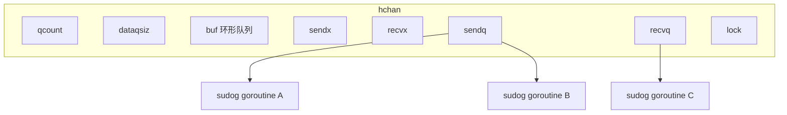
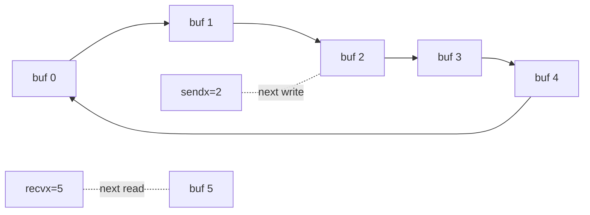
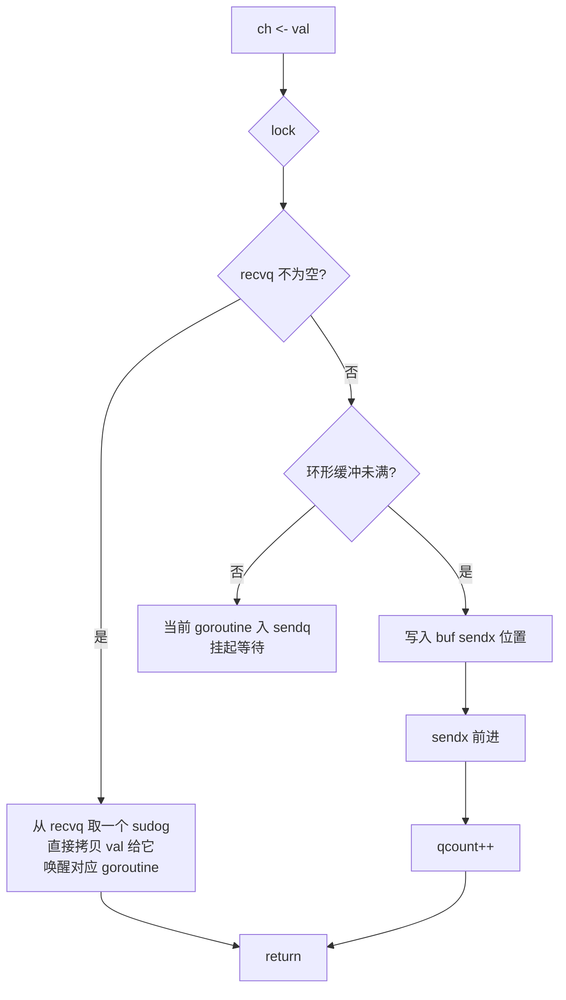
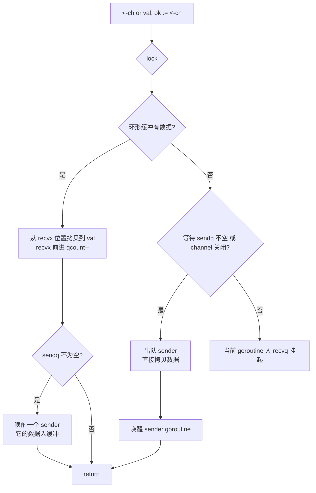
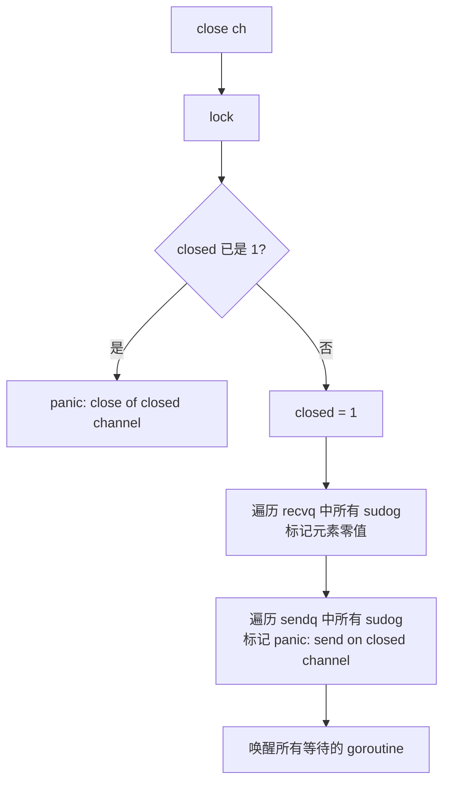
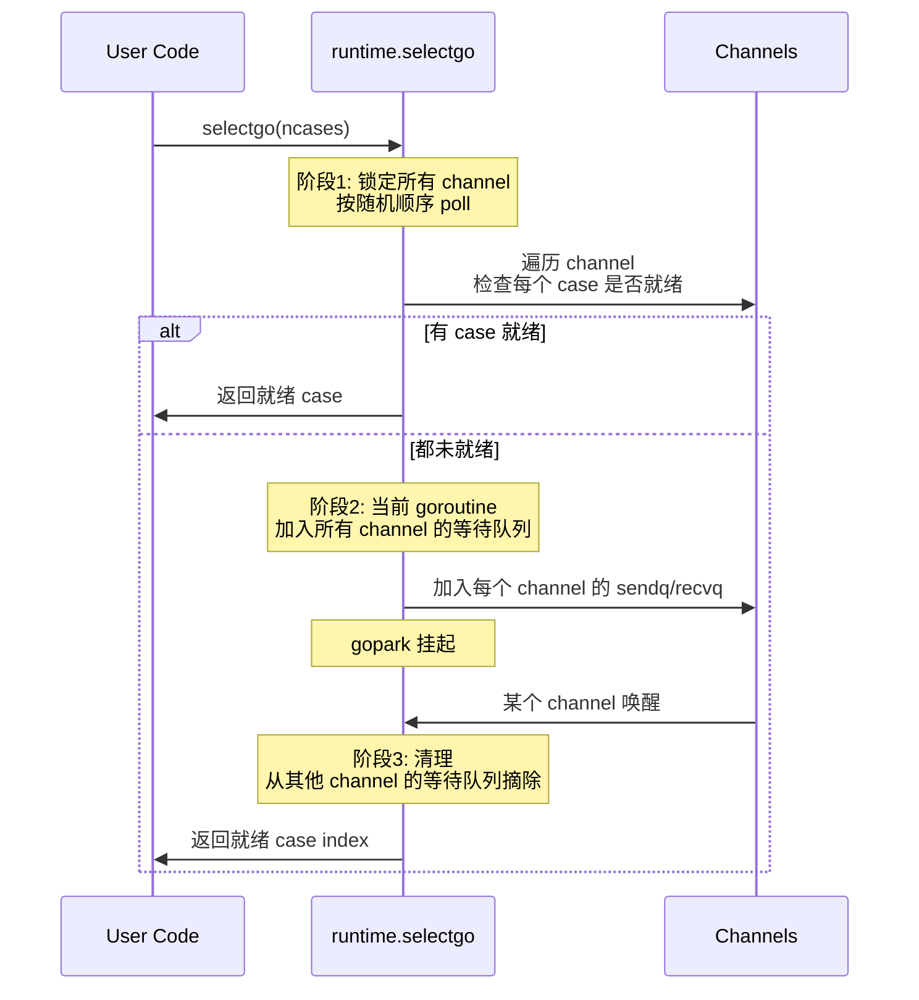

Go 的并发口号"通过通信来共享内存"（Don't communicate by sharing memory; share memory by communicating）依赖的核心原语就是 **channel**。理解 channel 的内部实现，对于写出不泄漏、不死锁的并发程序至关重要。本文从数据结构入手，逐步剖析 channel 的工作机制。

## channel 的三种类型

```go
ch1 := make(chan int)        // 无缓冲
ch2 := make(chan int, 10)    // 有缓冲，容量 10
ch3 := make(chan<- int)    // 只读（单向 channel）
ch4 := make(<-chan int)     // 只读
```

无缓冲 channel 同步通信、有缓冲 channel 异步通信——这是面试常考的点。

## hchan 数据结构

Go 源码 `src/runtime/chan.go` 中：

```go
type hchan struct {
    qcount   uint          // 当前队列中元素数量
    dataqsiz uint          // 环形队列容量
    buf      unsafe.Pointer // 环形队列指针
    elemsize uint16        // 元素大小
    closed   uint32        // 是否关闭
    elemtype *_type        // 元素类型
    sendx    uint          // 发送索引
    recvx    uint          // 接收索引
    recvq    waitq         // 接收等待队列（sudog 列表）
    sendq    waitq         // 发送等待队列
    lock     mutex         // 互斥锁
}

type waitq struct {
    first *sudog
    last  *sudog
}
```



## 环形缓冲

有缓冲 channel 的底层是**固定大小的环形数组**：



- `buf` 是连续内存，按 `elemsize * dataqsiz` 分配
- `sendx` / `recvx` 是环形索引（到达 dataqsiz 后回到 0）
- `qcount` 实时记录元素个数（不是用 sendx-recvx 算）

## send 流程



```go
// 源码简化版
func chansend1(c *hchan, elem unsafe.Pointer) {
    lock(&c.lock)
    if c.closed != 0 {
        unlock(&c.lock)
        panic(plainError("send on closed channel"))
    }

    // 1. 有等待的接收者 → 直接传递
    if sg := c.recvq.dequeue(); sg != nil {
        send(c, sg, elem)  // 拷贝到 sg 的内存 + 唤醒
        unlock(&c.lock)
        return
    }

    // 2. 环形缓冲有空间 → 入队
    if c.qcount < c.dataqsiz {
        qp := chanbuf(c, c.sendx)
        typedmemmove(c.elemtype, qp, elem)
        c.sendx++
        if c.sendx == c.dataqsiz { c.sendx = 0 }
        c.qcount++
        unlock(&c.lock)
        return
    }

    // 3. 都满了 → 阻塞
    c.sg = acquireSudog()
    c.sg.elem = elem
    c.sendq.enqueue(c.sg)
    goparkunlock(&c.lock, "chan send", traceEvGoBlockSend, 3)
    // 被唤醒后继续
}
```

## recv 流程

recv 与 send 类似，方向相反：



注意：channel 关闭时仍能从已关闭 channel 接收，会立即返回零值（带 `ok=false`）。

## 无缓冲 vs 有缓冲

| 维度 | 无缓冲 | 有缓冲 |
|---|---|---|
| 同步 vs 异步 | 同步：必须等接收者 | 异步：缓冲未满时 send 不阻塞 |
| 内部行为 | sendq/recvq 直接对接 | 优先缓冲，缓冲满再进 sendq |
| 用途 | 信号、握手 | 生产者-消费者、批处理 |

无缓冲 channel 的 `ch <- val` 实际是：

1. sender 把自己挂到 sendq
2. 某个 receiver 来了，从 sendq 取 sender
3. 拷贝 `val` 到 receiver 栈上的目标地址
4. 唤醒 sender（其实这时 receiver 已经拿走了值，sender 继续执行）

## close 机制

```go
close(ch)  // 关闭 channel
```



关键点：

- **关闭后不能再发送**（panic）
- **关闭后可以继续接收**：已缓冲的数据照常读，之后读到零值
- **重复关闭会 panic**
- **关闭 nil channel 会永久阻塞**

## select 实现

`select` 是 Go 处理多 channel 的原语：

```go
select {
case v := <-ch1:
    fmt.Println(v)
case ch2 <- x:
    // ...
case <-time.After(3*time.Second):
    // 超时
default:
    // 非阻塞尝试
}
```

`select` 的核心实现在 `src/runtime/select.go`。它分三个阶段：



关键细节：

- **公平随机**：`select` 在多个 case 就绪时**随机**选一个，避免饥饿
- **三阶段提交**：避免误唤醒时多个 channel 都接收同一个 goroutine
- **default 分支**：若没有 case 就绪，立即进入 default（不会进入等待）

## 实战坑点

### 1. 死锁

```go
ch := make(chan int)
ch <- 1  // 永久阻塞：没接收者
```

main goroutine 死锁后 runtime 会直接 throw 整个进程。

### 2. goroutine 泄漏

```go
func consumer(ch <-chan int) {
    for v := range ch {
        // 处理 v
    }
}

ch := make(chan int)
go consumer(ch)
// 没人 send，最终 goroutine 永远挂着
```

channel 必须有明确的关闭和退出路径。

### 3. 关闭已关闭的 channel

```go
close(ch)
close(ch)  // panic
```

通常关闭 channel 由发送方负责，接收方不要关闭。

### 4. nil channel 行为

```go
var ch chan int
<-ch  // 永久阻塞
ch <- 1  // 永久阻塞
close(ch)  // 永久阻塞
```

利用这一特性可以在 select 里**动态禁用**某些 case：

```go
for {
    ch := getChannel()  // 可能返回 nil
    select {
    case v := <-ch:
        // ...
    case <-time.After(1*time.Second):
        return  // 超时返回，nil channel 永远不会就绪
    }
}
```

## 性能提示

1. **避免频繁 channel 操作**：每次 send/recv 都加锁，大流量场景考虑 ring buffer
3. **有缓冲 channel 设置合理容量**：过小失去缓冲作用，过大浪费内存
4. **关闭信号用专门的 channel**：`done := make(chan struct{})` 模式

```go
func worker(done <-chan struct{}) {
    for {
        select {
        case <-done:
            return
        default:
            // 工作
        }
    }
}
```

## 参考资料

- Go 源码：`src/runtime/chan.go`、`src/runtime/select.go`
- 《Go 并发编程实战》—— 郝林
- Go Concurrency Patterns: [Pipelines and cancellation](https://go.dev/blog/pipelines)
- Dave Cheney：[The anatomy of a channel in Go](https://medium.com/@roadtoclouds/the-anatomy-of-a-channel-in-go-d6404c47dac7)