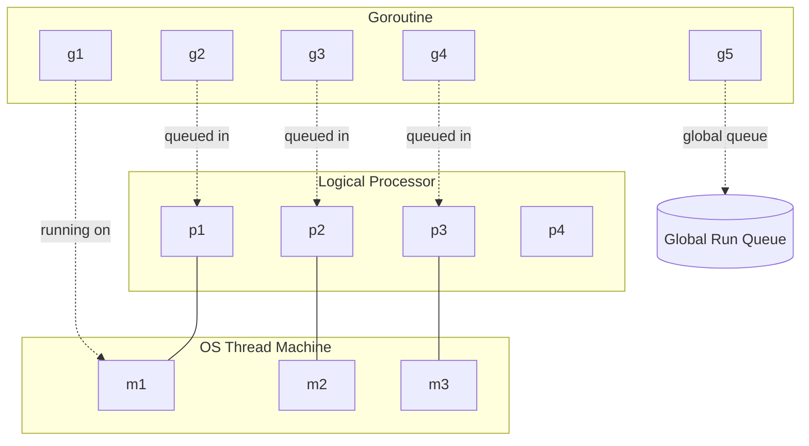
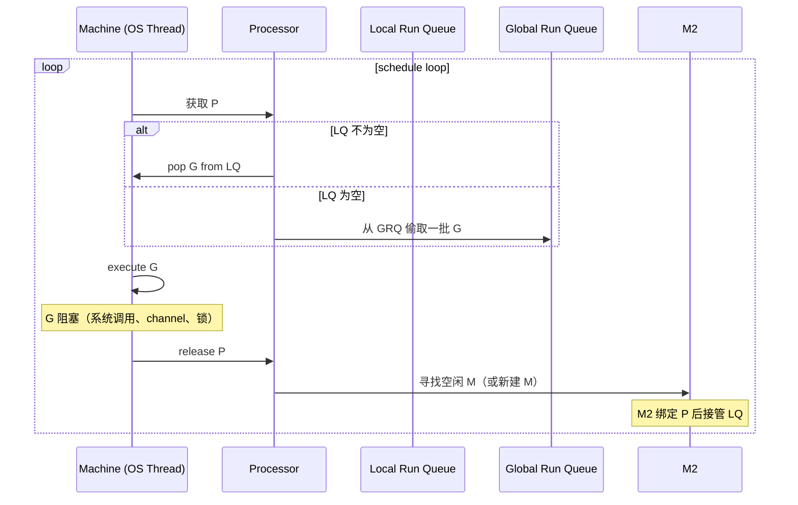
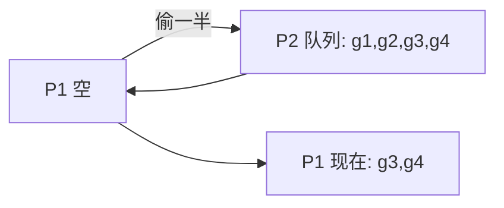
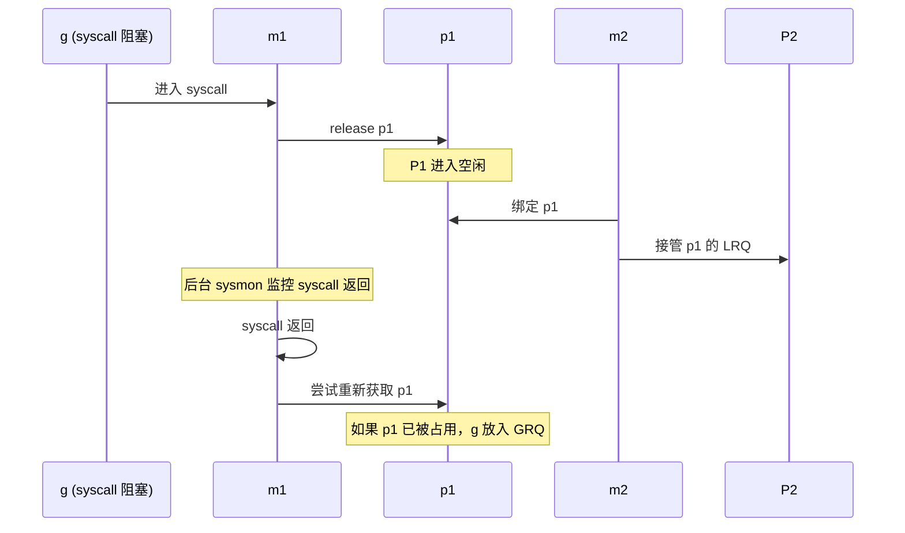

Go 语言的一大卖点是用 `go func()` 就能起一个 goroutine，开发者几乎不需要关心底层调度。但要写出高性能的 Go 程序，理解 GMP 调度模型是必经之路。本文从设计目标出发，逐步拆解 GMP 的工作机制。

## goroutine vs 线程

要理解 GMP，首先要明确 goroutine 与 OS 线程的差异：

| 维度 | OS 线程 | goroutine |
|---|---|---|
| 占用内存 | 1-8 MB（栈 + 内核结构） | 2 KB（初始栈） |
| 创建/销毁 | 需要内核参与（系统调用） | 用户态完成，开销极低 |
| 调度 | 内核抢占式 | Go runtime 协作式 + 抢占 |
| 数量上限 | 几千（受系统资源限制） | 数十万甚至百万 |

goroutine 的轻量源自**用户态调度**——Go runtime 自己实现调度器，不依赖内核线程切换。

## GMP 三种对象

Go 调度器涉及三种核心对象：

- **G（Goroutine）**：用户态协程，保存运行栈、状态、任务函数
- **M（Machine）**：OS 线程，由 Go runtime 管理（实际对应系统线程）
- **P（Processor）**：逻辑处理器，维护本地 G 队列；M 必须绑定 P 才能执行 G

每个 P 同一时刻只能被一个 M 持有。M 的数量可以大于 P（P 默认数量 = `GOMAXPROCS`）。P 决定了 Go 程序能并行使用的 CPU 核数。

## 调度循环

Go 调度器的核心循环大致如下：

### 关键调度策略

**1. 本地队列优先**

P 维护一个本地队列（LRQ），容量为 256。新建的 G 优先放入当前 P 的 LRQ，避免全局锁竞争。

**2. 工作窃取（Work Stealing）**

当某个 P 的 LRQ 空了，它会：
- 先从全局队列（GRQ）偷一批
- 再从其他 P 的 LRQ 偷一半

工作窃取让负载均衡，避免某些 P 闲置而另一些过载。

**3. 移交（Hand Off）**

当 G 触发系统调用阻塞时，对应 M 也会跟着阻塞。为了不让 P 等死，P 会被释放，由其他空闲 M 接管：

**4. 抢占式调度**

Go 1.14 之前是**协作式**——goroutine 必须主动让出（函数调用、channel、I/O）。如果一个 G 里有死循环，其他 G 会被饿死。

Go 1.14+ 引入了**基于信号的抢占**——runtime 在每个 G 的函数调用入口插入抢占检查，同时 sysmon 线程会向运行时间过长的 M 发送 `SIGURG` 信号，强制 G 停下。

## 调度器演进史

Go 调度器从 1.0 到现在的演进：

- **Go 1.0**：GM 模型（无 P），全局锁竞争严重
- **Go 1.1**：引入 P，进入 GMP 模型
- **Go 1.2**：限制最多 10 个线程执行 Go 代码（防止 syscall 风暴）
- **Go 1.5**：完全用 Go 重写调度器（之前是 C）
- **Go 1.9**：GC 期间也能调度 goroutine
- **Go 1.14**：基于信号的抢占

## 实战建议

理解 GMP 后，对性能调优很有帮助：

1. **`GOMAXPROCS` 不必设为核数**：当程序是 I/O 密集型（大量网络、磁盘），可以适当调大，让阻塞期间仍有 M 工作
2. **避免 goroutine 泄漏**：channel 没被消费、定时器没停止都会导致 G 永久堆积
3. **减少全局锁**：跨 P 的共享资源（如 `sync.Mutex`）会导致 P 互锁调度
4. **监控调度延迟**：`runtime/trace` 和 `go tool trace` 可以可视化调度过程

## 参考资料

- Go 源码：`src/runtime/proc.go`、`src/runtime/sched.go`
- Go 调度器系列：[《Go scheduler》](https://www.ardanlabs.com/blog/2018/08/scheduling-in-go-part1.html) by William Kennedy
- 郝林《Go 并发编程实战》
- 知乎：[也谈 goroutine 调度器](https://tonybai.com/2017/06/23/an-intro-about-goroutine-scheduler/)
