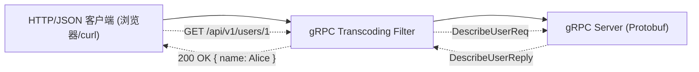
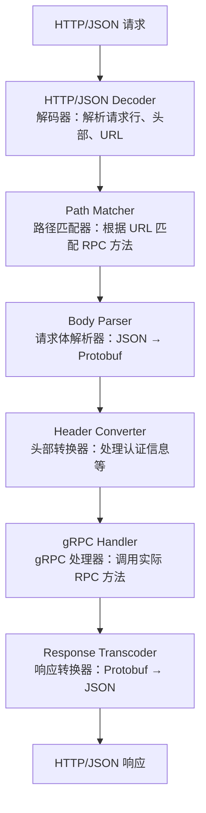

## 背景问题

gRPC 以其高效的二进制序列化（Protocol Buffers）和强大的流式通信能力，已成为微服务间通信的主流选择。但在实际项目中，我们常常面临一个尴尬的局面：

- **内部服务**用 gRPC 通信，高性能
- **对外开放 API** 需要提供 HTTP/RESTful 接口，方便前端和其他语言调用
- **维护两套服务**成本太高

有没有一种方式，可以让 **同一个 gRPC 服务同时支持 gRPC 协议和 HTTP/RESTful 调用**？

这就是 **gRPC HTTP Transcoding** 要解决的问题。

<!--more-->

## 一、什么是 HTTP Transcoding

HTTP Transcoding（HTTP 转码）是 gRPC 框架提供的一种机制：它能够将 **HTTP/JSON 请求**自动转换为 **gRPC/Protobuf 请求**，使同一个 gRPC 服务可以同时处理两种类型的调用。



## 二、google.api.http 注解

实现 RESTful 接口的关键在于 proto 文件中的 `google.api.http` 注解。

### 2.1 基本语法

```protobuf
import "google/api/annotations.proto";

service AccountService {
  // 获取当前登录员工信息
  rpc DescribeStaff(DescribeStaffReq) returns (DescribeStaffReply) {
    option (google.api.http) = {
      get: "/api/account/v1/staff"
    };
  }

  // 获取用户详情
  rpc GetUser(GetUserReq) returns (GetUserReply) {
    option (google.api.http) = {
      get: "/api/account/v1/users/{user_id}"
    };
  }

  // 创建用户
  rpc CreateUser(CreateUserReq) returns (CreateUserReply) {
    option (google.api.http) = {
      post: "/api/account/v1/users"
      body: "*"
    };
  }

  // 更新用户
  rpc UpdateUser(UpdateUserReq) returns (UpdateUserReply) {
    option (google.api.http) = {
      patch: "/api/account/v1/users/{user_id}"
      body: "*"
    };
  }

  // 删除用户
  rpc DeleteUser(DeleteUserReq) returns (DeleteUserReply) {
    option (google.api.http) = {
      delete: "/api/account/v1/users/{user_id}"
    };
  }
}
```

### 2.2 注解字段说明

| 字段 | 说明 |
|------|------|
| `get` | HTTP GET 请求 |
| `post` | HTTP POST 请求 |
| `put` | HTTP PUT 请求 |
| `patch` | HTTP PATCH 请求 |
| `delete` | HTTP DELETE 请求 |
| `body` | 请求体映射到哪个字段，`"*"` 表示整个请求消息 |
| `{field_name}` | 路径参数，自动映射到 message 字段 |

### 2.3 路径参数和查询参数

```protobuf
rpc ListUsers(ListUsersReq) returns (ListUsersReply) {
  option (google.api.http) = {
    get: "/api/account/v1/users"
  };
}

// 相当于 GET /api/account/v1/users?page=1&page_size=20

rpc SearchUsers(SearchUsersReq) returns (SearchUsersReply) {
  option (google.api.http) = {
    get: "/api/account/v1/users/search"
  };
}

// 相当于 GET /api/account/v1/users/search?keyword=alice&status=active
```

## 三、Transcoding 过滤器工作原理

### 3.1 请求处理流程



### 3.2 关键转换逻辑

#### URL 路径 → RPC 方法

当请求 `GET /api/account/v1/users/123` 到达时：

1. 提取路径模板：`/api/account/v1/users/{user_id}`
2. 提取路径参数：`user_id = "123"`
3. 构造 Protobuf 请求：`GetUserReq { user_id: "123" }`

#### HTTP 头部 → gRPC Metadata

```go
// HTTP 请求头
Authorization: Bearer xxx-token
X-Request-ID: abc-123

// 转换为 gRPC Metadata
metadata := metadata.Pairs(
    "authorization", "Bearer xxx-token",
    "x-request-id", "abc-123",
)
```

#### 请求体 JSON → Protobuf

```json
// HTTP POST 请求体 (JSON)
{
  "name": "Alice",
  "email": "alice@example.com",
  "age": 25
}

// 转换为 Protobuf 消息
CreateUserReq {
    name: "Alice"
    email: "alice@example.com"
    age: 25
}
```

## 四、Go 语言实战示例

### 4.1 定义 proto 文件

```protobuf
// api/account/v1/account.proto
syntax = "proto3";

package account.v1;

option go_package = "github.com/example/gen/go/account/v1;accountv1";

import "google/api/annotations.proto";

message DescribeStaffReq {}

message Staff {
  string id = 1;
  string name = 2;
  string email = 3;
  string department = 4;
}

message DescribeStaffReply {
  Staff staff = 1;
}

message GetUserReq {
  string user_id = 1;
}

message GetUserReply {
  Staff user = 1;
}

message CreateUserReq {
  string name = 1;
  string email = 2;
  string department = 3;
}

message CreateUserReply {
  Staff user = 1;
}

service AccountService {
  rpc DescribeStaff(DescribeStaffReq) returns (DescribeStaffReply) {
    option (google.api.http) = {
      get: "/api/account/v1/staff"
    };
  }

  rpc GetUser(GetUserReq) returns (GetUserReply) {
    option (google.api.http) = {
      get: "/api/account/v1/users/{user_id}"
    };
  }

  rpc CreateUser(CreateUserReq) returns (CreateUserReply) {
    option (google.api.http) = {
      post: "/api/account/v1/users"
      body: "*"
    };
  }
}
```

### 4.2 实现 gRPC Server

```go
// cmd/server/main.go
package main

import (
	"context"
	"log"
	"net"
	"net/http"

	"cloud.google.com/go/logging/logadmin"
	"github.com/grpc-ecosystem/grpc-gateway/v2/runtime"
	"google.golang.org/grpc"
	"google.golang.org/grpc/metadata"
	"google.golang.org/protobuf/encoding/protojson"

	accountv1 "github.com/example/gen/go/account/v1"
)

type accountServer struct {
	accountv1.UnimplementedAccountServiceServer
}

func (s *accountServer) DescribeStaff(ctx context.Context, req *accountv1.DescribeStaffReq) (*accountv1.DescribeStaffReply, error) {
	// 从 gRPC Metadata 获取认证信息
	md, ok := metadata.FromIncomingContext(ctx)
	if ok {
		log.Printf("Authorization: %v", md.Get("authorization"))
	}

	return &accountv1.DescribeStaffReply{
		Staff: &accountv1.Staff{
			Id:         "10001",
			Name:       "张三",
			Email:      "zhangsan@example.com",
			Department: "技术部",
		},
	}, nil
}

func (s *accountServer) GetUser(ctx context.Context, req *accountv1.GetUserReq) (*accountv1.GetUserReply, error) {
	return &accountv1.GetUserReply{
		User: &accountv1.Staff{
			Id:         req.UserId,
			Name:       "李四",
			Email:      "lisi@example.com",
			Department: "产品部",
		},
	}, nil
}

func (s *accountServer) CreateUser(ctx context.Context, req *accountv1.CreateUserReq) (*accountv1.CreateUserReply, error) {
	log.Printf("创建用户: name=%s, email=%s, dept=%s", req.Name, req.Email, req.Department)

	return &accountv1.CreateUserReply{
		User: &accountv1.Staff{
			Id:         "new-user-id",
			Name:       req.Name,
			Email:      req.Email,
			Department: req.Department,
		},
	}, nil
}

func main() {
	// 启动 gRPC Server
	grpcServer := grpc.NewServer()
	accountv1.RegisterAccountServiceServer(grpcServer, &accountServer{})

	lis, _ := net.Listen("tcp", ":50051")
	go func() {
		log.Printf("gRPC Server 监听端口 :50051")
		grpcServer.Serve(lis)
	}()

	// 启动 HTTP Gateway
	conn, err := grpc.DialContext(
		context.Background(),
		"localhost:50051",
		grpc.WithInsecure(),
	)
	if err != nil {
		log.Fatalf("连接 gRPC Server 失败: %v", err)
	}

	gwmux := runtime.NewServeMux(
		// 自定义 JSON 编码选项，保留字段原始命名
		runtime.WithMarshalerOption(
			runtime.MIMEWildcard,
			&runtime.HTTPBodyMarshaler{
				Marshaler: &runtime.JSONPb{
					MarshalOptions: protojson.MarshalOptions{
						UseProtoNames:   true,
						EmitUnpopulated: false,
					},
					UnmarshalOptions: protojson.UnmarshalOptions{
						DiscardUnknown: true,
					},
				},
			},
		),
	)

	opts := []runtime.ServeMuxOption{
		runtime.WithIncomingHeaderMatcher(func(key string) (string, bool) {
			// 将 HTTP 头部传递给 gRPC 服务
			// Authorization 头会自动传递
			return key, true
		}),
	}

	err = accountv1.RegisterAccountServiceHandler(context.Background(), gwmux, conn, opts...)
	if err != nil {
		log.Fatalf("注册 gRPC Gateway 失败: %v", err)
	}

	mux := http.NewServeMux()
	mux.Handle("/", gwmux)

	httpServer := &http.Server{
		Addr:    ":8080",
		Handler: mux,
	}

	log.Printf("HTTP Gateway 监听端口 :8080")
	if err := httpServer.ListenAndServe(); err != nil {
		log.Fatalf("HTTP Server 启动失败: %v", err)
	}
}
```

### 4.3 启动服务并测试

```bash
# 终端 1: 启动服务
go run cmd/server/main.go

# 终端 2: 测试 RESTful 接口
# GET 请求
curl http://localhost:8080/api/account/v1/staff

# GET 带路径参数
curl http://localhost:8080/api/account/v1/users/123

# POST 请求
curl -X POST http://localhost:8080/api/account/v1/users \
  -H "Content-Type: application/json" \
  -d '{"name": "王五", "email": "wangwu@example.com", "department": "运营部"}'
```

## 五、常见问题和注意事项

### 5.1 嵌套对象的处理

对于嵌套的请求体，需要使用 `body` 字段指定映射关系：

```protobuf
rpc UpdateUser(UpdateUserReq) returns (UpdateUserReply) {
  option (google.api.http) = {
    patch: "/api/account/v1/users/{user.id}"
    body: "user"
  };
}

message UpdateUserReq {
  User user = 1;
  string user_id = 2;  // 对应 {user.id}
}
```

### 5.2 认证信息的传递

HTTP 请求中的 `Authorization` 头部需要显式传递给 gRPC 服务：

```go
// 使用 WithIncomingHeaderMatcher 传递所有头部
opts := []runtime.ServeMuxOption{
    runtime.WithIncomingHeaderMatcher(func(key string) (string, bool) {
        // 跳过某些内部头部
        if key == "X-Internal-Header" {
            return "", false
        }
        return key, true
    }),
}
```

### 5.3 错误处理

gRPC 错误会自动转换为 HTTP 状态码：

| gRPC 状态码 | HTTP 状态码 |
|------------|-------------|
| OK | 200 |
| INVALID_ARGUMENT | 400 |
| UNAUTHENTICATED | 401 |
| FORBIDDEN | 403 |
| NOT_FOUND | 404 |
| INTERNAL | 500 |

## 六、总结

gRPC HTTP Transcoding 机制让微服务只需实现一次，就能同时支持：

- **gRPC 客户端**：高性能的 Protobuf 二进制通信
- **RESTful 客户端**：通用的 HTTP/JSON 接口

这对需要同时服务内部 gRPC 调用和外部 HTTP API 的场景非常有用。

**核心要点：**

1. `google.api.http` 注解定义了 RPC 方法到 HTTP 端点的映射
2. `grpc-gateway` 负责将 HTTP/JSON 请求转换为 gRPC 调用
3. 路径参数通过 `{field}` 语法绑定到请求消息字段
4. HTTP 头部需要通过 `WithIncomingHeaderMatcher` 显式传递
5. gRPC 错误码会自动转换为对应的 HTTP 状态码

**适用场景：**
- 微服务内部使用 gRPC，外部 API 使用 RESTful
- 需要同时支持多语言调用
- 希望统一服务接口，减少维护成本

**不适用场景：**
- 对 JSON Schema 有强需求的场景（gRPC Gateway 对 OpenAPI 支持有限）
- 需要复杂查询参数验证的场景

