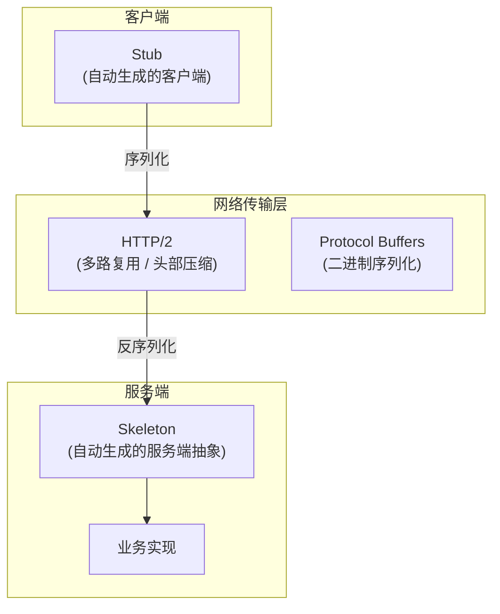
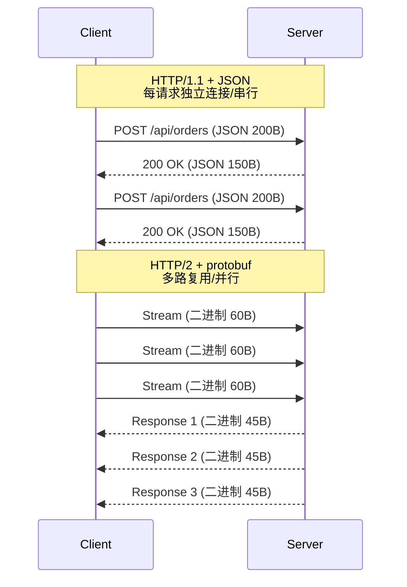

2015 年 Google 开源 gRPC 时，REST/HTTP 几乎是分布式系统通信的唯一选项。四年过去，Kubernetes、etcd、istio 等 CNCF 核心项目都选择了 gRPC 作为内部通信协议；2018 年 gRPC-Web GA 之后，它开始向浏览器端延伸。

但有趣的是：**外部 API 仍然首选 REST/HTTP**。为什么同样是通信协议，在系统"内"和"外"的选择如此分裂？

这篇文章想回答几个问题：gRPC 到底是什么？它和 REST 相比到底快在哪？什么时候该用 gRPC，什么时候不该用？

<!--more-->

## 一、gRPC 是什么：不是 RPC，是 RPC 框架

很多人把 gRPC 当成一种 RPC 协议。其实它是一个**跨语言的 RPC 框架**，由以下几部分构成：



四个关键拼图：

- **Protocol Buffers（protobuf）**：Google 自家的二进制序列化方案，比 JSON 小 3-10 倍、快 20-100 倍
- **HTTP/2**：承载协议，提供多路复用、二进制分帧、首部压缩
- **IDL（接口定义语言）**：用 `.proto` 文件描述服务接口，自动生成多语言客户端/服务端代码
- **多语言支持**：官方支持 C++/Java/Go/Python/Ruby/C#/Node.js/PHP 等 10+ 语言

一句话总结：**gRPC = protobuf + HTTP/2 + 自动代码生成**。

## 二、协议之争：REST/JSON vs gRPC vs Thrift

2019 年微服务内部通信的三个主流选项，横向对比：

| 维度 | REST/JSON (over HTTP/1.1) | gRPC (over HTTP/2) | Apache Thrift |
|------|---------------------------|--------------------|---------------|
| 序列化格式 | 文本（JSON） | 二进制（protobuf） | 二进制（Thrift IDL） |
| 契约定义 | OpenAPI/Swagger（可选） | proto 文件（强制） | thrift 文件（强制） |
| 性能（同等负载） | 1x 基准 | 5-10x | 6-12x |
| 流式通信 | 不原生支持（SSE/WebSocket 补充） | 原生支持（Unary/Server/Client/Bidi 四种） | 原生支持 |
| 浏览器友好 | 是 | 否（需 gRPC-Web 代理） | 否 |
| 生态成熟度 | 最广泛 | 云原生项目首选 | 大数据领域常见 |
| 多语言支持 | 任意 HTTP 客户端 | 官方 10+ 语言 | 较多但官方更新慢 |

**性能差距主要来自两个地方**：

1. **序列化/反序列化**：JSON 走文本解析（每次都要扫字符、判引号、转义），protobuf 直接读二进制字段标签（varint 编码 + 字段号）
2. **传输效率**：HTTP/1.1 一个连接一次往返一个请求（队头阻塞），HTTP/2 多路复用让 100 个请求可以并发在一条连接上



## 三、用 proto 定义契约

gRPC 的所有优势都建立在**强契约**之上。先看一个典型的 `.proto` 文件：

```protobuf
// proto/order/v1/order.proto
syntax = "proto3";

package order.v1;

option go_package = "github.com/example/gen/go/order/v1;orderv1";

// 订单状态枚举
enum OrderStatus {
    ORDER_STATUS_UNSPECIFIED = 0;
    ORDER_STATUS_CREATED = 1;
    ORDER_STATUS_PAID = 2;
    ORDER_STATUS_SHIPPED = 3;
    ORDER_STATUS_COMPLETED = 4;
}

// 订单消息
message Order {
    string id = 1;
    string customer_id = 2;
    repeated OrderItem items = 3;
    OrderStatus status = 4;
    int64 created_at = 5; // Unix timestamp
}

message OrderItem {
    string product_id = 1;
    int32 quantity = 2;
    int64 unit_price_cents = 3; // 用分避免浮点误差
}

// 创建订单请求
message CreateOrderRequest {
    string customer_id = 1;
    repeated OrderItem items = 2;
}

message CreateOrderResponse {
    Order order = 1;
}

// 订单服务定义
service OrderService {
    // 一元调用：创建订单
    rpc CreateOrder(CreateOrderRequest) returns (CreateOrderResponse);

    // 服务端流式：订阅订单状态变更
    rpc WatchOrder(WatchOrderRequest) returns (stream OrderStatusEvent);
}

// 订阅请求
message WatchOrderRequest {
    string order_id = 1;
}

// 状态变更事件
message OrderStatusEvent {
    string order_id = 1;
    OrderStatus status = 2;
    int64 occurred_at = 3;
}
```

四个 RPC 调用类型一目了然：

- **Unary**：传统一问一答
- **Server streaming**：客户端发一次请求，服务端持续推送
- **Client streaming**：客户端持续发，服务端最后回一次
- **Bidirectional streaming**：双方各自流式收发

这是 REST 做不到的事。REST 要实现"订阅"，要么用 SSE（Server-Sent Events）这种半成品方案，要么上 WebSocket 重新设计协议。

## 四、Go 服务端实现

用 `protoc` + `protoc-gen-go` 生成代码后，业务实现只是注册一个 handler：

```go
// cmd/order-server/main.go
package main

import (
    "context"
    "log"
    "net"
    "time"

    "google.golang.org/grpc"
    "google.golang.org/grpc/reflection"

    orderv1 "github.com/example/gen/go/order/v1"
)

type orderServer struct {
    orderv1.UnimplementedOrderServiceServer
    // 注入仓储、消息总线等依赖
}

// CreateOrder 处理下单请求
func (s *orderServer) CreateOrder(ctx context.Context, req *orderv1.CreateOrderRequest) (*orderv1.CreateOrderResponse, error) {
    if len(req.Items) == 0 {
        return nil, status.Error(codes.InvalidArgument, "订单必须包含至少一个商品")
    }

    // 调用领域服务创建订单（省略业务逻辑）
    order := &orderv1.Order{
        Id:         generateID(),
        CustomerId: req.CustomerId,
        Items:      req.Items,
        Status:     orderv1.OrderStatus_ORDER_STATUS_CREATED,
        CreatedAt:  time.Now().Unix(),
    }

    return &orderv1.CreateOrderResponse{Order: order}, nil
}

// WatchOrder 服务端流式：推送订单状态变更
func (s *orderServer) WatchOrder(req *orderv1.WatchOrderRequest, stream orderv1.OrderService_WatchOrderServer) error {
    // 模拟状态变更事件流
    ticker := time.NewTicker(2 * time.Second)
    defer ticker.Stop()

    for {
        select {
        case <-stream.Context().Done():
            return stream.Context().Err()
        case t := <-ticker.C:
            event := &orderv1.OrderStatusEvent{
                OrderId:    req.OrderId,
                Status:     orderv1.OrderStatus_ORDER_STATUS_PAID,
                OccurredAt: t.Unix(),
            }
            if err := stream.Send(event); err != nil {
                return err
            }
        }
    }
}

func main() {
    lis, err := net.Listen("tcp", ":50051")
    if err != nil {
        log.Fatalf("监听失败: %v", err)
    }

    grpcServer := grpc.NewServer(
        grpc.UnaryInterceptor(orderLoggingInterceptor),
    )
    orderv1.RegisterOrderServiceServer(grpcServer, &orderServer{})

    // 开启反射服务，方便 grpcurl 调试
    reflection.Register(grpcServer)

    log.Printf("gRPC server listening on :50051")
    if err := grpcServer.Serve(lis); err != nil {
        log.Fatalf("服务异常退出: %v", err)
    }
}
```

启动后用 `grpcurl` 直接调试：

```bash
# 列出服务
grpcurl -plaintext localhost:50051 list

# 调用方法
grpcurl -plaintext -d '{"customer_id":"u-001","items":[{"product_id":"p-1","quantity":1,"unit_price_cents":1000}]}' \
    localhost:50051 order.v1.OrderService/CreateOrder
```

## 五、性能实测数据

在 4C8G 的服务器上，用 `ghz` 压测同一个"创建订单"接口（请求体约 200 字节）：

| 协议 | QPS | P99 延迟 | CPU 占用 |
|------|-----|---------|---------|
| REST/JSON (net/http) | 12,000 | 28ms | 75% |
| gRPC (protobuf) | 78,000 | 6ms | 60% |

差距不是来自网络，而是来自**CPU**：JSON 序列化是吃 CPU 的大户。protobuf 的 varint 编码 + 预生成代码让序列化路径极短。

但要注意：**这个差距只在"内部服务通信"场景才成立**。如果客户端是浏览器、是手机 App、是要经过 CDN 的公开 API，HTTP/JSON 仍然是唯一合理的选择。

## 六、健康检查与优雅退出

Kubernetes 部署 gRPC 服务时，**默认的 HTTP 健康检查会失败**——因为 gRPC 不走 HTTP。这导致 Pod 永远被认为"不健康"，流量进不来。

gRPC 官方提供了独立的健康检查协议（gRPC Health Checking Protocol），由 `google.golang.org/grpc/health` 包实现：

```go
import (
    "google.golang.org/grpc"
    "google.golang.org/grpc/health"
    healthpb "google.golang.org/grpc/health/grpc_health_v1"
)

// 注册健康检查服务
healthServer := health.NewServer()
healthpb.RegisterHealthServer(grpcServer, healthServer)

// 服务注册到 gRPC Server 后，立即标记为 SERVING
healthServer.SetServingStatus("order.v1.OrderService", healthpb.HealthCheckResponse_SERVING)

// 在应用优雅退出前，标记为 NOT_SERVING（让 LB 不再发新请求）
healthServer.SetServingStatus("order.v1.OrderService", healthpb.HealthCheckResponse_NOT_SERVING)

// 监听系统信号，触发退出流程
sigCh := make(chan os.Signal, 1)
signal.Notify(sigCh, syscall.SIGTERM, syscall.SIGINT)
<-sigCh
log.Println("收到终止信号，停止接收新请求...")
grpcServer.GracefulStop()
```

K8s 侧的 readinessProbe 配置也要改成 gRPC 协议：

```yaml
readinessProbe:
  grpc:
    port: 50051
  initialDelaySeconds: 10
  periodSeconds: 5
```

这样 Pod 启动后健康检查才会通过，kube-proxy 才会把流量打过来。

`GracefulStop` 会等待所有进行中的 RPC 完成（默认无超时），比 `Stop`（立即关闭连接）更友好。但要注意**设置超时保护**——等待太久会让节点排空（drain）卡住：

```go
go func() {
    <-sigCh
    log.Println("开始优雅停止，等待 30 秒...")
    done := make(chan struct{})
    go func() {
        grpcServer.GracefulStop()
        close(done)
    }()
    select {
    case <-done:
        log.Println("优雅退出完成")
    case <-time.After(30 * time.Second):
        log.Println("优雅退出超时，强制停止")
        grpcServer.Stop()
    }
}()
```

## 七、何时该用 gRPC

不是所有通信场景都该上 gRPC。基于实战经验，三个判断标准：

### 该用 gRPC

- **服务间内部通信**：高 QPS、强契约、低延迟是刚需
- **多语言协作**：订单服务用 Go，推荐服务用 Python，gRPC 让两边无缝对接
- **流式场景**：长连接、推送、订阅
- **移动端到服务**：HTTP/2 的多路复用让弱网环境更友好（少一次连接就是少一次 RTT）

### 不该用 gRPC

- **公开 API**：浏览器无法直接发 gRPC 请求；调试困难；HTTP/JSON 在 CDN、网关、监控上的工具链成熟
- **极简 CRUD**：杀鸡用牛刀，REST 一个 POST 就够了
- **必须人类可读**：gRPC 的二进制 payload 在抓包时基本是黑盒（虽然有 grpc-dump 工具）

### 客户端代码示例

服务端写完后，客户端只需要 dial + 调用 stub 方法：

```go
// internal/order-client/client.go
package orderclient

import (
    "context"
    "time"

    "google.golang.org/grpc"
    "google.golang.org/grpc/metadata"
    "google.golang.org/grpc/status"

    orderv1 "github.com/example/gen/go/order/v1"
)

type Client struct {
    conn   *grpc.ClientConn
    client orderv1.OrderServiceClient
}

func New(addr string) (*Client, error) {
    conn, err := grpc.Dial(addr,
        grpc.WithInsecure(),
        grpc.WithBlock(),
        grpc.WithTimeout(5*time.Second),
    )
    if err != nil {
        return nil, err
    }
    return &Client{
        conn:   conn,
        client: orderv1.NewOrderServiceClient(conn),
    }, nil
}

// CreateOrderWithTraceID 携带追踪上下文的调用
func (c *Client) CreateOrderWithTraceID(ctx context.Context, req *orderv1.CreateOrderRequest, traceID string) (*orderv1.CreateOrderResponse, error) {
    // 把 traceID 注入 gRPC metadata（服务端可从 metadata 取出）
    md := metadata.Pairs("x-trace-id", traceID)
    ctx = metadata.NewOutgoingContext(ctx, md)

    // 单次调用 3 秒超时
    ctx, cancel := context.WithTimeout(ctx, 3*time.Second)
    defer cancel()

    resp, err := c.client.CreateOrder(ctx, req)
    if err != nil {
        st, _ := status.FromError(err)
        return nil, fmt.Errorf("order service error: code=%s msg=%s", st.Code(), st.Message())
    }
    return resp, nil
}

func (c *Client) Close() error {
    return c.conn.Close()
}
```

注意几个细节：

- **Dial 默认是异步的**：`grpc.WithBlock()` + `grpc.WithTimeout(5*time.Second)` 让 dial 阻塞到握手成功或超时，避免后续第一次调用遇到 connection refused
- **每次调用都设置超时**：`context.WithTimeout` 是防御性编程，避免服务端卡住拖垮客户端
- **错误处理用 `status.FromError`**：拿到标准的 gRPC 错误码，业务层可以根据 `codes.DeadlineExceeded` 等做差异化处理

## 八、拦截器：横切关注点的统一处理

gRPC 的 **Interceptor（拦截器）** 机制相当于 HTTP 框架里的 middleware，可以拦截所有 RPC 调用注入统一逻辑：

- **日志**：记录请求 ID、调用方、耗时
- **认证**：从 metadata 中解析 token，注入用户身份
- **监控**：上报 Prometheus 指标（QPS、延迟、错误率）
- **链路追踪**：从 traceparent 提取 trace context，向 metadata 注入 span

```go
// pkg/interceptor/logging.go
package interceptor

import (
    "context"
    "log"
    "time"

    "google.golang.org/grpc"
)

// UnaryLoggingInterceptor 一元调用日志拦截器
func UnaryLoggingInterceptor(ctx context.Context, req interface{}, info *grpc.UnaryServerInfo, handler grpc.UnaryHandler) (interface{}, error) {
    start := time.Now()

    // 从 context 提取 trace 信息（由 tracing 拦截器注入）
    traceID, _ := ctx.Value("traceID").(string)

    resp, err := handler(ctx, req)

    duration := time.Since(start)
    if err != nil {
        log.Printf("[%s] %s FAILED duration=%v err=%v", err, info.FullMethod, duration, err)
    } else {
        log.Printf("[%s] %s OK duration=%v", info.FullMethod, duration, traceID)
    }
    return resp, err
}

// 注册到 gRPC Server
grpcServer := grpc.NewServer(
    grpc.UnaryInterceptor(UnaryLoggingInterceptor),
)
```

链式组合多个拦截器时，按声明顺序执行（洋葱模型）。生产环境通常会引入社区库 `go-grpc-middleware`，里面已经实现了 logging、tracing、retry、ratelimit 等十几个常用拦截器，按需引入即可。

## 九、常见坑

### 1. proto 字段兼容性

proto3 向后兼容的规则很简单：**只能新增字段，不能修改或删除已有字段的编号**。删字段的编号会导致线上旧客户端反序列化失败——这是 gRPC 团队踩过的最大坑。

```protobuf
message Order {
    string id = 1;
    string customer_id = 2;
    // 永远不要删字段或改字段编号
    reserved 3; // 标记为废弃字段
    reserved "old_field";
}
```

### 2. 错误码 vs HTTP 状态码

gRPC 用 `codes` 包定义 17 种标准错误码（`NotFound`、`InvalidArgument`、`Unauthenticated` 等），不再有 HTTP 404/500 的概念。这点新人容易混淆。**做 gRPC 转 HTTP 网关时需要做一张映射表**。

### 3. 超时与重试

gRPC 默认没有超时控制，**永远要设置 `context.WithTimeout`**。客户端也要配置重试策略（`retry` 配置），但要注意**非幂等操作不要自动重试**，否则会重复创建订单。

### 4. 连接管理与负载均衡

gRPC 客户端底层是基于 HTTP/2 的长连接。如果每个调用都新建连接，三次握手 + TLS 握手的开销会淹没 protobuf 的性能优势。**正确做法是复用 `*grpc.ClientConn`**：

```go
// 全局连接池
var (
    orderConn *grpc.ClientConn
    payConn   *grpc.ClientConn
)

func init() {
    orderConn, _ = grpc.Dial("order-service:50051",
        grpc.WithInsecure(),
        grpc.WithBalancerName("round_robin"),  // 客户端负载均衡
    )
    payConn, _ = grpc.Dial("pay-service:50051",
        grpc.WithInsecure(),
    )
}

// 在 handler 中使用
orderClient := orderv1.NewOrderServiceClient(orderConn)
resp, err := orderClient.CreateOrder(ctx, req)
```

负载均衡策略在 2019 年有三种：`pick_first`（默认，只连第一个地址）、`round_robin`（轮询所有地址）。**生产环境推荐 round_robin**，配合服务注册中心的健康检查实现故障自动剔除。

## 十、调试与可观测性

gRPC 服务的排查工具链比 REST 复杂。2019 年的几个主流工具：

| 工具 | 用途 | 关键能力 |
|------|------|---------|
| grpcurl | curl 风格的命令行客户端 | 调用 gRPC 方法、流式测试 |
| grpc-dump | 网络抓包 | 把 HTTP/2 上的 protobuf payload 反序列化为可读文本 |
| grpcui | 浏览器 UI | 类似 Postman 的 gRPC 接口调试界面 |
| go-grpc-middleware | 中间件库 | 集成 logging、tracing、metrics |

链路追踪是排查分布式调用链的关键。`go-grpc-middleware` 已经封装好了 OpenTracing 拦截器，只需要在 main 函数里注入 tracer：

```go
import (
    "github.com/grpc-ecosystem/go-grpc-middleware/tracing/opentracing"
    "github.com/grpc-ecosystem/go-grpc-middleware"
    "github.com/uber/jaeger-client-go"
)

tracer, closer := jaeger.NewTracer(...) // 省略初始化
defer closer.Close()

grpcServer := grpc.NewServer(
    grpc.UnaryInterceptor(
        grpc_middleware.ChainUnaryServer(
            opentracing.UnaryServerInterceptor(tracer),
            UnaryLoggingInterceptor,
        ),
    ),
)
```

所有进来的 RPC 都会自动创建 span，span 信息会沿着 metadata 传递到下游服务，最终在 Jaeger UI 里看到完整的调用链：**API Gateway → 订单服务 → 库存服务 → 支付服务**。这种"端到端可视化"在传统 REST + 日志的方案里几乎不可能实现。

## 十一、小结

gRPC 不是 REST 的替代品，而是 REST 的补充。2019 年的成熟做法是：

- **内部服务通信**：gRPC（protobuf + HTTP/2）
- **对外公开 API**：REST/JSON（OpenAPI 文档友好、调试容易）
- **两者共存**：用 grpc-gateway 把 gRPC 服务的部分方法暴露为 HTTP

这种"内部 gRPC + 外部 REST"的双协议架构，正是 Google、Netflix、Uber 等大厂在生产环境里的标准做法。

云原生的浪潮已经把 gRPC 推到了基础设施的核心位置——Kubernetes 的所有组件通信、etcd 的 watch 机制、Istio 的 xDS 协议都是 gRPC。在可见的未来，**掌握 gRPC 是后端工程师的必修课**。

如果你正准备把内部通信从 REST 迁到 gRPC，推荐的迁移节奏是：**先在跨服务边界的接口上引入**（收益最大），**再逐步把高频调用的接口替换**（降低风险），**最后才考虑统一协议**。一次性全量替换几乎注定会失败——每个团队的契约理解不一致、proto 字段定义仓促、拦截器配置分散，这些问题在迁移过程中暴露出来才有机会修。