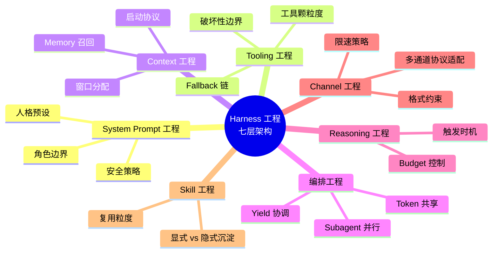

为什么同一个 MiniMax-M3，接到 Claude Code 和 Workbuddy 上跑同一个任务，输出会完全不一样——语气不同、结构不同、深度不同、有没有抓到关键风险点都不同？

第一反应大概会怪模型。**但模型从来没有变过。**

变的是模型外面那一整套"包装"——业内有个正式名字叫 **AI Agent Harness**。

<!--more-->

Vivek Trivedy 给的定义公式很简洁："如果你不是模型本身，那你就是 Harness。"

LangChain 2026 年初用 TerminalBench 2.0（衡量 agent 处理命令行任务的权威基准）做了一个非常说明问题的实验：他们**只改了包裹大语言模型的底层架构**，模型没动、参数没动，排名就从 30 名开外冲到了第 5。

而 Harness 的设计，本身就是一门工程——而且这门工程，早就被另一门工程系统性地研究过：**操作系统**。

## Harness：AI Agent 的操作系统

Beren Millidge 2023 年的博文里有一个精准的类比：原生大语言模型就像一个没有内存、没有硬盘、也没有输入输出设备的 CPU。上下文窗口充当内存（快但容量有限），外部数据库扮演硬盘（大但速度慢），工具集成就是设备驱动程序。**而 Harness，就是那个操作系统。**

我们重新发明了冯·诺依曼架构——这是任何计算系统最自然的抽象方式。

Anthropic 在 Claude Code 文档里写得更直白："SDK 就是驱动 Claude Code 的 Agent Harness。" OpenAI 的 Codex 团队也是同样的说法。

**所以问题不再是"用哪个模型"，而是"用哪个 Harness"。**

而 Harness 工程的真正范本，就是操作系统工程。两个领域要解决的问题惊人地相似：

| OS 要解决的 | Harness 要解决的 |
|------------|------------------|
| CPU 怎么调度进程 | 怎么调度多个 agent / 推理路径 |
| 内存怎么分配 | context window 怎么分配 / 压缩 |
| 设备怎么驱动 | 工具怎么调用 / 错误怎么处理 |
| 进程间怎么通信 | agent 间怎么通信 / 上下文怎么共享 |
| 网络协议怎么分层 | channel 协议怎么适配 / 消息怎么路由 |
| 标准库怎么管理 | skill 怎么复用 / 怎么按需加载 |

**操作系统工程师花了五十年解决的问题，Harness 工程师要重新解决一遍。**

## 七层架构：把 OS 七层映射到 Harness 七层

每一层都对应着传统 OS 的某个子系统。逐一对照看，Harness 工程到底要做什么就清楚了。

### System Prompt 工程：API 契约层

对应 OS 的**系统调用接口（syscall）**——是用户态和内核态之间的契约。

OS 的 syscall 接口设计决定了应用能不能写出可移植、安全、高效的程序。Harness 的 system prompt 同样决定了模型"知道什么、能做什么、不能做什么"的边界。

一个好的 system prompt 工程应该像 syscall 设计一样：**最小特权原则**（每个 prompt 只授予完成任务所必需的权限）、**清晰可预测**（同样的输入永远产出同样的行为边界）、**版本化**（接口变更不破坏存量）。糟糕的 system prompt 则像 Windows 95 时期那些既不向后兼容又到处塞 ad-hoc 特例的 API——agent 跑起来全靠运气。

### Tooling 工程：设备驱动层

对应 OS 的**设备驱动子系统**——把上层抽象的 I/O 请求翻译成具体硬件能理解的指令。

工具 schema 的严格程度、错误返回的一致性、超时与重试机制、对破坏性操作的二次确认——这些都是 driver 层的设计。一个 schema 严格的工具集能让模型把工具用对（Claude Code 的 8-10 个核心工具，每个 schema 都极度严格），一个 schema 宽松的工具集则让模型频繁"调错工具、漏传参数、忘记错误码"——这就是 driver bug。

OS 工程的教训是：**设备驱动应该是可插拔、可热替换的**。Harness 工程同样——加一个新工具不应该需要重写 prompt，加一个新 prompt 不应该需要重写工具调用代码。两者应该通过一个稳定的抽象层解耦。

### Context 工程：内存管理层

对应 OS 的**虚拟内存 + 缓存子系统**——管理有限的"内存"资源，决定什么放进来、什么替换出去、什么预取、什么换页。

200K 的上下文窗口就是 agent 的物理内存总量。Context 工程要解决的是：哪些内容必须常驻（system prompt + 高频 user fact）、哪些可以按需换页（memory_search 召回的相关历史）、哪些必须立刻淘汰（失败的 tool output、过期的临时数据）、哪些可以做 prefetch（预测下一步会用到的 skill / tool schema）。

OS 工程有"工作集"（working set）概念，Harness 工程也有——一个 agent 的"工作集"是当前任务真正需要的信息子集。让模型加载无关内容就是在浪费宝贵的 TLB（Translation Lookaside Buffer，CPU 中负责虚拟地址到物理地址转换的硬件缓存），直接拖累推理速度和质量。

### 编排工程：进程调度层

对应 OS 的**进程调度器（scheduler）**——决定哪个进程跑在 CPU 上、什么时候切换、时间片怎么分配。

subagent 并行 spawn 本质上就是 fork-exec。多 agent 编排就是分布式内核——subagent 之间怎么传消息（IPC，进程间通信）、怎么共享状态（shared memory）、怎么等子任务结束（wait/yield）、怎么在某个 subagent 出错时优雅降级（signal handling）。

传统 OS 调度器的设计哲学——CFS（Completely Fair Scheduler，完全公平调度器）追求公平、实时调度器追求确定性、Harness 调度器需要的是**性价比最优**：在固定 token budget 下最大化任务完成质量。

### Reasoning 工程：计算路径层

对应 OS 的**CPU 调度算法 + 中断处理**——决定什么时候进入"深度计算"、什么时候"快速返回"。

Reasoning 触发器就是 agent 的"中断源"：用户显式触发是同步调用、工具失败是异步中断、内存压力（context 窗口不够）触发压缩是 page fault、关键决策点是 syscall trap。

OS 工程有"快速路径 vs 慢速路径"（fast path / slow path）的区分——绝大多数系统调用走快速路径（开销低、确定性高），少数异常情况走慢速路径（开销高、可能要 sleep）。Harness 同样应该有 fast path：默认 adaptive thinking，模型自己判断深度；只在关键决策点（比如风险评估、多步规划）才强制进入 deep reasoning。

### Channel 工程：网络协议栈层

对应 OS 的**TCP/IP 协议栈**——负责不同端点之间的可靠通信。

Telegram / Discord / Slack / iMessage 的协议约束就是不同 channel 的"传输层"——HTML 可用、markdown 表格不可用、字符限制、限速策略、inline button 规范。Harness 的 channel adapter 把这些传输层差异屏蔽掉，让上层 prompt 不必关心"我现在到底在哪个 channel"。

OS 协议栈的分层哲学（应用层 → 传输层 → 网络层 → 链路层）在 Harness 里完全适用：**应用层只关心业务逻辑，传输层处理可靠性，网络层处理路由，链路层处理字节流**。Channel adapter 层就应该承担"把不同 channel 的协议差异屏蔽掉"的责任。

### Skill 工程：标准库与包管理层

对应 OS 的**系统调用库（glibc）+ 包管理器（apt / yum / npm）**——把可复用的能力封装起来，按需加载。

OS 标准库的设计哲学：核心库随系统启动常驻、扩展库按需 dlopen（动态加载）、用户库走包管理器。Harness 的 skill 系统同样：**核心 skill 常驻 system prompt、常用 skill 走 dynamic injection、长尾 skill 走按需加载**。

全局加载所有 skill 是 Windows 注册表式的灾难——启动慢、互相冲突、安全边界模糊。按需加载是 Unix 哲学——"做一件事并做好"、组合优于耦合。

## Harness 工程不是越复杂越好

一个反共识的提醒：**agent 框架的复杂度不等于效果上限。**

OS 工程的教训已经反复验证了这一点。Linux 内核的成功不是因为它复杂，而是因为它在正确的地方复杂、在其他所有地方保持简单。微内核（QNX、L4）的失败不是因为微内核错了，而是因为把所有东西都 micro 化反而拖慢了系统调用路径。Windows 的臃肿不是因为功能多，而是因为历史包袱让每加一层抽象都在漏。

> Harness 越复杂，不等于效果越好。复杂 Harness 的边际收益递减曲线非常陡峭——实战中反复验证过：v1 单 agent 到 v2 五 subagent 收益巨大，但从 v2 到 v3 / v4 / v5 几乎没收益，到 v5（彻底简化到 single-run）反而省了 30% token。**约束最小化才是 Harness 工程的真正胜利。**

这个教训对应到 OS 工程就是 KISS 原则（Keep It Simple, Stupid）和 Unix 哲学——**每个程序只做一件事，但做到极致；多个程序通过管道组合完成复杂任务**。Harness 工程也应该追求同样的简洁：把复杂留给模型的能力（这是它擅长的），把简洁留给架构（这是工程师该做的）。

## AI 时代的真正战场：从应用层到底层

2026 年过半，互联网圈讨论"AI 会不会取代程序员"的答案越来越清晰：**不是程序员的职业消亡，而是战场从"指令式编程"转移到了"意图驱动架构"。**

当大厂完成模型私有化、当 RAG（Retrieval-Augmented Generation，检索增强生成）沉淀为基建、当多智能体协同不再是实验室演示而是生产线标准范式——那些深谙高并发、分布式、领域驱动设计的工程师，反而成了最稀缺的 **AI 治理官**。

一个标志性的信号：过去一年里，两个开放协议悄然成了智能体世界的"TCP/IP"。**MCP（Model Context Protocol）** 负责连接"智能体与工具"，2026 年 3 月已突破每月 9700 万次 SDK 下载，被 Anthropic 捐给 Linux 基金会下新成立的 Agentic AI Foundation，OpenAI、Google、微软、AWS 全部原生支持。**A2A（Agent2Agent）** 负责连接"智能体与智能体"，2026 年 3 月发布 v1.0 稳定版，150+ 组织在生产环境使用。**二者共同构成了智能体的通信栈。**

这意味着什么？AI 应用不再是"调个大模型 API"那么简单，而是一个需要 **协议、契约、鉴权、编排、可观测** 的分布式系统——这恰恰是后端工程师的主场。

因为 **AI 工程化的核心，不在于训练模型，而在于为不确定性的模型建立确定性的架构约束。**

而 Harness 工程，正是这门"为不确定性建立确定性架构约束"学科的具象化。它和传统 OS 工程一样有七层子系统、一样的分层解耦哲学、一样的简洁性追求、一样的可观测性要求。

唯一的区别是：传统 OS 工程的教材是 Tanenbaum 的《操作系统：设计与实现》，Harness 工程的教材**还没有被写出来**——它正在被全世界每天写 agent 的工程师们共同书写。

## Harness Engineering：新时代的操作系统工程

回到开头的问题：为什么同一个模型在不同 agent 下效果天差地别？

答案是：**模型是 CPU，Harness 是 OS。CPU 的算力再强，没有 OS 也只是一块跑不了任何应用的硅片。**

PC 时代的护城河是操作系统（Windows、Linux、macOS）。移动时代的护城河是操作系统（iOS、Android）。云时代的护城河是操作系统（Kubernetes、Docker）。

**AI 时代的护城河，是 Harness——也就是 AI Agent 的操作系统。**

而 Harness Engineering，作为新时代的操作系统工程，正是 AI 工程师的主战场。

OS 工程的核心问题——进程调度、内存管理、设备驱动、协议分层、标准库设计——Harness 工程都要重新解决一遍。但这一次，解决得更好的人，将决定 AI 应用能跑多快、能跑多稳、能跑多远。

---

> 一个 CPU 装在 macOS 和装在 Linux 里能跑的应用天差地别。模型也一样。真正决定 agent 能不能干活的，不是底层参数，是外面那一整套 Harness——而 Harness 的设计，从今天起就是 AI 工程师的主战场。

<!--
参考阅读：
- 《深度拆解：AI Agent Harness 的构造【译】》：https://blog.tanteng.space/posts/ai-agent-harness-deep-dive/
- 《2026 后端工程师破局：从微服务拆解到 AI 智能体编排》：https://blog.tanteng.space/posts/backend-ai-agent-architect-2026/
-->