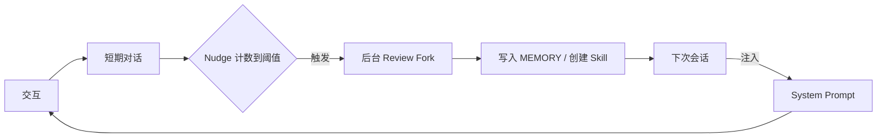
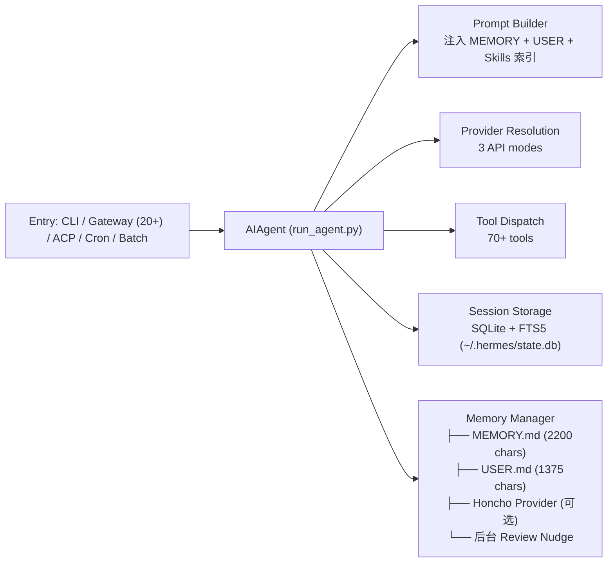
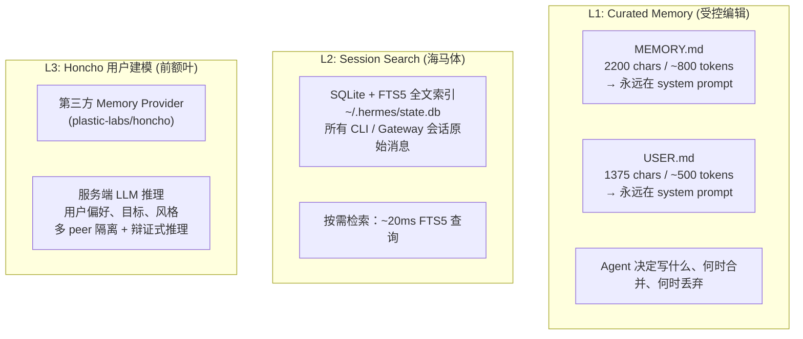
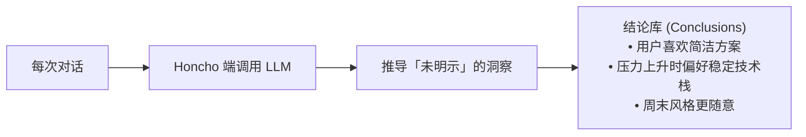
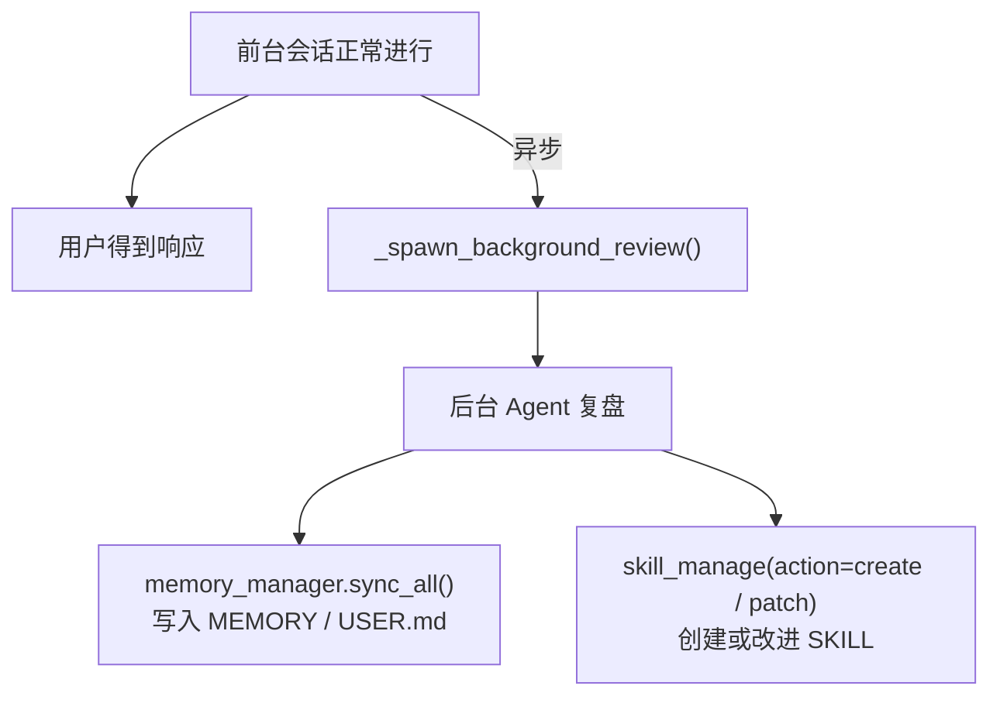
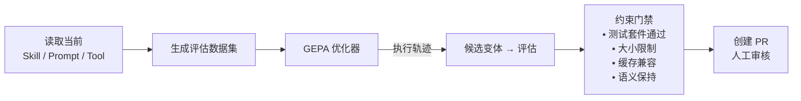

在 AI Agent 领域，"自进化"（self-evolution）这个词已经被用滥了。大多数 Agent 框架所谓的"学习"不过是把对话历史塞进上下文窗口，或者用 RAG 检索一下相关文档。**真正的自进化，是让 Agent 在不重新训练模型的前提下，从每次交互中沉淀出可复用的知识，并在未来的任务中自动调用它。**

Nous Research 在 2026 年开源的 [Hermes Agent](https://hermes-agent.nousresearch.com/docs/) 是目前少数把这个目标工程化得最系统的开源项目。它没有改模型权重，没有重新做 RLHF，而是用一套**纯文本 + 外部状态**的机制，把"成长"这件事拆解成四个可观测、可验证、可回滚的子系统。

<!--more-->

## 一、四个支柱：Hermes 的"学习闭环"

官方文档对 Hermes 的核心定位非常清晰：

> The only agent with a built-in learning loop — it creates skills from experience, improves them during use, nudges itself to persist knowledge, and builds a deepening model of who you are across sessions.

翻译成结构化的语言，整个自进化机制由四个支柱构成：

| 支柱 | 作用 | 对应的人类认知类比 |
|------|------|---------------------|
| **Curated Memory** | 跨会话记住关键事实 | 陈述性记忆（事实记忆） |
| **Skills 系统** | 把经验沉淀为可复用流程 | 程序性记忆（操作记忆） |
| **Nudge + Background Review** | 定期自省，主动沉淀 | 海马体巩固 + 睡眠复习 |
| **Honcho 用户建模** | 推理用户偏好与意图 | 前额叶人格建模 |

这四个支柱之间不是并列关系，而是一个**正反馈闭环**：



下面我们逐一拆解。

## 二、整体架构：从一行输入到一次"成长"

Hermes 的代码组织极其清晰，整个自进化机制分布在四个核心模块：



注意右下角的 **Memory Manager** —— 这是整个自进化机制的中枢。它不是一个被动存储，而是**主动 fork 后台 Agent 复盘对话的调度器**。

## 三、第一支柱：三层记忆系统

Hermes 的记忆不是单一的扁平结构，而是分为三层，每层有不同的读写语义和访问成本：



### 3.1 L1：Curated Memory 的精妙设计

L1 的设计哲学是**"少即是多"**：与其记录一切，不如让 Agent 自己决定什么值得记住。关键规则：

**容量硬限制**

```yaml
memory:
  memory_char_limit: 2200   # ~800 tokens
  user_char_limit: 1375     # ~500 tokens
```

当 Agent 试图写入超过限制时，**工具不会自动压缩，而是返回错误**：

```json
{
  "success": false,
  "error": "Memory at 2,100/2,200 chars. Adding this entry (250 chars) 
            would exceed the limit. Consolidate now: use 'replace' to 
            merge overlapping entries into shorter ones or 'remove' 
            stale or less important entries..."
}
```

这个看似"不友好"的设计背后是关键考量：**让 Agent 在同一轮对话里完成合并 → 删除 → 写入**，避免悄悄丢失信息。Agent 拿到错误后必须读 `current_entries`，识别可合并/可删除的条目，然后再试。

**Frozen Snapshot 模式**

MEMORY 在会话开始时被一次性注入到 system prompt，整个会话期间不再变化。这不是性能妥协，而是有意为之——保护 LLM 的 prefix cache（输入前缀缓存）。如果会话中途系统提示词变化，整个缓存就失效了，下次请求要重新处理所有 token，延迟和成本都会飙升。

Agent 在会话中修改 MEMORY 时，**写入磁盘立即生效，但新值要等下次会话才能被"看见"**。这是一个有趣的工程权衡：用一点"陈旧性"换巨大的性能收益。

**安全扫描**

写入前会自动扫描 prompt injection 模式、credential exfiltration、SSH 后门、以及不可见 Unicode 字符。这条防线很重要——因为 MEMORY 内容会被注入到 system prompt，污染记忆等于污染整个 Agent 的指令系统。

### 3.2 L2：Session Search 是"长期海马体"

L1 的 1300 个 token 装不下所有细节。L2 解决的是"我上周和你讨论过 X 吗？"这类召回问题。

所有 CLI 和 Gateway 会话都存入 `~/.hermes/state.db` 的 SQLite 数据库，带 FTS5 全文索引。Agent 可以调用 `session_search` 工具：

```bash
hermes sessions list            # 浏览历史会话
session_search "kubernetes 部署"  # 全文检索
```

关键区别：

| 维度 | Curated Memory | Session Search |
|------|---------------|----------------|
| 容量 | ~1300 tokens 总计 | 无限（所有会话） |
| 速度 | 即时（system prompt 注入） | ~20ms FTS5 查询 |
| 成本 | 每轮固定 token 消耗 | 免费（无 LLM 调用） |
| 管理 | Agent 手动策展 | 自动全量存储 |

这种分层设计的好处是：**核心事实（"用户偏好 TypeScript"）永远在线**，**细节召回（"上次部署的 staging server 端口"）按需检索**。

### 3.3 L3：Honcho 的辩证式用户建模

L1 和 L2 本质上都是"存储"。但**用户从未明确说过的话**，比如"用户最近压力比较大""他更喜欢简洁的方案"——这些需要**推理**才能得到。

Honcho（来自 Plastic Labs）是 Hermes 推荐的第三方 Memory Provider，专门做这件事。它的核心是 **Dialectic Reasoning（辩证推理）**：



**多 Pass 深度推理**：

默认 `dialecticDepth=1`，但可以设为 2 或 3：

- **Pass 0**：Cold 或 Warm prompt（Cold 问"这个人是谁"，Warm 问"本会话相关上下文"）
- **Pass 1**：Self-audit —— 识别初始评估的漏洞，从近期会话合成证据
- **Pass 2**：Reconciliation —— 检查前面 pass 的矛盾，产出最终综合

每次 pass 可以用不同的推理等级（minimal/low/medium/high/max），并且**如果上一 pass 输出足够强，后面的 pass 会提前 bail out**——节省成本。

**多 Peer 隔离**：当你同时跑两个 Hermes 实例（比如一个编码助手、一个个人助理），Honcho 为每个 agent 维护独立的 peer profile。编码助手看到的"你"和个人助理看到的"你"不会串台。

## 四、第二支柱：Nudge 机制 —— 周期自省的触发器

L1/L2/L3 是被动的存储层。要让 Agent 真正"成长"，需要一个**主动触发器**：什么时候应该回头审视刚才的对话？

Hermes 的答案是 **Nudge（轻推）**：

```python
# run_agent.py 核心逻辑（简化）
self._turns_since_memory += 1
self._turns_since_skill += 1

if self._turns_since_memory >= _memory_nudge_interval:
    self._should_review_memory = True

if self._turns_since_skill >= _skill_nudge_interval:
    self._should_review_skill = True
```

两类 Nudge 各自独立：

| Nudge 类型 | 计数单位 | 命中后行为 | 默认间隔 |
|------------|---------|-----------|---------|
| Memory Nudge | 用户消息轮数 | 后台 Review 写入 MEMORY.md / USER.md | 可配置 |
| Skill Nudge | 主循环迭代次数 | 后台 Review 创建或 patch SKILL.md | 可配置 |

**关键设计**：Nudge 本身不执行任何写入，**只设置一个 flag**。真正的写入由后台 Review 异步执行。这样**前台对话的延迟不会受影响**。

### 4.1 后台 Review：Fork 一个独立 Agent 复盘

Nudge 命中后，Hermes 在后台 fork 一个独立的 Agent 实例，传入当前会话的压缩摘要，让它判断"这次对话是否产生了值得固化的知识"：



后台 Review 的输出有三种去向：

1. **写入 MEMORY**：用户偏好、环境事实、项目约定（"项目用 pnpm 而不是 npm"）
2. **创建/改进 Skill**：成功的工作流（"部署到 staging 的步骤"）
3. **什么都不做**：对话没有产生新知识

### 4.2 成本控制：在便宜模型上跑 Review

后台 Review 默认跑在主对话模型上，但因为它复用的是**已经在缓存中的对话**（warm cache），成本其实很低。

如果主模型很贵（比如 Opus 4.5），可以指定一个便宜模型：

```yaml
auxiliary:
  background_review:
    provider: openrouter
    model: google/gemini-3-flash-preview
```

官方基准测试显示，**切到 Gemini 3 Flash 后成本降为 1/3 到 1/5**，记忆和技能捕获质量几乎不变——因为 Review 不需要前沿推理能力，只需要模式匹配和摘要。

### 4.3 Write Approval Gate：用户可控

担心 Agent 记错东西？Hermes 提供 write approval gate：

```yaml
memory:
  write_approval: true   # 每次写入前需要确认
skills:
  write_approval: true
```

开启后，所有后台 Review 的写入会**暂存**而不是立即生效：

```bash
/memory pending           # 查看待审核的记忆条目
/memory approve <id>      # 确认
/memory reject <id>       # 拒绝

/skills pending            # 查看待审核的技能修改
/skills diff <id>          # 查看完整 diff
/skills approve <id>       # 应用
```

这是**信任校准的关键开关**：默认全自动（write_approval=false），可以随时切换到"审核模式"。

## 五、第三支柱：Skills 系统 —— 程序性记忆

如果 MEMORY 是"知道什么"，那 Skills 就是"会做什么"。

Skills 是遵循 [agentskills.io](https://agentskills.io) 开放标准的 Markdown 文档，存放在 `~/.hermes/skills/`：

```
~/.hermes/skills/
├── mlops/axolotl/SKILL.md          # 内置技能
├── devops/deploy-k8s/SKILL.md      # Agent 自创建
└── .hub/lock.json                  # Hub 安装记录
```

### 5.1 渐进式披露（Progressive Disclosure）

Skills 用三级加载模式**最小化 token 消耗**：

```
Level 0: skills_list()  → [{name, description}, ...]    (~3k tokens)
Level 1: skill_view(name) → 完整内容                       (按需)
Level 2: skill_view(name, path) → 引用文件                  (按需)
```

Agent 在每个会话开始时只看到 Level 0 的索引（"有哪些技能可用"），只有真的需要某个技能时才加载完整内容。这跟 RAG 的 chunking 思路类似，但应用在**程序性知识**上。

### 5.2 自我改进：Skill Patch

Skills 不是只读的。Agent 在使用某个 Skill 的过程中，如果发现工作流可以优化，会**主动 patch** 这个 Skill：

```bash
skill_manage(action="patch", target="deploy-k8s", 
              old_text="kubectl apply -f deployment.yaml",
              content="kubectl apply -f deployment.yaml && kubectl rollout status deployment/app")
```

这种"边用边改"的能力让 Skills 库像代码一样**持续演化**——但更慢、更保守。

### 5.3 /learn：把经验转成 Skill

用户也可以主动触发 Skill 创建。`/learn` 命令把任何来源的材料变成一个符合标准格式的 Skill：

```bash
/learn the REST client in ~/projects/acme-sdk, focus on auth
/learn https://docs.example.com/api/quickstart
/learn how I just deployed the staging server  # 把刚才的工作流沉淀成 Skill
```

`/learn` 不是独立服务，而是**复用现有的 Agent + skill_manage 工具**——把"采集素材"和"写入 Skill"两件事，都交给同一个 Agent 用它已有的工具完成。这是个很优雅的元设计：**Skill 系统本身就是用 Skills 创建的**。

## 六、第四支柱：Self-Evolution Pipeline（高级模式）

上面三个支柱都是**运行时**的自进化——在用户使用 Agent 的过程中学习。Nous Research 还有一个**离线**的自进化管道，单独建了一个 repo：

**[`NousResearch/hermes-agent-self-evolution`](https://github.com/NousResearch/hermes-agent-self-evolution)**

核心引擎是 **DSPy + GEPA**（Genetic-Pareto Prompt Evolution）：



GEPA 的特别之处是：**它不仅看"变体是否失败"，还读执行轨迹理解"为什么失败"**，然后提出有针对性的改进。这是 Genetic-Pareto 的核心思想——在多个目标（正确性 / 简洁性 / 性能）之间找 Pareto 前沿。

**五阶段路线图**：

| Phase | 优化目标 | 引擎 | 状态 |
|-------|---------|------|------|
| Phase 1 | Skill 文件 (SKILL.md) | DSPy + GEPA | ✅ 已实现 |
| Phase 2 | 工具描述 | DSPy + GEPA | 🔲 计划中 |
| Phase 3 | 系统提示部分 | DSPy + GEPA | 🔲 计划中 |
| Phase 4 | 工具实现代码 | Darwinian Evolver | 🔲 计划中 |
| Phase 5 | 持续改进闭环 | 自动化管道 | 🔲 计划中 |

**所有变体必须通过的约束门禁**：

- ✅ 完整测试套件通过（pytest tests/ -q）
- ✅ 大小限制：Skill ≤ 15KB，工具描述 ≤ 500 字符
- ✅ 缓存兼容：不引入中间对话的系统提示变化
- ✅ 语义保持：不偏离原始目的
- ✅ PR 审核：永远走人工 PR，**永不自动 commit**

每次优化成本约 $2-10 美元（API 调用，无 GPU 训练）。

## 七、约束与权衡

Hermes 的设计不是没有取舍。几个值得注意的边界：

**1. 容量有限 vs 记忆无限**

MEMORY 故意限制在 ~1300 tokens。这跟"记住越多越好"的直觉相反——但工程上是对的：每次 prompt 多 1000 tokens，每天 100 轮对话就是 100k tokens 的额外成本。限制容量倒逼 Agent **学会遗忘**和**学会合并**。

**2. Frozen Snapshot vs 实时更新**

MEMORY 写盘后，下次会话才能被"看见"。这保护了 prefix cache，但牺牲了一点实时性。对于绝大多数场景这个权衡是值得的——除非用户频繁切换话题。

**3. Write Approval 的 UX 成本**

开启 `write_approval: true` 后，每个后台写入都要审核。如果用户和 Agent 每天交互 50 轮，光审核就能把人累死。**默认关闭是有道理的**——你信任你的 Agent，就像你信任你的 IDE 自动保存。

**4. 进化不是无界**

Self-Evolution Pipeline 用 PR 审核 + 测试门禁把所有改动锁在"人类可控"的范围内。这跟传统 RLHF 的"自动更新权重"形成鲜明对比——**Hermes 赌的是"演进式提示词 + 程序性记忆"比"更新参数"更可控**。

## 八、为什么这套设计值得借鉴

抛开 Hermes 本身的技术细节，它的**架构哲学**对所有做 Agent 的人都有启发：

1. **把"成长"拆解成可观测的子系统**：Memory / Skill / Nudge / Honcho 各自独立，可以单独打开/关闭/审核。这比"黑盒的 self-improving agent"好调试得多。

2. **容量限制是功能，不是 bug**：硬限制逼迫 Agent 学会遗忘和合并——这两个能力本身就是"智能"的一部分。

3. **被动存储 + 主动固化 的分层**：FTS5 全文检索存全量原始对话，Curated Memory 只存精炼事实。两层各司其职。

4. **成本敏感的进化**：后台 Review 可以跑在便宜模型上，Self-Evolution Pipeline 单次只花 $2-10。这让"持续学习"在工程上可持续。

5. **开放标准优先**：Skills 兼容 agentskills.io，Honcho 是独立项目。这避免供应商锁定，也让社区贡献成为可能。

Hermes 不是完美的——它的依赖很重（70+ 工具、20+ 平台、3 种 API 模式），学习曲线陡峭。但作为**第一个把"自进化"从口号变成工程系统的开源 Agent**，它给整个行业提供了一个可参考的范式。

---

**参考资料**

- [Hermes Agent 官方文档](https://hermes-agent.nousresearch.com/docs/)
- [Persistent Memory](https://hermes-agent.nousresearch.com/docs/user-guide/features/memory)
- [Skills System](https://hermes-agent.nousresearch.com/docs/user-guide/features/skills)
- [Honcho Memory](https://hermes-agent.nousresearch.com/docs/user-guide/features/honcho)
- [Architecture](https://hermes-agent.nousresearch.com/docs/developer-guide/architecture)
- [hermes-agent-self-evolution](https://github.com/NousResearch/hermes-agent-self-evolution)
- [GEPA: Genetic-Pareto Prompt Evolution (ICLR 2026 Oral)](https://github.com/gepa-ai/gepa)
- [agentskills.io 开放标准](https://agentskills.io)