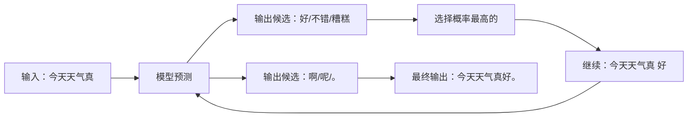

大模型很强大，但它的原理朴素得令人失望——**它做的事情就是「文字接龙」**。ChatGPT 给你的所有回答，都是一个个字「接」出来的。

这四个字听起来敷衍，但真正的好奇心不会停在表面——**它怎么知道下一个字该接什么？它是怎么学的？它为什么这么强？**这篇文章就用最朴素的方式，把这三个问题讲清楚。不绕弯、不堆术语，5 分钟讲明白，也能 5 分钟听懂。

<!--more-->

## 一句话讲清楚：大模型是什么？

**大模型（LLM）的本质是一个超级「文字接龙」高手。**

你给一句「今天天气真」，它会接「好」；给「苹果的颜色是」，它会接「红色」。**它做的事情就是预测下一个字应该是什么**。

就这么简单。听起来很弱是不是？——「这不就是输入法联想吗？」

区别在于：

- **输入法联想**只用了几十 MB 的语料，知道的是「常见词组合」
- **大模型**用了人类出版过的几乎所有文字，知道的是「人类语言的统计规律」

「大」就大在这里——它读了人类有史以来几乎所有的书、文章、新闻、对话，把语言的统计规律学了个透。

当你问它「为什么天空是蓝色的」，它不是在「想」，而是基于训练中学到的「最像人话」的文字，**一个字一个字续写**下去。

下面这张图是大模型生成文字的过程：

每次只预测下一个字。但正因为读得多、学得深，**它在每一个「下一个字」的瞬间都能选到最像人话的那个**。

## 它是怎么「学会」的？

讲这部分，最有效的类比是「**海量阅读的小学生**」。

想象一个孩子从出生开始，每天读书 16 小时，不间断读 20 年——读完整个图书馆。读的过程中，没人教他「这是什么」或「为什么」，只是不断给他看「下一句接什么」。**这个孩子最终会变成什么？**

- 不知道「苹果」是什么，但知道「苹果是甜的」、「苹果长在树上」、「苹果是红色的」
- 不知道「物理定律」，但知道「力是改变物体运动的原因」
- 不知道「爱是什么」，但知道「爱让人想念」、「爱让人付出」

**这就是大模型训练的核心机制**——

1. 给它一段话
2. 遮住最后一个字，让它猜
3. 告诉它猜的对不对
4. 调整内部的「参数」，让下次猜得更准
5. 重复这个过程几十亿次

经过这个过程，它没有「理解」世界，**但它掌握了「什么词后面跟什么词最像人话」的统计规律**。

> 一个不恰当但有用的类比：大模型就像一个**读了几亿本书但从来没出过门的学者**——他知道书上的一切，但「纸上谈兵」。

但光有这个类比还不够。下面几个问题，是普通人心里的真实疑惑——

### 它读的到底是什么？

「读完人类有史以来几乎所有的书」具体是多大？给你几个数字感受一下：

- **训练数据量**：GPT-3 训练时读了约 **5000 亿个词**，相当于 500 万本中等长度的书，或整个英文维基百科的 20 倍
- **训练算力**：上千块顶级 GPU 并行跑几个月
- **训练成本**：单次训练数百万到上千万美元（主要是电费）

听起来夸张，但对一个「要读完人类所有书的机器」来说，这个量是合理的——一个普通人读完同等量的书要花一辈子。

这些文字包含：网站、新闻、维基百科、小说、论文、对话记录……**几乎所有人类公开发表过的文字**。

### 「参数」到底是什么？

前面提到「大模型有 1750 亿参数」，「参数」是个什么鬼？

**最朴素的解释：参数 = 大模型大脑里的「神经连接强度」**。

人类大脑里有约 1000 亿个神经细胞，细胞之间的连接强度不同，所以不同的人擅长不同的事。**大模型的「参数」就是这种连接强度**——只是它是数字，可以被精确调整。

- 参数少（几百万）→ 相当于婴儿的大脑，只能做最简单的事
- 参数中等（几十亿）→ 相当于孩子的大脑，能说简单的话
- 参数巨大（几千亿）→ 相当于成年人的大脑，能做复杂推理

**大模型的「学习」，就是不断调整这上千亿个「连接强度」**——让它在看到「苹果」时，能正确激活「红色」、「甜」、「乔布斯」、「牛顿」等关联概念。

### 训练其实分两步

实际训练一个 ChatGPT 这样的「大模型」，分两步走：

**第一步：自监督学习（读海量文字）**

这一步就是上面那个「读了几亿本书的小学生」——给它看「下一句接什么」，让它反复猜，猜错了就调整内部的连接强度。

这一步**不需要任何人标注**——文字本身就是答案（最后一个字就是答案）。这是为什么大模型能用海量数据训练——不需要请人一个一个教。

**第二步：人类反馈（让模型变得更「有用」）**

光读完书，模型只会「续写」，但不会「按你的意图回答」。

举例：你问「如何治疗感冒」，模型可能续写出「感冒的原因可能是病毒感染，最好去医院检查」——这是「像人话」，但不是「有用的回答」。

所以训练师会给模型看大量「好回答 vs 坏回答」的对比，让模型学「什么样的回答更受人类欢迎」——这一步叫 **RLHF（Reinforcement Learning from Human Feedback，基于人类反馈的强化学习）**。

简单说：
- 第一步让模型「会说话」
- 第二步让模型「会好好说话」

这就像一个学生，先读完书有知识，再经过老师批改作业学会「怎么表达更得体」。ChatGPT 比纯语言模型好用这么多，关键就在这第二步。

### 为什么它能「举一反三」？

最神奇的事情是：**大模型从来没在训练时见过「给我讲个冷笑话」这种 prompt，但它看到之后能理解并执行**。

这叫**泛化能力**——它从海量文字中学到的不是「具体答案」，而是「语言的底层结构」和「世界的常识」。

就像一个读过上万篇小说的作家，**即使没写过科幻题材，他也能写出像样的科幻小说**——因为他掌握了「小说的结构」。

**大模型学到的不是「答案」，而是「语言的结构」和「世界的常识」**。这让它能处理训练时没明确见过的新问题。

但这种「举一反三」不是无限的——

- 如果你问一个**训练时完全没出现过**的领域（比如某种极冷门的方言、某种全新发明），它就会卡壳
- 如果你问**需要真实世界经验**的事（比如「这杯咖啡好不好喝」），它没法回答——它没喝过

## 为什么规模越大越聪明？

2020 年的 GPT-3 有 1750 亿参数，2024 年的 Claude 3 或 GPT-4 有数千亿到万亿参数。**为什么参数越多效果越好？**

这部分最反直觉，但有一个好类比——「**涌现**」。

想象 100 只蚂蚁，每只都很笨，它们只会做简单的事——找食物、留下气味、跟同伴。但当 100 万只蚂蚁协同起来时，它们能建造复杂的蚁巢、抵御洪水、找到最远的食物。

**没有任何一只蚂蚁懂得「建巢」，但整个蚁群懂得。**

大模型也是这样——

- 100 万参数的模型：能写出通顺的句子，但经常语法错误
- 1 亿参数的模型：能写出没错误的句子，但内容空洞
- 100 亿参数的模型：能写出有内容的回答
- 1000 亿参数的模型：突然学会了「推理」、「翻译」、「写代码」

这种「**量变引起质变**」的现象就叫**涌现**。没人教 1000 亿参数的模型「推理」——但当参数多到一定程度，**它自己「涌现」出了推理能力**。

这就是「大力出奇迹」的科学基础。

## 它和搜索引擎有什么不一样？

这是普通人最容易混淆的。

| | 搜索引擎 | 大模型 |
|---|---|---|
| 数据来源 | 整个互联网的实时索引 | 训练时的固定语料（截至 2023/2024）|
| 工作方式 | 关键词匹配 + 排序 | 一个字一个字续写 |
| 回答方式 | 列 10 个链接 | 直接给「答案」（其实是续写出的文本）|
| 信息准确性 | 高（指向真实页面）| 低（可能胡编乱造）|
| 时效性 | 实时 | 受限于训练截止日期 |

最关键的区别：**搜索引擎告诉你「去哪找」，大模型告诉你「答案是什么」**。

搜索引擎给的是「**参考链接**」，准确但要你自己看；大模型给的是「**整合后的文字**」，方便但可能错。

## 它会「胡说八道」吗？

会，**而且经常**。大模型有一个专有名词叫「Hallucination」（幻觉），意思就是**一本正经地编造**。

举例：

> 问：「爱因斯坦得过诺贝尔物理奖吗？」
> 大模型：「是的，1921 年因光电效应获奖。」 ← 这个其实对

> 问：「爱因斯坦获得过奥斯卡最佳男主角吗？」
> 大模型：「是的，1945 年因《相对论》一片获奖。」 ← **这是胡说**

大模型没有「事实」的概念，**它不知道什么是真的什么是假的**。它只知道「什么词后面跟什么词最像人话」。

如果训练语料里「爱因斯坦 + 诺贝尔 + 物理」经常一起出现，它就会续写出「爱因斯坦因光电效应获诺贝尔物理学奖」——即使这是胡编的。

**这就是为什么永远不能 100% 相信大模型的输出**——尤其是涉及事实、数字、引用的时候。

实用建议：**重要的事情用大模型给思路，但用搜索引擎验证事实**。

## 它会「思考」吗？

这是哲学问题。我个人的判断是：**不会，至少不是人类意义上的「思考」**。

人类的「思考」是基于「理解」的——我知道「苹果」是什么（红的、圆的、甜的、有苹果派的香味）。

大模型的「思考」是基于「模式匹配」的——它知道「苹果」这个词后面经常跟「红色」、「甜的」、「维生素 C」、「乔布斯」、「牛顿」。

举例：

> 问：「一个房间里有 3 个人，又进来 5 个人，又出去 2 个人，现在有几个人？」
> 大模型能答对：6 个
>
> 但如果你追问：「为什么是 6 个？」它可能会回答：「因为 3+5-2=6」——但它**不是真的理解加减法**。它只是看到「房间 + 人数变化」后，模式匹配到了「3+5-2」这个表达。

这就是「**看起来聪明但其实不聪明**」的本质。**它的「聪明」是统计的，不是理解的**。

## 普通人应该如何用好它？

讲完原理，最后给一些实用建议：

### 1. 把大模型当成「超级助理」而不是「无所不知的神」

它最适合做「**需要语言处理**」的工作——写邮件、改文章、翻译、总结、头脑风暴。

它**不适合**做「**需要事实核查**」的工作——查最新新闻、查具体数字、查法律条文。

### 2. 学会「**提示词工程**」（prompt engineering）

大模型的能力取决于你怎么问它。同样的问题，**好的提问方式能让回答质量提升 10 倍**。

举例：

> 差的问题：「帮我写个营销文案」
> 好的问题：「帮我写一段小红书风格的咖啡店推广文案，目标客户是 25-30 岁都市白领，特点是温暖治愈、长度 200 字以内」

**问题越具体，回答越好**。

### 3. 不要盲目相信，永远自己思考

大模型给的任何结论，你都要**保持质疑**。它可能错。

最好的用法是：**它给建议，你做决定**。

### 4. 学会和它对话，而不是命令它

大模型不是「工具」，它更像是「**对话伙伴**」。你给它上下文，它给你回应；你追问，它深化；你纠正，它调整。

把它当成一个「什么都愿意聊但偶尔会跑偏的实习生」——你给方向，它干活，你把关。

## 写在最后

大模型不是魔法。它的原理其实朴素得令人失望——

- **是什么**：超级文字接龙
- **怎么学**：读海量文字，找统计规律
- **为什么强**：参数多到一定程度，会涌现出意想不到的能力
- **会错吗**：会，而且经常，因为不理解事实
- **会思考吗**：不会，是模式匹配

但朴素的原理加上巨大的规模，产生的能力是**革命性**的。

回到开头的问题——「**怎么跟普通人讲大模型**」——我给一个万能开场：

> 「你用过输入法吗？大模型就是**把输入法接龙做到了极致**——它读了人类有史以来几乎所有的书，把『下一个字该是什么』学到了极致。所以你问它任何问题，它都会像**最像人话**那样回答你。但它只是「像人话」，不是「真懂」。它不知道什么是真什么是假，它只知道什么像人话。」

如果对方还不懂，举个具体例子——

> 「我输入『今天天气真』，它会接『好』。我输入『北京是中国的』，它会接『首都』。这就是它的工作——**一个字一个字续写**。ChatGPT 回答你的所有内容，都是这么一个个字『接』出来的。」

这就是大模型的全部秘密。

**不神秘，但很强大**。