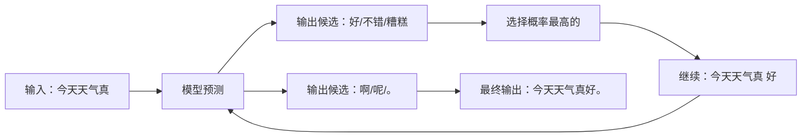

大模型很强大，但原理朴素得令人失望——**它做的事情就是「文字接龙」**。它怎么知道下一个字该接什么？怎么学的？为什么这么强？下面用最朴素的方式，把这三个问题讲清楚。

<!--more-->

## 一句话讲清楚：大模型是什么？

**大模型（LLM）的本质是一个超级「文字接龙」高手。**

你给它「今天天气真」，它接「好」；给它「苹果的颜色是」，它接「红色」。**它的工作就是预测下一个字**。

听起来很弱——「这不就是输入法联想吗？」区别在于「**大**」：输入法只学了常用词组合，大模型学了人类几乎所有的书、文章、对话，掌握的是「人类语言的统计规律」。

## 它是怎么「学会」的？

最有效的类比是「**海量阅读的小学生**」——从出生起每天读书 16 小时，不间断 20 年，读完整个图书馆。没人教他「这是什么」，只让他看「下一句接什么」。

这个孩子最后：

- 不知道「苹果」是什么，但知道「苹果是甜的」、「苹果长在树上」、「苹果是红色的」

**他掌握的不是「世界的真相」，而是「什么词后面跟什么词最像人话」**。这就是大模型的训练——给它海量文字，让它一遍遍猜「下一个字」，猜错了就调内部参数（相当于大脑的神经连接强度），猜对了就强化。重复几十亿次。

**答案是文字本身**。「今天天气真好」藏起「好」让模型猜，「好」就是这一轮的答案——不需要任何「老师」标。这就是大模型能用几万亿字语料训练的原因：**「答案」免费**。

训练分两步：先让它「会说话」（读海量文字），再让它「会好好说话」（人工给它看「好回答 vs 坏回答」）。

> 大模型就像一个**读了几亿本书但从来没出过门的学者**——他知道书上的一切，但「纸上谈兵」。

## 为什么规模越大越聪明？

GPT-3 有 1750 亿参数，GPT-4 可能有数万亿。**为什么参数越多效果越好？**

这部分最反直觉，但有一个好类比——「**涌现**」。

想象 100 万只蚂蚁协同：它们能建造复杂蚁巢、抵御洪水、找到最远食物。**没有任何一只蚂蚁懂得「建巢」，但整个蚁群懂得**。

大模型也是这样——**当参数多到一定程度，它自己「涌现」出了推理能力**，没人教它。这就是「大力出奇迹」的科学基础。

## 写在最后

回到开头——「**怎么跟普通人讲大模型**」——一个万能开场：

> 「你用过输入法吗？大模型就是**把输入法接龙做到了极致**——它读了人类有史以来几乎所有的书，把『下一个字该是什么』学到了极致。但它只是「像人话」，不是「真懂」。」

这就是大模型的全部秘密：**不神秘，但很强大**。