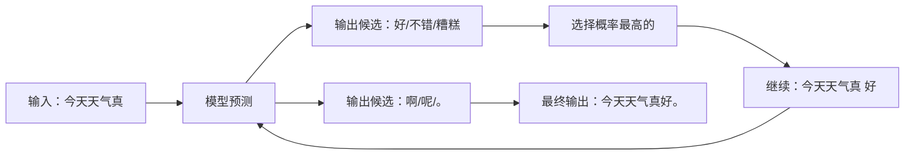

大模型很强大，但它的原理朴素得令人失望——**它做的事情就是「文字接龙」**。ChatGPT 给你的所有回答，都是一个个字「接」出来的。

这四个字听起来敷衍，但真正的好奇心不会停在表面——**它怎么知道下一个字该接什么？它是怎么学的？它为什么这么强？**这篇文章就用最朴素的方式，把这三个问题讲清楚。不绕弯、不堆术语，5 分钟讲明白，也能 5 分钟听懂。

<!--more-->

## 一句话讲清楚：大模型是什么？

**大模型（LLM）的本质是一个超级「文字接龙」高手。**

你给它「今天天气真」，它接「好」；给它「苹果的颜色是」，它接「红色」。**它的工作就是预测下一个字**。

听起来很弱——「这不就是输入法联想吗？」

区别在于「**大**」：

- **输入法**只学了常用词组合
- **大模型**学了人类几乎所有的书、文章、对话，掌握的是「人类语言的统计规律」

「大」就大在这里——它读了人类有史以来几乎所有的文字。所以它在每个「下一个字」的瞬间，都能选到「最像人话」的那个。

每次只预测下一个字。但**正因为读得多、学得深，它在每一个瞬间都能选到最像人话的那个**。

## 它是怎么「学会」的？

最有效的类比是「**海量阅读的小学生**」。

想象一个孩子从出生开始，每天读书 16 小时，不间断读 20 年——读完整个图书馆。读的过程中，没人教他「这是什么」，只是不断给他看「下一句接什么」。

这个孩子最终会变成什么？

- 不知道「苹果」是什么，但知道「苹果是甜的」、「苹果长在树上」、「苹果是红色的」
- 不知道「物理定律」，但知道「力是改变物体运动的原因」

**他掌握的不是「世界的真相」，而是「什么词后面跟什么词最像人话」**。这就是大模型的训练——给它海量文字，让它一遍遍猜「下一个字是什么」，猜错了就调整内部参数（相当于大脑的神经连接强度），猜对了就强化这个连接。重复几十亿次。

整个训练分两步：

- **第一步：让它会说话**——给它读海量文字，自学「什么词后面接什么」
- **第二步：让它会好好说话**——人工给它看「好回答 vs 坏回答」，让它学「什么样的回答更受欢迎」

> 大模型就像一个**读了几亿本书但从来没出过门的学者**——他知道书上的一切，但「纸上谈兵」。

## 为什么规模越大越聪明？

GPT-3 有 1750 亿参数，GPT-4 可能有数万亿。**为什么参数越多效果越好？**

这部分最反直觉，但有一个好类比——「**涌现**」。

想象 100 万只蚂蚁协同起来：它们能建造复杂的蚁巢、抵御洪水、找到最远的食物。**没有任何一只蚂蚁懂得「建巢」，但整个蚁群懂得**。

大模型也是这样：

- 100 万参数：能写出通顺句子，但经常语法错误
- 1 亿参数：能写出没错误的句子，但内容空洞
- 1000 亿参数：突然学会了「推理」、「翻译」、「写代码」

**没人教 1000 亿参数的模型「推理」——但当参数多到一定程度，它自己「涌现」出了推理能力**。

这就是「大力出奇迹」的科学基础。

## 它和搜索引擎有什么不一样？

这是普通人最容易混淆的。

**搜索引擎** = 给你 10 个链接，你自己去查
**大模型** = 直接给你一段答案（其实是续写出的文字）

| | 搜索引擎 | 大模型 |
|---|---|---|
| 数据来源 | 整个互联网的实时索引 | 训练时的固定语料 |
| 工作方式 | 关键词匹配 + 排序 | 一个字一个字续写 |
| 准确性 | 高（指向真实页面）| 低（可能胡编乱造）|
| 时效性 | 实时 | 受限于训练截止日期 |

**搜索引擎给的是「参考链接」，大模型给的是「整合后的文字」——方便，但可能错**。

## 它会「胡说八道」吗？

会，而且经常。专业术语叫 **Hallucination（幻觉）**——一本正经地编造。

> 问：「爱因斯坦获得过奥斯卡最佳男主角吗？」
> 大模型：「是的，1945 年因《相对论》一片获奖。」 ← **这是胡说的**

大模型没有「事实」的概念。**它不知道什么是真什么是假，它只知道什么词后面跟什么词最像人话**。如果训练语料里「爱因斯坦 + 物理 + 诺贝尔」经常一起出现，它就会续写出「爱因斯坦因光电效应获诺贝尔物理学奖」——即使这是胡编的。

**这就是为什么重要的事情永远要用搜索引擎验证，不能 100% 相信大模型**。

## 它会「思考」吗？

不会，至少不是人类意义上的「思考」。

人类的「思考」是基于「理解」的——我知道「苹果」是什么（红的、圆的、甜的）。

大模型的「思考」是基于「模式匹配」的——它知道「苹果」这个词后面经常跟「红色」、「甜的」、「乔布斯」、「牛顿」。

> 问：「一个房间里有 3 个人，又进来 5 个人，又出去 2 个人，现在有几个人？」
> 大模型能答对：6 个
> 但如果追问：「为什么是 6 个？」它会回答「因为 3+5-2=6」——**它不是真的理解加减法，只是模式匹配到了这个表达**。

**它的「聪明」是统计的，不是理解的**。

## 普通人应该如何用好它？

### 1. 当成「超级助理」，不是「无所不知的神」

它适合做「需要语言处理」的工作：写邮件、改文章、翻译、总结、头脑风暴。
它不适合做「需要事实核查」的工作：查最新新闻、查具体数字、查法律条文。

### 2. 学会具体地提问

> 差：「帮我写个营销文案」
> 好：「帮我写一段小红书风格的咖啡店推广文案，目标客户是 25-30 岁都市白领，温暖治愈，200 字以内」

**问题越具体，回答越好**。

### 3. 不要盲目相信，自己做决定

它给的任何结论都要保持质疑。**它给建议，你做决定**。

### 4. 当成对话伙伴，不是工具

它更像「什么都愿意聊但偶尔会跑偏的实习生」——你给方向，它干活，你把关。

## 写在最后

回到开头——「**怎么跟普通人讲大模型**」——一个万能开场：

> 「你用过输入法吗？大模型就是**把输入法接龙做到了极致**——它读了人类有史以来几乎所有的书，把『下一个字该是什么』学到了极致。所以你问它任何问题，它都会像**最像人话**那样回答你。但它只是「像人话」，不是「真懂」。它不知道什么是真什么是假，它只知道什么像人话。」

如果对方还不懂，举个具体例子：

> 「我输入『今天天气真』，它会接『好』。这就是它的工作——**一个字一个字续写**。ChatGPT 回答你的所有内容，都是这么一个个字『接』出来的。」

这就是大模型的全部秘密。

**不神秘，但很强大**。