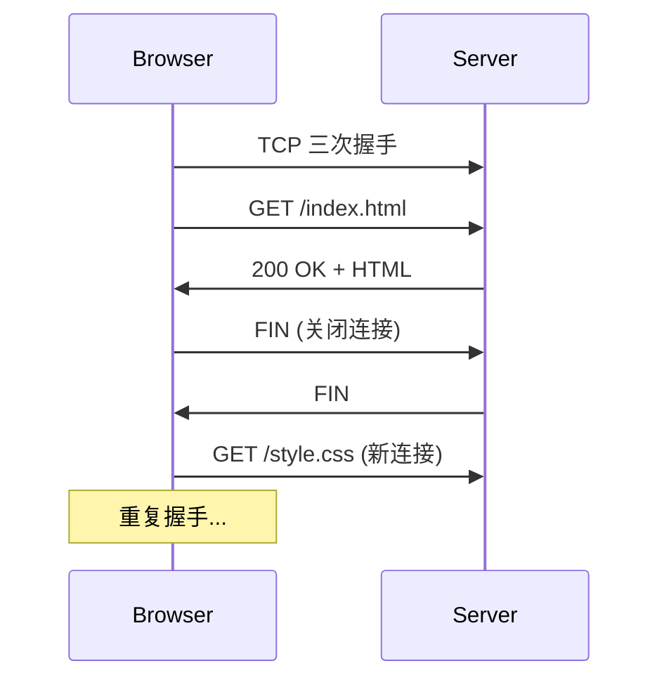
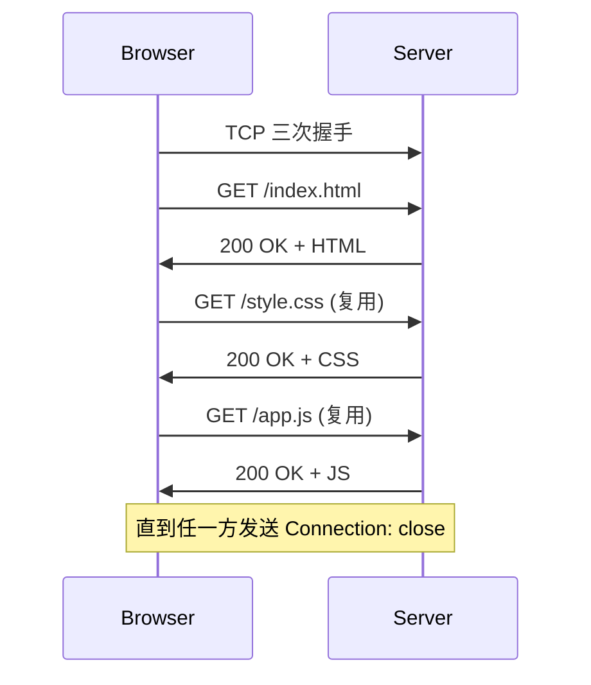
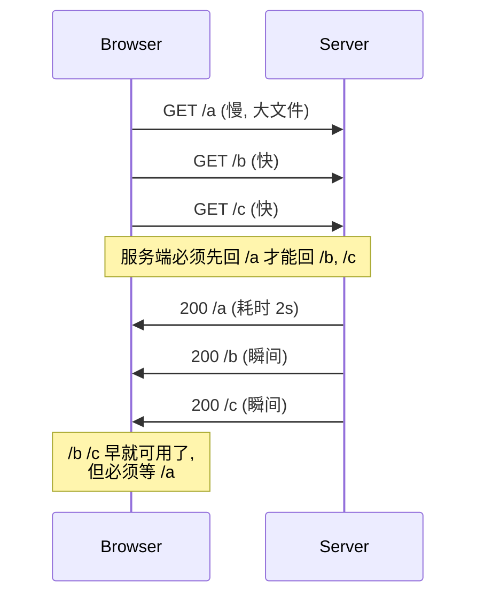
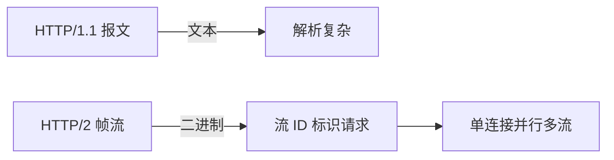
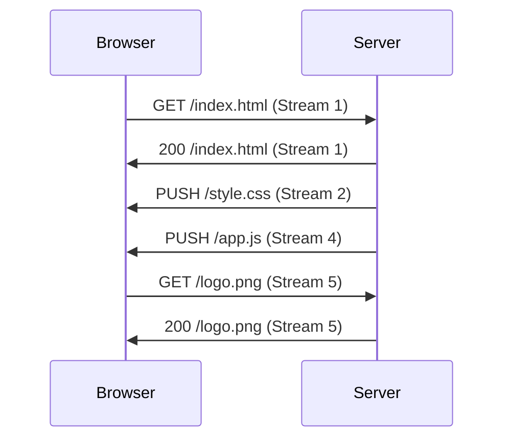

2015 年初，一个普通的网页大约包含 100+ 个 HTTP 请求（HTML、CSS、JS、图片、字体、统计、追踪）。用 HTTP/1.0 的浏览器加载完一个页面要等几十秒——不是带宽不够，是 TCP 连接来回握手、响应必须串行排队这两个看似无关的设计叠加起来，把延迟推到了用户能感知的阈值。

从 HTTP/1.0（RFC 1945，1996）到 HTTP/2（RFC 7540，2015），整个 20 年的演进史可以浓缩成三个工程问题：**怎么减少 TCP 握手？怎么并行？怎么压缩重复的头？**

<!--more-->

## 一、HTTP/1.0：一次请求一个连接

1996 年的 HTTP/1.0 把"请求-响应"做得最简单：浏览器要一个资源就开一个 TCP 连接，拿到响应就关掉。



页面上有 100 个资源就要 100 次握手 + 100 次挥手。每条 TCP 连接都得经历：

1. 三次握手（1.5 个 RTT）
2. 慢启动（最初几个报文拥塞窗口小）
3. 请求-响应
4. 四次挥手

RTT（Round-Trip Time）哪怕只有 50ms，100 个串行请求光握手就要 7.5 秒。这还只是握手时间，没算数据传输。

### 1.0 时代的优化：并行连接

既然串行太慢，浏览器就并行开多条连接。HTTP/1.0 规范没限制并发数，浏览器自己定了个**经验值 6**（Chrome 后来改到 6~8）。100 个资源 ÷ 6 并发 = 17 个"批次"，握手开销被压到 1/6。

但这是**绕过问题**，不是解决问题。每个连接依然要走完三次握手 + 慢启动。

## 二、HTTP/1.1：连接复用和管道化（RFC 2616，1999）

HTTP/1.1 的两个核心改进都是为了减少 TCP 握手的开销。

### 2.1 持久连接（Persistent Connection）

默认 `Connection: keep-alive`，一条 TCP 连接上可以连续处理多个请求-响应，直到一方显式关闭或超时。



带来的好处：

- 100 个资源只需 1 次握手（节省 ~1.5 RTT × 99 ≈ 7.4 秒）
- TCP 拥塞窗口已进入稳定状态，单连接吞吐更高
- 服务端 fd 占用线性下降（Web 服务器早期常见的 `Too many open files` 问题缓解）

### 2.2 管道化（Pipelining）

HTTP/1.1 允许客户端**不发完一个等一个**，而是连续发出多个请求：

```
客户端: GET /a, GET /b, GET /c   ← 一次性发 3 个请求
服务端: 200 /a, 200 /b, 200 /c   ← 必须按 FIFO 顺序回
```

听起来很美，但有个致命问题：**Head-of-Line Blocking（队头阻塞）**。



如果第一个请求是个 2MB 的 CSS，后面几十个小的 JS、CSS、图标都被卡住。浏览器渲染引擎看到 HTML 后还得等几十毫秒才能拿到 CSS，会产生可见的"白屏闪烁"。

### 2.3 分块传输编码（Chunked Transfer-Encoding）

HTTP/1.1 还引入 `Transfer-Encoding: chunked`，让服务端**边生成边发送**而不用预先知道总长度：

```
HTTP/1.1 200 OK
Transfer-Encoding: chunked

1a\r\n
<html><body>动态内容...\r\n
...\r\n
0\r\n
\r\n
```

每块以十六进制长度开头，结尾是 `0\r\n\r\n`。这对动态生成的 HTML、Server-Sent Events、AJAX 长轮询至关重要——客户端不需要等到服务端生成完整个文档才能开始渲染。

### 2.4 浏览器实际并未启用管道化

讽刺的是，**HTTP/1.1 管道化在主流浏览器里从未默认开启**。原因除了上面提到的队头阻塞，还有：中间代理服务器对管道化的支持参差不齐、错误处理语义模糊（前面的请求失败后面怎么办？）。实际生产中，浏览器仍然用**6 个并发连接 × 持久连接**这个组合来绕开问题。

## 三、SPDY：Google 的实验品（2009-2016）

Google 在 2009 年发布了实验协议 SPDY（"speedy"），目标直指 HTTP/1.1 的两个核心痛点：队头阻塞和头部重复。

### 3.1 SPDY 的三大创新

| 创新 | 解决的问题 |
|------|-----------|
| **多路复用（Multiplexing）** | 单连接上并行多个请求-响应流，不再排队 |
| **头部压缩（DEFLATE）** | 重复的 `User-Agent`、`Cookie` 等头被压缩到几字节 |
| **服务器推送（Server Push）** | 服务端主动发资源，HTML 还没解析就能拿到 CSS |

### 3.2 为什么 SPDY 没有成为标准？

2015 年 2 月 Google 在 Chrome 中宣布将在 2016 年移除 SPDY 支持，因为**它的使命已经完成**——IETF 把 SPDY/3 选作 HTTP/2 的基础，并把它的多路复用、头部压缩、推送能力全部纳入标准。SPDY 自己也退场了。

## 四、HTTP/2：把多路复用做到位（RFC 7540，2015）

HTTP/2 于 2015 年 5 月正式发布为 RFC 7540。它从二进制协议层开始重做。

### 4.1 二进制分帧

HTTP/1.x 的报文是纯文本的，HTTP/2 把每个报文切成**二进制帧**，每帧带一个流 ID：



同一个 TCP 连接里可以并行传输多个请求-响应对应的帧，靠流 ID 区分。客户端并行发 100 个请求，服务端也能并行回 100 个响应——**队头阻塞在应用层消失了**。

TCP 层依然有队头阻塞（丢包会卡住后续所有数据），但这是 HTTP 解决不了的问题，留给 QUIC。

### 4.2 HPACK：量身定做的头部压缩

SPDY 用 zlib（DEFLATE）压缩头部。但 2012 年的 CRIME 攻击证明：**压缩 + 包含 secrets 的输入 = 信息泄漏**（攻击者通过压缩后长度差异反推 Cookie 内容）。

HTTP/2 改用 HPACK（RFC 7541）：

- 一张**静态表**（61 个常见头字段如 `:method`、`:scheme`、`host`）
- 一张**动态表**（通信双方协商的当前连接特有字段）
- Huffman 编码减少静态表条目的字节数

HPACK 不依赖通用压缩算法，避免了 CRIME 攻击的副作用。实际效果：典型的请求头从 800 字节压到 50 字节以内。

### 4.3 服务器推送（Server Push）

HTTP/2 允许服务端"主动推"一个资源，客户端还没请求就先发过去。理想场景：服务端知道客户端拿到 HTML 后一定会请求 `style.css`，干脆和 HTML 一起推过去。



但推送有陷阱：如果客户端已经在缓存里，服务端就白推了。2018 年后 Chrome 默认关闭推送，2022 年草案讨论是否彻底移除——推送并没有当初设想的那样实用。

### 4.4 流量优先级

每个流可以声明**依赖关系**和**权重**。比如 CSS 比 JS 优先、图片最低，浏览器可以提示服务端"哪些先发"。

实际中实现差异很大——Nginx 的 `http2_push_preload`、Cloudflare 的边缘节点行为各异。建议不要依赖它做关键性能优化。

## 五、HTTP/2 时代的实际收益

2015 年 Cloudflare 全网开启 HTTP/2 后，给出的实测数据：

- 页面加载时间中位数下降 ~10-20%
- 首字节时间（TTFB）变化不大
- 大请求（图片密集）受益最多
- 高延迟网络（移动 3G/4G）收益最大

**收益不是来自带宽提升，而是来自减少串行往返**。

## 六、代码示例：用 curl 验证协议版本

```bash
# 启动一个 HTTP/2 服务（nginx 配置示例）
# listen 443 ssl http2;

# 客户端验证
$ curl -v --http2 https://example.com/ 2>&1 | grep -E "ALPN|HTTP/"
* ALPN, offering h2
* ALPN, offering http/1.1
* ALPN, server accepted to use h2
* HTTP/2 200

# 强制 HTTP/1.1 对比
$ curl -v --http1.1 https://example.com/ 2>&1 | grep "HTTP/"
* HTTP/1.1 200 OK

# 用 nghttp2 自带的工具看帧结构
$ nghttp -v https://example.com/ 2>&1 | head -30
```

`ALPN`（Application-Layer Protocol Negotiation，TLS 扩展）是 HTTP/2 在 TLS 层握手时协商协议的字段。HTTP/2 **不需要** TLS，但所有浏览器都要求 HTTPS 才有 HTTP/2。

## 七、HTTP/2 部署常见坑

| 现象 | 根因 | 解决 |
|------|------|------|
| 启用 HTTP/2 后某些旧客户端报错 | 服务器强制 ALPN 失败 | 保留 HTTP/1.1 fallback（默认行为） |
| 首字节没快多少 | TCP 握手仍是 1-RTT，慢启动不变 | 上 HTTPS 复用 + 0-RTT（TLS 1.3） |
| 推送没生效 | 客户端缓存已命中 | 改用 `<link rel=preload>` 提示 |
| 服务器 CPU 略升高 | 二进制帧解析开销 | Nginx 默认开启即足够，CPU 影响 < 5% |

## 八、小结

| 版本 | 核心改进 | 仍未解决 |
|------|---------|---------|
| HTTP/1.0 | 文本协议基础 | 串行连接、握手开销 |
| HTTP/1.1 | 持久连接、管道化、分块编码 | 管道化队头阻塞、头部未压缩 |
| SPDY | 多路复用、头部压缩、推送 | 加密依赖、CRIME 攻击风险 |
| HTTP/2 | 二进制分帧、HPACK、多路复用、流量优先级 | TCP 层队头阻塞、推送实用性 |

整个演进史有一个清晰的脉络：**每一代都在砍"重复的开销"**——重复的握手、重复的字节、重复的往返。HTTP/2 把应用层的冗余压到了极限，下一步必须动传输层，于是有了 QUIC 和 HTTP/3 的故事。

## 九、更新记录

- 2015-09 初稿（基于 RFC 7540 与 SPDY 实践）
- HTTP/2 后续演进：HPACK 优化（RFC 7541 → 仍在使用）、HTTP/2 over QUIC 的过渡讨论
- 2018 年 Chrome 取消 Server Push 默认值
- 2022 年 QUIC v1（RFC 9000）正式发布，HTTP/3（RFC 9114）随后跟进

## 参考资料

- [RFC 1945 - HTTP/1.0](https://datatracker.ietf.org/doc/html/rfc1945)
- [RFC 2616 - HTTP/1.1（已被 RFC 7230-7235 取代）](https://datatracker.ietf.org/doc/html/rfc2616)
- [RFC 7540 - HTTP/2](https://datatracker.ietf.org/doc/html/rfc7540)
- [RFC 7541 - HPACK](https://datatracker.ietf.org/doc/html/rfc7541)
- [Cloudflare: HTTP/2 介绍](https://blog.cloudflare.com/introducing-http2/)
- [High Performance Browser Networking](https://hpbn.co/) — Ilya Grigorik

## 十、彩蛋：为什么 Web 性能没有"银弹"

从 1996 到 2015，HTTP 协议的每一代都在解决上代的瓶颈，但又留下了新的瓶颈：

- HTTP/1.0 用"并行连接"绕开串行握手问题，代价是连接数爆涨
- HTTP/1.1 用"持久连接"绕开并行连接问题，但留下了队头阻塞
- HTTP/2 用"多路复用"绕开队头阻塞，但又把问题压到 TCP 层（一个丢包所有流阻塞）
- QUIC 干脆把传输层也重做，在 UDP 上实现自己的可靠传输

这种"打补丁 → 新问题 → 再打补丁"的循环不是协议设计的失败，而是物理世界的硬约束——**网络往返时间不可能降到零，带宽不可能无限大，丢包不可能完全避免**。每一代协议都是在这些约束下的最优妥协。

理解这一点，再看到 HTTP/3 启用、TLS 1.3 简化握手、CDN 边缘计算下沉，就不会觉得"层出不穷"。它们都是同一组物理约束下的工程演进，方向只有一个：**让用户感知到的延迟尽可能接近光速极限**。

这也是为什么性能优化没有"银弹"——能做的只有"在每个层级把能省的省掉"。HTTP/2 解决了应用层队头阻塞，但底层 TCP 的慢启动、丢包重传、握手 RTT 仍然存在。要让 Web 真正快，必须协议、部署、缓存、硬件一起动。
