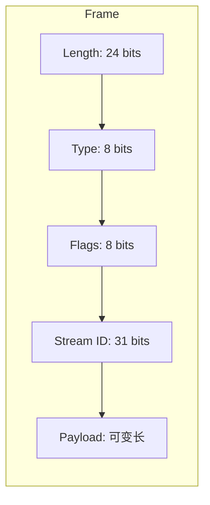
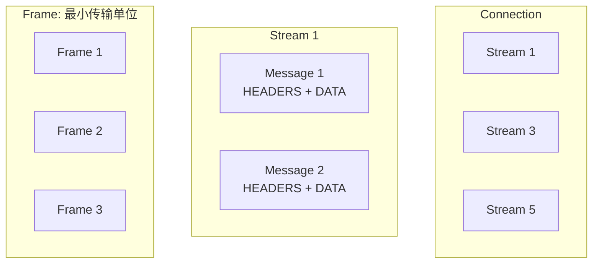
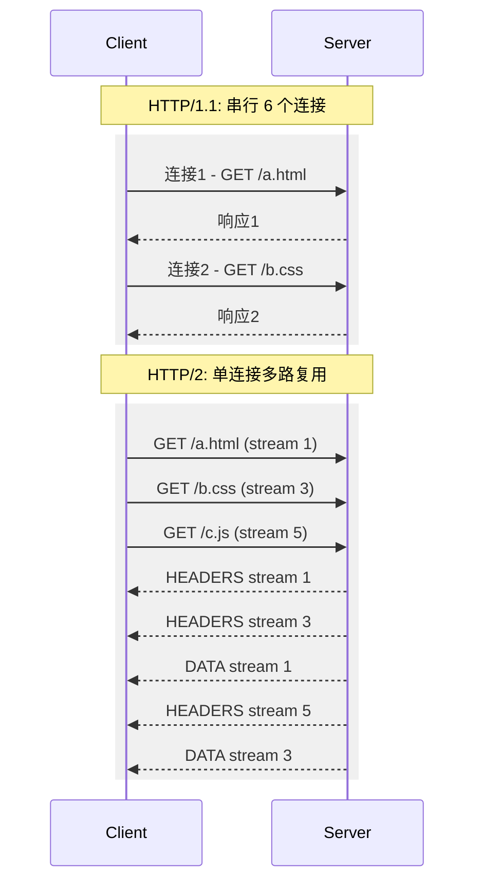
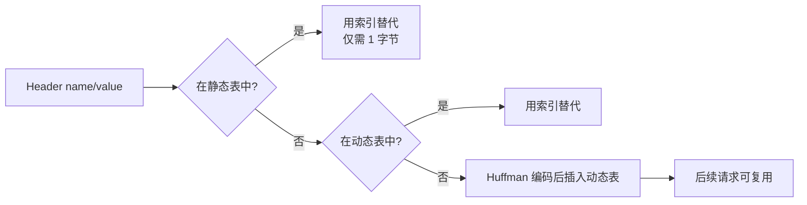
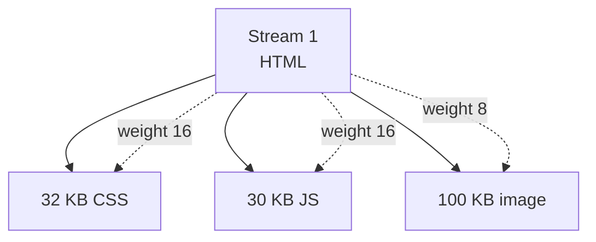
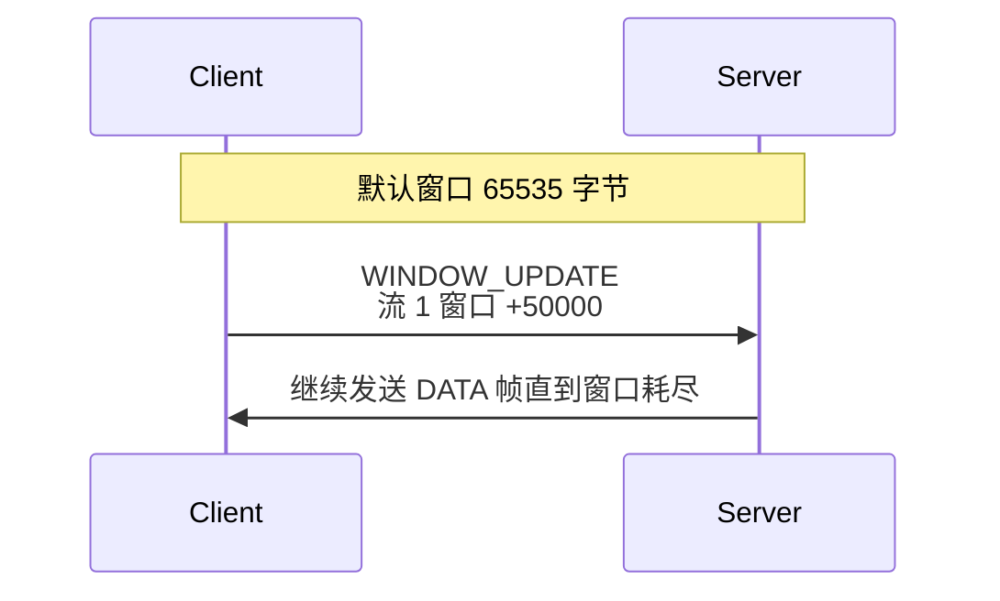
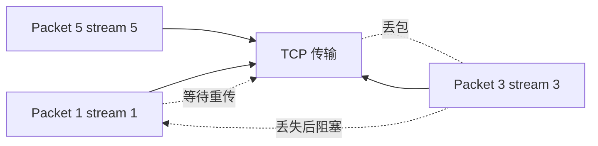
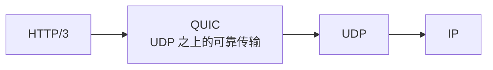

HTTP/2（RFC 7540，2015 年发布）解决了 HTTP/1.1 时代前端工程师无数痛点：**多路复用替代串行请求**、**头部压缩**、**服务器推送**。本文从二进制帧入手，逐步拆解 HTTP/2 的核心机制，并分析它的局限——TCP 层的 Head-of-Line 阻塞问题。

## HTTP/1.1 的痛点

HTTP/1.1 默认每个连接只能处理一个请求-响应。这种串行模型导致：

- 浏览器只能并发开 6 个 TCP 连接（Chrome 默认），每个连接还得排队
- 想绕开必须用域名分片、雪碧图、CSS 合并、JS 合并
- 头部每次都重复传输（特别是 cookie），浪费带宽
- 没法主动推送资源，得等客户端解析 HTML 后再请求

HTTP/2 的设计目标正是消除这些工程上的丑陋 hack。

## 二进制分帧层

HTTP/2 最大的变化是引入了**二进制分帧层（Binary Framing Layer）**，所有信息都用 Frame 传输：



| 字段 | 大小 | 含义 |
|---|---|---|
| Length | 24 bits | Payload 长度 |
| Type | 8 bits | 帧类型（DATA、HEADERS、PRIORITY 等） |
| Flags | 8 bits | 类型相关标志位 |
| Stream Identifier | 31 bits | 流 ID（1 为奇数表示客户端发起的流） |
| Payload | 可变 | 帧内容 |

关键的 10 种帧：
- `DATA` (0x0)：HTTP body
- `HEADERS` (0x1)：请求/响应头
- `PRIORITY` (0x2)：流优先级
- `RST_STREAM` (0x3)：流终止
- `SETTINGS` (0x4)：连接配置
- `PUSH_PROMISE` (0x5)：服务器推送
- `PING` (0x6)：心跳
- `GOAWAY` (0x7)：连接关闭
- `WINDOW_UPDATE` (0x8)：流量控制
- `CONTINUATION` (0x9)：HEADERS 后续帧

## Stream、Message、Frame 三层关系

HTTP/2 引入了三个层次概念：



- **Connection**：一个 TCP 连接
- **Stream**：双向字节流，每个请求-响应对应一个 stream
- **Message**：完整请求或响应，由一个或多个帧组成
- **Frame**：最小传输单位

**Stream 可以被多个帧交错传输**——这是 HTTP/2 多路复用的基础。

## 多路复用真正解决什么



实际收益：

- **只需一个 TCP 连接**：省去 6 个 TCP 握手的延迟
- **帧交错传输**：慢响应不会阻塞快响应
- **解决应用层 HoL 阻塞**（HTTP/1.1 时代的痛点）

## HPACK：头部压缩

HTTP 头部在每个请求里常常上百字节，cookie 多的可达 KB 级。HPACK 通过**静态表 + 动态表 + Huffman 编码**压缩头部：



- **静态表**：61 个常见 header（如 `:method = GET`、`:path = /`）
- **动态表**：双方各维护，对方第一次发的 header 进表
- **Huffman**：将常用字符编成变长位码，进一步压缩

实测头部压缩比通常在 **60-80%**。

## 流优先级与依赖

HTTP/2 允许客户端告诉服务端哪个流优先：



每个 stream 有两个属性：

- **Dependency**：依赖的父流 ID（根为 0）
- **Weight**：1-256 的权重，决定带宽分配比例

但实际上**服务端实现优先级往往很粗糙**，浏览器收敛到只用 `preload` / `prefetch` 资源提示。HTTP/2 优先级在 RFC 7540 中**被 RFC 9218（HTTP/2 优先级表达）废弃重设计**。

## 流量控制

HTTP/2 有自己的**应用层**流量控制（区别于 TCP 流量控制）：



- 每个连接 + 每个流都有独立的窗口
- 默认 65535 字节，可通过 SETTINGS 调整
- 接收方发 `WINDOW_UPDATE` 帧告诉发送方可以继续发

流量控制的目的是防止接收方被淹没——例如代理服务中下游慢、上游快。

## 服务器推送（已废弃）

HTTP/2 的"黑科技"是服务端可以主动推送资源：

```
[Server 主动推送]
PUSH_PROMISE stream 2 (path: /style.css)
DATA stream 2 (CSS 内容)

[客户端正常请求]
GET /index.html (stream 4)
HEADERS stream 4 (HTML)
DATA stream 4 (HTML body)
```

但实际推送实现问题很多——缓存命中率低、推送被代理拦截、版本协商复杂。**Chrome 已废弃推送**。大部分场景下 `<link rel="preload">` 是更好的选择。

## TCP 层的 HoL 阻塞

HTTP/2 解决了**应用层** HoL 阻塞（一个慢响应阻塞其他响应），但**没有解决 TCP 层**的 HoL 阻塞：



TCP 是**有序字节流协议**。如果 stream 3 的一个包丢失，TCP 会等到这个包重传成功后才把所有后续数据交给应用层——即使 stream 1、5 的包已经到达。

这意味着：

- 高丢包网络（移动、Wi-Fi 抖动）下 HTTP/2 多路复用优势打折
- 一个包丢失导致所有流都被阻塞
- 这就是 Google 推行 QUIC 的核心动机

## HTTP/3 与 QUIC

QUIC 基于 **UDP** 而非 TCP，绕开 TCP 的 HoL：



QUIC 的关键设计：

- **Stream 独立**：每个 stream 独立的丢包恢复，一个 stream 丢包不影响其他
- **0-RTT 握手**：结合 TLS 1.3 减少连接建立延迟
- **连接迁移**：网络切换（Wi-Fi → 4G）保持连接不断

HTTP/3 标准（RFC 9114）已于 2022 年发布。

## 实战建议

1. **升级到 HTTP/2**：现代反向代理（NGINX、Envoy）默认支持
2. **合并域名前不要急**：HTTP/2 下**域名分片反而有害**（多余连接浪费）
3. **小资源可以更激进**：HTTP/2 下小图标的成本降低，并发不再是问题
4. **慎用服务器推送**：大部分场景下用 `<link rel="preload">` 替代
5. **HTTP/3 待稳定**：QUIC 在生产环境逐步铺开，关注移动场景收益

## 参考资料

- RFC 7540: Hypertext Transfer Protocol Version 2
- RFC 9218: Extensible Prioritization Scheme for HTTP
- RFC 9114: HTTP/3
- Ilya Grigorik《High Performance Browser Networking》（中文版《Web 性能权威指南》）
- HTTP/2 调试工具：`nghttp`、`curl --http2`、`Chrome DevTools Protocol`