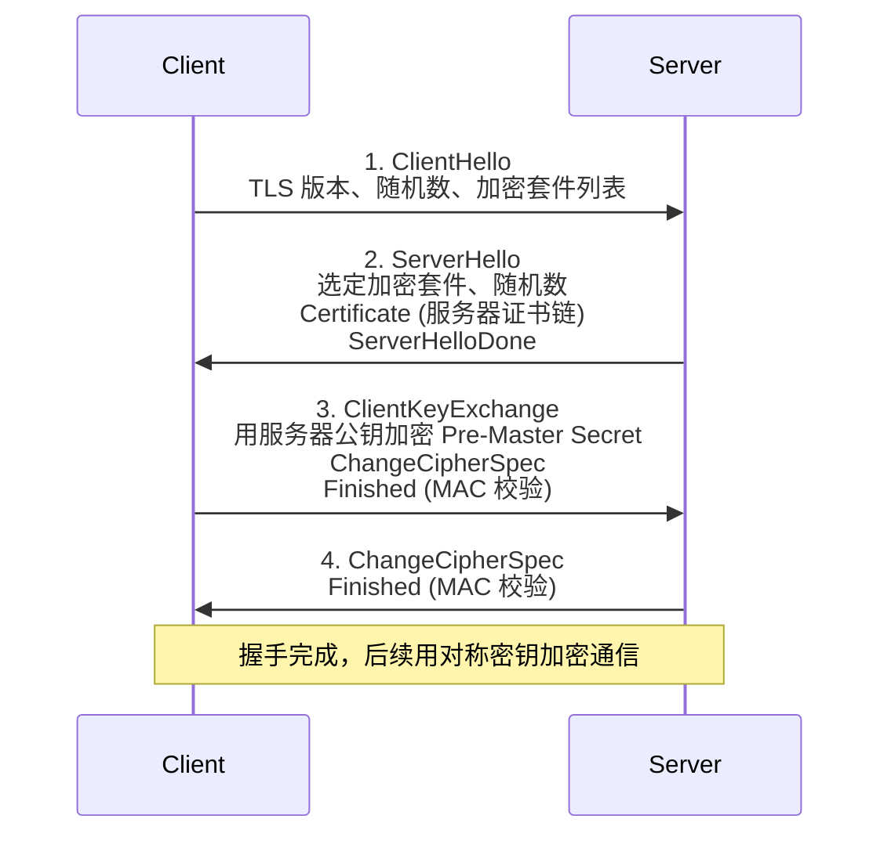
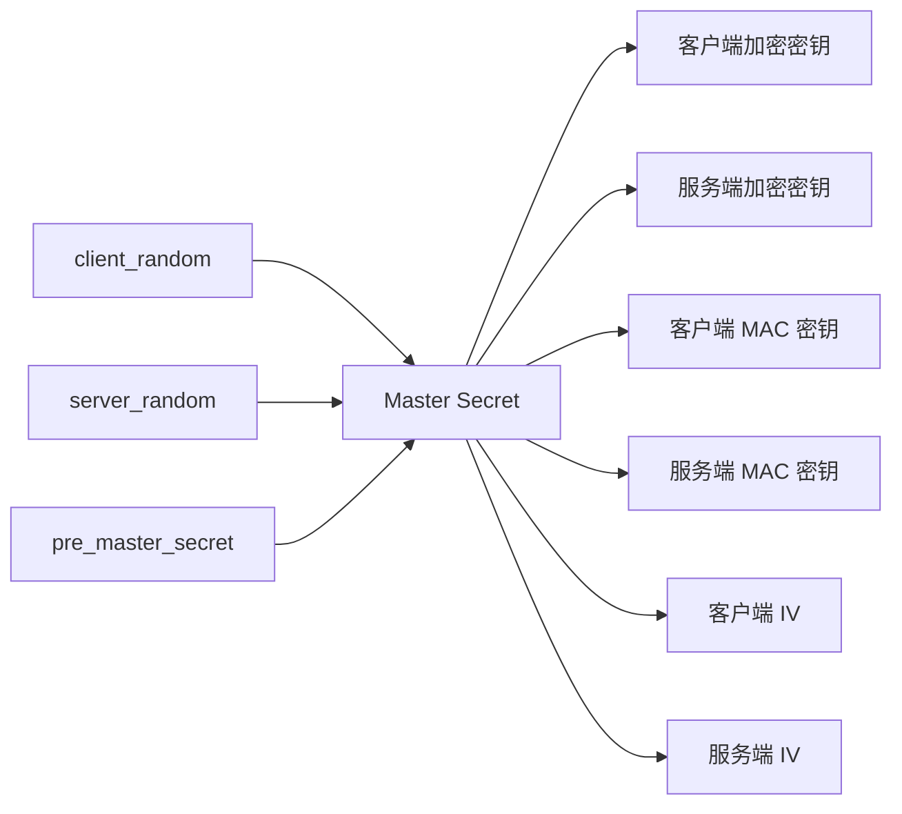
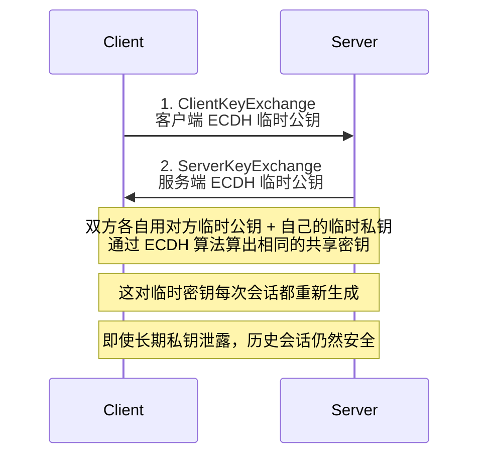

HTTPS = HTTP + TLS（早期叫 SSL）。TLS 在传输层之上、应用层之下，提供**加密**、**完整性校验**和**身份认证**三大能力。本文聚焦 TLS 1.2（当前仍为主流的版本），从密码学原语到完整握手逐步剖析。

## 三大密码学原语

TLS 用到三类基本工具：

1. **对称加密**（如 AES、ChaCha20）：加密实际传输的数据，速度快
2. **非对称加密**（如 RSA、ECDSA）：用于密钥交换和身份认证，效率低
3. **哈希 + MAC**（如 SHA-256、HMAC）：保证数据完整性，防止篡改

TLS 的精妙之处在于**用非对称加密安全地协商出一个对称密钥**，之后的通信都用对称加密完成——兼顾安全和性能。

## TLS 1.2 完整握手流程

一个完整的 TLS 1.2 RSA 密钥交换握手需要 **2-RTT（两次往返）**：



### 第一步：ClientHello

客户端发送：
- TLS 版本号（TLS 1.2 / TLS 1.3）
- 客户端随机数 `client_random`（28 字节）
- 会话 ID（用于恢复）
- 支持的加密套件列表，如 `TLS_ECDHE_RSA_WITH_AES_128_GCM_SHA256`
- 支持的压缩算法（通常为 null）

### 第二步：ServerHello + Certificate

服务端响应：
- 选定 TLS 版本和加密套件
- 服务端随机数 `server_random`
- 服务器证书链（含域名对应的公钥）
- ServerHelloDone 标记

### 第三步：客户端密钥交换

客户端验证证书链（CA 签发 + 域名匹配），然后：

1. 生成 **Pre-Master Secret**（46 字节随机数）
2. 用服务器证书里的公钥加密，发送给服务端
3. 客户端和服务端各自用 `client_random + server_random + pre_master_secret` 算出 **Master Secret**，再派生出会话密钥



### 第四步：握手收尾

双方都用协商好的密钥加密一个 `Finished` 消息，里面包含此前所有握手消息的 MAC。对方验证通过，握手正式完成。

## ECDHE vs RSA 密钥交换

上面的流程假设用 RSA 密钥交换——客户端用服务器公钥加密 Pre-Master Secret。RSA 有一个问题：**不支持前向保密（Forward Secrecy）**。如果服务器的私钥未来某天泄露，过去所有用这个公钥加密的会话都可以被解密。

**ECDHE（Elliptic Curve Diffie-Hellman Ephemeral）** 解决了这个问题：



关键差异：
- **RSA 密钥交换**：密钥的保密性完全依赖服务器长期私钥
- **ECDHE 密钥交换**：每次会话生成临时的 DH 参数，长期密钥泄露不影响历史会话

现代 TLS 配置（如 Mozilla 推荐的 [modern profile](https://wiki.mozilla.org/Security/Server_Side_TLS)）已经全面转向 ECDHE。

## 加密套件（Cipher Suite）

加密套件是一串定义好的算法组合，格式如：

```
TLS_ECDHE_RSA_WITH_AES_128_GCM_SHA256
│    │       │    │    │       │
│    │       │    │    │       └── HMAC / PRF 算法
│    │       │    │    └────────── 对称加密模式
│    │       │    └─────────────── 对称加密算法
│    │       └──────────────────── 身份认证算法（证书签名）
│    └───────────────────────────── 密钥交换算法
└────────────────────────────────── 协议
```

每一段都对应一组算法，任何一段被破解整套都要换。TLS 1.3 大幅简化了套件，去掉了 RSA 密钥交换和 CBC 模式等不安全选项。

## 会话恢复：减少握手开销

完整握手需要 2-RTT，对延迟敏感的场景（如移动网络）代价明显。TLS 提供两种恢复机制：

### Session ID

服务端缓存会话密钥，下次同一客户端连接时通过 Session ID 复用。局限是服务端需要为每个客户端保存状态，集群部署时成本高。

### Session Ticket（RFC 5077）

服务端把加密后的会话状态发给客户端（作为 ticket），下次连接时客户端发回 ticket。服务端解密即可恢复。无需服务端保存状态，更适合分布式部署。

这两种恢复都能把握手从 2-RTT 降到 **1-RTT**。TLS 1.3 进一步引入了 **0-RTT**（早期数据），但有重放攻击风险，谨慎使用。

## TLS 1.3 改进

TLS 1.3（2018 年正式发布 RFC 8446）相对 1.2 的关键改进：

- **1-RTT 握手**（首次连接）
- **0-RTT 数据**（恢复连接时）
- 移除不安全算法（RC4、SHA-1、MD5、CBC 模式、RSA 密钥交换）
- 所有握手消息加密（ServerHello 之后的内容都是密文）
- 简化加密套件列表

## 实践建议

1. **禁用 TLS 1.0/1.1**：PCI DSS 等合规要求已强制
2. **优先 ECDHE 套件**：避免 RSA 密钥交换
3. **开启 OCSP Stapling**：减少客户端验证证书的 RTT
4. **会话复用**：配置 Session Ticket 减少握手开销
5. **HSTS**：强制浏览器使用 HTTPS，防止降级攻击

## 参考资料

- RFC 5246: The Transport Layer Security (TLS) Protocol Version 1.2
- RFC 8446: The Transport Layer Security (TLS) Protocol Version 1.3
- 《HTTPS 权威指南》（Ivan Ristic 著）
- 腾讯 wetest：[HTTPS 为什么安全及连接过程](http://wetest.qq.com/lab/view/110.html)
