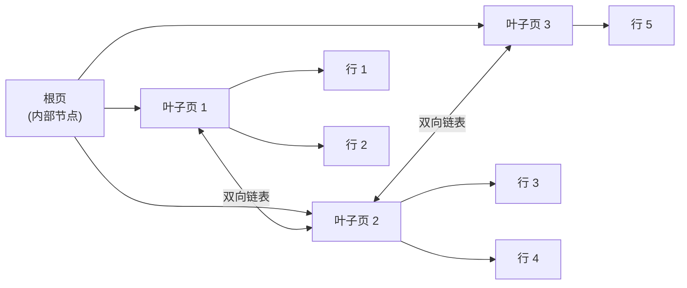
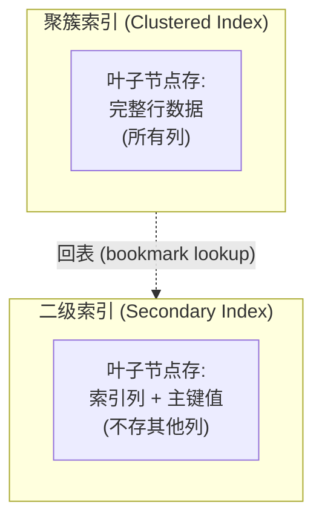
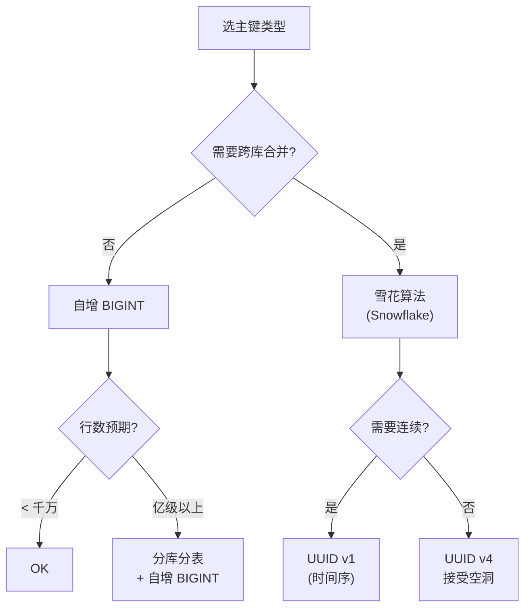

新系统评审时,一个老问题总是反复出现:**主键到底用自增 BIGINT 还是 UUID?** 业务方觉得 UUID"全球唯一、便于跨库合并"; 工程师担心 UUID 让索引膨胀、查询变慢。两边各有道理,但讨论很快会陷入"看情况"的口水仗。

跳出具体业务,从 InnoDB 的 B+ 树物理结构反推,主键选择其实有清晰的规则可循——大多数争议是规则没讲透。

这篇文章想回答几个问题:B+ 树在 InnoDB 里到底是什么样子?为什么二级索引一定要"回表"?随机主键的代价在哪?前缀索引什么时候值得用?唯一索引允许多个 NULL 是 bug 还是 feature?

<!--more-->

## 一、B+ 树在 InnoDB 里的样子

教科书里的 B+ 树是抽象的数据结构。落到 InnoDB 实现上,它由**页(page)**组成,每个页默认 16KB,通过双向链表串接:



三个关键事实:

- **叶子节点存全部数据**(对聚簇索引而言),内部节点只存"主键 + 子页指针"
- **所有叶子节点通过双向链表串接**,这是范围查询(`WHERE id BETWEEN 100 AND 200`)能做到有序扫描的物理基础
- **叶子节点内部还有一个"页目录"**:每 4-8 条记录打一个槽(slot),用 2 字节偏移指向该组最后一条记录。InnoDB 先对槽做二分查找定位组,再在组内顺序找。这样把页内查找从 O(n) 降到 O(log n)

### 一页能放多少行?

以默认 16KB 页为例,可用空间约 16KB 减去页头(~56B)、页尾(~8B)、infimum/supremum 系统记录(~26B),实际可放约 **16200 字节**的数据。

假设每行除主键外还要存约 200 字节业务字段,主键为 BIGINT(8B):

```
每行实际占用 ≈ 8(BIGINT) + 5(事务 ID) + 7(回滚指针) + 200(业务字段) + 变长字段指针 ≈ 230B
每页行数     ≈ 16200 / 230 ≈ 70 行
```

如果业务字段少(每行只 50B),每页能放约 **200 行**。

### 树高估算

非叶节点每条"主键 + 子页指针"的典型大小:

- 主键 BIGINT 8B + 子页指针 4B + 记录头 ~6B ≈ **18B**
- 每页非叶节点可放 ≈ 16200 / 18 ≈ **900 条**

把数字代入,典型的 3 层 B+ 树能索引多少行?

```
根节点有 900 个子页指针
第二层有 900 × 900 ≈ 81 万个 leaf page
每个 leaf page 存 70 行 → 81 万 × 70 ≈ 5,670 万行
```

换成 4 层:

```
900 × 900 × 900 ≈ 7.29 亿个 leaf page
× 70 行 ≈ 51 亿行
```

也就是说,**3 层 B+ 树可以覆盖千万到亿级表的单行点查,4 层可以扛几十亿行**。任何走主键的查询,磁盘 I/O 不会超过树高层数——这是 InnoDB 用 B+ 树而不是哈希的根本理由。

## 二、聚簇索引 vs 二级索引:回表的代价

InnoDB 有两种索引,差别极大:



聚簇索引不是"另一种索引",**它就是数据本身**——表数据按主键 B+ 树组织,叶子节点存完整行。InnoDB 强制每张表有一个聚簇索引:

- 有主键:`PRIMARY KEY` 是聚簇索引
- 无主键 + 有唯一非空列:第一个 `UNIQUE NOT NULL` 列是聚簇索引
- 都没有:InnoDB 隐式创建一个 6 字节的 `GEN_CLUST_INDEX`(行号)

二级索引(非主键索引)的叶子节点存的是"索引列值 + 对应行的主键值",**不存其他列**。所以一个查询如果只走二级索引,必须再"回表"一次——拿主键去聚簇索引里捞完整行:

```sql
-- 只走 idx_email 二级索引是不够的,还要回表拿 name
SELECT name FROM users WHERE email = 'a@example.com';
```

执行流程:

1. 在 idx_email 上找到对应的主键值(比如 12345)
2. 拿 12345 去聚簇索引找完整行
3. 返回结果

**如果二级索引的叶子节点已经把 name 包含进来,步骤 2 可以省掉**——这叫"覆盖索引"(covering index),性能直接跳一个数量级:

```sql
-- idx_email_email_name (email, name) 上能直接拿到 name,不用回表
CREATE INDEX idx_email_name ON users(email, name);
SELECT name FROM users WHERE email = 'a@example.com';
```

### 这对主键的硬要求:**主键必须短**

每个二级索引的叶子节点都要重复存一份主键值。主键越大,所有二级索引都跟着膨胀:

| 主键类型 | 大小 | 二级索引每条膨胀 | 100 万行二级索引额外占用 |
|---|---|---|---|
| INT | 4B | +4B | +4 MB |
| BIGINT | 8B | +8B | +8 MB |
| CHAR(36) UUID | 36B | +36B | +36 MB |
| CHAR(32) MD5 | 32B | +32B | +32 MB |

不仅占空间,**还直接影响非叶节点的扇出(fanout)**:UUID 主键下,非叶节点每条记录 ~46B,扇出从 900 降到约 350。同样 3 层树,能索引的行数从 5,670 万降到约 850 万——同样的查询要多走一层 B+ 树,多一次磁盘 I/O。

> **规则:主键尽量用定长、尽量短。BIGINT(8B) 是工业界默认选择。**

## 三、随机主键的代价:页分裂与碎片

理解页分裂,先看 InnoDB 的插入路径:新行按主键顺序插入到对应叶子页。如果目标页**已满**或空间不够,就触发**页分裂(page split)**:

- 申请一个新页
- 把旧页一半的数据搬到新页
- 新行插入新页
- 在父节点更新指针

页分裂要修改的数据涉及 3 个页(旧页、新页、父页),并产生 redo log。频繁分裂会:

- **写入放大**:一次 INSERT 实际写入 3-4 个页
- **磁盘碎片**:分裂后的页填充率只有 50%,浪费空间
- **缓冲池污染**:冷热数据交叉

### 自增主键 vs UUID 主键

| 主键类型 | 插入位置 | 页分裂频率 | 填充率 |
|---|---|---|---|
| 自增 BIGINT | 总是当前最右叶子页末尾 | 几乎不分裂 | ~15/16(93.75%) |
| UUID(随机) | 任意位置 | 频繁 | 50%-15/16 |

InnoDB 内部对顺序插入做了特殊优化:发现新键是当前最大键时,直接走"页末尾追加"快路径,跳过大部分校验——**这就是自增主键性能好的物理原因**。

UUID 主键的代价除了树更高,还体现在 IOPS 层面:顺序写入 1 万行,自增主键可能只产生 10 次页分裂;UUID 可能产生 3000+ 次。

```sql
-- 看一张表页分裂了多少次(用统计信息表)
SELECT * FROM information_schema.innodb_metrics
WHERE name LIKE '%split%';
-- 关注 INNODB_PAGE_SPLITS 计数器
```

### 自增主键的代价:AUTO-INC 锁

自增主键不是免费的,它依赖 `AUTO_INCREMENT` 计数器。MySQL 8.0 把这个计数器的持久化改了——**8.0 起,每次 AUTO_INCREMENT 值变更都会写 redo log,并在 checkpoint 时存到数据字典**。这样宕机重启后不需要 `SELECT MAX(ai_col) FOR UPDATE` 重算,避免长时间锁表。

同时,**8.0 把 `innodb_autoinc_lock_mode` 默认值从 1 改成了 2(interleaved)**:

| 模式 | 行为 | 性能 | 复制安全 |
|---|---|---|---|
| 0 (传统) | 全程持有表级 AUTO-INC 锁 | 最差 | 安全 |
| 1 (consecutive,5.7 默认) | 简单插入用轻量锁,批量插入用表级锁 | 中 | 安全 |
| 2 (interleaved,8.0 默认) | 不持表级锁,多语句并发分配 | 最佳 | 仅 row-based 复制安全 |

代价:**模式 2 下,单条 INSERT 拿到的值可能不连续**(被并发 INSERT "插队")。这不影响唯一性(单调递增保证),但:

- 仍然有"回滚浪费"——一个事务 INSERT 后 ROLLBACK,那些值不会归还(所有模式都这样)
- 如果用自增 ID 当对外订单号,**不要假设连续**
- 如果还在用 statement-based 复制,需要显式设 `innodb_autoinc_lock_mode=1`,否则主从 AUTO_INCREMENT 不一致

## 四、前缀索引:选择度,以及它的两个原罪

当字段太长(长字符串、长文本)无法整个建索引时,可以只对前 N 个字符建索引:

```sql
ALTER TABLE users ADD INDEX idx_email_prefix (email(10));
```

但前缀索引不是"省空间的等价物",它有两个原罪。

### 选择度计算

定义:**选择度 = COUNT(DISTINCT 前缀) / COUNT(*)**。

好的前缀索引选择度应**接近 1**(几乎和全字段索引等价),差的选择度只有 0.1(前缀几乎不能区分行):

```sql
-- 算 email 前 10 个字符的选择度
SELECT
  COUNT(DISTINCT LEFT(email, 10)) / COUNT(*) AS sel_10,
  COUNT(DISTINCT LEFT(email, 15)) / COUNT(*) AS sel_15,
  COUNT(DISTINCT email) / COUNT(*)        AS sel_full
FROM users;
```

经验法则:**选择度 > 0.31 通常就值得建**(具体阈值看场景)。

比如邮箱 `tanteng@gmail.com`、`tanteng@qq.com`、`tanteng@163.com`,前 7 个字符 `tanteng` 选择度极差(全是 1);前 12 个字符就能把它们区分开。

### 原罪一:无法用于覆盖索引

```sql
-- 这个查询无法用 idx_email_prefix 覆盖,因为 email 完整值不在索引里
SELECT email FROM users WHERE email LIKE 'tanteng%';
```

InnoDB 必须回表拿完整 email 才能返回——而我们建索引的目的就是少回表。所以前缀索引省了空间,**但不能省回表**。

### 原罪二:无法用于 ORDER BY 和 GROUP BY

```sql
-- 这个查询即使 idx_email_prefix 存在也走不到索引排序
SELECT * FROM users ORDER BY email LIMIT 10;
```

因为索引里只有前缀,无法保证完整 email 有序——只能 filesort。

### 前缀索引的合法用法

- `WHERE email LIKE 'tanteng%'` 的前缀匹配查询
- 不需要回表(只查主键或本身就在前缀里)的覆盖场景
- 列特别长、又确实需要省空间、且能接受上述两个原罪的场景

对前 N 个字符选择度已经很高的字段(如 UUID 的 16 进制前缀、URL 前缀),前缀索引往往比想象的划算。

## 五、唯一索引与 NULL:三值逻辑的陷阱

SQL 是三值逻辑:**TRUE / FALSE / UNKNOWN**。`NULL = NULL` 不是 TRUE,也不是 FALSE,是 UNKNOWN。

在唯一索引上,这引出一个反直觉的规则:

```sql
CREATE TABLE users (
    id BIGINT AUTO_INCREMENT PRIMARY KEY,
    email VARCHAR(100),
    phone VARCHAR(20),
    UNIQUE KEY uk_email (email),
    UNIQUE KEY uk_phone (phone)
);

-- 这两条都能插入成功
INSERT INTO users (email, phone) VALUES (NULL, '13800138000');
INSERT INTO users (email, phone) VALUES (NULL, '13800138001');

-- 这两条也会成功(phone 不同)
INSERT INTO users (email, phone) VALUES ('a@x.com', NULL);
INSERT INTO users (email, phone) VALUES ('b@x.com', NULL);
```

**InnoDB 的唯一约束不限制多个 NULL**。原因在 SQL 标准的语义里:`NULL ≠ NULL`(UNKNOWN),所以任意多个 NULL 都不算"重复"。这是 SQL 标准规定,不是 InnoDB 的 bug——PostgreSQL、Oracle、SQL Server 行为一致。

### 业务上的经典坑:软删除 + 唯一约束

```sql
CREATE TABLE users (
    id BIGINT AUTO_INCREMENT PRIMARY KEY,
    email VARCHAR(100) NOT NULL,
    deleted_at DATETIME NULL,
    UNIQUE KEY uk_email (email)
);
```

业务需求:软删除的用户不占唯一约束名额,这样被删除后用户可以用原邮箱重新注册。

但 MySQL 的唯一约束**把 `deleted_at IS NULL` 这部分信息无视了**——`'a@x.com' + NULL` 和 `'a@x.com' + '2024-01-01'` 在 InnoDB 看来都是同一行(主键值相同,但 email 字段值相同)。所以同一邮箱,无论删多少次都不能再注册。

### 三种解法

| 解法 | 思路 | 优缺点 |
|---|---|---|
| 1. 唯一索引改成部分索引 | MySQL 不支持 partial index,这条路走不通 | — |
| 2. 唯一索引用生成列 | `UNIQUE (email, is_deleted)`,is_deleted 是 0/1 生成列 | MySQL 8.0 起支持 |
| 3. 业务层校验 + 软删除字段不参与唯一约束 | 删除时把 email 改成 `email#deleted_<id>` 之类的"墓碑值" | 简单但 email 不再可读 |

最优雅的是解法 2(MySQL 8.0):

```sql
CREATE TABLE users (
    id BIGINT AUTO_INCREMENT PRIMARY KEY,
    email VARCHAR(100) NOT NULL,
    deleted_at DATETIME NULL,
    is_active TINYINT GENERATED ALWAYS AS (IF(deleted_at IS NULL, 1, 0)) STORED,
    UNIQUE KEY uk_email_active (email, is_active)
);
```

这样:

- 未删除用户 `is_active=1`,邮箱互斥
- 删除后 `is_active=0`,同样邮箱可以用 `is_active=1` 重新注册

## 六、主键选择的反推决策清单

回到开头——新系统评审时,这份清单可以直接拿来做 check:



反推规则,按优先级:

**1. 默认选自增 BIGINT**

- 字节最小(8B)
- 插入顺序写,无页分裂
- 所有二级索引最薄

**2. 必须跨库合并 → 雪花算法(Snowflake)**

- 8B 长整型,仍是 BIGINT 大小
- 前 41 位是毫秒时间戳,后 12 位是序列号,**整体仍近似单调递增**——B+ 树插入仍是"末尾追加"路径
- 唯一性靠 worker id + 序列号

**3. 真要用 UUID → 必须把 36 字节字符串改成 16 字节 BINARY**

```sql
-- 存的时候转 BINARY
INSERT INTO t (uuid) VALUES (UNHEX(REPLACE(UUID(), '-', '')));

-- 查的时候 HEX 回来
SELECT HEX(uuid) FROM t WHERE uuid = UNHEX('...');
```

这样 B+ 树内部按 16B 二进制比较,扇出退化没那么严重。

**4. 永远不要用 VARCHAR 做主键**

字符集、长度、对齐规则全部是隐性坑。CHAR(36) 的 UUID 也比 16B BINARY UUID 慢。

**5. 不要建"业务主键"当聚簇索引**

```sql
-- 反面例子:用身份证号当主键
CREATE TABLE users (
    id_card CHAR(18) PRIMARY KEY,
    ...
);
```

身份证号看似"业务上有意义",但:

- 中途可能变更(升位、纠错)
- 比 BIGINT 大一倍,二级索引全部膨胀
- 写入随机,频繁页分裂

**正确做法**:业务号用 `UNIQUE KEY` 单独建唯一约束,聚簇索引仍是自增 BIGINT 这种"无意义"主键。

**7. 主键修改成本极高**

加列、改类型都会触发聚簇索引重建(B+ 树重排),大表上几小时到几天。**主键一旦定下,基本不能动**——这也是它必须"无意义、纯技术"的关键原因。

## 七、小结

InnoDB 索引设计的核心是 B+ 树的物理形态:页目录决定页内查找,双向链表决定范围查询,聚簇索引与二级索引的关系决定回表代价。从这些事实反推,主键选择就有清晰的规则:

- **主键尽量短、定长**——所有二级索引都跟着膨胀
- **主键尽量顺序写**——避免页分裂和碎片
- **跨库合并用雪花算法**——别于 UUID
- **唯一索引 + NULL**是 SQL 标准行为,不是 bug——业务上需要"软删除后允许同值"用 MySQL 8.0 生成列 + 复合唯一索引解决

记住一句话:**主键是技术字段,不是业务字段**。把业务唯一性留给 `UNIQUE KEY`,把聚簇索引留给自增 BIGINT,大多数争议就消失了。