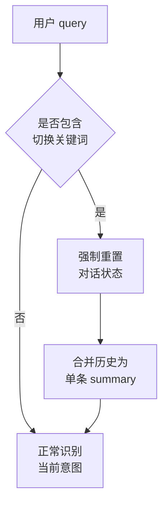
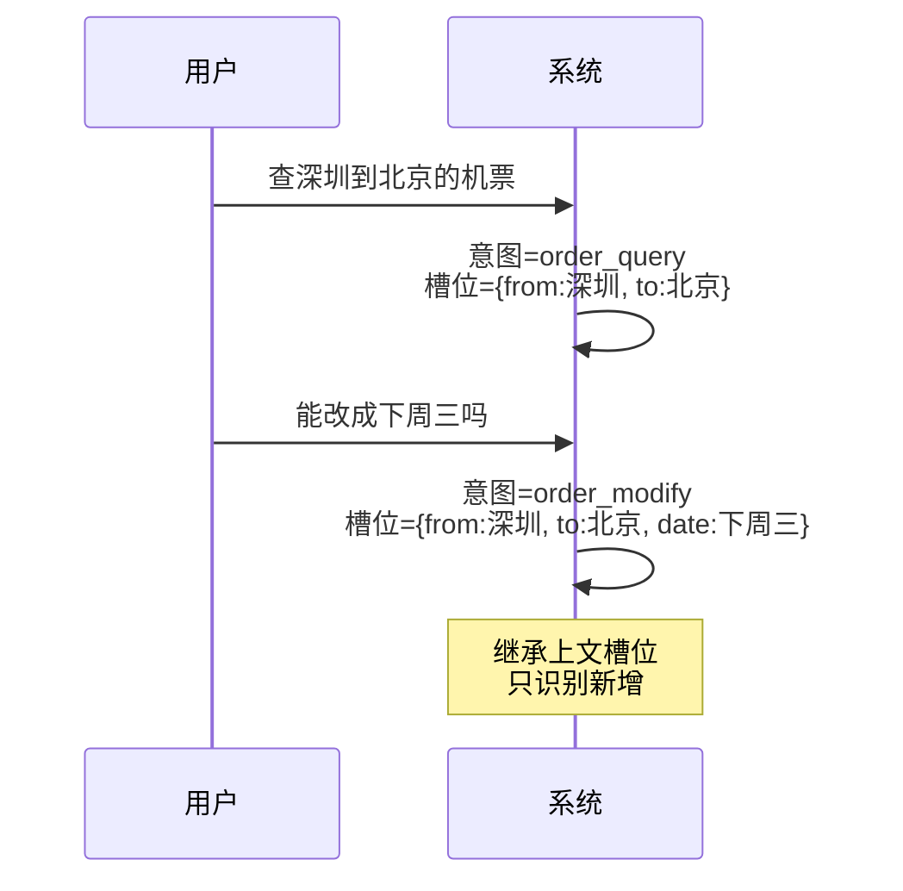
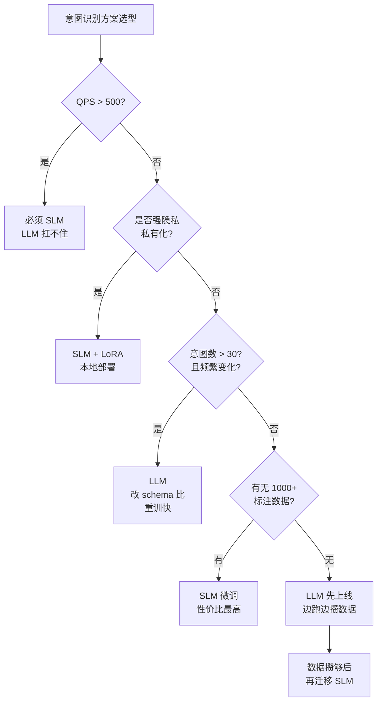
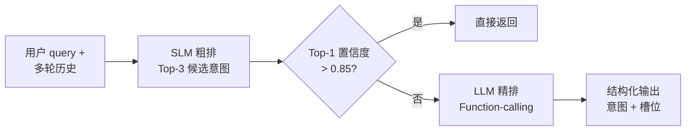

意图识别（Intent Recognition）这件事，在 NLP 圈子里干了十几年，本来快成"已解决"的问题了。结果 2024 年 LLM Function-calling 起来之后，又被翻出来重新讨论——**意图的边界变大了**：以前只要分到 20 个固定类别，现在每个意图对应一个工具调用、一段 API 参数，甚至一个 Agent 子任务。

更关键的是**多轮对话**成了主流形态：用户说"查一下我上个月从深圳飞北京的那张机票，能改签到下周三吗？"，这一句话里有"查询订单 + 修改订单"两个意图，还要继承上文的"深圳-北京"实体。多轮场景下的意图识别，跟单轮完全是两个问题。

本文从多轮对话视角出发，对比两条主流路线：**微调 SLM（小语言模型）**与**LLM Function-calling + 结构化输出**，最后给出选型决策树和混合架构。

<!--more-->

## 一、意图识别的演进

意图识别的发展大致走过四代：

| 时代 | 方法 | 特点 |
|------|------|------|
| 2010 前 | 关键词匹配 + 正则 | 维护成本高，一改需求就崩 |
| 2013-2017 | SVM / 朴素贝叶斯 + 特征工程 | 依赖人工特征，可解释但天花板低 |
| 2018-2022 | BERT / RoBERTa 微调 | 端到端，准确率高，工业界标配 |
| 2023 至今 | LLM Function-calling + Prompt | 零样本/少样本，泛化强，门槛低 |

前两代基本已经被淘汰，今天做意图识别只剩两个选择：**继续微调小模型**，或者**直接调大模型**。

`BERT` 系列（`bert-base-chinese`、`hfl/chinese-roberta-wwm-ext`、`hfl/chinese-macbert-base`）在过去五年一直是工业界默认方案；`Qwen2.5-0.5B` / `1.5B` / `3B` 这类 2024 年后发布的小模型，因为有更强的指令遵循能力和更现代的分词器，正在成为新的微调基座。

LLM 路线则是把意图分类**重新定义成"工具选择"**：每个意图对应一个 function，把分类转成"调用哪个 function + 抽取哪些参数"。配合 `Pydantic`（Python）或 `Zod`（TypeScript / Node）做结构化输出，几乎不用训练就能上线。

## 二、方案 A：微调 SLM

微调路线的核心是**把意图识别当成文本分类任务**：输入是用户 query（多轮时拼上对话历史），输出是 N 分类的概率分布。

### 数据准备

```python
# 标注数据格式（JSONL）
{"text": "查一下我的订单状态", "label": "order_query"}
{"text": "我想改签机票", "label": "order_modify"}
{"text": "上次那个订单...嗯...能取消吗", "label": "order_cancel"}
```

实操要点：

- **类别平衡**：长尾意图用 focal loss 或过采样兜底
- **负样本**：必须有明确的"out-of-scope"类，否则模型会强行把任何 query 分到现有标签里
- **多轮标注**：把历史也作为输入的一部分，让标注员判断"光看当前 query 不够，还得看上文"

### 训练（LoRA 微调 Qwen2.5-1.5B）

```python
from transformers import AutoTokenizer, AutoModelForSequenceClassification
from peft import LoraConfig, get_peft_model

model = AutoModelForSequenceClassification.from_pretrained(
    "Qwen/Qwen2.5-1.5B", num_labels=20
)
lora_config = LoraConfig(
    r=16, lora_alpha=32, target_modules=["q_proj", "v_proj"],
    lora_dropout=0.05, bias="none", task_type="SEQ_CLS"
)
model = get_peft_model(model, lora_config)
```

`Qwen2.5-1.5B` 在 A100 上全量数据训练通常 1-2 小时收敛；LoRA 微调甚至可以跑在 4090 上。

### 推理

```python
# 单次 forward，几百毫秒
outputs = model(**tokenizer(text, return_tensors="pt"))
intent_id = outputs.logits.argmax(-1).item()
```

部署形态通常是 `ONNX Runtime` 或 `vLLM`（Qwen2.5 系列），QPS 轻松过千。

## 三、方案 B：LLM Function-calling + 结构化输出

LLM 路线的核心思路是**把意图定义成函数签名**：

```python
from pydantic import BaseModel, Field
from typing import Literal

class Intent(BaseModel):
    """用户意图识别结果"""
    name: Literal[
        "order_query", "order_modify", "order_cancel",
        "product_recommend", "smalltalk", "out_of_scope"
    ] = Field(description="意图名称")
    confidence: float = Field(ge=0, le=1, description="置信度 0-1")
    slots: dict = Field(default_factory=dict, description="抽取的槽位实体")
```

调用时把 Pydantic model 传给 LLM，SDK 会自动转 JSON Schema 并校验：

```python
from openai import OpenAI
client = OpenAI()

# gpt-4o-2024-08-06 之后所有模型都支持 Structured Outputs
resp = client.beta.chat.completions.parse(
    model="gpt-4o-2024-08-06",
    messages=[
        {"role": "system", "content": "你是意图识别器..."},
        {"role": "user", "content": query}
    ],
    response_format=Intent,  # Pydantic model，SDK 自动转 JSON Schema
)
intent = resp.choices[0].message.parsed  # 直接是 Intent 实例，无需手动解析
```

如果不用 OpenAI SDK（比如用 Anthropic / Ollama），可以手动传 JSON Schema：

```python
resp = client.chat.completions.create(
    model="gpt-4o-2024-08-06",
    messages=[...],
    response_format={
        "type": "json_schema",
        "json_schema": {
            "name": "intent",
            "schema": Intent.model_json_schema(),
            "strict": True,
        }
    },
)
intent = Intent.model_validate_json(resp.choices[0].message.content)
```

几个关键技巧：

- **必须给 schema 写 description**：`Literal["order_query", ...]` 里每个枚举值的描述会被 LLM 看到，写得越清晰，分类越准
- **模型版本必须 ≥ 2024-08-06**：`gpt-4o-2024-08-06` 是首个支持 Structured Outputs 的版本，更早的模型只能靠 JSON mode（不保证 schema 严格匹配）
- **复杂场景拆 function**：如果意图太多（>30 个），把高频意图注册为 `tool`，低频意图走文本分类，让 LLM 二选一
- **强制 JSON 输出**：`response_format` + 服务端 `model_validate_json` 校验；不要靠 prompt 里的"请输出 JSON"
- **本地化用 Ollama / vLLM**：`qwen2.5:7b` 跑本地，延迟可控，但精度不如 GPT-4o / Claude

## 四、多轮对话：真正的难点（重点）

单轮意图识别只是个文本分类问题，**真正的工业难点在多轮**。下面四个问题最常见：

### 1. 上下文怎么喂

多轮场景必须把历史拼进去，但拼接方式影响很大：

```python
# 方案 1：拼成一个长字符串（最简单，BERT 用）
text = "\n".join([f"{turn.role}: {turn.content}" for turn in history])

# 方案 2：messages 数组（LLM 唯一正确方式）
messages = [
    {"role": "system", "content": SYSTEM_PROMPT},
    *history,  # [{"role": "user", ...}, {"role": "assistant", ...}]
    {"role": "user", "content": current_query}
]
```

BERT 这类模型没有原生的多轮结构，必须人工拼。LLM 用 messages 数组，**多轮意图识别准确率通常比单轮高 5-10 个百分点**——因为模型能"听懂"省略和指代。

### 2. 意图漂移与话题切换

用户说"先不聊这个了，我问一下你们的产品怎么卖"——上一秒还在查订单，下一秒切到商品咨询。处理办法：



实际做法是加一个**对话状态机**：识别出"换话题"意图时，把上一轮的槽位清空，从零开始识别。LLM 路线可以让它自己判断（prompt 里加规则），SLM 路线则要专门训练一个 `topic_switch` 类别。

### 3. 槽位继承与指代消解



第二句的"下周三"是新槽位，"深圳-北京"是从上一轮继承的。**LLM 路线天生擅长这个**（上下文都在 messages 里）；SLM 路线要么把历史一起塞进去（容易丢信息），要么维护一个显式的 slot store 在推理时拼接输入。

### 4. 长对话的截断与压缩

对话超过 50 轮后，整段塞进 LLM 上下文既贵又慢。常见做法：

- **滑动窗口**：保留最近 K 轮 + 第一轮（首因效应）+ 显式槽位
- **摘要压缩**：每 10 轮做一次 LLM 摘要，把摘要作为新 system prompt
- **槽位提取器分离**：意图识别只看 query，槽位单独用另一个模型维护——槽位更新频率远低于意图变化

实际工业系统大多是**"意图识别 + 槽位追踪"两个模块并行**，互相通过对话状态 (Dialogue State) 通信。这跟经典的 Dialogue State Tracking (DST) 框架一脉相承。

## 五、横评与选型决策树

把两条路线放到一张表里：

| 维度 | SLM 微调（BERT / Qwen2.5-1.5B） | LLM Function-calling |
|------|----------------------------------|---------------------|
| **冷启动成本** | 高：需 1000+ 条标注 | 低：几十条示例 + schema |
| **单次推理延迟** | 10-50ms（本地 GPU） | 300-1500ms（含网络） |
| **单次成本** | 几乎为 0（电费） | 0.001-0.01 元/次（按模型） |
| **QPS 上限** | 几千（单卡） | 受限于上游 API 限流 |
| **可控性** | 高：分类结果封闭、可审计 | 低：LLM 偶尔幻觉出新意图 |
| **泛化能力** | 弱：训练集外长尾差 | 强：zero-shot 也能处理 |
| **多轮槽位继承** | 需自己实现 | 开箱即用 |
| **私有化部署** | 容易（模型小） | 难（依赖大模型） |
| **维护成本** | 改意图要重训 | 改 schema 即可 |

### 选型决策树



### 混合架构（工业界主流）

纯 SLM 太死，纯 LLM 太贵，**生产环境绝大多数是混合**：



具体做法：

- SLM 负责 80% 的高频、明确意图（"查订单"、"取消订单"），毫秒级返回
- LLM 负责 20% 的疑难 query（多意图混合、长尾、模糊表达），秒级返回
- LLM 输出会作为新的训练数据回流，定期重训 SLM——**这是个飞轮，越用越准**

这个架构在阿里通义、腾讯元宝、字节豆包的对话系统里都看得到影子，本质上是"用 LLM 教 SLM"。

---

**一句话总结**：单轮、低 QPS、没数据 → LLM Function-calling 快速上线；多轮、高 QPS、有标注数据 → SLM 微调稳跑生产；想要两者兼得 → SLM 粗排 + LLM 精排的混合架构。

---

**参考链接**

- Hugging Face PEFT 文档：<https://huggingface.co/docs/peft>
- OpenAI Structured Outputs：<https://platform.openai.com/docs/guides/structured-outputs>
- Pydantic AI 框架：<https://ai.pydantic.dev/>
- Qwen2.5 模型卡：<https://huggingface.co/Qwen/Qwen2.5-1.5B>