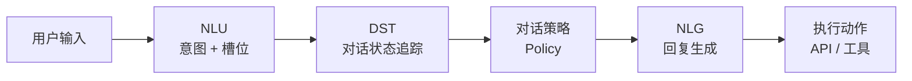
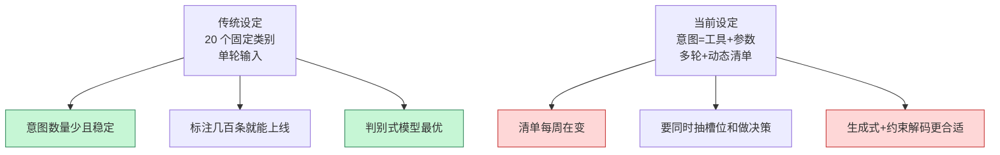
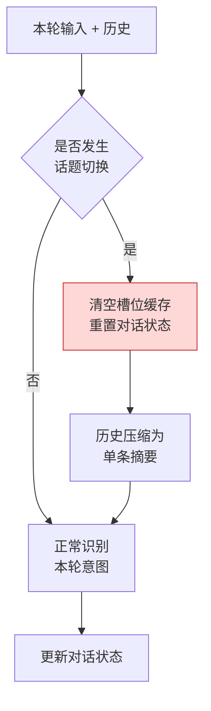
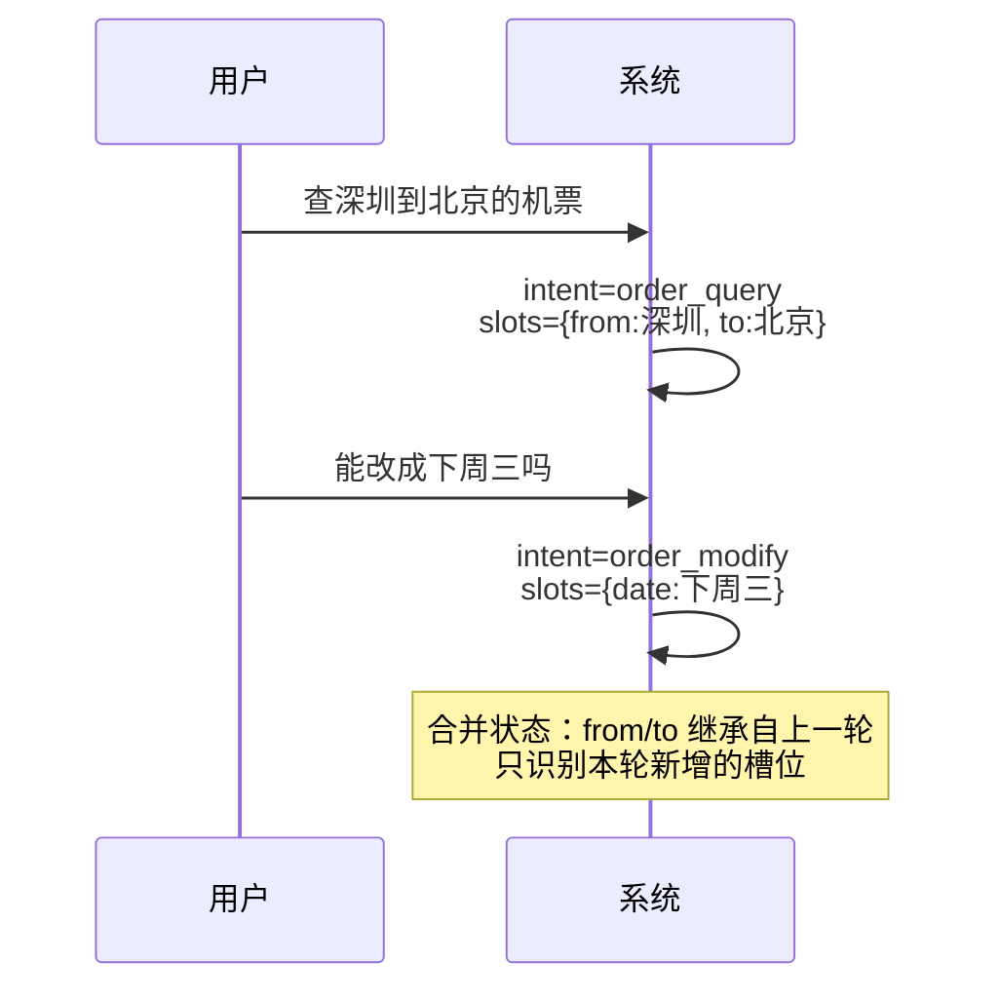
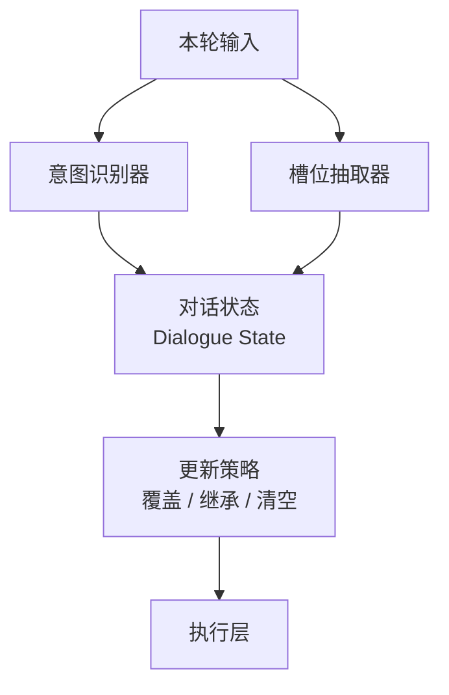
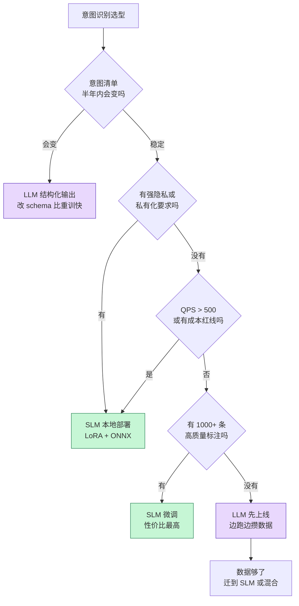
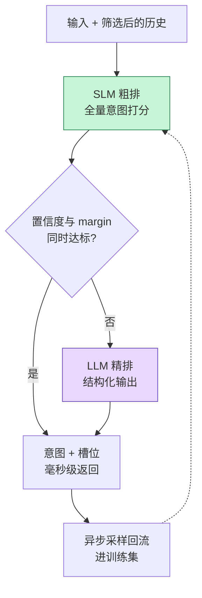

「订一张下周三从深圳飞北京的机票」和「刚才那张票能改签吗」，对系统来说是两种完全不同的动作。前者要触发搜索与下单，后者要在已有订单上做修改，而且城市、日期、乘客都得从上一轮继承过来。

把这类自然语言输入映射到正确的动作上，就是**意图识别（Intent Recognition）**。它是对话系统唯一的信息入口，也是错误会向下游逐级放大的那一环。

这篇文章从概念讲起：先说清意图、槽位、对话状态这几个词的确切含义，再说清 SLM 和 LLM 两条路线在数学上其实是同一个问题、工程上却是两套完全不同的系统，最后落到数据构造、训练、约束解码、拒识阈值、多轮处理和分层评测。

<!--more-->

## 一、概念底座：意图到底是什么

### 1.1 三层结构：领域、意图、槽位

自然语言理解（NLU）里的意图识别，标准输出不是一个标签，而是三样东西：

- **领域（domain）**：业务边界。机票、酒店、订单、售后属于不同领域
- **意图（intent）**：用户想执行的动作类型。查询、修改、取消、咨询、闲聊
- **槽位（slot）**：完成这个动作需要参数。出发地、目的地、日期、订单号

一次用户输入，对应的是意图与槽位的**联合**：

| 用户输入 | 领域 | 意图 | 槽位 |
|---|---|---|---|
| 查一下我上个月的订单 | order | `order_query` | `{time_range: 上个月}` |
| 这张票能改到下周三吗 | order | `order_modify` | `{date: 下周三, order_ref: 指代上轮}` |
| 算了，不买了 | order | `order_cancel` | `{order_ref: 指代上轮}` |
| 你们家还有什么颜色 | product | `product_recommend` | `{attribute: color}` |
| 今天天气不错 | — | `smalltalk` | `{}` |
| 帮我写个快排 | — | `out_of_scope` | `{}` |

形式化地写：

```
f(query, history, 意图清单) → (intent, slots)
```

这里的"意图清单"是个关键变量。它是不是封闭的、会不会变、有多少项，决定了后面所有架构选择。

### 1.2 意图识别在对话系统里的位置

意图识别不是孤立模块，它是经典对话流水线的第一环：



分工要分清：

- **NLU** 负责把这一次输入翻译成意图和槽位
- **DST（Dialogue State Tracking）** 负责把多轮的结果累积成一份状态，处理继承、覆盖、清空
- **Policy** 负责根据状态决定下一步做什么

新手最容易混淆的是 NLU 和 DST。**意图识别本身是单轮的**——它一次只看"这一句要干什么"。而"上一轮的出发地要继承到这一轮"是 DST 的职责。把这两件事混在一个模型里做，是后面所有多轮问题的根源。

### 1.3 两种建模范式：判别式与生成式

从建模角度，只有两种做法。这两者的差别不是模型大小，而是**建模目标不同**。

**判别式**：直接建模条件概率 `P(intent | x)`，输出是标签维度的概率分布。

```
logits = Encoder(x, history)        # [batch, num_intents]
probs  = softmax(logits)
```

BERT 微调属于这一类。它的输出空间天然封闭——标签数在训练时写死，模型没有能力"发明"一个新意图。

**生成式**：建模序列概率 `P(y | x)`，其中 `y` 是意图名、JSON、或者工具调用参数。输出是 token 序列，空间是开放的，靠**约束解码**（constrained decoding）把它收窄回闭集。

```
y = "order_modify"                 # 也可以是一整段 JSON
p  = Π P(y_t | y_<t, x)
```

这里有个容易被忽略的事实：**"SLM" 和 "LLM" 不是分类维度的名字**。`Qwen2.5-1.5B` 本质是生成式模型，套上分类头（`SEQ_CLS`）微调后才是判别式；同一份权重，两种用法都存在。同理，LLM 做意图识别时，也可以走"输出枚举值"这条更接近分类的路径，而不是走工具调用。

### 1.4 一个统一的视角

把两条路写成同一个式子：

```
P(intent | query, history, 意图清单 L)
```

- **SLM 微调**：把 `L` 通过梯度**折叠进权重 θ**。清单是隐式的、封闭的
- **LLM Function-calling**：把 `L` 通过 prompt / JSON Schema 放进**上下文**。清单是显式的、可替换的

这一个差别，推导出两条路上所有工程属性的差异：

| 问题 | SLM（L 在权重里） | LLM（L 在上下文里） |
|---|---|---|
| 加一个新意图要做什么 | 重新标注 + 重新训练 + 重新发布 | 改 schema，改一次 prompt |
| 泛化从哪来 | 标注数据覆盖到的分布 | 预训练知识 + 语义相似度 |
| 输出可控性 | 概率分布，天然封闭 | 生成自由度大，需要约束解码兜 |
| 边际成本 | GPU 摊销（≈电费） | 按 token 计费 |
| 典型失败模式 | 分布外输入被静默错分（还带高置信度） | 幻觉出新意图、漏调、多调 |
| 上线前的准备工作 | 攒数据 | 写 schema、做回归测试 |

**实操结论**：选型的第一性问题不是"哪个更准"，而是**你的意图清单在未来半年会有多稳定**。清单稳定，SLM 性价比压倒性优势；清单每周在变，训练永远追不上。

## 二、为什么 2024 年之后又被翻出来

意图识别在 NLP 圈做了十几年，一度快成"已解决"的问题。2024 年之后重新成为议题，是因为三个前提条件同时被打破了。

**第一，意图的边界变大了。** 以前一个意图对应一个固定类别，现在一个意图可能对应一个工具调用加上一组参数，甚至一个 Agent 子任务。意图从"标签"变成了"动作契约"。

**第二，意图空间变成了动态的。** 工具数量随业务增长，schema 每周都在改。闭集分类的假设是"类别集合固定"，这个假设在工具生态里基本不成立。

**第三，多轮成了主流形态。** 单轮分类的隐含前提——一次输入一个意图、不需要上下文——在多轮场景里直接失效。



## 三、方案 A：SLM 微调

### 3.1 先拆成两条子路线

"微调小模型"这个说法太粗，实际上里面有两套完全不同的实现：

| | A1 判别式 | A2 生成式 |
|---|---|---|
| 基座 | `bert-base-chinese`、`chinese-roberta-wwm-ext`、`Qwen2.5-1.5B` | `Qwen2.5-1.5B-Instruct` |
| 头 | `AutoModelForSequenceClassification` | 语言模型头（自回归） |
| 输出 | `logits` → `argmax` | 受约束的 token 序列 |
| 能同时抽槽位 | 要额外加 NER / span 头 | 一个模型全包 |
| 置信度 | softmax，需标定 | logprob，需约束解码 |
| 何时选 | 意图数少且固定、只要分类 | 要同时输出意图 + 槽位、未来想迁到 LLM |

**判断标准很简单**：如果输出只有一个枚举值，选 A1；如果输出要带一组槽位，选 A2——因为 A1 需要为槽位再训一个抽取模型，维护两份数据和两条链路。

A2 有个额外好处：它和第四节的 LLM 路线**共用同一套 schema 定义和评测集**。今天用 LLM 上线，明天数据攒够了换成 A2，评测口径不用重写。

### 3.2 数据：成本的主要来源

标注数据是这条路的主要投入，几个容易被低估的点：

**类别设计要预留"兜底类"。** 必须有明确的 `out_of_scope`。没有这一类，模型会把任何输入强行塞进现有标签——用户问"你们公司地址在哪"，模型回一个 `order_query`，然后下游开始查订单。

**多轮样本要整段标注。** 不能把对话切碎了逐句标。标注员看到的应该是 `(history, query)` 这个整体，这样他才能判断"光看这一句不够，得看上文"。

**长尾用重采样，不要只调阈值。** 高频意图可能占 80% 的样本，低频意图只有几十条。做法是分层采样 + weighted loss，或者 focal loss 压低易分样本的权重。

**标注一致性就是准确率的天花板。** 两个标注员对同一批数据的一致性（Cohen's Kappa）只有 0.85，那模型不可能超过 0.85。先写标注指南，做双标抽样，再谈模型优化。

```python
# 标注数据格式（JSONL）
{"history": [], "query": "查一下我的订单状态", "intent": "order_query", "slots": {"order_ref": null}}
{"history": [], "query": "我想改签机票", "intent": "order_modify", "slots": {"action": "改签"}}
{"history": [{"role": "user", "content": "查深圳到北京的机票"},
              {"role": "assistant", "content": "找到 3 个航班"}],
 "query": "能改成下周三吗", "intent": "order_modify",
 "slots": {"from": "深圳", "to": "北京", "date": "下周三"}}   # 前两个槽位来自继承
```

最后一条是重点：**标注里要能看出哪些槽位是本轮新抽的、哪些是继承的**。这个信息后面 DST 要用，也能帮你发现"模型其实在靠历史偷答案"。

### 3.3 训练：LoRA 微调 A1

```python
import torch
from transformers import (AutoTokenizer, AutoModelForSequenceClassification)
from peft import LoraConfig, get_peft_model, TaskType

MODEL = "Qwen/Qwen2.5-1.5B"
LABELS = ["order_query", "order_modify", "order_cancel",
          "product_recommend", "smalltalk", "out_of_scope"]

tok = AutoTokenizer.from_pretrained(MODEL)
# 关键：Qwen 系列默认没有 pad token，batch_size > 1 时会直接报错或静默错位
if tok.pad_token is None:
    tok.pad_token = tok.eos_token

model = AutoModelForSequenceClassification.from_pretrained(
    MODEL,
    num_labels=len(LABELS),
    problem_type="single_label_classification",
)
model.config.pad_token_id = tok.pad_token_id

lora = LoraConfig(
    task_type=TaskType.SEQ_CLS,
    r=16,
    lora_alpha=32,
    lora_dropout=0.05,
    # 分类任务只动 attention 的投影层就够了
    # 加上 gate_proj/up_proj/down_proj 也能跑，但小数据集上收益小、更容易过拟合
    target_modules=["q_proj", "k_proj", "v_proj", "o_proj"],
)
model = get_peft_model(model, lora)
model.print_trainable_parameters()   # 通常 < 1%
```

几个训练上的经验值：

- **学习率比全量微调高一个量级**：LoRA 用 `1e-4 ~ 2e-4`，全量微调用 `1e-5 ~ 2e-5`
- **epoch 少**：2 到 4 轮。意图分类的数据量通常不大，超过 5 轮基本在过拟合
- **warmup 5%**，cosine 衰减
- **早停看 macro-F1 而不是 accuracy**：accuracy 会被高频意图主导，长尾意图全错也看不出来
- **`max_length` 别拍 512**：中文多轮历史拼起来很容易超，超了会静默截断到只剩后半段，把关键上下文丢掉

单卡 A100 上 `Qwen2.5-1.5B` 全量微调通常 1 到 2 小时收敛；LoRA 微调在 4090 上就能跑完。LoRA 的秩、`alpha`、`target_modules` 这些超参怎么选，可以对照 [LoRA / QLoRA 原理与工程实践](/2025/12/lora-qlora-fine-tuning/) 里的那套判断方法。

### 3.4 推理与部署

```python
@torch.inference_mode()
def predict(text: str) -> tuple[str, float]:
    enc = tok(text, return_tensors="pt", truncation=True,
              max_length=384).to(model.device)
    logits = model(**enc).logits            # [1, num_labels]
    probs = torch.softmax(logits, dim=-1)
    conf, idx = probs.max(dim=-1)
    return LABELS[idx.item()], conf.item()
```

部署形态按 QPS 和延迟要求选：

| 形态 | 典型延迟 | 适用 |
|---|---|---|
| PyTorch + FP16 | 30-60ms | 内部服务、QPS 低 |
| ONNX Runtime | 15-30ms | 通用线上方案，跨平台 |
| TensorRT / INT8 量化 | 5-15ms | 高 QPS、延迟敏感 |
| vLLM（生成式 A2） | 20-50ms + 约束解码开销 | 需要一次输出意图+槽位 |

延迟要拆开看：tokenize 通常占 1-3ms，forward 占大头，后处理可忽略。多轮场景下历史越长，forward 时间线性增长——所以"把整段历史拼进去"这个做法在 SLM 上代价比想象的大。

### 3.5 置信度不能直接用 softmax

这是 SLM 路线最容易被忽略、又最影响线上效果的一点。

用交叉熵训练的模型**普遍过度自信**。验证集上 accuracy 92% 的模型，可能在"它自以为置信度 > 0.9"的样本上实际只有 88% 的正确率。拿这个 0.9 当拒识阈值，等于没有拒识。

修法是**温度标定（temperature scaling）**：在验证集上只拟合一个标量温度 `T`，最小化 NLL。

```python
import torch
from scipy.optimize import minimize_scalar

def fit_temperature(logits, labels, bounds=(0.5, 5.0)) -> float:
    """只拟合一个标量，参数极少，几乎不可能过拟合验证集。"""
    logits = torch.as_tensor(logits)
    labels = torch.as_tensor(labels)

    def nll(T):
        return torch.nn.functional.cross_entropy(logits / T, labels).item()

    return float(minimize_scalar(nll, bounds=bounds, method="bounded").x)

# 推理时用标定后的温度算置信度
probs = torch.softmax(logits / T_calibrated, dim=-1)
```

标定之后，置信度才有资格参与路由决策。

**阈值怎么定：看风险-覆盖率曲线，而不是拍数字。**

把所有验证样本按置信度从高到低排序，覆盖率 `c` 表示"只回答置信度最高的 c 比例、其余拒识"。随着 `c` 从 1 降到 0.8，被拒识的那部分错误率会急速下降。选阈值本质上是在"拒识率（影响体验）"和"错误率（影响正确性）"之间做取舍。

而且**不同意图的错误代价完全不同**，所以阈值不该是全局一个数：

| 真实意图 | 被误判为 | 代价 | 建议策略 |
|---|---|---|---|
| `order_query` | `order_modify` | 中：多做一次确认 | 普通阈值 |
| `order_cancel` | `order_query` | 极低：只是没执行，用户会说第二次 | 普通阈值 |
| `order_query` | `order_cancel` | **极高：误取消订单，不可逆** | 高阈值 + 二次确认 |
| `smalltalk` | 任意业务意图 | 中：触发无意义查询 | 中等阈值 |
| 任意业务意图 | `out_of_scope` | 中：用户被拒，体验差 | 不要给得太激进 |

真正需要严加防范的是"把查询类误判成操作类"。工程上的做法是**给破坏性意图单独设高阈值，并在执行前加一道显式确认**——比反复调模型更可靠。

### 3.6 生成式 SLM 的置信度从哪来

A2（生成式）路线还有一个更实用的技巧：**约束解码 + logprobs**。

把意图做成枚举，让解码器只能在候选 token 里选，同时取该 token 的 logprob 当置信度：

```python
from vllm import LLM, SamplingParams
from vllm.sampling_params import GuidedDecodingParams

llm = LLM(model="Qwen/Qwen2.5-1.5B-Instruct")
params = SamplingParams(
    temperature=0,
    logprobs=5,
    guided_decoding=GuidedDecodingParams(
        choice=["order_query", "order_modify", "order_cancel",
                "product_recommend", "smalltalk", "out_of_scope"]
    ),
)
```

这一步的意义比它看起来大：**约束解码把"生成式"重新收回了闭集分类**——输出不可能越界，同时保留了生成式模型的语义理解能力。而且同一个技巧，SLM 和 LLM 都能用，第四节的 LLM 路线也可以落到本地 vLLM 上跑这套。

更重要的是：**top-1 与 top-2 的 logprob 差值（margin）比自信度本身更值得看**。margin 小，说明模型在几个候选之间摇摆，这才是真正该交给下一级的样本。

## 四、方案 B：LLM Function-calling

### 4.1 先分清三种用法

"用 LLM 做意图识别"这句话底下其实有三种不同的 API 用法，混用会带来完全不同的行为：

| 用法 | API | 模型自由度 | 适合场景 |
|---|---|---|---|
| 自主工具调用 | `tools` + 默认 `tool_choice` | 可不调、可调多个 | Agent 编排 |
| 强制工具调用 | `tools` + `tool_choice="required"` | 必调，但可调多个 | 必须落到某个动作 |
| 结构化输出 | `response_format`（JSON Schema） | 只能输出一个符合 schema 的对象 | **意图分类** |

**意图识别场景其实不需要 `tools`。** 工具调用给了模型"不调用"的自由度（模型认为用户只是闲聊时可以不调工具），而意图分类要求"必须从清单里选一个，包括选 `out_of_scope`"。用结构化输出更干净——它把"不做决定"这个选项从输出空间里去掉了。

这也是一个常见的设计误用：用 `tools` 做分类，然后发现模型有 5% 的请求不返回任何 tool_call，前端拿到 `undefined` 崩掉。

### 4.2 用 Pydantic 定义输出契约

```python
from typing import Literal
from pydantic import BaseModel, Field


class Slots(BaseModel):
    from_city: str | None = Field(default=None, description="出发城市，未提及则为 null")
    to_city: str | None = Field(default=None, description="到达城市，未提及则为 null")
    date: str | None = Field(default=None, description="日期，未提及则为 null，保留用户原始表述")
    order_ref: str | None = Field(default=None, description="订单号；若用户用'那张票'等指代，填 null")


class Intent(BaseModel):
    intent: Literal[
        "order_query", "order_modify", "order_cancel",
        "product_recommend", "smalltalk", "out_of_scope",
    ] = Field(
        description=(
            "用户想要执行的动作，必须从以下取值中选择一个："
            "order_query=查询订单状态或详情（不改动任何数据）；"
            "order_modify=修改已有订单的日期、乘客或舱位；"
            "order_cancel=取消或退掉已有订单；"
            "product_recommend=咨询商品、询问推荐或价格；"
            "smalltalk=寒暄、闲聊、无业务诉求；"
            "out_of_scope=与上述业务无关、信息不足无法判断、或包含多个互相冲突的诉求"
        )
    )
    slots: Slots = Field(default_factory=Slots, description="从输入中抽取的槽位")
```

**这里要纠正一个流传很广的误解**：很多人以为 `Literal["a", "b"]` 里每个取值可以各自挂一段 `description`。实际上 OpenAI 的 strict mode 只认**字段级** `description`，枚举值本身带不了说明。枚举值的语义必须写进字段描述里，或者手写 schema 用 `$defs` 展开。

而枚举值语义写得清不清楚，直接决定分类准确率。把所有取值和它们的边界都写进 `description`，是这套方案里**性价比最高的一件事**——比换更贵的模型管用。schema 层面的其他设计约束（字段粒度、嵌套深度、工具数量上限）在 [Function Calling 实战](/2024/12/function-calling-practical/) 里有更细的整理。

### 4.3 调用

```python
from openai import OpenAI

client = OpenAI()

resp = client.chat.completions.parse(          # 2024 年首发在 beta 命名空间，2025 年已转正
    model="gpt-4o-2024-08-06",                 # 首个支持 Structured Outputs 的版本
    messages=[
        {"role": "system", "content": "你是意图识别器。只输出结构化结果，不要解释，不要追问。"},
        *history,                              # 多轮历史原样传进去
        {"role": "user", "content": query},
    ],
    response_format=Intent,                    # SDK 自动转 JSON Schema
    temperature=0,
)
intent = resp.choices[0].message.parsed        # 已经是 Intent 实例，不需要手动解析
```

如果用的是 Responses API，对应入口是 `client.responses.parse(..., text_format=Intent)`。

### 4.4 换供应商时的可移植做法

不是所有厂商都提供"保证 100% 符合 schema"的约束解码。有的只是 JSON mode——保证输出是合法 JSON，不保证字段名和类型对。

一个稳妥的落地方式是自己兜一层：**schema 校验 + 有限重试 + 失败时降级**。

```python
from pydantic import ValidationError

def classify(query: str, history: list, max_attempts: int = 2) -> Intent:
    messages = [{"role": "system", "content": SYSTEM_PROMPT}, *history,
                {"role": "user", "content": query}]

    for attempt in range(max_attempts):
        raw = call_model(messages, json_schema=Intent.model_json_schema(), strict=True)
        try:
            return Intent.model_validate_json(raw)
        except ValidationError as e:
            # 关键：把具体错在哪回传，而不是简单重试
            messages.append({"role": "assistant", "content": raw})
            messages.append({
                "role": "user",
                "content": f"上一轮输出不符合 schema：{e.errors()[:2]}。请只输出合法的 JSON 对象。",
            })

    # 两次都失败：降级到 out_of_scope，而不是让上游拿到脏数据
    return Intent(intent="out_of_scope", slots=Slots())
```

重试次数上限定 2 就够。校验失败一般是 schema 写得太复杂，或者模型版本对 strict 支持不完整——这两种情况重试 5 次也一样失败。

### 4.5 几个被低估的现实约束

**第一，LLM 自报的置信度是假的。** 让它输出 `confidence: 0.92`，这个数字是模型"编"出来的，跟真实正确率几乎没有相关性。拿它做路由阈值，等于随机路由。

想要可用的置信度，要用 **logprobs**：看意图 token 的 top-1 与 top-2 的 margin。这跟 3.6 节讲的 SLM 方案是同一个思路——这是两条路线上少有的可以直接对照的工程技巧。

**第二，延迟结构完全不同。** SLM 花的纯粹是算力时间（15-40ms）；LLM 的延迟由网络往返 + 排队 + prefill 组成（400-1200ms），其中 prefill 随上下文长度线性增长。

**第三，成本随轮数呈平方增长。** 每轮都把全量历史拼进去，第 N 轮的 input token 数正比于 N，累计成本就是 O(N²)。对话到 30 轮以上，成本曲线会明显陡起来。这也是 5.5 节要讲历史压缩的原因。

**第四，schema 改动是隐式参数改动。** 改 schema 不用重训，这是它最大的优势；但也意味着 prompt 和 schema 就是"没有版本号的模型参数"。任何一次改动都要跑完整回归集——否则你会遇到"改了描述里一个词，某个意图的准确率掉了 8 个点"这种事。

### 4.6 量级估算

给一组用于粗略估算的量级（随模型、硬件、供应商波动很大，只用来判断数量级）：

| 维度 | SLM-1.5B（单卡本地） | LLM API（4o 级） |
|---|---|---|
| 单次延迟 | 15-40ms | 400-1200ms |
| 吞吐 | 单卡 1000+ QPS（batch 后） | 受 TPM / RPM 限流 |
| 单次边际成本 | ≈ 电费 | 按 input + output token 计费 |
| 冷启动成本 | 1000+ 条标注 + 训练 | 几十条示例 + schema |
| 扩容方式 | 加卡 | 提配额、加供应商兜底 |

一个具体的换算：如果单次调用 input 约 500 token（含 schema 和历史）、output 约 60 token，那么 100 万次调用的 token 消耗在千万级 input token 量级。把同样的量放到本地 1.5B 模型上，成本基本可以忽略——**这个量级差就是 SLM 路线在高 QPS 场景下的全部理由**。

## 五、多轮对话：真正的难点

单轮意图识别只是个文本分类问题。工业界踩到的坑，绝大多数在多轮。

### 5.1 上下文怎么喂

```python
# SLM（判别式）：必须人工拼接，模型没有原生的多轮结构
text = "\n".join(f"{t['role']}: {t['content']}" for t in history)
text += f"\nuser: {query}"

# LLM：messages 数组是唯一正确的方式
messages = [
    {"role": "system", "content": SYSTEM_PROMPT},
    *history,
    {"role": "user", "content": query},
]
```

一个反直觉的事实：**多轮并不天然比单轮更容易，也不天然更难，取决于上下文的质量。**

- 上下文**有用**时（消解指代、"那张票"、"改成下周三"），准确率会提升
- 上下文**有害**时（话题已经切了但历史还在、上一轮是闲聊、历史里有错误信息被继承），准确率反而下降
- 上下文**过长**时（超 `max_length` 被静默截断），退化成单轮甚至更差

所以正确的做法不是"把历史都塞进去"，而是**先做历史筛选，再做意图识别**。至少要能识别出话题边界并清空。

### 5.2 意图漂移与话题切换

用户说"先不聊这个了，我问一下你们的产品怎么卖"——上一秒在查订单，下一秒切到商品咨询。



两条路线的实现方式不同：

- **LLM 路线**：让它在同一个输出里多给一个字段 `topic_switch: bool`，或者把话题切换规则写进 system prompt
- **SLM 路线**：要专门训一个 `topic_switch` 类别，或者单独训一个小分类器前置判断

注意话题切换和"新意图"不是一回事。"改成下周三"是新意图但**不应该**清空槽位；"不聊这个了"是话题切换，**必须**清空。区分点在于用户有没有做出显式的切换声明。

### 5.3 槽位继承与指代消解



第二句里的"下周三"是本轮新槽位，"深圳-北京"来自继承。

这里是最能体现两条路线差异的地方：

- **LLM 路线**：上下文天然就在 messages 里，模型自己就能把"改成下周三"关联到上文那趟航班
- **SLM 路线**：必须显式维护一个 **slot store**，推理时把当前状态拼进输入。比如输入变成 `[状态] from=深圳 to=北京 [本轮] 能改成下周三吗`

后者的好处是**状态是显式可审计的**——出问题时能直接看到"DTS 里 from 是什么时候写进去的"。LLM 路线的继承是隐式的，出问题时只能靠肉眼翻 messages。

### 5.4 意图与槽位应该解耦

工业系统里的大多数做法是**"意图识别"和"槽位追踪"两个模块并行**，通过一份共享的对话状态通信：



理由很实际：**意图的变化频率和槽位的更新频率不在一个量级上**。一轮对话里意图可能没变（继续补充信息），但槽位几乎每轮都在更新。把两者塞进一个模型，等于用抽取任务的代价重跑分类任务。

这跟经典的 Dialogue State Tracking（DST）框架是一脉相承的。想把这条线做扎实，值得单独看 DST 的文献。

### 5.5 长对话的截断与压缩

对话到 50 轮以上，全量历史既贵又慢。几种做法各有代价：

| 做法 | 做法 | 代价 |
|---|---|---|
| 滑动窗口 | 保留最近 K 轮 + 第一轮 | 中间轮次的信息会丢 |
| 摘要压缩 | 每 10 轮做一次 LLM 摘要，替换为新 system prompt | 摘要会丢细节，且引入一次额外调用 |
| 状态替代历史 | 只传显式槽位状态，不传原始历史 | 需要可靠的 DST，但最省 token |

**"状态替代历史"是长期最优解**：对话状态的信息量远小于原始对话。这也是为什么 5.4 节的解耦设计值得投入——它让历史压缩变成一个可选项，而不是被迫的选择。

## 六、怎么评测：别只看准确率

评测体系的设计思路和 [AI Agent 评估体系](/2025/06/ai-agent-evaluation/) 是共通的：指标要能定位到具体模块，评测集要冻结、要能跑回归。

### 6.1 分三层报指标

只报"准确率 94%"是没有信息量的。至少要分三层：

**意图层**

- `accuracy`：总体正确率，会被高频意图主导
- `macro-F1`：每类等权，长尾意图的问题在这里暴露
- **混淆矩阵**：重点看破坏性误判（`order_query → order_cancel` 这类）
- **风险-覆盖率曲线**：拒识阈值选在哪个点，直接决定线上体验

**槽位层**

- 按字段算 exact match / F1，**不要只报总体平均**
- 不同字段错误代价不同：`date` 抽错要重问一次；`order_ref` 抽错可能改到别人订单上

**端到端**

- 任务成功率：用户到底把事情办成了没有
- 平均对话轮数：意图识别不准会导致反复追问，轮数上升
- **误触发动作率**：所有指标里最贵的一个

```python
from collections import Counter

def report(y_true, y_pred, labels):
    acc = sum(t == p for t, p in zip(y_true, y_pred)) / len(y_true)

    # macro-F1：不被高频类主导
    f1s = []
    for lb in labels:
        tp = sum(1 for t, p in zip(y_true, y_pred) if t == lb and p == lb)
        fp = sum(1 for t, p in zip(y_true, y_pred) if t != lb and p == lb)
        fn = sum(1 for t, p in zip(y_true, y_pred) if t == lb and p != lb)
        prec = tp / (tp + fp) if tp + fp else 0.0
        rec = tp / (tp + fn) if tp + fn else 0.0
        f1s.append(2 * prec * rec / (prec + rec) if prec + rec else 0.0)

    # 破坏性误判单独计数
    dangerous = sum(1 for t, p in zip(y_true, y_pred)
                    if t == "order_query" and p == "order_cancel")

    return {"acc": acc, "macro_f1": sum(f1s) / len(f1s), "dangerous_misroute": dangerous}
```

### 6.2 测试集怎么造

**从线上真实分布采样，不要只用标注员造句子。** 标注员造出来的句子语法标准、意图单一，和真实用户输入（口语、错别字、省略、一句话多诉求）差距很大。用造出来的数据评测，会系统性高估线上表现。

必测的边界样本类型：

- **多意图单句**："帮我看看那个订单，顺便推荐个便宜的替代品"
- **省略与指代**："换成后天"（没有任何实体）
- **否定**："我不想要这个了" vs "我不想要退款的"——否定作用域
- **话题切换**："算了，聊点别的"
- **口语噪声**："嗯……那个啥……能取消吗"
- **该拒识的**："你会写诗吗" / "帮我看下这段代码"

### 6.3 三个常见评测陷阱

**陷阱一：单轮测试集虚高。** 单轮上 95% 不代表多轮上 95%。多轮要单独拉一份整段对话的测试集，按"轮"评估而不是按"句"评估。

**陷阱二：训练/测试分布泄漏。** 同一个用户、同一个会话被切到了 train 和 test 两边——模型其实见过这句话的邻居。切分单位应该是**会话**，不是单条样本。

**陷阱三：忽略拒识。** 一个永远不拒识的模型，accuracy 看着最漂亮，但它会把闲聊当订单查询处理。评测集里必须有 10-20% 的 `out_of_scope` 样本，否则拒识能力根本测不出来。

## 七、横评与选型

### 7.1 完整对照

| 维度 | SLM 微调 | LLM Function-calling |
|---|---|---|
| 意图清单放在哪 | 权重里（隐式、封闭） | 上下文里（显式、可替换） |
| 冷启动成本 | 高：1000+ 条标注 + 训练流水线 | 低：几十条示例 + schema |
| 加新意图 | 重标 + 重训 + 发布 | 改 schema 与描述 |
| 单次推理延迟 | 15-40ms | 400-1200ms |
| 单次边际成本 | ≈ 0（电费） | 按 token 计费 |
| QPS 上限 | 单卡数千（batch 后） | 受上游限流 |
| 输出可控性 | 高：闭集、可审计 | 中：需约束解码兜底 |
| 置信度可用性 | 需温度标定后可用 | 自报值不可用，需 logprob margin |
| 泛化能力 | 弱：训练分布外明显退化 | 强：zero-shot 可处理新表达 |
| 多轮槽位继承 | 需自建 slot store | 上下文天然支持 |
| 长上下文成本 | 线性（受 max_length 约束） | 累计 O(N²) |
| 私有化部署 | 容易 | 难（且部分供应商不支持） |
| 失败模式 | 静默错分、带高置信度 | 幻觉新意图、漏调、多调 |
| 迭代节奏 | 慢（天级） | 快（分钟级） |

### 7.2 选型决策树



### 7.3 有时候两条路都不该选

有一种情况会被人为复杂化：**意图数少于 10、表达高度模式化**（"查话费"、"改套餐"、"停机复机"这类）。

这种情况下，规则 + 同义词表 + 少量模糊匹配就够用，成本最低、可解释性最好、没有延迟和成本问题。上模型之前先问一句：**这套规则半年会变得难维护吗？** 如果不会，就别上模型。

规则方案的边界也很清楚：一旦需要处理"帮我看看上个月那笔退款到账没有"这种带长尾表达和槽位的输入，规则表会迅速膨胀到不可维护。经验上的临界点大致是**意图数超过 20 个、并且同一意图出现明显多样的表达**——到这一步，"加一条规则"的边际收益已经低于"补一批标注"。

### 7.4 混合架构

纯 SLM 太死（清单变动要重训），纯 LLM 太贵（QPS 上不去），生产环境绝大多数是混合：



具体分工：

- SLM 处理 70-80% 的高频、明确输入，毫秒级返回
- LLM 处理剩下 20-30% 的疑难输入：多意图混合、长尾表达、模糊指代
- LLM 的输出回流为训练数据，定期重训 SLM

这个"用 LLM 教 SLM"的飞轮，**有三个前提条件，缺一不可**：

1. **采样策略要对。** 只把"SLM 没把握的"送进 LLM，回流的数据天然偏向困难样本，直接拿去训练会让分布失衡。要混入一定比例的随机采样样本
2. **要有标注闭环。** LLM 的输出不是金标签。它自己也会错，直接回流会把 LLM 的错误固化进 SLM。至少要有人工抽检 + 线上行为反馈（用户是否重新表述）
3. **离线评测集要冻结。** 飞轮跑起来后，唯一能判断"是否在变好"的锚点就是那份冻结的评测集。没有它，你只会在主观感受上打转

**混合架构最典型的坑是"两级不一致"**：SLM 给出高置信度的错误答案，LLM 根本没有机会纠正。所以在离线评测中，要单独统计一个指标——**"SLM 高置信度但判错"的样本占比**。这个数字超标，说明阈值定得太松，或者 SLM 的标定没做。

## 八、写在最后

把整篇的判断原则浓缩成几条：

**先看意图清单的稳定性，再看准确率。** 清单半年不变，SLM 的性价比是压倒性的；清单每周在变，训练永远追不上业务，这时候用 LLM 不是妥协，是正确选择。

**SLM 和 LLM 是同一个条件概率的两种实现。** 区别只在于意图清单是折叠进权重还是放进上下文。想清楚这一点，选型就不再是"哪个模型更强"的比较，而是"把清单放在哪里成本更低"的权衡。

**置信度是需要标定的中间产物，不是模型自带的属性。** SLM 要温度标定，LLM 的自报值直接不可用。路由阈值要按意图的**错误代价**分层设定，而不是全局拍一个 0.85。

**多轮的重点不是"把历史都塞进去"，而是"塞哪些历史"。** 话题切换要能清状态，槽位继承要能审计，意图和槽位最好解耦成两个模块。

**评测要能测出拒识能力。** 一份不含 `out_of_scope` 样本的评测集，测不出这个系统最关键的能力。

---

**参考链接**

- [OpenAI Structured Outputs 文档](https://platform.openai.com/docs/guides/structured-outputs)
- [Hugging Face PEFT 文档](https://huggingface.co/docs/peft)
- [vLLM Guided Decoding 文档](https://docs.vllm.ai/en/latest/features/structured_outputs.html)
- [Pydantic AI 框架](https://ai.pydantic.dev/)
- [Qwen2.5 模型卡](https://huggingface.co/Qwen/Qwen2.5-1.5B)
