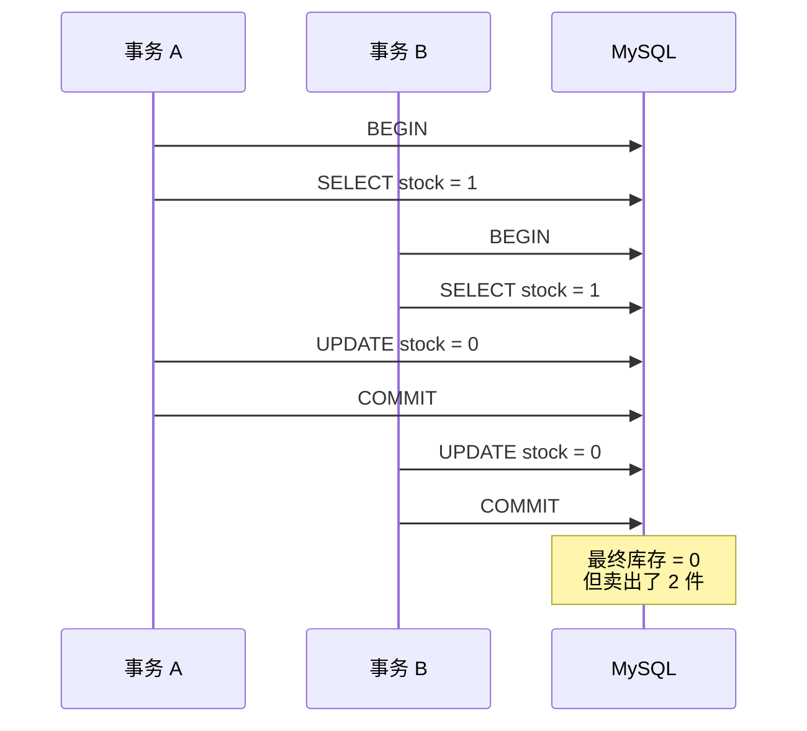
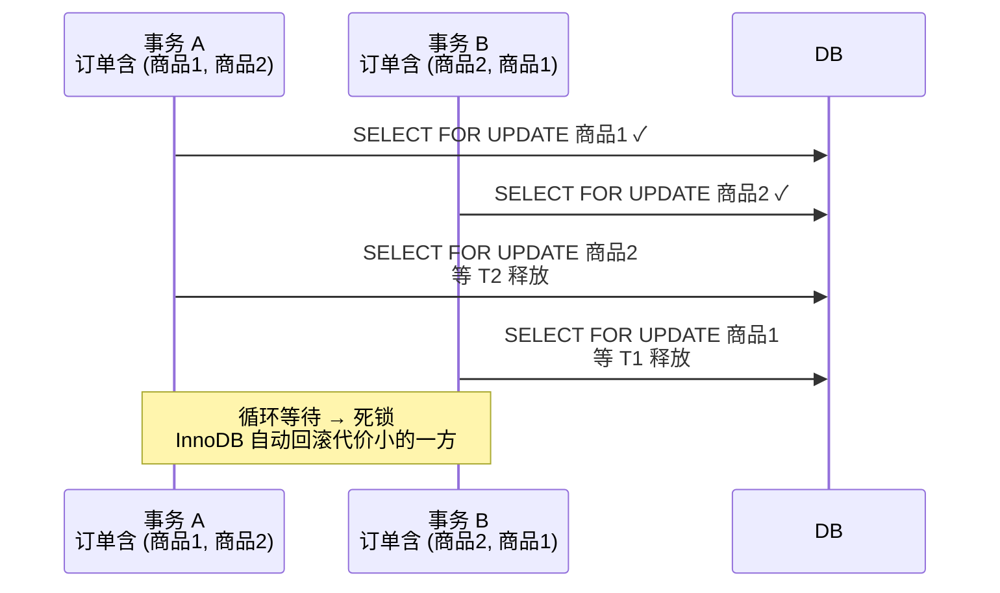
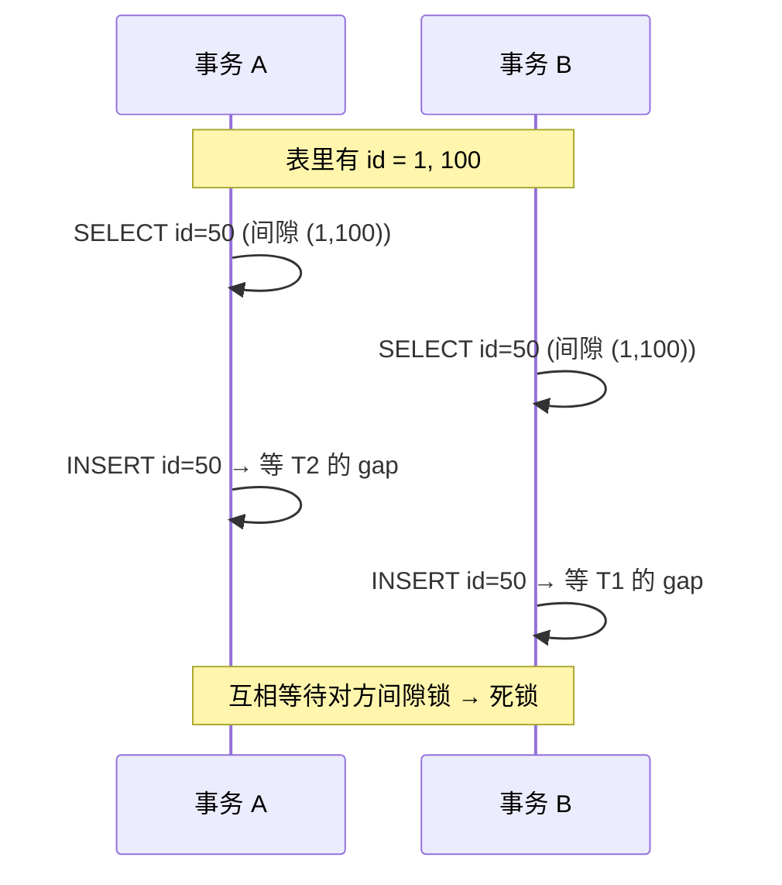
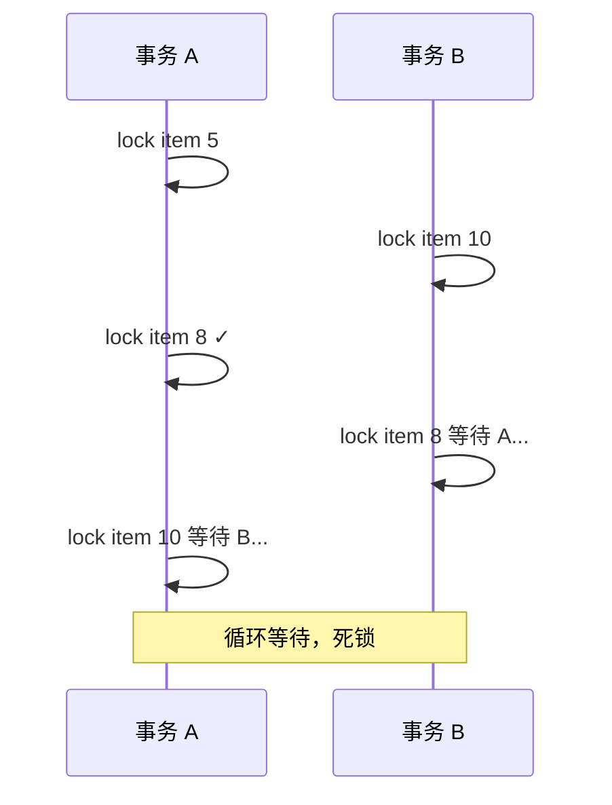
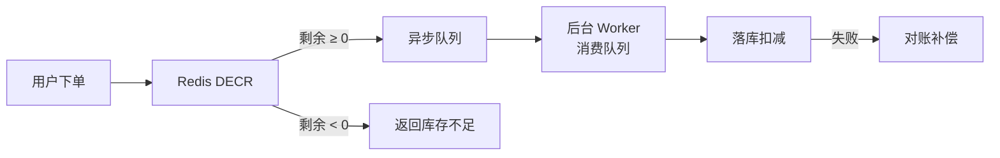
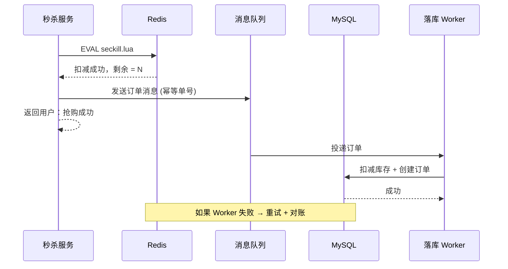

2019 年初做秒杀系统复盘时翻过十几起线上事故，超卖几乎占了一半。表面看是"库存扣成了负数"，往里追都是同一类问题：**多个请求同时读到同一个库存数，各自减 1 后写回去，结果卖了 10 件只扣了 1 次**。

这种 bug 在开发环境复现不出来，单线程测试一切正常；上了几千 QPS 立刻原形毕露。这篇文章想回答几个问题：为什么"先 SELECT 再 UPDATE"必然超卖？悲观锁、Redis 预扣、分段库存各自解决什么又引入什么？面对真实的库存扣减需求，怎么在四种方案里挑一个？
<!--more-->

## 一、超卖是怎么发生的

先看最直观的写法，也是绝大多数人第一次写出来的版本：

```sql
-- 业务伪代码
num = SELECT stock FROM item WHERE id = 1001;
if (num > 0) {
    UPDATE item SET stock = stock - 1 WHERE id = 1001;
    // 下单成功
}
```

在单线程下毫无破绽，但并发场景立刻翻车。假设 `stock = 1`，两个请求几乎同时进来：



两个事务都读到了 `stock = 1`，各自扣减后写回 0。结果就是**卖出 2 件只扣了 1 次**。这个问题不是 MySQL 的 bug，而是**应用层的"读改写"之间没有任何并发保护**。

### 1.1 RR 隔离级别救不了你

很多同学会反驳："我用 REPEATABLE READ（MySQL 默认级别），同一个事务里读两次应该看到一样的值啊？"

这正是 RR 的坑。RR 保证的是**同一个事务内一致性读（snapshot read）读到的是同一份快照**，但这里两个事务是各自独立的快照。事务 A 读到 1、事务 B 也读到 1，谁也没读"错"。

更阴险的是：如果在事务内部先 `SELECT ... FOR UPDATE`，再 SELECT 普通读，看到的还是旧版本（快照读不走锁读）。所以**事务隔离级别解决的是"我能不能看到别人改了一半的数据"，而不是"我能不能和别人同时改同一行"——后者要靠锁或者原子操作**。

## 二、方案一：悲观锁（SELECT FOR UPDATE）

既然读出来会被别人抢先，那就在读的时候就把行锁住。最直接的做法：

```sql
BEGIN;
SELECT stock FROM item WHERE id = 1001 FOR UPDATE;
-- 业务判断
UPDATE item SET stock = stock - 1 WHERE id = 1001;
COMMIT;
```

`SELECT ... FOR UPDATE` 会在满足条件的记录上加排他锁（X 锁），其他事务要修改这一行必须等锁释放。这就是**悲观锁**：假定一定会冲突，先抢锁再干活。

### 2.1 行锁的对象其实是索引

一个常见误区：以为 `WHERE id = 1001 FOR UPDATE` 锁的就是 `id = 1001` 这一行。其实 InnoDB 的锁是**加在索引记录上**的，加锁对象最终落到索引上：

| WHERE 条件 | 索引情况 | 锁范围 |
|-----------|---------|--------|
| `WHERE id = 1001`（主键） | 主键索引 | 仅 `id=1001` 这条记录 |
| `WHERE name = 'sku'` | `name` 有索引 | `name='sku'` 的记录 + 前后间隙（next-key lock） |
| `WHERE addr = 'x'` | **无索引** | **整张表的所有记录** |
| `WHERE id > 1000` | 主键 | 范围 + 间隙 |

最后一行是**最容易踩的坑**：`addr` 没建索引，结果你以为只锁一行，实际锁了整张表。线上有个真实案例，一个秒杀接口因为加了 `WHERE shop_id = ?` 但 `shop_id` 没索引，瞬时把全库的更新全部堵死。

可以用 `EXPLAIN` 快速判断锁粒度是否合理：

```sql
EXPLAIN SELECT * FROM item WHERE shop_id = 123 FOR UPDATE;
-- type = ALL / key = NULL → 危险，锁全表
-- type = ref / key = idx_shop_id → 正常
```

### 2.2 死锁与锁等待超时

悲观锁有两个随之而来的副作用。

**锁等待超时**：`innodb_lock_wait_timeout` 默认 50 秒。一个事务拿着行锁不释放，其他事务的 `FOR UPDATE` 会等到超时返回 `ERROR 1205 (HY000): Lock wait timeout exceeded`。秒杀场景下用户点完按钮 50 秒没响应，体验直接崩溃。

**死锁**：两个事务互相等对方手里的锁。看一个典型场景——多商品下单时按不同顺序加锁：



排查时查 `SHOW ENGINE INNODB STATUS`，日志里 `LATEST DETECTED DEADLOCK` 段是关键：

```
------------------------
LATEST DETECTED DEADLOCK
------------------------
TRANSACTION 4211, ACTIVE 0 sec starting index read
LOCK WAIT 5 lock struct(s), heap size 1136
*** (2) WAITING FOR THIS LOCK TO BE GRANTED:
RECORD LOCKS space id 16 page no 4 n bits 72 index PRIMARY of table `shop`.`item`
trx id 4211 lock_mode X locks gap before rec insert intention waiting
*** WE ROLL BACK TRANSACTION (2)
```

读法：先看 `WE ROLL BACK` 哪个事务（InnoDB 自动选代价小的回滚），再看两个 `WAITING FOR` 的锁分别在哪个表的哪个记录。多数情况下根本原因是**加锁顺序不一致**——事务 A 先锁商品1再锁商品2，事务 B 反过来。

**解法**：所有扣库存的逻辑按商品 ID 升序加锁。代码里先 `sort(goods_ids)` 再循环 `FOR UPDATE`。这个一行改动就能消除 80% 的死锁。

### 2.3 间隙锁（gap lock）的暗坑

RR 隔离级别下，`SELECT FOR UPDATE` 不只锁已存在的记录，还会锁记录之间的**间隙**。看一个例子：

```sql
-- 表 item 只有 id = 1, 5, 10 三条记录
BEGIN;
SELECT * FROM item WHERE id = 7 FOR UPDATE;
-- id = 7 不存在，但 InnoDB 在 (5, 10) 这个间隙加了 gap lock
-- 此时另一个事务 INSERT id = 8 会被阻塞
```

间隙锁的目的是配合 RR 解决幻读。代价是：**你对"不存在的记录"加锁，也可能死锁**。



这是线上很常见的一类死锁——两个事务都试图在同一个空位插入新行。解决办法是：**业务层用唯一约束去重**（后面幂等章节会展开），让冲突交给数据库而不是锁机制。

如果实在不想用 gap lock，可以临时切换到 READ COMMITTED：

```sql
SET SESSION TRANSACTION ISOLATION LEVEL READ COMMITTED;
-- RC 没有 gap lock，但失去幻读保护
```

生产环境慎用，除非业务明确能接受幻读代价。

## 三、方案二：乐观锁与原子更新

悲观锁把所有冲突都挡在前面，但代价是串行化——一行的并发度被锁死了。乐观锁换了个思路：**假定大多数人不会撞车，先无锁干活，提交时再判断**。

### 3.1 最被低估的方案：单条 UPDATE

```sql
UPDATE item SET stock = stock - 1 WHERE id = 1001 AND stock > 0;
-- 拿到 affected_rows：
--   1 = 扣减成功
--   0 = 库存不足，无需处理
```

这条 SQL 没有任何显式加锁，但它是**原子操作**：MySQL 在执行单条 UPDATE 时会自动加行锁，更新后再释放。整个"读改写"在数据库内部完成，没有应用层的空窗期。

判断成功的关键是 **affected_rows = 1**。MySQL 的官方驱动返回 `RowsMatched`（WHERE 命中的行数）和 `RowsChanged`（实际修改的行数）——这里要拿 `RowsChanged`，因为 `stock = 0` 时虽然匹配上 WHERE 但实际没有修改，返回 0。

这个方案比 `SELECT FOR UPDATE` 性能高一个量级，因为它把"读"和"写"合并到一次原子操作，省掉了一次网络往返和事务的额外开销。代价是不能在扣减前做复杂业务校验（比如"用户是否已领过"、"是否在活动期内"）——这些逻辑要在 WHERE 条件里表达。

### 3.2 版本号 CAS 的重试放大

如果业务逻辑必须"读出来后判断再写"，可以用经典的 CAS（Compare And Swap）模式：

```sql
-- 读
SELECT stock, version FROM item WHERE id = 1001;

-- 改（带版本号）
UPDATE item SET stock = stock - 1, version = version + 1
WHERE id = 1001 AND version = #{oldVersion};
```

如果 `affected_rows = 0` 说明版本号已经被别人改了，重试即可。

**坑在重试**。一个秒杀请求被重试 3 次，意味着后端实际处理了 4 次（1 次原始 + 3 次重试）。当几千个请求同时竞争同一个商品时，重试会把流量放大 3-5 倍，进一步加剧冲突，形成恶性循环。这就是所谓的**重试风暴（retry storm）**。

缓解办法：

1. **重试前必须重新 SELECT**，不能用第一次读到的 version，否则拿到的还是旧值
2. **指数退避 + 随机抖动**：`sleep = random(0, min(100ms, 50ms * 2^attempt))`，避免所有线程同一时刻重试
3. **限制最大重试次数**（3-5 次），失败就快速给用户返回"挤爆了请重试"，不要让请求无限挂起
4. **重试循环里的副作用要幂等**（发短信、调外部接口）——重试时不能发两次短信

```java
// Java 伪代码：标准乐观锁重试模板
int maxRetry = 3;
for (int attempt = 0; attempt < maxRetry; attempt++) {
    Item item = itemDao.findById(1001);
    if (item.stock <= 0) throw new OutOfStockException();

    int affected = itemDao.casDecrement(item.id, item.stock, item.version);
    if (affected == 1) return success();

    // 退避抖动
    Thread.sleep(ThreadLocalRandom.current().nextLong(50L * (1 << attempt)));
}
throw new RetryExhaustedException();
```

### 3.3 选哪个：单条 UPDATE 还是 CAS

大多数场景下**单条 UPDATE 更好**：

| 维度 | 单条原子 UPDATE | 版本号 CAS |
|------|----------------|------------|
| 代码复杂度 | 一行 SQL | 读 + 写 + 重试循环 |
| 网络往返 | 1 次 | 2 次 |
| 性能 | 高 | 中（有重试放大） |
| 业务前置校验 | 必须写成 WHERE | 可在应用层灵活判断 |
| 适用场景 | 简单扣减（如库存） | 需要应用层复杂判断 |

只有当你**确实需要在应用层做复杂判断**（比如"用户未参与过这个活动才能领"），才用 CAS。否则永远优先选单条 UPDATE。

## 四、死锁复盘：两个真实案例

死锁在悲观锁方案里几乎不可避免，这里系统过一遍两个最容易踩的。

### 4.1 多商品顺序死锁

前面举过的例子，本质是**加锁顺序不一致**。看现场代码：

```java
// 订单含商品 [10, 5, 8]，事务 A 和事务 B 顺序不同
public void deduct(List<Long> itemIds) {
    for (Long id : itemIds) {
        itemDao.lockById(id);     // 这里是雷区
        itemDao.deductStock(id);
    }
}
```

A 的订单是 `[5, 8, 10]`，B 的订单是 `[10, 5, 8]`，两个人同时跑：



修法：进入循环前先排序。

```java
List<Long> sortedIds = itemIds.stream().sorted().collect(toList());
for (Long id : sortedIds) itemDao.lockById(id);
```

一行 `sorted()`，消灭 80% 的多商品死锁。

### 4.2 间隙锁死锁（不存在的记录）

```sql
-- item 表 id 字段有唯一索引
-- 当前存在 id = 1, 100
BEGIN;
INSERT INTO item (id, stock) VALUES (50, 10);
-- 此时另一个事务同时插入 id = 50 → 互相等待 gap lock
```

这种死锁的根因是：业务把"判断记录是否存在"和"插入新记录"拆成两步了。**应该用唯一约束让数据库兜底**：

```sql
INSERT IGNORE INTO item (id, stock) VALUES (50, 10);
-- 或者
INSERT INTO item (id, stock) VALUES (50, 10) ON DUPLICATE KEY UPDATE stock = stock;
-- 应用层根据 affected_rows 判断是新增还是已存在
```

把"是否插入"的判断交给数据库唯一索引，应用层不再需要先 `SELECT ... FOR UPDATE` 再 INSERT，间隙锁的死锁自然消失。

## 五、方案三：Redis 预扣 + 异步落库

数据库悲观锁 / 乐观锁在几万 QPS 已经接近极限（行锁竞争、单点写入）。秒杀这种十万级 QPS 场景，必须把流量挡在数据库前面。

**Redis 预扣库存**是 2019 年最主流的方案：



### 5.1 Lua 脚本保证原子性

直接 `GET` + `DECR` 两次调用不是原子的，中间窗口可能被插队。要用 Lua 把"判断 + 扣减"打包：

```lua
-- seckill.lua
-- KEYS[1] = stock key, ARGV[1] = 扣减数量
local stock = tonumber(redis.call('GET', KEYS[1]))
if stock == nil then
    return -2  -- key 不存在，需要预热
end
if stock < tonumber(ARGV[1]) then
    return -1  -- 库存不足
end
redis.call('DECRBY', KEYS[1], ARGV[1])
return stock - tonumber(ARGV[1])  -- 返回剩余库存
```

Redis 执行 Lua 是**单线程串行**的，整个脚本看作一个原子操作。返回 -1 表示抢光，返回剩余库存让业务决定扣多少。Redis 5.0 之后的 `EVALSHA` 还能缓存脚本编译时间。

### 5.2 为什么 DECR 后为负还要回补

有人会问：`DECR` 把 key 减到 -3 也算"成功"返回了，那岂不是照样超卖？

是的，单纯 `DECR` 不够。**必须先判断再扣减**，所以脚本里是 `GET → if stock > 0 → DECRBY` 模式而不是裸 `DECR`。Lua 保证整个流程不会被插队，库存不足时直接返回 -1，不会扣。

但仍然有一个边界情况：Lua 脚本返回"扣减成功"后，应用层崩了 / 网络断了，**Redis 减了但下游业务没走完**。这种情况下库存确实"虚减"了，必须有回补机制：

```lua
-- 业务失败时主动回补
local stock = tonumber(redis.call('INCRBY', KEYS[1], ARGV[1]))
return stock
```

回补本身又是新的并发问题（一个请求扣减、一个请求回补，二者也可能竞争），所以一般会引入一个**预扣订单表**记录"正在处理中"的数量，超时未支付的订单由后台扫描回补 Redis 库存。

### 5.3 Redis 与 DB 的最终一致

Redis 是缓存层、不是数据源。Redis 减了 1，DB 必须最终也减 1。两者之间怎么同步？

**异步落库**：扣减 Redis 后，把订单消息扔进消息队列（Kafka / RocketMQ），后台 Worker 消费队列去 DB 扣减。这是最常见、扩展性最好的方案。



但异步落库引入了两个新问题：

1. **下单成功 ≠ DB 落库成功**：用户看到"抢购成功"，但库存可能因为 Worker 挂了没扣，最终超卖
2. **重复消费**：MQ 至少一次投递语义，Worker 必须幂等——同一个订单号重复扣两次库存

**对账补偿**是兜底。常见做法：

- 每隔一段时间跑离线对账：Redis 当前库存 = DB 历史总库存 - 已创建订单占用 - 在途订单占用
- 不一致时人工介入或自动修正（业务量大的公司会写自动化对账平台）

### 5.4 Redis 挂了怎么办

Redis 单点肯定不行，生产环境至少主从 + Sentinel，集群用 Redis Cluster。但主从切换瞬间（几秒钟）仍可能丢数据。

更稳的做法：**Redis 重启 / 故障时拒绝扣减**，不依赖 Redis 的最终一致性兜底。具体策略：

- Redis 健康检查失败 → 秒杀接口直接返回"系统繁忙"
- Redis 恢复后从 DB 重新加载库存（**冷启动要预热**）
- 预热过程分批进行（一次 `SET` 全量库存可能阻塞 Redis）

```java
// 启动时预热
List<Item> items = itemDao.findAllActive();
for (Item item : items) {
    redis.set("stock:" + item.getId(), item.getStock());
}
```

预热期间的请求**直接走 DB 的乐观锁方案**作为降级，库存同步完成后再切回 Redis 路径。

## 六、方案四：分段库存

Redis 方案解决了性能问题，但本质上仍是"一个 key 一个锁"。当几万人争抢同一个商品时，Redis 单 key 也成为瓶颈。

**分段库存**把一个商品的库存拆成 N 段，每段独立扣减：

```
原始库存: stock = 1000
拆成 10 段，每段 100：

stock:item:1001:0  = 100
stock:item:1001:1  = 100
stock:item:1001:2  = 100
...
stock:item:1001:9  = 100
```

用户请求**随机分配**到一段，扣减只锁这一段。10 段就有 10 个锁粒度，理论并发提升 10 倍。

```lua
-- 分段扣减脚本
-- KEYS[1] = 分段锁前缀, ARGV[1] = 段数, ARGV[2] = 扣减数量
local n = tonumber(ARGV[1])
local need = tonumber(ARGV[2])

-- 随机选一段
local idx = math.random(n)
local key = KEYS[1] .. ':' .. idx

-- 尝试扣减
local stock = tonumber(redis.call('GET', key))
if stock and stock >= need then
    redis.call('DECRBY', key, need)
    return stock - need
end

-- 当前段不足，按顺序找下一段
for i = 0, n-1 do
    local tryKey = KEYS[1] .. ':' .. ((idx + i) % n)
    local s = tonumber(redis.call('GET', tryKey))
    if s and s >= need then
        redis.call('DECRBY', tryKey, need)
        return s - need
    end
end

return -1  -- 全部段都不足
```

### 6.1 引入的新问题

分段方案让性能起飞，但也带来几个新麻烦：

**剩余判断变复杂**。原来的"是否还有库存"看一个 key 就够了，现在要遍历所有段求和：

```lua
local total = 0
for i = 0, n-1 do
    local s = tonumber(redis.call('GET', KEYS[1] .. ':' .. i))
    if s then total = total + s end
end
return total
```

段数越多，遍历越慢。一般用 N=10 ~ 50 平衡。

**尾部碎片**。假设每段 100、总共 10 段，最后剩 53 件分布在某几段里。如果某一段的请求量很少，库存可能一直卖不出去。要么按段轮询调度（前面 Lua 那种"按顺序找下一段"），要么定期做**段合并**。

**动态合并**。运行时如果某段已经清零，可以把这个段的容量分给其他段。或者反过来，热点商品临时扩容（10 段不够 → 扩到 50 段），冷门商品回收段。

### 6.2 分段 vs 单 key 实测

某次双十一压测数据（4C8G Redis，单商品 1 万库存）：

| 方案 | QPS 上限 | P99 延迟 |
|------|---------|---------|
| 单 key Lua | ~5 万 | 1.2ms |
| 10 段 Lua | ~30 万 | 2.5ms |
| 50 段 Lua | ~80 万 | 4ms |

分段提升明显但延迟也增加。量级没到 50 万 QPS 之前不要分段——维护复杂度不值得。

## 七、幂等这条暗线：网络重试的兜底

四种方案都在解决并发扣减，还有一个并行的暗线问题：**网络重试下同一个请求可能被处理两次**。客户端发了一个"扣 1 件"的请求，因为超时重发了一次，服务器扣了两次。

看一段典型的秒杀请求生命周期：客户端 → 负载均衡 → 秒杀服务 → Redis 扣减 → 落库。网络抖动导致客户端超时重发，**同一个扣减请求被处理两次**。客户端重试合理，但服务端如果不防重就是超卖。

**解法**：用唯一业务单号 + 数据库唯一索引兜底。

```sql
-- 订单表 orders 加唯一约束
CREATE TABLE orders (
    id BIGINT PRIMARY KEY AUTO_INCREMENT,
    order_no VARCHAR(64) NOT NULL UNIQUE,  -- 业务单号
    item_id BIGINT NOT NULL,
    quantity INT NOT NULL,
    created_at DATETIME
);
```

应用层生成全局唯一的 `order_no`（可以用 UUID、雪花算法、客户端 ID + 时间戳），每次扣减都带这个单号：

```sql
-- 1. 先插订单，捕获重复错误
INSERT INTO orders (order_no, item_id, quantity) VALUES (?, ?, ?);

-- 2. 如果返回 Duplicate entry (1062) → 是重复请求，跳过扣减
-- 3. 否则扣减库存
UPDATE item SET stock = stock - ? WHERE id = ? AND stock >= ?;
```

`order_no` 唯一约束是**最后一道防线**：哪怕所有并发方案都失效，重复请求也只会被处理一次。

这个原则同样适用于 Redis 方案——订单消息必须带唯一单号，Worker 落库前先 `INSERT IGNORE` 判断是否已处理过。

## 八、方案决策表

四个方案不是替代关系，是按量级递进的工具。决策依据有三个维度：**QPS 量级、一致性要求、运维复杂度**。

| 方案 | 适用 QPS | 一致性 | 复杂度 | 典型场景 |
|------|---------|--------|--------|---------|
| **乐观原子 UPDATE** | < 1k | 强一致 | 低 | 普通电商下单、活动报名 |
| **悲观锁 FOR UPDATE** | < 500 | 强一致 | 低 | 多商品组合扣减、库存精确对齐 |
| **Redis 预扣 + 异步落库** | 1k ~ 10 万 | 最终一致 | 中 | 秒杀、抢购、热门票务 |
| **分段库存 + 异步落库** | 10 万+ | 最终一致 | 高 | 春节红包、明星演唱会门票 |

### 8.1 几个常见选择的误区

**上来就上 Redis**：很多团队秒杀量才几百 QPS 就引入 Redis 预扣，结果一致性 bug 不断（Redis 和 DB 对不上）、运维成本飙升。**先从单条原子 UPDATE 起步**，性能不够再加悲观锁，量级到几千才考虑 Redis。

**Redis 方案不写对账**：上线 Redis 预扣但不写对账脚本，等出事故才发现库存对不上。**对账是 Redis 方案的标配**，不是可选项。

**分段库存解决所有热点**：分段只解决"单 key 竞争"，解决不了"Redis 整体被打满"。Redis Cluster 满载时还是要回到应用层限流 + 排队。

### 8.2 推荐的演进路径

**阶段 1**：单条原子 UPDATE（绝大多数业务的终点）→ **阶段 2**：悲观锁 / 乐观 CAS（强一致 + 复杂校验）→ **阶段 3**：Redis Lua 预扣 + 异步落库 + 对账（QPS 上万）→ **阶段 4**：分段库存（十万级热点）。

每一步升级都引入新问题——阶段 2 引入死锁、阶段 3 引入一致性、阶段 4 引入碎片。不要跳阶段直接上方案 4。

## 九、收尾

回到开头的本质问题：**超卖不是 MySQL 的 bug，而是"读改写"之间缺一个原子边界**。这个边界可以是数据库的行锁、可以是 WHERE 条件里的判断、可以是 Lua 脚本、也可以是分段拆 key。选哪个取决于量级和一致性要求。

四种方案没有银弹。**真正决定系统稳定性的，往往不是方案本身，而是你把哪个幂等约束写在数据库里**——应用层的兜底都可能被绕过，唯一索引是最后一道闸门。