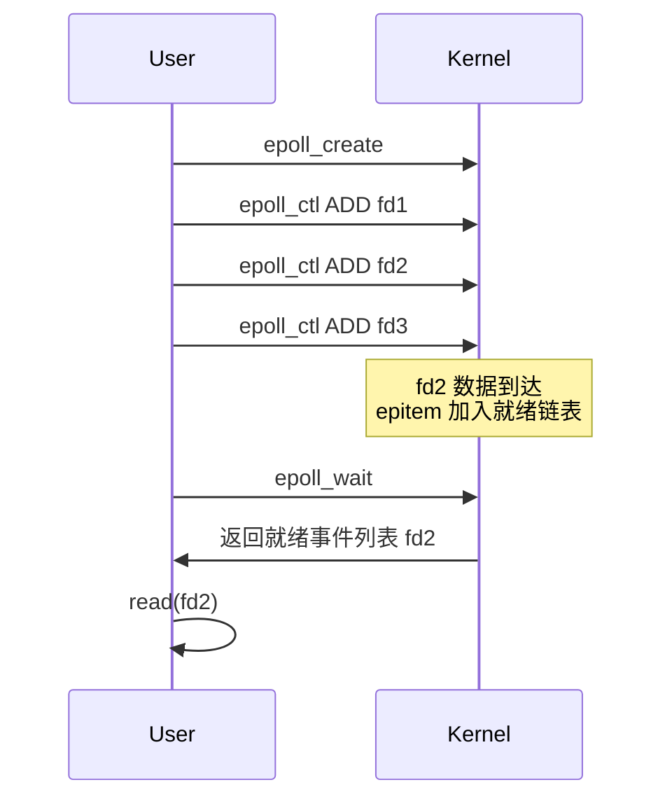
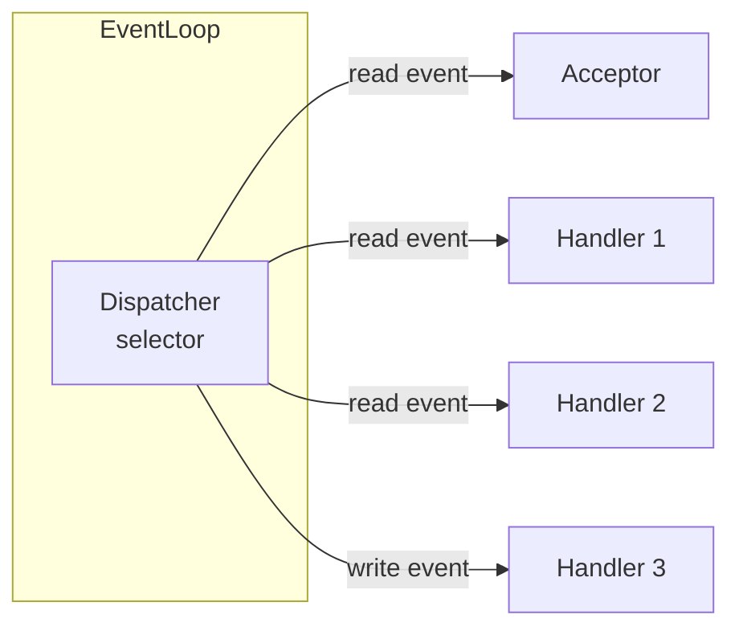
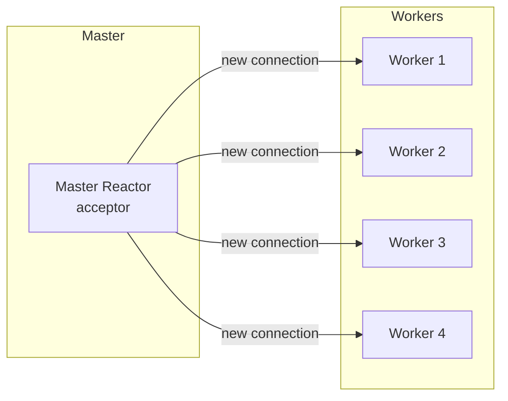

Linux 下 IO 处理方式的选择直接决定了网络服务的并发能力。从早期的 `accept + recv` 阻塞循环，到 select、poll，再到 epoll/kqueue，再到 Node.js / Redis / Nginx / Netty 共同采用的 Reactor 模式——这是一条清晰的能力升级路线。本文逐层拆解。

## 一个具体场景

服务端伪代码：

```python
fd = listen()
while True:
    client = accept(fd)         # 阻塞 1：等待连接
    while True:
            req = recv(client)   # 阻塞 2：等待数据
            resp = handle(req)
            send(client, resp)  # 阻塞 3：等待发送完成
```

每个连接都阻塞在某个操作上，要支持 1 万并发就要 1 万个线程。这就是 C10K 问题的根源。

## 五种 IO 模型

POSIX 标准定义了五种 IO 模型，对比维度是**等待数据 vs 等待内核**。

```mermaid
graph TB
    subgraph "blocking IO"
    A1[recv 调用] --> A2[数据未到达]
    A2 --> A3[阻塞等待]
    A3 --> A4[数据到达 + 内核拷贝]
    A4 --> A5[用户进程处理]
    end

    subgraph "non-blocking IO"
    B1[recv 调用] --> B2[数据未到达]
    B2 --> B3[立即返回 EAGAIN]
    B3 --> B4[轮询]
    B4 --> B5[数据到达 + 内核拷贝]
    B5 --> B6[用户进程处理]
    end

    subgraph "IO multiplexing"
    C1[select/epoll] --> C2[阻塞等待任意 fd 可读]
    C2 --> C3{指定 fd 准备就绪}
    C3 -->|是| C4[recv 调用]
    C4 --> C5[数据到达 + 内核拷贝]
    C5 --> C6[用户进程处理]
    end

    subgraph "signal-driven IO"
    D1[sigaction 注册 SIGIO] --> D2[继续做其他事]
    D2 --> D3[内核数据到达发出信号]
    D3 --> D4[recv 阻塞等待内核拷贝]
    D4 --> D5[用户进程处理]
    end

    subgraph "async IO"
    E1[aio_read] --> E2[立即返回]
    E2 --> E3[进程继续运行]
    E3 --> E4[内核完成后发信号]
    E4 --> E5[用户进程处理已就绪数据]
    end
```



关键区分点：**同步 vs 异步**。判断标准是"**真正的 I/O 拷贝阶段是否由内核完成并通知我们**"。

- 前四种都是同步 IO（进程需要亲自参与数据拷贝）
- 第五种（aio）是真正的异步 IO（内核完成所有事再通知进程）

实际工程上 aio 用得不多，因为 Linux 的 aio 性能/兼容性问题较多。Reactor 模式基于**IO 多路复用 + 同步非阻塞 IO**——形式上是同步 IO，但通过多路复用避免了线程等待。

## 多路复用：select / poll / epoll

### select

```c
int select(int nfds, fd_set *readfds, fd_set *writefds,
           fd_set *exceptfds, struct timeval *timeout);
```

- 用 bitmap 记录 fd，最大 1024（FD_SETSIZE）
- 每次调用都把 fd_set **从用户态拷贝到内核态**
- 内核遍历所有 fd 检查就绪状态
- **复杂度 O(N)**

### poll

```c
int poll(struct pollfd *fds, nfds_t nfds, int timeout);
```

- 用链表/数组代替 bitmap，突破 1024 上限
- 其他问题与 select 相同：**每次调用都遍历所有 fd**

### epoll（Linux 2.6+）

```c
int epoll_create(int size);
int epoll_ctl(int epfd, int op, int fd, struct epoll_event *event);
int epoll_wait(int epfd, struct epoll_event *events, int maxevents, int timeout);
```

epoll 是**事件驱动 + 回调**的革命：



关键差异：

- **epoll_ctl 注册**：fd 注册一次，内核用红黑树维护，后续无需重复传递
- **epoll_wait 返回**：只返回**就绪的 fd**，无需遍历全部
- **mmap 共享**：就绪列表通过 mmap 共享，避免拷贝
- **复杂度 O(就绪 fd 数)**：N 个 fd 中只有 K 个就绪时复杂度 O(K)

| 维度 | select | poll | epoll |
|---|---|---|---|
| 最大 fd 数 | 1024 | 无限制 | 无限制 |
| fd 集合拷贝 | 每次都拷贝 | 每次都拷贝 | 注册一次 |
| 遍历复杂度 | O(N) | O(N) | O(K) |
| 触发方式 | LT | LT | LT / ET |

ET（边缘触发）模式要求 fd 是非阻塞的，且**必须一次把数据读完**，否则只能等下次新数据到达才唤醒。这是 Netty / Nginx 的默认设置。

### kqueue（BSD/macOS）

BSD 系系统的事件驱动接口，与 epoll 类似但 API 更干净：

```c
int kqueue(void);
int kevent(int kq, const struct kevent *changelist, int nchanges,
           struct kevent *eventlist, int nevents,
           const struct timespec *timeout);
```

用 `EVFILT_READ` / `EVFILT_WRITE` 等过滤器组织事件。libevent 抽象层兼容 select/poll/epoll/kqueue。

## 非阻塞 IO 与阻塞 IO

多路复用配合**非阻塞 IO**才能发挥威力：

```c
fcntl(fd, F_SETFL, O_NONBLOCK);  // 设置非阻塞
```

```python
# 阻塞模式
data = recv(fd, 4096)  # 数据没到就一直等

# 非阻塞模式
while True:
    data = recv(fd, 4096)
    if data == b'':
        break  # EOF
    if errno == EAGAIN:
        continue  # 重试
    process(data)
```

非阻塞 IO + 多路复用 = **单线程处理多连接**——这就是 C10K 解法的核心。

## Reactor 模式

把多路复用 + 非阻塞 IO 抽象成设计模式，就是 **Reactor 模式**（也叫反应器）。



三个核心角色：

1. **Reactor（Dispatcher）**：监听多路复用器，分发就绪的 fd 给对应 handler
2. **Acceptor**：处理新连接的 handler，通常绑定 `listen_fd` 的读事件
3. **Handler**：处理读写事件的对象，每个连接一个

经典实现（Python 伪代码）：

```python
class Reactor:
    def __init__(self):
        self.selector = selectors.DefaultSelector()
        self.handlers = {}

    def register(self, fd, handler, events):
        self.handlers[fd] = handler
        self.selector.register(fd, events, data=handler)

    def run(self):
        while True:
            events = self.selector.select()
            for key, mask in events:
                handler = key.data
                if mask & selectors.EVENT_READ:
                        handler.read()
                    if mask & selectors.EVENT_WRITE:
                        handler.write()

class Acceptor:
    def __init__(self, reactor, sock):
        self.reactor = reactor
        self.sock = sock
        reactor.register(sock.fileno(), self, selectors.EVENT_READ)

    def read(self):
        client, addr = self.sock.accept()
        EchoHandler(self.reactor, client)

class EchoHandler:
    def __init__(self, reactor, sock):
        self.reactor = reactor
        self.sock = sock
        reactor.register(sock.fileno(), self, selectors.EVENT_READ)

    def read(self):
        data = self.sock.recv(4096)
        if not data:
            self.close()
            return
        self.reactor.register(self.sock.fileno(), self, selectors.EVENT_WRITE)

    def write(self):
        self.sock.send(self.buffer)
        self.reactor.register(self.sock.fileno(), self, selectors.EVENT_READ)
```

## 多 Reactor 模式（Master-Worker）

单线程 Reactor 处理简单协议足够，但面对计算密集型或耗时的 handler 时会成为瓶颈。Master-Worker 模式把连接**分发**到多个 worker Reactor：



- **Master**：单线程，专门处理 `accept`
- **Workers**：N 个线程，各自一个 Reactor 处理读写
- Nginx、Netty、Memcached 都采用这种模式

## 实战框架分析

- **Redis**：单线程 Reactor，配 aof/rdb 持久化子进程
- **Nginx**：Master + Worker 进程，每个 Worker 内是单 Reactor
- **Netty**：支持主从 Reactor，并自带协议编解码器
- **Node.js**：单 Reactor + 任务队列（回调地狱之源）
- **Go net**：goroutine-per-connection，看似无 Reactor，实则 runtime 调度

## Proactor 模式

Windows 下没有 epoll，但有 **IOCP**——真正的异步 IO。对应 Proactor 模式：


区别在于：Reactor 是**应用主动 read**，Proactor 是**应用注册 read，内核完成后通知**。Linux 5.1+ 引入的 `io_uring` 也朝这个方向走。

## 性能优化要点

1. **LT vs ET**：ET 性能更好但编程易错
2. **非阻塞 + 一次读完**：避免水平触发下的忙轮询
3. **避免 fd 频繁创建**：用连接池或对象池
4. **CPU 亲和性**：绑核减少 cache miss
5. **批量处理**：多个事件合并唤醒（如 `epoll_pwait2`）

## 参考资料

- W. Richard Stevens《UNIX 网络编程 卷 1：套接字联网 API》
- 《Linux 高性能服务器编程》—— 游双
- libevent、Netty、libuv 源码
- 阮一峰：[Socket.IO 模型对比](http://www.ruanyifeng.com/blog/2018/05/king-c10k.html)