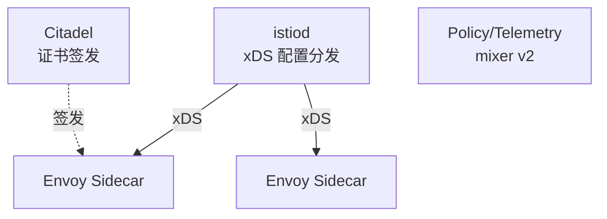
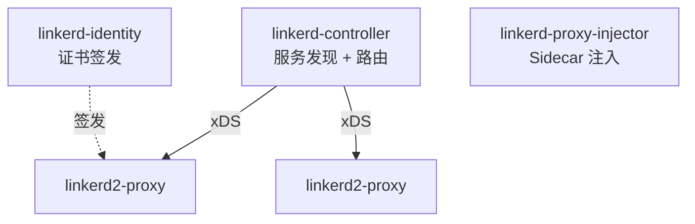
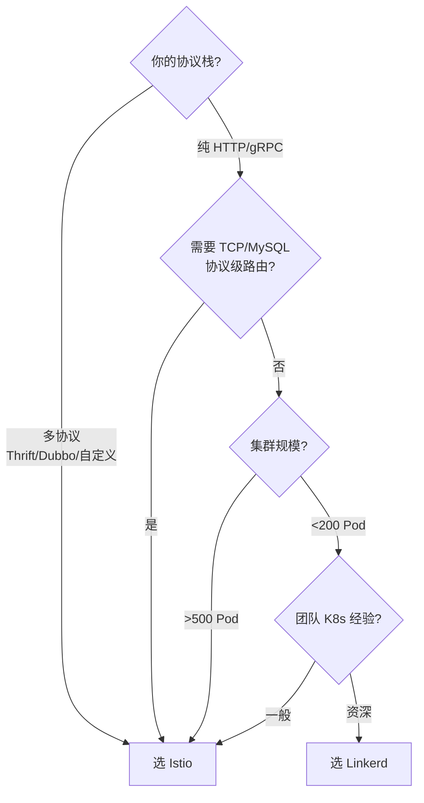

2021 年我们要把一个 200+ Pod 的电商中台从 Spring Cloud 迁到 K8s，团队吵了一个月：上 Istio 还是 Linkerd 2？Istio 阵营说"功能完整、生态成熟"，Linkerd 阵营说"轻量、内存省一半"。后来我们两个都跑了 PoC，性能数据出来那一刻，会议就结束了。

服务网格不是"装上就完事"的中间件，它会侵入每一个 Pod 的网络栈。一旦选型失误，团队会被 Sidecar 的资源开销、可观测性盲区、运维复杂度反复折磨。本文从数据平面、控制平面、性能、运维四个维度，给出工程取舍。

<!--more-->

## 一、数据平面：Envoy vs linkerd2-proxy

服务网格的核心是 Sidecar 代理。它拦截进出 Pod 的所有流量，做路由、加密、可观测。Istio 选 Envoy，Linkerd 选自研 Rust 代理 —— 这是两个项目最根本的分歧。


### Istio 数据平面：Envoy（C++）

Envoy 由 Lyft 开源，2017 年被 Istio 采用，是目前事实上的"网格代理标准"。它的优势：

- **生态最强**：几乎所有 L7 代理场景（HTTP/gRPC/Redis/Kafka）都有官方 filter
- **配置 API 丰富**：`EnvoyFilter` 让你能微调几乎每一个 Envoy 配置字段
- **多语言 Wasm 插件**：1.11 起 `WasmPlugin` API 进入 alpha，可以热加载 Rust/Go/AssemblyScript 编写的扩展
- **多协议支持**：HTTP/1.1、HTTP/2、gRPC、Thrift、Dubbo、TCP 全覆盖

代价是体积和资源：

- Envoy 镜像 ~150MB
- 每个 Pod Sidecar 内存 ~154 MB（PoC 实测）
- 启动时间 1-2 秒（Pod 起来后流量要等 Sidecar 就绪）

### Linkerd 数据平面：linkerd2-proxy（Rust）

Linkerd 团队从一开始就没选 Envoy。他们用 Rust + Tokio + Hyper + Tower 写了 `linkerd2-proxy`，目标只有一个："只做服务网格需要做的事"。

- **专用代理**：不为通用 L7 代理设计，砍掉了 Envoy 90% 的 filter，只保留 mesh 必需的协议（HTTP/1.1、HTTP/2、gRPC）
- **零配置默认**：协议检测、TLS、metrics 全部开箱即用，不需要 CRD 调优
- **极小镜像**：基于 distroless 基础镜像，最终 ~30MB
- **Sidecar 内存**：~17-26 MB（PoC 实测，2.10/2.11 不同版本）

代价是灵活性：

- 不支持 TCP/MySQL/Redis 协议级别的细粒度路由（只走 L4 TCP 转发）
- 插件生态比 Envoy 弱一个数量级，扩展只能改 Rust 源码（2.x 起支持 `extension` 机制，但还不成熟）
- 多协议（Thrift/Dubbo）场景直接不支持

## 二、控制平面：复杂度 vs 简洁度

数据平面是"前线士兵"，控制平面是"指挥部"。Istio 的控制平面是出了名的复杂。

### Istio 控制平面

istiod（Pilot + Citadel + Galley 合并）+ 可选的 Ingress/Egress Gateway：



关键 CRD：`VirtualService`、`DestinationRule`、`ServiceEntry`、`Gateway`、`EnvoyFilter`、`PeerAuthentication`、`AuthorizationPolicy` 七个起步。

### Linkerd 控制平面

三个组件：`linkerd-controller`（Go）、`linkerd-identity`（证书）、`linkerd-proxy-injector`（注入）。



关键 CRD：`ServiceProfile`（按服务的 metrics 切片）、`Server`、`AuthorizationPolicy`、`MeshTLSAuthentication` 四个就够。

**复杂度差异**：Istio 控制平面 HA 至少需要 3 副本 istiod + 监控它自身；Linkerd 3 副本 + Identity 是独立组件可以缩到 2 副本。我们的 PoC 集群规模下，Istio 控制平面内存 ~600-800 MB，Linkerd ~320 MB。

## 三、性能对比（PoC 数据）

这是我们 PoC 的实测（2021 年 5 月，CNCF 发布的基准同样基于这套环境）：

| 指标 | Istio 1.10 | Linkerd 2.10/2.11 | 倍数差 |
|------|-----------|-------------------|--------|
| Sidecar 内存（稳态） | ~154 MB | ~17-26 MB | Istio ~6-8x |
| Sidecar CPU 时间 | 67-88 ms / 1000 req | 10-36 ms / 1000 req | Istio ~3-8x |
| 中位延迟增量 | +17 ms | +6 ms | Istio ~3x |
| P99 延迟增量 | +253-350 ms | +42-47 ms | Istio ~5-8x |
| 控制平面内存 | ~600-800 MB | ~320 MB | Istio ~2-2.5x |

**数据来源**：[Linkerd 官方基准（2021/05）](https://linkerd.io/2021/05/27/linkerd-vs-istio-benchmarks) 与 [CNCF 复测（2021/12）](https://www.cncf.io/blog/2021/12/17/benchmarking-linkerd-and-istio-2021-redux)。要注意基准由 Linkerd 维护者（Buoyant）发起，但 CNCF 的独立复测结论一致。

性能差异主要来自两个原因：

1. **语言差异**：C++ Envoy 功能丰富但代码量大；Rust linkerd2-proxy 砍掉了大量非 mesh 功能，体积小一个数量级
2. **协议解析深度**：Envoy 支持完整 HTTP/2、gRPC、Thrift 解析；linkerd2-proxy 只解析到 mesh 必需程度（请求级 metrics、Header 透传），不做 body 解析

## 四、功能差异：何时选 Istio

我们最后还是选了 Istio。原因不是性能，而是功能矩阵：

| 场景 | Istio | Linkerd 2 |
|------|-------|-----------|
| HTTP/gRPC 流量管理（金丝雀、A/B、镜像） | 完整 | 完整 |
| TCP/MySQL/Redis 协议级路由 | EnvoyFilter 可调 | 只走 L4 |
| Wasm 插件热加载 | 1.11 起 WasmPlugin alpha | 不支持 |
| 多协议（Thrift/Dubbo） | 支持 | 不支持 |
| AuthorizationPolicy（细粒度 RBAC） | L4+L7 | L4 起步 |
| 多集群网格（东西向） | 支持 | 2.10+ 引入实验性 |
| 可视化（Kiali / dashboard） | Kiali | dashboard + viz |

**性能不是唯一指标**。当我们梳理出 30+ 个微服务里有 8 个是 Thrift、3 个是自定义 TCP 协议时，Linkerd 直接出局 —— 它根本看不到这些流量的内容，谈不上治理。

## 五、选型决策树



简化版结论：

- **团队小、协议简单（纯 Web 业务）、想快速落地** → Linkerd（开箱即用，3 个 CRD 就能上手）
- **多协议、需要 Wasm 扩展、需要细粒度 L7 控制** → Istio（接受复杂度换能力）

## 六、实战建议与常见坑

### 1. Sidecar 注入的边界

Istio 用 namespace label（`istio-injection=enabled`）自动注入，但有些 Pod 不想被注入（DaemonSet、监控 agent）：

```yaml
apiVersion: v1
kind: Pod
metadata:
  name: log-collector
  annotations:
    sidecar.istio.io/inject: "false"
spec:
  containers:
    - name: fluent-bit
      image: fluent/fluent-bit:1.7
```

Linkerd 同样支持通过 `linkerd.io/inject: disabled` annotation 关掉注入。

### 2. mTLS 的"先关再开"

PoC 阶段千万别一上来就开全局 mTLS。先用 `PERMISSIVE` 模式，让 mesh 自动协商：

```yaml
apiVersion: security.istio.io/v1beta1
kind: PeerAuthentication
metadata:
  name: default
  namespace: istio-system
spec:
  mtls:
    mode: PERMISSIVE  # 既接受 mTLS 也接受明文，便于排障
```

稳定后再切 `STRICT`。

### 3. 控制平面 HA

生产环境 istiod 至少 3 副本 + PodDisruptionBudget：

```yaml
apiVersion: policy/v1
kind: PodDisruptionBudget
metadata:
  name: istiod
spec:
  minAvailable: 2
  selector:
    matchLabels:
      app: istiod
```

Linkerd 同理，controller 至少 2 副本（Identity 是单点的，建议 3 副本跨节点）。

### 4. EnvoyFilter 是双刃剑

Istio 的 `EnvoyFilter` 可以改几乎一切 Envoy 配置，但官方明确警告："非必要不用"。每次 Istio 升级，EnvoyFilter 可能失效。我们有一次升级 1.10 → 1.11，自定义 EnvoyFilter 直接导致 Sidecar 启动失败 —— 因为 1.11 重构了一部分 Envoy bootstrap。

替代方案是等价的 `WasmPlugin` API（1.12 GA），用 Wasm 扩展代替 EnvoyFilter。

## 七、小结

Istio 与 Linkerd 2 的差异，本质是"通用 L7 代理"与"专用 mesh 代理"的权衡：

- **Istio**：把 Envoy 这个"瑞士军刀"塞进每个 Pod，换来协议全覆盖和扩展能力，代价是 6-8x 的内存和 3-8x 的 CPU
- **Linkerd**：用 Rust 写一个"只为切菜"的刀，每个 Pod 省 100+ MB，代价是不支持非 HTTP 协议

我们的 200+ Pod 电商中台最终选了 Istio —— 因为业务里有 8 个 Thrift + 3 个自定义 TCP 共 11 个非 HTTP 服务，Linkerd 看不到这些流量的内容，谈不上治理。但如果是纯 Web 业务、追求资源效率，Linkerd 2 是更轻松的选择。

参考：

- [Linkerd 2.11 发布公告](https://linkerd.io/2021/09/30/announcing-linkerd-2.11/)
- [Istio 1.11 发布公告](https://istio.io/latest/news/releases/1.11.x/announcing-1.11)
- [Linkerd vs Istio 基准测试（2021/05）](https://linkerd.io/2021/05/27/linkerd-vs-istio-benchmarks)
- [CNCF 基准复测（2021/12）](https://www.cncf.io/blog/2021/12/17/benchmarking-linkerd-and-istio-2021-redux)