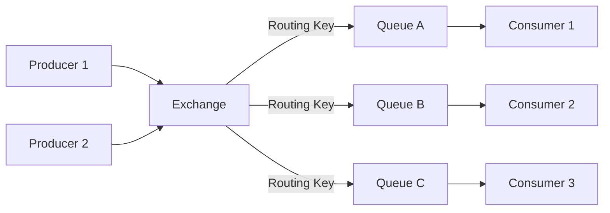
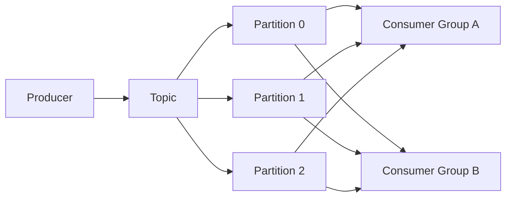
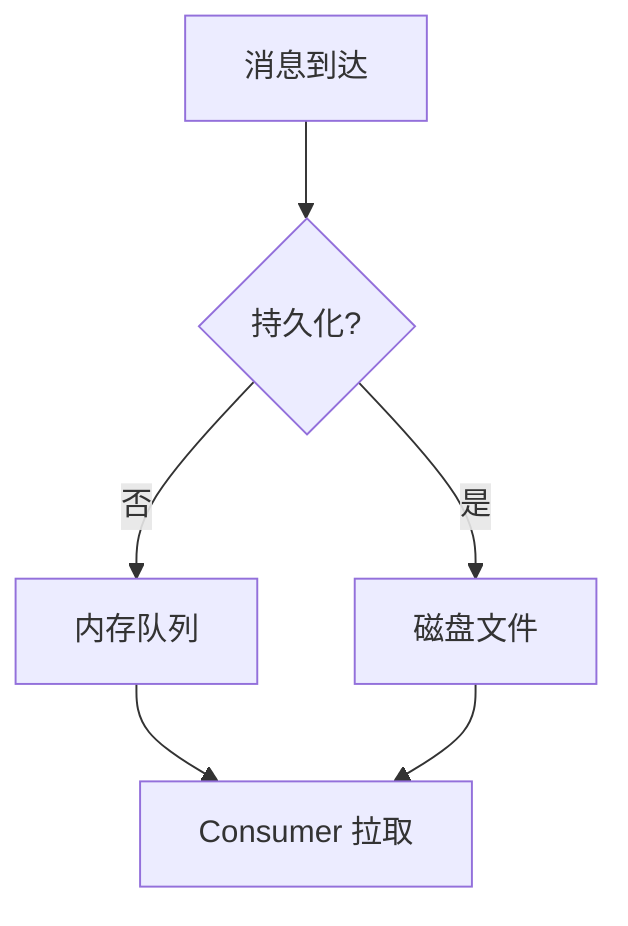
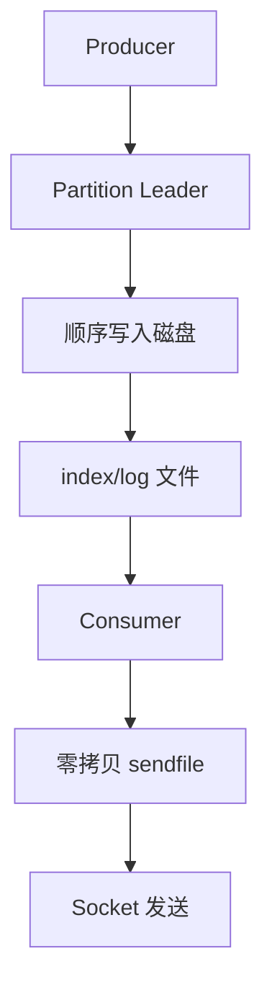
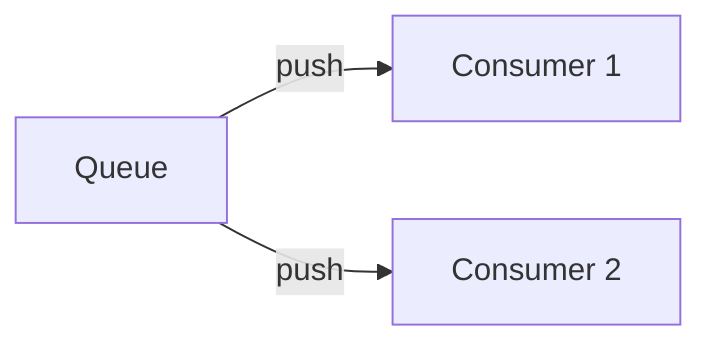
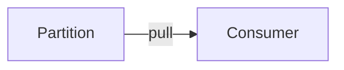
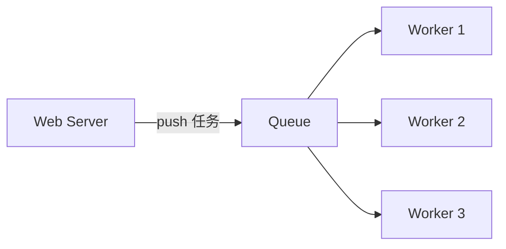
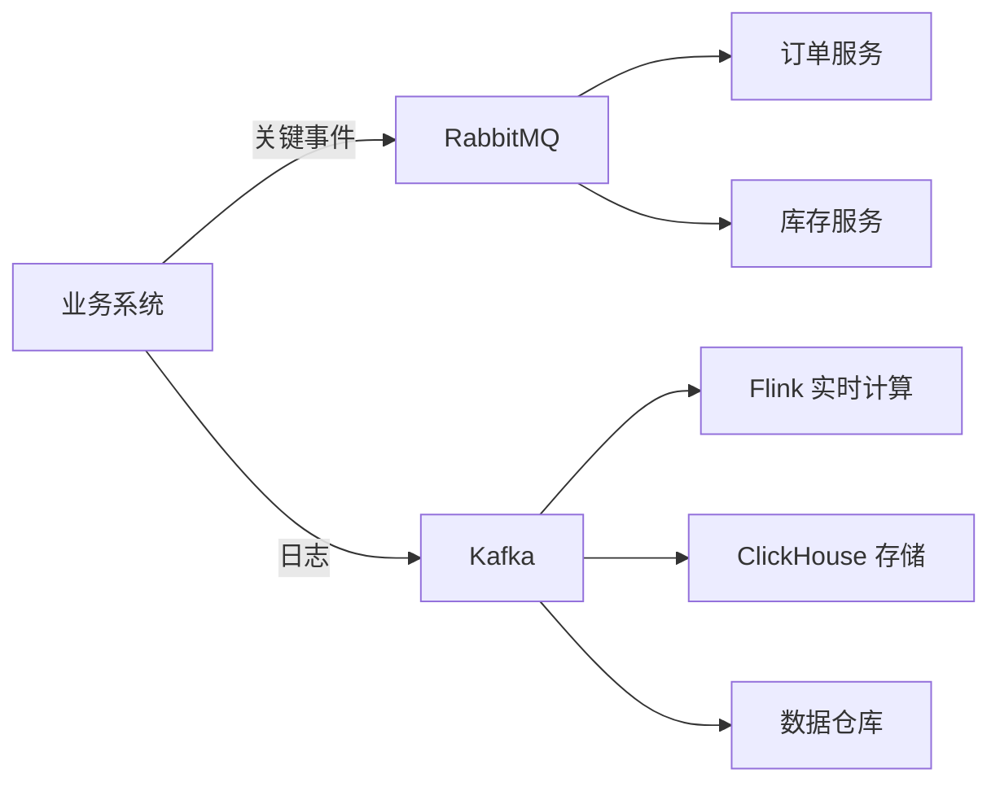

面试常被问"消息队列用哪个"——但 Kafka 和 RabbitMQ 不是"谁替代谁"的关系，它们是**两种完全不同的设计哲学**：Kafka 是分布式日志，RabbitMQ 是智能交换机。

把 Kafka 当成"消息队列"用，就像把 Git 当成 SVN 用——能跑，但不是它擅长的方式。本文从设计哲学出发，彻底理解两者的差异。

<!--more-->

## 一、消息模型的本质区别

### 1.1 RabbitMQ：智能路由 + 临时队列



**RabbitMQ 模型：**

- Producer 把消息发给 **Exchange**（交换机）
- Exchange 根据**路由规则**（Direct/Topic/Fanout/Headers）把消息分发到不同 **Queue**
- Consumer 从 Queue 取消息，**消费后删除**（消息离开队列）
- 队列本质是**临时存储**——消息被消费就消失

### 1.2 Kafka：分布式日志 + 持久化存储



**Kafka 模型：**

- Producer 把消息追加到 **Topic** 的某个 **Partition**
- 消息在 Partition 内**按顺序持久化**（写入磁盘），有明确的 **Offset**（偏移量）
- Consumer 通过提交 Offset 记录消费进度，**消息本身不被删除**（可配置保留时间）
- 不同的 **Consumer Group** 各自维护 Offset，可以**独立消费**同一份数据

### 1.3 核心差异对比

| 维度 | RabbitMQ | Kafka |
|------|----------|-------|
| 核心抽象 | Exchange + Queue | Topic + Partition |
| 消息生命周期 | 消费后删除 | 持久化（可配置保留期） |
| 路由能力 | 丰富（4 种 Exchange 类型） | 简单（按 key 分区） |
| 消息顺序 | 队列内有序 | Partition 内有序 |
| 多消费者 | 多个队列（每消费者一队列） | 多个 Consumer Group |
| 重读历史 | ❌ 不支持（消息已删除） | ✅ 支持（按 Offset 重读） |

## 二、设计哲学的根本分歧

### 2.1 RabbitMQ：智能 broker + dumb consumer

RabbitMQ 的设计哲学：**broker 负责消息分发，consumer 只需要消费**。

- Exchange 决定消息去哪
- Queue 决定谁能消费
- Consumer 拿到消息就是"我的"，处理完即 ack，消息消失

这种模型的好处：

- Consumer 简单，拿到即用
- 灵活的路由（topic 匹配、header 匹配）
- 天然适合**任务分派**（任务执行完即结束）

### 2.2 Kafka：dumb broker + smart consumer

Kafka 的设计哲学：**broker 只管存储，consumer 自己决定怎么读**。

- Producer 决定写到哪个 Partition（可以按 key）
- broker 不管谁消费，**只追加日志**
- Consumer 自己维护 Offset，控制消费位置
- 一份数据可被多个 Consumer Group **独立消费**

这种模型的好处：

- 高吞吐（顺序写盘 + 零拷贝）
- 历史回放（按 Offset 重新读）
- 流式处理友好（消息是事件流，可重放）

## 三、存储机制：内存 vs 磁盘

### 3.1 RabbitMQ 的存储

RabbitMQ 默认把消息存到**内存队列**，速度极快。当消息持久化时（`delivery_mode=2`），写入磁盘文件。



**问题：**

- 队列长度受内存限制
- 大消息（MB 级）会严重拖慢队列
- 磁盘 IO 是性能瓶颈

### 3.2 Kafka 的存储

Kafka 把消息**顺序写入磁盘**，并通过零拷贝（`sendfile`）实现高速读。



**关键设计：**

- 消息顺序追加到 `.log` 文件
- 每 4KB（默认）形成一段 Segment
- Consumer 读取时，**broker 用 `sendfile()` 把磁盘文件直接发给 consumer**，无需经过用户态
- 单机可达 **百万级 TPS**

### 3.3 顺序写的优势

机械磁盘顺序写速度 ≈ 内存随机写速度（两者都在 100MB/s 量级）。SSD 顺序写甚至更快。Kafka 利用这个特性：

```text
普通磁盘顺序写：~100-200 MB/s
普通磁盘随机写：~1-2 MB/s
SSD 顺序写：~500-1000 MB/s
```

这就是 Kafka 即使把数据写盘，吞吐量依然吊打 RabbitMQ 的根本原因。

## 四、消费模式

### 4.1 RabbitMQ：Push 模型



- broker **主动推送**消息给 Consumer
- Consumer 启动时告诉 broker 自己的 prefetch count
- broker 按 prefetch 数量推送

**优点：**

- 实时性好（消息到达立即推送）
- Consumer 简单，不用轮询

**缺点：**

- 推送速率和 Consumer 处理能力不匹配时容易堆积
- Consumer 崩溃时，broker 需要重新推送（但有 ack 机制保护）

### 4.2 Kafka：Pull 模型



- Consumer **主动拉取**消息
- Consumer 控制拉取速率（批量大小、超时时间）
- broker 不关心 Consumer 处理速度

**优点：**

- Consumer 可以按处理能力消费
- 批量拉取提高吞吐
- 天然支持 Offset 控制（重读历史、回退）

**缺点：**

- 实时性稍差（拉取有延迟）
- Consumer 端要做更多工作（Offset 管理）

### 4.3 一对多广播：实现方式对比

**RabbitMQ：**

```text
方式 1：用 Fanout Exchange，所有消费者绑同一个 Exchange
方式 2：每消费者一个独立 Queue，所有 Queue 绑同一个 Exchange
```

**Kafka：**

```text
每个 Consumer 用独立的 Group ID
- Group A 消费 Topic X 的所有消息
- Group B 独立消费 Topic X 的所有消息
- 同一 Group 内 Partition 互斥消费
```

Kafka 的方式更简洁——**消费者自己决定 Group ID**，broker 不用知道消费方是谁。

## 五、消息可靠性

### 5.1 RabbitMQ 的可靠性保证

**生产者端：**

- Publisher Confirms：发送后等待 broker 确认
- 失败重试

**broker 端：**

- 持久化（`delivery_mode=2`）
- 镜像队列（Mirror Queue）：副本机制

**消费者端：**

- 手动 ack：业务处理成功后才 ack
- 如果 Consumer 崩溃，broker 会重新投递

### 5.2 Kafka 的可靠性保证

**生产者端：**

- `acks=all`：所有副本都写入才返回成功
- `acks=1`：leader 写入即返回（默认）
- `acks=0`：发送即返回（最快但不安全）

**broker 端：**

- 副本机制（replication factor）
- `min.insync.replicas`：最少同步副本数

**消费者端：**

- 手动提交 Offset
- 至少一次 / 最多一次语义（取决于提交时机）

### 5.3 关键差异

| 维度 | RabbitMQ | Kafka |
|------|----------|-------|
| 消息丢失场景 | broker 故障 + 未持久化 | broker 故障 + acks 不当 |
| 消息重复场景 | 重新投递 | 提交 Offset 前重启 |
| Exactly-once | 难实现（事务支持有限） | Kafka 0.11+ 支持事务 |

## 六、性能对比

### 6.1 吞吐量

| 场景 | RabbitMQ | Kafka |
|------|----------|-------|
| 消息大小 1KB | ~10K TPS | ~100K-1M TPS |
| 批量发送 | 不擅长 | 极强 |
| 万级消费者 | 性能下降 | 影响小 |

**Kafka 高吞吐的关键：**

- 顺序写盘（磁盘顺序 IO）
- 零拷贝（`sendfile` / `mmap`）
- Page Cache（操作系统页缓存）
- 批量发送和压缩

### 6.2 延迟

- RabbitMQ：端到端延迟 **1-5ms**（内存队列）
- Kafka：端到端延迟 **5-50ms**（取决于刷盘策略）

低延迟场景 RabbitMQ 略优。但 Kafka 通过 `acks=0` 可以做到毫秒级。

## 七、典型应用场景

### 7.1 选 RabbitMQ 的场景

**1. 任务队列**



- 邮件发送、短信推送、图片处理
- 任务执行完即结束，不需要回放

**2. RPC 风格通信**

- 服务间同步消息
- 需要灵活路由（按服务名、优先级）

**3. WebSocket 推送**

- pub/sub 模式（Fanout Exchange）
- 消息到达立即推送

**4. 业务关键消息**

- 订单状态变更通知
- 实时性优先于吞吐

### 7.2 选 Kafka 的场景

**1. 日志采集**

- 业务日志、用户行为日志、监控数据
- 海量数据写入、低成本存储

**2. 事件溯源（Event Sourcing）**

- 业务状态变化全部以事件形式持久化
- 支持历史回放、状态重建

**3. 流式处理**

- 与 Storm / Spark Streaming / Flink 集成
- 实时计算、数据管道

**4. 消息回溯**

- 消费者需要重新处理历史消息
- 新业务接入需要消费全部数据

**5. 监控埋点**

- 业务指标、APM 数据
- 高吞吐写入 + 多系统订阅

### 7.3 选型决策表

| 业务场景 | 推荐 | 原因 |
|---------|------|------|
| 异步任务执行 | RabbitMQ | 简单任务队列 |
| 日志采集 | Kafka | 高吞吐 + 持久化 |
| 实时通知推送 | RabbitMQ | 低延迟 + pub/sub |
| 事件溯源 | Kafka | 持久化 + 回放 |
| 微服务通信 | RabbitMQ | 灵活路由 + 低延迟 |
| 大数据流处理 | Kafka | 高吞吐 + 生态 |
| WebSocket fanout | RabbitMQ | 即时推送 |
| 监控数据管道 | Kafka | 多消费者 |

## 八、混用模式

实际生产中，两者经常**混用**：



- **关键业务消息**（订单、支付）→ RabbitMQ
- **海量数据**（日志、埋点、事件流）→ Kafka

## 九、运维对比

| 维度 | RabbitMQ | Kafka |
|------|----------|-------|
| 集群管理 | 内置（Erlang 集群） | 依赖 ZooKeeper（KRaft 后可免） |
| 监控 | Management 插件 | JMX + 第三方（Kafka Manager） |
| 客户端库 | 各类语言成熟 | 各类语言成熟 |
| 部署复杂度 | 中 | 中高 |
| 调优难度 | 中 | 高（参数多） |

Kafka 的运维复杂度主要在：

- 副本数和 ISR 管理
- Partition 数量规划（影响并行度）
- 磁盘容量规划（消息保留期）
- Consumer Group 状态管理

## 十、总结

| 维度 | RabbitMQ | Kafka |
|------|----------|-------|
| 设计哲学 | 智能 broker | 智能 consumer |
| 核心抽象 | Exchange + Queue | Topic + Partition |
| 存储 | 内存优先 | 磁盘持久化 |
| 消费模式 | Push | Pull |
| 吞吐量 | 中等（万级 TPS） | 极高（百万级 TPS） |
| 延迟 | 极低（毫秒级） | 低（毫秒级） |
| 历史回放 | 不支持 | 原生支持 |
| 路由 | 灵活 | 简单 |
| 适用场景 | 任务队列、RPC、推送 | 日志、流处理、事件溯源 |

**一句话总结：**

- RabbitMQ 适合**消息需要被处理一次**的场景
- Kafka 适合**消息需要被消费多次**的场景

## 参考资料

- [Apache Kafka 官方文档](https://kafka.apache.org/documentation/)
- [RabbitMQ 官方文档](https://www.rabbitmq.com/docs)
- [Kafka vs RabbitMQ - Confluent Comparison](https://www.confluent.io/learn/kafka-vs-rabbitmq/)
- [Designing Data-Intensive Applications (Chapter 11)](https://dataintensive.net/)

## 更新记录

- **2018 年**：本文首次发表，Kafka 1.0 / RabbitMQ 3.7 时代
- **2019 年**：Kafka 2.0 发布，性能优化（Exactly-once 完善）
- **2020 年**：Kafka 2.5+ 移除 ZooKeeper 依赖（KIP-500，KRaft 模式）
- **2021 年**：RabbitMQ 3.9 引入 Streams（类 Kafka 模型），功能融合
- **2022 年**：Kafka 3.3+ KRaft 模式生产可用，简化部署
- **2023 年**：Pulsar / Redpanda 等新方案崛起，Kafka 仍是事实标准
